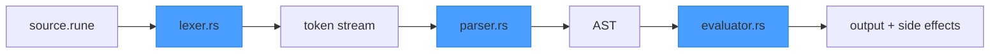
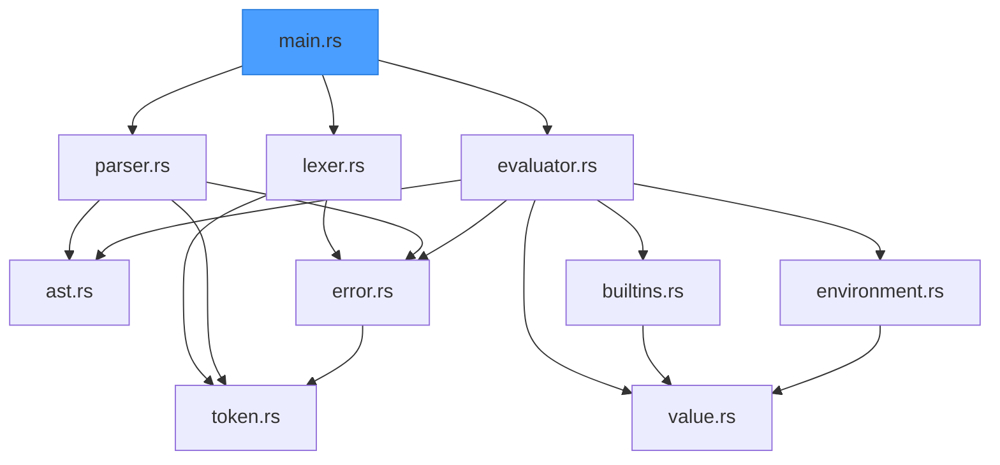

# Reference Guide — Runescript Interpreter

> *A grimoire of quick-reference tables for the Rust Runescript course. Keep this open while you code — it's your spell index.*

This guide covers every Rust concept, language rule, and interpreter term used across the course. When you forget how `match` works or what "binding power" means, look here first.

---

## Table of Contents

1. [Rust Cheat Sheet](#1-rust-cheat-sheet)
2. [Interpreter Glossary](#2-interpreter-glossary)
3. [Operator Precedence Table](#3-operator-precedence-table)
4. [BNF Grammar Reference](#4-bnf-grammar-reference)
5. [Runescript Built-in Function Reference](#5-runescript-built-in-function-reference)
6. [Common Rust Patterns for Interpreters](#6-common-rust-patterns-for-interpreters)
7. [Runescript Error Reference](#7-runescript-error-reference)
8. [Project File Map](#8-project-file-map)

---

## 1. Rust Cheat Sheet

Every Rust concept used in the course, with Python/TS equivalents. If you know one, you can read the other.

### Variables

| Rust | Python | TypeScript |
|------|--------|------------|
| `let x = 5;` | `x = 5` | `const x = 5;` |
| `let mut x = 5;` | `x = 5` (all mutable) | `let x = 5;` |
| `let x: i64 = 5;` | `x: int = 5` | `const x: number = 5;` |

Rust variables are **immutable by default**. Use `let mut` when you need to reassign. The compiler will tell you if you forgot `mut`.

### Functions

```rust
fn heal(target: &mut i64, amount: i64) -> i64 {
    *target += amount;
    *target  // last expression is the return value (no semicolon!)
}
```

```python
def heal(target: list, amount: int) -> int:
    target[0] += amount
    return target[0]
```

```typescript
function heal(target: { hp: number }, amount: number): number {
    target.hp += amount;
    return target.hp;
}
```

Key difference: Rust functions return the **last expression** if it has no semicolon. Adding a semicolon turns it into a statement that returns `()` (unit / void).

### Enums (Sum Types)

```rust
enum Value {
    Int(i64),
    Str(String),
    Bool(bool),
    Nil,
}
```

```python
# Python has no direct equivalent — you'd use a tagged union or class hierarchy
@dataclass
class IntVal:
    value: int
@dataclass
class StrVal:
    value: str
# ... and a type alias: Value = IntVal | StrVal | BoolVal | NilVal
```

```typescript
type Value =
    | { tag: "int"; value: number }
    | { tag: "str"; value: string }
    | { tag: "bool"; value: boolean }
    | { tag: "nil" };
```

Rust enums are the **core data structure** for interpreters. Each variant can carry different data. The compiler forces you to handle every variant in a `match`.

### Structs

```rust
struct Span {
    line: usize,
    col: usize,
}

let s = Span { line: 1, col: 5 };
println!("Line {}", s.line);
```

```python
@dataclass
class Span:
    line: int
    col: int
```

```typescript
interface Span { line: number; col: number; }
```

### Match (Pattern Matching)

```rust
match token.kind {
    TokenKind::IntLit(n) => println!("Got integer: {n}"),
    TokenKind::Plus      => println!("Got plus"),
    TokenKind::Ident(s)  => println!("Got ident: {s}"),
    _                    => println!("Something else"),
}
```

```python
match token.kind:
    case IntLit(n):  print(f"Got integer: {n}")
    case Plus():     print("Got plus")
    case _:          print("Something else")
```

```typescript
switch (token.tag) {
    case "int_lit": console.log(`Got integer: ${token.value}`); break;
    case "plus":    console.log("Got plus"); break;
    default:        console.log("Something else");
}
```

`match` is exhaustive — the compiler errors if you miss a variant. The `_` wildcard catches everything else.

### Option and Result

```rust
// Option — a value that might not exist
let found: Option<&Value> = env.get("hp");
match found {
    Some(val) => println!("Found: {:?}", val),
    None      => println!("Not found"),
}

// Result — an operation that might fail
fn parse(input: &str) -> Result<Expr, RuneError> {
    // ...
    Ok(expr)       // success
    Err(error)     // failure
}
```

| Rust | Python | TypeScript |
|------|--------|------------|
| `Option<T>` → `Some(val)` / `None` | `Optional[T]` → `val` / `None` | `T \| undefined` |
| `Result<T, E>` → `Ok(val)` / `Err(e)` | return or `raise` | return or `throw` |

### The `?` Operator (Error Propagation)

```rust
fn parse_program(&mut self) -> Result<Vec<Stmt>, RuneError> {
    let expr = self.parse_expression()?;  // if Err, return it immediately
    let stmt = self.parse_statement()?;   // same — early return on error
    Ok(vec![stmt])
}
```

```python
# Python equivalent: just let exceptions propagate naturally
def parse_program(self):
    expr = self.parse_expression()  # raises on error
    stmt = self.parse_statement()   # raises on error
    return [stmt]
```

The `?` operator unwraps `Ok(val)` or returns `Err(e)` from the current function. It's Rust's version of exception propagation, but explicit and type-checked.

### Box (Heap Allocation)

```rust
enum Expr {
    Binary(BinOp, Box<Expr>, Box<Expr>),  // recursive — needs Box
    IntLit(i64),                           // not recursive — no Box needed
}

let expr = Expr::Binary(
    BinOp::Add,
    Box::new(Expr::IntLit(1)),
    Box::new(Expr::IntLit(2)),
);
```

Why `Box`? Rust needs to know the size of every type at compile time. An `Expr` that contains another `Expr` would be infinitely sized. `Box<Expr>` is a pointer (fixed size) to a heap-allocated `Expr`.

Python/TS don't need this — everything is already heap-allocated and reference-counted/garbage-collected.

### Vec (Dynamic Array)

```rust
let mut enemies: Vec<String> = Vec::new();
enemies.push("Husk".to_string());
enemies.push("Wraith".to_string());
println!("Count: {}", enemies.len());  // 2
let first = &enemies[0];               // borrow a reference
```

| Rust | Python | TypeScript |
|------|--------|------------|
| `Vec<T>` | `list` | `Array<T>` |
| `v.push(x)` | `v.append(x)` | `v.push(x)` |
| `v.len()` | `len(v)` | `v.length` |
| `&v[i]` | `v[i]` | `v[i]` |

### HashMap

```rust
use std::collections::HashMap;

let mut scope: HashMap<String, Value> = HashMap::new();
scope.insert("hp".to_string(), Value::Int(100));

if let Some(val) = scope.get("hp") {
    println!("HP is {:?}", val);
}
```

| Rust | Python | TypeScript |
|------|--------|------------|
| `HashMap<K, V>` | `dict` | `Map<K, V>` |
| `m.insert(k, v)` | `m[k] = v` | `m.set(k, v)` |
| `m.get(&k)` → `Option<&V>` | `m.get(k)` / `m[k]` | `m.get(k)` |

### String vs &str

| Type | What it is | Analogy |
|------|-----------|---------|
| `String` | Owned, heap-allocated, growable | Python `str` / JS `string` (you own it) |
| `&str` | Borrowed slice — a view into a String or literal | A read-only reference, like a pointer |

```rust
let owned: String = "hello".to_string();  // you own this data
let borrowed: &str = &owned;              // just looking at it
let literal: &str = "world";              // string literals are &str

fn greet(name: &str) {                    // functions usually take &str
    println!("Hello, {name}");
}
greet(&owned);    // &String auto-converts to &str
greet(literal);   // &str works directly
```

Rule of thumb: **store `String`, accept `&str`**. Struct fields and enum variants use `String`. Function parameters use `&str` when they only need to read.

### Ownership and Borrowing

The three rules:

1. **Every value has one owner.** When the owner goes out of scope, the value is dropped (freed).
2. **You can have either** one mutable reference (`&mut T`) **or** any number of immutable references (`&T`) — never both at the same time.
3. **References must always be valid** — no dangling pointers.

```rust
let s = String::from("rune");
let r = &s;          // immutable borrow — OK, s is still usable
println!("{r}");      // fine
println!("{s}");      // fine — multiple immutable borrows allowed

let mut s = String::from("rune");
let r = &mut s;       // mutable borrow — exclusive access
r.push_str("script"); // fine
// println!("{s}");    // ERROR — can't use s while r has exclusive access
println!("{r}");       // fine — use through the mutable reference
```

When the compiler complains about ownership, it's usually one of:
- **"value moved"** — you used a value after giving it away. Fix: `.clone()` or borrow with `&`.
- **"cannot borrow as mutable"** — something else is already borrowing it. Fix: restructure to avoid overlapping borrows.

### Closures

```rust
let double = |x: i64| x * 2;
println!("{}", double(21));  // 42

let mut items = vec![3, 1, 2];
items.sort_by(|a, b| a.cmp(b));
```

```python
double = lambda x: x * 2
items.sort(key=lambda x: x)
```

Closures in Rust capture variables from their environment. The compiler infers whether they borrow or move the captured values. In this course, closures appear mainly in iterator chains and sort functions — Runescript itself doesn't have closures.

### Traits

```rust
trait Display {
    fn fmt(&self, f: &mut Formatter) -> fmt::Result;
}

impl Display for Value {
    fn fmt(&self, f: &mut Formatter) -> fmt::Result {
        match self {
            Value::Int(n)  => write!(f, "{n}"),
            Value::Str(s)  => write!(f, "{s}"),
            Value::Bool(b) => write!(f, "{b}"),
            Value::Nil     => write!(f, "nil"),
            _ => write!(f, "<value>"),
        }
    }
}
```

| Rust | Python | TypeScript |
|------|--------|------------|
| `trait` | ABC / protocol | `interface` |
| `impl Trait for Type` | `class Foo(Protocol)` | `class Foo implements Bar` |
| `#[derive(Debug)]` | auto-generated `__repr__` | — |

Traits define shared behavior. `#[derive(...)]` auto-implements common traits. You'll implement `Display` for `Value` so `print()` knows how to show runtime values.

---

## 2. Interpreter Glossary

> *Know the names of the spells before you cast them.*

These terms appear throughout the course. Each gets a plain-English definition, then how it maps to Runescript.

| Term | Definition |
|------|-----------|
| **Lexer** (Rune Carver) | The first stage of the interpreter pipeline. Reads raw source text character by character and produces a stream of **tokens**. In Runescript, `lexer.rs` scans `.rune` files and emits `Token` values. Think of it as splitting a sentence into words — but for code. |
| **Parser** (Grimoire Binder) | The second stage. Reads the token stream and builds an **AST** (abstract syntax tree) that represents the program's structure. Runescript uses recursive descent with Pratt parsing for expressions. The parser lives in `parser.rs`. |
| **Evaluator** (Spell Caster) | The third and final stage. Walks the AST and executes it — computing values, calling functions, updating variables. Runescript's evaluator is a tree-walking interpreter in `evaluator.rs`. No bytecode, no VM — just recursive function calls over tree nodes. |
| **AST** (Abstract Syntax Tree) | A tree data structure that represents the program's structure after parsing. Each node is an operation (like `Binary(Add, left, right)`) and its children are sub-expressions. "Abstract" because it drops syntax details like parentheses and semicolons — only meaning survives. Defined in `ast.rs`. |
| **Token** (Rune) | The smallest meaningful unit of source code. A token has a **kind** (what it is — integer literal, keyword, operator) and a **span** (where it appeared). `let` is one token. `42` is one token. `>=` is one token. Defined in `token.rs`. |
| **Span** | A source location: line number and column number. Every token and AST node carries a span so error messages can point to the exact position in the `.rune` file. `Span { line: 3, col: 12 }` means line 3, column 12. |
| **Scope Chain** | The evaluator's mechanism for variable lookup. Each `{ }` block creates a new scope (a `HashMap<String, Value>`). When you look up a variable, the evaluator searches from the innermost scope outward. This is why a variable inside a function doesn't clash with one outside it. Implemented in `environment.rs`. |
| **Pratt Parsing** | An expression parsing technique where each operator has a **binding power** (a number representing precedence). The parser uses binding power to decide whether to keep building the current expression or stop and return. Invented by Vaughan Pratt in 1973. Elegant, fast, and perfect for hand-written parsers. |
| **Binding Power** | A numeric value assigned to each operator that determines how tightly it "binds" to its operands. Higher binding power = higher precedence. `*` (binding power 7) binds tighter than `+` (binding power 6), so `1 + 2 * 3` parses as `1 + (2 * 3)`. Used by the Pratt parser. |
| **Tree-Walking Interpreter** | An interpreter that executes code by recursively walking the AST. For each node, it calls the appropriate evaluation function — `eval_binary`, `eval_if`, `eval_call`, etc. Simple to implement, easy to debug, but slower than bytecode VMs. This is what Runescript uses. |
| **Panic-Mode Recovery** | An error recovery strategy for parsers. When the parser hits a syntax error, it "panics" — skipping tokens until it finds a synchronization point (like `;`, `}`, or a keyword like `let`). This lets the parser report multiple errors in one pass instead of stopping at the first one. |
| **Recursive Descent** | A parsing technique where each grammar rule becomes a function. `parse_if_stmt()` calls `parse_expression()` which calls `parse_binary()` and so on — the call stack mirrors the grammar's structure. Runescript uses recursive descent for statements and Pratt parsing for expressions. |
| **Prefix Operator** | An operator that appears before its operand: `-x` (negation), `!flag` (logical not). In Pratt parsing, prefix operators are handled by `parse_prefix()` — they consume the operator token, then parse the operand. |
| **Infix Operator** | An operator that appears between two operands: `a + b`, `x == y`, `hp > 0`. In Pratt parsing, infix operators are handled by `parse_infix()` — they take the already-parsed left side and parse the right side. |
| **Left Associativity** | When operators of equal precedence group left-to-right. `1 - 2 - 3` parses as `(1 - 2) - 3`. Most binary operators are left-associative. In Pratt parsing, left-associative operators use `left_bp + 1` as the minimum binding power for the right side. |
| **Right Associativity** | When operators of equal precedence group right-to-left. `a = b = 5` parses as `a = (b = 5)`. Assignment is the main right-associative operator in Runescript. In Pratt parsing, right-associative operators use `left_bp` (not `+1`) for the right side. |
| **Truthiness** | Rules for which values count as "true" in conditions. In Runescript: `0`, `""`, `nil`, `false`, and empty arrays are falsy. Everything else is truthy. Defined in the evaluator — `if` and `while` use truthiness to decide which branch to take. |
| **String Interpolation** | Embedding expressions inside string literals using `{expr}` syntax. `"HP: {hp}"` becomes `"HP: 85"` at runtime. The lexer emits the raw string with `{}` markers; the evaluator resolves them by looking up variables and converting values to strings. |
| **Runtime Value** | The result of evaluating an expression. In Runescript, runtime values are the `Value` enum: `Int(i64)`, `Str(String)`, `Bool(bool)`, `Array(Vec<Value>)`, `Nil`, `Function{...}`, `Object(HashMap)`. Defined in `value.rs`. |
| **Built-in Function** (Cantrip) | A function implemented in Rust, not Runescript. Built-ins like `print`, `len`, `random`, and the game functions (`spawn_enemy`, `damage`) are pre-registered in the global scope before user code runs. Defined in `builtins.rs`. |
| **REPL** | Read-Eval-Print Loop. An interactive mode where you type Runescript one line at a time and see results immediately. Type `let hp = 100`, press Enter, then `hp - 15` and see `85`. The REPL maintains state between lines — variables and functions persist across inputs. |

---

## 3. Operator Precedence Table

> *The binding power of each rune determines which spells resolve first.*

Operators listed from **lowest** precedence (loosest binding) to **highest** (tightest binding). Higher-precedence operators "grab" their operands first.

| Level | Operators | Associativity | Binding Power | Example | Parses As |
|-------|-----------|---------------|---------------|---------|-----------|
| 1 | `=` | Right | 1 | `a = b = 5` | `a = (b = 5)` |
| 2 | `\|\|` | Left | 2 | `a \|\| b \|\| c` | `(a \|\| b) \|\| c` |
| 3 | `&&` | Left | 3 | `a && b && c` | `(a && b) && c` |
| 4 | `==` `!=` | Left | 4 | `a == b != c` | `(a == b) != c` |
| 5 | `<` `<=` `>` `>=` | Left | 5 | `a < b >= c` | `(a < b) >= c` |
| 6 | `+` `-` | Left | 6 | `1 + 2 - 3` | `(1 + 2) - 3` |
| 7 | `*` `/` `%` | Left | 7 | `2 * 3 / 4` | `(2 * 3) / 4` |
| 8 | `!` `-` (unary) | Right (prefix) | 8 | `!-x` | `!(-x)` |
| 9 | `.` `()` `[]` | Left (postfix) | 9 | `a.b[0]()` | `((a.b)[0])()` |

**How to read this in Pratt parsing terms:**

- The "Binding Power" column is the numeric value used in `parse_expression(min_bp)`.
- Left-associative operators pass `left_bp + 1` as the right-side minimum. This makes `1 + 2 + 3` parse as `(1 + 2) + 3`.
- Right-associative operators pass `left_bp` as the right-side minimum. This makes `a = b = 5` parse as `a = (b = 5)`.

**Mixed precedence example:**

```runescript
hp + weapon_damage * 2 > 100 && alive
```

Parses as:

```
((hp + (weapon_damage * 2)) > 100) && alive
```

Step by step: `*` binds tightest (7), then `+` (6), then `>` (5), then `&&` (3).

---

## 4. BNF Grammar Reference

> *The complete grammar of the Runescript language — every valid incantation, formally defined.*

This is the authoritative grammar from the design spec (§5). Each rule shows what syntax the parser accepts.

```bnf
program        ::= declaration* EOF

declaration    ::= fn_decl | let_decl | statement
fn_decl        ::= "fn" IDENT "(" params? ")" block
let_decl       ::= "let" IDENT "=" expression

statement      ::= if_stmt | while_stmt | for_stmt | return_stmt
                  | expr_stmt | block
if_stmt        ::= "if" expression block ( "else" block )?
while_stmt     ::= "while" expression block
for_stmt       ::= "for" IDENT "in" expression block
return_stmt    ::= "return" expression?
expr_stmt      ::= expression
block          ::= "{" declaration* "}"

expression     ::= assignment
assignment     ::= ( call "." )? IDENT "=" assignment | logic_or
logic_or       ::= logic_and ( "||" logic_and )*
logic_and      ::= equality ( "&&" equality )*
equality       ::= comparison ( ( "==" | "!=" ) comparison )*
comparison     ::= addition ( ( "<" | "<=" | ">" | ">=" ) addition )*
addition       ::= multiplication ( ( "+" | "-" ) multiplication )*
multiplication ::= unary ( ( "*" | "/" | "%" ) unary )*
unary          ::= ( "!" | "-" ) unary | call
call           ::= primary ( "(" arguments? ")" | "." IDENT | "[" expression "]" )*
primary        ::= INT | STRING | "true" | "false" | "nil"
                  | IDENT | "(" expression ")" | "[" arguments? "]"

params         ::= IDENT ( "," IDENT )*
arguments      ::= expression ( "," expression )*
```

### Reading the Grammar

| Notation | Meaning | Example |
|----------|---------|---------|
| `"let"` | Literal keyword or symbol | The exact text `let` |
| `IDENT` | Any identifier token | `hp`, `trap_armed` |
| `INT` | Any integer literal token | `42`, `0` |
| `STRING` | Any string literal token | `"hello {name}"` |
| `A B` | A followed by B (sequence) | `"let" IDENT "=" expression` |
| `A \| B` | A or B (choice) | `fn_decl \| let_decl \| statement` |
| `A*` | Zero or more A | `declaration*` = any number of declarations |
| `A?` | Zero or one A (optional) | `( "else" block )?` = else is optional |
| `( ... )` | Grouping | `( "==" \| "!=" )` = either operator |

### Grammar → Parser Function Mapping

Each grammar rule maps to a function in `parser.rs`:

| Grammar Rule | Parser Function | Notes |
|-------------|----------------|-------|
| `program` | `parse_program()` | Top-level loop |
| `declaration` | `parse_declaration()` | Dispatches to fn/let/statement |
| `fn_decl` | `parse_fn_decl()` | Consumes `fn`, name, params, body |
| `let_decl` | `parse_let_decl()` | Consumes `let`, name, `=`, expression |
| `if_stmt` | `parse_if_stmt()` | Consumes `if`, condition, block, optional else |
| `while_stmt` | `parse_while_stmt()` | Consumes `while`, condition, block |
| `for_stmt` | `parse_for_stmt()` | Consumes `for`, var, `in`, iterable, block |
| `return_stmt` | `parse_return_stmt()` | Consumes `return`, optional expression |
| `block` | `parse_block()` | Consumes `{`, declarations, `}` |
| `expression` | `parse_expression(min_bp)` | Pratt parser entry point |
| `primary` | `parse_prefix()` | Literals, identifiers, grouped expressions |
| `call` / infix | `parse_infix(lhs)` | Binary ops, calls, field access, indexing |

---

## 5. Runescript Built-in Function Reference

> *Cantrips — spells pre-carved into the grimoire before the hunter's code runs.*

Built-in functions are implemented in Rust (`builtins.rs`) and registered in the global scope at startup. They cannot be overridden by user code.

### General Cantrips

#### `print(value)`

Print a value to stdout with a trailing newline.

```runescript
print("The dungeon trembles...")
print(42)
print(true)
```

Output:
```
The dungeon trembles...
42
true
```

#### `len(array_or_string) → int`

Return the length of an array or string.

```runescript
let enemies = ["Husk", "Wraith", "Shade"]
print(len(enemies))    // 3
print(len("rune"))     // 4
```

Runtime error if the argument is not an array or string.

#### `push(array, value)`

Append a value to the end of an array. Mutates in place, returns `nil`.

```runescript
let loot = ["key", "potion"]
push(loot, "sword")
print(loot)    // ["key", "potion", "sword"]
```

#### `random(min, max) → int`

Return a random integer in the inclusive range `[min, max]`.

```runescript
let roll = random(1, 20)
print("You rolled: {roll}")
```

#### `wait(ms)`

Pause execution for `ms` milliseconds. Returns `nil`.

```runescript
show_text("The ground shakes...")
wait(1500)
show_text("A passage opens!")
```

#### `type_of(value) → string`

Return the type name as a string.

```runescript
print(type_of(42))         // "int"
print(type_of("hello"))    // "str"
print(type_of(true))       // "bool"
print(type_of([1, 2]))     // "array"
print(type_of(nil))        // "nil"
print(type_of(print))      // "fn"
```

Return values: `"int"`, `"str"`, `"bool"`, `"array"`, `"nil"`, `"fn"`, `"object"`

#### `to_str(value) → string`

Convert any value to its string representation.

```runescript
let hp = 85
let msg = "HP: " + to_str(hp)
print(msg)    // "HP: 85"
```

#### `to_int(value) → int`

Parse a string to an integer. Runtime error if parsing fails.

```runescript
let n = to_int("42")
print(n + 8)    // 50
```

### The Chalice Game Cantrips

These functions dispatch to the game engine when running inside The Chalice. In standalone mode (REPL or file execution), they print a description of what *would* happen.

#### `spawn_enemy(name, count)`

Spawn `count` enemies of type `name` in the current room.

```runescript
spawn_enemy("Husk", 3)
// Standalone output: [GAME] spawn_enemy("Husk", 3) — would spawn 3 Husk enemies
```

#### `show_text(message)`

Display narrative text to the player.

```runescript
show_text("You hear a click...")
// Standalone output: [GAME] show_text("You hear a click...") — would display text
```

#### `damage(target, amount)`

Deal `amount` damage to `target`.

```runescript
damage(hunter, 15)
// Standalone output: [GAME] damage(hunter, 15) — would deal 15 damage to hunter
```

#### `heal(target, amount)`

Restore `amount` HP to `target`.

```runescript
heal(hunter, 25)
// Standalone output: [GAME] heal(hunter, 25) — would restore 25 HP to hunter
```

#### `play_sound(name)`

Trigger a named sound effect.

```runescript
play_sound("trap_trigger")
// Standalone output: [GAME] play_sound("trap_trigger") — would play sound
```

### Quick Reference Table

| Cantrip | Args | Returns | Side Effect |
|---------|------|---------|-------------|
| `print` | `(value)` | `nil` | Writes to stdout |
| `len` | `(array\|string)` | `int` | None |
| `push` | `(array, value)` | `nil` | Mutates array |
| `random` | `(min, max)` | `int` | None (nondeterministic) |
| `wait` | `(ms)` | `nil` | Pauses execution |
| `type_of` | `(value)` | `string` | None |
| `to_str` | `(value)` | `string` | None |
| `to_int` | `(string)` | `int` | None (may error) |
| `spawn_enemy` | `(name, count)` | `nil` | Game event |
| `show_text` | `(message)` | `nil` | Game event |
| `damage` | `(target, amount)` | `nil` | Game event |
| `heal` | `(target, amount)` | `nil` | Game event |
| `play_sound` | `(name)` | `nil` | Game event |

---

## 6. Common Rust Patterns for Interpreters

> *Proven enchantment patterns — the spellwork that holds every interpreter together.*

These patterns appear repeatedly throughout the Runescript codebase. Understanding them once saves you from confusion in every act.

### Enum Dispatch

The core pattern of the entire interpreter. Every stage uses `match` on an enum to dispatch to the right handler.

```rust
fn eval_expr(&mut self, expr: &Expr) -> Result<Value, RuneError> {
    match expr {
        Expr::IntLit(n)          => Ok(Value::Int(*n)),
        Expr::BoolLit(b)         => Ok(Value::Bool(*b)),
        Expr::NilLit             => Ok(Value::Nil),
        Expr::Ident(name)        => self.lookup_var(name),
        Expr::Binary(op, l, r)   => self.eval_binary(op, l, r),
        Expr::Unary(op, operand) => self.eval_unary(op, operand),
        Expr::Call(callee, args)  => self.eval_call(callee, args),
        // ... every variant handled
    }
}
```

Why this works so well in Rust: the compiler **guarantees exhaustiveness**. If you add a new `Expr` variant and forget to handle it, the code won't compile. Python and TypeScript can't enforce this — you'd need runtime checks or linters.

### Box for Recursive Types

AST nodes are recursive — a `Binary` expression contains two sub-expressions. Rust needs to know the size of every type at compile time, but a recursive type would be infinite. `Box` solves this by putting the child on the heap.

```rust
// Won't compile — infinite size
enum Expr {
    Binary(BinOp, Expr, Expr),  // ERROR: recursive without indirection
}

// Works — Box is a fixed-size pointer
enum Expr {
    Binary(BinOp, Box<Expr>, Box<Expr>),  // each Box is 8 bytes (a pointer)
    IntLit(i64),
}

// Creating a boxed node
let expr = Expr::Binary(
    BinOp::Add,
    Box::new(Expr::IntLit(1)),
    Box::new(Expr::IntLit(2)),
);
```

Pattern: **use `Box<T>` whenever an enum variant contains the same enum type**. You'll see this in `Expr` (binary, unary, call, index, assign, field access) but not in `Stmt` (which contains `Vec<Stmt>` — `Vec` is already heap-allocated).

### Error Propagation with Result

Every function in the interpreter pipeline returns `Result<T, RuneError>`. The `?` operator chains them together — if any step fails, the error propagates up automatically.

```rust
fn parse_if_stmt(&mut self) -> Result<Stmt, RuneError> {
    self.expect(TokenKind::If)?;           // fails if next token isn't 'if'
    let condition = self.parse_expression(0)?;  // fails if expression is malformed
    let then_body = self.parse_block()?;        // fails if block is malformed

    let else_body = if self.check(TokenKind::Else) {
        self.advance();
        Some(self.parse_block()?)
    } else {
        None
    };

    Ok(Stmt::If(condition, then_body, else_body))
}
```

Compare to Python where exceptions propagate implicitly:

```python
def parse_if_stmt(self):
    self.expect("if")                    # raises on failure
    condition = self.parse_expression()  # raises on failure
    then_body = self.parse_block()       # raises on failure
    # ...
```

The Rust version is explicit — you can see every point where an error might occur (every `?`). The Python version is implicit — any line might raise. Both work; Rust's approach makes error flow visible.

### Clone vs Borrow in Evaluators

The evaluator frequently needs to pass values around. The key decision: **clone or borrow?**

```rust
// Borrow — reading a value without taking ownership
fn is_truthy(val: &Value) -> bool {
    match val {
        Value::Bool(b) => *b,
        Value::Int(n)  => *n != 0,
        Value::Nil     => false,
        _ => true,
    }
}

// Clone — the evaluator needs to return a value, but the original stays in the environment
fn lookup_var(&self, name: &str) -> Result<Value, RuneError> {
    match self.env.get(name) {
        Some(val) => Ok(val.clone()),  // clone because env keeps its copy
        None => Err(RuneError::RuntimeError { ... }),
    }
}
```

Rules of thumb for the evaluator:

| Situation | Use | Why |
|-----------|-----|-----|
| Reading a value to check something | `&Value` (borrow) | No need to copy — just looking |
| Returning a value from eval | `Value` (owned) | Caller needs to own the result |
| Getting a value from the environment | `.clone()` | Environment keeps its copy, caller gets a new one |
| Storing a value in the environment | `Value` (move) | Environment takes ownership |

### The ControlFlow Pattern for Return/Break

`return` inside a function needs to unwind past all the nested `eval_expr` and `eval_stmt` calls back to the function call boundary. Rust doesn't have exceptions, so we use a special error variant or a dedicated enum:

```rust
enum ControlFlow {
    Return(Value),
    // Break and Continue could go here for loop control
}

// In the evaluator, return produces a ControlFlow signal
fn eval_stmt(&mut self, stmt: &Stmt) -> Result<Option<ControlFlow>, RuneError> {
    match stmt {
        Stmt::Return(expr) => {
            let val = match expr {
                Some(e) => self.eval_expr(e)?,
                None => Value::Nil,
            };
            Ok(Some(ControlFlow::Return(val)))
        }
        // Other statements return Ok(None) — no control flow signal
        _ => { /* ... */ Ok(None) }
    }
}

// The function call handler catches the Return signal
fn eval_call(&mut self, callee: &Expr, args: &[Expr]) -> Result<Value, RuneError> {
    // ... set up scope, bind params ...
    for stmt in &body {
        if let Some(ControlFlow::Return(val)) = self.eval_stmt(stmt)? {
            return Ok(val);  // caught! return the value
        }
    }
    Ok(Value::Nil)  // no explicit return — function returns nil
}
```

This pattern replaces exceptions for control flow. Each `eval_stmt` call checks if a `Return` signal bubbled up and propagates it until the function call boundary catches it.

### Visitor Pattern (Lightweight)

Rust doesn't need the full OOP visitor pattern (no inheritance). Instead, `match` on the enum *is* the visitor. But you can organize it the same way — one function per node type:

```rust
impl Evaluator {
    fn eval_expr(&mut self, expr: &Expr) -> Result<Value, RuneError> {
        match expr {
            Expr::Binary(op, l, r) => self.eval_binary(op, l, r),
            Expr::Call(c, args)    => self.eval_call(c, args),
            // ... dispatch to dedicated methods
        }
    }

    fn eval_binary(&mut self, op: &BinOp, l: &Expr, r: &Expr) -> Result<Value, RuneError> {
        let left = self.eval_expr(l)?;
        let right = self.eval_expr(r)?;
        match (op, &left, &right) {
            (BinOp::Add, Value::Int(a), Value::Int(b)) => Ok(Value::Int(a + b)),
            (BinOp::Add, Value::Str(a), Value::Str(b)) => Ok(Value::Str(format!("{a}{b}"))),
            _ => Err(type_error(op, &left, &right)),
        }
    }
}
```

This is cleaner than a traditional visitor because there's no `accept`/`visit` boilerplate — just `match` and method calls.

---

## 7. Runescript Error Reference

> *When a spell misfires, the grimoire tells you exactly where and why.*

Every error in Runescript carries a source location (`[line N, col M]`) and a human-readable message. Errors are categorized by the pipeline stage that detected them.

### Error Type Definition

```rust
enum RuneError {
    LexError     { span: Span, message: String },
    ParseError   { span: Span, message: String },
    RuntimeError { span: Span, message: String },
}
```

### Lexer Errors (Rune Carving Failures)

Detected during tokenization — the source text contains characters the lexer can't form into valid tokens.

| Error | Trigger | Example Message |
|-------|---------|-----------------|
| Unterminated string | String literal missing closing `"` | `[line 3, col 12] Unterminated string literal` |
| Unknown character | Character not in the Runescript alphabet | `[line 7, col 1] Unexpected character '~'` |

```runescript
// Unterminated string
let msg = "The door opens...
// → [line 1, col 11] Unterminated string literal

// Unknown character
let x = 5 ~ 3
// → [line 1, col 11] Unexpected character '~'
```

### Parser Errors (Grimoire Binding Failures)

Detected during parsing — the tokens are valid individually but don't form a valid program structure.

| Error | Trigger | Example Message |
|-------|---------|-----------------|
| Missing closing brace | Block opened with `{` but never closed | `[line 10, col 1] Expected '}' to close block started at line 5` |
| Bad expression | Token found where an expression was expected | `[line 4, col 8] Expected expression, found ')'` |
| Missing paren | Function call or params missing `)` | `[line 6, col 15] Expected ')' after arguments` |
| Bad let declaration | `let` without `=` or missing identifier | `[line 2, col 5] Expected identifier after 'let'` |
| Bad fn declaration | `fn` with malformed signature | `[line 3, col 4] Expected '(' after function name` |

```runescript
// Missing closing brace
fn heal(amount) {
    hp = hp + amount
// → [line 3, col 1] Expected '}' to close block started at line 1

// Bad expression
let x = (+ 5)
// → [line 1, col 10] Expected expression, found '+'

// Missing paren
print("hello"
// → [line 1, col 15] Expected ')' after arguments
```

**Panic-mode recovery:** When the parser hits an error, it doesn't stop. It skips tokens until it finds a synchronization point — `}`, `;`, or a keyword like `let`, `fn`, `if`, `while`, `for`, `return`. Then it resumes parsing. This lets you see multiple errors in one pass.

### Runtime Errors (Spell Casting Failures)

Detected during evaluation — the program is syntactically valid but does something illegal at runtime.

| Error | Trigger | Example Message |
|-------|---------|-----------------|
| Undefined variable | Using a name that hasn't been declared | `[line 6, col 3] Undefined variable 'hq' (did you mean 'hp'?)` |
| Type mismatch | Operator applied to incompatible types | `[line 8, col 10] Cannot add Int and Bool` |
| Division by zero | Dividing or modding by zero | `[line 12, col 15] Division by zero` |
| Index out of bounds | Array index outside valid range | `[line 9, col 5] Index 5 out of bounds for array of length 3` |
| Wrong argument count | Function called with wrong number of args | `[line 14, col 1] heal() takes 1 argument, got 3` |
| Field not found | Accessing a field that doesn't exist on an object | `[line 7, col 10] Object has no field 'mana'` |
| Not callable | Trying to call something that isn't a function | `[line 5, col 1] Value of type Int is not callable` |
| Not indexable | Trying to index something that isn't an array | `[line 3, col 8] Cannot index into value of type Bool` |

```runescript
// Undefined variable with suggestion
let hp = 100
print(hq)
// → [line 2, col 7] Undefined variable 'hq' (did you mean 'hp'?)

// Type mismatch
let x = 5 + true
// → [line 1, col 11] Cannot add Int and Bool

// Division by zero
let x = 10 / 0
// → [line 1, col 12] Division by zero

// Index out of bounds
let arr = [1, 2, 3]
print(arr[5])
// → [line 2, col 7] Index 5 out of bounds for array of length 3

// Wrong argument count
fn heal(amount) { return amount }
heal(10, 20, 30)
// → [line 2, col 1] heal() takes 1 argument, got 3
```

### "Did You Mean?" Suggestions

For undefined variable errors, the evaluator computes **edit distance** (Levenshtein distance) against all variables currently in scope. If a variable name is within edit distance 2, it's suggested:

```
hq → hp (distance 1) — suggested
hppp → hp (distance 2) — suggested
xyz → hp (distance 3) — not suggested
```

---

## 8. Project File Map

> *A map of the grimoire's chapters — what each scroll contains and why.*

Every source file in the Runescript project, its purpose, and which act introduces it.

```
runescript/
├── Cargo.toml
├── src/
│   ├── main.rs
│   ├── lexer.rs
│   ├── token.rs
│   ├── parser.rs
│   ├── ast.rs
│   ├── evaluator.rs
│   ├── environment.rs
│   ├── value.rs
│   ├── builtins.rs
│   └── error.rs
└── examples/
    ├── 01_hello.rune
    ├── 02_variables.rune
    ├── 03_functions.rune
    ├── 04_arrays.rune
    ├── 05_dungeon_trap.rune
    └── 06_boss_encounter.rune
```

### Source Files

| File | Module | Purpose | Key Types |
|------|--------|---------|-----------|
| `main.rs` | — | CLI entry point. Parses command-line args, launches REPL or file execution mode. Wires all modules together. | — |
| `token.rs` | `token` | Defines the rune types the lexer produces. Every token has a kind and a source span. | `TokenKind`, `Token`, `Span` |
| `lexer.rs` | `lexer` | The rune carver. Scans source text character by character, producing a `Vec<Token>`. Handles keywords, operators, string literals, integers, and whitespace/comments. | `Lexer` |
| `ast.rs` | `ast` | AST node definitions. The tree structure that represents a parsed program. Expressions and statements are separate enums. | `Expr`, `Stmt`, `BinOp`, `UnaryOp` |
| `parser.rs` | `parser` | The grimoire binder. Transforms a token stream into an AST using recursive descent (statements) and Pratt parsing (expressions). Includes panic-mode error recovery. | `Parser` |
| `value.rs` | `value` | Runtime value types. The result of evaluating any expression. Includes integers, strings, booleans, arrays, nil, functions, and objects. | `Value` |
| `environment.rs` | `environment` | The scope chain. A stack of `HashMap<String, Value>` scopes. Supports define, get, set, push_scope, and pop_scope. | `Environment` |
| `evaluator.rs` | `evaluator` | The spell caster. Walks the AST and executes it. Handles arithmetic, control flow, function calls, string interpolation, and all runtime behavior. | `Evaluator` |
| `builtins.rs` | `builtins` | Built-in cantrip implementations. Registers `print`, `len`, `random`, `spawn_enemy`, etc. in the global scope before user code runs. | `register_builtins()` |
| `error.rs` | `error` | Error types with source spans. Three variants: `LexError`, `ParseError`, `RuntimeError`. Includes formatting for human-readable error messages and "did you mean?" suggestions. | `RuneError` |

### Example Scripts

| File | Concepts Demonstrated |
|------|----------------------|
| `01_hello.rune` | `print`, string literals — the simplest possible program |
| `02_variables.rune` | `let`, arithmetic, string interpolation, `if`/`else` |
| `03_functions.rune` | `fn`, `return`, `while` loops, function calls, variable mutation |
| `04_arrays.rune` | Array literals, indexing, `for`-`in` loops, `len` |
| `05_dungeon_trap.rune` | Game built-ins (`spawn_enemy`, `show_text`, `damage`, `wait`), objects, field access |
| `06_boss_encounter.rune` | Multi-phase boss fight with `random`, nested `if`/`else`, `while` loops, function composition |

### Pipeline Flow



Each stage is independent — you can test the lexer without the parser, and the parser without the evaluator. This is why the course builds them one at a time.

### Module Dependency Graph



`token.rs` and `error.rs` are the foundation — almost everything depends on them. `main.rs` is the orchestrator that wires the pipeline together.
