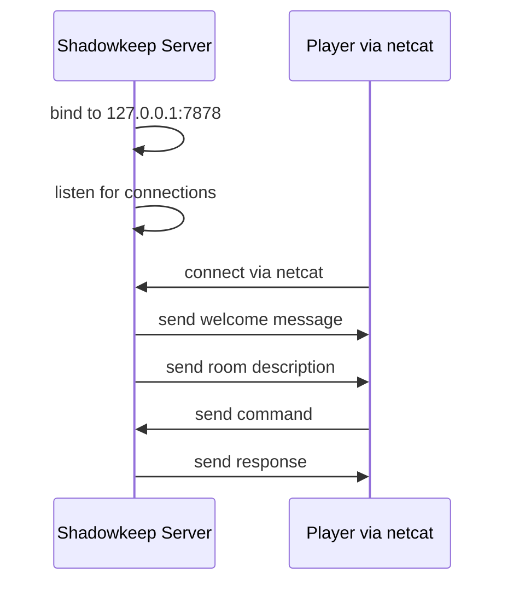
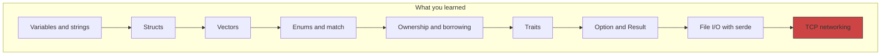

# Act 1 — The Foundation: Entering the Castle

> *The castle looms before you, its spires clawing at a bruised sky. The iron gate groans open. There is no turning back.*

Welcome to **Shadowkeep** — a multiplayer horror text adventure server written in Rust. By the end of this act, you'll have a working TCP server that players can connect to with `netcat`. But first, we lay the foundation: variables, structs, enums, ownership, traits, error handling, file I/O, and networking.

**Prerequisites:** Python or TypeScript experience. No Rust experience needed.

**Setup:** macOS with a terminal (Ghostty, iTerm2, etc.) and a text editor (nvim, VS Code, etc.). Install Rust via [rustup.rs](https://rustup.rs).


---

## Stage 1 — Hello Shadowkeep

Every horror story begins with a single step into the dark. Before you can build a multiplayer server, you need to know that your tools work — that Rust compiles, that your terminal speaks, that the void answers back. This stage exists because every complex system starts with the simplest possible proof of life.

**Difficulty:** Very Easy | **Time:** < 5 minutes

### Story Beat

You stand at the threshold. Before you can enter the castle, you must announce yourself. Every adventurer begins by speaking their name into the void.

### Concept

Creating a Rust project with `cargo` and printing text to the terminal with `println!`.

### Instructions

**Step 1: Create the project.**

Open your terminal and run:

```bash
cd ~/juk
cargo new shadowkeep --edition 2024
cd shadowkeep
```

- `cargo new` creates a new Rust project — a directory with a `Cargo.toml` (like `package.json` in Node or `pyproject.toml` in Python) and a `src/main.rs` file.
- `--edition 2024` tells Cargo to use the Rust 2024 edition (the latest, stable since Rust 1.85).

**Step 2: Open `src/main.rs`.** You'll see:

```rust
fn main() {
    println!("Hello, world!");
}
```

Let's break this down:

- `fn main()` — defines a function called `main`. This is the entry point of every Rust program, just like `if __name__ == "__main__"` in Python or the top-level code in a Node script.
- `println!("Hello, world!");` — prints text to the terminal. The `!` means this is a **macro**, not a regular function. For now, think of it as "a function that does extra work at compile time." The `ln` means it adds a newline at the end.

**Step 3: Replace the contents of `src/main.rs` with:**

```rust
fn main() {
    println!("You stand before the gates of Shadowkeep.");
    println!("The air is cold. The stones are watching.");
}
```

**Step 4: Run it.**

```bash
cargo run
```

`cargo run` compiles your code and runs the resulting binary. The first run downloads and compiles dependencies (there are none yet, but Rust's standard library gets linked). Subsequent runs are faster.

### Test

```
$ cargo run
You stand before the gates of Shadowkeep.
The air is cold. The stones are watching.
```

If you see those two lines, you've entered the castle.

### Rust Aside — `println!` is a Macro

In Python you'd write `print("hello")`. In TypeScript, `console.log("hello")`. In Rust, `println!` is a macro (note the `!`). Why? Because Rust's type system needs to know at compile time how many arguments you're passing and what types they are. A macro can accept a variable number of arguments — a regular function in Rust cannot (without extra machinery). You'll see more macros later. For now: if it has `!`, it's a macro.

You've proven the castle answers. But a single shout into the void isn't enough — you need to remember things. Names. Places. The shape of the darkness ahead.

### Checkpoint Code

```rust
// src/main.rs
fn main() {
    println!("You stand before the gates of Shadowkeep.");
    println!("The air is cold. The stones are watching.");
}
```

---

## Stage 2 — The Map

You can print text, but you can't remember anything. A game needs state — names, descriptions, layouts held in memory. Before you can build rooms or track players, you need to understand how Rust stores and displays data. Variables are the first bricks of the castle wall.

**Difficulty:** Very Easy | **Time:** < 5 minutes

### Story Beat

A tattered map is nailed to the gate. It shows the castle's layout — a crypt, a great hall, a library, and a tower. You memorize it before the wind tears it away.

### Concept

Variables with `let`, string types, and multi-line printing.

### Instructions

**Step 1: Declare a variable.**

Replace `src/main.rs` with:

```rust
fn main() {
    let castle_name = "Shadowkeep";
    println!("Welcome to {castle_name}");
}
```

- `let` declares a variable. This is like `const` in JavaScript or a plain assignment in Python. In Rust, variables are **immutable by default** — you can't reassign them unless you say `let mut`.
- `"Shadowkeep"` is a **string literal** — its type is `&str` (a reference to a string slice). We'll explain references later. For now, think of `&str` as "a borrowed piece of text."
- `{castle_name}` inside the string is **inline formatting** — Rust's equivalent of Python's f-strings (`f"Welcome to {castle_name}"`) or JavaScript template literals (`` `Welcome to ${castleName}` ``).

**Step 2: Print the map.**

```rust
fn main() {
    let castle_name = "Shadowkeep";

    let map = "\
╔══════════════════════════════╗
║       SHADOWKEEP CASTLE      ║
╠══════════════════════════════╣
║  [Crypt] --- [Great Hall]    ║
║     |            |           ║
║  [Library] -- [Tower]        ║
╚══════════════════════════════╝";

    println!("Welcome to {castle_name}");
    println!();
    println!("{map}");
}
```

- The `\` at the start of the string literal (after the opening `"`) tells Rust to ignore the newline immediately after it, so the string doesn't start with a blank line.
- `println!()` with no arguments prints an empty line.
- `{map}` prints the entire multi-line string.

**Step 3: Try making it mutable.**

Add this after the `println!("{map}");` line:

```rust
    // This won't compile — castle_name is immutable!
    // castle_name = "Darkhold";
```

Uncomment it and run `cargo run`. You'll see:

```
error[E0384]: cannot assign twice to immutable variable `castle_name`
```

This is Rust protecting you. If you want a variable you can change, use `let mut`:

```rust
    let mut castle_name = "Shadowkeep";
    castle_name = "Darkhold"; // This works now
```

But we don't need that here — leave it immutable.

### Test

```
$ cargo run
Welcome to Shadowkeep

╔══════════════════════════════╗
║       SHADOWKEEP CASTLE      ║
╠══════════════════════════════╣
║  [Crypt] --- [Great Hall]    ║
║     |            |           ║
║  [Library] -- [Tower]        ║
╚══════════════════════════════╝
```

### Rust Aside — Immutability by Default

In Python and JS, variables are mutable by default. You use `const` in JS to opt into immutability. Rust flips this: everything is immutable unless you say `mut`. This prevents accidental mutation — a huge source of bugs in large codebases. The compiler catches it before your code ever runs.

| Language | Immutable | Mutable |
|----------|-----------|---------|
| Python | (no built-in) | `x = 5` |
| JavaScript | `const x = 5` | `let x = 5` |
| Rust | `let x = 5` | `let mut x = 5` |

You can store text and print it. But a castle isn't just a name and a map — it's rooms, each with their own identity. You need a way to bundle related data together.

### Checkpoint Code

```rust
// src/main.rs
fn main() {
    let castle_name = "Shadowkeep";

    let map = "\
╔══════════════════════════════╗
║       SHADOWKEEP CASTLE      ║
╠══════════════════════════════╣
║  [Crypt] --- [Great Hall]    ║
║     |            |           ║
║  [Library] -- [Tower]        ║
╚══════════════════════════════╝";

    println!("Welcome to {castle_name}");
    println!();
    println!("{map}");
}
```


---

## Stage 3 — Rooms and Doors

You have variables, but they're loose — a name here, a description there, nothing tying them together. A room in Shadowkeep isn't just a string; it's a *thing* with properties. You need a way to say "this name and this description belong to the same room." Without that, the castle is just scattered words in the dark.

**Difficulty:** Easy | **Time:** 5–10 minutes

### Story Beat

You step through the gate. The crypt stretches before you — damp stone walls, the smell of earth and decay. Each room in Shadowkeep has a name and a description. You need a way to represent them.

### Concept

Structs — Rust's way of grouping related data together (like a class in Python/TS, but without methods baked in).

### Instructions

**Step 1: Define a struct.**

Right now we have separate `let` variables for each piece of data, but nothing connects a room's name to its description. If we had ten rooms, we'd have twenty loose variables with no structure. We need a single type that bundles a room's data together.

Replace `src/main.rs` with:

```rust
struct Room {
    name: String,
    description: String,
}
```

- `struct` defines a new data type. Think of it like a Python `dataclass` or a TypeScript `interface`/`type`.
- `name: String` — a field called `name` with type `String`. Note: `String` (capital S) is an **owned** string — the struct owns this data. This is different from `&str` (a borrowed reference) that we used in Stage 2. We'll explain ownership in Stage 6.
- Each field has an explicit type. Rust doesn't infer struct field types.

**Python equivalent:**
```python
@dataclass
class Room:
    name: str
    description: str
```

**TypeScript equivalent:**
```typescript
interface Room {
    name: string;
    description: string;
}
```

**Step 2: Create a room and print it.**

```rust
struct Room {
    name: String,
    description: String,
}

fn main() {
    let crypt = Room {
        name: String::from("The Crypt"),
        description: String::from("A damp chamber. Water drips from the ceiling. Bones are stacked along the walls."),
    };

    println!("You enter: {}", crypt.name);
    println!("{}", crypt.description);
}
```

- `Room { name: ..., description: ... }` creates an instance of the struct. Like `Room(name=..., description=...)` in Python.
- `String::from("text")` converts a string literal (`&str`) into an owned `String`. The `::` syntax calls an **associated function** (like a static method in Python/TS). You'll also see `.to_string()` and `.into()` used for the same purpose.
- `crypt.name` accesses the field with dot notation — same as Python and TS.
- `println!("{}", crypt.name)` — the `{}` is a placeholder. The value after the comma fills it in. This is the older style; `{crypt.name}` inline also works for simple field access.

**Step 3: Add a second room.**

```rust
fn main() {
    let crypt = Room {
        name: String::from("The Crypt"),
        description: String::from("A damp chamber. Water drips from the ceiling. Bones are stacked along the walls."),
    };

    let great_hall = Room {
        name: String::from("The Great Hall"),
        description: String::from("A vast room with a shattered chandelier. Something moved in the shadows."),
    };

    println!("You enter: {}", crypt.name);
    println!("{}", crypt.description);
    println!();
    println!("You enter: {}", great_hall.name);
    println!("{}", great_hall.description);
}
```

### Common Mistake

If you try `name: "The Crypt"` without `String::from()`, you'll get:

```
error[E0308]: mismatched types
  expected `String`, found `&str`
```

The struct expects an owned `String`, but `"The Crypt"` is a `&str` (a borrowed reference). Use `String::from()` or `.to_string()` to convert it.

### Test

```
$ cargo run
You enter: The Crypt
A damp chamber. Water drips from the ceiling. Bones are stacked along the walls.

You enter: The Great Hall
A vast room with a shattered chandelier. Something moved in the shadows.
```

### Rust Aside — String vs &str

This is one of the first things that trips up Rust beginners. Rust has two main string types:

| Type | Owned? | Mutable? | Analogy |
|------|--------|----------|---------|
| `String` | Yes — owns its data | Yes (if `mut`) | Like Python's `str` (heap-allocated) |
| `&str` | No — borrows data | No | Like a read-only view/slice |

- Use `String` when a struct needs to own its data (it lives as long as the struct).
- Use `&str` for function parameters that just need to read a string.
- Convert with `String::from("text")`, `"text".to_string()`, or `"text".into()`.

Two rooms is a start, but Shadowkeep has many chambers. Hardcoding each one as a separate variable won't scale — you need a collection that can hold all of them at once.

### Checkpoint Code

```rust
// src/main.rs
struct Room {
    name: String,
    description: String,
}

fn main() {
    let crypt = Room {
        name: String::from("The Crypt"),
        description: String::from("A damp chamber. Water drips from the ceiling. Bones are stacked along the walls."),
    };

    let great_hall = Room {
        name: String::from("The Great Hall"),
        description: String::from("A vast room with a shattered chandelier. Something moved in the shadows."),
    };

    println!("You enter: {}", crypt.name);
    println!("{}", crypt.description);
    println!();
    println!("You enter: {}", great_hall.name);
    println!("{}", great_hall.description);
}
```

---

## Stage 4 — The Hallway

A castle with two rooms is a closet, not a dungeon. You need to hold an unknown number of rooms and iterate over them — the fundamental operation of any game world. Vectors are how Rust handles dynamic collections, and understanding them now prevents a wall of confusion later when rooms, items, and players all live in lists.

**Difficulty:** Easy | **Time:** 5–10 minutes

### Story Beat

The castle has many rooms. You can't just hardcode each one as a separate variable — you need a list. A hallway of doors, each leading to a different room.

### Concept

`Vec` (vector) — Rust's growable array type. Iterating over collections with `for` loops.

### Instructions

**Step 1: Store rooms in a Vec.**

Replace your `main` function (keep the `Room` struct):

```rust
fn main() {
    let rooms = vec![
        Room {
            name: String::from("The Crypt"),
            description: String::from("A damp chamber. Bones are stacked along the walls."),
        },
        Room {
            name: String::from("The Great Hall"),
            description: String::from("A vast room with a shattered chandelier."),
        },
        Room {
            name: String::from("The Library"),
            description: String::from("Shelves of rotting books. One lies open, its pages turning by themselves."),
        },
        Room {
            name: String::from("The Tower"),
            description: String::from("A spiral staircase vanishes into darkness above."),
        },
    ];

    println!("Shadowkeep has {} rooms:\n", rooms.len());

    for room in &rooms {
        println!("  [{}]", room.name);
        println!("  {}\n", room.description);
    }
}
```

Let's break down the new parts:

- `vec![...]` is a macro that creates a `Vec` (vector) — Rust's equivalent of Python's `list` or JavaScript's `Array`. It's a growable, heap-allocated array.
- `rooms.len()` returns the number of elements — like `len(rooms)` in Python or `rooms.length` in JS.
- `for room in &rooms` — iterates over the vector. The `&` means we're **borrowing** the rooms, not consuming them. Without `&`, the loop would take ownership of the vector and you couldn't use `rooms` afterward. We'll explain ownership fully in Stage 6.
- `room.name` — inside the loop, `room` is a reference to each `Room` struct.

**Python equivalent:**
```python
rooms = [Room("The Crypt", "..."), Room("The Great Hall", "...")]
for room in rooms:
    print(f"  [{room.name}]")
```

**TypeScript equivalent:**
```typescript
const rooms: Room[] = [{ name: "The Crypt", description: "..." }];
for (const room of rooms) {
    console.log(`  [${room.name}]`);
}
```

**Step 2: Access a room by index.**

Add this after the `for` loop:

```rust
    let first_room = &rooms[0];
    println!("You start in: {}", first_room.name);
```

- `&rooms[0]` borrows a reference to the first element. Like `rooms[0]` in Python/JS, but with an explicit `&` to say "I'm borrowing, not taking."
- If you try `rooms[99]`, the program will **panic** (crash) at runtime. We'll learn safer access with `.get()` in Stage 8.

### Common Mistake

If you write `for room in rooms` (without `&`), the vector is **moved** into the loop. Any code after the loop that tries to use `rooms` will fail:

```
error[E0382]: borrow of moved value: `rooms`
```

Fix: use `for room in &rooms` to borrow instead of move.

### Test

```
$ cargo run
Shadowkeep has 4 rooms:

  [The Crypt]
  A damp chamber. Bones are stacked along the walls.

  [The Great Hall]
  A vast room with a shattered chandelier.

  [The Library]
  Shelves of rotting books. One lies open, its pages turning by themselves.

  [The Tower]
  A spiral staircase vanishes into darkness above.

You start in: The Crypt
```

### Rust Aside — Vec and Ownership Preview

A `Vec<Room>` **owns** its elements. When the `Vec` goes out of scope (the function ends), it drops all the rooms — freeing their memory automatically. No garbage collector needed. This is Rust's **RAII** (Resource Acquisition Is Initialization) pattern.

The `&` in `for room in &rooms` is a **borrow** — you're looking at the data without taking it. This is the core of Rust's ownership system, which we'll explore in Stage 6.

| Python | Rust |
|--------|------|
| `rooms = [...]` | `let rooms = vec![...]` |
| `for r in rooms:` | `for r in &rooms {` |
| `rooms[0]` | `&rooms[0]` |
| `rooms.append(x)` | `rooms.push(x)` (needs `let mut rooms`) |

You can store rooms and walk through them. But walking is meaningless without choice — the player needs to decide which direction to go, and the castle needs to understand their answer.

### Checkpoint Code

```rust
// src/main.rs
struct Room {
    name: String,
    description: String,
}

fn main() {
    let rooms = vec![
        Room {
            name: String::from("The Crypt"),
            description: String::from("A damp chamber. Bones are stacked along the walls."),
        },
        Room {
            name: String::from("The Great Hall"),
            description: String::from("A vast room with a shattered chandelier."),
        },
        Room {
            name: String::from("The Library"),
            description: String::from("Shelves of rotting books. One lies open, its pages turning by themselves."),
        },
        Room {
            name: String::from("The Tower"),
            description: String::from("A spiral staircase vanishes into darkness above."),
        },
    ];

    println!("Shadowkeep has {} rooms:\n", rooms.len());

    for room in &rooms {
        println!("  [{}]", room.name);
        println!("  {}\n", room.description);
    }

    let first_room = &rooms[0];
    println!("You start in: {}", first_room.name);
}
```


---

## Stage 5 — Choose Your Path

A game without player input is a screensaver. This stage transforms your program from a static display into an interactive loop — the player types, the castle responds. More importantly, you'll learn enums and `match`, which are how Rust models choices and forces you to handle every possibility. In a horror game, forgetting to handle a case means something slips through the cracks. Rust won't let that happen.

**Difficulty:** Easy | **Time:** 5–10 minutes

### Story Beat

You stand in the Crypt. Corridors branch in every direction — north to the Great Hall, east to the Library. The castle demands a choice. Which way?

### Concept

Enums for representing a fixed set of options. `match` for exhaustive pattern matching. Reading user input from stdin.

### Instructions

**Step 1: Define a Direction enum.**

Right now we have rooms in a list, but no way for the player to choose where to go. We could use strings like `"north"` and `"south"`, but strings are fragile — a typo like `"nroth"` compiles fine and silently breaks. We need a type that represents exactly the valid directions, nothing more.

Add this above your `Room` struct:

```rust
use std::io;

enum Direction {
    North,
    South,
    East,
    West,
}
```

- `enum` defines a type that can be one of several **variants**. Think of it like a TypeScript union type (`type Direction = "north" | "south" | "east" | "west"`) or a Python `Enum`.
- Each variant (`North`, `South`, etc.) is a distinct value. Unlike strings, the compiler knows all possible values — typos are caught at compile time.
- `use std::io;` imports the I/O module from the standard library. We'll need it to read from stdin.

**Step 2: Parse user input into a Direction.**

Add this function below the enum:

```rust
fn parse_direction(input: &str) -> Option<Direction> {
    match input.trim().to_lowercase().as_str() {
        "north" | "n" => Some(Direction::North),
        "south" | "s" => Some(Direction::South),
        "east" | "e" => Some(Direction::East),
        "west" | "w" => Some(Direction::West),
        _ => None,
    }
}
```

- `fn parse_direction(input: &str) -> Option<Direction>` — a function that takes a borrowed string and returns an `Option<Direction>`. `Option` is Rust's way of saying "this might have a value, or it might not." It's like `Optional` in Python or `T | undefined` in TypeScript.
- `match` is Rust's pattern matching — like a `switch` statement, but the compiler **forces you to handle every case**. The `_` is a catch-all (like `default` in a switch).
- `input.trim()` removes whitespace (the newline from pressing Enter).
- `.to_lowercase()` returns a new `String`. `.as_str()` converts it back to `&str` for matching.
- `Some(Direction::North)` wraps the value in `Option`. `None` means "no valid direction."
- `|` means "or" — `"north" | "n"` matches either string.

**Step 3: Build the game loop.**

Replace your `main` function:

```rust
fn main() {
    let rooms = vec![
        Room {
            name: String::from("The Crypt"),
            description: String::from("A damp chamber. Bones are stacked along the walls."),
        },
        Room {
            name: String::from("The Great Hall"),
            description: String::from("A vast room with a shattered chandelier."),
        },
        Room {
            name: String::from("The Library"),
            description: String::from("Shelves of rotting books. One lies open, its pages turning by themselves."),
        },
        Room {
            name: String::from("The Tower"),
            description: String::from("A spiral staircase vanishes into darkness above."),
        },
    ];

    let mut current_room = 0;

    loop {
        println!("\n--- {} ---", rooms[current_room].name);
        println!("{}", rooms[current_room].description);
        println!("\nWhich direction? (north/south/east/west or quit)");

        let mut input = String::new();
        io::stdin()
            .read_line(&mut input)
            .expect("Failed to read input");

        if input.trim() == "quit" {
            println!("You flee Shadowkeep... for now.");
            break;
        }

        match parse_direction(&input) {
            Some(Direction::North) => {
                current_room = (current_room + 1) % rooms.len();
                println!("You head north...");
            }
            Some(Direction::South) => {
                current_room = if current_room == 0 { rooms.len() - 1 } else { current_room - 1 };
                println!("You head south...");
            }
            Some(Direction::East) => {
                current_room = (current_room + 1) % rooms.len();
                println!("You head east...");
            }
            Some(Direction::West) => {
                current_room = if current_room == 0 { rooms.len() - 1 } else { current_room - 1 };
                println!("You head west...");
            }
            None => {
                println!("The shadows swallow your words. Try a direction: north, south, east, west.");
            }
        }
    }
}
```

New concepts:

- `let mut current_room = 0;` — a mutable variable. We need `mut` because we'll change which room the player is in.
- `loop { ... }` — an infinite loop. Like `while True:` in Python. We break out with `break`.
- `let mut input = String::new();` — creates an empty, mutable `String` to hold user input.
- `io::stdin().read_line(&mut input)` — reads a line from stdin into `input`. The `&mut` means we're passing a **mutable reference** — the function can write into our string. `.expect("...")` crashes with a message if reading fails (we'll handle errors properly in Stage 8).
- `match parse_direction(&input)` — we match on the `Option<Direction>` returned by our function. `Some(Direction::North)` matches when the user typed "north" or "n". `None` matches invalid input.
- `(current_room + 1) % rooms.len()` — wraps around to the first room after the last. Modulo arithmetic.

**Python equivalent of the input reading:**
```python
input_text = input("Which direction? ")
```

Rust is more explicit: you create the buffer, pass a mutable reference, and handle the potential error.

### Test

```
$ cargo run

--- The Crypt ---
A damp chamber. Bones are stacked along the walls.

Which direction? (north/south/east/west or quit)
north
You head north...

--- The Great Hall ---
A vast room with a shattered chandelier.

Which direction? (north/south/east/west or quit)
quit
You flee Shadowkeep... for now.
```

Type `north`, `n`, `south`, `s`, etc. to move. Type `quit` to exit. Type gibberish to see the error message.

### Rust Aside — Enums and Match

Rust enums are far more powerful than Python/TS enums. They can carry data (we'll see this later). And `match` is **exhaustive** — the compiler forces you to handle every variant. If you add a new direction and forget to handle it, the code won't compile. This eliminates an entire class of bugs.

```rust
// This won't compile — missing East and West:
match direction {
    Direction::North => { /* ... */ }
    Direction::South => { /* ... */ }
    // error[E0004]: non-exhaustive patterns
}
```

In Python/TS, a `switch` or `if/elif` chain silently ignores unhandled cases. Rust refuses.

The player can move between rooms. But what's a dungeon without loot? The crypt floor glints with something metallic — and picking it up means understanding who *owns* that data.

### Checkpoint Code

```rust
// src/main.rs
use std::io;

enum Direction {
    North,
    South,
    East,
    West,
}

struct Room {
    name: String,
    description: String,
}

fn parse_direction(input: &str) -> Option<Direction> {
    match input.trim().to_lowercase().as_str() {
        "north" | "n" => Some(Direction::North),
        "south" | "s" => Some(Direction::South),
        "east" | "e" => Some(Direction::East),
        "west" | "w" => Some(Direction::West),
        _ => None,
    }
}

fn main() {
    let rooms = vec![
        Room {
            name: String::from("The Crypt"),
            description: String::from("A damp chamber. Bones are stacked along the walls."),
        },
        Room {
            name: String::from("The Great Hall"),
            description: String::from("A vast room with a shattered chandelier."),
        },
        Room {
            name: String::from("The Library"),
            description: String::from("Shelves of rotting books. One lies open, its pages turning by themselves."),
        },
        Room {
            name: String::from("The Tower"),
            description: String::from("A spiral staircase vanishes into darkness above."),
        },
    ];

    let mut current_room = 0;

    loop {
        println!("\n--- {} ---", rooms[current_room].name);
        println!("{}", rooms[current_room].description);
        println!("\nWhich direction? (north/south/east/west or quit)");

        let mut input = String::new();
        io::stdin()
            .read_line(&mut input)
            .expect("Failed to read input");

        if input.trim() == "quit" {
            println!("You flee Shadowkeep... for now.");
            break;
        }

        match parse_direction(&input) {
            Some(Direction::North) => {
                current_room = (current_room + 1) % rooms.len();
                println!("You head north...");
            }
            Some(Direction::South) => {
                current_room = if current_room == 0 { rooms.len() - 1 } else { current_room - 1 };
                println!("You head south...");
            }
            Some(Direction::East) => {
                current_room = (current_room + 1) % rooms.len();
                println!("You head east...");
            }
            Some(Direction::West) => {
                current_room = if current_room == 0 { rooms.len() - 1 } else { current_room - 1 };
                println!("You head west...");
            }
            None => {
                println!("The shadows swallow your words. Try a direction: north, south, east, west.");
            }
        }
    }
}
```

---

## Stage 6 — The Inventory

This is the stage where Rust stops feeling like Python-with-types and starts feeling like *Rust*. Ownership is the concept that makes Rust unique — it's how the language guarantees memory safety without a garbage collector. You're learning it now because picking up an item is the perfect physical metaphor: the key leaves the room and enters your pocket. It can't be in both places. The compiler enforces this, and once you internalize it, an entire class of bugs becomes impossible.

**Difficulty:** Medium | **Time:** 30 minutes – 1 hour

### Story Beat

You find a rusty key on the crypt floor. You pick it up. But wait — the key was *in* the room. Now it's *with you*. In Rust, data can only have one owner at a time. Welcome to the borrow checker.

### Concept

Ownership, borrowing, and moving — the heart of Rust. We learn it by picking up items and putting them down.

### Instructions

**Step 1: Add items to rooms.**

Right now rooms are just names and descriptions — static scenery. But a game needs *things* in rooms that players can interact with. And we need a player who can carry those things. The question is: when a player picks up a key, who owns the key's data? The room? The player? Both? Rust demands a clear answer.

Update the `Room` struct to hold items:

```rust
struct Room {
    name: String,
    description: String,
    items: Vec<String>,
}
```

- `items: Vec<String>` — each room has a list of items. Each item is an owned `String`.

**Step 2: Create a Player struct.**

Add this below `Room`:

```rust
struct Player {
    inventory: Vec<String>,
}
```

**Step 3: Implement taking and dropping items.**

Add these functions:

```rust
fn take_item(player: &mut Player, room: &mut Room, item_name: &str) {
    if let Some(pos) = room.items.iter().position(|i| i == item_name) {
        let item = room.items.remove(pos);
        println!("You pick up the {}. It's cold to the touch.", item);
        player.inventory.push(item);
    } else {
        println!("There is no '{}' here.", item_name);
    }
}

fn drop_item(player: &mut Player, room: &mut Room, item_name: &str) {
    if let Some(pos) = player.inventory.iter().position(|i| i == item_name) {
        let item = player.inventory.remove(pos);
        println!("You drop the {}. It clatters on the stone floor.", item);
        room.items.push(item);
    } else {
        println!("You don't have a '{}'.", item_name);
    }
}
```

This is where Rust gets interesting. Let's break it down:

- `player: &mut Player` — a **mutable reference** to the player. We need `&mut` because we're modifying the player's inventory. In Python, you'd just pass the object and mutate it freely. Rust requires you to be explicit.
- `room: &mut Room` — same for the room. We're removing/adding items.
- `room.items.iter().position(|i| i == item_name)` — searches for the item. `.iter()` creates an iterator. `.position(|i| ...)` finds the index where the closure returns true. `|i|` is a **closure** (anonymous function) — like `lambda i: ...` in Python or `(i) => ...` in JS.
- `room.items.remove(pos)` — removes the item at that index and **returns it**. The item is now **moved** out of the room's vector.
- `player.inventory.push(item)` — the item is **moved** into the player's inventory. The room no longer owns it. This is ownership transfer.
- `if let Some(pos) = ...` — a concise way to match on `Option`. If the value is `Some`, bind the inner value to `pos` and run the block. If `None`, run the `else` block.

**This is the key insight:** the item moves from `room.items` → local variable `item` → `player.inventory`. At no point do two things own the same item. Rust enforces this at compile time.

**Python equivalent:**
```python
def take_item(player, room, item_name):
    if item_name in room.items:
        room.items.remove(item_name)  # Both could still reference it!
        player.inventory.append(item_name)
```

In Python, nothing stops you from accidentally keeping a reference to the removed item. In Rust, the compiler guarantees the item has exactly one owner.

**Step 4: Update main to support commands.**

Replace your `main` function:

```rust
fn main() {
    let mut rooms = vec![
        Room {
            name: String::from("The Crypt"),
            description: String::from("A damp chamber. Bones are stacked along the walls."),
            items: vec![String::from("rusty key"), String::from("torch")],
        },
        Room {
            name: String::from("The Great Hall"),
            description: String::from("A vast room with a shattered chandelier."),
            items: vec![String::from("silver dagger")],
        },
        Room {
            name: String::from("The Library"),
            description: String::from("Shelves of rotting books. One lies open, its pages turning by themselves."),
            items: vec![String::from("ancient tome")],
        },
        Room {
            name: String::from("The Tower"),
            description: String::from("A spiral staircase vanishes into darkness above."),
            items: vec![],
        },
    ];

    let mut player = Player {
        inventory: Vec::new(),
    };

    let mut current_room = 0;

    loop {
        let room = &rooms[current_room];
        println!("\n--- {} ---", room.name);
        println!("{}", room.description);
        if !room.items.is_empty() {
            println!("You see: {}", room.items.join(", "));
        }
        if !player.inventory.is_empty() {
            println!("Inventory: {}", player.inventory.join(", "));
        }
        println!("\nCommand? (north/south/east/west/take <item>/drop <item>/quit)");

        let mut input = String::new();
        io::stdin()
            .read_line(&mut input)
            .expect("Failed to read input");
        let input = input.trim();

        if input == "quit" {
            println!("You flee Shadowkeep... for now.");
            break;
        }

        if let Some(item_name) = input.strip_prefix("take ") {
            take_item(&mut player, &mut rooms[current_room], item_name);
        } else if let Some(item_name) = input.strip_prefix("drop ") {
            drop_item(&mut player, &mut rooms[current_room], item_name);
        } else {
            match parse_direction(input) {
                Some(Direction::North) | Some(Direction::East) => {
                    current_room = (current_room + 1) % rooms.len();
                    println!("You move onward...");
                }
                Some(Direction::South) | Some(Direction::West) => {
                    current_room = if current_room == 0 { rooms.len() - 1 } else { current_room - 1 };
                    println!("You move onward...");
                }
                None => {
                    println!("The shadows swallow your words. Try: north, south, take <item>, drop <item>");
                }
            }
        }
    }
}
```

New concepts:

- `let mut rooms = vec![...]` — the rooms vector is now mutable because we'll modify items inside rooms.
- `Vec::new()` — creates an empty vector. Like `[]` in Python.
- `room.items.join(", ")` — joins strings with a separator, like `", ".join(items)` in Python.
- `input.strip_prefix("take ")` — returns `Some("rusty key")` if input is `"take rusty key"`, or `None` otherwise. Like `input.removeprefix("take ")` in Python, but it tells you whether it matched.
- `let input = input.trim();` — this **shadows** the previous `input` variable. The old mutable `String` is replaced by an immutable `&str`. Shadowing is idiomatic Rust — it lets you refine a value without inventing new names.
- `&mut rooms[current_room]` — passes a mutable reference to the specific room.

### Common Mistake

If you try to borrow `rooms` immutably (to print) and mutably (to take items) at the same time:

```rust
let room = &rooms[current_room];       // immutable borrow
take_item(&mut player, &mut rooms[current_room], "key"); // mutable borrow
println!("{}", room.name);             // uses immutable borrow
```

You'll get:

```
error[E0502]: cannot borrow `rooms` as mutable because it is also borrowed as immutable
```

The fix: don't hold the immutable borrow across the mutable operation. In our code, we print the room info first, then drop the immutable borrow before calling `take_item`. The `let room = &rooms[current_room];` borrow ends before the `if let` block.

### Test

```
$ cargo run

--- The Crypt ---
A damp chamber. Bones are stacked along the walls.
You see: rusty key, torch

Command? (north/south/east/west/take <item>/drop <item>/quit)
take rusty key
You pick up the rusty key. It's cold to the touch.

--- The Crypt ---
A damp chamber. Bones are stacked along the walls.
You see: torch
Inventory: rusty key

Command? (north/south/east/west/take <item>/drop <item>/quit)
north
You move onward...

--- The Great Hall ---
A vast room with a shattered chandelier.
You see: silver dagger
Inventory: rusty key

Command? (north/south/east/west/take <item>/drop <item>/quit)
drop rusty key
You drop the rusty key. It clatters on the stone floor.
```

### Rust Aside — Ownership in Three Rules

Rust's ownership system has three rules:

1. **Each value has exactly one owner.**
2. **When the owner goes out of scope, the value is dropped** (memory freed).
3. **You can have either one mutable reference OR any number of immutable references** — never both at the same time.

This is what makes Rust memory-safe without a garbage collector. The compiler checks these rules at compile time. No runtime overhead.

| Concept | Python | Rust |
|---------|--------|------|
| Ownership | GC tracks references | Compiler enforces single owner |
| Passing data | Reference counted | Moved (or borrowed with `&`) |
| Mutation | Anything, anytime | Only through `&mut`, one at a time |
| Memory free | GC decides when | Deterministic — when owner goes out of scope |

Items move between owners. But the castle isn't just rooms and loot — something *lives* in these halls. Different creatures with different behaviors, all sharing the ability to describe themselves and attack. You need a way to define that shared contract.

### Checkpoint Code

```rust
// src/main.rs
use std::io;

enum Direction {
    North,
    South,
    East,
    West,
}

struct Room {
    name: String,
    description: String,
    items: Vec<String>,
}

struct Player {
    inventory: Vec<String>,
}

fn parse_direction(input: &str) -> Option<Direction> {
    match input.trim().to_lowercase().as_str() {
        "north" | "n" => Some(Direction::North),
        "south" | "s" => Some(Direction::South),
        "east" | "e" => Some(Direction::East),
        "west" | "w" => Some(Direction::West),
        _ => None,
    }
}

fn take_item(player: &mut Player, room: &mut Room, item_name: &str) {
    if let Some(pos) = room.items.iter().position(|i| i == item_name) {
        let item = room.items.remove(pos);
        println!("You pick up the {}. It's cold to the touch.", item);
        player.inventory.push(item);
    } else {
        println!("There is no '{}' here.", item_name);
    }
}

fn drop_item(player: &mut Player, room: &mut Room, item_name: &str) {
    if let Some(pos) = player.inventory.iter().position(|i| i == item_name) {
        let item = player.inventory.remove(pos);
        println!("You drop the {}. It clatters on the stone floor.", item);
        room.items.push(item);
    } else {
        println!("You don't have a '{}'.", item_name);
    }
}

fn main() {
    let mut rooms = vec![
        Room {
            name: String::from("The Crypt"),
            description: String::from("A damp chamber. Bones are stacked along the walls."),
            items: vec![String::from("rusty key"), String::from("torch")],
        },
        Room {
            name: String::from("The Great Hall"),
            description: String::from("A vast room with a shattered chandelier."),
            items: vec![String::from("silver dagger")],
        },
        Room {
            name: String::from("The Library"),
            description: String::from("Shelves of rotting books. One lies open, its pages turning by themselves."),
            items: vec![String::from("ancient tome")],
        },
        Room {
            name: String::from("The Tower"),
            description: String::from("A spiral staircase vanishes into darkness above."),
            items: vec![],
        },
    ];

    let mut player = Player {
        inventory: Vec::new(),
    };

    let mut current_room = 0;

    loop {
        let room = &rooms[current_room];
        println!("\n--- {} ---", room.name);
        println!("{}", room.description);
        if !room.items.is_empty() {
            println!("You see: {}", room.items.join(", "));
        }
        if !player.inventory.is_empty() {
            println!("Inventory: {}", player.inventory.join(", "));
        }
        println!("\nCommand? (north/south/east/west/take <item>/drop <item>/quit)");

        let mut input = String::new();
        io::stdin()
            .read_line(&mut input)
            .expect("Failed to read input");
        let input = input.trim();

        if input == "quit" {
            println!("You flee Shadowkeep... for now.");
            break;
        }

        if let Some(item_name) = input.strip_prefix("take ") {
            take_item(&mut player, &mut rooms[current_room], item_name);
        } else if let Some(item_name) = input.strip_prefix("drop ") {
            drop_item(&mut player, &mut rooms[current_room], item_name);
        } else {
            match parse_direction(input) {
                Some(Direction::North) | Some(Direction::East) => {
                    current_room = (current_room + 1) % rooms.len();
                    println!("You move onward...");
                }
                Some(Direction::South) | Some(Direction::West) => {
                    current_room = if current_room == 0 { rooms.len() - 1 } else { current_room - 1 };
                    println!("You move onward...");
                }
                None => {
                    println!("The shadows swallow your words. Try: north, south, take <item>, drop <item>");
                }
            }
        }
    }
}
```


---

## Stage 7 — Creatures in the Dark

A horror game without monsters is just a walking simulator. But monsters aren't all the same — a wraith drains life, a spider shoots webs. They share a common interface (name, describe, attack) but differ in implementation. This is the problem traits solve, and it's the same pattern you'll use later when different network message types all need to be "sendable" or different game events all need to be "processable."

**Difficulty:** Medium | **Time:** 30 minutes – 1 hour

### Story Beat

Something moves in the Library. A shape unfolds from the shadows — too many limbs, too many eyes. The castle has guardians. Each creature is different, but they all share one thing: they can describe themselves, and they can attack.

### Concept

Traits — Rust's way of defining shared behavior across different types. Like interfaces in TypeScript or abstract base classes in Python.

### Instructions

**Step 1: Define the Monster trait.**

Right now we have `Room` and `Player` structs, but no way to represent creatures that behave differently from each other while still sharing a common set of actions. We could use a single `Monster` struct with a `kind` field, but then every function would need `if kind == "wraith" { ... } else if kind == "spider" { ... }` — fragile and forgettable. We need a contract that says "anything that implements these methods counts as a monster."

Add this below your existing structs:

```rust
trait Monster {
    fn name(&self) -> &str;
    fn describe(&self) -> &str;
    fn attack(&self) -> String;
}
```

- `trait Monster` defines a set of methods that any type can implement. It's a contract: "if you're a Monster, you must have these methods."
- `&self` — each method takes a reference to the instance. Like `self` in Python methods, but explicitly borrowed.
- `-> &str` — returns a borrowed string reference. The string data lives inside the struct; we're just lending it out.
- `-> String` — returns an owned string. The `attack` method constructs a new string each time.

**TypeScript equivalent:**
```typescript
interface Monster {
    name(): string;
    describe(): string;
    attack(): string;
}
```

**Python equivalent:**
```python
from abc import ABC, abstractmethod

class Monster(ABC):
    @abstractmethod
    def name(self) -> str: ...
    @abstractmethod
    def describe(self) -> str: ...
    @abstractmethod
    def attack(self) -> str: ...
```

**Step 2: Create monster types.**

```rust
struct Wraith {
    name: String,
    description: String,
    damage: u32,
}

struct GiantSpider {
    name: String,
    description: String,
    web_strength: u32,
}
```

- `u32` is an unsigned 32-bit integer. Rust has explicit integer sizes: `u8`, `u16`, `u32`, `u64`, `i8`, `i16`, `i32`, `i64`, etc. Python just has `int` (arbitrary size). TypeScript has `number` (64-bit float). Rust makes you choose.

**Step 3: Implement the trait for each monster.**

```rust
impl Monster for Wraith {
    fn name(&self) -> &str {
        &self.name
    }

    fn describe(&self) -> &str {
        &self.description
    }

    fn attack(&self) -> String {
        format!("The {} shrieks and drains {} life force from you!", self.name, self.damage)
    }
}

impl Monster for GiantSpider {
    fn name(&self) -> &str {
        &self.name
    }

    fn describe(&self) -> &str {
        &self.description
    }

    fn attack(&self) -> String {
        format!(
            "The {} shoots a web (strength {}) and lunges with venomous fangs!",
            self.name, self.web_strength
        )
    }
}
```

- `impl Monster for Wraith` — "implement the Monster trait for the Wraith type." This is how Rust does polymorphism.
- `&self.name` — returns a reference to the struct's `name` field. The caller borrows it; the struct still owns it.
- `format!(...)` — like `println!` but returns a `String` instead of printing. Like f-strings in Python.

**Step 4: Write a function that works with any Monster.**

```rust
fn encounter(monster: &dyn Monster) {
    println!("\nSomething stirs in the darkness...");
    println!("You see: {}", monster.describe());
    println!("{}", monster.attack());
}
```

- `&dyn Monster` — a reference to "any type that implements Monster." The `dyn` keyword means **dynamic dispatch** — the method to call is determined at runtime (like virtual methods in C++ or normal method calls in Python). This is how you write functions that accept different types through a shared trait.

**Step 5: Add monsters to main.**

Add this inside your `main` function, before the game loop:

```rust
    let wraith = Wraith {
        name: String::from("Hollow Wraith"),
        description: String::from("A translucent figure, its face frozen in a silent scream."),
        damage: 15,
    };

    let spider = GiantSpider {
        name: String::from("Silk Widow"),
        description: String::from("Eight eyes gleam in the dark. Its web fills the doorway."),
        web_strength: 8,
    };

    // Demonstrate the trait in action
    encounter(&wraith);
    encounter(&spider);
```

Both `Wraith` and `GiantSpider` are passed to the same `encounter` function because they both implement `Monster`. The function doesn't know or care which concrete type it gets.

### Common Mistake

If you forget to implement one of the trait methods:

```
error[E0046]: not all trait items implemented, missing: `attack`
```

The compiler tells you exactly which method is missing. Unlike Python's ABCs (which only check at instantiation time), Rust checks at compile time.

### Test

```
$ cargo run

Something stirs in the darkness...
You see: A translucent figure, its face frozen in a silent scream.
The Hollow Wraith shrieks and drains 15 life force from you!

Something stirs in the darkness...
You see: Eight eyes gleam in the dark. Its web fills the doorway.
The Silk Widow shoots a web (strength 8) and lunges with venomous fangs!

--- The Crypt ---
...
```

The encounters print before the game loop starts. In later acts, we'll trigger encounters when entering rooms.

### Rust Aside — Traits vs Interfaces vs ABCs

| Feature | Rust Trait | TS Interface | Python ABC |
|---------|-----------|-------------|-----------|
| Checked at | Compile time | Compile time (TS) | Runtime (instantiation) |
| Default methods | Yes | No | Yes |
| Multiple | Yes (implement many traits) | Yes (implement many interfaces) | Yes (multiple inheritance) |
| Dynamic dispatch | `&dyn Trait` | N/A (structural typing) | Normal method calls |
| Static dispatch | `impl Trait` or generics | N/A | N/A |

Rust traits can also have **default implementations** — methods with a body that types can override. We'll use this in later acts.

Monsters lurk in the rooms, but some doors won't open for just anyone. The Tower is sealed — and what happens when you try to enter a room that might not let you in? You need types that represent "maybe" and "success or failure."

### Checkpoint Code

```rust
// src/main.rs
use std::io;

enum Direction {
    North,
    South,
    East,
    West,
}

struct Room {
    name: String,
    description: String,
    items: Vec<String>,
}

struct Player {
    inventory: Vec<String>,
}

trait Monster {
    fn name(&self) -> &str;
    fn describe(&self) -> &str;
    fn attack(&self) -> String;
}

struct Wraith {
    name: String,
    description: String,
    damage: u32,
}

struct GiantSpider {
    name: String,
    description: String,
    web_strength: u32,
}

impl Monster for Wraith {
    fn name(&self) -> &str {
        &self.name
    }

    fn describe(&self) -> &str {
        &self.description
    }

    fn attack(&self) -> String {
        format!("The {} shrieks and drains {} life force from you!", self.name, self.damage)
    }
}

impl Monster for GiantSpider {
    fn name(&self) -> &str {
        &self.name
    }

    fn describe(&self) -> &str {
        &self.description
    }

    fn attack(&self) -> String {
        format!(
            "The {} shoots a web (strength {}) and lunges with venomous fangs!",
            self.name, self.web_strength
        )
    }
}

fn parse_direction(input: &str) -> Option<Direction> {
    match input.trim().to_lowercase().as_str() {
        "north" | "n" => Some(Direction::North),
        "south" | "s" => Some(Direction::South),
        "east" | "e" => Some(Direction::East),
        "west" | "w" => Some(Direction::West),
        _ => None,
    }
}

fn take_item(player: &mut Player, room: &mut Room, item_name: &str) {
    if let Some(pos) = room.items.iter().position(|i| i == item_name) {
        let item = room.items.remove(pos);
        println!("You pick up the {}. It's cold to the touch.", item);
        player.inventory.push(item);
    } else {
        println!("There is no '{}' here.", item_name);
    }
}

fn drop_item(player: &mut Player, room: &mut Room, item_name: &str) {
    if let Some(pos) = player.inventory.iter().position(|i| i == item_name) {
        let item = player.inventory.remove(pos);
        println!("You drop the {}. It clatters on the stone floor.", item);
        room.items.push(item);
    } else {
        println!("You don't have a '{}'.", item_name);
    }
}

fn encounter(monster: &dyn Monster) {
    println!("\nSomething stirs in the darkness...");
    println!("You see: {}", monster.describe());
    println!("{}", monster.attack());
}

fn main() {
    let mut rooms = vec![
        Room {
            name: String::from("The Crypt"),
            description: String::from("A damp chamber. Bones are stacked along the walls."),
            items: vec![String::from("rusty key"), String::from("torch")],
        },
        Room {
            name: String::from("The Great Hall"),
            description: String::from("A vast room with a shattered chandelier."),
            items: vec![String::from("silver dagger")],
        },
        Room {
            name: String::from("The Library"),
            description: String::from("Shelves of rotting books. One lies open, its pages turning by themselves."),
            items: vec![String::from("ancient tome")],
        },
        Room {
            name: String::from("The Tower"),
            description: String::from("A spiral staircase vanishes into darkness above."),
            items: vec![],
        },
    ];

    let mut player = Player {
        inventory: Vec::new(),
    };

    let wraith = Wraith {
        name: String::from("Hollow Wraith"),
        description: String::from("A translucent figure, its face frozen in a silent scream."),
        damage: 15,
    };

    let spider = GiantSpider {
        name: String::from("Silk Widow"),
        description: String::from("Eight eyes gleam in the dark. Its web fills the doorway."),
        web_strength: 8,
    };

    encounter(&wraith);
    encounter(&spider);

    let mut current_room = 0;

    loop {
        let room = &rooms[current_room];
        println!("\n--- {} ---", room.name);
        println!("{}", room.description);
        if !room.items.is_empty() {
            println!("You see: {}", room.items.join(", "));
        }
        if !player.inventory.is_empty() {
            println!("Inventory: {}", player.inventory.join(", "));
        }
        println!("\nCommand? (north/south/east/west/take <item>/drop <item>/quit)");

        let mut input = String::new();
        io::stdin()
            .read_line(&mut input)
            .expect("Failed to read input");
        let input = input.trim();

        if input == "quit" {
            println!("You flee Shadowkeep... for now.");
            break;
        }

        if let Some(item_name) = input.strip_prefix("take ") {
            take_item(&mut player, &mut rooms[current_room], item_name);
        } else if let Some(item_name) = input.strip_prefix("drop ") {
            drop_item(&mut player, &mut rooms[current_room], item_name);
        } else {
            match parse_direction(input) {
                Some(Direction::North) | Some(Direction::East) => {
                    current_room = (current_room + 1) % rooms.len();
                    println!("You move onward...");
                }
                Some(Direction::South) | Some(Direction::West) => {
                    current_room = if current_room == 0 { rooms.len() - 1 } else { current_room - 1 };
                    println!("You move onward...");
                }
                None => {
                    println!("The shadows swallow your words. Try: north, south, take <item>, drop <item>");
                }
            }
        }
    }
}
```

---

## Stage 8 — The Locked Door

Every real program must handle things that might not exist and operations that might fail. In Python, you get `None` and exceptions — and you find out you forgot to handle them at 3 AM in production. Rust replaces both with `Option` and `Result`, types that the compiler *forces* you to deal with. Learning them now means every error path in your multiplayer server will be visible and handled.

**Difficulty:** Easy | **Time:** 5–10 minutes

### Story Beat

The door to the Tower is locked. A rusted iron lock stares back at you. You need the rusty key from the Crypt. But what if you don't have it? What if the door doesn't exist? Rust has types for exactly this: `Option` (maybe a value) and `Result` (success or failure).

### Concept

`Option<T>` and `Result<T, E>` — Rust's approach to handling absence and errors. No null, no exceptions.

### Instructions

**Step 1: Add locked doors to rooms.**

Right now every room is open — the player walks wherever they want. But the Tower should be locked, and some doors might not have a key at all. We need to represent "this room might require a key" (maybe a value, maybe nothing) and "trying to enter might succeed or fail" (success or error). These are the two most common patterns in all of programming.

Update the `Room` struct:

```rust
struct Room {
    name: String,
    description: String,
    items: Vec<String>,
    locked: bool,
    required_key: Option<String>,
}
```

- `locked: bool` — whether the room is locked. `bool` is `true` or `false`, same as every language.
- `required_key: Option<String>` — the key needed to unlock this room, if any. `Option<String>` is either `Some(String)` (there's a key name) or `None` (no key needed).

**Why Option instead of null?** In Python, you might use `required_key: str | None = None`. In TypeScript, `requiredKey?: string`. The problem: you can forget to check for `None`/`undefined` and get a runtime crash. In Rust, `Option` forces you to handle both cases — the compiler won't let you use the inner value without checking first.

**Step 2: Write a function to try entering a room.**

```rust
fn try_enter_room(player: &Player, room: &Room) -> Result<(), String> {
    if !room.locked {
        return Ok(());
    }

    match &room.required_key {
        Some(key) => {
            if player.inventory.iter().any(|item| item == key) {
                println!("You use the {} to unlock {}.", key, room.name);
                Ok(())
            } else {
                Err(format!("{} is locked. You need: {}", room.name, key))
            }
        }
        None => Err(format!("{} is sealed by dark magic. No key can open it.", room.name)),
    }
}
```

- `Result<(), String>` — the return type. `Result` has two variants:
  - `Ok(())` — success. The `()` is Rust's "unit type" (like `void` or `None`). It means "success, no data to return."
  - `Err(String)` — failure, with an error message.
- `return Ok(());` — early return if the room isn't locked.
- `match &room.required_key` — pattern match on the `Option`. `Some(key)` binds the inner string to `key`. `None` means no key exists for this door.
- `.any(|item| item == key)` — returns `true` if any item in the inventory matches the key name.

**Python equivalent:**
```python
def try_enter_room(player, room):
    if not room.locked:
        return  # success
    if room.required_key and room.required_key in player.inventory:
        return  # success
    raise Exception(f"{room.name} is locked!")  # Python uses exceptions
```

Rust doesn't have exceptions. Instead, errors are **values** that you return and the caller must handle. This makes error paths explicit and impossible to accidentally ignore.

**Step 3: Update room creation with lock data.**

Update your rooms in `main`:

```rust
    let mut rooms = vec![
        Room {
            name: String::from("The Crypt"),
            description: String::from("A damp chamber. Bones are stacked along the walls."),
            items: vec![String::from("rusty key"), String::from("torch")],
            locked: false,
            required_key: None,
        },
        Room {
            name: String::from("The Great Hall"),
            description: String::from("A vast room with a shattered chandelier."),
            items: vec![String::from("silver dagger")],
            locked: false,
            required_key: None,
        },
        Room {
            name: String::from("The Library"),
            description: String::from("Shelves of rotting books. One lies open, its pages turning by themselves."),
            items: vec![String::from("ancient tome")],
            locked: false,
            required_key: None,
        },
        Room {
            name: String::from("The Tower"),
            description: String::from("A spiral staircase vanishes into darkness above."),
            items: vec![],
            locked: true,
            required_key: Some(String::from("rusty key")),
        },
    ];
```

**Step 4: Check locks when moving.**

Update the movement section in your game loop. Replace the direction match block:

```rust
            match parse_direction(input) {
                Some(Direction::North) | Some(Direction::East) => {
                    let next_room = (current_room + 1) % rooms.len();
                    match try_enter_room(&player, &rooms[next_room]) {
                        Ok(()) => {
                            current_room = next_room;
                            println!("You move onward...");
                        }
                        Err(msg) => println!("{}", msg),
                    }
                }
                Some(Direction::South) | Some(Direction::West) => {
                    let next_room = if current_room == 0 { rooms.len() - 1 } else { current_room - 1 };
                    match try_enter_room(&player, &rooms[next_room]) {
                        Ok(()) => {
                            current_room = next_room;
                            println!("You move onward...");
                        }
                        Err(msg) => println!("{}", msg),
                    }
                }
                None => {
                    println!("The shadows swallow your words. Try: north, south, take <item>, drop <item>");
                }
            }
```

- `match try_enter_room(...)` — we match on the `Result`. `Ok(())` means we can enter. `Err(msg)` means we can't, and `msg` contains the reason.

### Test

```
$ cargo run
...
--- The Library ---
Shelves of rotting books. One lies open, its pages turning by themselves.
You see: ancient tome

Command? (north/south/east/west/take <item>/drop <item>/quit)
north
The Tower is locked. You need: rusty key
```

Now go back to the Crypt, `take rusty key`, navigate to the Library, and try north again:

```
You use the rusty key to unlock The Tower.
You move onward...

--- The Tower ---
A spiral staircase vanishes into darkness above.
```

### Rust Aside — No Null, No Exceptions

Rust has no `null` and no exceptions. Instead:

| Situation | Python/TS | Rust |
|-----------|-----------|------|
| Value might be absent | `None` / `undefined` | `Option<T>` — `Some(value)` or `None` |
| Operation might fail | `raise Exception` / `throw Error` | `Result<T, E>` — `Ok(value)` or `Err(error)` |
| Must handle? | No (runtime crash) | Yes (compiler enforces it) |

This means: if your Rust code compiles, you've handled every possible absence and every possible error. No surprise `NoneType has no attribute 'x'` at 3 AM.

Doors lock and unlock, errors are handled, the game state grows richer. But when the player quits, everything vanishes. The castle forgets. You need a way to write the world to disk and read it back — persistence.

### Checkpoint Code

```rust
// src/main.rs
use std::io;

enum Direction {
    North,
    South,
    East,
    West,
}

struct Room {
    name: String,
    description: String,
    items: Vec<String>,
    locked: bool,
    required_key: Option<String>,
}

struct Player {
    inventory: Vec<String>,
}

trait Monster {
    fn name(&self) -> &str;
    fn describe(&self) -> &str;
    fn attack(&self) -> String;
}

struct Wraith {
    name: String,
    description: String,
    damage: u32,
}

struct GiantSpider {
    name: String,
    description: String,
    web_strength: u32,
}

impl Monster for Wraith {
    fn name(&self) -> &str {
        &self.name
    }
    fn describe(&self) -> &str {
        &self.description
    }
    fn attack(&self) -> String {
        format!("The {} shrieks and drains {} life force from you!", self.name, self.damage)
    }
}

impl Monster for GiantSpider {
    fn name(&self) -> &str {
        &self.name
    }
    fn describe(&self) -> &str {
        &self.description
    }
    fn attack(&self) -> String {
        format!(
            "The {} shoots a web (strength {}) and lunges with venomous fangs!",
            self.name, self.web_strength
        )
    }
}

fn parse_direction(input: &str) -> Option<Direction> {
    match input.trim().to_lowercase().as_str() {
        "north" | "n" => Some(Direction::North),
        "south" | "s" => Some(Direction::South),
        "east" | "e" => Some(Direction::East),
        "west" | "w" => Some(Direction::West),
        _ => None,
    }
}

fn take_item(player: &mut Player, room: &mut Room, item_name: &str) {
    if let Some(pos) = room.items.iter().position(|i| i == item_name) {
        let item = room.items.remove(pos);
        println!("You pick up the {}. It's cold to the touch.", item);
        player.inventory.push(item);
    } else {
        println!("There is no '{}' here.", item_name);
    }
}

fn drop_item(player: &mut Player, room: &mut Room, item_name: &str) {
    if let Some(pos) = player.inventory.iter().position(|i| i == item_name) {
        let item = player.inventory.remove(pos);
        println!("You drop the {}. It clatters on the stone floor.", item);
        room.items.push(item);
    } else {
        println!("You don't have a '{}'.", item_name);
    }
}

fn encounter(monster: &dyn Monster) {
    println!("\nSomething stirs in the darkness...");
    println!("You see: {}", monster.describe());
    println!("{}", monster.attack());
}

fn try_enter_room(player: &Player, room: &Room) -> Result<(), String> {
    if !room.locked {
        return Ok(());
    }

    match &room.required_key {
        Some(key) => {
            if player.inventory.iter().any(|item| item == key) {
                println!("You use the {} to unlock {}.", key, room.name);
                Ok(())
            } else {
                Err(format!("{} is locked. You need: {}", room.name, key))
            }
        }
        None => Err(format!("{} is sealed by dark magic. No key can open it.", room.name)),
    }
}

fn main() {
    let mut rooms = vec![
        Room {
            name: String::from("The Crypt"),
            description: String::from("A damp chamber. Bones are stacked along the walls."),
            items: vec![String::from("rusty key"), String::from("torch")],
            locked: false,
            required_key: None,
        },
        Room {
            name: String::from("The Great Hall"),
            description: String::from("A vast room with a shattered chandelier."),
            items: vec![String::from("silver dagger")],
            locked: false,
            required_key: None,
        },
        Room {
            name: String::from("The Library"),
            description: String::from("Shelves of rotting books. One lies open, its pages turning by themselves."),
            items: vec![String::from("ancient tome")],
            locked: false,
            required_key: None,
        },
        Room {
            name: String::from("The Tower"),
            description: String::from("A spiral staircase vanishes into darkness above."),
            items: vec![],
            locked: true,
            required_key: Some(String::from("rusty key")),
        },
    ];

    let mut player = Player {
        inventory: Vec::new(),
    };

    let wraith = Wraith {
        name: String::from("Hollow Wraith"),
        description: String::from("A translucent figure, its face frozen in a silent scream."),
        damage: 15,
    };

    let spider = GiantSpider {
        name: String::from("Silk Widow"),
        description: String::from("Eight eyes gleam in the dark. Its web fills the doorway."),
        web_strength: 8,
    };

    encounter(&wraith);
    encounter(&spider);

    let mut current_room = 0;

    loop {
        let room = &rooms[current_room];
        println!("\n--- {} ---", room.name);
        println!("{}", room.description);
        if !room.items.is_empty() {
            println!("You see: {}", room.items.join(", "));
        }
        if !player.inventory.is_empty() {
            println!("Inventory: {}", player.inventory.join(", "));
        }
        println!("\nCommand? (north/south/east/west/take <item>/drop <item>/quit)");

        let mut input = String::new();
        io::stdin()
            .read_line(&mut input)
            .expect("Failed to read input");
        let input = input.trim();

        if input == "quit" {
            println!("You flee Shadowkeep... for now.");
            break;
        }

        if let Some(item_name) = input.strip_prefix("take ") {
            take_item(&mut player, &mut rooms[current_room], item_name);
        } else if let Some(item_name) = input.strip_prefix("drop ") {
            drop_item(&mut player, &mut rooms[current_room], item_name);
        } else {
            match parse_direction(input) {
                Some(Direction::North) | Some(Direction::East) => {
                    let next_room = (current_room + 1) % rooms.len();
                    match try_enter_room(&player, &rooms[next_room]) {
                        Ok(()) => {
                            current_room = next_room;
                            println!("You move onward...");
                        }
                        Err(msg) => println!("{}", msg),
                    }
                }
                Some(Direction::South) | Some(Direction::West) => {
                    let next_room = if current_room == 0 { rooms.len() - 1 } else { current_room - 1 };
                    match try_enter_room(&player, &rooms[next_room]) {
                        Ok(()) => {
                            current_room = next_room;
                            println!("You move onward...");
                        }
                        Err(msg) => println!("{}", msg),
                    }
                }
                None => {
                    println!("The shadows swallow your words. Try: north, south, take <item>, drop <item>");
                }
            }
        }
    }
}
```


---

## Stage 9 — The Journal

A game that forgets your progress is a game no one finishes. Serialization — converting live data structures to bytes on disk and back — is a skill you'll use in every Rust project, from config files to network protocols. You're learning it now with serde because the multiplayer server in Act 2 will need to serialize game state for save files, and Act 3 will serialize messages for the network. The journal is your first taste of persistence in a world that wants to forget you.

**Difficulty:** Medium | **Time:** 30 minutes – 1 hour

### Story Beat

You find a leather-bound journal in the Library. Its pages are blank — waiting for your story. You can save your progress and return later. The journal remembers everything: which room you're in, what you carry, what doors you've opened.

### Concept

File I/O and serialization. Using `serde` and `serde_json` to convert Rust structs to JSON and back. Adding external dependencies with `cargo add`.

### Instructions

**Step 1: Add serde and serde_json dependencies.**

Run these commands in your project directory:

```bash
cargo add serde --features derive
cargo add serde_json
```

- `cargo add` adds a dependency to your `Cargo.toml` — like `npm install` or `pip install`.
- `--features derive` enables serde's derive macros so we can use `#[derive(Serialize, Deserialize)]`.
- After running these, your `Cargo.toml` will have:

```toml
[dependencies]
serde = { version = "1", features = ["derive"] }
serde_json = "1"
```

Check [docs.rs/serde](https://docs.rs/serde) and [docs.rs/serde_json](https://docs.rs/serde_json) for full API documentation.

**Step 2: Make your structs serializable.**

Add the serde import at the top of `src/main.rs`:

```rust
use serde::{Deserialize, Serialize};
```

Then add `#[derive(Serialize, Deserialize)]` to the structs you want to save:

```rust
#[derive(Serialize, Deserialize)]
struct Room {
    name: String,
    description: String,
    items: Vec<String>,
    locked: bool,
    required_key: Option<String>,
}

#[derive(Serialize, Deserialize)]
struct Player {
    inventory: Vec<String>,
}
```

- `#[derive(Serialize, Deserialize)]` is an **attribute** that tells serde to auto-generate code for converting these structs to/from JSON (and other formats). It's like adding `@dataclass` in Python — the macro writes boilerplate for you.
- Every field type must also be serializable. `String`, `Vec<String>`, `bool`, and `Option<String>` all implement `Serialize`/`Deserialize` already.

**Step 3: Create a SaveState struct.**

Right now we have `Room`, `Player`, and a `current_room` index scattered across our `main` function. To save the game, we need to bundle everything into a single snapshot — a struct that captures the entire world at one moment in time.

Add this below `Player`:

```rust
#[derive(Serialize, Deserialize)]
struct SaveState {
    current_room: usize,
    player: Player,
    rooms: Vec<Room>,
}
```

- `usize` is an unsigned integer sized to the platform's pointer width (64-bit on modern machines). It's the type Rust uses for indexing into collections.
- This struct bundles everything we need to restore the game.

**Step 4: Write save and load functions.**

Add these imports at the top:

```rust
use std::fs;
use std::path::Path;
```

Then add the functions:

```rust
fn save_game(state: &SaveState) -> Result<(), String> {
    let json = serde_json::to_string_pretty(state)
        .map_err(|e| format!("Failed to serialize: {e}"))?;
    fs::write("shadowkeep_save.json", &json)
        .map_err(|e| format!("Failed to write save file: {e}"))?;
    Ok(())
}

fn load_game() -> Result<SaveState, String> {
    let path = Path::new("shadowkeep_save.json");
    if !path.exists() {
        return Err("No save file found. The journal is blank.".to_string());
    }
    let json = fs::read_to_string(path)
        .map_err(|e| format!("Failed to read save file: {e}"))?;
    let state: SaveState = serde_json::from_str(&json)
        .map_err(|e| format!("Failed to parse save file: {e}"))?;
    Ok(state)
}
```

Let's break down the new patterns:

- `serde_json::to_string_pretty(state)` — serializes the struct to a pretty-printed JSON string. Returns `Result<String, serde_json::Error>`.
- `.map_err(|e| format!("...{e}"))` — converts the error type. Our function returns `Result<(), String>`, but serde returns `Result<_, serde_json::Error>`. `.map_err()` transforms the error into our `String` type.
- `?` — the **question mark operator**. If the `Result` is `Ok`, unwrap the value and continue. If it's `Err`, return the error immediately from the function. It's syntactic sugar for:
  ```rust
  let json = match serde_json::to_string_pretty(state) {
      Ok(val) => val,
      Err(e) => return Err(format!("Failed to serialize: {e}")),
  };
  ```
  The `?` operator is one of Rust's most-used features. It makes error handling concise without hiding it.
- `fs::write("shadowkeep_save.json", &json)` — writes a string to a file, creating it if it doesn't exist. Like `open("file", "w").write(data)` in Python.
- `fs::read_to_string(path)` — reads an entire file into a `String`. Like `open("file").read()` in Python.
- `serde_json::from_str(&json)` — deserializes JSON back into a `SaveState`. The `: SaveState` type annotation tells serde what to deserialize into.
- `Path::new("shadowkeep_save.json")` — creates a `Path` object. `.exists()` checks if the file exists.

**Step 5: Add save/load commands to the game loop.**

In your game loop, add these branches to the input handling (before the direction matching):

```rust
        if input == "quit" {
            println!("You flee Shadowkeep... for now.");
            break;
        } else if input == "save" {
            let state = SaveState {
                current_room,
                player: Player { inventory: player.inventory.clone() },
                rooms: rooms.iter().map(|r| Room {
                    name: r.name.clone(),
                    description: r.description.clone(),
                    items: r.items.clone(),
                    locked: r.locked,
                    required_key: r.required_key.clone(),
                }).collect(),
            };
            match save_game(&state) {
                Ok(()) => println!("The journal glows. Your progress is saved."),
                Err(e) => println!("The journal resists: {e}"),
            }
        } else if input == "load" {
            match load_game() {
                Ok(state) => {
                    current_room = state.current_room;
                    player = state.player;
                    rooms = state.rooms;
                    println!("The journal's pages flutter. Your memories return.");
                }
                Err(e) => println!("{e}"),
            }
        } else if let Some(item_name) = input.strip_prefix("take ") {
```

- `.clone()` creates a deep copy. We need this because `SaveState` takes ownership of its data, but we want to keep playing with our current `rooms` and `player`. Cloning is explicit in Rust — no hidden copies.
- `.iter().map(|r| ...).collect()` — transforms each room into a new owned `Room` for the save state. `.collect()` gathers the iterator into a `Vec`.

### Common Mistake

If you forget `#[derive(Serialize, Deserialize)]` on a struct:

```
error[E0277]: the trait bound `Room: Serialize` is not satisfied
```

Every struct that goes into JSON needs the derive attribute. And every field type in that struct must also implement `Serialize`/`Deserialize`.

### Test

```
$ cargo run
...
Command? (north/south/east/west/take <item>/drop <item>/save/load/quit)
take rusty key
You pick up the rusty key. It's cold to the touch.

Command? ...
save
The journal glows. Your progress is saved.

Command? ...
quit
You flee Shadowkeep... for now.
```

Now check the save file:

```bash
cat shadowkeep_save.json
```

```json
{
  "current_room": 0,
  "player": {
    "inventory": [
      "rusty key"
    ]
  },
  "rooms": [
    {
      "name": "The Crypt",
      "description": "A damp chamber. Bones are stacked along the walls.",
      "items": [
        "torch"
      ],
      "locked": false,
      "required_key": null
    }
  ]
}
```

Run the game again and type `load`:

```
$ cargo run
...
Command? ...
load
The journal's pages flutter. Your memories return.
Inventory: rusty key
```

Your progress is restored.

### Rust Aside — The ? Operator and Error Propagation

In Python, errors bubble up automatically via exceptions. You add `try/except` to catch them. In Rust, errors are values — they don't bubble unless you explicitly propagate them.

| Pattern | Python | Rust |
|---------|--------|------|
| Propagate error | (automatic via exceptions) | `?` operator |
| Handle error | `try: ... except: ...` | `match result { Ok(v) => ..., Err(e) => ... }` |
| Crash on error | (unhandled exception) | `.unwrap()` or `.expect("msg")` |

The `?` operator is the idiomatic way to propagate errors in Rust. It keeps your code clean while making every error path visible in the function signature.

The journal remembers. But a single-player game in a haunted castle is lonely — the real horror begins when other souls arrive. You need to open a door to the outside world: a TCP server that listens for connections.

### Checkpoint Code

```rust
// src/main.rs
use serde::{Deserialize, Serialize};
use std::fs;
use std::io;
use std::path::Path;

enum Direction {
    North,
    South,
    East,
    West,
}

#[derive(Serialize, Deserialize)]
struct Room {
    name: String,
    description: String,
    items: Vec<String>,
    locked: bool,
    required_key: Option<String>,
}

#[derive(Serialize, Deserialize)]
struct Player {
    inventory: Vec<String>,
}

#[derive(Serialize, Deserialize)]
struct SaveState {
    current_room: usize,
    player: Player,
    rooms: Vec<Room>,
}

trait Monster {
    fn name(&self) -> &str;
    fn describe(&self) -> &str;
    fn attack(&self) -> String;
}

struct Wraith {
    name: String,
    description: String,
    damage: u32,
}

struct GiantSpider {
    name: String,
    description: String,
    web_strength: u32,
}

impl Monster for Wraith {
    fn name(&self) -> &str {
        &self.name
    }
    fn describe(&self) -> &str {
        &self.description
    }
    fn attack(&self) -> String {
        format!("The {} shrieks and drains {} life force from you!", self.name, self.damage)
    }
}

impl Monster for GiantSpider {
    fn name(&self) -> &str {
        &self.name
    }
    fn describe(&self) -> &str {
        &self.description
    }
    fn attack(&self) -> String {
        format!(
            "The {} shoots a web (strength {}) and lunges with venomous fangs!",
            self.name, self.web_strength
        )
    }
}

fn parse_direction(input: &str) -> Option<Direction> {
    match input.trim().to_lowercase().as_str() {
        "north" | "n" => Some(Direction::North),
        "south" | "s" => Some(Direction::South),
        "east" | "e" => Some(Direction::East),
        "west" | "w" => Some(Direction::West),
        _ => None,
    }
}

fn take_item(player: &mut Player, room: &mut Room, item_name: &str) {
    if let Some(pos) = room.items.iter().position(|i| i == item_name) {
        let item = room.items.remove(pos);
        println!("You pick up the {}. It's cold to the touch.", item);
        player.inventory.push(item);
    } else {
        println!("There is no '{}' here.", item_name);
    }
}

fn drop_item(player: &mut Player, room: &mut Room, item_name: &str) {
    if let Some(pos) = player.inventory.iter().position(|i| i == item_name) {
        let item = player.inventory.remove(pos);
        println!("You drop the {}. It clatters on the stone floor.", item);
        room.items.push(item);
    } else {
        println!("You don't have a '{}'.", item_name);
    }
}

fn encounter(monster: &dyn Monster) {
    println!("\nSomething stirs in the darkness...");
    println!("You see: {}", monster.describe());
    println!("{}", monster.attack());
}

fn try_enter_room(player: &Player, room: &Room) -> Result<(), String> {
    if !room.locked {
        return Ok(());
    }
    match &room.required_key {
        Some(key) => {
            if player.inventory.iter().any(|item| item == key) {
                println!("You use the {} to unlock {}.", key, room.name);
                Ok(())
            } else {
                Err(format!("{} is locked. You need: {}", room.name, key))
            }
        }
        None => Err(format!("{} is sealed by dark magic. No key can open it.", room.name)),
    }
}

fn save_game(state: &SaveState) -> Result<(), String> {
    let json = serde_json::to_string_pretty(state)
        .map_err(|e| format!("Failed to serialize: {e}"))?;
    fs::write("shadowkeep_save.json", &json)
        .map_err(|e| format!("Failed to write save file: {e}"))?;
    Ok(())
}

fn load_game() -> Result<SaveState, String> {
    let path = Path::new("shadowkeep_save.json");
    if !path.exists() {
        return Err("No save file found. The journal is blank.".to_string());
    }
    let json = fs::read_to_string(path)
        .map_err(|e| format!("Failed to read save file: {e}"))?;
    let state: SaveState = serde_json::from_str(&json)
        .map_err(|e| format!("Failed to parse save file: {e}"))?;
    Ok(state)
}

fn main() {
    let mut rooms = vec![
        Room {
            name: String::from("The Crypt"),
            description: String::from("A damp chamber. Bones are stacked along the walls."),
            items: vec![String::from("rusty key"), String::from("torch")],
            locked: false,
            required_key: None,
        },
        Room {
            name: String::from("The Great Hall"),
            description: String::from("A vast room with a shattered chandelier."),
            items: vec![String::from("silver dagger")],
            locked: false,
            required_key: None,
        },
        Room {
            name: String::from("The Library"),
            description: String::from("Shelves of rotting books. One lies open, its pages turning by themselves."),
            items: vec![String::from("ancient tome")],
            locked: false,
            required_key: None,
        },
        Room {
            name: String::from("The Tower"),
            description: String::from("A spiral staircase vanishes into darkness above."),
            items: vec![],
            locked: true,
            required_key: Some(String::from("rusty key")),
        },
    ];

    let mut player = Player {
        inventory: Vec::new(),
    };

    let wraith = Wraith {
        name: String::from("Hollow Wraith"),
        description: String::from("A translucent figure, its face frozen in a silent scream."),
        damage: 15,
    };

    let spider = GiantSpider {
        name: String::from("Silk Widow"),
        description: String::from("Eight eyes gleam in the dark. Its web fills the doorway."),
        web_strength: 8,
    };

    encounter(&wraith);
    encounter(&spider);

    let mut current_room = 0;

    loop {
        let room = &rooms[current_room];
        println!("\n--- {} ---", room.name);
        println!("{}", room.description);
        if !room.items.is_empty() {
            println!("You see: {}", room.items.join(", "));
        }
        if !player.inventory.is_empty() {
            println!("Inventory: {}", player.inventory.join(", "));
        }
        println!("\nCommand? (north/south/east/west/take/drop/save/load/quit)");

        let mut input = String::new();
        io::stdin()
            .read_line(&mut input)
            .expect("Failed to read input");
        let input = input.trim();

        if input == "quit" {
            println!("You flee Shadowkeep... for now.");
            break;
        } else if input == "save" {
            let state = SaveState {
                current_room,
                player: Player { inventory: player.inventory.clone() },
                rooms: rooms.iter().map(|r| Room {
                    name: r.name.clone(),
                    description: r.description.clone(),
                    items: r.items.clone(),
                    locked: r.locked,
                    required_key: r.required_key.clone(),
                }).collect(),
            };
            match save_game(&state) {
                Ok(()) => println!("The journal glows. Your progress is saved."),
                Err(e) => println!("The journal resists: {e}"),
            }
        } else if input == "load" {
            match load_game() {
                Ok(state) => {
                    current_room = state.current_room;
                    player = state.player;
                    rooms = state.rooms;
                    println!("The journal's pages flutter. Your memories return.");
                }
                Err(e) => println!("{e}"),
            }
        } else if let Some(item_name) = input.strip_prefix("take ") {
            take_item(&mut player, &mut rooms[current_room], item_name);
        } else if let Some(item_name) = input.strip_prefix("drop ") {
            drop_item(&mut player, &mut rooms[current_room], item_name);
        } else {
            match parse_direction(input) {
                Some(Direction::North) | Some(Direction::East) => {
                    let next_room = (current_room + 1) % rooms.len();
                    match try_enter_room(&player, &rooms[next_room]) {
                        Ok(()) => {
                            current_room = next_room;
                            println!("You move onward...");
                        }
                        Err(msg) => println!("{}", msg),
                    }
                }
                Some(Direction::South) | Some(Direction::West) => {
                    let next_room = if current_room == 0 { rooms.len() - 1 } else { current_room - 1 };
                    match try_enter_room(&player, &rooms[next_room]) {
                        Ok(()) => {
                            current_room = next_room;
                            println!("You move onward...");
                        }
                        Err(msg) => println!("{}", msg),
                    }
                }
                None => {
                    println!("The shadows swallow your words. Try: north, south, take <item>, drop <item>");
                }
            }
        }
    }
}
```


---

## Stage 10 — Echoes in the Hall

Everything you've built so far runs locally — one player, one terminal, one process. This stage cracks open the castle gates to the network. TCP is the foundation of every multiplayer game, every web server, every chat application. You're building the simplest possible networked server here so that Act 2 can focus on the hard part: making it handle *many* players at once.

**Difficulty:** Medium | **Time:** 30 minutes – 1 hour

### Story Beat

You reach the top of the Tower. A strange device sits on a pedestal — a crystal that hums with energy. When you touch it, you hear voices. Other adventurers, trying to reach Shadowkeep from afar. The crystal is a **server** — it listens for connections and speaks to anyone who reaches out.

This is the moment the game becomes multiplayer. We're building a TCP server.

### Concept

TCP networking with `std::net::TcpListener`. What TCP is, what sockets and ports are, and how to accept a connection and send data.

### Networking Primer

Before we write code, let's understand what we're building:

**TCP (Transmission Control Protocol)** is a way for two programs to talk to each other over a network. It guarantees that data arrives in order and without corruption. When you visit a website, your browser uses TCP to talk to the web server. When you SSH into a machine, that's TCP. When you play an online game — often TCP (or UDP for speed).

**A socket** is one end of a TCP connection. Think of it as a phone — you need one on each side to have a conversation. A socket is identified by an IP address and a port number.

**A port** is a number (0–65535) that identifies a specific service on a machine. Port 80 is HTTP, port 443 is HTTPS, port 22 is SSH. We'll use port 7878 for Shadowkeep. When you run `TcpListener::bind("127.0.0.1:7878")`, you're saying: "listen for connections on this machine, on port 7878."

**127.0.0.1** is the **loopback address** — it means "this machine." Also known as `localhost`. For now, we'll only accept connections from our own computer.



### Instructions

**Step 1: Create a separate binary for the server.**

We'll keep the single-player game in `src/main.rs` and create a new file for the server. Create `src/server.rs`:

```bash
touch src/server.rs
```

But wait — Rust projects can have multiple binaries. Add this to your `Cargo.toml`:

```toml
[[bin]]
name = "shadowkeep"
path = "src/main.rs"

[[bin]]
name = "shadowkeep-server"
path = "src/server.rs"
```

This tells Cargo: "I have two programs — `shadowkeep` (the single-player game) and `shadowkeep-server` (the TCP server)."

**Step 2: Write the TCP server.**

Put this in `src/server.rs`:

```rust
use std::io::Write;
use std::net::TcpListener;

fn main() {
    let listener = TcpListener::bind("127.0.0.1:7878").expect("Failed to bind to port 7878");

    println!("Shadowkeep server listening on 127.0.0.1:7878");
    println!("Connect with: nc 127.0.0.1 7878");

    for stream in listener.incoming() {
        match stream {
            Ok(mut stream) => {
                println!("A soul approaches the gate...");
                handle_connection(&mut stream);
            }
            Err(e) => {
                eprintln!("Failed to accept connection: {e}");
            }
        }
    }
}

fn handle_connection(stream: &mut std::net::TcpStream) {
    let welcome = "\
╔══════════════════════════════════════╗
║     Welcome to SHADOWKEEP            ║
║     A darkness stirs within...       ║
╠══════════════════════════════════════╣
║                                      ║
║  You stand before an ancient castle. ║
║  The iron gate groans open.          ║
║  Cold air rushes past you.           ║
║                                      ║
║  Type 'look' to observe your         ║
║  surroundings.                       ║
║                                      ║
╚══════════════════════════════════════╝\n\n";

    if let Err(e) = stream.write_all(welcome.as_bytes()) {
        eprintln!("Failed to send welcome: {e}");
        return;
    }

    let room_desc = "--- The Crypt ---\n\
                     A damp chamber. Bones are stacked along the walls.\n\
                     You see: rusty key, torch\n\
                     \n\
                     What do you do?\n> ";

    if let Err(e) = stream.write_all(room_desc.as_bytes()) {
        eprintln!("Failed to send room description: {e}");
        return;
    }

    // Read one command from the player
    let mut buffer = [0u8; 512];
    match std::io::Read::read(&mut *stream, &mut buffer) {
        Ok(0) => {
            println!("The soul vanished without a word.");
        }
        Ok(n) => {
            let command = String::from_utf8_lossy(&buffer[..n]);
            let command = command.trim();
            println!("Player said: {command}");

            let response = match command {
                "look" => "You see damp stone walls. Water drips from the ceiling.\nBones are stacked in alcoves. A rusty key glints on the floor.\n",
                "take rusty key" => "You pick up the rusty key. It's cold to the touch.\n",
                "quit" => "You flee Shadowkeep... for now.\n",
                _ => "The shadows swallow your words.\n",
            };

            let _ = stream.write_all(response.as_bytes());
        }
        Err(e) => {
            eprintln!("Failed to read from player: {e}");
        }
    }

    println!("Connection closed.");
}
```

Let's break down every new concept:

- `use std::io::Write;` — imports the `Write` trait, which provides the `write_all` method on streams. In Rust, methods from traits must be in scope to use them.
- `use std::net::TcpListener;` — the TCP server type from the standard library.
- `TcpListener::bind("127.0.0.1:7878")` — creates a TCP listener bound to localhost port 7878. This is like opening a phone line and waiting for calls. Returns `Result<TcpListener, io::Error>`. We use `.expect()` to crash with a message if binding fails (e.g., port already in use).
- `listener.incoming()` — returns an iterator of incoming connections. Each item is `Result<TcpStream, io::Error>`. The iterator blocks (waits) until a new connection arrives.
- `TcpStream` — represents one TCP connection. You can read from it (receive data from the client) and write to it (send data to the client).
- `stream.write_all(welcome.as_bytes())` — sends bytes over the TCP connection. `.as_bytes()` converts a `&str` to `&[u8]` (a byte slice). TCP deals in raw bytes, not strings. `write_all` ensures all bytes are sent (unlike `write`, which might send only part).
- `let mut buffer = [0u8; 512];` — a fixed-size byte array on the stack. `[0u8; 512]` means "512 bytes, all initialized to zero." This is where we'll store data received from the client.
- `std::io::Read::read(&mut *stream, &mut buffer)` — reads bytes from the stream into our buffer. Returns `Ok(n)` where `n` is the number of bytes read, or `Ok(0)` if the connection was closed.
- `String::from_utf8_lossy(&buffer[..n])` — converts the received bytes to a string. `..n` slices the buffer to only the bytes that were actually read. `_lossy` means invalid UTF-8 bytes are replaced with `�` instead of returning an error.
- `eprintln!` — like `println!` but prints to stderr instead of stdout. Used for error/diagnostic messages.

**Python equivalent:**
```python
import socket

server = socket.socket(socket.AF_INET, socket.SOCK_STREAM)
server.bind(("127.0.0.1", 7878))
server.listen()
conn, addr = server.accept()
conn.sendall(b"Welcome to Shadowkeep\n")
data = conn.recv(512)
```

Rust's version is more explicit about error handling, but the structure is the same: bind → listen → accept → read/write.

### Test

**Terminal 1 — start the server:**

```bash
cargo run --bin shadowkeep-server
```

```
Shadowkeep server listening on 127.0.0.1:7878
Connect with: nc 127.0.0.1 7878
```

**Terminal 2 — connect as a player:**

```bash
nc 127.0.0.1 7878
```

You should see:

```
╔══════════════════════════════════════╗
║     Welcome to SHADOWKEEP            ║
║     A darkness stirs within...       ║
╠══════════════════════════════════════╣
║                                      ║
║  You stand before an ancient castle. ║
║  The iron gate groans open.          ║
║  Cold air rushes past you.           ║
║                                      ║
║  Type 'look' to observe your         ║
║  surroundings.                       ║
║                                      ║
╚══════════════════════════════════════╝

--- The Crypt ---
A damp chamber. Bones are stacked along the walls.
You see: rusty key, torch

What do you do?
> look
You see damp stone walls. Water drips from the ceiling.
Bones are stacked in alcoves. A rusty key glints on the floor.
```

Back in Terminal 1, you'll see:

```
A soul approaches the gate...
Player said: look
Connection closed.
```

**If port 7878 is already in use**, you'll see:

```
Failed to bind to port 7878: Address already in use
```

Either stop the other process using that port (`lsof -i :7878`) or change the port number in the code.

### Common Mistake

If you forget `use std::io::Write;`, you'll get:

```
error[E0599]: no method named `write_all` found for mutable reference `&mut TcpStream`
```

This is because `write_all` comes from the `Write` trait, and Rust requires traits to be imported before you can call their methods. Add `use std::io::Write;` at the top.

### Rust Aside — Blocking I/O and What's Next

This server handles **one connection at a time**. While it's talking to one player, everyone else waits. This is called **blocking I/O** — each `read` and `write` call blocks the thread until it completes.

In Act 2, we'll make this concurrent — handling many players at once using threads. In Act 3, we'll use `async`/`await` for even more efficient concurrency. But for now, this single-threaded server is a working foundation.

| Approach | Handles | Complexity | When |
|----------|---------|-----------|------|
| Blocking (this stage) | 1 player | Simple | Act 1 |
| Threads | Many players | Medium | Act 2 |
| Async (tokio) | Thousands | Advanced | Act 3 |

The gate is open. One soul at a time can enter — but the castle hungers for more. In Act 2, you'll learn to let many players through at once, sharing the same haunted world.

### Checkpoint Code

```rust
// src/server.rs
use std::io::Write;
use std::net::TcpListener;

fn main() {
    let listener = TcpListener::bind("127.0.0.1:7878").expect("Failed to bind to port 7878");

    println!("Shadowkeep server listening on 127.0.0.1:7878");
    println!("Connect with: nc 127.0.0.1 7878");

    for stream in listener.incoming() {
        match stream {
            Ok(mut stream) => {
                println!("A soul approaches the gate...");
                handle_connection(&mut stream);
            }
            Err(e) => {
                eprintln!("Failed to accept connection: {e}");
            }
        }
    }
}

fn handle_connection(stream: &mut std::net::TcpStream) {
    let welcome = "\
╔══════════════════════════════════════╗
║     Welcome to SHADOWKEEP            ║
║     A darkness stirs within...       ║
╠══════════════════════════════════════╣
║                                      ║
║  You stand before an ancient castle. ║
║  The iron gate groans open.          ║
║  Cold air rushes past you.           ║
║                                      ║
║  Type 'look' to observe your         ║
║  surroundings.                       ║
║                                      ║
╚══════════════════════════════════════╝\n\n";

    if let Err(e) = stream.write_all(welcome.as_bytes()) {
        eprintln!("Failed to send welcome: {e}");
        return;
    }

    let room_desc = "--- The Crypt ---\n\
                     A damp chamber. Bones are stacked along the walls.\n\
                     You see: rusty key, torch\n\
                     \n\
                     What do you do?\n> ";

    if let Err(e) = stream.write_all(room_desc.as_bytes()) {
        eprintln!("Failed to send room description: {e}");
        return;
    }

    let mut buffer = [0u8; 512];
    match std::io::Read::read(&mut *stream, &mut buffer) {
        Ok(0) => {
            println!("The soul vanished without a word.");
        }
        Ok(n) => {
            let command = String::from_utf8_lossy(&buffer[..n]);
            let command = command.trim();
            println!("Player said: {command}");

            let response = match command {
                "look" => "You see damp stone walls. Water drips from the ceiling.\nBones are stacked in alcoves. A rusty key glints on the floor.\n",
                "take rusty key" => "You pick up the rusty key. It's cold to the touch.\n",
                "quit" => "You flee Shadowkeep... for now.\n",
                _ => "The shadows swallow your words.\n",
            };

            let _ = stream.write_all(response.as_bytes());
        }
        Err(e) => {
            eprintln!("Failed to read from player: {e}");
        }
    }

    println!("Connection closed.");
}
```

---

## Act 1 Complete

You've built the foundation of Shadowkeep:



**What you have:**
- A single-player text adventure with rooms, items, monsters, locked doors, and save/load
- A TCP server that accepts connections and responds to commands
- Understanding of: variables, structs, enums, Vec, ownership, borrowing, traits, Option, Result, file I/O, and basic networking

**What's next in Act 2 — "The Gathering":**
- Multi-threaded server (handling many players at once)
- Shared state with `Arc<Mutex<T>>`
- A proper game loop over TCP
- Players seeing each other in rooms
- Combat system using the Monster trait

The castle awaits. The voices in the crystal grow louder. Other players are coming.

> *You set down the journal and look out from the Tower. In the distance, torches flicker — other adventurers, making their way to Shadowkeep. You are no longer alone.*