# Act 2 — The Network: "Others Are Here"

> *You thought you were alone in Shadowkeep. You were wrong.*

In Act 1, you built a single-player text adventure — one brave soul exploring a haunted castle. But horror is better shared. In this act, you'll transform Shadowkeep into a **multiplayer server**. Multiple players will connect over TCP, explore the same world, see each other, and communicate in real time.

By the end of this act, you'll understand:
- OS threads and how to spawn them
- Shared mutable state with `Arc<Mutex<T>>`
- TCP stream cloning and buffered I/O
- Broadcasting messages across connections
- Parsing text commands into structured enums
- Building a tick-based game loop


All code in this act uses **only the Rust standard library** (`std::net`, `std::sync`, `std::thread`, `std::io`) — no new crates beyond `serde` from Act 1.

---

## Stage 11 — A Second Voice

**Difficulty:** Medium (30min–1h)

### Story Beat

> *The front door creaks open again. Another set of footsteps echoes through the entrance hall. You are no longer alone in Shadowkeep.*

Until now, your server accepted one connection and then stopped. A real multiplayer server must handle many connections simultaneously. Each player gets their own thread — a separate line of execution running in parallel.

### Concept: OS Threads

When a player connects, we **spawn a new thread** to handle their connection. The main thread keeps listening for more players. Each thread runs independently, reading from and writing to its own `TcpStream`.

```mermaid
graph TD
    M["Main Thread - TcpListener"] -->|accept| T1["Thread 1 - Player A"]
    M -->|accept| T2["Thread 2 - Player B"]
    M -->|accept| T3["Thread 3 - Player C"]
    style M fill:#2d1b4e,stroke:#9b59b6
    style T1 fill:#1b3a4e,stroke:#3498db
    style T2 fill:#1b3a4e,stroke:#3498db
    style T3 fill:#1b3a4e,stroke:#3498db
```



### Instructions

Open `src/main.rs`. We'll restructure the server from Act 1's single-connection listener into a multi-threaded one.

First, update your imports at the top of the file:

```rust
use std::io::{BufRead, BufReader, Write};
use std::net::{TcpListener, TcpStream};
use std::thread;
```

- `BufRead` — trait that gives us `read_line()` for reading text line-by-line
- `BufReader` — wraps a reader (like `TcpStream`) with an internal buffer for efficient line reading
- `Write` — trait that gives us `write_all()` and `flush()`
- `thread` — module for spawning OS threads

Now write the connection handler function. This runs once per player, in its own thread:

```rust
fn handle_haunting(stream: TcpStream) {
    // peer_addr() returns the IP:port of the connected client
    let peer = stream.peer_addr().unwrap();
    println!("[server] A soul arrives from {}", peer);

    // BufReader wraps the stream for efficient line-by-line reading.
    // try_clone() creates a second handle to the SAME underlying socket.
    // We need two handles: one for reading (inside BufReader), one for writing.
    let mut writer = stream.try_clone().unwrap();
    let reader = BufReader::new(stream);

    // Send the welcome message. write_all() sends every byte or returns an error.
    // b"..." is a byte string literal — &[u8] instead of &str.
    // TCP doesn't know about "lines" — we must send \r\n explicitly.
    let _ = writer.write_all(b"You push open the heavy door of Shadowkeep...\r\n");
    let _ = writer.write_all(b"The air is thick with dread.\r\n");
    let _ = writer.write_all(b"> ");
    let _ = writer.flush(); // flush() forces buffered bytes out to the network

    // Read lines from the player until they disconnect.
    // .lines() returns an iterator of Result<String> — one per line.
    // It strips the trailing \n (and \r\n on Windows).
    for line in reader.lines() {
        match line {
            Ok(input) => {
                let input = input.trim().to_string();
                if input.is_empty() {
                    let _ = writer.write_all(b"> ");
                    let _ = writer.flush();
                    continue;
                }

                if input == "quit" {
                    let _ = writer.write_all(b"The shadows consume you. Farewell.\r\n");
                    let _ = writer.flush();
                    break;
                }

                // Echo back what they typed (we'll replace this with real commands later)
                let response = format!("The walls whisper back: \"{}\"\r\n> ", input);
                let _ = writer.write_all(response.as_bytes());
                let _ = writer.flush();
            }
            Err(_) => {
                // Connection dropped — the player vanished
                break;
            }
        }
    }

    println!("[server] The soul from {} has departed", peer);
}
```

Now write the `main` function that accepts connections in a loop and spawns a thread for each:

```rust
fn main() {
    let listener = TcpListener::bind("127.0.0.1:7878").unwrap();
    println!("Shadowkeep awaits on port 7878...");

    // listener.incoming() returns an iterator that yields Result<TcpStream>
    // for each new connection. It blocks until someone connects.
    for stream in listener.incoming() {
        match stream {
            Ok(stream) => {
                // thread::spawn() creates a new OS thread.
                // move || captures variables BY VALUE — the closure takes ownership.
                // This is required because the thread might outlive the current scope.
                thread::spawn(move || {
                    handle_haunting(stream);
                });
                // The main thread immediately loops back to accept the next connection.
                // It does NOT wait for handle_haunting to finish.
            }
            Err(e) => {
                eprintln!("[server] Failed to accept connection: {}", e);
            }
        }
    }
}
```

### Why `move`?

The `move` keyword before the closure is critical. Without it, the closure would try to *borrow* `stream` — but `stream` is a local variable in the `for` loop body. The spawned thread might still be running after the loop moves to the next iteration, so the borrow would be dangling. `move` transfers ownership of `stream` into the closure, which is what `thread::spawn` requires (the closure must be `'static` — it can't borrow local data).

### Test

Open **three** terminal windows.

Terminal 1 — start the server:
```bash
cd ~/juk/shadowkeep
cargo run
```

Expected output:
```
Shadowkeep awaits on port 7878...
```

Terminal 2 — connect as Player A:
```bash
nc 127.0.0.1 7878
```

Expected output:
```
You push open the heavy door of Shadowkeep...
The air is thick with dread.
>
```

Type `hello` and press Enter:
```
The walls whisper back: "hello"
>
```

Terminal 3 — connect as Player B **while Player A is still connected**:
```bash
nc 127.0.0.1 7878
```

You should see the same welcome message. Both players are connected simultaneously! Back in Terminal 1, the server shows:
```
[server] A soul arrives from 127.0.0.1:XXXXX
[server] A soul arrives from 127.0.0.1:YYYYY
```

Type `quit` in either terminal to disconnect cleanly.

### Rust Aside: Threads vs Async

**Python comparison:** Python has threads too (`threading.Thread`), but the GIL (Global Interpreter Lock) means only one thread runs Python code at a time. Rust threads are real OS threads with true parallelism — no GIL.

**TypeScript comparison:** Node.js is single-threaded with an event loop. You'd use `async/await` to handle multiple connections. Rust can do async too (with `tokio`), but OS threads are simpler to understand and perfectly fine for our scale.

**When to use threads vs async in Rust:**
- Threads: simpler code, fine for dozens to hundreds of connections
- Async (`tokio`): better for thousands of connections, but more complex
- We're building a horror game, not AWS — threads are perfect

### Common Mistakes

**Forgetting `move`:**
```rust
// WON'T COMPILE:
thread::spawn(|| {
    handle_haunting(stream); // error: closure may outlive the current function
});
```
The compiler tells you exactly what's wrong. Add `move`.

**Not cloning the stream for read/write:**
```rust
// WON'T WORK — can't read and write the same stream without two handles:
let reader = BufReader::new(&stream); // borrows stream
stream.write_all(b"hello"); // can't write — stream is borrowed by reader
```
Use `try_clone()` to get a second handle to the same socket.

### Checkpoint Code

```rust
use std::io::{BufRead, BufReader, Write};
use std::net::{TcpListener, TcpStream};
use std::thread;

fn handle_haunting(stream: TcpStream) {
    let peer = stream.peer_addr().unwrap();
    println!("[server] A soul arrives from {}", peer);

    let mut writer = stream.try_clone().unwrap();
    let reader = BufReader::new(stream);

    let _ = writer.write_all(b"You push open the heavy door of Shadowkeep...\r\n");
    let _ = writer.write_all(b"The air is thick with dread.\r\n");
    let _ = writer.write_all(b"> ");
    let _ = writer.flush();

    for line in reader.lines() {
        match line {
            Ok(input) => {
                let input = input.trim().to_string();
                if input.is_empty() {
                    let _ = writer.write_all(b"> ");
                    let _ = writer.flush();
                    continue;
                }
                if input == "quit" {
                    let _ = writer.write_all(b"The shadows consume you. Farewell.\r\n");
                    let _ = writer.flush();
                    break;
                }
                let response = format!("The walls whisper back: \"{}\"\r\n> ", input);
                let _ = writer.write_all(response.as_bytes());
                let _ = writer.flush();
            }
            Err(_) => break,
        }
    }

    println!("[server] The soul from {} has departed", peer);
}

fn main() {
    let listener = TcpListener::bind("127.0.0.1:7878").unwrap();
    println!("Shadowkeep awaits on port 7878...");

    for stream in listener.incoming() {
        match stream {
            Ok(stream) => {
                thread::spawn(move || {
                    handle_haunting(stream);
                });
            }
            Err(e) => eprintln!("[server] Failed to accept connection: {}", e),
        }
    }
}
```

---

## Stage 12 — The Shared World

**Difficulty:** Medium (30min–1h)

### Story Beat

> *The castle exists whether you're looking at it or not. Its rooms, its corridors, its horrors — they persist. Every soul that enters walks the same halls.*

Right now each thread is isolated — players can't see each other or interact. For a shared world, all threads need access to the **same game state**. This is where Rust's ownership system gets interesting.

### Concept: `Arc<Mutex<T>>`

Two problems to solve:
1. **Sharing data across threads** — a regular reference won't work because threads need `'static` data. `Arc` (Atomically Reference Counted) lets multiple threads own the same heap allocation.
2. **Mutating shared data safely** — Rust won't let two threads mutate the same data simultaneously. `Mutex` (Mutual Exclusion) ensures only one thread can access the data at a time.

```mermaid
graph TD
    A["Arc - Shared Ownership"] --> M["Mutex - Exclusive Access"]
    M --> D["GameState"]
    T1["Thread 1"] --> A
    T2["Thread 2"] --> A
    T3["Thread 3"] --> A
    style A fill:#4a1a2e,stroke:#e74c3c
    style M fill:#2d1b4e,stroke:#9b59b6
    style D fill:#1a4a2e,stroke:#2ecc71
```



`Arc<Mutex<GameState>>` means: "multiple threads share ownership (`Arc`) of a lock (`Mutex`) that protects the game state."

### Instructions

Add the new imports at the top of `src/main.rs`:

```rust
use std::collections::HashMap;
use std::io::{BufRead, BufReader, Write};
use std::net::{TcpListener, TcpStream};
use std::sync::{Arc, Mutex};
use std::thread;
```

Now define the shared game state. For now, we'll track which rooms exist and how many players are in each:

```rust
/// The world that all players share.
struct GameState {
    /// Room name -> room description
    rooms: HashMap<String, String>,
    /// Room name -> count of players currently in that room
    occupancy: HashMap<String, usize>,
}

impl GameState {
    fn new() -> Self {
        let mut rooms = HashMap::new();
        rooms.insert(
            "entrance_hall".to_string(),
            "A vast hall lit by flickering torches. Shadows dance on the walls.".to_string(),
        );
        rooms.insert(
            "crypt".to_string(),
            "Cold stone tombs line the walls. Something scratches from inside.".to_string(),
        );
        rooms.insert(
            "library".to_string(),
            "Dusty tomes fill the shelves. Pages turn by themselves.".to_string(),
        );
        rooms.insert(
            "dungeon".to_string(),
            "Chains hang from the ceiling. The floor is sticky.".to_string(),
        );
        rooms.insert(
            "tower".to_string(),
            "A spiral staircase leads to a room with a view of endless fog.".to_string(),
        );

        let mut occupancy = HashMap::new();
        for room_name in rooms.keys() {
            occupancy.insert(room_name.clone(), 0);
        }

        GameState { rooms, occupancy }
    }

    /// Look up a room's description. Returns None if the room doesn't exist.
    fn describe_room(&self, room: &str) -> Option<&str> {
        self.rooms.get(room).map(|s| s.as_str())
    }

    /// A player enters a room. Returns the new occupancy count.
    fn player_enters(&mut self, room: &str) -> usize {
        let count = self.occupancy.entry(room.to_string()).or_insert(0);
        *count += 1;
        *count
    }

    /// A player leaves a room. Returns the new occupancy count.
    fn player_leaves(&mut self, room: &str) -> usize {
        let count = self.occupancy.entry(room.to_string()).or_insert(0);
        if *count > 0 {
            *count -= 1;
        }
        *count
    }
}
```

Update `handle_haunting` to accept the shared state and use it:

```rust
fn handle_haunting(stream: TcpStream, state: Arc<Mutex<GameState>>) {
    let peer = stream.peer_addr().unwrap();
    println!("[server] A soul arrives from {}", peer);

    let mut writer = stream.try_clone().unwrap();
    let reader = BufReader::new(stream);

    let current_room = "entrance_hall".to_string();

    // Lock the mutex, use the state, then drop the lock.
    // The lock is held ONLY inside this block.
    {
        let mut game = state.lock().unwrap();
        let count = game.player_enters(&current_room);
        let desc = game.describe_room(&current_room).unwrap_or("Void.");
        let welcome = format!(
            "You push open the heavy door of Shadowkeep...\r\n\
             {}\r\n\
             There are {} soul(s) in this room.\r\n> ",
            desc, count
        );
        let _ = writer.write_all(welcome.as_bytes());
        let _ = writer.flush();
    }
    // MutexGuard dropped here — other threads can now lock the mutex.

    for line in reader.lines() {
        match line {
            Ok(input) => {
                let input = input.trim().to_string();
                if input.is_empty() {
                    let _ = writer.write_all(b"> ");
                    let _ = writer.flush();
                    continue;
                }
                if input == "quit" {
                    let _ = writer.write_all(b"The shadows consume you. Farewell.\r\n");
                    let _ = writer.flush();
                    break;
                }
                if input == "look" {
                    // Lock, read, unlock — keep the lock duration minimal.
                    let game = state.lock().unwrap();
                    let desc = game.describe_room(&current_room).unwrap_or("Void.");
                    let count = game.occupancy.get(&current_room).copied().unwrap_or(0);
                    let msg = format!("{}\r\nSouls present: {}\r\n> ", desc, count);
                    let _ = writer.write_all(msg.as_bytes());
                    let _ = writer.flush();
                    // MutexGuard dropped at end of this block
                } else {
                    let response = format!("The walls whisper back: \"{}\"\r\n> ", input);
                    let _ = writer.write_all(response.as_bytes());
                    let _ = writer.flush();
                }
            }
            Err(_) => break,
        }
    }

    // Player disconnected — update occupancy
    {
        let mut game = state.lock().unwrap();
        game.player_leaves(&current_room);
    }

    println!("[server] The soul from {} has departed", peer);
}
```

Update `main` to create the shared state and pass clones to each thread:

```rust
fn main() {
    // Arc::new() wraps the Mutex<GameState> in a reference-counted pointer.
    // Each thread gets its own Arc pointing to the SAME Mutex<GameState>.
    let state = Arc::new(Mutex::new(GameState::new()));

    let listener = TcpListener::bind("127.0.0.1:7878").unwrap();
    println!("Shadowkeep awaits on port 7878...");

    for stream in listener.incoming() {
        match stream {
            Ok(stream) => {
                // Arc::clone() is cheap — it just increments the reference count.
                // It does NOT clone the GameState data.
                let state = Arc::clone(&state);
                thread::spawn(move || {
                    handle_haunting(stream, state);
                });
            }
            Err(e) => eprintln!("[server] Failed to accept connection: {}", e),
        }
    }
}
```

### The Lock Dance

The critical pattern is: **lock, use, drop**. Every time you call `state.lock().unwrap()`, you get a `MutexGuard` that:
1. Gives you exclusive access to the data inside
2. Blocks other threads from locking until it's dropped
3. Is automatically dropped at the end of its scope

**Rule of thumb:** Hold the lock for as few lines as possible. Do your I/O (writing to the socket) *after* dropping the lock when you can.

### Test

Terminal 1:
```bash
cargo run
```

Terminal 2:
```bash
nc 127.0.0.1 7878
```

Expected:
```
You push open the heavy door of Shadowkeep...
A vast hall lit by flickering torches. Shadows dance on the walls.
There are 1 soul(s) in this room.
>
```

Terminal 3 (while Terminal 2 is still connected):
```bash
nc 127.0.0.1 7878
```

Expected:
```
You push open the heavy door of Shadowkeep...
A vast hall lit by flickering torches. Shadows dance on the walls.
There are 2 soul(s) in this room.
>
```

Type `look` in Terminal 2:
```
A vast hall lit by flickering torches. Shadows dance on the walls.
Souls present: 2
>
```

Disconnect Terminal 3 (Ctrl+C), then type `look` in Terminal 2:
```
A vast hall lit by flickering torches. Shadows dance on the walls.
Souls present: 1
>
```

The count updates because both threads share the same `GameState` through `Arc<Mutex<>>`.

### Rust Aside: `Arc<Mutex<T>>` vs Python/TS

**Python:** You'd use `threading.Lock()` with a global variable. Python's GIL already prevents true data races, but you still need locks for logical consistency. Rust's compiler *forces* you to use `Mutex` — you literally cannot share mutable data across threads without it.

**TypeScript:** Node.js is single-threaded, so you never need locks. If you use Worker Threads, you'd use `SharedArrayBuffer` + `Atomics`. Rust's approach is safer — the type system prevents you from forgetting the lock.

**Why `Arc` and not `Rc`?** `Rc` (Reference Counted) is single-threaded — it uses non-atomic operations for speed. `Arc` (Atomically Reference Counted) uses atomic CPU instructions, making it safe across threads but slightly slower. The compiler won't let you send `Rc` to another thread.

### Common Mistakes

**Holding the lock too long (deadlock risk):**
```rust
// BAD — lock held during slow network I/O:
let game = state.lock().unwrap();
writer.write_all(format!("{}", game.describe_room("crypt")).as_bytes()); // slow!
// Other threads are blocked the entire time the write is happening
```

```rust
// GOOD — copy what you need, then drop the lock:
let description = {
    let game = state.lock().unwrap();
    game.describe_room("crypt").unwrap_or("").to_string()
}; // lock dropped here
writer.write_all(description.as_bytes()); // other threads aren't blocked
```

**Forgetting that `lock()` can fail:**
`lock()` returns `Result` because it fails if another thread panicked while holding the lock (a "poisoned" mutex). In a game server, `.unwrap()` is fine — if a thread panics, something is seriously wrong and crashing is reasonable.

### Checkpoint Code

```rust
use std::collections::HashMap;
use std::io::{BufRead, BufReader, Write};
use std::net::{TcpListener, TcpStream};
use std::sync::{Arc, Mutex};
use std::thread;

struct GameState {
    rooms: HashMap<String, String>,
    occupancy: HashMap<String, usize>,
}

impl GameState {
    fn new() -> Self {
        let mut rooms = HashMap::new();
        rooms.insert(
            "entrance_hall".to_string(),
            "A vast hall lit by flickering torches. Shadows dance on the walls.".to_string(),
        );
        rooms.insert(
            "crypt".to_string(),
            "Cold stone tombs line the walls. Something scratches from inside.".to_string(),
        );
        rooms.insert(
            "library".to_string(),
            "Dusty tomes fill the shelves. Pages turn by themselves.".to_string(),
        );
        rooms.insert(
            "dungeon".to_string(),
            "Chains hang from the ceiling. The floor is sticky.".to_string(),
        );
        rooms.insert(
            "tower".to_string(),
            "A spiral staircase leads to a room with a view of endless fog.".to_string(),
        );

        let mut occupancy = HashMap::new();
        for room_name in rooms.keys() {
            occupancy.insert(room_name.clone(), 0);
        }

        GameState { rooms, occupancy }
    }

    fn describe_room(&self, room: &str) -> Option<&str> {
        self.rooms.get(room).map(|s| s.as_str())
    }

    fn player_enters(&mut self, room: &str) -> usize {
        let count = self.occupancy.entry(room.to_string()).or_insert(0);
        *count += 1;
        *count
    }

    fn player_leaves(&mut self, room: &str) -> usize {
        let count = self.occupancy.entry(room.to_string()).or_insert(0);
        if *count > 0 {
            *count -= 1;
        }
        *count
    }
}

fn handle_haunting(stream: TcpStream, state: Arc<Mutex<GameState>>) {
    let peer = stream.peer_addr().unwrap();
    println!("[server] A soul arrives from {}", peer);

    let mut writer = stream.try_clone().unwrap();
    let reader = BufReader::new(stream);

    let current_room = "entrance_hall".to_string();

    {
        let mut game = state.lock().unwrap();
        let count = game.player_enters(&current_room);
        let desc = game.describe_room(&current_room).unwrap_or("Void.");
        let welcome = format!(
            "You push open the heavy door of Shadowkeep...\r\n\
             {}\r\n\
             There are {} soul(s) in this room.\r\n> ",
            desc, count
        );
        let _ = writer.write_all(welcome.as_bytes());
        let _ = writer.flush();
    }

    for line in reader.lines() {
        match line {
            Ok(input) => {
                let input = input.trim().to_string();
                if input.is_empty() {
                    let _ = writer.write_all(b"> ");
                    let _ = writer.flush();
                    continue;
                }
                if input == "quit" {
                    let _ = writer.write_all(b"The shadows consume you. Farewell.\r\n");
                    let _ = writer.flush();
                    break;
                }
                if input == "look" {
                    let game = state.lock().unwrap();
                    let desc = game.describe_room(&current_room).unwrap_or("Void.");
                    let count = game.occupancy.get(&current_room).copied().unwrap_or(0);
                    let msg = format!("{}\r\nSouls present: {}\r\n> ", desc, count);
                    let _ = writer.write_all(msg.as_bytes());
                    let _ = writer.flush();
                } else {
                    let response = format!("The walls whisper back: \"{}\"\r\n> ", input);
                    let _ = writer.write_all(response.as_bytes());
                    let _ = writer.flush();
                }
            }
            Err(_) => break,
        }
    }

    {
        let mut game = state.lock().unwrap();
        game.player_leaves(&current_room);
    }

    println!("[server] The soul from {} has departed", peer);
}

fn main() {
    let state = Arc::new(Mutex::new(GameState::new()));

    let listener = TcpListener::bind("127.0.0.1:7878").unwrap();
    println!("Shadowkeep awaits on port 7878...");

    for stream in listener.incoming() {
        match stream {
            Ok(stream) => {
                let state = Arc::clone(&state);
                thread::spawn(move || {
                    handle_haunting(stream, state);
                });
            }
            Err(e) => eprintln!("[server] Failed to accept connection: {}", e),
        }
    }
}
```


---

## Stage 13 — Whispers

**Difficulty:** Medium (30min–1h)

### Story Beat

> *A scream echoes through the castle. Every soul hears it, no matter where they stand. The walls carry sound in Shadowkeep — every whisper reaches every ear.*

Players can see occupancy counts, but they can't actually communicate. We need a way to **broadcast** a message to all connected players. This means the server needs to track every player's write handle.

### Concept: Shared Writer Registry

```mermaid
graph TD
    E["Event: player speaks"] --> S["Lock state"]
    S --> B["Broadcast loop"]
    B --> W1["Writer 1 - send"]
    B --> W2["Writer 2 - send"]
    B --> W3["Writer 3 - send"]
    style E fill:#4a1a2e,stroke:#e74c3c
    style S fill:#2d1b4e,stroke:#9b59b6
```

We'll store a `Vec<TcpStream>` (the write handles) inside the shared `Mutex`. When something happens — a player connects, disconnects, or speaks — we iterate over all writers and send the message to each.



### Instructions

We need to give each player a unique ID so we can track them. Add an `AtomicUsize` import and a counter:

```rust
use std::sync::atomic::{AtomicUsize, Ordering};

/// Global counter for assigning unique player IDs.
/// AtomicUsize is thread-safe without a Mutex — it uses CPU atomic instructions.
static NEXT_SOUL_ID: AtomicUsize = AtomicUsize::new(1);
```

`static` creates a global variable that lives for the entire program. `AtomicUsize` can be safely incremented from multiple threads without a lock. `fetch_add(1, Ordering::Relaxed)` atomically adds 1 and returns the previous value.

Update `GameState` to track connected writers:

```rust
struct GameState {
    rooms: HashMap<String, String>,
    occupancy: HashMap<String, usize>,
    /// Map of soul_id -> write handle for broadcasting
    writers: HashMap<usize, TcpStream>,
}
```

Add methods for managing writers and broadcasting:

```rust
impl GameState {
    fn new() -> Self {
        // ... same room setup as before ...

        GameState {
            rooms,
            occupancy,
            writers: HashMap::new(),
        }
    }

    // ... keep describe_room, player_enters, player_leaves ...

    /// Register a player's write stream. Called when they connect.
    fn add_writer(&mut self, soul_id: usize, writer: TcpStream) {
        self.writers.insert(soul_id, writer);
    }

    /// Remove a player's write stream. Called when they disconnect.
    fn remove_writer(&mut self, soul_id: usize) {
        self.writers.remove(&soul_id);
    }

    /// Send a message to ALL connected players.
    fn broadcast(&mut self, message: &str) {
        // Collect IDs of dead connections to clean up after.
        let mut dead_souls: Vec<usize> = Vec::new();

        for (&soul_id, writer) in self.writers.iter_mut() {
            // write_all returns Result — if it fails, the connection is dead.
            if writer.write_all(message.as_bytes()).is_err() {
                dead_souls.push(soul_id);
            }
            // flush errors also mean the connection is dead.
            if writer.flush().is_err() {
                dead_souls.push(soul_id);
            }
        }

        // Clean up dead connections
        for soul_id in dead_souls {
            self.writers.remove(&soul_id);
        }
    }

    /// Send a message to all players EXCEPT the one with the given ID.
    fn broadcast_except(&mut self, exclude_id: usize, message: &str) {
        let mut dead_souls: Vec<usize> = Vec::new();

        for (&soul_id, writer) in self.writers.iter_mut() {
            if soul_id == exclude_id {
                continue;
            }
            if writer.write_all(message.as_bytes()).is_err()
                || writer.flush().is_err()
            {
                dead_souls.push(soul_id);
            }
        }

        for soul_id in dead_souls {
            self.writers.remove(&soul_id);
        }
    }
}
```

Update `handle_haunting` to register the writer and broadcast events:

```rust
fn handle_haunting(stream: TcpStream, state: Arc<Mutex<GameState>>) {
    let peer = stream.peer_addr().unwrap();
    let soul_id = NEXT_SOUL_ID.fetch_add(1, Ordering::Relaxed);
    println!("[server] Soul #{} arrives from {}", soul_id, peer);

    // We need THREE handles to the same socket:
    // 1. reader — wrapped in BufReader for line-by-line input
    // 2. personal_writer — for sending messages directly to THIS player
    // 3. broadcast_writer — stored in GameState for broadcasting TO this player
    let personal_writer = stream.try_clone().unwrap();
    let broadcast_writer = stream.try_clone().unwrap();
    let reader = BufReader::new(stream);

    let mut writer = personal_writer;
    let current_room = "entrance_hall".to_string();

    // Register and announce arrival
    {
        let mut game = state.lock().unwrap();
        game.add_writer(soul_id, broadcast_writer);
        let count = game.player_enters(&current_room);
        let desc = game.describe_room(&current_room).unwrap_or("Void.");

        // Tell everyone else about the new arrival
        game.broadcast_except(
            soul_id,
            &format!("\r\n[A new soul (#{}) has entered Shadowkeep...]\r\n> ", soul_id),
        );

        // Send welcome to the new player
        let welcome = format!(
            "You are Soul #{}.\r\n\
             You push open the heavy door of Shadowkeep...\r\n\
             {}\r\n\
             There are {} soul(s) in this room.\r\n> ",
            soul_id, desc, count
        );
        let _ = writer.write_all(welcome.as_bytes());
        let _ = writer.flush();
    }

    for line in reader.lines() {
        match line {
            Ok(input) => {
                let input = input.trim().to_string();
                if input.is_empty() {
                    let _ = writer.write_all(b"> ");
                    let _ = writer.flush();
                    continue;
                }
                if input == "quit" {
                    let _ = writer.write_all(b"The shadows consume you. Farewell.\r\n");
                    let _ = writer.flush();
                    break;
                }
                if input == "look" {
                    let game = state.lock().unwrap();
                    let desc = game.describe_room(&current_room).unwrap_or("Void.");
                    let count = game.occupancy.get(&current_room).copied().unwrap_or(0);
                    let msg = format!("{}\r\nSouls present: {}\r\n> ", desc, count);
                    let _ = writer.write_all(msg.as_bytes());
                    let _ = writer.flush();
                } else if input.starts_with("shout ") {
                    // "shout" broadcasts to ALL players
                    let message = &input[6..];
                    let mut game = state.lock().unwrap();
                    game.broadcast(&format!(
                        "\r\n[Soul #{} shouts: \"{}\"]\r\n> ",
                        soul_id, message
                    ));
                } else {
                    let response = format!("The walls whisper back: \"{}\"\r\n> ", input);
                    let _ = writer.write_all(response.as_bytes());
                    let _ = writer.flush();
                }
            }
            Err(_) => break,
        }
    }

    // Clean up on disconnect
    {
        let mut game = state.lock().unwrap();
        game.player_leaves(&current_room);
        game.remove_writer(soul_id);
        game.broadcast(&format!(
            "\r\n[Soul #{} has been claimed by the darkness...]\r\n> ",
            soul_id,
        ));
    }

    println!("[server] Soul #{} has departed", soul_id);
}
```

`main` stays the same as Stage 12.

### Why Three Stream Clones?

`TcpStream::try_clone()` creates a new OS-level file descriptor pointing to the same socket. We need three because:
1. **reader** — consumed by `BufReader`, which takes ownership
2. **personal_writer** — used by this thread to send direct messages to the player
3. **broadcast_writer** — stored in `GameState` so *other* threads can write to this player's socket

All three are independent handles to the same TCP connection. Writing to any of them sends data to the same client.

### Test

Terminal 1: `cargo run`

Terminal 2: `nc 127.0.0.1 7878`
```
You are Soul #1.
You push open the heavy door of Shadowkeep...
A vast hall lit by flickering torches. Shadows dance on the walls.
There are 1 soul(s) in this room.
>
```

Terminal 3: `nc 127.0.0.1 7878`

Terminal 2 should immediately see:
```
[A new soul (#2) has entered Shadowkeep...]
>
```

In Terminal 2, type `shout Is anyone there?`:

Both Terminal 2 AND Terminal 3 see:
```
[Soul #1 shouts: "Is anyone there?"]
>
```

Disconnect Terminal 3 (Ctrl+C). Terminal 2 sees:
```
[Soul #2 has been claimed by the darkness...]
>
```

### Rust Aside: Why Not Channels?

Rust has `std::sync::mpsc` channels for message passing between threads. You *could* use channels instead of shared `Vec<TcpStream>` — each thread would have a receiver, and broadcasting would send to all channels. That's a valid design (and arguably more "Rustic"), but for a small game server, the `Arc<Mutex<HashMap<id, TcpStream>>>` approach is simpler and more direct. We'll keep it.

### Common Mistakes

**Deadlock from nested locks:**
```rust
// DEADLOCK — same thread tries to lock twice:
let game = state.lock().unwrap();
// ... some code that calls another function ...
let game2 = state.lock().unwrap(); // BLOCKS FOREVER — we already hold the lock!
```
`Mutex` in Rust is not reentrant. If the same thread calls `lock()` while already holding the lock, it deadlocks. Always ensure you drop the guard before locking again.

**Broadcasting while holding a personal writer:**
The broadcast writes to all streams including the sender's. This is fine — `TcpStream` writes are independent of reads, and `try_clone()` handles give us separate write access.

### Checkpoint Code

```rust
use std::collections::HashMap;
use std::io::{BufRead, BufReader, Write};
use std::net::{TcpListener, TcpStream};
use std::sync::atomic::{AtomicUsize, Ordering};
use std::sync::{Arc, Mutex};
use std::thread;

static NEXT_SOUL_ID: AtomicUsize = AtomicUsize::new(1);

struct GameState {
    rooms: HashMap<String, String>,
    occupancy: HashMap<String, usize>,
    writers: HashMap<usize, TcpStream>,
}

impl GameState {
    fn new() -> Self {
        let mut rooms = HashMap::new();
        rooms.insert(
            "entrance_hall".to_string(),
            "A vast hall lit by flickering torches. Shadows dance on the walls.".to_string(),
        );
        rooms.insert(
            "crypt".to_string(),
            "Cold stone tombs line the walls. Something scratches from inside.".to_string(),
        );
        rooms.insert(
            "library".to_string(),
            "Dusty tomes fill the shelves. Pages turn by themselves.".to_string(),
        );
        rooms.insert(
            "dungeon".to_string(),
            "Chains hang from the ceiling. The floor is sticky.".to_string(),
        );
        rooms.insert(
            "tower".to_string(),
            "A spiral staircase leads to a room with a view of endless fog.".to_string(),
        );

        let mut occupancy = HashMap::new();
        for room_name in rooms.keys() {
            occupancy.insert(room_name.clone(), 0);
        }

        GameState {
            rooms,
            occupancy,
            writers: HashMap::new(),
        }
    }

    fn describe_room(&self, room: &str) -> Option<&str> {
        self.rooms.get(room).map(|s| s.as_str())
    }

    fn player_enters(&mut self, room: &str) -> usize {
        let count = self.occupancy.entry(room.to_string()).or_insert(0);
        *count += 1;
        *count
    }

    fn player_leaves(&mut self, room: &str) -> usize {
        let count = self.occupancy.entry(room.to_string()).or_insert(0);
        if *count > 0 {
            *count -= 1;
        }
        *count
    }

    fn add_writer(&mut self, soul_id: usize, writer: TcpStream) {
        self.writers.insert(soul_id, writer);
    }

    fn remove_writer(&mut self, soul_id: usize) {
        self.writers.remove(&soul_id);
    }

    fn broadcast(&mut self, message: &str) {
        let mut dead_souls: Vec<usize> = Vec::new();
        for (&soul_id, writer) in self.writers.iter_mut() {
            if writer.write_all(message.as_bytes()).is_err()
                || writer.flush().is_err()
            {
                dead_souls.push(soul_id);
            }
        }
        for soul_id in dead_souls {
            self.writers.remove(&soul_id);
        }
    }

    fn broadcast_except(&mut self, exclude_id: usize, message: &str) {
        let mut dead_souls: Vec<usize> = Vec::new();
        for (&soul_id, writer) in self.writers.iter_mut() {
            if soul_id == exclude_id {
                continue;
            }
            if writer.write_all(message.as_bytes()).is_err()
                || writer.flush().is_err()
            {
                dead_souls.push(soul_id);
            }
        }
        for soul_id in dead_souls {
            self.writers.remove(&soul_id);
        }
    }
}

fn handle_haunting(stream: TcpStream, state: Arc<Mutex<GameState>>) {
    let peer = stream.peer_addr().unwrap();
    let soul_id = NEXT_SOUL_ID.fetch_add(1, Ordering::Relaxed);
    println!("[server] Soul #{} arrives from {}", soul_id, peer);

    let personal_writer = stream.try_clone().unwrap();
    let broadcast_writer = stream.try_clone().unwrap();
    let reader = BufReader::new(stream);

    let mut writer = personal_writer;
    let current_room = "entrance_hall".to_string();

    {
        let mut game = state.lock().unwrap();
        game.add_writer(soul_id, broadcast_writer);
        let count = game.player_enters(&current_room);
        let desc = game.describe_room(&current_room).unwrap_or("Void.");
        game.broadcast_except(
            soul_id,
            &format!("\r\n[A new soul (#{}) has entered Shadowkeep...]\r\n> ", soul_id),
        );
        let welcome = format!(
            "You are Soul #{}.\r\n\
             You push open the heavy door of Shadowkeep...\r\n\
             {}\r\n\
             There are {} soul(s) in this room.\r\n> ",
            soul_id, desc, count
        );
        let _ = writer.write_all(welcome.as_bytes());
        let _ = writer.flush();
    }

    for line in reader.lines() {
        match line {
            Ok(input) => {
                let input = input.trim().to_string();
                if input.is_empty() {
                    let _ = writer.write_all(b"> ");
                    let _ = writer.flush();
                    continue;
                }
                if input == "quit" {
                    let _ = writer.write_all(b"The shadows consume you. Farewell.\r\n");
                    let _ = writer.flush();
                    break;
                }
                if input == "look" {
                    let game = state.lock().unwrap();
                    let desc = game.describe_room(&current_room).unwrap_or("Void.");
                    let count = game.occupancy.get(&current_room).copied().unwrap_or(0);
                    let msg = format!("{}\r\nSouls present: {}\r\n> ", desc, count);
                    let _ = writer.write_all(msg.as_bytes());
                    let _ = writer.flush();
                } else if input.starts_with("shout ") {
                    let message = &input[6..];
                    let mut game = state.lock().unwrap();
                    game.broadcast(&format!(
                        "\r\n[Soul #{} shouts: \"{}\"]\r\n> ",
                        soul_id, message
                    ));
                } else {
                    let response = format!("The walls whisper back: \"{}\"\r\n> ", input);
                    let _ = writer.write_all(response.as_bytes());
                    let _ = writer.flush();
                }
            }
            Err(_) => break,
        }
    }

    {
        let mut game = state.lock().unwrap();
        game.player_leaves(&current_room);
        game.remove_writer(soul_id);
        game.broadcast(&format!(
            "\r\n[Soul #{} has been claimed by the darkness...]\r\n> ",
            soul_id,
        ));
    }

    println!("[server] Soul #{} has departed", soul_id);
}

fn main() {
    let state = Arc::new(Mutex::new(GameState::new()));
    let listener = TcpListener::bind("127.0.0.1:7878").unwrap();
    println!("Shadowkeep awaits on port 7878...");

    for stream in listener.incoming() {
        match stream {
            Ok(stream) => {
                let state = Arc::clone(&state);
                thread::spawn(move || {
                    handle_haunting(stream, state);
                });
            }
            Err(e) => eprintln!("[server] Failed to accept connection: {}", e),
        }
    }
}
```

---

## Stage 14 — Who Goes There

**Difficulty:** Easy (5–10min)

### Story Beat

> *"Who goes there?" a voice demands from the darkness. You must announce yourself before the castle will let you pass.*

Players are currently identified by soul IDs — impersonal numbers. Let's add a login flow where players choose a name when they connect.

### Concept: Login Flow over TCP

Before entering the game loop, we'll prompt the player for a name. This is a simple read-write exchange before the main loop begins. We'll also track player info in the shared state.

### Instructions

Add a `PlayerInfo` struct to track each connected player:

```rust
struct PlayerInfo {
    name: String,
    current_room: String,
}
```

Add a `players` field to `GameState`:

```rust
struct GameState {
    rooms: HashMap<String, String>,
    occupancy: HashMap<String, usize>,
    writers: HashMap<usize, TcpStream>,
    /// soul_id -> player info
    players: HashMap<usize, PlayerInfo>,
}
```

Update `GameState::new()` to initialize it:

```rust
GameState {
    rooms,
    occupancy,
    writers: HashMap::new(),
    players: HashMap::new(),
}
```

Add helper methods:

```rust
impl GameState {
    // ... existing methods ...

    fn add_player(&mut self, soul_id: usize, name: String, room: String) {
        self.players.insert(soul_id, PlayerInfo {
            name,
            current_room: room,
        });
    }

    fn remove_player(&mut self, soul_id: usize) {
        self.players.remove(&soul_id);
    }

    fn player_name(&self, soul_id: usize) -> &str {
        self.players
            .get(&soul_id)
            .map(|p| p.name.as_str())
            .unwrap_or("Unknown")
    }

    /// List names of all players in a given room.
    fn souls_in_room(&self, room: &str) -> Vec<(usize, String)> {
        self.players
            .iter()
            .filter(|(_, info)| info.current_room == room)
            .map(|(&id, info)| (id, info.name.clone()))
            .collect()
    }
}
```

Now update the beginning of `handle_haunting` to prompt for a name before entering the game loop:

```rust
fn handle_haunting(stream: TcpStream, state: Arc<Mutex<GameState>>) {
    let peer = stream.peer_addr().unwrap();
    let soul_id = NEXT_SOUL_ID.fetch_add(1, Ordering::Relaxed);
    println!("[server] Soul #{} arrives from {}", soul_id, peer);

    let personal_writer = stream.try_clone().unwrap();
    let broadcast_writer = stream.try_clone().unwrap();
    let reader = BufReader::new(stream);
    let mut writer = personal_writer;

    // === LOGIN FLOW ===
    let _ = writer.write_all(b"The gates of Shadowkeep creak open...\r\n");
    let _ = writer.write_all(b"What is your name, wanderer? ");
    let _ = writer.flush();

    // We can't use the lines() iterator yet — we need to read exactly one line.
    // We'll read into a String manually.
    let mut reader = reader; // rebind so we can use it later
    let mut name_buf = String::new();

    // BufRead::read_line() reads until \n, including the \n in the buffer.
    // Returns Ok(0) if the connection closed, Ok(n) for n bytes read.
    let bytes = match reader.read_line(&mut name_buf) {
        Ok(0) => {
            println!("[server] Soul #{} disconnected during login", soul_id);
            return;
        }
        Ok(n) => n,
        Err(_) => {
            println!("[server] Soul #{} errored during login", soul_id);
            return;
        }
    };

    let player_name = name_buf.trim().to_string();
    if player_name.is_empty() {
        let _ = writer.write_all(b"The castle rejects the nameless. Begone.\r\n");
        let _ = writer.flush();
        return;
    }

    let current_room = "entrance_hall".to_string();

    // Register the player
    {
        let mut game = state.lock().unwrap();
        game.add_writer(soul_id, broadcast_writer);
        game.add_player(soul_id, player_name.clone(), current_room.clone());
        let count = game.player_enters(&current_room);
        let desc = game.describe_room(&current_room).unwrap_or("Void.");

        game.broadcast_except(
            soul_id,
            &format!("\r\n[{} has entered Shadowkeep...]\r\n> ", player_name),
        );

        // Show who else is here
        let others = game.souls_in_room(&current_room);
        let others_msg = if others.len() <= 1 {
            "You are alone.".to_string()
        } else {
            let names: Vec<&str> = others
                .iter()
                .filter(|(id, _)| *id != soul_id)
                .map(|(_, name)| name.as_str())
                .collect();
            format!("Also here: {}", names.join(", "))
        };

        let welcome = format!(
            "Welcome, {}.\r\n{}\r\n{}\r\n> ",
            player_name, desc, others_msg
        );
        let _ = writer.write_all(welcome.as_bytes());
        let _ = writer.flush();
    }

    // === GAME LOOP (same as before, but use player_name in messages) ===
    for line in reader.lines() {
        match line {
            Ok(input) => {
                let input = input.trim().to_string();
                if input.is_empty() {
                    let _ = writer.write_all(b"> ");
                    let _ = writer.flush();
                    continue;
                }
                if input == "quit" {
                    let _ = writer.write_all(b"The shadows consume you. Farewell.\r\n");
                    let _ = writer.flush();
                    break;
                }
                if input == "look" {
                    let game = state.lock().unwrap();
                    let desc = game.describe_room(&current_room).unwrap_or("Void.");
                    let others = game.souls_in_room(&current_room);
                    let names: Vec<&str> = others
                        .iter()
                        .filter(|(id, _)| *id != soul_id)
                        .map(|(_, name)| name.as_str())
                        .collect();
                    let who = if names.is_empty() {
                        "You are alone.".to_string()
                    } else {
                        format!("Also here: {}", names.join(", "))
                    };
                    let msg = format!("{}\r\n{}\r\n> ", desc, who);
                    let _ = writer.write_all(msg.as_bytes());
                    let _ = writer.flush();
                } else if input.starts_with("shout ") {
                    let message = &input[6..];
                    let mut game = state.lock().unwrap();
                    game.broadcast(&format!(
                        "\r\n[{} shouts: \"{}\"]\r\n> ",
                        player_name, message
                    ));
                } else {
                    let response = format!("The walls whisper back: \"{}\"\r\n> ", input);
                    let _ = writer.write_all(response.as_bytes());
                    let _ = writer.flush();
                }
            }
            Err(_) => break,
        }
    }

    // Clean up
    {
        let mut game = state.lock().unwrap();
        game.player_leaves(&current_room);
        game.remove_writer(soul_id);
        game.remove_player(soul_id);
        game.broadcast(&format!(
            "\r\n[{} has been claimed by the darkness...]\r\n> ",
            player_name,
        ));
    }

    println!("[server] {} (#{}) has departed", player_name, soul_id);
}
```

### Test

Terminal 1: `cargo run`

Terminal 2: `nc 127.0.0.1 7878`
```
The gates of Shadowkeep creak open...
What is your name, wanderer?
```

Type `Elara`:
```
Welcome, Elara.
A vast hall lit by flickering torches. Shadows dance on the walls.
You are alone.
>
```

Terminal 3: `nc 127.0.0.1 7878`, enter name `Grimshaw`

Terminal 2 sees:
```
[Grimshaw has entered Shadowkeep...]
>
```

Type `look` in Terminal 2:
```
A vast hall lit by flickering torches. Shadows dance on the walls.
Also here: Grimshaw
>
```

Type `shout Hello Grimshaw!` in Terminal 2. Both terminals see:
```
[Elara shouts: "Hello Grimshaw!"]
>
```

### Rust Aside: `read_line` vs `lines()`

`BufRead::read_line(&mut buf)` reads one line into an existing `String`, *including* the newline. It returns `Ok(0)` on EOF (connection closed) and `Ok(n)` for n bytes read.

`BufRead::lines()` returns an iterator of `Result<String>` with newlines stripped. It's cleaner for loops but consumes the reader — you can't easily do "read one line, then iterate."

We use `read_line` for the login prompt (one line), then `lines()` for the game loop (many lines).

### Checkpoint Code

The full checkpoint is the Stage 13 checkpoint with these additions:
- `PlayerInfo` struct
- `players: HashMap<usize, PlayerInfo>` in `GameState`
- `add_player`, `remove_player`, `player_name`, `souls_in_room` methods
- Login flow at the start of `handle_haunting`
- Player names in broadcast messages and `look` output


---

## Stage 15 — The Chat

**Difficulty:** Medium (30min–1h)

### Story Beat

> *Voices carry differently in Shadowkeep. A whisper in the crypt won't reach the tower. But those standing beside you hear every word.*

`shout` broadcasts to everyone in the castle. Now we need `say` — a message that only reaches players **in the same room**. This is the foundation of spatial communication.

### Concept: Room-Scoped Broadcasting

Instead of iterating over all writers, we filter by room. We check each player's `current_room` and only send to those who match.

### Instructions

Add a `broadcast_to_room` method to `GameState`:

```rust
impl GameState {
    // ... existing methods ...

    /// Send a message only to players in a specific room.
    fn broadcast_to_room(&mut self, room: &str, message: &str) {
        // First, find which soul_ids are in this room
        let souls_here: Vec<usize> = self
            .players
            .iter()
            .filter(|(_, info)| info.current_room == room)
            .map(|(&id, _)| id)
            .collect();

        let mut dead_souls: Vec<usize> = Vec::new();

        for soul_id in &souls_here {
            if let Some(writer) = self.writers.get_mut(soul_id) {
                if writer.write_all(message.as_bytes()).is_err()
                    || writer.flush().is_err()
                {
                    dead_souls.push(*soul_id);
                }
            }
        }

        for soul_id in dead_souls {
            self.writers.remove(&soul_id);
        }
    }

    /// Send a message to players in a room, excluding one player.
    fn broadcast_to_room_except(
        &mut self,
        room: &str,
        exclude_id: usize,
        message: &str,
    ) {
        let souls_here: Vec<usize> = self
            .players
            .iter()
            .filter(|(_, info)| info.current_room == room)
            .filter(|(&id, _)| id != exclude_id)
            .map(|(&id, _)| id)
            .collect();

        let mut dead_souls: Vec<usize> = Vec::new();

        for soul_id in &souls_here {
            if let Some(writer) = self.writers.get_mut(soul_id) {
                if writer.write_all(message.as_bytes()).is_err()
                    || writer.flush().is_err()
                {
                    dead_souls.push(*soul_id);
                }
            }
        }

        for soul_id in dead_souls {
            self.writers.remove(&soul_id);
        }
    }
}
```

Now add the `say` command to the game loop in `handle_haunting`. Add this branch in the `if/else if` chain, after the `shout` handler:

```rust
                } else if input.starts_with("say ") {
                    let message = &input[4..];
                    // Lock, broadcast to room, unlock
                    let mut game = state.lock().unwrap();
                    // Others in the room see who said it
                    game.broadcast_to_room_except(
                        &current_room,
                        soul_id,
                        &format!("\r\n{} says: \"{}\"\r\n> ", player_name, message),
                    );
                    // The speaker sees their own message differently
                    drop(game); // explicitly drop the lock before writing to personal writer
                    let _ = writer.write_all(
                        format!("You say: \"{}\"\r\n> ", message).as_bytes(),
                    );
                    let _ = writer.flush();
```

Also add a `who` command so players can see who's in their room:

```rust
                } else if input == "who" {
                    let game = state.lock().unwrap();
                    let others = game.souls_in_room(&current_room);
                    let mut msg = format!("Souls in {}:\r\n", current_room);
                    for (id, name) in &others {
                        if *id == soul_id {
                            msg.push_str(&format!("  {} (you)\r\n", name));
                        } else {
                            msg.push_str(&format!("  {}\r\n", name));
                        }
                    }
                    msg.push_str("> ");
                    drop(game);
                    let _ = writer.write_all(msg.as_bytes());
                    let _ = writer.flush();
```

### Why `drop(game)`?

When you call `state.lock().unwrap()`, the returned `MutexGuard` holds the lock until it's dropped. Normally it drops at the end of the block. But sometimes you want to release the lock *before* the block ends — for example, before doing slow I/O. `drop(game)` explicitly destroys the guard, releasing the lock immediately.

```rust
// Without explicit drop — lock held during write_all (slow!):
let game = state.lock().unwrap();
let msg = game.describe_room("crypt").unwrap_or("").to_string();
writer.write_all(msg.as_bytes()); // lock still held here!
// lock released here when `game` goes out of scope

// With explicit drop — lock released before I/O:
let msg = {
    let game = state.lock().unwrap();
    game.describe_room("crypt").unwrap_or("").to_string()
}; // lock released here
writer.write_all(msg.as_bytes()); // no lock held
```

Both patterns work. Use whichever is clearer. The inner-block pattern is more idiomatic; `drop()` is useful when you can't restructure the code into blocks.

### Test

Start the server and connect two players (Elara and Grimshaw) as before.

In Terminal 2 (Elara), type `say Can you hear me?`:

Terminal 2 (Elara) sees:
```
You say: "Can you hear me?"
>
```

Terminal 3 (Grimshaw) sees:
```
Elara says: "Can you hear me?"
>
```

Type `who` in Terminal 2:
```
Souls in entrance_hall:
  Elara (you)
  Grimshaw
>
```

Now type `shout HELLO` — both players see it (global). Type `say hello` — only players in the same room see it (local). This distinction will matter once players can move between rooms.

### Rust Aside: `drop()` is Just a Function

In Python, you'd use `with lock:` context managers. In Rust, the lock is released when the `MutexGuard` is dropped — which happens automatically at end of scope. `drop()` is literally just:

```rust
pub fn drop<T>(_x: T) {}
```

It takes ownership of the value (moving it into the function), and since the function body is empty, the value is dropped immediately when the function returns. It's a zero-cost way to say "I'm done with this."

### Common Mistakes

**Sending to the wrong scope:**
```rust
// BUG — "say" should be room-only, not global:
game.broadcast(&format!("{} says: ...", name)); // everyone hears it!
```
Use `broadcast_to_room` for `say`, `broadcast` for `shout`.

### Checkpoint Code

Same as Stage 13 checkpoint, plus:
- `broadcast_to_room` and `broadcast_to_room_except` methods on `GameState`
- `say` command handler in the game loop
- `who` command handler in the game loop

---

## Stage 16 — Moving Together

**Difficulty:** Medium (30min–1h)

### Story Beat

> *You step through the archway into the crypt. Behind you, the entrance hall grows quiet. Ahead, cold air and the sound of scratching. "Someone just arrived," a voice says from the darkness.*

Players can talk, but they're all stuck in the entrance hall. Time to add movement. When a player moves, everyone in the old room sees them leave, and everyone in the new room sees them arrive.

### Concept: Room Exits and State Mutation

Each room has exits — directions that lead to other rooms. We'll add an `exits` map to our room data and a `go` command that updates the player's `current_room` in the shared state.

### Instructions

First, upgrade the room data structure. Replace the simple `rooms: HashMap<String, String>` with a proper `Room` struct:

```rust
struct Room {
    description: String,
    /// Direction name -> destination room name
    exits: HashMap<String, String>,
}
```

Update `GameState`:

```rust
struct GameState {
    rooms: HashMap<String, Room>,
    occupancy: HashMap<String, usize>,
    writers: HashMap<usize, TcpStream>,
    players: HashMap<usize, PlayerInfo>,
}
```

Rewrite `GameState::new()` with exits:

```rust
impl GameState {
    fn new() -> Self {
        let mut rooms = HashMap::new();

        let mut entrance_exits = HashMap::new();
        entrance_exits.insert("north".to_string(), "library".to_string());
        entrance_exits.insert("down".to_string(), "crypt".to_string());
        rooms.insert("entrance_hall".to_string(), Room {
            description: "A vast hall lit by flickering torches. Shadows dance on the walls."
                .to_string(),
            exits: entrance_exits,
        });

        let mut crypt_exits = HashMap::new();
        crypt_exits.insert("up".to_string(), "entrance_hall".to_string());
        crypt_exits.insert("north".to_string(), "dungeon".to_string());
        rooms.insert("crypt".to_string(), Room {
            description: "Cold stone tombs line the walls. Something scratches from inside."
                .to_string(),
            exits: crypt_exits,
        });

        let mut library_exits = HashMap::new();
        library_exits.insert("south".to_string(), "entrance_hall".to_string());
        library_exits.insert("up".to_string(), "tower".to_string());
        rooms.insert("library".to_string(), Room {
            description: "Dusty tomes fill the shelves. Pages turn by themselves.".to_string(),
            exits: library_exits,
        });

        let mut dungeon_exits = HashMap::new();
        dungeon_exits.insert("south".to_string(), "crypt".to_string());
        rooms.insert("dungeon".to_string(), Room {
            description: "Chains hang from the ceiling. The floor is sticky.".to_string(),
            exits: dungeon_exits,
        });

        let mut tower_exits = HashMap::new();
        tower_exits.insert("down".to_string(), "library".to_string());
        rooms.insert("tower".to_string(), Room {
            description: "A spiral staircase leads to a room with a view of endless fog."
                .to_string(),
            exits: tower_exits,
        });

        let mut occupancy = HashMap::new();
        for room_name in rooms.keys() {
            occupancy.insert(room_name.clone(), 0);
        }

        GameState {
            rooms,
            occupancy,
            writers: HashMap::new(),
            players: HashMap::new(),
        }
    }
}
```

Update `describe_room` to also show exits:

```rust
    fn describe_room(&self, room_name: &str) -> Option<String> {
        self.rooms.get(room_name).map(|room| {
            let exits: Vec<&str> = room.exits.keys().map(|s| s.as_str()).collect();
            let exits_str = if exits.is_empty() {
                "There are no exits. You are trapped.".to_string()
            } else {
                format!("Exits: {}", exits.join(", "))
            };
            format!("{}\r\n{}", room.description, exits_str)
        })
    }
```

Add a movement method:

```rust
    /// Attempt to move a player in a direction. Returns Ok(new_room) or Err(message).
    fn move_player(
        &mut self,
        soul_id: usize,
        direction: &str,
    ) -> Result<String, String> {
        let current_room = match self.players.get(&soul_id) {
            Some(info) => info.current_room.clone(),
            None => return Err("You don't exist. How unsettling.".to_string()),
        };

        let destination = match self.rooms.get(&current_room) {
            Some(room) => match room.exits.get(direction) {
                Some(dest) => dest.clone(),
                None => {
                    return Err(format!(
                        "There is no passage to the {}. Only cold stone.",
                        direction
                    ))
                }
            },
            None => return Err("You are nowhere. This should not happen.".to_string()),
        };

        // Update occupancy
        self.player_leaves(&current_room);
        self.player_enters(&destination);

        // Update player's room
        if let Some(info) = self.players.get_mut(&soul_id) {
            info.current_room = destination.clone();
        }

        Ok(destination)
    }
```

Now add the `go` command to the game loop. This is the most complex command so far because it involves:
1. Locking the state
2. Attempting the move
3. Broadcasting departure to the old room
4. Broadcasting arrival to the new room
5. Sending the new room description to the moving player

Replace the game loop in `handle_haunting` with this updated version. Note that `current_room` must become mutable:

```rust
    let mut current_room = "entrance_hall".to_string();

    // ... (login and welcome code stays the same, but update describe_room calls
    //      since it now returns Option<String> instead of Option<&str>) ...

    for line in reader.lines() {
        match line {
            Ok(input) => {
                let input = input.trim().to_string();
                if input.is_empty() {
                    let _ = writer.write_all(b"> ");
                    let _ = writer.flush();
                    continue;
                }
                if input == "quit" {
                    let _ = writer.write_all(b"The shadows consume you. Farewell.\r\n");
                    let _ = writer.flush();
                    break;
                }
                if input == "look" {
                    let game = state.lock().unwrap();
                    let desc = game
                        .describe_room(&current_room)
                        .unwrap_or_else(|| "Void.".to_string());
                    let others = game.souls_in_room(&current_room);
                    let names: Vec<&str> = others
                        .iter()
                        .filter(|(id, _)| *id != soul_id)
                        .map(|(_, name)| name.as_str())
                        .collect();
                    let who = if names.is_empty() {
                        "You are alone.".to_string()
                    } else {
                        format!("Also here: {}", names.join(", "))
                    };
                    let msg = format!("{}\r\n{}\r\n> ", desc, who);
                    drop(game);
                    let _ = writer.write_all(msg.as_bytes());
                    let _ = writer.flush();
                } else if input.starts_with("go ") {
                    let direction = input[3..].trim();
                    let mut game = state.lock().unwrap();

                    match game.move_player(soul_id, direction) {
                        Ok(new_room) => {
                            let old_room = current_room.clone();

                            // Tell the old room
                            game.broadcast_to_room_except(
                                &old_room,
                                soul_id,
                                &format!(
                                    "\r\n[{} vanishes to the {}...]\r\n> ",
                                    player_name, direction
                                ),
                            );

                            // Tell the new room
                            game.broadcast_to_room_except(
                                &new_room,
                                soul_id,
                                &format!(
                                    "\r\n[{} emerges from the shadows...]\r\n> ",
                                    player_name
                                ),
                            );

                            // Describe the new room to the mover
                            let desc = game
                                .describe_room(&new_room)
                                .unwrap_or_else(|| "Void.".to_string());
                            let others = game.souls_in_room(&new_room);
                            let names: Vec<&str> = others
                                .iter()
                                .filter(|(id, _)| *id != soul_id)
                                .map(|(_, name)| name.as_str())
                                .collect();
                            let who = if names.is_empty() {
                                "You are alone.".to_string()
                            } else {
                                format!("Also here: {}", names.join(", "))
                            };

                            drop(game);
                            let msg = format!(
                                "You go {}.\r\n{}\r\n{}\r\n> ",
                                direction, desc, who
                            );
                            let _ = writer.write_all(msg.as_bytes());
                            let _ = writer.flush();

                            current_room = new_room;
                        }
                        Err(msg) => {
                            drop(game);
                            let _ = writer.write_all(format!("{}\r\n> ", msg).as_bytes());
                            let _ = writer.flush();
                        }
                    }
                } else if input.starts_with("shout ") {
                    let message = &input[6..];
                    let mut game = state.lock().unwrap();
                    game.broadcast(&format!(
                        "\r\n[{} shouts: \"{}\"]\r\n> ",
                        player_name, message
                    ));
                } else if input.starts_with("say ") {
                    let message = &input[4..];
                    let mut game = state.lock().unwrap();
                    game.broadcast_to_room_except(
                        &current_room,
                        soul_id,
                        &format!("\r\n{} says: \"{}\"\r\n> ", player_name, message),
                    );
                    drop(game);
                    let _ = writer.write_all(
                        format!("You say: \"{}\"\r\n> ", message).as_bytes(),
                    );
                    let _ = writer.flush();
                } else if input == "who" {
                    let game = state.lock().unwrap();
                    let others = game.souls_in_room(&current_room);
                    let mut msg = format!("Souls in {}:\r\n", current_room);
                    for (id, name) in &others {
                        if *id == soul_id {
                            msg.push_str(&format!("  {} (you)\r\n", name));
                        } else {
                            msg.push_str(&format!("  {}\r\n", name));
                        }
                    }
                    msg.push_str("> ");
                    drop(game);
                    let _ = writer.write_all(msg.as_bytes());
                    let _ = writer.flush();
                } else {
                    let _ = writer.write_all(
                        b"Unknown command. Try: look, go <dir>, say <msg>, shout <msg>, who, quit\r\n> ",
                    );
                    let _ = writer.flush();
                }
            }
            Err(_) => break,
        }
    }
```

### Test

Start the server. Connect two players: Elara (Terminal 2) and Grimshaw (Terminal 3).

Both start in `entrance_hall`. Type `look` in Terminal 2:
```
A vast hall lit by flickering torches. Shadows dance on the walls.
Exits: north, down
Also here: Grimshaw
>
```

In Terminal 2, type `go north`:
```
You go north.
Dusty tomes fill the shelves. Pages turn by themselves.
Exits: south, up
You are alone.
>
```

Terminal 3 (Grimshaw, still in entrance_hall) sees:
```
[Elara vanishes to the north...]
>
```

In Terminal 2, type `say Anyone here?` — Grimshaw does NOT see it (different room).

In Terminal 2, type `shout I found the library!` — Grimshaw DOES see it (shout is global).

In Terminal 2, type `go south` to return:
```
You go south.
A vast hall lit by flickering torches. Shadows dance on the walls.
Exits: north, down
Also here: Grimshaw
>
```

Terminal 3 sees:
```
[Elara emerges from the shadows...]
>
```

Try an invalid direction: `go west`:
```
There is no passage to the west. Only cold stone.
>
```

### Rust Aside: `Result` for Control Flow

We used `Result<String, String>` for `move_player` — `Ok(new_room)` on success, `Err(message)` on failure. This is idiomatic Rust: use `Result` for operations that can fail, even when the "error" is just a user-facing message.

**Python comparison:** You might raise an exception or return `None`. Rust's `Result` forces you to handle both cases — the compiler won't let you ignore a possible error.

**TypeScript comparison:** You might return `string | null` or throw. Rust's `match` on `Result` is exhaustive — you must handle both `Ok` and `Err`.

### Common Mistakes

**Forgetting to update `current_room` locally:**
```rust
// BUG — player moved in GameState but local variable still says "entrance_hall":
game.move_player(soul_id, "north"); // updates GameState
// current_room is still "entrance_hall"!
// Next "say" goes to the wrong room
```
Always update the local `current_room` variable after a successful move.

**Broadcasting to the wrong room after a move:**
The player's room in `GameState` is already updated by `move_player`. So `broadcast_to_room_except(&old_room, ...)` correctly targets the room they *left*, and `broadcast_to_room_except(&new_room, ...)` targets the room they *entered*. The order matters — save `old_room` before the move updates it.

### Checkpoint Code

The full code is the Stage 13 checkpoint with all additions from Stages 14-16:
- `Room` struct with `exits: HashMap<String, String>`
- `PlayerInfo` struct with `name` and `current_room`
- `players` map in `GameState`
- `move_player`, `broadcast_to_room`, `broadcast_to_room_except` methods
- Login flow, `go`, `say`, `shout`, `look`, `who`, `quit` commands
- Movement broadcasts to old and new rooms


---

## Stage 17 — The Command Parser

**Difficulty:** Medium (30min–1h)

### Story Beat

> *The castle responds to those who speak with precision. Mumble incoherently and the walls ignore you. But speak a clear command — "go north", "take the rusted key", "say hello" — and Shadowkeep obeys.*

Our command handling is a mess of `if/else if` string checks with manual slicing (`&input[3..]`, `&input[6..]`). This is fragile — what if someone types extra spaces? What about `GO NORTH` vs `go north`? Time to build a proper command parser that converts raw text into structured Rust enums.

### Concept: Parsing Text into Enums

We'll define a `Command` enum representing every possible player action, then write a `parse` function that converts a raw string into a `Command`. The game loop becomes a clean `match` on the parsed command.


### Instructions

Define the `Command` enum. Put this above `GameState`:

```rust
/// Every action a player can take, parsed from raw text input.
#[derive(Debug)]
enum Command {
    Look,
    Go { direction: String },
    Say { message: String },
    Shout { message: String },
    Take { item: String },
    Drop { item: String },
    Inventory,
    Who,
    Help,
    Quit,
    Unknown { input: String },
}
```

Each variant carries the data it needs. `Go` carries a direction, `Say` carries a message, `Unknown` carries the original input for error reporting.

Now write the parser function:

```rust
impl Command {
    /// Parse a raw input string into a Command.
    /// Input should already be trimmed.
    fn parse(input: &str) -> Command {
        // Normalize to lowercase for case-insensitive matching.
        // We keep the original for messages (say/shout preserve casing).
        let lower = input.to_lowercase();
        let lower = lower.trim();

        // Split into the first word (the verb) and the rest (the arguments).
        // splitn(2, ' ') splits at most once: ["go", "north"] or ["look"]
        let mut parts = lower.splitn(2, ' ');
        let verb = parts.next().unwrap_or("");
        let rest = parts.next().unwrap_or("").trim();

        match verb {
            "look" | "l" => Command::Look,
            "who" => Command::Who,
            "help" | "h" | "?" => Command::Help,
            "quit" | "exit" | "q" => Command::Quit,
            "inventory" | "inv" | "i" => Command::Inventory,

            "go" | "move" | "walk" => {
                if rest.is_empty() {
                    Command::Unknown {
                        input: "Go where? Try: go north".to_string(),
                    }
                } else {
                    Command::Go {
                        direction: rest.to_string(),
                    }
                }
            }

            // Directional shortcuts — "north" is the same as "go north"
            "north" | "n" => Command::Go { direction: "north".to_string() },
            "south" | "s" => Command::Go { direction: "south".to_string() },
            "east" | "e" => Command::Go { direction: "east".to_string() },
            "west" | "w" => Command::Go { direction: "west".to_string() },
            "up" | "u" => Command::Go { direction: "up".to_string() },
            "down" | "d" => Command::Go { direction: "down".to_string() },

            "say" => {
                if rest.is_empty() {
                    Command::Unknown {
                        input: "Say what? Try: say hello".to_string(),
                    }
                } else {
                    // Use original input to preserve casing in messages.
                    // Skip past "say " (4 chars) in the original.
                    let original_msg = input[input.find(' ').map(|i| i + 1).unwrap_or(0)..].trim();
                    Command::Say {
                        message: original_msg.to_string(),
                    }
                }
            }

            "shout" | "yell" => {
                if rest.is_empty() {
                    Command::Unknown {
                        input: "Shout what? Try: shout help!".to_string(),
                    }
                } else {
                    let original_msg = input[input.find(' ').map(|i| i + 1).unwrap_or(0)..].trim();
                    Command::Shout {
                        message: original_msg.to_string(),
                    }
                }
            }

            "take" | "get" | "grab" | "pick" => {
                if rest.is_empty() {
                    Command::Unknown {
                        input: "Take what? Try: take key".to_string(),
                    }
                } else {
                    Command::Take {
                        item: rest.to_string(),
                    }
                }
            }

            "drop" | "put" => {
                if rest.is_empty() {
                    Command::Unknown {
                        input: "Drop what? Try: drop key".to_string(),
                    }
                } else {
                    Command::Drop {
                        item: rest.to_string(),
                    }
                }
            }

            _ => Command::Unknown {
                input: input.to_string(),
            },
        }
    }
}
```

Now rewrite the game loop to use the parser. Replace the entire `if/else if` chain with a clean `match`:

```rust
    for line in reader.lines() {
        match line {
            Ok(input) => {
                let input = input.trim().to_string();
                if input.is_empty() {
                    let _ = writer.write_all(b"> ");
                    let _ = writer.flush();
                    continue;
                }

                let command = Command::parse(&input);

                match command {
                    Command::Quit => {
                        let _ = writer.write_all(
                            b"The shadows consume you. Farewell.\r\n",
                        );
                        let _ = writer.flush();
                        break;
                    }

                    Command::Look => {
                        let game = state.lock().unwrap();
                        let desc = game
                            .describe_room(&current_room)
                            .unwrap_or_else(|| "Void.".to_string());
                        let others = game.souls_in_room(&current_room);
                        let names: Vec<&str> = others
                            .iter()
                            .filter(|(id, _)| *id != soul_id)
                            .map(|(_, name)| name.as_str())
                            .collect();
                        let who = if names.is_empty() {
                            "You are alone.".to_string()
                        } else {
                            format!("Also here: {}", names.join(", "))
                        };
                        let msg = format!("{}\r\n{}\r\n> ", desc, who);
                        drop(game);
                        let _ = writer.write_all(msg.as_bytes());
                        let _ = writer.flush();
                    }

                    Command::Go { direction } => {
                        let mut game = state.lock().unwrap();
                        match game.move_player(soul_id, &direction) {
                            Ok(new_room) => {
                                let old_room = current_room.clone();
                                game.broadcast_to_room_except(
                                    &old_room,
                                    soul_id,
                                    &format!(
                                        "\r\n[{} vanishes to the {}...]\r\n> ",
                                        player_name, direction
                                    ),
                                );
                                game.broadcast_to_room_except(
                                    &new_room,
                                    soul_id,
                                    &format!(
                                        "\r\n[{} emerges from the shadows...]\r\n> ",
                                        player_name
                                    ),
                                );
                                let desc = game
                                    .describe_room(&new_room)
                                    .unwrap_or_else(|| "Void.".to_string());
                                let others = game.souls_in_room(&new_room);
                                let names: Vec<&str> = others
                                    .iter()
                                    .filter(|(id, _)| *id != soul_id)
                                    .map(|(_, name)| name.as_str())
                                    .collect();
                                let who = if names.is_empty() {
                                    "You are alone.".to_string()
                                } else {
                                    format!("Also here: {}", names.join(", "))
                                };
                                drop(game);
                                let msg = format!(
                                    "You go {}.\r\n{}\r\n{}\r\n> ",
                                    direction, desc, who
                                );
                                let _ = writer.write_all(msg.as_bytes());
                                let _ = writer.flush();
                                current_room = new_room;
                            }
                            Err(msg) => {
                                drop(game);
                                let _ = writer.write_all(
                                    format!("{}\r\n> ", msg).as_bytes(),
                                );
                                let _ = writer.flush();
                            }
                        }
                    }

                    Command::Say { message } => {
                        let mut game = state.lock().unwrap();
                        game.broadcast_to_room_except(
                            &current_room,
                            soul_id,
                            &format!(
                                "\r\n{} says: \"{}\"\r\n> ",
                                player_name, message
                            ),
                        );
                        drop(game);
                        let _ = writer.write_all(
                            format!("You say: \"{}\"\r\n> ", message).as_bytes(),
                        );
                        let _ = writer.flush();
                    }

                    Command::Shout { message } => {
                        let mut game = state.lock().unwrap();
                        game.broadcast(&format!(
                            "\r\n[{} shouts: \"{}\"]\r\n> ",
                            player_name, message
                        ));
                    }

                    Command::Who => {
                        let game = state.lock().unwrap();
                        let others = game.souls_in_room(&current_room);
                        let mut msg = format!("Souls in {}:\r\n", current_room);
                        for (id, name) in &others {
                            if *id == soul_id {
                                msg.push_str(&format!("  {} (you)\r\n", name));
                            } else {
                                msg.push_str(&format!("  {}\r\n", name));
                            }
                        }
                        msg.push_str("> ");
                        drop(game);
                        let _ = writer.write_all(msg.as_bytes());
                        let _ = writer.flush();
                    }

                    Command::Help => {
                        let help = "\
Commands:\r\n\
  look (l)          — describe your surroundings\r\n\
  go <direction>    — move (or just type: north, south, up, down...)\r\n\
  say <message>     — speak to others in your room\r\n\
  shout <message>   — yell so everyone in the castle hears\r\n\
  take <item>       — pick up an item\r\n\
  drop <item>       — drop an item\r\n\
  inventory (i)     — check what you're carrying\r\n\
  who               — see who's in your room\r\n\
  quit (q)          — leave Shadowkeep\r\n\
> ";
                        let _ = writer.write_all(help.as_bytes());
                        let _ = writer.flush();
                    }

                    Command::Inventory => {
                        // Placeholder — we'll integrate with Act 1's inventory later
                        let _ = writer.write_all(
                            b"Your pockets are empty. For now.\r\n> ",
                        );
                        let _ = writer.flush();
                    }

                    Command::Take { item } => {
                        let _ = writer.write_all(
                            format!(
                                "You reach for the {}... but your hand passes through it.\r\n> ",
                                item
                            )
                            .as_bytes(),
                        );
                        let _ = writer.flush();
                    }

                    Command::Drop { item } => {
                        let _ = writer.write_all(
                            format!(
                                "You don't have a {} to drop.\r\n> ",
                                item
                            )
                            .as_bytes(),
                        );
                        let _ = writer.flush();
                    }

                    Command::Unknown { input } => {
                        let _ = writer.write_all(
                            format!(
                                "The castle doesn't understand \"{}\". Type 'help' for commands.\r\n> ",
                                input
                            )
                            .as_bytes(),
                        );
                        let _ = writer.flush();
                    }
                }
            }
            Err(_) => break,
        }
    }
```

### Why Enums for Commands?

The `if/else if` chain had several problems:
- **Fragile slicing:** `&input[6..]` panics if the input is shorter than 6 bytes
- **No validation:** typos like `sya hello` silently fall through to the echo handler
- **Hard to extend:** adding a new command means finding the right spot in the chain
- **No exhaustiveness:** you can forget to handle a case

With the enum approach:
- **Parsing is centralized:** one function handles all the messy string work
- **The game loop is clean:** `match command { ... }` with one arm per variant
- **Exhaustive matching:** if you add a new variant to `Command`, the compiler forces you to handle it everywhere
- **Aliases are free:** `"go"`, `"move"`, `"walk"` all produce `Command::Go`

### Test

Start the server and connect.

Test aliases:
```
> l
A vast hall lit by flickering torches...

> n
You go north.
Dusty tomes fill the shelves...

> s
You go south.
A vast hall lit by flickering torches...

> ?
Commands:
  look (l)          — describe your surroundings
  ...
```

Test case insensitivity:
```
> GO NORTH
You go north.

> LOOK
Dusty tomes fill the shelves...
```

Test error handling:
```
> go
Go where? Try: go north

> say
Say what? Try: say hello

> xyzzy
The castle doesn't understand "xyzzy". Type 'help' for commands.
```

Test that `say` preserves casing:
```
> say Hello World!
You say: "Hello World!"
```

### Rust Aside: Enums with Data vs Python/TS

**Python:** You'd probably use a dataclass or named tuple: `Command("go", direction="north")`. No exhaustiveness checking — you can forget a case in your `if/elif` chain.

**TypeScript:** You'd use a discriminated union: `{ type: "go", direction: string } | { type: "look" }`. TypeScript's `switch` with `never` gives exhaustiveness, but it's opt-in. Rust's `match` is exhaustive by default.

**Rust enums are algebraic data types** — each variant can carry different data. `Command::Go { direction: String }` is fundamentally different from `Command::Look` (no data). The compiler knows the exact shape of each variant.

```rust
// This won't compile — missing Command::Help arm:
match command {
    Command::Look => { ... }
    Command::Go { direction } => { ... }
    // error: non-exhaustive patterns: `Help` not covered
}
```

### Common Mistakes

**Slicing UTF-8 strings by byte index:**
```rust
// DANGEROUS — panics if input contains multi-byte UTF-8:
let rest = &input[4..]; // "say " is 4 bytes, but what if someone types emoji?
```
Using `splitn(2, ' ')` is safer — it splits on character boundaries.

**Forgetting to preserve original casing for messages:**
```rust
// BUG — player types "say Hello World", but we lowercased it:
let lower = input.to_lowercase();
// ... parse from lower ...
Command::Say { message: rest.to_string() } // "hello world" — wrong!
```
We lowercase for verb matching but use the original input for message content.

### Checkpoint Code

The checkpoint is the same as Stage 16, with these changes:
- `Command` enum with all variants
- `Command::parse()` method
- Game loop rewritten as `match Command::parse(&input) { ... }`
- Directional shortcuts (n/s/e/w/u/d)
- Command aliases (l, q, i, ?)
- `help` command with command listing
- Placeholder `take`, `drop`, `inventory` handlers


---

## Stage 18 — The Game Loop

**Difficulty:** Hard (>1h)

### Story Beat

> *The castle breathes. Every few seconds, the torches flicker. Somewhere in the dungeon, something moves — not because a player commanded it, but because the castle has a heartbeat of its own. Time passes in Shadowkeep whether you act or not.*

Until now, the server is purely reactive — nothing happens unless a player types something. Real games have a **tick-based game loop**: a background thread that runs every N seconds, updating the world. Monsters move, torches burn out, doors creak shut.

### Concept: Tick-Based Game Loop

We'll spawn a dedicated thread that runs a loop: sleep for a fixed interval, lock the game state, update the world, broadcast events, unlock. This is the "heartbeat" of the server.

```mermaid
graph TD
    M["Main Thread"] -->|spawn| GL["Game Loop Thread"]
    M -->|spawn| P1["Player 1 Thread"]
    M -->|spawn| P2["Player 2 Thread"]
    GL -->|every 5s| TICK["Lock state - update world - broadcast - unlock"]
    P1 -->|on input| CMD["Lock state - handle command - unlock"]
    P2 -->|on input| CMD
    TICK --> S["Arc of Mutex of GameState"]
    CMD --> S
    style GL fill:#4a1a2e,stroke:#e74c3c
    style S fill:#1a4a2e,stroke:#2ecc71
```



### Instructions

Add the `time` import:

```rust
use std::time::Duration;
```

First, let's add monsters to the game state. Define a `Monster` struct:

```rust
struct Monster {
    name: String,
    description: String,
    current_room: String,
    /// Rooms this monster can wander between
    patrol_rooms: Vec<String>,
    /// Index into patrol_rooms — which room is next
    patrol_index: usize,
}
```

Add monsters to `GameState`:

```rust
struct GameState {
    rooms: HashMap<String, Room>,
    occupancy: HashMap<String, usize>,
    writers: HashMap<usize, TcpStream>,
    players: HashMap<usize, PlayerInfo>,
    monsters: Vec<Monster>,
    /// Tick counter — increments every game loop cycle
    tick: u64,
}
```

Initialize monsters in `GameState::new()`:

```rust
        let monsters = vec![
            Monster {
                name: "The Hollow Knight".to_string(),
                description: "A suit of armor that walks without a body inside.".to_string(),
                current_room: "dungeon".to_string(),
                patrol_rooms: vec![
                    "dungeon".to_string(),
                    "crypt".to_string(),
                    "entrance_hall".to_string(),
                    "crypt".to_string(),
                ],
                patrol_index: 0,
            },
            Monster {
                name: "The Whispering Shade".to_string(),
                description: "A dark mist that drifts between the shelves, murmuring secrets."
                    .to_string(),
                current_room: "library".to_string(),
                patrol_rooms: vec![
                    "library".to_string(),
                    "tower".to_string(),
                    "library".to_string(),
                ],
                patrol_index: 0,
            },
        ];

        GameState {
            rooms,
            occupancy,
            writers: HashMap::new(),
            players: HashMap::new(),
            monsters,
            tick: 0,
        }
```

Add a method to advance monsters and generate events:

```rust
impl GameState {
    // ... existing methods ...

    /// Advance the game world by one tick. Returns a list of events to broadcast.
    fn tick(&mut self) -> Vec<(String, String)> {
        self.tick += 1;
        let mut events: Vec<(String, String)> = Vec::new();

        // Move each monster along its patrol route
        for monster in &mut self.monsters {
            if monster.patrol_rooms.is_empty() {
                continue;
            }

            let old_room = monster.current_room.clone();

            // Advance patrol index, wrapping around
            monster.patrol_index = (monster.patrol_index + 1) % monster.patrol_rooms.len();
            let new_room = monster.patrol_rooms[monster.patrol_index].clone();

            if new_room != old_room {
                monster.current_room = new_room.clone();

                // Players in the old room see the monster leave
                events.push((
                    old_room,
                    format!(
                        "\r\n[{} fades into the darkness...]\r\n> ",
                        monster.name
                    ),
                ));

                // Players in the new room see the monster arrive
                events.push((
                    new_room,
                    format!(
                        "\r\n[{} emerges from the shadows! {}]\r\n> ",
                        monster.name, monster.description
                    ),
                ));
            }
        }

        // Ambient events based on tick count
        if self.tick % 6 == 0 {
            // Every 30 seconds (6 ticks * 5 seconds), a global atmospheric event
            let ambient_messages = [
                "\r\n[The torches flicker and dim...]\r\n> ",
                "\r\n[A cold wind howls through the corridors...]\r\n> ",
                "\r\n[Somewhere distant, a door slams shut...]\r\n> ",
                "\r\n[The stones beneath your feet tremble...]\r\n> ",
                "\r\n[A faint scream echoes from deep below...]\r\n> ",
            ];
            let msg = ambient_messages[(self.tick / 6) as usize % ambient_messages.len()];
            // Empty room name means broadcast to all
            events.push(("".to_string(), msg.to_string()));
        }

        events
    }

    /// List monsters in a given room.
    fn monsters_in_room(&self, room: &str) -> Vec<&Monster> {
        self.monsters
            .iter()
            .filter(|m| m.current_room == room)
            .collect()
    }
}
```

Update the `Command::Look` handler to show monsters:

```rust
                    Command::Look => {
                        let game = state.lock().unwrap();
                        let desc = game
                            .describe_room(&current_room)
                            .unwrap_or_else(|| "Void.".to_string());
                        let others = game.souls_in_room(&current_room);
                        let names: Vec<&str> = others
                            .iter()
                            .filter(|(id, _)| *id != soul_id)
                            .map(|(_, name)| name.as_str())
                            .collect();
                        let who = if names.is_empty() {
                            "You are alone.".to_string()
                        } else {
                            format!("Also here: {}", names.join(", "))
                        };
                        let monsters = game.monsters_in_room(&current_room);
                        let monster_desc = if monsters.is_empty() {
                            String::new()
                        } else {
                            let descs: Vec<String> = monsters
                                .iter()
                                .map(|m| format!("  {} — {}", m.name, m.description))
                                .collect();
                            format!("\r\nCreatures here:\r\n{}", descs.join("\r\n"))
                        };
                        let msg = format!(
                            "{}\r\n{}{}\r\n> ",
                            desc, who, monster_desc
                        );
                        drop(game);
                        let _ = writer.write_all(msg.as_bytes());
                        let _ = writer.flush();
                    }
```

Now write the game loop function. This runs in its own thread:

```rust
fn game_loop(state: Arc<Mutex<GameState>>) {
    let tick_duration = Duration::from_secs(5);

    loop {
        // Sleep first — give players time to connect before the first tick.
        thread::sleep(tick_duration);

        // Lock, tick, collect events, unlock, then broadcast.
        // We collect events first, then broadcast, to minimize lock duration.
        let events = {
            let mut game = state.lock().unwrap();
            game.tick()
        };
        // Lock is released here — events is just a Vec of (room, message).

        // Now broadcast each event. We need to re-lock for each broadcast
        // because broadcast_to_room needs mutable access to writers.
        for (room, message) in &events {
            let mut game = state.lock().unwrap();
            if room.is_empty() {
                // Global broadcast
                game.broadcast(message);
            } else {
                game.broadcast_to_room(room, message);
            }
            // Lock released each iteration — other threads can interleave.
        }
    }
}
```

Update `main` to spawn the game loop thread:

```rust
fn main() {
    let state = Arc::new(Mutex::new(GameState::new()));

    let listener = TcpListener::bind("127.0.0.1:7878").unwrap();
    println!("Shadowkeep awaits on port 7878...");
    println!("[server] The castle's heart begins to beat (5s tick)...");

    // Spawn the game loop in a background thread.
    // This thread runs forever — it's a daemon thread.
    {
        let state = Arc::clone(&state);
        thread::spawn(move || {
            game_loop(state);
        });
    }

    for stream in listener.incoming() {
        match stream {
            Ok(stream) => {
                let state = Arc::clone(&state);
                thread::spawn(move || {
                    handle_haunting(stream, state);
                });
            }
            Err(e) => eprintln!("[server] Failed to accept connection: {}", e),
        }
    }
}
```


### Test

Terminal 1: `cargo run`
```
Shadowkeep awaits on port 7878...
[server] The castle's heart begins to beat (5s tick)...
```

Terminal 2: `nc 127.0.0.1 7878`, enter name `Elara`

Wait about 5 seconds. You should see monster movement or ambient events appear automatically:
```
[The Hollow Knight emerges from the shadows! A suit of armor that walks without a body inside.]
>
```

Or after ~30 seconds:
```
[The torches flicker and dim...]
>
```

Type `look` while a monster is in your room:
```
A vast hall lit by flickering torches. Shadows dance on the walls.
Exits: north, down
You are alone.
Creatures here:
  The Hollow Knight — A suit of armor that walks without a body inside.
>
```

Wait another tick — the monster moves on:
```
[The Hollow Knight fades into the darkness...]
>
```

Type `go down` to go to the crypt. Wait for The Hollow Knight to patrol through:
```
[The Hollow Knight emerges from the shadows! A suit of armor that walks without a body inside.]
>
```

Connect a second player in Terminal 3. Both players see the same monster events in real time. The game world is alive.


### Rust Aside: The Game Loop Pattern

**Python comparison:** You'd use `time.sleep()` in a `while True:` loop, probably with `threading.Lock()`. The GIL means your game loop and player threads take turns — not true parallelism. In Rust, the game loop thread runs on a real CPU core in parallel with player threads.

**TypeScript comparison:** You'd use `setInterval()` — Node's event loop handles the timing. But if your tick handler is slow, it blocks all I/O. Rust's thread-per-player model means a slow tick only blocks the game state lock briefly, not the entire server.

**The sleep-lock-update-unlock pattern** is the simplest game loop. More sophisticated servers use:
- Fixed timestep with accumulator (for physics)
- Double buffering (read from old state, write to new state)
- Lock-free data structures

For Shadowkeep, sleep + mutex is perfect.

### Common Mistakes

**Holding the lock during sleep:**
```rust
// CATASTROPHIC — locks the entire game for 5 seconds:
fn game_loop(state: Arc<Mutex<GameState>>) {
    loop {
        let mut game = state.lock().unwrap();
        game.tick();
        thread::sleep(Duration::from_secs(5)); // NO! Lock held during sleep!
    }
}
```
Always sleep *outside* the lock. Lock, do work, unlock, then sleep.

**Tick function doing I/O:**
```rust
// BAD — tick() writes to sockets while holding the lock:
fn tick(&mut self) {
    for writer in self.writers.values_mut() {
        writer.write_all(b"tick!"); // slow I/O while locked!
    }
}
```
Instead, `tick()` returns events (data), and the caller broadcasts them after releasing the lock. This is the **command pattern** — separate "what happened" from "tell everyone."

**Monster patrol index overflow:**
We use modulo (`%`) to wrap the patrol index. Without it, the index would grow forever and eventually panic on out-of-bounds access. Always use modulo for cyclic iteration.


### Checkpoint Code

The complete Stage 18 code combines everything from this act. Here is the full `src/main.rs`:

```rust
use std::collections::HashMap;
use std::io::{BufRead, BufReader, Write};
use std::net::{TcpListener, TcpStream};
use std::sync::atomic::{AtomicUsize, Ordering};
use std::sync::{Arc, Mutex};
use std::thread;
use std::time::Duration;

static NEXT_SOUL_ID: AtomicUsize = AtomicUsize::new(1);

// ---------------------------------------------------------------------------
// Data types
// ---------------------------------------------------------------------------

struct Room {
    description: String,
    exits: HashMap<String, String>,
}

struct PlayerInfo {
    name: String,
    current_room: String,
}

struct Monster {
    name: String,
    description: String,
    current_room: String,
    patrol_rooms: Vec<String>,
    patrol_index: usize,
}

#[derive(Debug)]
enum Command {
    Look,
    Go { direction: String },
    Say { message: String },
    Shout { message: String },
    Take { item: String },
    Drop { item: String },
    Inventory,
    Who,
    Help,
    Quit,
    Unknown { input: String },
}

impl Command {
    fn parse(input: &str) -> Command {
        let lower = input.to_lowercase();
        let lower = lower.trim();
        let mut parts = lower.splitn(2, ' ');
        let verb = parts.next().unwrap_or("");
        let rest = parts.next().unwrap_or("").trim();

        match verb {
            "look" | "l" => Command::Look,
            "who" => Command::Who,
            "help" | "h" | "?" => Command::Help,
            "quit" | "exit" | "q" => Command::Quit,
            "inventory" | "inv" | "i" => Command::Inventory,
            "go" | "move" | "walk" => {
                if rest.is_empty() {
                    Command::Unknown { input: "Go where? Try: go north".into() }
                } else {
                    Command::Go { direction: rest.to_string() }
                }
            }
            "north" | "n" => Command::Go { direction: "north".into() },
            "south" | "s" => Command::Go { direction: "south".into() },
            "east" | "e" => Command::Go { direction: "east".into() },
            "west" | "w" => Command::Go { direction: "west".into() },
            "up" | "u" => Command::Go { direction: "up".into() },
            "down" | "d" => Command::Go { direction: "down".into() },
            "say" => {
                if rest.is_empty() {
                    Command::Unknown { input: "Say what? Try: say hello".into() }
                } else {
                    let orig = input[input.find(' ').map(|i| i + 1).unwrap_or(0)..].trim();
                    Command::Say { message: orig.to_string() }
                }
            }
            "shout" | "yell" => {
                if rest.is_empty() {
                    Command::Unknown { input: "Shout what? Try: shout help!".into() }
                } else {
                    let orig = input[input.find(' ').map(|i| i + 1).unwrap_or(0)..].trim();
                    Command::Shout { message: orig.to_string() }
                }
            }
            "take" | "get" | "grab" | "pick" => {
                if rest.is_empty() {
                    Command::Unknown { input: "Take what?".into() }
                } else {
                    Command::Take { item: rest.to_string() }
                }
            }
            "drop" | "put" => {
                if rest.is_empty() {
                    Command::Unknown { input: "Drop what?".into() }
                } else {
                    Command::Drop { item: rest.to_string() }
                }
            }
            _ => Command::Unknown { input: input.to_string() },
        }
    }
}
```

```rust
// ---------------------------------------------------------------------------
// Game state
// ---------------------------------------------------------------------------

struct GameState {
    rooms: HashMap<String, Room>,
    occupancy: HashMap<String, usize>,
    writers: HashMap<usize, TcpStream>,
    players: HashMap<usize, PlayerInfo>,
    monsters: Vec<Monster>,
    tick: u64,
}

impl GameState {
    fn new() -> Self {
        let mut rooms = HashMap::new();

        let mut entrance_exits = HashMap::new();
        entrance_exits.insert("north".into(), "library".into());
        entrance_exits.insert("down".into(), "crypt".into());
        rooms.insert("entrance_hall".into(), Room {
            description: "A vast hall lit by flickering torches. Shadows dance on the walls.".into(),
            exits: entrance_exits,
        });

        let mut crypt_exits = HashMap::new();
        crypt_exits.insert("up".into(), "entrance_hall".into());
        crypt_exits.insert("north".into(), "dungeon".into());
        rooms.insert("crypt".into(), Room {
            description: "Cold stone tombs line the walls. Something scratches from inside.".into(),
            exits: crypt_exits,
        });

        let mut library_exits = HashMap::new();
        library_exits.insert("south".into(), "entrance_hall".into());
        library_exits.insert("up".into(), "tower".into());
        rooms.insert("library".into(), Room {
            description: "Dusty tomes fill the shelves. Pages turn by themselves.".into(),
            exits: library_exits,
        });

        let mut dungeon_exits = HashMap::new();
        dungeon_exits.insert("south".into(), "crypt".into());
        rooms.insert("dungeon".into(), Room {
            description: "Chains hang from the ceiling. The floor is sticky.".into(),
            exits: dungeon_exits,
        });

        let mut tower_exits = HashMap::new();
        tower_exits.insert("down".into(), "library".into());
        rooms.insert("tower".into(), Room {
            description: "A spiral staircase leads to a room with a view of endless fog.".into(),
            exits: tower_exits,
        });

        let mut occupancy = HashMap::new();
        for room_name in rooms.keys() {
            occupancy.insert(room_name.clone(), 0);
        }

        let monsters = vec![
            Monster {
                name: "The Hollow Knight".into(),
                description: "A suit of armor that walks without a body inside.".into(),
                current_room: "dungeon".into(),
                patrol_rooms: vec!["dungeon".into(), "crypt".into(), "entrance_hall".into(), "crypt".into()],
                patrol_index: 0,
            },
            Monster {
                name: "The Whispering Shade".into(),
                description: "A dark mist that drifts between the shelves, murmuring secrets.".into(),
                current_room: "library".into(),
                patrol_rooms: vec!["library".into(), "tower".into(), "library".into()],
                patrol_index: 0,
            },
        ];

        GameState { rooms, occupancy, writers: HashMap::new(), players: HashMap::new(), monsters, tick: 0 }
    }

    fn describe_room(&self, room_name: &str) -> Option<String> {
        self.rooms.get(room_name).map(|room| {
            let exits: Vec<&str> = room.exits.keys().map(|s| s.as_str()).collect();
            let exits_str = if exits.is_empty() {
                "There are no exits. You are trapped.".to_string()
            } else {
                format!("Exits: {}", exits.join(", "))
            };
            format!("{}\r\n{}", room.description, exits_str)
        })
    }

    fn player_enters(&mut self, room: &str) -> usize {
        let count = self.occupancy.entry(room.to_string()).or_insert(0);
        *count += 1;
        *count
    }

    fn player_leaves(&mut self, room: &str) -> usize {
        let count = self.occupancy.entry(room.to_string()).or_insert(0);
        if *count > 0 { *count -= 1; }
        *count
    }

    fn add_writer(&mut self, soul_id: usize, writer: TcpStream) {
        self.writers.insert(soul_id, writer);
    }

    fn remove_writer(&mut self, soul_id: usize) { self.writers.remove(&soul_id); }

    fn add_player(&mut self, soul_id: usize, name: String, room: String) {
        self.players.insert(soul_id, PlayerInfo { name, current_room: room });
    }

    fn remove_player(&mut self, soul_id: usize) { self.players.remove(&soul_id); }

    fn player_name(&self, soul_id: usize) -> &str {
        self.players.get(&soul_id).map(|p| p.name.as_str()).unwrap_or("Unknown")
    }

    fn souls_in_room(&self, room: &str) -> Vec<(usize, String)> {
        self.players.iter()
            .filter(|(_, info)| info.current_room == room)
            .map(|(&id, info)| (id, info.name.clone()))
            .collect()
    }

    fn monsters_in_room(&self, room: &str) -> Vec<&Monster> {
        self.monsters.iter().filter(|m| m.current_room == room).collect()
    }

    fn move_player(&mut self, soul_id: usize, direction: &str) -> Result<String, String> {
        let current_room = match self.players.get(&soul_id) {
            Some(info) => info.current_room.clone(),
            None => return Err("You don't exist.".into()),
        };
        let destination = match self.rooms.get(&current_room) {
            Some(room) => match room.exits.get(direction) {
                Some(dest) => dest.clone(),
                None => return Err(format!("There is no passage to the {}. Only cold stone.", direction)),
            },
            None => return Err("You are nowhere.".into()),
        };
        self.player_leaves(&current_room);
        self.player_enters(&destination);
        if let Some(info) = self.players.get_mut(&soul_id) {
            info.current_room = destination.clone();
        }
        Ok(destination)
    }

    fn broadcast(&mut self, message: &str) {
        let mut dead: Vec<usize> = Vec::new();
        for (&id, w) in self.writers.iter_mut() {
            if w.write_all(message.as_bytes()).is_err() || w.flush().is_err() {
                dead.push(id);
            }
        }
        for id in dead { self.writers.remove(&id); }
    }

    fn broadcast_except(&mut self, exclude_id: usize, message: &str) {
        let mut dead: Vec<usize> = Vec::new();
        for (&id, w) in self.writers.iter_mut() {
            if id == exclude_id { continue; }
            if w.write_all(message.as_bytes()).is_err() || w.flush().is_err() {
                dead.push(id);
            }
        }
        for id in dead { self.writers.remove(&id); }
    }

    fn broadcast_to_room(&mut self, room: &str, message: &str) {
        let ids: Vec<usize> = self.players.iter()
            .filter(|(_, info)| info.current_room == room)
            .map(|(&id, _)| id).collect();
        let mut dead: Vec<usize> = Vec::new();
        for id in &ids {
            if let Some(w) = self.writers.get_mut(id) {
                if w.write_all(message.as_bytes()).is_err() || w.flush().is_err() {
                    dead.push(*id);
                }
            }
        }
        for id in dead { self.writers.remove(&id); }
    }

    fn broadcast_to_room_except(&mut self, room: &str, exclude_id: usize, message: &str) {
        let ids: Vec<usize> = self.players.iter()
            .filter(|(_, info)| info.current_room == room)
            .filter(|(&id, _)| id != exclude_id)
            .map(|(&id, _)| id).collect();
        let mut dead: Vec<usize> = Vec::new();
        for id in &ids {
            if let Some(w) = self.writers.get_mut(id) {
                if w.write_all(message.as_bytes()).is_err() || w.flush().is_err() {
                    dead.push(*id);
                }
            }
        }
        for id in dead { self.writers.remove(&id); }
    }

    fn tick(&mut self) -> Vec<(String, String)> {
        self.tick += 1;
        let mut events: Vec<(String, String)> = Vec::new();
        for monster in &mut self.monsters {
            if monster.patrol_rooms.is_empty() { continue; }
            let old_room = monster.current_room.clone();
            monster.patrol_index = (monster.patrol_index + 1) % monster.patrol_rooms.len();
            let new_room = monster.patrol_rooms[monster.patrol_index].clone();
            if new_room != old_room {
                monster.current_room = new_room.clone();
                events.push((old_room, format!("\r\n[{} fades into the darkness...]\r\n> ", monster.name)));
                events.push((new_room, format!("\r\n[{} emerges from the shadows! {}]\r\n> ", monster.name, monster.description)));
            }
        }
        if self.tick % 6 == 0 {
            let msgs = [
                "\r\n[The torches flicker and dim...]\r\n> ",
                "\r\n[A cold wind howls through the corridors...]\r\n> ",
                "\r\n[Somewhere distant, a door slams shut...]\r\n> ",
                "\r\n[The stones beneath your feet tremble...]\r\n> ",
                "\r\n[A faint scream echoes from deep below...]\r\n> ",
            ];
            events.push(("".into(), msgs[(self.tick / 6) as usize % msgs.len()].into()));
        }
        events
    }
}
```

```rust
// ---------------------------------------------------------------------------
// Game loop (background thread)
// ---------------------------------------------------------------------------

fn game_loop(state: Arc<Mutex<GameState>>) {
    let tick_duration = Duration::from_secs(5);
    loop {
        thread::sleep(tick_duration);
        let events = {
            let mut game = state.lock().unwrap();
            game.tick()
        };
        for (room, message) in &events {
            let mut game = state.lock().unwrap();
            if room.is_empty() {
                game.broadcast(message);
            } else {
                game.broadcast_to_room(room, message);
            }
        }
    }
}
```

```rust
// ---------------------------------------------------------------------------
// Player connection handler (one thread per player)
// ---------------------------------------------------------------------------

fn handle_haunting(stream: TcpStream, state: Arc<Mutex<GameState>>) {
    let peer = stream.peer_addr().unwrap();
    let soul_id = NEXT_SOUL_ID.fetch_add(1, Ordering::Relaxed);
    println!("[server] Soul #{} arrives from {}", soul_id, peer);

    let personal_writer = stream.try_clone().unwrap();
    let broadcast_writer = stream.try_clone().unwrap();
    let mut reader = BufReader::new(stream);
    let mut writer = personal_writer;

    // Login
    let _ = writer.write_all(b"The gates of Shadowkeep creak open...\r\n");
    let _ = writer.write_all(b"What is your name, wanderer? ");
    let _ = writer.flush();

    let mut name_buf = String::new();
    match reader.read_line(&mut name_buf) {
        Ok(0) | Err(_) => {
            println!("[server] Soul #{} disconnected during login", soul_id);
            return;
        }
        Ok(_) => {}
    }

    let player_name = name_buf.trim().to_string();
    if player_name.is_empty() {
        let _ = writer.write_all(b"The castle rejects the nameless.\r\n");
        let _ = writer.flush();
        return;
    }

    let mut current_room = "entrance_hall".to_string();

    {
        let mut game = state.lock().unwrap();
        game.add_writer(soul_id, broadcast_writer);
        game.add_player(soul_id, player_name.clone(), current_room.clone());
        let count = game.player_enters(&current_room);
        let desc = game.describe_room(&current_room).unwrap_or_else(|| "Void.".into());
        game.broadcast_except(soul_id, &format!("\r\n[{} has entered Shadowkeep...]\r\n> ", player_name));
        let others = game.souls_in_room(&current_room);
        let others_msg = if others.len() <= 1 {
            "You are alone.".to_string()
        } else {
            let names: Vec<&str> = others.iter().filter(|(id, _)| *id != soul_id).map(|(_, n)| n.as_str()).collect();
            format!("Also here: {}", names.join(", "))
        };
        let monsters = game.monsters_in_room(&current_room);
        let monster_msg = if monsters.is_empty() { String::new() } else {
            let descs: Vec<String> = monsters.iter().map(|m| format!("  {} — {}", m.name, m.description)).collect();
            format!("\r\nCreatures here:\r\n{}", descs.join("\r\n"))
        };
        let welcome = format!("Welcome, {}.\r\n{}\r\n{}{}\r\n> ", player_name, desc, others_msg, monster_msg);
        let _ = writer.write_all(welcome.as_bytes());
        let _ = writer.flush();
    }

    // Game loop
    for line in reader.lines() {
        match line {
            Ok(input) => {
                let input = input.trim().to_string();
                if input.is_empty() {
                    let _ = writer.write_all(b"> ");
                    let _ = writer.flush();
                    continue;
                }
                match Command::parse(&input) {
                    Command::Quit => {
                        let _ = writer.write_all(b"The shadows consume you. Farewell.\r\n");
                        let _ = writer.flush();
                        break;
                    }
                    Command::Look => {
                        let game = state.lock().unwrap();
                        let desc = game.describe_room(&current_room).unwrap_or_else(|| "Void.".into());
                        let others = game.souls_in_room(&current_room);
                        let names: Vec<&str> = others.iter().filter(|(id, _)| *id != soul_id).map(|(_, n)| n.as_str()).collect();
                        let who = if names.is_empty() { "You are alone.".into() } else { format!("Also here: {}", names.join(", ")) };
                        let monsters = game.monsters_in_room(&current_room);
                        let monster_msg = if monsters.is_empty() { String::new() } else {
                            let descs: Vec<String> = monsters.iter().map(|m| format!("  {} — {}", m.name, m.description)).collect();
                            format!("\r\nCreatures here:\r\n{}", descs.join("\r\n"))
                        };
                        let msg = format!("{}\r\n{}{}\r\n> ", desc, who, monster_msg);
                        drop(game);
                        let _ = writer.write_all(msg.as_bytes());
                        let _ = writer.flush();
                    }
                    Command::Go { direction } => {
                        let mut game = state.lock().unwrap();
                        match game.move_player(soul_id, &direction) {
                            Ok(new_room) => {
                                let old_room = current_room.clone();
                                game.broadcast_to_room_except(&old_room, soul_id, &format!("\r\n[{} vanishes to the {}...]\r\n> ", player_name, direction));
                                game.broadcast_to_room_except(&new_room, soul_id, &format!("\r\n[{} emerges from the shadows...]\r\n> ", player_name));
                                let desc = game.describe_room(&new_room).unwrap_or_else(|| "Void.".into());
                                let others = game.souls_in_room(&new_room);
                                let names: Vec<&str> = others.iter().filter(|(id, _)| *id != soul_id).map(|(_, n)| n.as_str()).collect();
                                let who = if names.is_empty() { "You are alone.".into() } else { format!("Also here: {}", names.join(", ")) };
                                let monsters = game.monsters_in_room(&new_room);
                                let monster_msg = if monsters.is_empty() { String::new() } else {
                                    let descs: Vec<String> = monsters.iter().map(|m| format!("  {} — {}", m.name, m.description)).collect();
                                    format!("\r\nCreatures here:\r\n{}", descs.join("\r\n"))
                                };
                                drop(game);
                                let msg = format!("You go {}.\r\n{}\r\n{}{}\r\n> ", direction, desc, who, monster_msg);
                                let _ = writer.write_all(msg.as_bytes());
                                let _ = writer.flush();
                                current_room = new_room;
                            }
                            Err(msg) => {
                                drop(game);
                                let _ = writer.write_all(format!("{}\r\n> ", msg).as_bytes());
                                let _ = writer.flush();
                            }
                        }
                    }
                    Command::Say { message } => {
                        let mut game = state.lock().unwrap();
                        game.broadcast_to_room_except(&current_room, soul_id, &format!("\r\n{} says: \"{}\"\r\n> ", player_name, message));
                        drop(game);
                        let _ = writer.write_all(format!("You say: \"{}\"\r\n> ", message).as_bytes());
                        let _ = writer.flush();
                    }
                    Command::Shout { message } => {
                        let mut game = state.lock().unwrap();
                        game.broadcast(&format!("\r\n[{} shouts: \"{}\"]\r\n> ", player_name, message));
                    }
                    Command::Who => {
                        let game = state.lock().unwrap();
                        let others = game.souls_in_room(&current_room);
                        let mut msg = format!("Souls in {}:\r\n", current_room);
                        for (id, name) in &others {
                            if *id == soul_id { msg.push_str(&format!("  {} (you)\r\n", name)); }
                            else { msg.push_str(&format!("  {}\r\n", name)); }
                        }
                        msg.push_str("> ");
                        drop(game);
                        let _ = writer.write_all(msg.as_bytes());
                        let _ = writer.flush();
                    }
                    Command::Help => {
                        let _ = writer.write_all(b"\
Commands:\r\n\
  look (l)          - describe your surroundings\r\n\
  go <direction>    - move (or just type: north, south, up, down...)\r\n\
  say <message>     - speak to others in your room\r\n\
  shout <message>   - yell so everyone in the castle hears\r\n\
  take <item>       - pick up an item\r\n\
  drop <item>       - drop an item\r\n\
  inventory (i)     - check what you're carrying\r\n\
  who               - see who's in your room\r\n\
  quit (q)          - leave Shadowkeep\r\n> ");
                        let _ = writer.flush();
                    }
                    Command::Inventory => {
                        let _ = writer.write_all(b"Your pockets are empty. For now.\r\n> ");
                        let _ = writer.flush();
                    }
                    Command::Take { item } => {
                        let _ = writer.write_all(format!("You reach for the {}... but your hand passes through it.\r\n> ", item).as_bytes());
                        let _ = writer.flush();
                    }
                    Command::Drop { item } => {
                        let _ = writer.write_all(format!("You don't have a {} to drop.\r\n> ", item).as_bytes());
                        let _ = writer.flush();
                    }
                    Command::Unknown { input } => {
                        let _ = writer.write_all(format!("The castle doesn't understand \"{}\". Type 'help'.\r\n> ", input).as_bytes());
                        let _ = writer.flush();
                    }
                }
            }
            Err(_) => break,
        }
    }

    {
        let mut game = state.lock().unwrap();
        game.player_leaves(&current_room);
        game.remove_writer(soul_id);
        game.remove_player(soul_id);
        game.broadcast(&format!("\r\n[{} has been claimed by the darkness...]\r\n> ", player_name));
    }
    println!("[server] {} (#{}) has departed", player_name, soul_id);
}
```

```rust
// ---------------------------------------------------------------------------
// Entry point
// ---------------------------------------------------------------------------

fn main() {
    let state = Arc::new(Mutex::new(GameState::new()));
    let listener = TcpListener::bind("127.0.0.1:7878").unwrap();
    println!("Shadowkeep awaits on port 7878...");
    println!("[server] The castle's heart begins to beat (5s tick)...");

    {
        let state = Arc::clone(&state);
        thread::spawn(move || game_loop(state));
    }

    for stream in listener.incoming() {
        match stream {
            Ok(stream) => {
                let state = Arc::clone(&state);
                thread::spawn(move || handle_haunting(stream, state));
            }
            Err(e) => eprintln!("[server] Failed to accept: {}", e),
        }
    }
}
```


---

## Act 2 Complete

You've transformed Shadowkeep from a lonely single-player echo server into a living multiplayer world. Here's what you built:

| Stage | Concept | What You Learned |
|-------|---------|-----------------|
| 11 | Threads | `thread::spawn`, `move` closures, `TcpStream::try_clone` |
| 12 | Shared State | `Arc<Mutex<T>>`, lock/unlock pattern, `MutexGuard` |
| 13 | Broadcasting | Writer registry, iterating shared streams, dead connection cleanup |
| 14 | Login Flow | `BufRead::read_line`, sequential TCP protocol, player tracking |
| 15 | Room Chat | Room-scoped messaging, `drop()` for early lock release |
| 16 | Movement | State mutation across threads, multi-room broadcasts |
| 17 | Command Parser | Enums with data, `match` exhaustiveness, `splitn` parsing |
| 18 | Game Loop | Background threads, tick-based updates, sleep-lock-update pattern |

```mermaid
graph TD
    subgraph "What You Built"
        TCP["TCP Server - port 7878"]
        GL["Game Loop Thread - 5s tick"]
        P1["Player Thread"]
        P2["Player Thread"]
        P3["Player Thread"]
        STATE["Arc Mutex GameState"]
    end
    TCP -->|spawn| P1
    TCP -->|spawn| P2
    TCP -->|spawn| P3
    TCP -->|spawn| GL
    P1 --> STATE
    P2 --> STATE
    P3 --> STATE
    GL --> STATE
    style TCP fill:#2d1b4e,stroke:#9b59b6
    style STATE fill:#1a4a2e,stroke:#2ecc71
    style GL fill:#4a1a2e,stroke:#e74c3c
```



### What's Next: Act 3 — The Darkness

In Act 3, we'll add:
- **Items and inventory** — pick up keys, use potions, trade with other players
- **Combat** — fight monsters (and maybe each other)
- **Persistence** — save the world state to disk with serde
- **Error handling** — replace all those `unwrap()` calls with proper error propagation
- **Async I/O** — migrate from threads to `tokio` for scalability

The castle grows darker. The monsters grow stronger. And now there are others to share the horror with.

> *The walls of Shadowkeep remember every soul that enters. None have ever left.*
