# Act 3 — The Async Realm

> *"The castle does not sleep. It breathes between the ticks of the clock, waiting in the spaces where threads dare not reach. To survive here, you must learn to wait without sleeping — to listen to a thousand whispers at once."*

## What You'll Build

In Act 3, you'll rip out the thread-per-connection architecture from Acts 1-2 and replace it with Tokio's async runtime. By the end, your server will handle hundreds of simultaneous players on a single thread, communicate through typed channels, broadcast horror events efficiently, shut down gracefully, and detect when players vanish into the darkness.


## Prerequisites

You should have completed Acts 1-2. Your project at `~/juk/shadowkeep/` should have:
- A working TCP game server with `std::net::TcpListener` and `std::thread::spawn`
- Shared state via `Arc<Mutex<GameState>>`
- Player login, room navigation, items, chat, monsters
- A tick-based game loop in a background thread
- serde JSON save/load

## Dependency Setup

Before we begin, update your `Cargo.toml`. We're adding Tokio and its utilities:

```toml
[package]
name = "shadowkeep"
version = "0.3.0"
edition = "2024"

[dependencies]
serde = { version = "1", features = ["derive"] }
serde_json = "1"
tokio = { version = "1", features = ["full"] }
```

The `features = ["full"]` flag enables everything: the multi-threaded runtime, TCP networking, timers, signal handling, sync primitives, and macros. In production you'd pick only what you need, but for learning, `"full"` keeps things simple.

---

## Stage 19 — Tokio Awakens

**Difficulty:** Hard (1-2 hours)

### Story Beat

> *The foundation of the castle groans. The old stone — your thread-per-connection architecture — can only bear so many souls before it cracks. Each thread is a heavy stone column: strong, but expensive. The castle needs something lighter. Something that can hold a thousand connections in the space where ten threads once stood.*
>
> *You discover an ancient mechanism in the castle's basement: the Async Reactor. It doesn't create new pillars for each visitor. Instead, it weaves a single thread of fate that can attend to every soul in turn, switching between them in the gaps between heartbeats.*

### Concept: From Threads to Async

This is the biggest refactor in the course. We're replacing `std::net` and `std::thread` with `tokio::net` and `async/await`.

**Why async?** Your Act 2 server spawns one OS thread per player. Each thread costs ~8MB of stack space and requires an expensive context switch when the OS scheduler moves between them. With 100 players, that's 800MB of stack alone, plus the overhead of 100 OS threads fighting for CPU time.

Most of that time, each thread is *blocked* — sitting idle, waiting for the player to type something. The thread can't do anything else while it waits. It's like hiring a dedicated waiter for each restaurant table, where the waiter stands motionless until the customer speaks.

Async I/O flips this model. Instead of blocking a thread, an async function *yields* control when it would block, letting other tasks run on the same thread. When data arrives, the task resumes exactly where it left off. One thread can serve thousands of connections.

```mermaid
graph TD
    subgraph Thread Per Connection
        T1["Thread 1 - Player A blocked on read"]
        T2["Thread 2 - Player B blocked on read"]
        T3["Thread 3 - Player C blocked on read"]
    end
    subgraph Async Runtime
        R["Single Thread"] --> A1["Task A - yielded"]
        R --> A2["Task B - running"]
        R --> A3["Task C - yielded"]
    end
    style T1 fill:#2d1b1b,stroke:#e94560
    style T2 fill:#2d1b1b,stroke:#e94560
    style T3 fill:#2d1b1b,stroke:#e94560
    style R fill:#1a2e1a,stroke:#4ecca3
    style A1 fill:#1a2e1a,stroke:#4ecca3
    style A2 fill:#1a2e1a,stroke:#4ecca3
    style A3 fill:#1a2e1a,stroke:#4ecca3
```



**Python comparison:** If you've used Python's `asyncio`, Tokio is the same idea but *much* faster. Python's `asyncio` runs on a single thread with a single event loop. Tokio runs a multi-threaded runtime by default — it creates one worker thread per CPU core, and tasks can migrate between them. Think of it as `asyncio` on steroids.

```python
# Python asyncio — single-threaded event loop
import asyncio

async def handle_client(reader, writer):
    data = await reader.readline()  # yields here
    writer.write(data)
    await writer.drain()

async def main():
    server = await asyncio.start_server(handle_client, '127.0.0.1', 7878)
    await server.serve_forever()

asyncio.run(main())
```

**TypeScript/Node comparison:** Node.js also uses an event loop (libuv), but it's single-threaded and callback-based under the hood. `async/await` in JS is syntactic sugar over Promises. Tokio's `async/await` is syntactic sugar over `Future` — Rust's equivalent of a Promise. The key difference: Rust futures are *lazy* (they do nothing until polled), while JS Promises are *eager* (they start executing immediately).

### Instructions

#### Step 1 — Replace main with the Tokio runtime

**Before (Act 2 — threads):**

```rust
use std::net::TcpListener;
use std::thread;

fn main() {
    let listener = TcpListener::bind("127.0.0.1:7878").unwrap();
    println!("Shadowkeep awaits on port 7878...");

    for stream in listener.incoming() {
        let stream = stream.unwrap();
        thread::spawn(move || {
            handle_client(stream);
        });
    }
}
```

**After (Act 3 — async):**

```rust
use tokio::net::TcpListener;

// The #[tokio::main] macro transforms this into a synchronous main()
// that creates a Tokio runtime and blocks on the async function.
// It's equivalent to:
//   fn main() {
//       tokio::runtime::Runtime::new().unwrap().block_on(async { ... })
//   }
#[tokio::main]
async fn main() {
    // TcpListener::bind is now async — it returns a Future.
    // The .await "pauses" this function until the bind completes.
    // In practice, bind is near-instant, but the API is async for consistency.
    let listener = TcpListener::bind("127.0.0.1:7878")
        .await
        .expect("Failed to bind to port 7878");

    println!("Shadowkeep awaits on port 7878...");

    // Instead of listener.incoming() (which is a blocking iterator),
    // we loop and call accept().await — each call yields until a
    // new connection arrives.
    loop {
        // accept() returns (TcpStream, SocketAddr).
        // .await yields this task until a client connects.
        let (socket, addr) = listener
            .accept()
            .await
            .expect("Failed to accept connection");

        println!("A soul approaches from {addr}...");

        // tokio::spawn is the async equivalent of thread::spawn.
        // It creates a lightweight "task" (not an OS thread).
        // Tasks are multiplexed onto a thread pool by the Tokio runtime.
        // The async block must be 'static + Send — it can't borrow
        // from the enclosing scope (just like thread::spawn closures).
        tokio::spawn(async move {
            handle_client(socket).await;
        });
    }
}
```

Key differences to notice:
- `std::net::TcpListener` → `tokio::net::TcpListener`
- `fn main()` → `async fn main()` with `#[tokio::main]`
- `listener.incoming()` loop → `loop { listener.accept().await }`
- `thread::spawn(move || { ... })` → `tokio::spawn(async move { ... })`
- Every I/O operation gets `.await` appended

#### Step 2 — Convert the client handler to async

**Before (blocking I/O):**

```rust
use std::io::{BufRead, BufReader, Write};
use std::net::TcpStream;

fn handle_client(stream: TcpStream) {
    let mut reader = BufReader::new(stream.try_clone().unwrap());
    let mut writer = stream;

    writer.write_all(b"What is your name, traveler?\n").unwrap();

    let mut name = String::new();
    reader.read_line(&mut name).unwrap();
    let name = name.trim().to_string();

    loop {
        let mut input = String::new();
        if reader.read_line(&mut input).unwrap() == 0 {
            break; // Client disconnected
        }
        let input = input.trim().to_string();
        // ... handle commands ...
    }
}
```

**After (async I/O):**

```rust
use tokio::io::{AsyncBufReadExt, AsyncWriteExt, BufReader};
use tokio::net::TcpStream;

async fn handle_client(socket: TcpStream) {
    // tokio::net::TcpStream doesn't have try_clone().
    // Instead, we split it into a read half and a write half.
    // split() borrows the socket — both halves live on the same task.
    // (into_split() would give owned halves that can move to different tasks,
    // but costs an Arc internally. We don't need that yet.)
    let (reader, mut writer) = socket.into_split();

    // BufReader wraps the read half, just like std::io::BufReader.
    // But this one is tokio::io::BufReader — it works with async reads.
    let mut reader = BufReader::new(reader);

    // write_all is from AsyncWriteExt. It's the async version of Write::write_all.
    // The .await yields until all bytes are written to the socket's send buffer.
    writer
        .write_all(b"What is your name, traveler?\n")
        .await
        .unwrap();

    // read_line is from AsyncBufReadExt. Same API as std BufRead::read_line,
    // but async. It yields until a newline is received or the connection closes.
    let mut name = String::new();
    reader.read_line(&mut name).await.unwrap();
    let name = name.trim().to_string();

    writer
        .write_all(format!("Welcome to Shadowkeep, {name}.\n").as_bytes())
        .await
        .unwrap();

    // Main command loop — same structure, but every I/O call has .await
    let mut input = String::new();
    loop {
        input.clear();
        // read_line returns Ok(0) when the connection is closed (EOF).
        match reader.read_line(&mut input).await {
            Ok(0) => {
                println!("{name} has vanished into the darkness.");
                break;
            }
            Ok(_) => {
                let command = input.trim();
                // ... parse and handle commands ...
                let response = format!("You said: {command}\n");
                writer.write_all(response.as_bytes()).await.unwrap();
            }
            Err(e) => {
                eprintln!("Error reading from {name}: {e}");
                break;
            }
        }
    }
}
```

Key changes:
- `std::io::BufReader` → `tokio::io::BufReader`
- `std::io::{BufRead, Write}` → `tokio::io::{AsyncBufReadExt, AsyncWriteExt}`
- `stream.try_clone()` → `socket.into_split()` (async streams can't be cloned)
- Every `read_line()` and `write_all()` call gets `.await`
- The function signature changes from `fn` to `async fn`

#### Step 3 — Convert shared state

Your Act 2 game state used `Arc<Mutex<GameState>>` with `std::sync::Mutex`. For async code, you have two choices:

**Option A: Keep `std::sync::Mutex`** — Fine if you only hold the lock briefly (no `.await` while locked):

```rust
use std::sync::{Arc, Mutex};

// This is OK — lock, read/write, drop. No .await while holding the lock.
let state = Arc::new(Mutex::new(GameState::new()));

// In an async handler:
{
    let mut game = state.lock().unwrap();
    game.add_player(name.clone(), room_id);
} // Lock dropped here, before any .await
```

**Option B: Use `tokio::sync::Mutex`** — Required if you need to hold the lock across `.await` points:

```rust
use std::sync::Arc;
use tokio::sync::Mutex;

let state = Arc::new(Mutex::new(GameState::new()));

// tokio::sync::Mutex::lock() is async — it yields instead of blocking.
// You CAN hold this lock across .await points (but try not to).
let mut game = state.lock().await;
game.do_something().await; // OK with tokio::sync::Mutex
```

> **Rule of thumb:** Use `std::sync::Mutex` unless you need to `.await` while holding the lock. `std::sync::Mutex` is faster because it doesn't go through the async scheduler. `tokio::sync::Mutex` is slower but won't deadlock the runtime if held across await points.

For Shadowkeep, `std::sync::Mutex` is the right choice — we lock, update state, unlock, then do async I/O.

```rust
use std::collections::HashMap;
use std::sync::{Arc, Mutex};

#[derive(Clone)]
struct SharedState {
    inner: Arc<Mutex<GameState>>,
}

impl SharedState {
    fn new() -> Self {
        Self {
            inner: Arc::new(Mutex::new(GameState::new())),
        }
    }

    /// Lock, run a closure, unlock. Keeps lock scoping obvious.
    fn with<F, R>(&self, f: F) -> R
    where
        F: FnOnce(&mut GameState) -> R,
    {
        let mut guard = self.inner.lock().unwrap();
        f(&mut guard)
    }
}
```

This `with` pattern is a nice trick — it makes it impossible to accidentally hold the lock across an `.await` because the closure is synchronous (`FnOnce`, not `async`).

#### Step 4 — Convert the game tick loop

**Before (std::thread):**

```rust
fn start_game_loop(state: Arc<Mutex<GameState>>) {
    thread::spawn(move || {
        loop {
            thread::sleep(Duration::from_secs(5));
            let mut game = state.lock().unwrap();
            game.tick();
        }
    });
}
```

**After (tokio::spawn + tokio::time):**

```rust
use tokio::time::{self, Duration};

fn start_game_loop(state: SharedState) {
    tokio::spawn(async move {
        // interval() creates a repeating timer. Unlike sleep() in a loop,
        // it accounts for the time spent in each tick — so ticks stay
        // evenly spaced even if processing takes variable time.
        let mut interval = time::interval(Duration::from_secs(5));

        loop {
            // tick().await yields until the next interval fires.
            // The first tick completes immediately.
            interval.tick().await;

            // Lock, tick, unlock. No .await while locked.
            state.with(|game| {
                game.tick();
            });
        }
    });
}
```

`tokio::time::interval` is better than `loop { sleep().await }` because it compensates for drift. If your tick takes 200ms, the next tick fires 4.8s later (not 5.2s later).

#### Step 5 — Wire it all together

Here's the complete `main` with everything connected:

```rust
use tokio::net::TcpListener;

#[tokio::main]
async fn main() {
    let state = SharedState::new();

    // Start the game tick loop as a background task
    start_game_loop(state.clone());

    let listener = TcpListener::bind("127.0.0.1:7878")
        .await
        .expect("Failed to bind to port 7878");

    println!("Shadowkeep awaits on port 7878...");

    loop {
        let (socket, addr) = listener
            .accept()
            .await
            .expect("Failed to accept connection");

        println!("A soul approaches from {addr}...");

        // Clone the shared state for this task.
        // SharedState is Clone because it wraps Arc.
        let state = state.clone();

        tokio::spawn(async move {
            handle_client(socket, state).await;
        });
    }
}
```

### Common Mistakes

**1 - Forgetting `.await`**

```rust
// WRONG — this creates a Future but never runs it!
// The compiler will warn: "unused implementor of Future"
writer.write_all(b"hello\n");

// RIGHT — .await actually executes the future
writer.write_all(b"hello\n").await.unwrap();
```

In Python, `await` is also required, but forgetting it gives you a coroutine object. In Rust, you get a compiler warning — Rust futures are lazy and do *nothing* until awaited.

**2 - Blocking in async context**

```rust
// WRONG — std::thread::sleep blocks the entire Tokio worker thread!
// All other tasks on this thread freeze.
std::thread::sleep(Duration::from_secs(5));

// RIGHT — tokio::time::sleep yields, letting other tasks run
tokio::time::sleep(Duration::from_secs(5)).await;
```

This is the #1 async bug. If you call any blocking function (file I/O with `std::fs`, `thread::sleep`, heavy computation), you starve other tasks. Use `tokio::task::spawn_blocking()` for unavoidable blocking work.

**3 - Send bounds on spawned tasks**

```rust
// WRONG — Rc is not Send, can't cross thread boundaries
use std::rc::Rc;
let data = Rc::new(42);
tokio::spawn(async move {
    println!("{data}");
});

// RIGHT — Arc is Send + Sync
use std::sync::Arc;
let data = Arc::new(42);
tokio::spawn(async move {
    println!("{data}");
});
```

`tokio::spawn` requires the future to be `Send` because tasks can migrate between worker threads. This means everything captured by the async block must be `Send`. Use `Arc` instead of `Rc`, `tokio::sync::Mutex` or `std::sync::Mutex` instead of `RefCell`.

**4 - Holding a MutexGuard across `.await`**

```rust
// WRONG with std::sync::Mutex — the guard is not Send,
// so the compiler rejects this.
let mut guard = state.lock().unwrap();
writer.write_all(b"hello").await; // ERROR: MutexGuard is not Send
drop(guard);

// RIGHT — drop the guard before awaiting
let msg = {
    let guard = state.lock().unwrap();
    format!("Players online: {}\n", guard.player_count())
}; // guard dropped here
writer.write_all(msg.as_bytes()).await.unwrap();
```

### Rust Aside: What Is a Future?

A `Future` in Rust is a trait:

```rust
trait Future {
    type Output;
    fn poll(self: Pin<&mut Self>, cx: &mut Context<'_>) -> Poll<Self::Output>;
}

enum Poll<T> {
    Ready(T),
    Pending,
}
```

When you write `async fn foo() -> String { ... }`, the compiler transforms it into a state machine that implements `Future<Output = String>`. Each `.await` point becomes a state transition.

The Tokio runtime calls `poll()` on your futures. If a future returns `Poll::Pending`, the runtime parks it and works on other tasks. When the I/O it's waiting for completes (the OS signals readiness via epoll/kqueue), the runtime wakes the task and polls it again.

**Python comparison:** Python coroutines work similarly — `async def` creates a coroutine object, and the event loop drives it by calling `send()`. But Python coroutines are interpreted and heap-allocated. Rust futures compile down to state machines with zero heap allocation — they're as fast as hand-written state machines.

**JS comparison:** A JavaScript `Promise` starts executing immediately when created. A Rust `Future` does *nothing* until polled. This is called "lazy evaluation" and it means you can build up complex future chains without any work happening until you `.await` the final result.

```mermaid
graph TD
    S["Task State Machine"] -->|"poll()"| C1{"Ready?"}
    C1 -->|"Pending"| W["Park task, wait for wakeup"]
    C1 -->|"Ready(value)"| D["Return value"]
    W -->|"I/O ready"| S
    style S fill:#16213e,stroke:#0f3460
    style C1 fill:#1a1a2e,stroke:#e94560
    style W fill:#2d1b1b,stroke:#e94560
    style D fill:#1a2e1a,stroke:#4ecca3
```



### Test

Open two terminals.

**Terminal 1 — start the server:**
```bash
cd ~/juk/shadowkeep
cargo run
```

You should see:
```
Shadowkeep awaits on port 7878...
```

**Terminal 2 — connect as a player:**
```bash
nc localhost 7878
```

You should see:
```
What is your name, traveler?
```

Type a name and press Enter. You should get a welcome message. Type commands and verify responses come back.

**Terminal 3 — connect a second player simultaneously:**
```bash
nc localhost 7878
```

Both players should work independently. When one disconnects (Ctrl+C), the server should print a vanished message and the other player should be unaffected.

**Verify the game tick is running:** Watch the server output — you should see tick-related messages every 5 seconds (monster movements, horror events).

### Checkpoint Code

```rust
use std::collections::HashMap;
use std::sync::{Arc, Mutex};
use tokio::io::{AsyncBufReadExt, AsyncWriteExt, BufReader};
use tokio::net::TcpListener;
use tokio::time::{self, Duration};

// -- Your existing GameState, Player, Room, Command, etc. from Act 2 --
// (unchanged, just make sure they derive Clone where needed)

#[derive(Clone)]
struct SharedState {
    inner: Arc<Mutex<GameState>>,
}

impl SharedState {
    fn new() -> Self {
        Self {
            inner: Arc::new(Mutex::new(GameState::new())),
        }
    }

    fn with<F, R>(&self, f: F) -> R
    where
        F: FnOnce(&mut GameState) -> R,
    {
        let mut guard = self.inner.lock().unwrap();
        f(&mut guard)
    }
}

fn start_game_loop(state: SharedState) {
    tokio::spawn(async move {
        let mut interval = time::interval(Duration::from_secs(5));
        loop {
            interval.tick().await;
            state.with(|game| {
                game.tick();
            });
        }
    });
}

async fn handle_client(socket: tokio::net::TcpStream, state: SharedState) {
    let (reader, mut writer) = socket.into_split();
    let mut reader = BufReader::new(reader);

    writer
        .write_all(b"What is your name, traveler?\n")
        .await
        .unwrap();

    let mut name = String::new();
    if reader.read_line(&mut name).await.unwrap() == 0 {
        return;
    }
    let name = name.trim().to_string();

    let welcome = format!(
        "\n  Welcome to Shadowkeep, {name}.\n  \
         Type 'help' for commands.\n\n"
    );
    writer.write_all(welcome.as_bytes()).await.unwrap();

    state.with(|game| {
        game.add_player(name.clone());
    });

    let mut input = String::new();
    loop {
        input.clear();
        match reader.read_line(&mut input).await {
            Ok(0) => {
                println!("{name} has vanished into the darkness.");
                state.with(|game| game.remove_player(&name));
                break;
            }
            Ok(_) => {
                let command = input.trim().to_string();
                let response = state.with(|game| game.handle_command(&name, &command));
                writer.write_all(response.as_bytes()).await.unwrap();
            }
            Err(e) => {
                eprintln!("Error reading from {name}: {e}");
                state.with(|game| game.remove_player(&name));
                break;
            }
        }
    }
}

#[tokio::main]
async fn main() {
    let state = SharedState::new();
    start_game_loop(state.clone());

    let listener = TcpListener::bind("127.0.0.1:7878")
        .await
        .expect("Failed to bind to port 7878");

    println!("Shadowkeep awaits on port 7878...");

    loop {
        let (socket, addr) = listener
            .accept()
            .await
            .expect("Failed to accept connection");

        println!("A soul approaches from {addr}...");
        let state = state.clone();

        tokio::spawn(async move {
            handle_client(socket, state).await;
        });
    }
}
```

---

## Stage 20 — Select Your Fate

**Difficulty:** Medium (30-60 minutes)

### Story Beat

> *The castle speaks in many voices at once. A player types a command. A monster stirs in the dungeon. A timer fires. A new soul arrives at the gate. Your server must listen to all of these simultaneously — and respond to whichever speaks first.*
>
> *In the old world of threads, each voice had its own listener. In the async realm, a single watcher can attend to them all with a spell called `select!`.*

### Concept: tokio::select!

`tokio::select!` waits on multiple async operations simultaneously and runs the handler for whichever completes first. The others are cancelled. It's like Python's `asyncio.wait(return_when=FIRST_COMPLETED)` or JavaScript's `Promise.race()`, but integrated into the language as a macro.

```mermaid
graph TD
    S["select!"] --> B1["Branch 1 - player input"]
    S --> B2["Branch 2 - game tick"]
    S --> B3["Branch 3 - shutdown signal"]
    B2 -->|"completes first"| H["Run handler for Branch 2"]
    B1 -->|"cancelled"| X1["Dropped"]
    B3 -->|"cancelled"| X2["Dropped"]
    style S fill:#16213e,stroke:#0f3460
    style H fill:#1a2e1a,stroke:#4ecca3
    style X1 fill:#2d1b1b,stroke:#e94560
    style X2 fill:#2d1b1b,stroke:#e94560
```



### Instructions

#### Step 1 — Basic select! in the client handler

Right now, our client handler only listens for player input. Let's add a periodic horror event that fires even when the player isn't typing:

```rust
use tokio::io::{AsyncBufReadExt, AsyncWriteExt, BufReader};
use tokio::time::{self, Duration};

async fn handle_client(socket: tokio::net::TcpStream, state: SharedState) {
    let (reader, mut writer) = socket.into_split();
    let mut reader = BufReader::new(reader);

    // ... login sequence (same as before) ...

    let mut input = String::new();

    // Create an interval that fires every 30 seconds.
    // This will send atmospheric horror messages to the player.
    let mut horror_interval = time::interval(Duration::from_secs(30));

    // A counter to cycle through horror messages
    let mut horror_tick: usize = 0;

    loop {
        // select! waits on multiple futures simultaneously.
        // Whichever completes first has its handler executed.
        // The others are cancelled (their futures are dropped).
        tokio::select! {
            // Branch 1: Player typed something
            result = reader.read_line(&mut input) => {
                match result {
                    Ok(0) => {
                        println!("{name} has vanished into the darkness.");
                        state.with(|game| game.remove_player(&name));
                        break;
                    }
                    Ok(_) => {
                        let command = input.trim().to_string();
                        let response = state.with(|game| {
                            game.handle_command(&name, &command)
                        });
                        writer.write_all(response.as_bytes()).await.unwrap();
                        input.clear();
                    }
                    Err(e) => {
                        eprintln!("Error reading from {name}: {e}");
                        state.with(|game| game.remove_player(&name));
                        break;
                    }
                }
            }

            // Branch 2: Horror timer fired
            _ = horror_interval.tick() => {
                let messages = [
                    "A cold draft whispers through the corridor...\n",
                    "You hear scratching inside the walls...\n",
                    "The torchlight flickers and dims...\n",
                    "Something wet drips onto your shoulder...\n",
                    "A distant scream echoes through the castle...\n",
                ];
                let msg = messages[horror_tick % messages.len()];
                horror_tick += 1;

                // If the write fails, the player disconnected
                if writer.write_all(msg.as_bytes()).await.is_err() {
                    state.with(|game| game.remove_player(&name));
                    break;
                }
            }
        }
    }
}
```

How `select!` works here:
- Both `reader.read_line()` and `horror_interval.tick()` start "running" concurrently
- If the player types something before 30 seconds, the read branch fires and the tick is cancelled
- If 30 seconds pass before the player types, the tick branch fires and sends a horror message
- After handling one branch, the loop restarts and both futures are polled again

**Important:** `select!` randomly picks which branch to check first when multiple are ready simultaneously. This prevents starvation — if both the player input and the timer fire at the same time, neither is always prioritized.

#### Step 2 — Adding a third branch for game events

Let's add a branch that checks for game-wide events (like monster attacks) that should interrupt the player:

```rust
loop {
    // Check if there are pending events for this player
    let pending_event = state.with(|game| {
        game.take_pending_event(&name)
    });

    if let Some(event) = pending_event {
        writer.write_all(event.as_bytes()).await.unwrap();
    }

    tokio::select! {
        // Branch 1: Player input
        result = reader.read_line(&mut input) => {
            // ... same as above ...
        }

        // Branch 2: Horror atmosphere
        _ = horror_interval.tick() => {
            // ... same as above ...
        }

        // Branch 3: Short poll for game events (monster attacks, etc.)
        _ = tokio::time::sleep(Duration::from_secs(1)) => {
            // This branch fires every second to check for game events.
            // We'll replace this with proper channels in Stage 21.
            let events = state.with(|game| {
                game.drain_events_for(&name)
            });
            for event in events {
                if writer.write_all(event.as_bytes()).await.is_err() {
                    state.with(|game| game.remove_player(&name));
                    break;
                }
            }
        }
    }
}
```

> **Note:** Polling every second is wasteful — we're checking even when nothing happened. In Stage 21, we'll replace this with channels that notify us *only* when there's an event. But this shows how `select!` can combine timers with I/O.

#### Step 3 — select! with preconditions

`select!` branches can have preconditions — boolean guards that disable a branch:

```rust
let mut is_alive = true;

loop {
    tokio::select! {
        // This branch only runs if the player is alive
        result = reader.read_line(&mut input), if is_alive => {
            // handle input
        }

        // This branch runs when the player is dead (respawn timer)
        _ = tokio::time::sleep(Duration::from_secs(10)), if !is_alive => {
            writer.write_all(b"You gasp back to life...\n").await.unwrap();
            is_alive = true;
            state.with(|game| game.respawn_player(&name));
        }

        // Horror timer always runs
        _ = horror_interval.tick() => {
            // atmospheric messages
        }
    }
}
```

The `, if is_alive` after the async expression is a precondition. When `is_alive` is `false`, that branch is skipped entirely — its future isn't even polled. This is useful for state-dependent behavior.

### Rust Aside: select! vs Promise.race() vs asyncio.wait()

| Feature | Rust `select!` | JS `Promise.race()` | Python `asyncio.wait()` |
|---------|---------------|---------------------|------------------------|
| Cancels losers | Yes (dropped) | No (keep running) | Optional |
| Pattern matching | Yes | No | No |
| Preconditions | Yes (`, if cond`) | No | No |
| Borrowing | Yes (same task) | N/A | N/A |
| Random fairness | Yes | No (first registered) | No |

The biggest difference: in Rust, when one branch wins, the losing branches are *dropped* — their futures are cancelled. In JS, `Promise.race()` returns the first result but the other promises keep running in the background. This makes Rust's `select!` more resource-efficient.

**Cancellation safety:** Some futures are safe to cancel mid-operation, others aren't. `read_line` on a `BufReader` is cancellation-safe — if it's cancelled, no data is lost (unread data stays in the buffer). But `read_exact` is NOT cancellation-safe — if cancelled after reading partial data, those bytes are lost. Always check the docs for cancellation safety when using `select!`.

### Test

1. Start the server: `cargo run`
2. Connect: `nc localhost 7878`
3. Log in with a name
4. **Wait 30 seconds without typing** — you should see a horror message appear
5. Type a command — it should respond normally
6. Wait again — another horror message after 30 seconds
7. Connect a second player — both should get independent horror timers

### Checkpoint Code

```rust
use std::sync::{Arc, Mutex};
use tokio::io::{AsyncBufReadExt, AsyncWriteExt, BufReader};
use tokio::net::TcpListener;
use tokio::time::{self, Duration};

#[derive(Clone)]
struct SharedState {
    inner: Arc<Mutex<GameState>>,
}

impl SharedState {
    fn new() -> Self {
        Self {
            inner: Arc::new(Mutex::new(GameState::new())),
        }
    }

    fn with<F, R>(&self, f: F) -> R
    where
        F: FnOnce(&mut GameState) -> R,
    {
        let mut guard = self.inner.lock().unwrap();
        f(&mut guard)
    }
}

fn start_game_loop(state: SharedState) {
    tokio::spawn(async move {
        let mut interval = time::interval(Duration::from_secs(5));
        loop {
            interval.tick().await;
            state.with(|game| game.tick());
        }
    });
}

async fn handle_client(socket: tokio::net::TcpStream, state: SharedState) {
    let (reader, mut writer) = socket.into_split();
    let mut reader = BufReader::new(reader);

    writer
        .write_all(b"What is your name, traveler?\n")
        .await
        .unwrap();

    let mut name = String::new();
    if reader.read_line(&mut name).await.unwrap() == 0 {
        return;
    }
    let name = name.trim().to_string();

    let welcome = format!(
        "\n  Welcome to Shadowkeep, {name}.\n  \
         Type 'help' for commands.\n\n"
    );
    writer.write_all(welcome.as_bytes()).await.unwrap();

    state.with(|game| game.add_player(name.clone()));

    let mut input = String::new();
    let mut horror_interval = time::interval(Duration::from_secs(30));
    let mut horror_tick: usize = 0;

    loop {
        tokio::select! {
            result = reader.read_line(&mut input) => {
                match result {
                    Ok(0) => {
                        println!("{name} has vanished into the darkness.");
                        state.with(|game| game.remove_player(&name));
                        break;
                    }
                    Ok(_) => {
                        let command = input.trim().to_string();
                        let response = state.with(|game| {
                            game.handle_command(&name, &command)
                        });
                        writer.write_all(response.as_bytes()).await.unwrap();
                        input.clear();
                    }
                    Err(e) => {
                        eprintln!("Error reading from {name}: {e}");
                        state.with(|game| game.remove_player(&name));
                        break;
                    }
                }
            }

            _ = horror_interval.tick() => {
                let messages = [
                    "A cold draft whispers through the corridor...\n",
                    "You hear scratching inside the walls...\n",
                    "The torchlight flickers and dims...\n",
                    "Something wet drips onto your shoulder...\n",
                    "A distant scream echoes through the castle...\n",
                ];
                let msg = messages[horror_tick % messages.len()];
                horror_tick += 1;

                if writer.write_all(msg.as_bytes()).await.is_err() {
                    state.with(|game| game.remove_player(&name));
                    break;
                }
            }
        }
    }
}

#[tokio::main]
async fn main() {
    let state = SharedState::new();
    start_game_loop(state.clone());

    let listener = TcpListener::bind("127.0.0.1:7878")
        .await
        .expect("Failed to bind to port 7878");

    println!("Shadowkeep awaits on port 7878...");

    loop {
        let (socket, addr) = listener
            .accept()
            .await
            .expect("Failed to accept connection");

        println!("A soul approaches from {addr}...");
        let state = state.clone();

        tokio::spawn(async move {
            handle_client(socket, state).await;
        });
    }
}
```

---

## Stage 21 — Channels of the Dead

**Difficulty:** Medium (30-60 minutes)

### Story Beat

> *The castle's rooms are connected by more than corridors. Behind the walls run hidden passages — channels through which messages flow like blood through veins. When a monster attacks in the Great Hall, every soul in that room must know. When a player speaks, their words must reach the right ears.*
>
> *You've been polling the game state every second, rattling the lock on the Mutex like a desperate prisoner. There's a better way: let the events come to you.*

### Concept: mpsc Channels

`tokio::sync::mpsc` (multi-producer, single-consumer) channels let tasks communicate without shared mutexes. Instead of locking shared state to check for events, the game loop *sends* events through a channel, and each player task *receives* them.

```mermaid
graph LR
    GL["Game Loop"] -->|"send()"| CH["mpsc channel"]
    P1["Player 1 handler"] -->|"send()"| CH
    P2["Player 2 handler"] -->|"send()"| CH
    CH -->|"recv()"| EP["Event Processor"]
    style GL fill:#16213e,stroke:#0f3460
    style CH fill:#1a1a2e,stroke:#e94560
    style EP fill:#1a2e1a,stroke:#4ecca3
    style P1 fill:#16213e,stroke:#0f3460
    style P2 fill:#16213e,stroke:#0f3460
```



**Python comparison:** This is like `asyncio.Queue`. Multiple producers can `put()` items, one consumer `get()`s them:

```python
import asyncio

queue = asyncio.Queue()

async def producer():
    await queue.put("monster attacks!")

async def consumer():
    event = await queue.get()  # blocks until something arrives
    print(event)
```

**JS comparison:** There's no built-in equivalent in Node.js. The closest is an EventEmitter, but that's synchronous and doesn't have backpressure. Tokio's mpsc channels have a bounded capacity — if the channel is full, `send()` waits until there's room. This prevents fast producers from overwhelming slow consumers.

### Instructions

#### Step 1 — Define game events

First, create an enum for all the events that can flow through the system:

```rust
/// Events that flow through the game's nervous system.
/// Each variant carries the data needed to handle it.
#[derive(Debug, Clone)]
enum GameEvent {
    /// A player typed a command
    PlayerCommand {
        player_name: String,
        command: String,
    },
    /// A player connected and chose a name
    PlayerJoined {
        player_name: String,
    },
    /// A player disconnected
    PlayerLeft {
        player_name: String,
    },
    /// The game tick fired (monster movement, horror events)
    Tick,
    /// A message should be sent to a specific player
    SendToPlayer {
        player_name: String,
        message: String,
    },
    /// A message should be sent to all players in a room
    SendToRoom {
        room_id: usize,
        message: String,
    },
}
```

#### Step 2 — Create the event channel

In `main`, create an mpsc channel that all tasks will use to send events:

```rust
use tokio::sync::mpsc;

#[tokio::main]
async fn main() {
    let state = SharedState::new();

    // Create a bounded mpsc channel with capacity 256.
    // tx (transmitter) can be cloned and given to multiple producers.
    // rx (receiver) is the single consumer — our event processor.
    //
    // Why 256? It's a buffer. If events arrive faster than we process them,
    // they queue up. If the queue hits 256, senders will wait (backpressure).
    // Too small = senders block often. Too large = memory waste.
    // 256 is a reasonable starting point for a game server.
    let (event_tx, event_rx) = mpsc::channel::<GameEvent>(256);

    // Start the event processor (consumes events and updates game state)
    start_event_processor(event_rx, state.clone());

    // Start the game tick loop — now sends Tick events instead of
    // directly mutating state
    start_game_loop(event_tx.clone());

    let listener = TcpListener::bind("127.0.0.1:7878")
        .await
        .expect("Failed to bind to port 7878");

    println!("Shadowkeep awaits on port 7878...");

    loop {
        let (socket, addr) = listener
            .accept()
            .await
            .expect("Failed to accept connection");

        println!("A soul approaches from {addr}...");

        // Each client handler gets a clone of the sender.
        // mpsc = multi-producer: many tasks can send into the same channel.
        let event_tx = event_tx.clone();
        let state = state.clone();

        tokio::spawn(async move {
            handle_client(socket, state, event_tx).await;
        });
    }
}
```

#### Step 3 — Convert the game loop to use channels

Instead of directly locking the mutex, the game loop now sends `Tick` events:

```rust
fn start_game_loop(event_tx: mpsc::Sender<GameEvent>) {
    tokio::spawn(async move {
        let mut interval = time::interval(Duration::from_secs(5));

        loop {
            interval.tick().await;

            // Send a Tick event. If the channel is full, this awaits
            // until there's room (backpressure).
            // If the receiver is dropped, send() returns Err — meaning
            // the event processor shut down, so we should too.
            if event_tx.send(GameEvent::Tick).await.is_err() {
                println!("Event processor shut down, stopping game loop.");
                break;
            }
        }
    });
}
```

#### Step 4 — Build the event processor

This is the heart of the new architecture — a single task that receives all events and processes them:

```rust
fn start_event_processor(
    mut event_rx: mpsc::Receiver<GameEvent>,
    state: SharedState,
) {
    tokio::spawn(async move {
        // Process events as they arrive.
        // recv() returns None when all senders are dropped.
        while let Some(event) = event_rx.recv().await {
            match event {
                GameEvent::PlayerCommand {
                    player_name,
                    command,
                } => {
                    let response = state.with(|game| {
                        game.handle_command(&player_name, &command)
                    });
                    // We need a way to send the response back to the player.
                    // For now, we'll store it in the game state.
                    // (Stage 22 will replace this with broadcast channels.)
                    state.with(|game| {
                        game.queue_message(&player_name, &response);
                    });
                }

                GameEvent::PlayerJoined { player_name } => {
                    let announcement = state.with(|game| {
                        game.add_player(player_name.clone());
                        format!("{player_name} has entered Shadowkeep.\n")
                    });
                    // Queue announcement for all players
                    state.with(|game| {
                        game.broadcast_message(&announcement);
                    });
                }

                GameEvent::PlayerLeft { player_name } => {
                    let announcement = state.with(|game| {
                        game.remove_player(&player_name);
                        format!("{player_name} has been consumed by darkness.\n")
                    });
                    state.with(|game| {
                        game.broadcast_message(&announcement);
                    });
                }

                GameEvent::Tick => {
                    state.with(|game| {
                        game.tick();
                    });
                }

                GameEvent::SendToPlayer {
                    player_name,
                    message,
                } => {
                    state.with(|game| {
                        game.queue_message(&player_name, &message);
                    });
                }

                GameEvent::SendToRoom { room_id, message } => {
                    state.with(|game| {
                        game.broadcast_to_room(room_id, &message);
                    });
                }
            }
        }

        println!("Event processor shutting down — all senders dropped.");
    });
}
```

#### Step 5 — Update the client handler to send events

Now the client handler sends events through the channel instead of directly modifying state:

```rust
async fn handle_client(
    socket: tokio::net::TcpStream,
    state: SharedState,
    event_tx: mpsc::Sender<GameEvent>,
) {
    let (reader, mut writer) = socket.into_split();
    let mut reader = BufReader::new(reader);

    writer
        .write_all(b"What is your name, traveler?\n")
        .await
        .unwrap();

    let mut name = String::new();
    if reader.read_line(&mut name).await.unwrap() == 0 {
        return;
    }
    let name = name.trim().to_string();

    let welcome = format!(
        "\n  Welcome to Shadowkeep, {name}.\n  \
         Type 'help' for commands.\n\n"
    );
    writer.write_all(welcome.as_bytes()).await.unwrap();

    // Send a join event through the channel
    let _ = event_tx
        .send(GameEvent::PlayerJoined {
            player_name: name.clone(),
        })
        .await;

    let mut input = String::new();
    let mut horror_interval = time::interval(Duration::from_secs(30));
    let mut horror_tick: usize = 0;
    // Poll for queued messages every 500ms
    let mut message_poll = time::interval(Duration::from_millis(500));

    loop {
        tokio::select! {
            result = reader.read_line(&mut input) => {
                match result {
                    Ok(0) => {
                        let _ = event_tx
                            .send(GameEvent::PlayerLeft {
                                player_name: name.clone(),
                            })
                            .await;
                        break;
                    }
                    Ok(_) => {
                        let command = input.trim().to_string();
                        // Send the command as an event instead of
                        // handling it directly
                        let _ = event_tx
                            .send(GameEvent::PlayerCommand {
                                player_name: name.clone(),
                                command,
                            })
                            .await;
                        input.clear();
                    }
                    Err(_) => {
                        let _ = event_tx
                            .send(GameEvent::PlayerLeft {
                                player_name: name.clone(),
                            })
                            .await;
                        break;
                    }
                }
            }

            _ = horror_interval.tick() => {
                let messages = [
                    "A cold draft whispers through the corridor...\n",
                    "You hear scratching inside the walls...\n",
                    "The torchlight flickers and dims...\n",
                    "Something wet drips onto your shoulder...\n",
                    "A distant scream echoes through the castle...\n",
                ];
                let msg = messages[horror_tick % messages.len()];
                horror_tick += 1;

                if writer.write_all(msg.as_bytes()).await.is_err() {
                    let _ = event_tx
                        .send(GameEvent::PlayerLeft {
                            player_name: name.clone(),
                        })
                        .await;
                    break;
                }
            }

            // Poll for messages queued by the event processor
            _ = message_poll.tick() => {
                let messages = state.with(|game| {
                    game.drain_messages(&name)
                });
                for msg in messages {
                    if writer.write_all(msg.as_bytes()).await.is_err() {
                        let _ = event_tx
                            .send(GameEvent::PlayerLeft {
                                player_name: name.clone(),
                            })
                            .await;
                        break;
                    }
                }
            }
        }
    }
}
```

### Rust Aside: Channel Types in Tokio

Tokio provides several channel types, each for a different pattern:

| Channel | Producers | Consumers | Use Case |
|---------|-----------|-----------|----------|
| `mpsc` | Many | One | Event bus, command queue |
| `oneshot` | One | One | Request-response, single result |
| `broadcast` | Many | Many | Fan-out notifications (Stage 22) |
| `watch` | One | Many | Config updates, latest-value |

**mpsc** is the workhorse. "Multi-producer, single-consumer" means many tasks can `send()` into the channel, but only one task `recv()`s from it. This is perfect for our event bus — many player handlers and the game loop all send events, and one event processor handles them all.

**Bounded vs unbounded:**
- `mpsc::channel(256)` — bounded, `send()` waits if full (backpressure)
- `mpsc::unbounded_channel()` — unbounded, `send()` never waits but can use unlimited memory

Always prefer bounded channels. Unbounded channels can cause out-of-memory if a producer is faster than the consumer. The only exception is when you *know* the producer is slower (like user input — humans can't type faster than a channel can drain).

**Python comparison:** `asyncio.Queue(maxsize=256)` is bounded. `asyncio.Queue()` (no maxsize) is unbounded. Same tradeoffs.

### Test

1. Start the server: `cargo run`
2. Connect two players in separate terminals
3. Player 1 types `say hello` — Player 2 should see the message (via the event processor → broadcast → message queue → poll)
4. Disconnect Player 1 (Ctrl+C) — Player 2 should see a departure message
5. Watch the server logs — you should see event processing messages

The message delivery might feel slightly delayed (up to 500ms) because we're polling. Stage 22 fixes this with broadcast channels for instant delivery.

### Checkpoint Code

```rust
use std::sync::{Arc, Mutex};
use tokio::io::{AsyncBufReadExt, AsyncWriteExt, BufReader};
use tokio::net::TcpListener;
use tokio::sync::mpsc;
use tokio::time::{self, Duration};

#[derive(Debug, Clone)]
enum GameEvent {
    PlayerCommand { player_name: String, command: String },
    PlayerJoined { player_name: String },
    PlayerLeft { player_name: String },
    Tick,
    SendToPlayer { player_name: String, message: String },
    SendToRoom { room_id: usize, message: String },
}

#[derive(Clone)]
struct SharedState {
    inner: Arc<Mutex<GameState>>,
}

impl SharedState {
    fn new() -> Self {
        Self {
            inner: Arc::new(Mutex::new(GameState::new())),
        }
    }

    fn with<F, R>(&self, f: F) -> R
    where
        F: FnOnce(&mut GameState) -> R,
    {
        let mut guard = self.inner.lock().unwrap();
        f(&mut guard)
    }
}

fn start_game_loop(event_tx: mpsc::Sender<GameEvent>) {
    tokio::spawn(async move {
        let mut interval = time::interval(Duration::from_secs(5));
        loop {
            interval.tick().await;
            if event_tx.send(GameEvent::Tick).await.is_err() {
                break;
            }
        }
    });
}

fn start_event_processor(
    mut event_rx: mpsc::Receiver<GameEvent>,
    state: SharedState,
) {
    tokio::spawn(async move {
        while let Some(event) = event_rx.recv().await {
            match event {
                GameEvent::PlayerCommand { player_name, command } => {
                    let response = state.with(|game| {
                        game.handle_command(&player_name, &command)
                    });
                    state.with(|game| game.queue_message(&player_name, &response));
                }
                GameEvent::PlayerJoined { player_name } => {
                    let msg = state.with(|game| {
                        game.add_player(player_name.clone());
                        format!("{player_name} has entered Shadowkeep.\n")
                    });
                    state.with(|game| game.broadcast_message(&msg));
                }
                GameEvent::PlayerLeft { player_name } => {
                    let msg = state.with(|game| {
                        game.remove_player(&player_name);
                        format!("{player_name} has been consumed by darkness.\n")
                    });
                    state.with(|game| game.broadcast_message(&msg));
                }
                GameEvent::Tick => {
                    state.with(|game| game.tick());
                }
                GameEvent::SendToPlayer { player_name, message } => {
                    state.with(|game| game.queue_message(&player_name, &message));
                }
                GameEvent::SendToRoom { room_id, message } => {
                    state.with(|game| game.broadcast_to_room(room_id, &message));
                }
            }
        }
    });
}

async fn handle_client(
    socket: tokio::net::TcpStream,
    state: SharedState,
    event_tx: mpsc::Sender<GameEvent>,
) {
    let (reader, mut writer) = socket.into_split();
    let mut reader = BufReader::new(reader);

    writer.write_all(b"What is your name, traveler?\n").await.unwrap();

    let mut name = String::new();
    if reader.read_line(&mut name).await.unwrap() == 0 {
        return;
    }
    let name = name.trim().to_string();

    let welcome = format!(
        "\n  Welcome to Shadowkeep, {name}.\n  Type 'help' for commands.\n\n"
    );
    writer.write_all(welcome.as_bytes()).await.unwrap();

    let _ = event_tx
        .send(GameEvent::PlayerJoined { player_name: name.clone() })
        .await;

    let mut input = String::new();
    let mut horror_interval = time::interval(Duration::from_secs(30));
    let mut horror_tick: usize = 0;
    let mut message_poll = time::interval(Duration::from_millis(500));

    loop {
        tokio::select! {
            result = reader.read_line(&mut input) => {
                match result {
                    Ok(0) | Err(_) => {
                        let _ = event_tx
                            .send(GameEvent::PlayerLeft {
                                player_name: name.clone(),
                            })
                            .await;
                        break;
                    }
                    Ok(_) => {
                        let command = input.trim().to_string();
                        let _ = event_tx
                            .send(GameEvent::PlayerCommand {
                                player_name: name.clone(),
                                command,
                            })
                            .await;
                        input.clear();
                    }
                }
            }

            _ = horror_interval.tick() => {
                let messages = [
                    "A cold draft whispers through the corridor...\n",
                    "You hear scratching inside the walls...\n",
                    "The torchlight flickers and dims...\n",
                    "Something wet drips onto your shoulder...\n",
                    "A distant scream echoes through the castle...\n",
                ];
                let msg = messages[horror_tick % messages.len()];
                horror_tick += 1;
                if writer.write_all(msg.as_bytes()).await.is_err() {
                    let _ = event_tx
                        .send(GameEvent::PlayerLeft {
                            player_name: name.clone(),
                        })
                        .await;
                    break;
                }
            }

            _ = message_poll.tick() => {
                let messages = state.with(|game| game.drain_messages(&name));
                for msg in messages {
                    if writer.write_all(msg.as_bytes()).await.is_err() {
                        let _ = event_tx
                            .send(GameEvent::PlayerLeft {
                                player_name: name.clone(),
                            })
                            .await;
                        break;
                    }
                }
            }
        }
    }
}

#[tokio::main]
async fn main() {
    let state = SharedState::new();
    let (event_tx, event_rx) = mpsc::channel::<GameEvent>(256);

    start_event_processor(event_rx, state.clone());
    start_game_loop(event_tx.clone());

    let listener = TcpListener::bind("127.0.0.1:7878")
        .await
        .expect("Failed to bind to port 7878");

    println!("Shadowkeep awaits on port 7878...");

    loop {
        let (socket, addr) = listener
            .accept()
            .await
            .expect("Failed to accept connection");

        println!("A soul approaches from {addr}...");
        let event_tx = event_tx.clone();
        let state = state.clone();

        tokio::spawn(async move {
            handle_client(socket, state, event_tx).await;
        });
    }
}
```

---

## Stage 22 — The Broadcast

**Difficulty:** Medium (30-60 minutes)

### Story Beat

> *The castle's warning bells ring from the highest tower. When danger comes, every soul must hear it — not in 500 milliseconds, but NOW. The polling mechanism you built in Stage 21 is like a servant running room to room, checking if anyone has a message. The broadcast channel is the bell tower: one ring, and every listener hears it instantly.*

### Concept: tokio::sync::broadcast

A broadcast channel sends every message to *every* subscriber. Unlike mpsc (many-to-one), broadcast is many-to-many. When the game loop sends a horror event, every connected player receives it simultaneously.

```mermaid
graph TD
    EP["Event Processor"] -->|"send()"| BC["broadcast channel"]
    BC -->|"recv()"| P1["Player 1 task"]
    BC -->|"recv()"| P2["Player 2 task"]
    BC -->|"recv()"| P3["Player 3 task"]
    style EP fill:#16213e,stroke:#0f3460
    style BC fill:#1a1a2e,stroke:#e94560
    style P1 fill:#1a2e1a,stroke:#4ecca3
    style P2 fill:#1a2e1a,stroke:#4ecca3
    style P3 fill:#1a2e1a,stroke:#4ecca3
```



**Python comparison:** There's no built-in broadcast in asyncio. You'd typically loop over a list of queues:

```python
# Python — manual fan-out (what broadcast replaces)
subscribers = []  # list of asyncio.Queue

async def broadcast(message):
    for queue in subscribers:
        await queue.put(message)
```

Tokio's broadcast channel does this internally, but lock-free and much faster.

**JS comparison:** This is like an EventEmitter where every listener gets every event. But unlike EventEmitter, broadcast has a bounded buffer and handles slow consumers gracefully (they get a `Lagged` error if they fall behind).

### Instructions

#### Step 1 — Define broadcast messages

We need a message type that can be sent to players. This is separate from `GameEvent` — events are internal commands, broadcast messages are outgoing text:

```rust
/// Messages broadcast to connected players.
/// Must be Clone because broadcast sends a clone to each subscriber.
#[derive(Debug, Clone)]
enum BroadcastMsg {
    /// Send to a specific player
    DirectMessage {
        player_name: String,
        text: String,
    },
    /// Send to all players in a room
    RoomMessage {
        room_id: usize,
        text: String,
    },
    /// Send to every connected player
    GlobalMessage {
        text: String,
    },
}
```

> **Important:** Broadcast messages must implement `Clone`. The channel clones each message for every subscriber. If your messages are large, consider wrapping them in `Arc<String>` to avoid expensive clones.

#### Step 2 — Create the broadcast channel

Add the broadcast channel alongside the mpsc event channel in `main`:

```rust
use tokio::sync::broadcast;

#[tokio::main]
async fn main() {
    let state = SharedState::new();

    // Event channel (mpsc) — many producers, one consumer
    let (event_tx, event_rx) = mpsc::channel::<GameEvent>(256);

    // Broadcast channel — one producer (event processor), many consumers (players)
    // Capacity 128: if a subscriber falls 128 messages behind, they get a
    // RecvError::Lagged error and miss the old messages. This is fine for a
    // game — stale messages aren't useful anyway.
    let (broadcast_tx, _) = broadcast::channel::<BroadcastMsg>(128);

    // The event processor gets the broadcast sender
    start_event_processor(event_rx, state.clone(), broadcast_tx.clone());
    start_game_loop(event_tx.clone());

    let listener = TcpListener::bind("127.0.0.1:7878")
        .await
        .expect("Failed to bind to port 7878");

    println!("Shadowkeep awaits on port 7878...");

    loop {
        let (socket, addr) = listener
            .accept()
            .await
            .expect("Failed to accept connection");

        println!("A soul approaches from {addr}...");
        let event_tx = event_tx.clone();

        // Each client gets a new broadcast receiver by calling subscribe().
        // This is how broadcast works: the sender can create new receivers
        // at any time. Each receiver gets all messages sent AFTER it subscribes.
        let broadcast_rx = broadcast_tx.subscribe();

        tokio::spawn(async move {
            handle_client(socket, event_tx, broadcast_rx).await;
        });
    }
}
```

Notice we no longer pass `SharedState` to the client handler. The client handler doesn't need direct state access anymore — it sends commands via mpsc and receives responses via broadcast. Clean separation.

#### Step 3 — Update the event processor to broadcast

The event processor now sends outgoing messages through the broadcast channel instead of queuing them in shared state:

```rust
fn start_event_processor(
    mut event_rx: mpsc::Receiver<GameEvent>,
    state: SharedState,
    broadcast_tx: broadcast::Sender<BroadcastMsg>,
) {
    tokio::spawn(async move {
        while let Some(event) = event_rx.recv().await {
            match event {
                GameEvent::PlayerCommand { player_name, command } => {
                    let response = state.with(|game| {
                        game.handle_command(&player_name, &command)
                    });

                    // Send the response directly to the player via broadcast.
                    // send() returns Err if there are no active receivers,
                    // which is fine — it means no one is listening.
                    let _ = broadcast_tx.send(BroadcastMsg::DirectMessage {
                        player_name: player_name.clone(),
                        text: response,
                    });

                    // If the command was "say", also broadcast to the room
                    if command.starts_with("say ") {
                        let room_id = state.with(|game| {
                            game.player_room(&player_name)
                        });
                        if let Some(room_id) = room_id {
                            let chat_msg = format!(
                                "{player_name} says: {}\n",
                                &command[4..]
                            );
                            let _ = broadcast_tx.send(BroadcastMsg::RoomMessage {
                                room_id,
                                text: chat_msg,
                            });
                        }
                    }
                }

                GameEvent::PlayerJoined { player_name } => {
                    state.with(|game| game.add_player(player_name.clone()));
                    let _ = broadcast_tx.send(BroadcastMsg::GlobalMessage {
                        text: format!("{player_name} has entered Shadowkeep.\n"),
                    });
                }

                GameEvent::PlayerLeft { player_name } => {
                    state.with(|game| game.remove_player(&player_name));
                    let _ = broadcast_tx.send(BroadcastMsg::GlobalMessage {
                        text: format!(
                            "{player_name} has been consumed by darkness.\n"
                        ),
                    });
                }

                GameEvent::Tick => {
                    let events = state.with(|game| game.tick());
                    // tick() returns a Vec of messages to broadcast
                    for (room_id, text) in events {
                        let _ = broadcast_tx.send(BroadcastMsg::RoomMessage {
                            room_id,
                            text,
                        });
                    }
                }

                GameEvent::SendToPlayer { player_name, message } => {
                    let _ = broadcast_tx.send(BroadcastMsg::DirectMessage {
                        player_name,
                        text: message,
                    });
                }

                GameEvent::SendToRoom { room_id, message } => {
                    let _ = broadcast_tx.send(BroadcastMsg::RoomMessage {
                        room_id,
                        text: message,
                    });
                }
            }
        }
    });
}
```

#### Step 4 — Update the client handler to receive broadcasts

Now the client handler uses `select!` to listen for both player input AND broadcast messages — no more polling:

```rust
async fn handle_client(
    socket: tokio::net::TcpStream,
    event_tx: mpsc::Sender<GameEvent>,
    mut broadcast_rx: broadcast::Receiver<BroadcastMsg>,
) {
    let (reader, mut writer) = socket.into_split();
    let mut reader = BufReader::new(reader);

    writer
        .write_all(b"What is your name, traveler?\n")
        .await
        .unwrap();

    let mut name = String::new();
    if reader.read_line(&mut name).await.unwrap() == 0 {
        return;
    }
    let name = name.trim().to_string();

    let welcome = format!(
        "\n  Welcome to Shadowkeep, {name}.\n  Type 'help' for commands.\n\n"
    );
    writer.write_all(welcome.as_bytes()).await.unwrap();

    let _ = event_tx
        .send(GameEvent::PlayerJoined {
            player_name: name.clone(),
        })
        .await;

    // We need the player's room_id to filter room messages.
    // We'll track it locally and update when they move.
    let mut current_room: usize = 0; // starting room

    let mut input = String::new();
    let mut horror_interval = time::interval(Duration::from_secs(30));
    let mut horror_tick: usize = 0;

    loop {
        tokio::select! {
            // Branch 1: Player typed something
            result = reader.read_line(&mut input) => {
                match result {
                    Ok(0) | Err(_) => {
                        let _ = event_tx
                            .send(GameEvent::PlayerLeft {
                                player_name: name.clone(),
                            })
                            .await;
                        break;
                    }
                    Ok(_) => {
                        let command = input.trim().to_string();

                        // Track room changes locally
                        if command.starts_with("go ") {
                            // We'll get the updated room from the
                            // response, or we could parse it here
                        }

                        let _ = event_tx
                            .send(GameEvent::PlayerCommand {
                                player_name: name.clone(),
                                command,
                            })
                            .await;
                        input.clear();
                    }
                }
            }

            // Branch 2: Broadcast message received — INSTANT delivery!
            result = broadcast_rx.recv() => {
                match result {
                    Ok(msg) => {
                        // Filter: only show messages meant for this player
                        let text = match msg {
                            BroadcastMsg::DirectMessage {
                                player_name: ref target,
                                ref text,
                            } if target == &name => {
                                Some(text.clone())
                            }
                            BroadcastMsg::RoomMessage {
                                room_id,
                                ref text,
                            } if room_id == current_room => {
                                Some(text.clone())
                            }
                            BroadcastMsg::GlobalMessage { ref text } => {
                                Some(text.clone())
                            }
                            _ => None, // Not for us
                        };

                        if let Some(text) = text {
                            if writer
                                .write_all(text.as_bytes())
                                .await
                                .is_err()
                            {
                                let _ = event_tx
                                    .send(GameEvent::PlayerLeft {
                                        player_name: name.clone(),
                                    })
                                    .await;
                                break;
                            }
                        }
                    }
                    Err(broadcast::error::RecvError::Lagged(count)) => {
                        // This player fell behind — they missed `count`
                        // messages. This happens if the player's network
                        // is slow or the server is sending too fast.
                        let warning = format!(
                            "[You blink and miss {count} moments...]\n"
                        );
                        let _ = writer
                            .write_all(warning.as_bytes())
                            .await;
                    }
                    Err(broadcast::error::RecvError::Closed) => {
                        // The broadcast sender was dropped — server
                        // is shutting down
                        break;
                    }
                }
            }

            // Branch 3: Horror atmosphere
            _ = horror_interval.tick() => {
                let messages = [
                    "A cold draft whispers through the corridor...\n",
                    "You hear scratching inside the walls...\n",
                    "The torchlight flickers and dims...\n",
                    "Something wet drips onto your shoulder...\n",
                    "A distant scream echoes through the castle...\n",
                ];
                let msg = messages[horror_tick % messages.len()];
                horror_tick += 1;
                if writer.write_all(msg.as_bytes()).await.is_err() {
                    let _ = event_tx
                        .send(GameEvent::PlayerLeft {
                            player_name: name.clone(),
                        })
                        .await;
                    break;
                }
            }
        }
    }
}
```

The key improvement: **no more polling**. The `broadcast_rx.recv()` branch in `select!` wakes up *instantly* when a message arrives. The 500ms message poll from Stage 21 is gone.

### Rust Aside: broadcast vs mpsc — When to Use Which

**mpsc** (Stage 21): Many senders → one receiver. Use for command/event buses where a single processor handles all events. Like a mailbox — many people can drop letters in, one person reads them.

**broadcast** (this stage): One sender → many receivers. Use for fan-out notifications where every subscriber needs every message. Like a PA system — one announcement, everyone hears it.

**Combined pattern** (what we built):
```
Players ──mpsc──→ Event Processor ──broadcast──→ Players
         (commands)                  (responses/events)
```

This is a classic game server architecture:
1. Player input flows *inward* through mpsc to a central processor
2. Game events flow *outward* through broadcast to all players
3. Each player filters broadcast messages to only show relevant ones

**Performance note:** broadcast clones every message for every subscriber. With 100 players and a 50-byte message, that's 100 × 50 = 5KB of cloning per broadcast. For large messages, wrap the content in `Arc<String>`:

```rust
#[derive(Debug, Clone)]
enum BroadcastMsg {
    GlobalMessage { text: Arc<String> }, // Clone is cheap (just Arc bump)
}
```

### Test

1. Start the server: `cargo run`
2. Connect Player A: `nc localhost 7878` → login as "Alice"
3. Connect Player B: `nc localhost 7878` → login as "Bob"
4. Player B should **immediately** see "Alice has entered Shadowkeep." (no 500ms delay!)
5. Alice types `say hello` → Bob sees "Alice says: hello" instantly
6. Disconnect Alice → Bob sees "Alice has been consumed by darkness." instantly
7. Wait 5 seconds — tick events should broadcast to both players

### Checkpoint Code

```rust
use std::sync::{Arc, Mutex};
use tokio::io::{AsyncBufReadExt, AsyncWriteExt, BufReader};
use tokio::net::TcpListener;
use tokio::sync::{broadcast, mpsc};
use tokio::time::{self, Duration};

#[derive(Debug, Clone)]
enum GameEvent {
    PlayerCommand { player_name: String, command: String },
    PlayerJoined { player_name: String },
    PlayerLeft { player_name: String },
    Tick,
    SendToPlayer { player_name: String, message: String },
    SendToRoom { room_id: usize, message: String },
}

#[derive(Debug, Clone)]
enum BroadcastMsg {
    DirectMessage { player_name: String, text: String },
    RoomMessage { room_id: usize, text: String },
    GlobalMessage { text: String },
}

#[derive(Clone)]
struct SharedState {
    inner: Arc<Mutex<GameState>>,
}

impl SharedState {
    fn new() -> Self {
        Self { inner: Arc::new(Mutex::new(GameState::new())) }
    }
    fn with<F, R>(&self, f: F) -> R
    where F: FnOnce(&mut GameState) -> R {
        let mut guard = self.inner.lock().unwrap();
        f(&mut guard)
    }
}

fn start_game_loop(event_tx: mpsc::Sender<GameEvent>) {
    tokio::spawn(async move {
        let mut interval = time::interval(Duration::from_secs(5));
        loop {
            interval.tick().await;
            if event_tx.send(GameEvent::Tick).await.is_err() {
                break;
            }
        }
    });
}

fn start_event_processor(
    mut event_rx: mpsc::Receiver<GameEvent>,
    state: SharedState,
    broadcast_tx: broadcast::Sender<BroadcastMsg>,
) {
    tokio::spawn(async move {
        while let Some(event) = event_rx.recv().await {
            match event {
                GameEvent::PlayerCommand { player_name, command } => {
                    let response = state.with(|game| {
                        game.handle_command(&player_name, &command)
                    });
                    let _ = broadcast_tx.send(BroadcastMsg::DirectMessage {
                        player_name: player_name.clone(),
                        text: response,
                    });
                    if command.starts_with("say ") {
                        let room_id = state.with(|game| {
                            game.player_room(&player_name)
                        });
                        if let Some(room_id) = room_id {
                            let _ = broadcast_tx.send(BroadcastMsg::RoomMessage {
                                room_id,
                                text: format!(
                                    "{player_name} says: {}\n",
                                    &command[4..]
                                ),
                            });
                        }
                    }
                }
                GameEvent::PlayerJoined { player_name } => {
                    state.with(|game| game.add_player(player_name.clone()));
                    let _ = broadcast_tx.send(BroadcastMsg::GlobalMessage {
                        text: format!("{player_name} has entered Shadowkeep.\n"),
                    });
                }
                GameEvent::PlayerLeft { player_name } => {
                    state.with(|game| game.remove_player(&player_name));
                    let _ = broadcast_tx.send(BroadcastMsg::GlobalMessage {
                        text: format!(
                            "{player_name} has been consumed by darkness.\n"
                        ),
                    });
                }
                GameEvent::Tick => {
                    let events = state.with(|game| game.tick());
                    for (room_id, text) in events {
                        let _ = broadcast_tx.send(BroadcastMsg::RoomMessage {
                            room_id,
                            text,
                        });
                    }
                }
                GameEvent::SendToPlayer { player_name, message } => {
                    let _ = broadcast_tx.send(BroadcastMsg::DirectMessage {
                        player_name,
                        text: message,
                    });
                }
                GameEvent::SendToRoom { room_id, message } => {
                    let _ = broadcast_tx.send(BroadcastMsg::RoomMessage {
                        room_id,
                        text: message,
                    });
                }
            }
        }
    });
}

async fn handle_client(
    socket: tokio::net::TcpStream,
    event_tx: mpsc::Sender<GameEvent>,
    mut broadcast_rx: broadcast::Receiver<BroadcastMsg>,
) {
    let (reader, mut writer) = socket.into_split();
    let mut reader = BufReader::new(reader);

    writer.write_all(b"What is your name, traveler?\n").await.unwrap();

    let mut name = String::new();
    if reader.read_line(&mut name).await.unwrap() == 0 {
        return;
    }
    let name = name.trim().to_string();

    let welcome = format!(
        "\n  Welcome to Shadowkeep, {name}.\n  Type 'help' for commands.\n\n"
    );
    writer.write_all(welcome.as_bytes()).await.unwrap();

    let _ = event_tx
        .send(GameEvent::PlayerJoined { player_name: name.clone() })
        .await;

    let mut current_room: usize = 0;
    let mut input = String::new();
    let mut horror_interval = time::interval(Duration::from_secs(30));
    let mut horror_tick: usize = 0;

    loop {
        tokio::select! {
            result = reader.read_line(&mut input) => {
                match result {
                    Ok(0) | Err(_) => {
                        let _ = event_tx
                            .send(GameEvent::PlayerLeft {
                                player_name: name.clone(),
                            })
                            .await;
                        break;
                    }
                    Ok(_) => {
                        let command = input.trim().to_string();
                        let _ = event_tx
                            .send(GameEvent::PlayerCommand {
                                player_name: name.clone(),
                                command,
                            })
                            .await;
                        input.clear();
                    }
                }
            }

            result = broadcast_rx.recv() => {
                match result {
                    Ok(msg) => {
                        let text = match msg {
                            BroadcastMsg::DirectMessage {
                                ref player_name, ref text,
                            } if player_name == &name => Some(text.clone()),
                            BroadcastMsg::RoomMessage {
                                room_id, ref text,
                            } if room_id == current_room => Some(text.clone()),
                            BroadcastMsg::GlobalMessage {
                                ref text,
                            } => Some(text.clone()),
                            _ => None,
                        };
                        if let Some(text) = text {
                            if writer.write_all(text.as_bytes()).await.is_err() {
                                let _ = event_tx
                                    .send(GameEvent::PlayerLeft {
                                        player_name: name.clone(),
                                    })
                                    .await;
                                break;
                            }
                        }
                    }
                    Err(broadcast::error::RecvError::Lagged(n)) => {
                        let _ = writer
                            .write_all(
                                format!("[You blink and miss {n} moments...]\n")
                                    .as_bytes(),
                            )
                            .await;
                    }
                    Err(broadcast::error::RecvError::Closed) => break,
                }
            }

            _ = horror_interval.tick() => {
                let messages = [
                    "A cold draft whispers through the corridor...\n",
                    "You hear scratching inside the walls...\n",
                    "The torchlight flickers and dims...\n",
                    "Something wet drips onto your shoulder...\n",
                    "A distant scream echoes through the castle...\n",
                ];
                let msg = messages[horror_tick % messages.len()];
                horror_tick += 1;
                if writer.write_all(msg.as_bytes()).await.is_err() {
                    let _ = event_tx
                        .send(GameEvent::PlayerLeft {
                            player_name: name.clone(),
                        })
                        .await;
                    break;
                }
            }
        }
    }
}

#[tokio::main]
async fn main() {
    let state = SharedState::new();
    let (event_tx, event_rx) = mpsc::channel::<GameEvent>(256);
    let (broadcast_tx, _) = broadcast::channel::<BroadcastMsg>(128);

    start_event_processor(event_rx, state.clone(), broadcast_tx.clone());
    start_game_loop(event_tx.clone());

    let listener = TcpListener::bind("127.0.0.1:7878")
        .await
        .expect("Failed to bind to port 7878");

    println!("Shadowkeep awaits on port 7878...");

    loop {
        let (socket, addr) = listener
            .accept()
            .await
            .expect("Failed to accept connection");

        println!("A soul approaches from {addr}...");
        let event_tx = event_tx.clone();
        let broadcast_rx = broadcast_tx.subscribe();

        tokio::spawn(async move {
            handle_client(socket, event_tx, broadcast_rx).await;
        });
    }
}
```

---

## Stage 23 — Graceful Shutdown

**Difficulty:** Medium (30-60 minutes)

### Story Beat

> *Dawn approaches. The castle must sleep — but not abruptly. When the keeper signals the end, every soul must be warned, every door must be locked, every candle extinguished in order. A server that crashes without saving is a castle that forgets its dead.*
>
> *You press Ctrl+C. The server should not simply die. It should whisper goodbye to every connected player, save the game state to disk, close every connection cleanly, and only then — silence.*

### Concept: Signal Handling and Graceful Shutdown

Right now, pressing Ctrl+C kills the server instantly. Connections are severed mid-sentence. Game state is lost. In production, this is unacceptable.

A graceful shutdown has three phases:
1. **Detect** the shutdown signal (Ctrl+C / SIGTERM)
2. **Notify** all tasks to stop accepting new work and finish current work
3. **Wait** for all tasks to complete, then clean up (save state, close connections)

```mermaid
graph TD
    S["Ctrl+C Signal"] --> N["Notify all tasks"]
    N --> W1["Player tasks: send goodbye, disconnect"]
    N --> W2["Game loop: stop ticking"]
    N --> W3["Event processor: drain queue"]
    W1 --> SAVE["Save game state to disk"]
    W2 --> SAVE
    W3 --> SAVE
    SAVE --> EXIT["Clean exit"]
    style S fill:#2d1b1b,stroke:#e94560
    style N fill:#1a1a2e,stroke:#e94560
    style SAVE fill:#16213e,stroke:#0f3460
    style EXIT fill:#1a2e1a,stroke:#4ecca3
```



**Python comparison:** Python uses `signal.signal(SIGINT, handler)` or `loop.add_signal_handler()`. Tokio provides `tokio::signal::ctrl_c()` which is an async function that resolves when Ctrl+C is pressed.

**JS comparison:** Node.js uses `process.on('SIGINT', handler)`. Same idea, different syntax.

### Instructions

#### Step 1 — Add a shutdown signal

We'll use `tokio::sync::watch` to broadcast a shutdown signal. A `watch` channel holds a single value that all receivers can observe. When the value changes, all receivers are notified.

```rust
use tokio::sync::watch;

// In main():
// Create a watch channel. The initial value is false (not shutting down).
// When we set it to true, all receivers wake up.
let (shutdown_tx, shutdown_rx) = watch::channel(false);
```

Why `watch` instead of `broadcast`? Because shutdown is a *state change*, not a *message*. We don't care about the history of messages — we just need every task to check "are we shutting down?" A `watch` channel is perfect for this: it holds the latest value, and receivers can check it at any time.

#### Step 2 — Listen for Ctrl+C

Restructure `main` to use `select!` — one branch accepts connections, the other waits for Ctrl+C:

```rust
use tokio::signal;

#[tokio::main]
async fn main() {
    let state = SharedState::new();
    let (event_tx, event_rx) = mpsc::channel::<GameEvent>(256);
    let (broadcast_tx, _) = broadcast::channel::<BroadcastMsg>(128);
    let (shutdown_tx, shutdown_rx) = watch::channel(false);

    start_event_processor(event_rx, state.clone(), broadcast_tx.clone());
    start_game_loop(event_tx.clone(), shutdown_rx.clone());

    let listener = TcpListener::bind("127.0.0.1:7878")
        .await
        .expect("Failed to bind to port 7878");

    println!("Shadowkeep awaits on port 7878...");

    // select! between accepting connections and the shutdown signal
    tokio::select! {
        // Branch 1: Accept connections in a loop
        _ = async {
            loop {
                let (socket, addr) = listener
                    .accept()
                    .await
                    .expect("Failed to accept connection");

                println!("A soul approaches from {addr}...");
                let event_tx = event_tx.clone();
                let broadcast_rx = broadcast_tx.subscribe();
                let shutdown_rx = shutdown_rx.clone();

                tokio::spawn(async move {
                    handle_client(socket, event_tx, broadcast_rx, shutdown_rx)
                        .await;
                });
            }
            // This type annotation helps the compiler — the loop never
            // returns naturally, but select! needs to know the type.
            #[allow(unreachable_code)]
            Ok::<_, std::io::Error>(())
        } => {}

        // Branch 2: Wait for Ctrl+C
        _ = signal::ctrl_c() => {
            println!("\nThe dawn approaches... Shadowkeep is shutting down.");
        }
    }

    // --- Shutdown sequence begins ---

    // Step 1: Signal all tasks to shut down
    let _ = shutdown_tx.send(true);

    // Step 2: Broadcast a farewell to all connected players
    let _ = broadcast_tx.send(BroadcastMsg::GlobalMessage {
        text: "\n  The castle trembles... Shadowkeep is closing its gates.\n  \
               Farewell, traveler.\n\n"
            .to_string(),
    });

    // Step 3: Drop the event sender to signal the event processor to drain
    // and stop. When all senders are dropped, recv() returns None.
    drop(event_tx);

    // Step 4: Save game state
    state.with(|game| {
        if let Err(e) = game.save("shadowkeep_save.json") {
            eprintln!("Failed to save game state: {e}");
        } else {
            println!("Game state saved.");
        }
    });

    // Step 5: Give tasks a moment to finish sending farewell messages
    tokio::time::sleep(Duration::from_secs(1)).await;

    println!("Shadowkeep sleeps. Until next time.");
}
```

#### Step 3 — Make the game loop respect shutdown

```rust
fn start_game_loop(
    event_tx: mpsc::Sender<GameEvent>,
    mut shutdown_rx: watch::Receiver<bool>,
) {
    tokio::spawn(async move {
        let mut interval = time::interval(Duration::from_secs(5));

        loop {
            tokio::select! {
                _ = interval.tick() => {
                    if event_tx.send(GameEvent::Tick).await.is_err() {
                        break;
                    }
                }

                // Watch for shutdown signal.
                // changed() resolves when the value in the watch channel
                // changes (from false to true in our case).
                _ = shutdown_rx.changed() => {
                    println!("Game loop received shutdown signal.");
                    break;
                }
            }
        }
    });
}
```

#### Step 4 — Make client handlers respect shutdown

Add the shutdown receiver to the client handler's `select!`:

```rust
async fn handle_client(
    socket: tokio::net::TcpStream,
    event_tx: mpsc::Sender<GameEvent>,
    mut broadcast_rx: broadcast::Receiver<BroadcastMsg>,
    mut shutdown_rx: watch::Receiver<bool>,
) {
    let (reader, mut writer) = socket.into_split();
    let mut reader = BufReader::new(reader);

    // ... login sequence (same as before) ...

    let mut input = String::new();
    let mut horror_interval = time::interval(Duration::from_secs(30));
    let mut horror_tick: usize = 0;

    loop {
        tokio::select! {
            // Player input
            result = reader.read_line(&mut input) => {
                match result {
                    Ok(0) | Err(_) => {
                        let _ = event_tx
                            .send(GameEvent::PlayerLeft {
                                player_name: name.clone(),
                            })
                            .await;
                        break;
                    }
                    Ok(_) => {
                        let command = input.trim().to_string();
                        let _ = event_tx
                            .send(GameEvent::PlayerCommand {
                                player_name: name.clone(),
                                command,
                            })
                            .await;
                        input.clear();
                    }
                }
            }

            // Broadcast messages
            result = broadcast_rx.recv() => {
                match result {
                    Ok(msg) => {
                        let text = match msg {
                            BroadcastMsg::DirectMessage {
                                ref player_name, ref text,
                            } if player_name == &name => Some(text.clone()),
                            BroadcastMsg::RoomMessage {
                                room_id, ref text,
                            } if room_id == current_room => {
                                Some(text.clone())
                            }
                            BroadcastMsg::GlobalMessage {
                                ref text,
                            } => Some(text.clone()),
                            _ => None,
                        };
                        if let Some(text) = text {
                            let _ = writer
                                .write_all(text.as_bytes())
                                .await;
                        }
                    }
                    Err(broadcast::error::RecvError::Lagged(n)) => {
                        let _ = writer
                            .write_all(
                                format!(
                                    "[You blink and miss {n} moments...]\n"
                                )
                                .as_bytes(),
                            )
                            .await;
                    }
                    Err(broadcast::error::RecvError::Closed) => break,
                }
            }

            // Horror atmosphere
            _ = horror_interval.tick() => {
                let messages = [
                    "A cold draft whispers through the corridor...\n",
                    "You hear scratching inside the walls...\n",
                    "The torchlight flickers and dims...\n",
                    "Something wet drips onto your shoulder...\n",
                    "A distant scream echoes through the castle...\n",
                ];
                let msg = messages[horror_tick % messages.len()];
                horror_tick += 1;
                if writer.write_all(msg.as_bytes()).await.is_err() {
                    let _ = event_tx
                        .send(GameEvent::PlayerLeft {
                            player_name: name.clone(),
                        })
                        .await;
                    break;
                }
            }

            // Shutdown signal — new branch!
            _ = shutdown_rx.changed() => {
                // The farewell message comes via broadcast (GlobalMessage),
                // so we just need to give it a moment to arrive, then exit.
                println!("{name} is being disconnected for shutdown.");
                // Small delay to let the farewell broadcast arrive
                tokio::time::sleep(Duration::from_millis(100)).await;
                break;
            }
        }
    }
}
```

### Rust Aside: The Drop-Based Shutdown Pattern

Rust's ownership system gives us a powerful shutdown pattern for free. When you drop an `mpsc::Sender`, the corresponding `Receiver::recv()` returns `None`. When you drop a `broadcast::Sender`, all `Receiver::recv()` calls return `RecvError::Closed`. When you drop a `watch::Sender`, all `Receiver::changed()` calls return an error.

This means you can trigger shutdown simply by dropping channels:

```rust
// Dropping event_tx causes the event processor's recv() to return None
drop(event_tx);

// Dropping broadcast_tx causes all player handlers' recv() to return Closed
drop(broadcast_tx);
```

No explicit "shutdown" messages needed — the type system handles it. This is a pattern unique to Rust. In Python or JS, you'd need to send a sentinel value or set a flag.

**watch vs broadcast for shutdown:**
- `watch` is better for "check a flag" — receivers can call `borrow()` to read the current value without waiting
- `broadcast` is better for "send a message" — but messages can be missed if the receiver isn't listening

We use `watch` for the shutdown signal because tasks check it in their `select!` loop — they're always listening.

### Test

1. Start the server: `cargo run`
2. Connect two players in separate terminals
3. Both players should be able to chat normally
4. In the server terminal, press **Ctrl+C**
5. Both players should see: "The castle trembles... Shadowkeep is closing its gates."
6. The server should print:
   ```
   The dawn approaches... Shadowkeep is shutting down.
   Game loop received shutdown signal.
   Alice is being disconnected for shutdown.
   Bob is being disconnected for shutdown.
   Game state saved.
   Shadowkeep sleeps. Until next time.
   ```
7. Check that `shadowkeep_save.json` exists and contains valid game state
8. Restart the server — it should load the saved state

### Checkpoint Code

```rust
use std::sync::{Arc, Mutex};
use tokio::io::{AsyncBufReadExt, AsyncWriteExt, BufReader};
use tokio::net::TcpListener;
use tokio::sync::{broadcast, mpsc, watch};
use tokio::time::{self, Duration};
use tokio::signal;

#[derive(Debug, Clone)]
enum GameEvent {
    PlayerCommand { player_name: String, command: String },
    PlayerJoined { player_name: String },
    PlayerLeft { player_name: String },
    Tick,
    SendToPlayer { player_name: String, message: String },
    SendToRoom { room_id: usize, message: String },
}

#[derive(Debug, Clone)]
enum BroadcastMsg {
    DirectMessage { player_name: String, text: String },
    RoomMessage { room_id: usize, text: String },
    GlobalMessage { text: String },
}

#[derive(Clone)]
struct SharedState {
    inner: Arc<Mutex<GameState>>,
}

impl SharedState {
    fn new() -> Self {
        Self { inner: Arc::new(Mutex::new(GameState::new())) }
    }
    fn with<F, R>(&self, f: F) -> R
    where F: FnOnce(&mut GameState) -> R {
        let mut guard = self.inner.lock().unwrap();
        f(&mut guard)
    }
}

fn start_game_loop(
    event_tx: mpsc::Sender<GameEvent>,
    mut shutdown_rx: watch::Receiver<bool>,
) {
    tokio::spawn(async move {
        let mut interval = time::interval(Duration::from_secs(5));
        loop {
            tokio::select! {
                _ = interval.tick() => {
                    if event_tx.send(GameEvent::Tick).await.is_err() {
                        break;
                    }
                }
                _ = shutdown_rx.changed() => {
                    println!("Game loop received shutdown signal.");
                    break;
                }
            }
        }
    });
}

fn start_event_processor(
    mut event_rx: mpsc::Receiver<GameEvent>,
    state: SharedState,
    broadcast_tx: broadcast::Sender<BroadcastMsg>,
) {
    tokio::spawn(async move {
        while let Some(event) = event_rx.recv().await {
            match event {
                GameEvent::PlayerCommand { player_name, command } => {
                    let response = state.with(|game| {
                        game.handle_command(&player_name, &command)
                    });
                    let _ = broadcast_tx.send(BroadcastMsg::DirectMessage {
                        player_name: player_name.clone(),
                        text: response,
                    });
                    if command.starts_with("say ") {
                        let room_id = state.with(|game| {
                            game.player_room(&player_name)
                        });
                        if let Some(room_id) = room_id {
                            let _ = broadcast_tx.send(BroadcastMsg::RoomMessage {
                                room_id,
                                text: format!(
                                    "{player_name} says: {}\n",
                                    &command[4..]
                                ),
                            });
                        }
                    }
                }
                GameEvent::PlayerJoined { player_name } => {
                    state.with(|game| game.add_player(player_name.clone()));
                    let _ = broadcast_tx.send(BroadcastMsg::GlobalMessage {
                        text: format!(
                            "{player_name} has entered Shadowkeep.\n"
                        ),
                    });
                }
                GameEvent::PlayerLeft { player_name } => {
                    state.with(|game| game.remove_player(&player_name));
                    let _ = broadcast_tx.send(BroadcastMsg::GlobalMessage {
                        text: format!(
                            "{player_name} has been consumed by darkness.\n"
                        ),
                    });
                }
                GameEvent::Tick => {
                    let events = state.with(|game| game.tick());
                    for (room_id, text) in events {
                        let _ = broadcast_tx.send(BroadcastMsg::RoomMessage {
                            room_id,
                            text,
                        });
                    }
                }
                GameEvent::SendToPlayer { player_name, message } => {
                    let _ = broadcast_tx.send(BroadcastMsg::DirectMessage {
                        player_name,
                        text: message,
                    });
                }
                GameEvent::SendToRoom { room_id, message } => {
                    let _ = broadcast_tx.send(BroadcastMsg::RoomMessage {
                        room_id,
                        text: message,
                    });
                }
            }
        }
        println!("Event processor shutting down — all senders dropped.");
    });
}

async fn handle_client(
    socket: tokio::net::TcpStream,
    event_tx: mpsc::Sender<GameEvent>,
    mut broadcast_rx: broadcast::Receiver<BroadcastMsg>,
    mut shutdown_rx: watch::Receiver<bool>,
) {
    let (reader, mut writer) = socket.into_split();
    let mut reader = BufReader::new(reader);

    writer.write_all(b"What is your name, traveler?\n").await.unwrap();

    let mut name = String::new();
    if reader.read_line(&mut name).await.unwrap() == 0 {
        return;
    }
    let name = name.trim().to_string();

    let welcome = format!(
        "\n  Welcome to Shadowkeep, {name}.\n  Type 'help' for commands.\n\n"
    );
    writer.write_all(welcome.as_bytes()).await.unwrap();

    let _ = event_tx
        .send(GameEvent::PlayerJoined { player_name: name.clone() })
        .await;

    let mut current_room: usize = 0;
    let mut input = String::new();
    let mut horror_interval = time::interval(Duration::from_secs(30));
    let mut horror_tick: usize = 0;

    loop {
        tokio::select! {
            result = reader.read_line(&mut input) => {
                match result {
                    Ok(0) | Err(_) => {
                        let _ = event_tx
                            .send(GameEvent::PlayerLeft {
                                player_name: name.clone(),
                            })
                            .await;
                        break;
                    }
                    Ok(_) => {
                        let command = input.trim().to_string();
                        let _ = event_tx
                            .send(GameEvent::PlayerCommand {
                                player_name: name.clone(),
                                command,
                            })
                            .await;
                        input.clear();
                    }
                }
            }

            result = broadcast_rx.recv() => {
                match result {
                    Ok(msg) => {
                        let text = match msg {
                            BroadcastMsg::DirectMessage {
                                ref player_name, ref text,
                            } if player_name == &name => Some(text.clone()),
                            BroadcastMsg::RoomMessage {
                                room_id, ref text,
                            } if room_id == current_room => {
                                Some(text.clone())
                            }
                            BroadcastMsg::GlobalMessage {
                                ref text,
                            } => Some(text.clone()),
                            _ => None,
                        };
                        if let Some(text) = text {
                            let _ = writer.write_all(text.as_bytes()).await;
                        }
                    }
                    Err(broadcast::error::RecvError::Lagged(n)) => {
                        let _ = writer
                            .write_all(
                                format!(
                                    "[You blink and miss {n} moments...]\n"
                                )
                                .as_bytes(),
                            )
                            .await;
                    }
                    Err(broadcast::error::RecvError::Closed) => break,
                }
            }

            _ = horror_interval.tick() => {
                let messages = [
                    "A cold draft whispers through the corridor...\n",
                    "You hear scratching inside the walls...\n",
                    "The torchlight flickers and dims...\n",
                    "Something wet drips onto your shoulder...\n",
                    "A distant scream echoes through the castle...\n",
                ];
                let msg = messages[horror_tick % messages.len()];
                horror_tick += 1;
                if writer.write_all(msg.as_bytes()).await.is_err() {
                    let _ = event_tx
                        .send(GameEvent::PlayerLeft {
                            player_name: name.clone(),
                        })
                        .await;
                    break;
                }
            }

            _ = shutdown_rx.changed() => {
                println!("{name} is being disconnected for shutdown.");
                tokio::time::sleep(Duration::from_millis(100)).await;
                break;
            }
        }
    }
}

#[tokio::main]
async fn main() {
    let state = SharedState::new();
    let (event_tx, event_rx) = mpsc::channel::<GameEvent>(256);
    let (broadcast_tx, _) = broadcast::channel::<BroadcastMsg>(128);
    let (shutdown_tx, shutdown_rx) = watch::channel(false);

    start_event_processor(event_rx, state.clone(), broadcast_tx.clone());
    start_game_loop(event_tx.clone(), shutdown_rx.clone());

    let listener = TcpListener::bind("127.0.0.1:7878")
        .await
        .expect("Failed to bind to port 7878");

    println!("Shadowkeep awaits on port 7878...");

    tokio::select! {
        _ = async {
            loop {
                let (socket, addr) = listener
                    .accept()
                    .await
                    .expect("Failed to accept connection");

                println!("A soul approaches from {addr}...");
                let event_tx = event_tx.clone();
                let broadcast_rx = broadcast_tx.subscribe();
                let shutdown_rx = shutdown_rx.clone();

                tokio::spawn(async move {
                    handle_client(socket, event_tx, broadcast_rx, shutdown_rx)
                        .await;
                });
            }
            #[allow(unreachable_code)]
            Ok::<_, std::io::Error>(())
        } => {}

        _ = signal::ctrl_c() => {
            println!(
                "\nThe dawn approaches... Shadowkeep is shutting down."
            );
        }
    }

    // Shutdown sequence
    let _ = shutdown_tx.send(true);

    let _ = broadcast_tx.send(BroadcastMsg::GlobalMessage {
        text: "\n  The castle trembles... Shadowkeep is closing its gates.\n  \
               Farewell, traveler.\n\n"
            .to_string(),
    });

    drop(event_tx);

    state.with(|game| {
        if let Err(e) = game.save("shadowkeep_save.json") {
            eprintln!("Failed to save game state: {e}");
        } else {
            println!("Game state saved.");
        }
    });

    tokio::time::sleep(Duration::from_secs(1)).await;
    println!("Shadowkeep sleeps. Until next time.");
}
```

---

## Stage 24 — The Heartbeat

**Difficulty:** Medium (30-60 minutes)

### Story Beat

> *Some souls don't leave through the gate. They simply... stop. Their connection hangs open like a mouth frozen mid-scream, but no words come. The castle doesn't know they're gone — their ghost lingers in the player list, occupying a room, holding items that will never be used.*
>
> *The castle needs a heartbeat — a pulse sent to every soul at regular intervals. If a soul doesn't respond, the castle knows: they are truly gone.*

### Concept: Keepalive and Timeout Detection

TCP connections can go "half-open" — one side thinks the connection is alive, but the other side has crashed, lost network, or closed their laptop lid. Without keepalive, the server won't know until it tries to send data and gets an error (which could take minutes or hours with TCP's default timeouts).

A heartbeat solves this:
1. Server sends a small "ping" message to each player periodically
2. If the write fails, the player is gone — clean them up immediately
3. Optionally, require the player to respond with a "pong" within a timeout


**Python comparison:** Python's `asyncio` doesn't have built-in keepalive for raw TCP. You'd implement it the same way — a periodic timer that writes to the socket. WebSocket libraries (like `websockets`) have built-in ping/pong frames.

**JS comparison:** Node.js TCP sockets have `socket.setKeepAlive(true, interval)` which uses OS-level TCP keepalive. But OS keepalive is slow (default 2 hours!). Application-level heartbeats are faster and more controllable.

### Instructions

#### Step 1 — Add a heartbeat timer to the client handler

We'll add a new branch to our `select!` loop that sends a ping every 30 seconds. If the write fails, the player is disconnected:

```rust
async fn handle_client(
    socket: tokio::net::TcpStream,
    event_tx: mpsc::Sender<GameEvent>,
    mut broadcast_rx: broadcast::Receiver<BroadcastMsg>,
    mut shutdown_rx: watch::Receiver<bool>,
) {
    let (reader, mut writer) = socket.into_split();
    let mut reader = BufReader::new(reader);

    // ... login sequence ...

    let mut input = String::new();
    let mut horror_interval = time::interval(Duration::from_secs(30));
    let mut horror_tick: usize = 0;

    // Heartbeat: ping every 30 seconds to detect dead connections.
    // We offset it from the horror timer so they don't fire simultaneously.
    let mut heartbeat = time::interval(Duration::from_secs(30));
    // Skip the first immediate tick
    heartbeat.tick().await;

    // Track when we last received input from this player.
    // If they haven't sent anything in 120 seconds, they might be AFK
    // or their connection might be silently dead.
    let mut last_activity = tokio::time::Instant::now();
    let activity_timeout = Duration::from_secs(120);

    loop {
        tokio::select! {
            // Player input
            result = reader.read_line(&mut input) => {
                match result {
                    Ok(0) | Err(_) => {
                        let _ = event_tx
                            .send(GameEvent::PlayerLeft {
                                player_name: name.clone(),
                            })
                            .await;
                        break;
                    }
                    Ok(_) => {
                        // Reset activity timer on any input
                        last_activity = tokio::time::Instant::now();

                        let command = input.trim().to_string();
                        let _ = event_tx
                            .send(GameEvent::PlayerCommand {
                                player_name: name.clone(),
                                command,
                            })
                            .await;
                        input.clear();
                    }
                }
            }

            // Broadcast messages
            result = broadcast_rx.recv() => {
                match result {
                    Ok(msg) => {
                        let text = match msg {
                            BroadcastMsg::DirectMessage {
                                ref player_name, ref text,
                            } if player_name == &name => Some(text.clone()),
                            BroadcastMsg::RoomMessage {
                                room_id, ref text,
                            } if room_id == current_room => {
                                Some(text.clone())
                            }
                            BroadcastMsg::GlobalMessage {
                                ref text,
                            } => Some(text.clone()),
                            _ => None,
                        };
                        if let Some(text) = text {
                            if writer
                                .write_all(text.as_bytes())
                                .await
                                .is_err()
                            {
                                let _ = event_tx
                                    .send(GameEvent::PlayerLeft {
                                        player_name: name.clone(),
                                    })
                                    .await;
                                break;
                            }
                        }
                    }
                    Err(broadcast::error::RecvError::Lagged(n)) => {
                        let _ = writer
                            .write_all(
                                format!(
                                    "[You blink and miss {n} moments...]\n"
                                )
                                .as_bytes(),
                            )
                            .await;
                    }
                    Err(broadcast::error::RecvError::Closed) => break,
                }
            }

            // Horror atmosphere
            _ = horror_interval.tick() => {
                let messages = [
                    "A cold draft whispers through the corridor...\n",
                    "You hear scratching inside the walls...\n",
                    "The torchlight flickers and dims...\n",
                    "Something wet drips onto your shoulder...\n",
                    "A distant scream echoes through the castle...\n",
                ];
                let msg = messages[horror_tick % messages.len()];
                horror_tick += 1;
                if writer.write_all(msg.as_bytes()).await.is_err() {
                    let _ = event_tx
                        .send(GameEvent::PlayerLeft {
                            player_name: name.clone(),
                        })
                        .await;
                    break;
                }
            }

            // Heartbeat — detect dead connections
            _ = heartbeat.tick() => {
                // Check activity timeout first
                if last_activity.elapsed() > activity_timeout {
                    println!(
                        "{name} timed out (no activity for {}s).",
                        activity_timeout.as_secs()
                    );
                    let _ = writer
                        .write_all(
                            b"\nYou have been idle too long. \
                              The darkness claims you...\n"
                        )
                        .await;
                    let _ = event_tx
                        .send(GameEvent::PlayerLeft {
                            player_name: name.clone(),
                        })
                        .await;
                    break;
                }

                // Send a keepalive ping. This is invisible to the player
                // (just an empty-looking line), but it forces a TCP write.
                // If the connection is dead, write_all returns an error.
                //
                // We use a subtle in-game message so it doesn't feel
                // like a technical ping:
                if writer
                    .write_all(b"")  // zero-byte write tests the socket
                    .await
                    .is_err()
                {
                    println!(
                        "{name} disconnected (heartbeat write failed)."
                    );
                    let _ = event_tx
                        .send(GameEvent::PlayerLeft {
                            player_name: name.clone(),
                        })
                        .await;
                    break;
                }
            }

            // Shutdown signal
            _ = shutdown_rx.changed() => {
                println!("{name} is being disconnected for shutdown.");
                tokio::time::sleep(Duration::from_millis(100)).await;
                break;
            }
        }
    }
}
```

> **Note on zero-byte writes:** A zero-byte `write_all(b"")` completes successfully even on a dead connection on some platforms because TCP buffers the data. For more reliable detection, send at least one byte. A newline works, or you can use a themed message like `"\x1b[0m"` (ANSI reset — invisible to the user).

#### Step 2 — Improved heartbeat with a visible ping

For more reliable dead-connection detection, send an actual byte. We'll make it thematic:

```rust
// In the heartbeat branch:
_ = heartbeat.tick() => {
    // Check activity timeout
    if last_activity.elapsed() > activity_timeout {
        println!(
            "{name} timed out (no activity for {}s).",
            activity_timeout.as_secs()
        );
        let _ = writer
            .write_all(
                b"\nYou have been idle too long. \
                  The darkness claims you...\n"
            )
            .await;
        let _ = event_tx
            .send(GameEvent::PlayerLeft {
                player_name: name.clone(),
            })
            .await;
        break;
    }

    // Send a thematic keepalive — the player sees atmospheric text,
    // and we detect dead connections. Two birds, one stone.
    let pings = [
        "...the castle breathes...\n",
        "...shadows shift...\n",
        "...silence presses in...\n",
    ];
    let ping_msg = pings[horror_tick % pings.len()];

    if writer.write_all(ping_msg.as_bytes()).await.is_err() {
        println!("{name} disconnected (heartbeat failed).");
        let _ = event_tx
            .send(GameEvent::PlayerLeft {
                player_name: name.clone(),
            })
            .await;
        break;
    }
}
```

#### Step 3 — Add connection duration tracking

Let's track how long each player has been connected and log it when they leave:

```rust
async fn handle_client(
    socket: tokio::net::TcpStream,
    event_tx: mpsc::Sender<GameEvent>,
    mut broadcast_rx: broadcast::Receiver<BroadcastMsg>,
    mut shutdown_rx: watch::Receiver<bool>,
) {
    let connected_at = tokio::time::Instant::now();

    let (reader, mut writer) = socket.into_split();
    let mut reader = BufReader::new(reader);

    // ... login, command loop ...

    // After the loop ends (player disconnected):
    let duration = connected_at.elapsed();
    let minutes = duration.as_secs() / 60;
    let seconds = duration.as_secs() % 60;
    println!(
        "{name} departed after {minutes}m {seconds}s in Shadowkeep."
    );
}
```

#### Step 4 — Configurable timeouts

Make the timeouts configurable so you can tune them:

```rust
/// Connection health parameters.
/// In production, these would come from a config file.
struct ConnectionConfig {
    /// How often to send heartbeat pings
    heartbeat_interval: Duration,
    /// How long before an idle player is kicked
    activity_timeout: Duration,
    /// How often to send horror atmosphere messages
    horror_interval: Duration,
}

impl Default for ConnectionConfig {
    fn default() -> Self {
        Self {
            heartbeat_interval: Duration::from_secs(30),
            activity_timeout: Duration::from_secs(120),
            horror_interval: Duration::from_secs(30),
        }
    }
}
```

### Rust Aside: tokio::time::Instant vs std::time::Instant

Tokio has its own `Instant` type (`tokio::time::Instant`) that works with the Tokio runtime's time driver. In tests, you can use `tokio::time::pause()` to freeze time and `tokio::time::advance()` to fast-forward — making timeout tests instant instead of waiting real seconds.

```rust
#[cfg(test)]
mod tests {
    use super::*;

    #[tokio::test]
    async fn test_activity_timeout() {
        // Pause time so we can fast-forward
        tokio::time::pause();

        let start = tokio::time::Instant::now();

        // Fast-forward 120 seconds instantly
        tokio::time::advance(Duration::from_secs(120)).await;

        assert!(start.elapsed() >= Duration::from_secs(120));
        // This test runs in milliseconds, not 2 minutes!
    }
}
```

This is incredibly useful for testing timeout behavior. In Python, you'd mock `time.time()` or use `freezegun`. In Rust with Tokio, time manipulation is built into the runtime.

### Test

1. Start the server: `cargo run`
2. Connect a player: `nc localhost 7878`, log in
3. **Wait 30 seconds** — you should see a heartbeat message ("...the castle breathes...")
4. **Wait 2 minutes without typing** — you should be kicked with "idle too long" message
5. Reconnect and type commands periodically — the activity timer should reset and you should never be kicked
6. **Simulate a dead connection:** Connect, then kill the netcat process with `kill -9 $(pgrep nc)` from another terminal. Within 30 seconds (next heartbeat), the server should detect the dead connection and clean up
7. **Ctrl+C the server** — graceful shutdown should still work, with connection duration logged for each player

### Checkpoint Code

```rust
use std::sync::{Arc, Mutex};
use tokio::io::{AsyncBufReadExt, AsyncWriteExt, BufReader};
use tokio::net::TcpListener;
use tokio::signal;
use tokio::sync::{broadcast, mpsc, watch};
use tokio::time::{self, Duration, Instant};

#[derive(Debug, Clone)]
enum GameEvent {
    PlayerCommand { player_name: String, command: String },
    PlayerJoined { player_name: String },
    PlayerLeft { player_name: String },
    Tick,
    SendToPlayer { player_name: String, message: String },
    SendToRoom { room_id: usize, message: String },
}

#[derive(Debug, Clone)]
enum BroadcastMsg {
    DirectMessage { player_name: String, text: String },
    RoomMessage { room_id: usize, text: String },
    GlobalMessage { text: String },
}

#[derive(Clone)]
struct SharedState {
    inner: Arc<Mutex<GameState>>,
}

impl SharedState {
    fn new() -> Self {
        Self { inner: Arc::new(Mutex::new(GameState::new())) }
    }
    fn with<F, R>(&self, f: F) -> R
    where F: FnOnce(&mut GameState) -> R {
        let mut guard = self.inner.lock().unwrap();
        f(&mut guard)
    }
}

struct ConnectionConfig {
    heartbeat_interval: Duration,
    activity_timeout: Duration,
    horror_interval: Duration,
}

impl Default for ConnectionConfig {
    fn default() -> Self {
        Self {
            heartbeat_interval: Duration::from_secs(30),
            activity_timeout: Duration::from_secs(120),
            horror_interval: Duration::from_secs(30),
        }
    }
}

fn start_game_loop(
    event_tx: mpsc::Sender<GameEvent>,
    mut shutdown_rx: watch::Receiver<bool>,
) {
    tokio::spawn(async move {
        let mut interval = time::interval(Duration::from_secs(5));
        loop {
            tokio::select! {
                _ = interval.tick() => {
                    if event_tx.send(GameEvent::Tick).await.is_err() {
                        break;
                    }
                }
                _ = shutdown_rx.changed() => {
                    println!("Game loop received shutdown signal.");
                    break;
                }
            }
        }
    });
}

fn start_event_processor(
    mut event_rx: mpsc::Receiver<GameEvent>,
    state: SharedState,
    broadcast_tx: broadcast::Sender<BroadcastMsg>,
) {
    tokio::spawn(async move {
        while let Some(event) = event_rx.recv().await {
            match event {
                GameEvent::PlayerCommand { player_name, command } => {
                    let response = state.with(|game| {
                        game.handle_command(&player_name, &command)
                    });
                    let _ = broadcast_tx.send(BroadcastMsg::DirectMessage {
                        player_name: player_name.clone(),
                        text: response,
                    });
                    if command.starts_with("say ") {
                        let room_id = state.with(|game| {
                            game.player_room(&player_name)
                        });
                        if let Some(room_id) = room_id {
                            let _ = broadcast_tx.send(
                                BroadcastMsg::RoomMessage {
                                    room_id,
                                    text: format!(
                                        "{player_name} says: {}\n",
                                        &command[4..]
                                    ),
                                },
                            );
                        }
                    }
                }
                GameEvent::PlayerJoined { player_name } => {
                    state.with(|game| {
                        game.add_player(player_name.clone())
                    });
                    let _ = broadcast_tx.send(BroadcastMsg::GlobalMessage {
                        text: format!(
                            "{player_name} has entered Shadowkeep.\n"
                        ),
                    });
                }
                GameEvent::PlayerLeft { player_name } => {
                    state.with(|game| game.remove_player(&player_name));
                    let _ = broadcast_tx.send(BroadcastMsg::GlobalMessage {
                        text: format!(
                            "{player_name} has been consumed by darkness.\n"
                        ),
                    });
                }
                GameEvent::Tick => {
                    let events = state.with(|game| game.tick());
                    for (room_id, text) in events {
                        let _ = broadcast_tx.send(
                            BroadcastMsg::RoomMessage { room_id, text },
                        );
                    }
                }
                GameEvent::SendToPlayer { player_name, message } => {
                    let _ = broadcast_tx.send(BroadcastMsg::DirectMessage {
                        player_name,
                        text: message,
                    });
                }
                GameEvent::SendToRoom { room_id, message } => {
                    let _ = broadcast_tx.send(BroadcastMsg::RoomMessage {
                        room_id,
                        text: message,
                    });
                }
            }
        }
        println!("Event processor shutting down — all senders dropped.");
    });
}

async fn handle_client(
    socket: tokio::net::TcpStream,
    event_tx: mpsc::Sender<GameEvent>,
    mut broadcast_rx: broadcast::Receiver<BroadcastMsg>,
    mut shutdown_rx: watch::Receiver<bool>,
) {
    let config = ConnectionConfig::default();
    let connected_at = Instant::now();

    let (reader, mut writer) = socket.into_split();
    let mut reader = BufReader::new(reader);

    writer
        .write_all(b"What is your name, traveler?\n")
        .await
        .unwrap();

    let mut name = String::new();
    if reader.read_line(&mut name).await.unwrap() == 0 {
        return;
    }
    let name = name.trim().to_string();

    let welcome = format!(
        "\n  Welcome to Shadowkeep, {name}.\n  Type 'help' for commands.\n\n"
    );
    writer.write_all(welcome.as_bytes()).await.unwrap();

    let _ = event_tx
        .send(GameEvent::PlayerJoined {
            player_name: name.clone(),
        })
        .await;

    let mut current_room: usize = 0;
    let mut input = String::new();
    let mut horror_interval = time::interval(config.horror_interval);
    let mut horror_tick: usize = 0;
    let mut heartbeat = time::interval(config.heartbeat_interval);
    heartbeat.tick().await; // skip first immediate tick
    let mut last_activity = Instant::now();

    loop {
        tokio::select! {
            result = reader.read_line(&mut input) => {
                match result {
                    Ok(0) | Err(_) => {
                        let _ = event_tx
                            .send(GameEvent::PlayerLeft {
                                player_name: name.clone(),
                            })
                            .await;
                        break;
                    }
                    Ok(_) => {
                        last_activity = Instant::now();
                        let command = input.trim().to_string();
                        let _ = event_tx
                            .send(GameEvent::PlayerCommand {
                                player_name: name.clone(),
                                command,
                            })
                            .await;
                        input.clear();
                    }
                }
            }

            result = broadcast_rx.recv() => {
                match result {
                    Ok(msg) => {
                        let text = match msg {
                            BroadcastMsg::DirectMessage {
                                ref player_name, ref text,
                            } if player_name == &name => {
                                Some(text.clone())
                            }
                            BroadcastMsg::RoomMessage {
                                room_id, ref text,
                            } if room_id == current_room => {
                                Some(text.clone())
                            }
                            BroadcastMsg::GlobalMessage {
                                ref text,
                            } => Some(text.clone()),
                            _ => None,
                        };
                        if let Some(text) = text {
                            if writer
                                .write_all(text.as_bytes())
                                .await
                                .is_err()
                            {
                                let _ = event_tx
                                    .send(GameEvent::PlayerLeft {
                                        player_name: name.clone(),
                                    })
                                    .await;
                                break;
                            }
                        }
                    }
                    Err(broadcast::error::RecvError::Lagged(n)) => {
                        let _ = writer
                            .write_all(
                                format!(
                                    "[You blink and miss {n} moments...]\n"
                                )
                                .as_bytes(),
                            )
                            .await;
                    }
                    Err(broadcast::error::RecvError::Closed) => break,
                }
            }

            _ = horror_interval.tick() => {
                let messages = [
                    "A cold draft whispers through the corridor...\n",
                    "You hear scratching inside the walls...\n",
                    "The torchlight flickers and dims...\n",
                    "Something wet drips onto your shoulder...\n",
                    "A distant scream echoes through the castle...\n",
                ];
                let msg = messages[horror_tick % messages.len()];
                horror_tick += 1;
                if writer.write_all(msg.as_bytes()).await.is_err() {
                    let _ = event_tx
                        .send(GameEvent::PlayerLeft {
                            player_name: name.clone(),
                        })
                        .await;
                    break;
                }
            }

            _ = heartbeat.tick() => {
                if last_activity.elapsed() > config.activity_timeout {
                    println!(
                        "{name} timed out (no activity for {}s).",
                        config.activity_timeout.as_secs()
                    );
                    let _ = writer
                        .write_all(
                            b"\nYou have been idle too long. \
                              The darkness claims you...\n",
                        )
                        .await;
                    let _ = event_tx
                        .send(GameEvent::PlayerLeft {
                            player_name: name.clone(),
                        })
                        .await;
                    break;
                }

                let pings = [
                    "...the castle breathes...\n",
                    "...shadows shift...\n",
                    "...silence presses in...\n",
                ];
                let ping_msg = pings[horror_tick % pings.len()];
                if writer
                    .write_all(ping_msg.as_bytes())
                    .await
                    .is_err()
                {
                    println!(
                        "{name} disconnected (heartbeat failed)."
                    );
                    let _ = event_tx
                        .send(GameEvent::PlayerLeft {
                            player_name: name.clone(),
                        })
                        .await;
                    break;
                }
            }

            _ = shutdown_rx.changed() => {
                println!("{name} is being disconnected for shutdown.");
                tokio::time::sleep(Duration::from_millis(100)).await;
                break;
            }
        }
    }

    let duration = connected_at.elapsed();
    let minutes = duration.as_secs() / 60;
    let seconds = duration.as_secs() % 60;
    println!("{name} departed after {minutes}m {seconds}s in Shadowkeep.");
}

#[tokio::main]
async fn main() {
    let state = SharedState::new();
    let (event_tx, event_rx) = mpsc::channel::<GameEvent>(256);
    let (broadcast_tx, _) = broadcast::channel::<BroadcastMsg>(128);
    let (shutdown_tx, shutdown_rx) = watch::channel(false);

    start_event_processor(event_rx, state.clone(), broadcast_tx.clone());
    start_game_loop(event_tx.clone(), shutdown_rx.clone());

    let listener = TcpListener::bind("127.0.0.1:7878")
        .await
        .expect("Failed to bind to port 7878");

    println!("Shadowkeep awaits on port 7878...");

    tokio::select! {
        _ = async {
            loop {
                let (socket, addr) = listener
                    .accept()
                    .await
                    .expect("Failed to accept connection");

                println!("A soul approaches from {addr}...");
                let event_tx = event_tx.clone();
                let broadcast_rx = broadcast_tx.subscribe();
                let shutdown_rx = shutdown_rx.clone();

                tokio::spawn(async move {
                    handle_client(
                        socket,
                        event_tx,
                        broadcast_rx,
                        shutdown_rx,
                    )
                    .await;
                });
            }
            #[allow(unreachable_code)]
            Ok::<_, std::io::Error>(())
        } => {}

        _ = signal::ctrl_c() => {
            println!(
                "\nThe dawn approaches... Shadowkeep is shutting down."
            );
        }
    }

    let _ = shutdown_tx.send(true);

    let _ = broadcast_tx.send(BroadcastMsg::GlobalMessage {
        text: "\n  The castle trembles... Shadowkeep is closing its gates.\n  \
               Farewell, traveler.\n\n"
            .to_string(),
    });

    drop(event_tx);

    state.with(|game| {
        if let Err(e) = game.save("shadowkeep_save.json") {
            eprintln!("Failed to save game state: {e}");
        } else {
            println!("Game state saved.");
        }
    });

    tokio::time::sleep(Duration::from_secs(1)).await;
    println!("Shadowkeep sleeps. Until next time.");
}
```

---

## Act 3 Summary — What You Built

You transformed Shadowkeep from a thread-per-connection server into a fully async architecture. Here's what changed:

```mermaid
graph TD
    subgraph "Act 2 - Threads"
        A2_L["TcpListener"] --> A2_T1["Thread - Player 1"]
        A2_L --> A2_T2["Thread - Player 2"]
        A2_L --> A2_TN["Thread - Player N"]
        A2_GL["Game Loop Thread"]
        A2_M["Arc of Mutex of GameState"]
        A2_T1 --> A2_M
        A2_T2 --> A2_M
        A2_GL --> A2_M
    end
    subgraph "Act 3 - Async"
        A3_L["TcpListener"] --> A3_S["tokio::spawn tasks"]
        A3_S --> A3_ET["mpsc - events"]
        A3_ET --> A3_EP["Event Processor"]
        A3_EP --> A3_BC["broadcast - messages"]
        A3_BC --> A3_S
        A3_GL["Game Loop Task"] --> A3_ET
        A3_SD["Ctrl+C"] --> A3_W["watch - shutdown"]
        A3_W --> A3_S
        A3_W --> A3_GL
    end
    style A2_M fill:#2d1b1b,stroke:#e94560
    style A3_EP fill:#1a2e1a,stroke:#4ecca3
    style A3_SD fill:#16213e,stroke:#0f3460
```



### Concepts Mastered

| Stage | Concept | What You Learned |
|-------|---------|-----------------|
| 19 | async/await + Tokio | Futures, the runtime, task spawning, async I/O |
| 20 | tokio::select! | Multiplexing async operations, cancellation, preconditions |
| 21 | mpsc channels | Event-driven architecture, backpressure, decoupling |
| 22 | broadcast channels | Fan-out messaging, instant delivery, lagged receivers |
| 23 | Graceful shutdown | Signal handling, watch channels, ordered teardown |
| 24 | Heartbeat/keepalive | Dead connection detection, activity timeouts, time testing |

### Architecture Evolution

**Act 2:** Every task directly locks the shared `Mutex<GameState>`. Simple but creates contention — every player handler fights for the same lock.

**Act 3:** Tasks communicate through channels. Player handlers send commands via `mpsc` to a single event processor, which is the *only* thing that touches game state. Responses flow back via `broadcast`. This eliminates lock contention and creates a clean separation of concerns.

This is the **actor model** — each component is an independent task that communicates via message passing. It's the same pattern used by Erlang/Elixir (which powers WhatsApp and Discord), and it scales beautifully.

### What's Next — Act 4 Preview

> *The castle stands strong, its async foundations humming with quiet efficiency. But the world beyond the walls is vast. Other castles exist — other servers, other realms. In Act 4, you'll learn to connect them...*

Act 4 will cover:
- **WebSocket support** — modern clients alongside raw TCP
- **HTTP API** — a REST interface for game state queries
- **Serialization protocols** — efficient binary formats with `bincode`
- **Rate limiting** — protecting the server from floods
- **Metrics and observability** — tracking server health with `tracing`
- **Load testing** — how many players can Shadowkeep hold?

But first — take a moment. You've gone from zero Rust to building an async multiplayer game server with channels, broadcast, graceful shutdown, and heartbeat detection. That's not trivial. The castle is yours.
