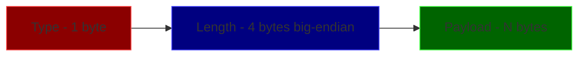

# Act 4 — The Deep: Escape or Perish

> *The castle shudders. The walls are closing in. Whatever lives in the deep knows you're here — and it's hungry. You've built the bones of Shadowkeep: rooms, items, monsters, multiplayer, persistence, graceful shutdown. Now it's time to give it teeth.*


**What you'll build in Act 4:**
- A turn-based combat system where monsters fight back
- A scripting DSL that brings rooms to life
- A persistent leaderboard tracking who escaped fastest
- ANSI color output that makes the terminal drip with atmosphere
- A custom binary protocol replacing raw text over TCP
- A release build deployed to EC2 where your friends can connect

**New dependencies for Act 4** — update your `Cargo.toml`:

```toml
[package]
name = "shadowkeep"
version = "0.4.0"
edition = "2024"

[dependencies]
tokio = { version = "1.51", features = ["full"] }
serde = { version = "1", features = ["derive"] }
serde_json = "1"
serde_yaml = "0.9"
chrono = { version = "0.4.44", features = ["serde"] }
crossterm = "0.29"
rand = "0.8"
```

---

## Stage 25 — The Combat System

A horror game where monsters are just scenery is a haunted house tour, not a survival experience. Combat is where the game's data model gets tested under pressure: player state must transition between exploring, fighting, and dead; damage must be calculated with randomness; items must have effects. More importantly, modeling combat as a state machine with Rust enums shows you how the type system prevents impossible states — a dead player can't attack, a fleeing player can't use items. The compiler enforces the horror's rules.

**Difficulty: Hard (60-90 min)**

### Story Beat

> *You descend the spiral staircase into the crypt. The air is thick, wet, wrong. Something scrapes against stone in the darkness ahead. Your torch flickers. A shape unfolds from the shadows — too many limbs, too many eyes. It sees you. It's been waiting.*
>
> *In Shadowkeep, you don't just walk past monsters. You fight them — or they eat you.*

### Concept: Enums as State Machines

Combat is a state machine. A player is either exploring, fighting, or dead. Rust's enums model this perfectly — each state can carry different data, and the compiler ensures you handle every case. This is where Rust's type system shines compared to Python/TS, where you'd use string flags and hope for the best.

### Instructions

**Step 1: Define combat types**

Right now monsters are just descriptions — they appear in rooms but can't hurt you and you can't hurt them. We need stats (HP, attack, defense), a state machine that tracks whether the player is exploring, fighting, or dead, and a combat engine that resolves attacks. The player's state determines which commands are valid — you can't `go north` mid-fight, and you can't `attack` while exploring.

Create `src/combat.rs`:

```rust
use serde::{Deserialize, Serialize};
use rand::Rng;

/// Every entity in combat has stats.
#[derive(Debug, Clone, Serialize, Deserialize)]
pub struct CombatStats {
    pub hp: i32,
    pub max_hp: i32,
    pub attack: i32,
    pub defense: i32,
}

/// What state is a player in?
/// This is a Rust enum with data — like a tagged union.
/// Python equivalent would be a class hierarchy or string flags.
/// TS equivalent would be a discriminated union type.
#[derive(Debug, Clone, Serialize, Deserialize)]
pub enum PlayerState {
    Exploring,
    InCombat {
        monster_id: String,
        monster_hp: i32,
        turn: u32,
    },
    Dead,
}

/// A monster template — what spawns in a room.
#[derive(Debug, Clone, Serialize, Deserialize)]
pub struct Monster {
    pub id: String,
    pub name: String,
    pub description: String,
    pub stats: CombatStats,
    pub attack_messages: Vec<String>,
    pub death_message: String,
}
```

**Why `i32` for HP?** HP can go negative from overkill damage. Using `u32` would require underflow checks everywhere. Signed integers are simpler here — a pattern you'll see in game dev.

**Step 2: Build the combat engine**

Add to `src/combat.rs`:

```rust
/// The result of a single combat action.
pub enum CombatEvent {
    PlayerAttacks { damage: i32, message: String },
    MonsterAttacks { damage: i32, message: String },
    MonsterDied { message: String },
    PlayerDied { message: String },
    PlayerFled,
}

/// Roll damage: base_attack +/- 30% randomness, minus defense.
/// Returns at least 1 damage (you always scratch them).
pub fn calculate_damage(attack: i32, defense: i32) -> i32 {
    let mut rng = rand::thread_rng();
    // Vary attack by +/- 30%
    let variance = (attack as f64 * 0.3) as i32;
    let roll = rng.gen_range(-variance..=variance);
    let raw = attack + roll - defense;
    raw.max(1) // Always deal at least 1 damage
}

/// Process one round of combat. Player attacks first, then monster retaliates.
/// Returns a vec of events that happened this round.
pub fn combat_round(
    player_stats: &mut CombatStats,
    monster: &Monster,
    monster_hp: &mut i32,
) -> Vec<CombatEvent> {
    let mut events = Vec::new();

    // Player attacks
    let player_dmg = calculate_damage(player_stats.attack, monster.stats.defense);
    *monster_hp -= player_dmg;
    events.push(CombatEvent::PlayerAttacks {
        damage: player_dmg,
        message: format!(
            "You strike the {} for {} damage!",
            monster.name, player_dmg
        ),
    });

    // Check if monster died
    if *monster_hp <= 0 {
        events.push(CombatEvent::MonsterDied {
            message: monster.death_message.clone(),
        });
        return events;
    }

    // Monster retaliates
    let monster_dmg = calculate_damage(monster.stats.attack, player_stats.defense);
    player_stats.hp -= monster_dmg;

    // Pick a random attack message
    let msg = if monster.attack_messages.is_empty() {
        format!("The {} attacks you for {} damage!", monster.name, monster_dmg)
    } else {
        let idx = rand::thread_rng().gen_range(0..monster.attack_messages.len());
        format!("{} ({} damage)", monster.attack_messages[idx], monster_dmg)
    };

    events.push(CombatEvent::MonsterAttacks {
        damage: monster_dmg,
        message: msg,
    });

    // Check if player died
    if player_stats.hp <= 0 {
        events.push(CombatEvent::PlayerDied {
            message: "Your vision fades to black. The darkness claims another soul."
                .to_string(),
        });
    }

    events
}

/// Attempt to flee. 40% chance of success. On failure, monster gets a free hit.
pub fn attempt_flee(
    player_stats: &mut CombatStats,
    monster: &Monster,
) -> Vec<CombatEvent> {
    let mut events = Vec::new();
    let roll: f64 = rand::thread_rng().gen();

    if roll < 0.4 {
        events.push(CombatEvent::PlayerFled);
    } else {
        let monster_dmg = calculate_damage(monster.stats.attack, player_stats.defense);
        player_stats.hp -= monster_dmg;
        let msg = format!(
            "You try to run but the {} blocks your escape! ({} damage)",
            monster.name, monster_dmg
        );
        events.push(CombatEvent::MonsterAttacks {
            damage: monster_dmg,
            message: msg,
        });
        if player_stats.hp <= 0 {
            events.push(CombatEvent::PlayerDied {
                message: "You stumble and fall. The last thing you see is teeth.".to_string(),
            });
        }
    }

    events
}
```

**Step 3: Create some horrifying monsters**

Add a function to create the monster bestiary:

```rust
/// The horrors that inhabit Shadowkeep.
pub fn create_bestiary() -> Vec<Monster> {
    vec![
        Monster {
            id: "shadow_crawler".to_string(),
            name: "Shadow Crawler".to_string(),
            description: "A mass of writhing limbs that skitters across the ceiling. \
                Its body is wrong — joints bend backwards, fingers too long, \
                and where its face should be there is only a wet, clicking mouth."
                .to_string(),
            stats: CombatStats {
                hp: 30,
                max_hp: 30,
                attack: 8,
                defense: 2,
            },
            attack_messages: vec![
                "The Shadow Crawler drops from the ceiling onto your back!".to_string(),
                "A barbed limb lashes out from the darkness!".to_string(),
                "It scuttles behind you — you feel teeth on your neck!".to_string(),
            ],
            death_message: "The Shadow Crawler shrieks — a sound like breaking glass \
                — and dissolves into oily smoke."
                .to_string(),
        },
        Monster {
            id: "the_watcher".to_string(),
            name: "The Watcher".to_string(),
            description: "A floating sphere of pale flesh, covered in unblinking eyes. \
                Each eye weeps a dark fluid. It doesn't move — it simply \
                appears closer each time you look away."
                .to_string(),
            stats: CombatStats {
                hp: 50,
                max_hp: 50,
                attack: 12,
                defense: 5,
            },
            attack_messages: vec![
                "Every eye focuses on you at once. Pain explodes behind your eyes!".to_string(),
                "The Watcher blinks — and you feel your blood freeze!".to_string(),
                "A beam of sickly light lances from its central eye!".to_string(),
            ],
            death_message: "The Watcher's eyes close, one by one. It sinks to the floor \
                like a deflating balloon, weeping black tears."
                .to_string(),
        },
        Monster {
            id: "bone_puppet".to_string(),
            name: "Bone Puppet".to_string(),
            description: "What was once a person. The bones have been rearranged — \
                ribs on the outside, spine coiled like a spring. It moves \
                in jerks, pulled by invisible strings."
                .to_string(),
            stats: CombatStats {
                hp: 20,
                max_hp: 20,
                attack: 6,
                defense: 1,
            },
            attack_messages: vec![
                "The Bone Puppet lunges with a sharpened rib!".to_string(),
                "It grabs you with fingers made of vertebrae!".to_string(),
                "The puppet's jaw unhinges and it bites!".to_string(),
            ],
            death_message: "The strings are cut. The bones clatter to the floor \
                in a heap, finally still."
                .to_string(),
        },
    ]
}
```

**Step 4: Wire combat into the command parser**

In your existing command handler (wherever you process player input), add combat commands:

```rust
// In your command processing match block:
match player_state {
    PlayerState::Exploring => {
        match command.as_str() {
            "attack" | "fight" => {
                // Find a monster in the current room
                if let Some(monster) = find_monster_in_room(room_id, &bestiary) {
                    player_state = PlayerState::InCombat {
                        monster_id: monster.id.clone(),
                        monster_hp: monster.stats.hp,
                        turn: 0,
                    };
                    let msg = format!(
                        "\n--- COMBAT ---\n{}\n{}\nHP: {}/{}\n\
                         Commands: attack, flee, use <item>\n",
                        monster.name, monster.description,
                        monster.stats.hp, monster.stats.max_hp
                    );
                    send_to_player(&msg).await;
                } else {
                    send_to_player("There's nothing to fight here.\n").await;
                }
            }
            // ... other exploration commands
            _ => {}
        }
    }
    PlayerState::InCombat { monster_id, monster_hp, turn } => {
        match command.as_str() {
            "attack" | "hit" | "strike" => {
                let monster = find_monster_by_id(monster_id, &bestiary).unwrap();
                let events = combat_round(
                    &mut player_stats,
                    &monster,
                    monster_hp,
                );
                for event in &events {
                    match event {
                        CombatEvent::PlayerAttacks { message, .. } => {
                            send_to_player(&format!("{}\n", message)).await;
                        }
                        CombatEvent::MonsterAttacks { message, .. } => {
                            send_to_player(&format!("{}\n", message)).await;
                        }
                        CombatEvent::MonsterDied { message } => {
                            send_to_player(&format!("\n{}\n--- VICTORY ---\n", message)).await;
                            *player_state = PlayerState::Exploring;
                        }
                        CombatEvent::PlayerDied { message } => {
                            send_to_player(&format!("\n{}\n--- YOU DIED ---\n", message)).await;
                            *player_state = PlayerState::Dead;
                        }
                        CombatEvent::PlayerFled => {} // handled below
                    }
                }
                *turn += 1;
            }
            "flee" | "run" => {
                let monster = find_monster_by_id(monster_id, &bestiary).unwrap();
                let events = attempt_flee(&mut player_stats, &monster);
                for event in &events {
                    match event {
                        CombatEvent::PlayerFled => {
                            send_to_player(
                                "You tear yourself free and sprint into the darkness!\n"
                            ).await;
                            *player_state = PlayerState::Exploring;
                        }
                        CombatEvent::MonsterAttacks { message, .. } => {
                            send_to_player(&format!("{}\n", message)).await;
                        }
                        CombatEvent::PlayerDied { message } => {
                            send_to_player(&format!("\n{}\n--- YOU DIED ---\n", message)).await;
                            *player_state = PlayerState::Dead;
                        }
                        _ => {}
                    }
                }
            }
            _ => {
                send_to_player("You're in combat! Commands: attack, flee, use <item>\n").await;
            }
        }
    }
    PlayerState::Dead => {
        send_to_player("You are dead. Type 'respawn' to try again.\n").await;
    }
}
```

**Step 5: Add `use <item>` in combat**

Healing items make combat tactical. Add this inside the `InCombat` match:

```rust
cmd if cmd.starts_with("use ") => {
    let item_name = &cmd[4..].trim();
    // Check player inventory for the item
    if let Some(item) = find_item_in_inventory(item_name, &player_inventory) {
        match item.effect {
            ItemEffect::Heal(amount) => {
                player_stats.hp = (player_stats.hp + amount).min(player_stats.max_hp);
                send_to_player(&format!(
                    "You use the {}. Restored {} HP. ({}/{})\n",
                    item.name, amount, player_stats.hp, player_stats.max_hp
                )).await;
                // Remove consumable from inventory
                remove_from_inventory(item_name, &mut player_inventory);
            }
            ItemEffect::Damage(amount) => {
                *monster_hp -= amount;
                send_to_player(&format!(
                    "You hurl the {} at the monster! {} damage!\n",
                    item.name, amount
                )).await;
                remove_from_inventory(item_name, &mut player_inventory);
                if *monster_hp <= 0 {
                    let monster = find_monster_by_id(monster_id, &bestiary).unwrap();
                    send_to_player(&format!(
                        "\n{}\n--- VICTORY ---\n",
                        monster.death_message
                    )).await;
                    *player_state = PlayerState::Exploring;
                }
            }
            _ => {
                send_to_player("That item can't be used in combat.\n").await;
            }
        }
    } else {
        send_to_player(&format!("You don't have a '{}'.\n", item_name)).await;
    }
}
```

### Test

Open two terminals:

```bash
# Terminal 1 — start the server
cargo run

# Terminal 2 — connect and fight
nc localhost 7878
> look
# (should see a room with a monster)
> attack
# Should see: "--- COMBAT ---" with monster description
> attack
# Should see damage dealt and received
> flee
# 40% chance to escape, otherwise take damage
```

Verify:
- Damage varies between attacks (randomness working)
- Monster dies when HP reaches 0
- Player dies when HP reaches 0
- `flee` sometimes works, sometimes doesn't
- `use potion` heals during combat

### Rust Aside: Enums vs. Inheritance

In Python, you might model combat state with a class hierarchy:

```python
class PlayerState:
    pass

class Exploring(PlayerState):
    pass

class InCombat(PlayerState):
    def __init__(self, monster_id, monster_hp, turn):
        self.monster_id = monster_id
        # ...
```

In TypeScript, a discriminated union:

```typescript
type PlayerState =
  | { kind: "exploring" }
  | { kind: "inCombat"; monsterId: string; monsterHp: number }
  | { kind: "dead" };
```

Rust's enum is closest to the TS version, but with a critical difference: **the compiler forces you to handle every variant**. If you add a new state like `Stunned`, every `match` on `PlayerState` will fail to compile until you handle it. In Python/TS, you'd get a runtime error — maybe in production, maybe at 3am.

This is called **exhaustive matching**, and it's one of the reasons Rust code tends to have fewer bugs at runtime.

Monsters fight back, players can die and respawn. But every room interaction is still hardcoded in Rust — adding a new puzzle means recompiling. The castle needs a way to script its own behaviors.

### Checkpoint: Cargo.toml additions

```toml
# Make sure these are in [dependencies]:
rand = "0.8"
```

### Checkpoint: src/combat.rs

The complete file is everything from Steps 1-3 above combined into a single module. Add `pub mod combat;` to your `src/main.rs`.

---

## Stage 26 — Room Scripts

Hardcoding every room interaction in Rust means recompiling for every new puzzle, trap, or secret passage. Data-driven design separates *what happens* (YAML files) from *how it happens* (the Rust engine). This is the same pattern used by Unity, Godot, and every real game engine — designers create content without touching code. You're building a mini scripting engine, and the serde skills you learned in Act 1 make it almost trivial.

**Difficulty: Hard (60-90 min)**

### Story Beat

> *The library is different from the other rooms. When you step inside, the candles ignite on their own. A book flies off the shelf and opens to a page that reads: "SPEAK THE NAME AND THE WAY OPENS." You say the word scratched into the wall — and a hidden door grinds open behind the fireplace.*
>
> *Rooms in Shadowkeep aren't just containers. They have behaviors — triggers, traps, puzzles. You need a way to script them without hardcoding every interaction.*

### Concept: Data-Driven Design with YAML

Instead of writing Rust code for every room event, you'll define room behaviors in YAML files. The game engine reads these scripts and executes them. This is the same pattern used in real game engines (Unity, Godot) — separate data from logic so designers can create content without recompiling.

### Instructions

**Step 1: Define the script data model**

Right now every room interaction is hardcoded in Rust — if you want the library candles to ignite on entry, you write an `if room_id == "library"` check in the game loop. Adding a new puzzle means editing Rust code and recompiling. We need a data format that describes *when* something triggers and *what* happens, so the engine can execute arbitrary room behaviors from external files.

Create `src/room_script.rs`:

```rust
use serde::{Deserialize, Serialize};
use std::collections::HashMap;

/// When does this script trigger?
#[derive(Debug, Clone, Serialize, Deserialize)]
#[serde(tag = "type")]
pub enum Trigger {
    /// Fires when a player enters the room
    #[serde(rename = "on_enter")]
    OnEnter,
    /// Fires when a player uses a specific item
    #[serde(rename = "on_use_item")]
    OnUseItem { item: String },
    /// Fires when a player says a specific phrase
    #[serde(rename = "on_say")]
    OnSay { phrase: String },
    /// Fires when a player examines something specific
    #[serde(rename = "on_examine")]
    OnExamine { target: String },
}

/// What happens when the trigger fires?
#[derive(Debug, Clone, Serialize, Deserialize)]
#[serde(tag = "type")]
pub enum Action {
    /// Display a message to the player
    #[serde(rename = "message")]
    Message { text: String },
    /// Display a message to everyone in the room
    #[serde(rename = "broadcast")]
    Broadcast { text: String },
    /// Unlock a door/exit that was previously hidden
    #[serde(rename = "unlock_exit")]
    UnlockExit { direction: String, room_id: String },
    /// Give an item to the player
    #[serde(rename = "give_item")]
    GiveItem { item_id: String },
    /// Remove an item from the player's inventory
    #[serde(rename = "take_item")]
    TakeItem { item_id: String },
    /// Spawn a monster in the room
    #[serde(rename = "spawn_monster")]
    SpawnMonster { monster_id: String },
    /// Deal damage to the player
    #[serde(rename = "damage")]
    Damage { amount: i32, message: String },
    /// Heal the player
    #[serde(rename = "heal")]
    Heal { amount: i32, message: String },
    /// Set a flag (for tracking puzzle state)
    #[serde(rename = "set_flag")]
    SetFlag { flag: String, value: bool },
}

/// A single script rule: trigger + conditions + actions.
#[derive(Debug, Clone, Serialize, Deserialize)]
pub struct ScriptRule {
    pub trigger: Trigger,
    /// Optional: only fire if these flags are set
    #[serde(default)]
    pub requires_flags: Vec<String>,
    /// Optional: only fire once
    #[serde(default)]
    pub once: bool,
    /// The actions to execute in order
    pub actions: Vec<Action>,
}

/// All scripts for a single room.
#[derive(Debug, Clone, Serialize, Deserialize)]
pub struct RoomScript {
    pub room_id: String,
    pub scripts: Vec<ScriptRule>,
}
```

**Why `#[serde(tag = "type")]`?** This tells serde to use a `"type"` field in the YAML to determine which enum variant to deserialize into. Without it, serde would use an externally tagged format that's harder to write by hand.

**Step 2: Create a YAML room script**

Create `data/scripts/crypt_library.yaml`:

```yaml
room_id: crypt_library
scripts:
  - trigger:
      type: on_enter
    once: true
    actions:
      - type: message
        text: >
          The candles along the walls ignite as you step inside.
          Dust motes swirl in the sudden light. Thousands of books
          line the shelves — their spines are blank.
      - type: broadcast
        text: "A cold wind blows through the castle. Someone has entered the library."

  - trigger:
      type: on_examine
      target: books
    actions:
      - type: message
        text: >
          You pull a book from the shelf. The pages are filled with
          the same word, repeated thousands of times: VERATH.
          The ink is brown. You hope it's ink.

  - trigger:
      type: on_say
      phrase: verath
    requires_flags: []
    actions:
      - type: message
        text: >
          The word echoes unnaturally, bouncing off walls that shouldn't
          have echoes. Behind the fireplace, stone grinds against stone.
          A hidden passage is revealed.
      - type: unlock_exit
        direction: down
        room_id: hidden_vault
      - type: set_flag
        flag: library_secret_found
        value: true

  - trigger:
      type: on_use_item
      item: silver_key
    requires_flags:
      - library_secret_found
    actions:
      - type: message
        text: >
          The silver key fits the lock on the glass case. Inside,
          a vial of glowing liquid — the Elixir of Clarity.
      - type: give_item
        item_id: elixir_of_clarity
      - type: take_item
        item_id: silver_key
```

**Step 3: Build the script engine**

Add to `src/room_script.rs`:

```rust
use std::fs;
use std::path::Path;

/// Runtime state for tracking which scripts have fired.
#[derive(Debug, Default, Clone, Serialize, Deserialize)]
pub struct ScriptState {
    /// Global flags set by scripts
    pub flags: HashMap<String, bool>,
    /// Track which (room_id, script_index) pairs have fired (for `once` scripts)
    pub fired: Vec<(String, usize)>,
}

impl ScriptState {
    pub fn has_flag(&self, flag: &str) -> bool {
        self.flags.get(flag).copied().unwrap_or(false)
    }

    pub fn has_fired(&self, room_id: &str, index: usize) -> bool {
        self.fired.contains(&(room_id.to_string(), index))
    }
}

/// Load all room scripts from a directory.
pub fn load_scripts(dir: &Path) -> HashMap<String, RoomScript> {
    let mut scripts = HashMap::new();

    if let Ok(entries) = fs::read_dir(dir) {
        for entry in entries.flatten() {
            let path = entry.path();
            if path.extension().is_some_and(|e| e == "yaml" || e == "yml") {
                match fs::read_to_string(&path) {
                    Ok(content) => match serde_yaml::from_str::<RoomScript>(&content) {
                        Ok(script) => {
                            scripts.insert(script.room_id.clone(), script);
                        }
                        Err(e) => {
                            eprintln!("Failed to parse {:?}: {}", path, e);
                        }
                    },
                    Err(e) => {
                        eprintln!("Failed to read {:?}: {}", path, e);
                    }
                }
            }
        }
    }

    scripts
}

/// Evaluate which scripts should fire for a given trigger in a room.
/// Returns the list of actions to execute.
pub fn evaluate_trigger(
    room_id: &str,
    trigger: &Trigger,
    scripts: &HashMap<String, RoomScript>,
    state: &mut ScriptState,
) -> Vec<Action> {
    let mut actions = Vec::new();

    let room_script = match scripts.get(room_id) {
        Some(s) => s,
        None => return actions,
    };

    for (index, rule) in room_script.scripts.iter().enumerate() {
        // Check if trigger matches
        if !trigger_matches(&rule.trigger, trigger) {
            continue;
        }

        // Check if already fired (for `once` scripts)
        if rule.once && state.has_fired(room_id, index) {
            continue;
        }

        // Check required flags
        let flags_met = rule
            .requires_flags
            .iter()
            .all(|f| state.has_flag(f));
        if !flags_met {
            continue;
        }

        // Fire the script
        actions.extend(rule.actions.clone());

        // Mark as fired
        if rule.once {
            state.fired.push((room_id.to_string(), index));
        }

        // Process set_flag actions immediately so later scripts can see them
        for action in &rule.actions {
            if let Action::SetFlag { flag, value } = action {
                state.flags.insert(flag.clone(), *value);
            }
        }
    }

    actions
}

/// Check if two triggers match.
fn trigger_matches(rule_trigger: &Trigger, event_trigger: &Trigger) -> bool {
    match (rule_trigger, event_trigger) {
        (Trigger::OnEnter, Trigger::OnEnter) => true,
        (
            Trigger::OnUseItem { item: expected },
            Trigger::OnUseItem { item: actual },
        ) => expected.eq_ignore_ascii_case(actual),
        (
            Trigger::OnSay { phrase: expected },
            Trigger::OnSay { phrase: actual },
        ) => actual.to_lowercase().contains(&expected.to_lowercase()),
        (
            Trigger::OnExamine { target: expected },
            Trigger::OnExamine { target: actual },
        ) => expected.eq_ignore_ascii_case(actual),
        _ => false,
    }
}
```

**Step 4: Integrate scripts into the game loop**

In your main game loop, fire triggers at the right moments:

```rust
use crate::room_script::{evaluate_trigger, Trigger, Action};

// When a player enters a room:
let actions = evaluate_trigger(
    &room_id,
    &Trigger::OnEnter,
    &room_scripts,
    &mut script_state,
);
execute_actions(actions, &mut player, &tx).await;

// When a player says something:
let actions = evaluate_trigger(
    &room_id,
    &Trigger::OnSay { phrase: message.clone() },
    &room_scripts,
    &mut script_state,
);
execute_actions(actions, &mut player, &tx).await;

// The action executor:
async fn execute_actions(
    actions: Vec<Action>,
    player: &mut Player,
    tx: &broadcast::Sender<String>,
) {
    for action in actions {
        match action {
            Action::Message { text } => {
                let _ = player.send(&text).await;
            }
            Action::Broadcast { text } => {
                let _ = tx.send(text);
            }
            Action::UnlockExit { direction, room_id } => {
                player.current_room_mut().exits.insert(direction, room_id);
                let _ = player.send("A new path has opened!\n").await;
            }
            Action::GiveItem { item_id } => {
                if let Some(item) = create_item(&item_id) {
                    player.inventory.push(item);
                    let _ = player.send("You received an item!\n").await;
                }
            }
            Action::TakeItem { item_id } => {
                player.inventory.retain(|i| i.id != item_id);
            }
            Action::SpawnMonster { monster_id } => {
                // Add monster to current room
                spawn_monster_in_room(&player.room_id, &monster_id);
            }
            Action::Damage { amount, message } => {
                player.stats.hp -= amount;
                let _ = player.send(&format!("{} (-{} HP)\n", message, amount)).await;
            }
            Action::Heal { amount, message } => {
                player.stats.hp = (player.stats.hp + amount).min(player.stats.max_hp);
                let _ = player.send(&format!("{} (+{} HP)\n", message, amount)).await;
            }
            Action::SetFlag { .. } => {
                // Already handled during evaluation
            }
        }
    }
}
```

### Test

```bash
# Terminal 1
cargo run

# Terminal 2
nc localhost 7878
> go library
# Should see: candles igniting message (on_enter, once)
> go hallway
> go library
# Should NOT see the candle message again (once: true)
> examine books
# Should see: the VERATH message
> say verath
# Should see: hidden passage revealed, new exit unlocked
> go down
# Should work — leads to hidden_vault
```

Create a second script file to verify multiple rooms work:

```yaml
# data/scripts/entrance_hall.yaml
room_id: entrance_hall
scripts:
  - trigger:
      type: on_enter
    once: true
    actions:
      - type: message
        text: "The front door slams shut behind you. It won't open again."
      - type: damage
        amount: 5
        message: "Splinters from the door cut your arm."
```

### Rust Aside: Serde Tagged Enums

The `#[serde(tag = "type")]` attribute is doing heavy lifting here. Without it, serde would serialize `Trigger::OnEnter` as:

```json
{ "OnEnter": {} }
```

With the tag, it becomes:

```yaml
type: on_enter
```

This is called **internally tagged** representation. It's much more natural for hand-written YAML/JSON. The `#[serde(rename = "on_enter")]` on each variant controls the exact string used.

In Python, you'd parse this manually with `if data["type"] == "on_enter"`. In TypeScript, you'd use a discriminated union with a `type` field — which is actually the same pattern, but without compile-time exhaustiveness checking.

Rooms come alive with scripts — candles ignite, secrets reveal themselves, traps spring. But there's no record of who survived. The castle needs a wall of names: a leaderboard that remembers the fastest, the bravest, and the dead.

### Checkpoint: Cargo.toml additions

```toml
serde_yaml = "0.9"
```

### Checkpoint: src/room_script.rs

The complete file is Steps 1 + 3 combined. Add `pub mod room_script;` to `src/main.rs`.

---

## Stage 27 — The Leaderboard

A game without stakes is a sandbox. The leaderboard gives players a reason to replay — to escape faster, kill more monsters, explore more rooms. Building it teaches you `chrono` for time handling (a skill every backend developer needs), sorted collections, and the full persistence cycle: load from disk, update in memory, save back. The leaderboard is also the first feature that persists across server restarts, proving your save system works end-to-end.

**Difficulty: Medium (30-60 min)**

### Story Beat

> *Scratched into the wall near the castle exit, you find a list of names. Some are centuries old. Each has a time next to it — how long it took them to escape. Most names are crossed out. Those ones didn't make it. There's space at the bottom for one more name.*
>
> *Shadowkeep remembers everyone who enters. The fastest escapees are legends. The rest are footnotes.*

### Concept: Working with Time (chrono) and Sorted Collections

You'll use the `chrono` crate for timestamps and durations, and learn how Rust handles time differently from Python/TS. You'll also implement a sorted leaderboard with `Vec::sort_by` and persist it to JSON.

### Instructions

**Step 1: Define the leaderboard data model**

Right now the game has no memory of past runs — every session starts fresh, and escaping the castle has no lasting consequence. We need a persistent record of who escaped, how fast, and what they accomplished, sorted by speed so the best runs rise to the top.

Create `src/leaderboard.rs`:

```rust
use chrono::{DateTime, Utc, TimeDelta};
use serde::{Deserialize, Serialize};
use std::fs;
use std::path::Path;

/// A single leaderboard entry — one player's escape record.
#[derive(Debug, Clone, Serialize, Deserialize)]
pub struct LeaderboardEntry {
    pub player_name: String,
    pub escape_time: TimeDelta,
    pub monsters_killed: u32,
    pub rooms_explored: u32,
    pub date: DateTime<Utc>,
}

/// The full leaderboard, persisted to disk.
#[derive(Debug, Clone, Serialize, Deserialize, Default)]
pub struct Leaderboard {
    pub entries: Vec<LeaderboardEntry>,
}
```

**Why `TimeDelta` instead of `std::time::Duration`?** `chrono::TimeDelta` (formerly called `Duration`) serializes cleanly with serde and integrates with `DateTime` arithmetic. `std::time::Duration` is unsigned and doesn't serialize by default.

**Step 2: Implement leaderboard operations**

```rust
impl Leaderboard {
    const MAX_ENTRIES: usize = 100;
    const FILE_NAME: &str = "data/leaderboard.json";

    /// Load from disk, or create empty if file doesn't exist.
    pub fn load() -> Self {
        let path = Path::new(Self::FILE_NAME);
        if path.exists() {
            match fs::read_to_string(path) {
                Ok(content) => {
                    serde_json::from_str(&content).unwrap_or_default()
                }
                Err(_) => Self::default(),
            }
        } else {
            Self::default()
        }
    }

    /// Save to disk.
    pub fn save(&self) -> std::io::Result<()> {
        let path = Path::new(Self::FILE_NAME);
        // Ensure parent directory exists
        if let Some(parent) = path.parent() {
            fs::create_dir_all(parent)?;
        }
        let json = serde_json::to_string_pretty(self)?;
        fs::write(path, json)
    }

    /// Add a new entry and re-sort. Returns the rank (1-indexed).
    pub fn add_entry(&mut self, entry: LeaderboardEntry) -> usize {
        self.entries.push(entry);

        // Sort by escape time (fastest first)
        self.entries.sort_by(|a, b| a.escape_time.cmp(&b.escape_time));

        // Trim to max size
        self.entries.truncate(Self::MAX_ENTRIES);

        // Find the rank of the entry we just added
        let rank = self
            .entries
            .iter()
            .position(|e| {
                e.player_name == self.entries.last().map(|l| &l.player_name).unwrap_or(&String::new())
                    && e.date == self.entries.last().map(|l| l.date).unwrap_or_default()
            })
            .map(|i| i + 1)
            .unwrap_or(self.entries.len());

        rank
    }

    /// Format the top N entries as a displayable string.
    pub fn format_top(&self, n: usize) -> String {
        if self.entries.is_empty() {
            return "The leaderboard is empty. No one has escaped... yet.\n".to_string();
        }

        let mut output = String::new();
        output.push_str("\n=== SHADOWKEEP LEADERBOARD ===\n\n");
        output.push_str(&format!(
            "{:<5} {:<20} {:<12} {:<8} {:<8} {}\n",
            "Rank", "Name", "Time", "Kills", "Rooms", "Date"
        ));
        output.push_str(&"-".repeat(70));
        output.push('\n');

        for (i, entry) in self.entries.iter().take(n).enumerate() {
            let time_str = format_duration(&entry.escape_time);
            let date_str = entry.date.format("%Y-%m-%d").to_string();
            output.push_str(&format!(
                "{:<5} {:<20} {:<12} {:<8} {:<8} {}\n",
                i + 1,
                truncate_name(&entry.player_name, 19),
                time_str,
                entry.monsters_killed,
                entry.rooms_explored,
                date_str,
            ));
        }

        output.push_str(&"=".repeat(70));
        output.push('\n');
        output
    }
}

/// Format a TimeDelta as "Xm Ys" or "Xh Ym Zs".
fn format_duration(d: &TimeDelta) -> String {
    let total_secs = d.num_seconds();
    let hours = total_secs / 3600;
    let minutes = (total_secs % 3600) / 60;
    let seconds = total_secs % 60;

    if hours > 0 {
        format!("{}h {}m {}s", hours, minutes, seconds)
    } else if minutes > 0 {
        format!("{}m {}s", minutes, seconds)
    } else {
        format!("{}s", seconds)
    }
}

/// Truncate a name to fit the column width.
fn truncate_name(name: &str, max_len: usize) -> String {
    if name.len() <= max_len {
        name.to_string()
    } else {
        format!("{}...", &name[..max_len - 3])
    }
}
```

**Step 3: Track player session timing**

In your player struct, add timing fields:

```rust
use chrono::{DateTime, Utc};

pub struct PlayerSession {
    // ... existing fields ...
    pub start_time: DateTime<Utc>,
    pub monsters_killed: u32,
    pub rooms_explored: u32,
}

impl PlayerSession {
    pub fn new(name: String) -> Self {
        Self {
            // ... existing fields ...
            start_time: Utc::now(),  // Capture the moment they connect
            monsters_killed: 0,
            rooms_explored: 0,
        }
    }
}
```

**Step 4: Record escape and show leaderboard**

When a player reaches the exit room:

```rust
use crate::leaderboard::{Leaderboard, LeaderboardEntry};
use chrono::Utc;

// When player enters the "castle_exit" room:
if room_id == "castle_exit" {
    let escape_time = Utc::now() - player.start_time;
    let entry = LeaderboardEntry {
        player_name: player.name.clone(),
        escape_time,
        monsters_killed: player.monsters_killed,
        rooms_explored: player.rooms_explored,
        date: Utc::now(),
    };

    let mut leaderboard = Leaderboard::load();
    let rank = leaderboard.add_entry(entry);
    let _ = leaderboard.save();

    let msg = format!(
        "\n*** YOU ESCAPED SHADOWKEEP! ***\n\
         Rank: #{}\n\
         Time: {}\n\
         Monsters slain: {}\n\
         Rooms explored: {}\n\n{}",
        rank,
        format_duration(&escape_time),
        player.monsters_killed,
        player.rooms_explored,
        leaderboard.format_top(10),
    );
    send_to_player(&msg).await;
}
```

Add a `leaderboard` command so players can check rankings anytime:

```rust
"leaderboard" | "scores" | "top" => {
    let leaderboard = Leaderboard::load();
    send_to_player(&leaderboard.format_top(10)).await;
}
```

### Test

```bash
cargo run

# In another terminal:
nc localhost 7878
> leaderboard
# Should show: "The leaderboard is empty..."

# Navigate to the exit room (however your map is set up)
# Should see escape message with rank #1

# Connect again, escape again
> leaderboard
# Should show both entries, sorted by time
```

Verify the JSON file was created:

```bash
cat data/leaderboard.json
# Should show properly formatted JSON with your entries
```

### Rust Aside: chrono vs std::time

Rust has two time ecosystems:

| Feature | `std::time` | `chrono` |
|---------|-------------|----------|
| Wall clock | `SystemTime` | `DateTime<Utc>` |
| Duration | `Duration` (unsigned) | `TimeDelta` (signed) |
| Formatting | Manual | `format("%Y-%m-%d")` |
| Serde | No built-in | `#[derive(Serialize)]` |
| Arithmetic | Limited | Full (`DateTime - DateTime = TimeDelta`) |

In Python, you'd use `datetime.now()` and `timedelta` — chrono is the closest Rust equivalent. In TypeScript, you'd use `Date.now()` and do millisecond math — chrono is much more ergonomic.

The key insight: `Utc::now()` returns a `DateTime<Utc>`, and subtracting two `DateTime` values gives you a `TimeDelta`. This is type-safe — you can't accidentally subtract a date from a duration.

Escape times are tracked, names are etched in stone. But the terminal is still monochrome — white text on black void. It's time to paint the darkness in shades of blood and shadow.

### Checkpoint: src/leaderboard.rs

The complete file is Steps 1 + 2 combined. Add `pub mod leaderboard;` to `src/main.rs`.

---

## Stage 28 — ANSI Colors

Plain white text on a black terminal is functional but lifeless. ANSI colors transform the experience — red for damage, green for healing, dim grey for whispers, bold magenta for monster names. This stage is deliberately easy after the complexity of combat and scripting. It's a reward: a few lines of code that make everything you've built *feel* like a horror game. The crossterm crate's `Stylize` trait is also a beautiful example of Rust's extension trait pattern.

**Difficulty: Easy (5-10 min)**

### Story Beat

> *The torch gutters. In its dying light, the blood on the walls looks black. But when you find a fresh torch and light it — the red is vivid, arterial, still wet. Color changes everything. The shadows are deeper. The monster's eyes glow. The healing potion shimmers green.*
>
> *Your terminal is about to become a lot more atmospheric.*

### Concept: ANSI Escape Codes and crossterm

Every terminal emulator (Ghostty, iTerm, Windows Terminal) understands ANSI escape codes — special byte sequences that control text color, style, and cursor position. The `crossterm` crate provides a safe, cross-platform API for generating these codes. Since we're sending text over TCP to netcat/telnet clients, we'll generate ANSI strings and send them as raw bytes.

### Instructions

**Step 1: Create a color helper module**

Create `src/colors.rs`:

```rust
use crossterm::style::Stylize;

/// Color a damage message in red.
pub fn damage(text: &str) -> String {
    format!("{}", text.dark_red())
}

/// Color a healing message in green.
pub fn heal(text: &str) -> String {
    format!("{}", text.green())
}

/// Color a whisper/ambient message in dim grey.
pub fn whisper(text: &str) -> String {
    format!("{}", text.dim())
}

/// Color a shout/important message in bold white.
pub fn shout(text: &str) -> String {
    format!("{}", text.bold())
}

/// Color a system message in dark cyan.
pub fn system(text: &str) -> String {
    format!("{}", text.dark_cyan())
}

/// Color monster names in magenta.
pub fn monster_name(text: &str) -> String {
    format!("{}", text.magenta().bold())
}

/// Color item names in yellow.
pub fn item_name(text: &str) -> String {
    format!("{}", text.yellow())
}

/// Color room names in blue.
pub fn room_name(text: &str) -> String {
    format!("{}", text.blue().bold())
}

/// Color player names in cyan.
pub fn player_name(text: &str) -> String {
    format!("{}", text.cyan())
}

/// Color the "YOU DIED" message — bold red on dark background.
pub fn death(text: &str) -> String {
    format!("{}", text.red().bold())
}

/// Color the "VICTORY" message — bold green.
pub fn victory(text: &str) -> String {
    format!("{}", text.green().bold())
}

/// Spooky atmospheric text — dark red, italic.
pub fn spooky(text: &str) -> String {
    format!("{}", text.dark_red().italic())
}
```

That's it. The `Stylize` trait from crossterm adds methods like `.red()`, `.bold()`, `.dim()` directly onto `&str` and `String`. When you `format!` the result, it produces a string containing ANSI escape codes.

**How it works under the hood:** `"hello".red()` produces a `StyledContent` that, when displayed, emits `\x1b[31mhello\x1b[0m` — the ANSI code for red foreground, followed by a reset. The terminal interprets these bytes and renders colored text.

**Step 2: Apply colors throughout the game**

Update your combat messages:

```rust
use crate::colors;

// In combat_round, update the PlayerAttacks event:
CombatEvent::PlayerAttacks {
    damage: player_dmg,
    message: colors::shout(&format!(
        "You strike the {} for {} damage!",
        colors::monster_name(&monster.name),
        player_dmg
    )),
}

// Monster death:
CombatEvent::MonsterDied {
    message: colors::victory(&monster.death_message),
}

// Player death:
CombatEvent::PlayerDied {
    message: colors::death(
        "Your vision fades to black. The darkness claims another soul."
    ),
}

// Healing items:
let msg = colors::heal(&format!(
    "You use the {}. Restored {} HP. ({}/{})",
    colors::item_name(&item.name),
    amount,
    player_stats.hp,
    player_stats.max_hp
));
```

Update room descriptions:

```rust
// When displaying a room:
let room_display = format!(
    "\n{}\n{}\n",
    colors::room_name(&room.name),
    colors::whisper(&room.description),
);
```

Update chat messages:

```rust
// Player chat:
let chat_msg = format!(
    "{}: {}\n",
    colors::player_name(&player.name),
    message,
);
```

**Step 3: Add a spooky welcome banner**

```rust
/// The banner shown when a player first connects.
pub fn welcome_banner() -> String {
    let skull = r#"
        _______________
       /               \
      /                 \
     |   XXXXX   XXXXX  |
     |   XXXXX   XXXXX  |
     |       XXX        |
     \      XXXXX      /
      \    XXXXXXX    /
       \_____________/
    "#;

    format!(
        "{}\n{}\n{}\n",
        colors::spooky(skull),
        colors::death("    S H A D O W K E E P"),
        colors::whisper("    Enter your name, brave soul..."),
    )
}
```

### Test

```bash
cargo run

# Connect with a terminal that supports ANSI colors:
nc localhost 7878
# Should see: colored welcome banner
# Red skull, bold red title, dim prompt

> attack
# Damage numbers should be red
# Monster names should be magenta
# Victory text should be green
```

If colors don't appear and you see raw escape codes like `[31m`, your terminal doesn't support ANSI. Ghostty, iTerm2, and most modern terminals handle this fine. The raw `nc` (netcat) on macOS passes ANSI codes through correctly.

### Rust Aside: The Stylize Trait Pattern

The `Stylize` trait is a great example of Rust's **extension trait** pattern. crossterm implements `Stylize` for `&str`, `String`, and `char` — types it doesn't own. This is possible because of Rust's **orphan rule exception**: you can implement your own trait for foreign types.

In Python, you'd monkey-patch `str` or use a function: `colored("text", "red")`. In TypeScript, you might extend `String.prototype` (frowned upon) or use a function: `chalk.red("text")`.

Rust's approach is cleaner — the trait is opt-in (you must `use Stylize`), type-safe, and doesn't modify the original type. The method chain `.red().bold()` reads naturally and composes well.

**Important:** These ANSI codes are just bytes in the string. They work over TCP because netcat/telnet pass raw bytes to the terminal. If you were building an HTTP API, you'd strip them and use HTML/CSS instead.

The castle bleeds color. But underneath the paint, messages are still raw text — no structure, no types, no way to tell where one ends and another begins. Time to speak in runes.

### Checkpoint: src/colors.rs

The complete file is Step 1 above. Add `pub mod colors;` to `src/main.rs`.

---

## Stage 29 — The Protocol

Raw text over TCP works for netcat, but it's fragile — you can't tell where one message ends and another begins, you can't distinguish message types, and you can't send binary data. Every production network service uses a framing protocol, and building one from scratch teaches you byte-level thinking: endianness, length prefixes, type tags. This is the same pattern behind HTTP/2 frames, WebSocket frames, and every binary protocol at AWS.

**Difficulty: Hard (60-90 min)**

### Story Beat

> *The castle's walls are covered in runes — a language older than words. Each rune is precise: a header that declares its intent, a body that carries its meaning, a seal that marks its end. The ancients didn't shout across rooms in plain text. They had a protocol.*
>
> *Right now, Shadowkeep speaks raw text over TCP. That works for netcat, but it's fragile — how do you tell where one message ends and another begins? What if a message contains a newline? What if you want to send binary data like a map image? Time to design a real protocol.*

### Concept: Length-Prefixed Framing

Every network protocol needs **framing** — a way to know where one message ends and the next begins. HTTP uses `Content-Length` headers and chunked encoding. WebSocket uses length-prefixed frames. We'll build something similar: a simple binary protocol with message types and length-prefixed payloads.



### Why Not HTTP?

You're an AWS engineer — you use HTTP every day. So why not use it for a game?

| Concern | HTTP | Custom TCP Protocol |
|---------|------|-------------------|
| Latency | High (headers, parsing) | Low (minimal overhead) |
| Connection | Request/response (or WebSocket upgrade) | Persistent bidirectional |
| Overhead | ~200-500 bytes per request (headers) | 5 bytes per message (type + length) |
| Server push | Requires WebSocket or SSE | Native — just write to the socket |
| Complexity | Need an HTTP library | DIY but simple |

For a real-time game where the server pushes events constantly (player moved, monster attacked, chat message), a persistent TCP connection with a lightweight framing protocol is ideal. This is what most game servers use — from Minecraft to MMOs.

### Instructions

**Step 1: Define message types**

Right now the server sends raw text strings over TCP — there's no way for the client to know whether incoming text is a room description, a combat event, a chat message, or a system notification. And there's no framing — if two messages arrive in the same TCP segment, the client can't tell where one ends and the next begins. We need a typed, length-prefixed protocol.

Create `src/protocol.rs`:

```rust
use tokio::io::{AsyncReadExt, AsyncWriteExt};
use tokio::net::TcpStream;

/// Message types for the Shadowkeep protocol.
/// Each type is a single byte — simple and fast to parse.
#[repr(u8)]
#[derive(Debug, Clone, Copy, PartialEq)]
pub enum MessageType {
    /// Client -> Server: player typed a command
    Command = 0x01,
    /// Server -> Client: narrative/room text
    Narrative = 0x02,
    /// Server -> Client: combat event
    Combat = 0x03,
    /// Server -> Client: chat message from another player
    Chat = 0x04,
    /// Server -> Client: system message (join/leave/error)
    System = 0x05,
    /// Client -> Server: player name during login
    Login = 0x06,
    /// Server -> Client: leaderboard data
    Leaderboard = 0x07,
    /// Bidirectional: keepalive ping/pong
    Ping = 0x08,
    Pong = 0x09,
}

impl MessageType {
    /// Convert a byte to a MessageType.
    pub fn from_byte(byte: u8) -> Option<Self> {
        match byte {
            0x01 => Some(Self::Command),
            0x02 => Some(Self::Narrative),
            0x03 => Some(Self::Combat),
            0x04 => Some(Self::Chat),
            0x05 => Some(Self::System),
            0x06 => Some(Self::Login),
            0x07 => Some(Self::Leaderboard),
            0x08 => Some(Self::Ping),
            0x09 => Some(Self::Pong),
            _ => None,
        }
    }
}
```

**Why `#[repr(u8)]`?** This tells Rust to store the enum as a single byte, matching our wire format. Without it, Rust might use a larger representation for optimization.

**Step 2: Implement frame encoding/decoding**

```rust
/// A framed message: type + payload.
#[derive(Debug, Clone)]
pub struct Frame {
    pub msg_type: MessageType,
    pub payload: Vec<u8>,
}

impl Frame {
    pub fn new(msg_type: MessageType, payload: impl Into<Vec<u8>>) -> Self {
        Self {
            msg_type,
            payload: payload.into(),
        }
    }

    /// Convenience: create a frame from a string payload.
    pub fn text(msg_type: MessageType, text: &str) -> Self {
        Self::new(msg_type, text.as_bytes().to_vec())
    }

    /// Encode this frame into bytes for transmission.
    ///
    /// Wire format:
    ///   [type: 1 byte][length: 4 bytes big-endian][payload: N bytes]
    ///
    /// Big-endian means the most significant byte comes first —
    /// this is the standard "network byte order" used by virtually
    /// all network protocols (TCP, IP, HTTP/2, DNS, etc.).
    pub fn encode(&self) -> Vec<u8> {
        let len = self.payload.len() as u32;
        let mut buf = Vec::with_capacity(5 + self.payload.len());
        buf.push(self.msg_type as u8);          // 1 byte: message type
        buf.extend_from_slice(&len.to_be_bytes()); // 4 bytes: payload length
        buf.extend_from_slice(&self.payload);      // N bytes: payload
        buf
    }

    /// Get the payload as a UTF-8 string (if valid).
    pub fn payload_str(&self) -> Option<&str> {
        std::str::from_utf8(&self.payload).ok()
    }
}
```

**Why big-endian?** Network protocols use big-endian (most significant byte first) by convention — it's called "network byte order." Your x86 Mac is little-endian natively, so `to_be_bytes()` swaps the byte order. ARM can be either, but Rust abstracts this away.

**Step 3: Async frame reader/writer**

```rust
/// Errors that can occur during frame I/O.
#[derive(Debug)]
pub enum FrameError {
    Io(std::io::Error),
    InvalidMessageType(u8),
    PayloadTooLarge(u32),
    ConnectionClosed,
}

impl From<std::io::Error> for FrameError {
    fn from(e: std::io::Error) -> Self {
        FrameError::Io(e)
    }
}

/// Maximum payload size: 64 KB. Prevents a malicious client from
/// sending a 4 GB payload and exhausting server memory.
const MAX_PAYLOAD_SIZE: u32 = 64 * 1024;

/// Read a single frame from a TCP stream.
///
/// This is async — it yields control while waiting for bytes,
/// allowing other tasks to run. This is the core of why Tokio
/// can handle thousands of connections on a single thread.
pub async fn read_frame(stream: &mut TcpStream) -> Result<Frame, FrameError> {
    // Read the 1-byte message type
    let msg_byte = match stream.read_u8().await {
        Ok(b) => b,
        Err(e) if e.kind() == std::io::ErrorKind::UnexpectedEof => {
            return Err(FrameError::ConnectionClosed);
        }
        Err(e) => return Err(FrameError::Io(e)),
    };

    let msg_type = MessageType::from_byte(msg_byte)
        .ok_or(FrameError::InvalidMessageType(msg_byte))?;

    // Read the 4-byte length (big-endian)
    let len = stream.read_u32().await?;

    // Validate payload size
    if len > MAX_PAYLOAD_SIZE {
        return Err(FrameError::PayloadTooLarge(len));
    }

    // Read exactly `len` bytes of payload
    let mut payload = vec![0u8; len as usize];
    stream.read_exact(&mut payload).await?;

    Ok(Frame { msg_type, payload })
}

/// Write a single frame to a TCP stream.
pub async fn write_frame(
    stream: &mut TcpStream,
    frame: &Frame,
) -> Result<(), FrameError> {
    let bytes = frame.encode();
    stream.write_all(&bytes).await?;
    stream.flush().await?;
    Ok(())
}
```

**Step 4: Backward compatibility — support both raw text and framed protocol**

You don't want to break netcat support. Detect which protocol the client is using by peeking at the first byte:

```rust
/// Detect whether a client is using the binary protocol or raw text.
/// Binary protocol messages start with 0x01-0x09.
/// Raw text (ASCII) starts with bytes >= 0x20 (space) or 0x0A (newline).
pub async fn detect_protocol(stream: &mut TcpStream) -> Result<Protocol, FrameError> {
    let mut peek_buf = [0u8; 1];
    // Peek without consuming the byte
    stream.peek(&mut peek_buf).await?;

    if peek_buf[0] <= 0x09 {
        Ok(Protocol::Binary)
    } else {
        Ok(Protocol::RawText)
    }
}

#[derive(Debug, Clone, Copy, PartialEq)]
pub enum Protocol {
    Binary,
    RawText,
}
```

**Step 5: Update the connection handler**

Modify your main connection handler to use the protocol layer:

```rust
use crate::protocol::{detect_protocol, read_frame, write_frame, Frame, MessageType, Protocol};

async fn handle_connection(mut stream: TcpStream, /* ... */) {
    let protocol = detect_protocol(&mut stream).await.unwrap_or(Protocol::RawText);

    match protocol {
        Protocol::Binary => handle_binary_client(stream, /* ... */).await,
        Protocol::RawText => handle_text_client(stream, /* ... */).await,
    }
}

async fn handle_binary_client(mut stream: TcpStream, /* ... */) {
    // Send welcome message as a Narrative frame
    let welcome = Frame::text(MessageType::Narrative, &welcome_banner());
    let _ = write_frame(&mut stream, &welcome).await;

    loop {
        match read_frame(&mut stream).await {
            Ok(frame) => {
                match frame.msg_type {
                    MessageType::Command => {
                        if let Some(cmd) = frame.payload_str() {
                            // Process command same as before
                            process_command(cmd.trim(), /* ... */).await;
                        }
                    }
                    MessageType::Login => {
                        if let Some(name) = frame.payload_str() {
                            // Handle login
                            player.name = name.trim().to_string();
                        }
                    }
                    MessageType::Ping => {
                        let pong = Frame::new(MessageType::Pong, vec![]);
                        let _ = write_frame(&mut stream, &pong).await;
                    }
                    _ => {} // Ignore unexpected client messages
                }
            }
            Err(FrameError::ConnectionClosed) => break,
            Err(e) => {
                eprintln!("Frame error: {:?}", e);
                break;
            }
        }
    }
}
```

### Test

**Test with raw netcat (backward compatibility):**

```bash
cargo run

# Raw text still works:
nc localhost 7878
> look
# Should work exactly as before
```

**Test the binary protocol with a quick Python client:**

```python
#!/usr/bin/env python3
"""Simple Shadowkeep protocol client for testing."""
import socket
import struct

def send_frame(sock, msg_type: int, payload: str):
    data = payload.encode('utf-8')
    header = struct.pack('>BL', msg_type, len(data))  # B=u8, L=u32 big-endian
    sock.sendall(header + data)

def read_frame(sock):
    header = sock.recv(5)
    if len(header) < 5:
        return None, None
    msg_type, length = struct.unpack('>BL', header)
    payload = sock.recv(length)
    return msg_type, payload.decode('utf-8')

sock = socket.socket(socket.AF_INET, socket.SOCK_STREAM)
sock.connect(('localhost', 7878))

# Read welcome message
msg_type, text = read_frame(sock)
print(f"[type={msg_type}] {text}")

# Send login
send_frame(sock, 0x06, "ProtocolTester")

# Send a command
send_frame(sock, 0x01, "look")

# Read response
msg_type, text = read_frame(sock)
print(f"[type={msg_type}] {text}")

sock.close()
```

```bash
python3 test_protocol.py
# Should see: welcome banner, then room description
# Message types should be correct (0x02 for narrative, etc.)
```

### Rust Aside: Byte Order and `to_be_bytes()`

When you write `42u32.to_be_bytes()`, Rust gives you `[0, 0, 0, 42]` — the number 42 as four bytes, most significant first. On your Mac (little-endian x86), the native representation would be `[42, 0, 0, 0]`.

This matters because the client and server might be on different architectures. Big-endian is the universal convention for network protocols — it's literally called "network byte order." Every protocol you've used (TCP, HTTP, DNS) uses it.

In Python, `struct.pack('>L', 42)` does the same thing — `>` means big-endian, `L` means unsigned 32-bit. In TypeScript/Node.js, `Buffer.alloc(4).writeUInt32BE(42)`.

Rust makes this explicit and safe — there's no way to accidentally use the wrong byte order because you have to call either `to_be_bytes()` (big-endian) or `to_le_bytes()` (little-endian). No silent bugs from platform differences.

**The `read_u8()` and `read_u32()` methods** come from Tokio's `AsyncReadExt` trait. `read_u32()` reads 4 bytes in big-endian order by default — matching our wire format perfectly.

The protocol is defined, frames flow cleanly, and netcat still works alongside the binary client. The castle speaks two languages now. There's only one thing left: open the gates to the world.

### Checkpoint: src/protocol.rs

The complete file is Steps 1-4 combined. Add `pub mod protocol;` to `src/main.rs`.

---

## Stage 30 — Release Day

Code that only runs on your laptop isn't a game — it's a prototype. Deploying to a real server where friends can connect is the difference between "I'm learning Rust" and "I built something." Release builds, cross-compilation, systemd services, and security groups are the last-mile skills that turn a project into a product. Rust's single-binary deployment story makes this dramatically simpler than Python or Node — one `scp`, one `systemctl start`, and the castle is open to the world.

**Difficulty: Hard (60-90 min)**

### Story Beat

> *The castle doors open. Sunlight pours in — blinding after so long in the dark. You step outside and look back at Shadowkeep. It's still there. It will always be there. But now, others can find it too.*
>
> *You built a game server from scratch. TCP, async I/O, multiplayer, combat, scripting, a custom protocol. Now it's time to ship it. Deploy it to a real server. Let your friends connect. Release day.*

### Concept: Release Builds, Cross-Compilation, and Deployment

Rust's release builds are dramatically faster and smaller than debug builds. You'll build an optimized binary, deploy it to an EC2 instance, and configure it as a system service. As an AWS engineer, you know EC2 — we'll focus on the Rust and networking parts.

### Instructions

**Step 1: Build for release**

```bash
# Debug build (what you've been using):
cargo build
ls -lh target/debug/shadowkeep
# Probably 20-50 MB, slow

# Release build — optimized, stripped:
cargo build --release
ls -lh target/release/shadowkeep
# Probably 3-8 MB, fast
```

The difference is dramatic. Release mode enables:
- **Optimization level 3** (`opt-level = 3`) — aggressive inlining, loop unrolling, dead code elimination
- **LTO** (Link-Time Optimization) — optimizes across crate boundaries
- **No debug symbols** — smaller binary

Add these to `Cargo.toml` for an even smaller binary:

```toml
[profile.release]
opt-level = 3
lto = true          # Link-Time Optimization — slower compile, faster binary
strip = true        # Strip debug symbols — smaller binary
codegen-units = 1   # Single codegen unit — better optimization, slower compile
```

Rebuild:

```bash
cargo build --release
ls -lh target/release/shadowkeep
# Should be noticeably smaller now
```

**Step 2: Cross-compile for Linux (if building on macOS)**

Your EC2 instance runs Amazon Linux (x86_64). If you're building on a Mac, you need to cross-compile. Add the Linux target:

```bash
# Add the Linux x86_64 target
rustup target add x86_64-unknown-linux-gnu

# You'll need a Linux linker. Install via Homebrew:
brew install filosottile/musl-cross/musl-cross
```

For a simpler approach, use the `musl` target which produces a fully static binary — no shared library dependencies:

```bash
# Add the musl target (static linking)
rustup target add x86_64-unknown-linux-musl

# Build a static Linux binary
cargo build --release --target x86_64-unknown-linux-musl

ls -lh target/x86_64-unknown-linux-musl/release/shadowkeep
```

A statically-linked musl binary runs on *any* Linux distribution without worrying about glibc versions. This is the simplest deployment story possible — one binary, zero dependencies.

> **Alternative:** If cross-compilation gives you trouble, just build directly on the EC2 instance. Install Rust with `curl --proto '=https' --tlsv1.2 -sSf https://sh.rustup.rs | sh`, clone your repo, and `cargo build --release`. It takes a few minutes but avoids all cross-compilation complexity.

**Step 3: Deploy to EC2**

You know EC2, so this is the quick version. Launch an instance (Amazon Linux 2023, t3.micro is fine for a text game) and deploy:

```bash
# Copy the binary to your EC2 instance
scp target/x86_64-unknown-linux-musl/release/shadowkeep \
    ec2-user@YOUR_EC2_IP:~/shadowkeep

# Copy game data (room scripts, etc.)
scp -r data/ ec2-user@YOUR_EC2_IP:~/data/
```

**Step 4: Open the port in your security group**

Your game listens on port 7878. Open it in the security group:

```bash
# Using AWS CLI (you know this part):
aws ec2 authorize-security-group-ingress \
    --group-id sg-YOUR_SG_ID \
    --protocol tcp \
    --port 7878 \
    --cidr 0.0.0.0/0
```

Or do it in the console: EC2 > Security Groups > Inbound Rules > Add Rule > Custom TCP > Port 7878 > Source 0.0.0.0/0.

> **Security note:** Opening to 0.0.0.0/0 means anyone on the internet can connect. For a game server, that's the point. For anything with sensitive data, restrict the CIDR. Shadowkeep has no auth — anyone who connects can play. That's fine for a game; don't do this for production services.

**Step 5: Create a systemd service**

SSH into your EC2 instance and create a service file so Shadowkeep starts on boot and restarts on crash:

```bash
ssh ec2-user@YOUR_EC2_IP
```

Create the service file:

```bash
sudo tee /etc/systemd/system/shadowkeep.service << 'EOF'
[Unit]
Description=Shadowkeep Game Server
After=network.target

[Service]
Type=simple
User=ec2-user
WorkingDirectory=/home/ec2-user
ExecStart=/home/ec2-user/shadowkeep
Restart=always
RestartSec=5
Environment=RUST_LOG=info

# Security hardening
NoNewPrivileges=true
ProtectSystem=strict
ProtectHome=read-only
ReadWritePaths=/home/ec2-user/data

[Install]
WantedBy=multi-user.target
EOF
```

Let's break down the key directives:

- **`Restart=always`** — if the process crashes, systemd restarts it after 5 seconds. This is your free crash recovery.
- **`NoNewPrivileges=true`** — the process can't escalate privileges. Defense in depth.
- **`ProtectSystem=strict`** — mounts `/usr`, `/boot`, `/etc` as read-only. The game can't modify system files.
- **`ProtectHome=read-only`** — home directory is read-only except for explicitly allowed paths.
- **`ReadWritePaths=/home/ec2-user/data`** — only the data directory is writable (for leaderboard, save files).

Enable and start:

```bash
sudo systemctl daemon-reload
sudo systemctl enable shadowkeep
sudo systemctl start shadowkeep

# Check it's running:
sudo systemctl status shadowkeep

# View logs:
journalctl -u shadowkeep -f
```

**Step 6: Connect from anywhere**

From your Mac (or tell your friends):

```bash
nc YOUR_EC2_PUBLIC_IP 7878
```

That's it. Your friends can connect from anywhere in the world. They just need netcat (or telnet, or the Python protocol client from Stage 29).

**Step 7: Add a bind address configuration**

Right now your server probably binds to `127.0.0.1` (localhost only). For EC2, it needs to bind to `0.0.0.0` (all interfaces):

```rust
// In main.rs, make the bind address configurable:
use std::env;

#[tokio::main]
async fn main() {
    let host = env::var("SHADOWKEEP_HOST").unwrap_or_else(|_| "0.0.0.0".to_string());
    let port = env::var("SHADOWKEEP_PORT").unwrap_or_else(|_| "7878".to_string());
    let addr = format!("{}:{}", host, port);

    let listener = TcpListener::bind(&addr).await.expect("Failed to bind");
    println!("Shadowkeep awakens on {}", addr);

    // ... rest of your server loop
}
```

Rebuild and redeploy:

```bash
cargo build --release --target x86_64-unknown-linux-musl
scp target/x86_64-unknown-linux-musl/release/shadowkeep ec2-user@YOUR_EC2_IP:~/shadowkeep
ssh ec2-user@YOUR_EC2_IP "sudo systemctl restart shadowkeep"
```

### Test

**Local test:**

```bash
# Build release locally and run
cargo build --release
./target/release/shadowkeep

# In another terminal:
nc localhost 7878
# Should work exactly as before, but noticeably snappier
```

**Remote test (after deploying to EC2):**

```bash
# From your Mac:
nc YOUR_EC2_PUBLIC_IP 7878
# Should see the welcome banner

# From a friend's machine:
nc YOUR_EC2_PUBLIC_IP 7878
# They should be able to play alongside you

# Check the service is running:
ssh ec2-user@YOUR_EC2_IP "sudo systemctl status shadowkeep"
# Should show: active (running)
```

**Load test (optional, for fun):**

```bash
# Open 10 connections simultaneously:
for i in $(seq 1 10); do
    nc YOUR_EC2_PUBLIC_IP 7878 &
done
# Your async Tokio server should handle them all without breaking a sweat
```

### Rust Aside: Why Rust Deploys So Well

Compare deploying Shadowkeep to deploying a Python or Node.js game server:

| Concern | Rust | Python | Node.js |
|---------|------|--------|---------|
| Binary | Single static binary | Python runtime + venv + deps | Node runtime + node_modules |
| Size | 3-8 MB | 50-200 MB (with deps) | 30-100 MB (with deps) |
| Dependencies | Zero (static musl) | System Python, pip, venv | System Node, npm |
| Startup | ~10ms | ~500ms-2s | ~200ms-1s |
| Memory (idle) | ~2 MB | ~30 MB | ~20 MB |
| Memory (100 players) | ~10 MB | ~100 MB | ~60 MB |
| Crash recovery | systemd restart (instant) | Same, but slower startup | Same, but slower startup |

The single-binary deployment is Rust's killer feature for servers. `scp` one file, run it. No package managers, no virtual environments, no runtime version conflicts. This is why Rust is increasingly popular for CLI tools, game servers, and infrastructure software.

**`cargo build --release` is your `docker build`** — except the output is a single file that runs anywhere (with musl), not a container image that needs a runtime.

### Checkpoint: Deployment checklist

- [ ] `cargo build --release` produces an optimized binary
- [ ] `[profile.release]` in Cargo.toml has `lto = true`, `strip = true`
- [ ] Binary copied to EC2 via `scp`
- [ ] Security group allows TCP port 7878 from 0.0.0.0/0
- [ ] systemd service file created and enabled
- [ ] Server binds to `0.0.0.0:7878`
- [ ] Friends can connect with `nc YOUR_IP 7878`
- [ ] Leaderboard persists across server restarts

---

## Act 4 Complete

```mermaid
graph TD
    A["Act 1 - Foundation"] --> B["Act 2 - Multiplayer"]
    B --> C["Act 3 - Resilience"]
    C --> D["Act 4 - The Deep"]
    D --> E["Shadowkeep Lives"]
    style A fill:#333,stroke:#aaa
    style B fill:#333,stroke:#aaa
    style C fill:#333,stroke:#aaa
    style D fill:#8b0000,stroke:#ff4444
    style E fill:#006400,stroke:#44ff44
```



> *You built a game server from nothing. Not a tutorial project — a real, multiplayer, networked application. TCP connections, async I/O, channels, broadcast, graceful shutdown, heartbeats, combat, scripting, leaderboards, ANSI colors, a custom binary protocol, and a production deployment.*
>
> *Shadowkeep is alive. It runs on a server in the cloud. Your friends can connect. Monsters lurk in the dark. The leaderboard awaits.*
>
> *The castle doors are open. Who will be the first to escape?*

### What You've Learned

| Stage | Concept | Rust Feature |
|-------|---------|-------------|
| 25 | State machines, game logic | Enums with data, exhaustive matching |
| 26 | Data-driven design, DSLs | Serde tagged enums, YAML parsing |
| 27 | Time handling, persistence | chrono, TimeDelta, sorted collections |
| 28 | Terminal styling | crossterm Stylize trait, ANSI codes |
| 29 | Network protocols, framing | Byte manipulation, async I/O, big-endian |
| 30 | Release builds, deployment | Profile optimization, cross-compilation, systemd |

### Where to Go Next

- **Add rooms** — write more YAML scripts, build a bigger map
- **Add monsters** — expand the bestiary, add boss fights with special mechanics
- **Add a web client** — build a browser frontend that speaks the binary protocol via WebSocket
- **Add TLS** — encrypt connections with `tokio-rustls` so passwords (if you add them) are safe
- **Add persistence** — save player state to SQLite with `rusqlite` so progress survives disconnects
- **Add a map command** — render an ASCII map of explored rooms
- **Benchmark it** — how many concurrent players can your t3.micro handle? (Hint: a lot)

The castle is yours now. Build it however you want.
