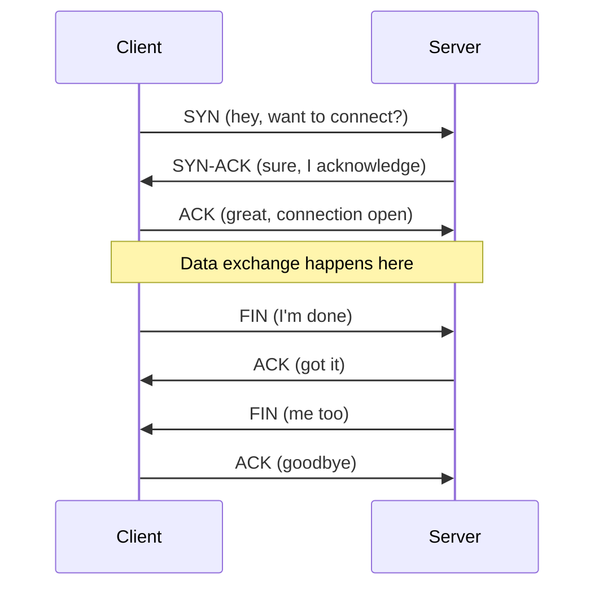

# Shadowkeep Reference Guide

> A comprehensive reference for the Shadowkeep course — your go-to when you forget a syntax, hit a borrow checker wall, or need to look up a crate.

---

## 1 — Rust Cheat Sheet

### Variables, Mutability, and Shadowing

```rust
// Immutable by default
let health = 100;
// health = 90; // ERROR: cannot assign twice to immutable variable

// Mutable binding
let mut health = 100;
health -= 10; // OK

// Shadowing — creates a NEW variable with the same name
let room = "dungeon";          // &str
let room = room.to_uppercase(); // String — different type, same name
let room = room.len();          // usize — shadowed again
```

**Coming from Python:** In Python, all variables are mutable. In Rust, immutability is the default. Shadowing looks like reassignment but it creates a brand new binding — the old value is dropped.

### Ownership — The Three Rules

```text
Rule 1: Each value has exactly one owner.
Rule 2: There can only be one owner at a time.
Rule 3: When the owner goes out of scope, the value is dropped.
```

```rust
// Rule 1 & 2: One owner at a time
let sword = String::from("Excalibur");
let player_weapon = sword; // ownership MOVES to player_weapon
// println!("{}", sword);  // ERROR: sword was moved

// Rule 3: Dropped at end of scope
{
    let torch = String::from("Flaming Torch");
    // torch is valid here
} // torch is dropped here — memory freed

// Clone to keep both
let sword = String::from("Excalibur");
let backup = sword.clone(); // deep copy — both valid
println!("{} and {}", sword, backup); // OK
```

**Coming from Python:** In Python, `b = a` makes both point to the same object (reference counted). In Rust, `b = a` *moves* ownership — `a` is gone. Think of it like handing someone a physical object, not copying a pointer.

**Copy types** — small stack values (`i32`, `f64`, `bool`, `char`, tuples of Copy types) are copied automatically, not moved:

```rust
let health = 100;      // i32 implements Copy
let max_health = health; // copied, not moved
println!("{}", health);  // still valid
```

### Borrowing — Shared and Mutable References

```text
Rule: You can have EITHER:
  - Any number of shared references (&T), OR
  - Exactly one mutable reference (&mut T)
  — but never both at the same time.
```

```rust
// Shared (immutable) borrows — many readers OK
let player_name = String::from("Ash");
let r1 = &player_name;
let r2 = &player_name;
println!("{} and {}", r1, r2); // OK — multiple shared refs

// Mutable borrow — exclusive access
let mut inventory = vec!["torch", "key"];
let inv_ref = &mut inventory;
inv_ref.push("potion");
// let another = &inventory; // ERROR while inv_ref is active
```

### Common Patterns

```rust
// if let — destructure a single pattern
let item: Option<&str> = Some("skeleton key");
if let Some(name) = item {
    println!("Found: {}", name);
}

// while let — loop until pattern fails
let mut stack = vec!["torch", "rope", "key"];
while let Some(item) = stack.pop() {
    println!("Using {}", item);
}

// match — exhaustive pattern matching
enum Direction { North, South, East, West }

let dir = Direction::North;
match dir {
    Direction::North => println!("You head into darkness..."),
    Direction::South => println!("You retreat."),
    Direction::East | Direction::West => println!("A corridor stretches ahead."),
}

// ? operator — propagate errors
fn load_room(id: u32) -> Result<String, std::io::Error> {
    let data = std::fs::read_to_string(format!("rooms/{}.txt", id))?;
    Ok(data)
}
```

### String Types: `String` vs `&str`

```rust
// &str — borrowed string slice, immutable view into string data
let greeting: &str = "Welcome to Shadowkeep"; // string literal → &str

// String — owned, heap-allocated, growable
let mut msg = String::from("You enter ");
msg.push_str("the crypt");

// Converting between them
let owned: String = "hello".to_string();   // &str → String
let borrowed: &str = &owned;                // String → &str (auto-deref)
```

**When to use which:**

| Use `&str` when... | Use `String` when... |
|---|---|
| Function parameter (borrowing) | Storing in a struct field |
| String literals | Building strings dynamically |
| Read-only access | Need to modify the string |
| You don't need ownership | Returning from a function |

```rust
// Idiomatic: accept &str, return String
fn format_room_description(name: &str, danger_level: u8) -> String {
    format!("{} (danger: {})", name, danger_level)
}
```

### Collections

```rust
use std::collections::{HashMap, HashSet};

// Vec — growable array
let mut inventory: Vec<String> = Vec::new();
inventory.push("torch".to_string());
inventory.push("key".to_string());
let first = &inventory[0];          // panics if out of bounds
let safe = inventory.get(0);        // returns Option<&String>

// Shorthand
let items = vec!["sword", "shield", "potion"];

// HashMap — key-value store
let mut room_descriptions: HashMap<&str, &str> = HashMap::new();
room_descriptions.insert("crypt", "A cold, damp room filled with coffins.");
room_descriptions.insert("tower", "Wind howls through broken windows.");

if let Some(desc) = room_descriptions.get("crypt") {
    println!("{}", desc);
}

// Entry API — insert if missing
room_descriptions.entry("cellar").or_insert("A dark cellar.");

// HashSet — unique values
let mut visited_rooms: HashSet<String> = HashSet::new();
visited_rooms.insert("crypt".to_string());
visited_rooms.insert("crypt".to_string()); // no duplicate
assert_eq!(visited_rooms.len(), 1);
```

### Error Handling

```rust
use std::fmt;

// Option — value might not exist
fn find_item(inventory: &[String], name: &str) -> Option<&String> {
    inventory.iter().find(|item| item.as_str() == name)
}

// Result — operation might fail
fn parse_command(input: &str) -> Result<(&str, &str), String> {
    let parts: Vec<&str> = input.splitn(2, ' ').collect();
    match parts.as_slice() {
        [verb, target] => Ok((verb, target)),
        [verb] => Ok((verb, "")),
        _ => Err("Empty command".to_string()),
    }
}

// Custom error type
#[derive(Debug)]
enum GameError {
    InvalidCommand(String),
    RoomNotFound(String),
    PlayerDead,
}

impl fmt::Display for GameError {
    fn fmt(&self, f: &mut fmt::Formatter<'_>) -> fmt::Result {
        match self {
            GameError::InvalidCommand(cmd) => write!(f, "Unknown command: {}", cmd),
            GameError::RoomNotFound(id) => write!(f, "Room '{}' not found", id),
            GameError::PlayerDead => write!(f, "You are dead."),
        }
    }
}

impl std::error::Error for GameError {}

// ? operator chains errors
fn process_turn(input: &str) -> Result<String, GameError> {
    let (verb, target) = parse_command(input)
        .map_err(|e| GameError::InvalidCommand(e))?;
    Ok(format!("You {} the {}", verb, target))
}
```

### Closures and Iterators

```rust
// Closures — anonymous functions that capture environment
let danger_threshold = 5;
let is_dangerous = |level: u8| level > danger_threshold;

// Iterator chains — Rust's equivalent of Python list comprehensions
let players = vec!["Ash", "Morgan", "Quinn"];
let shout: Vec<String> = players
    .iter()
    .filter(|name| name.len() > 3)
    .map(|name| name.to_uppercase())
    .collect();
// ["MORGAN", "QUINN"]

// Common iterator methods
let numbers = vec![1, 2, 3, 4, 5];
let sum: i32 = numbers.iter().sum();
let any_big = numbers.iter().any(|&n| n > 3);
let first_even = numbers.iter().find(|&&n| n % 2 == 0);
```

### Structs, Enums, Impl Blocks, Traits

```rust
// Struct
struct Player {
    name: String,
    health: i32,
    inventory: Vec<String>,
}

// Impl block — methods
impl Player {
    // Associated function (like a static method / constructor)
    fn new(name: &str) -> Self {
        Player {
            name: name.to_string(),
            health: 100,
            inventory: Vec::new(),
        }
    }

    // Method — takes &self or &mut self
    fn is_alive(&self) -> bool {
        self.health > 0
    }

    fn take_damage(&mut self, amount: i32) {
        self.health = (self.health - amount).max(0);
    }

    fn pick_up(&mut self, item: String) {
        self.inventory.push(item);
    }
}

// Enum with data
enum Event {
    PlayerJoined(String),
    PlayerLeft(String),
    Message { from: String, text: String },
    Combat { attacker: String, target: String, damage: i32 },
}

// Trait — shared behavior (like an interface)
trait Describable {
    fn describe(&self) -> String;
}

impl Describable for Player {
    fn describe(&self) -> String {
        format!("{} (HP: {})", self.name, self.health)
    }
}
```

### Generics and Trait Bounds

```rust
// Generic function with trait bound
fn print_description<T: Describable>(thing: &T) {
    println!("{}", thing.describe());
}

// Multiple bounds with where clause
fn send_to_all<T>(message: &T, players: &[Player])
where
    T: Describable + std::fmt::Debug,
{
    for player in players {
        println!("To {}: {:?}", player.name, message);
    }
}
```

### Useful Macros

```rust
println!("Player {} entered {}", player.name, room);  // print + newline
eprintln!("ERROR: {}", err);                           // print to stderr

let msg = format!("Welcome, {}!", name);               // returns String

let items = vec!["torch", "key", "map"];               // create Vec

todo!();            // compiles but panics — placeholder for unfinished code
unimplemented!();   // same, but signals "intentionally not implemented"

assert_eq!(health, 100);        // panic if not equal (tests)
assert!(player.is_alive());     // panic if false
dbg!(&player.inventory);        // debug print with file:line info
```

---

## 2 — Borrow Checker Error Decoder

These are the errors you *will* hit. Each entry shows the exact compiler message, what it means, how to trigger it, and how to fix it.

### `cannot move out of borrowed content`

**Error message:**
```
error[E0507]: cannot move out of `*item` which is behind a shared reference
```

**Plain English:** You're trying to take ownership of something you only borrowed. You have a read-only reference (`&T`) but you're trying to move the value out of it.

**Triggers it:**
```rust
fn steal_item(inventory: &Vec<String>) -> String {
    let item = inventory[0]; // ERROR: trying to move String out of &Vec
    item
}
```

**Fix — clone or return a reference:**
```rust
// Option A: Clone it
fn steal_item(inventory: &Vec<String>) -> String {
    inventory[0].clone()
}

// Option B: Return a reference
fn peek_item(inventory: &Vec<String>) -> &String {
    &inventory[0]
}
```

**Python equivalent:** In Python, `item = inventory[0]` just copies the reference (pointer). Both `item` and `inventory[0]` point to the same object. Rust doesn't allow this because it would create two owners of the same heap data.

---

### `value borrowed here after move`

**Error message:**
```
error[E0382]: borrow of moved value: `player`
```

**Plain English:** You gave away ownership of a value (moved it), then tried to use it. Once moved, the original variable is dead.

**Triggers it:**
```rust
let player = String::from("Ash");
let greeting = format!("Welcome, {}", player);
let saved_player = player;       // player moved here
println!("Still here: {}", player); // ERROR: player was moved
```

**Fix — clone, borrow, or reorder:**
```rust
// Option A: Clone before moving
let saved_player = player.clone();
println!("Still here: {}", player);

// Option B: Borrow instead of move
let saved_ref = &player;
println!("Still here: {}", player);
```

**Python equivalent:** In Python, `saved = player` just copies the reference. Both variables point to the same string object. Rust's move semantics mean the original is invalidated.

---

### `cannot borrow as mutable more than once`

**Error message:**
```
error[E0499]: cannot borrow `inventory` as mutable more than once at a time
```

**Plain English:** You have two `&mut` references to the same data alive at the same time. Rust forbids this to prevent data races.

**Triggers it:**
```rust
let mut inventory = vec!["torch", "key"];
let first = &mut inventory;
let second = &mut inventory; // ERROR: second mutable borrow
first.push("potion");
```

**Fix — limit mutable borrow scope:**
```rust
let mut inventory = vec!["torch", "key"];
{
    let first = &mut inventory;
    first.push("potion");
} // first's borrow ends here
let second = &mut inventory; // OK now
second.push("map");
```

**Python equivalent:** In Python, you can have as many references to a list as you want, and mutate through any of them. This is exactly the kind of bug Rust prevents — two parts of your code mutating the same data leads to subtle bugs.

---

### `missing lifetime specifier`

**Error message:**
```
error[E0106]: missing lifetime specifier
  --> src/main.rs:1:30
   |
   | fn longest(a: &str, b: &str) -> &str {
   |                                  ^ expected named lifetime parameter
```

**Plain English:** Your function returns a reference, but Rust can't figure out how long that reference is valid. It needs you to explicitly say "the returned reference lives as long as input X."

**Triggers it:**
```rust
fn longest(a: &str, b: &str) -> &str {
    if a.len() > b.len() { a } else { b }
}
```

**Fix — add lifetime annotations:**
```rust
fn longest<'a>(a: &'a str, b: &'a str) -> &'a str {
    if a.len() > b.len() { a } else { b }
}

// Read as: "the returned reference lives at least as long as
// both input references"
```

**Python equivalent:** Python doesn't track reference lifetimes — the garbage collector handles it. In Rust, there's no GC, so the compiler needs proof that the returned reference won't outlive the data it points to.

---

### `value does not live long enough`

**Error message:**
```
error[E0597]: `room_name` does not live long enough
```

**Plain English:** You're creating a reference to something that gets destroyed too soon. The reference would become a dangling pointer.

**Triggers it:**
```rust
fn get_room_name() -> &str {
    let room_name = String::from("crypt");
    &room_name // ERROR: room_name is dropped at end of function
}
```

**Fix — return an owned value:**
```rust
fn get_room_name() -> String {
    let room_name = String::from("crypt");
    room_name // return the owned String, transferring ownership
}
```

**Python equivalent:** In Python, the garbage collector keeps `room_name` alive as long as any reference exists. In Rust, local variables are destroyed when the function returns — returning a reference to one would be a use-after-free bug.

---

### `cannot borrow as mutable because it is also borrowed as immutable`

**Error message:**
```
error[E0502]: cannot borrow `players` as mutable because it is also borrowed as immutable
```

**Plain English:** You have an active read-only reference (`&T`) and you're trying to get a mutable reference (`&mut T`) at the same time. Rust prevents this because mutation could invalidate the read reference.

**Triggers it:**
```rust
let mut players = vec!["Ash", "Morgan"];
let first = &players[0];       // immutable borrow
players.push("Quinn");          // ERROR: mutable borrow while first exists
println!("{}", first);           // first is still in use here
```

**Fix — finish using the immutable borrow first:**
```rust
let mut players = vec!["Ash", "Morgan"];
let first = players[0].to_string(); // clone the data out
players.push("Quinn");               // OK — no active borrows
println!("{}", first);
```

**Python equivalent:** In Python, this is a classic bug source:
```python
players = ["Ash", "Morgan"]
for p in players:       # iterating (reading)
    players.append(p)   # mutating during iteration — undefined behavior!
```
Rust catches this at compile time instead of producing weird runtime behavior.

---

## 3 — Cargo Commands

Cargo is Rust's build system and package manager — think `npm` + `pip` + `make` rolled into one.

### Essential Commands

```bash
# Create a new project
cargo new shadowkeep          # binary (default)
cargo new shadowkeep --lib    # library

# Build
cargo build                   # debug build (fast compile, slow runtime)
cargo build --release         # optimized build (slow compile, fast runtime)

# Run
cargo run                     # build + run
cargo run -- --port 8080      # pass args after --

# Test
cargo test                    # run all tests
cargo test test_combat        # run tests matching "test_combat"
cargo test -- --nocapture     # show println! output during tests

# Add a dependency (requires cargo-edit or Rust 1.62+)
cargo add tokio --features full
cargo add serde --features derive
cargo add serde_json

# Generate and open documentation
cargo doc --open              # docs for your project + all dependencies

# Linting and formatting
cargo fmt                     # auto-format code (like black/prettier)
cargo clippy                  # lint for common mistakes and style issues
cargo clippy -- -W clippy::all  # stricter linting
```

### Debug vs Release Builds

| | `cargo build` | `cargo build --release` |
|---|---|---|
| Optimization | None (O0) | Full (O3) |
| Compile speed | Fast | Slow |
| Binary size | Larger | Smaller |
| Debug symbols | Yes | No |
| Use for | Development | Benchmarks, deployment |

### Cargo.toml Structure

```toml
[package]
name = "shadowkeep"
version = "0.1.0"
edition = "2021"          # Rust edition (use 2021)

[dependencies]
tokio = { version = "1", features = ["full"] }
serde = { version = "1", features = ["derive"] }
serde_json = "1"
chrono = "0.4"

[dev-dependencies]        # only for tests
tempfile = "3"

[[bin]]                   # multiple binaries
name = "server"
path = "src/server.rs"

[[bin]]
name = "client"
path = "src/client.rs"
```

**Version syntax** (same as pip/PyPI semver):
- `"1"` → any 1.x.y (most common)
- `"1.2"` → any 1.2.x
- `"=1.2.3"` → exactly 1.2.3
- `">=1, <2"` → range

### Cargo.lock

- Auto-generated, pins exact versions
- **Commit it** for binaries (like Shadowkeep)
- Don't commit it for libraries
- `cargo update` refreshes pinned versions

---

## 4 — Networking Glossary

Explained for someone who uses ALBs and API Gateways daily but hasn't thought about what happens underneath.

### TCP vs UDP

**TCP (Transmission Control Protocol)** — reliable, ordered delivery. Every byte you send arrives in order, or the connection fails. Think of it like a phone call — you establish a connection, talk back and forth, and hang up.

**UDP (User Datagram Protocol)** — fire-and-forget. Fast but unreliable. Packets can arrive out of order, duplicated, or not at all. Think of it like sending postcards.

**Why TCP for Shadowkeep:** Game commands must arrive in order and reliably. If a player types "attack skeleton" and "drink potion," those must execute in sequence. UDP would be appropriate for a real-time FPS (where speed matters more than reliability), but for a text adventure, TCP is the right choice.

**AWS parallel:** When your Lambda talks to DynamoDB, that's TCP underneath. When Route 53 resolves DNS, that's UDP.

### Socket, Port, Binding, Listening

**Socket** — an endpoint for network communication. It's a file descriptor (integer) that your program reads from and writes to, just like a file. The OS handles the actual network packets.

**Port** — a 16-bit number (0–65535) that identifies a specific service on a machine. Like apartment numbers in a building — the IP address is the building, the port is the unit.

**Binding** — claiming a port. When Shadowkeep calls `bind("0.0.0.0:8080")`, it tells the OS "send me all TCP traffic arriving on port 8080."

**Listening** — after binding, the server starts accepting incoming connections. Each accepted connection becomes its own socket.

```rust
// Shadowkeep server startup
let listener = TcpListener::bind("0.0.0.0:8080").await?;
// "0.0.0.0" means "listen on all network interfaces"
// Like an ALB listener, but you're the ALB

loop {
    let (socket, addr) = listener.accept().await?;
    // Each connection gets its own socket
    // Like Lambda — one invocation per request
}
```

**AWS parallel:** `bind` + `listen` is what an ALB does when you configure a listener on port 443. Each target group registration is like `accept()`.

### Connection Lifecycle



**SYN** — synchronize. The client initiates.
**ACK** — acknowledge. Confirms receipt.
**FIN** — finish. Initiates graceful close.

**AWS parallel:** This is what happens every time your service opens a connection. The ALB health check is a SYN → SYN-ACK → ACK → FIN cycle.

### Buffered I/O

**Problem:** Every `read()` or `write()` system call is expensive — it crosses the user/kernel boundary. Reading one byte at a time from a socket means thousands of syscalls.

**Solution:** Buffer reads and writes. Accumulate data in memory, then flush in larger chunks.

```rust
use tokio::io::{AsyncBufReadExt, BufReader, BufWriter, AsyncWriteExt};

// BufReader — reads chunks from the socket, serves them from memory
let reader = BufReader::new(read_half);
let mut line = String::new();
reader.read_line(&mut line).await?; // reads from buffer, not socket

// BufWriter — accumulates writes, sends in batches
let mut writer = BufWriter::new(write_half);
writer.write_all(b"You enter the crypt.\n").await?;
writer.write_all(b"It is dark.\n").await?;
writer.flush().await?; // NOW it actually sends
```

**AWS parallel:** This is why DynamoDB has `BatchWriteItem` — one network round trip instead of 25.

### Blocking vs Non-blocking I/O

**Blocking I/O:** Your thread stops and waits until data arrives. Like standing at a mailbox waiting for a letter.

```rust
// Blocking — this thread does NOTHING until a client connects
let (socket, addr) = listener.accept(); // thread sleeps here
```

**Non-blocking I/O:** Your thread checks if data is ready and moves on if not. Like checking the mailbox and going back inside.

**Problem with blocking:** If you have 100 connected players and use blocking I/O, you need 100 threads. Threads are expensive (each uses ~8MB of stack).

### Async I/O and Event Loops

**Async I/O** combines the simplicity of blocking code with the efficiency of non-blocking. You write code that *looks* blocking but doesn't actually block the thread.

```rust
// This LOOKS blocking but doesn't block the thread
let (socket, addr) = listener.accept().await?;
// .await yields control — the runtime can run other tasks
```

**Event loop** — the runtime that drives async code. It maintains a list of pending operations and polls the OS for which ones are ready. When your `.await` yields, the event loop picks up another ready task.

**AWS parallel:** This is exactly how Lambda's Python runtime works. `await fetch(url)` doesn't block — the event loop handles other callbacks while waiting for the network response.

### The Tokio Runtime

Tokio is Rust's most popular async runtime. It provides:

- **Task scheduler** — runs thousands of async tasks on a small thread pool
- **Async I/O** — non-blocking TCP, UDP, file I/O
- **Timers** — `tokio::time::sleep`, `timeout`
- **Synchronization** — channels, mutexes, semaphores
- **Macros** — `#[tokio::main]`, `tokio::spawn`

```rust
#[tokio::main]
async fn main() {
    // Spawns a multi-threaded runtime (default: 1 thread per CPU core)
    let listener = TcpListener::bind("0.0.0.0:8080").await.unwrap();

    loop {
        let (socket, addr) = listener.accept().await.unwrap();
        // Spawn a new task for each connection
        // Like Lambda — each invocation is independent
        tokio::spawn(async move {
            handle_connection(socket).await;
        });
    }
}
```

**Key insight:** `tokio::spawn` is NOT `thread::spawn`. Tokio tasks are lightweight (a few hundred bytes vs 8MB for a thread). You can spawn millions of them.

### Channels (mpsc, broadcast)

Channels let async tasks communicate without shared mutable state.

**mpsc (multi-producer, single-consumer)** — many senders, one receiver. Like an SQS queue.

```rust
use tokio::sync::mpsc;

let (tx, mut rx) = mpsc::channel(100); // buffer size 100

// Multiple players can send events
let tx2 = tx.clone();
tokio::spawn(async move { tx.send("Ash attacks").await; });
tokio::spawn(async move { tx2.send("Morgan heals").await; });

// One game loop processes them
while let Some(event) = rx.recv().await {
    println!("Event: {}", event);
}
```

**broadcast** — every receiver gets every message. Like an SNS topic.

```rust
use tokio::sync::broadcast;

let (tx, _) = broadcast::channel(100);
let mut rx1 = tx.subscribe();
let mut rx2 = tx.subscribe();

tx.send("The ground shakes...".to_string())?;
// Both rx1 and rx2 receive the message
```

**AWS parallel:**
- `mpsc` = SQS (one consumer processes each message)
- `broadcast` = SNS (all subscribers get every message)

### Backpressure

What happens when a producer sends faster than a consumer can process?

**Without backpressure:** Messages pile up in memory → OOM crash.

**With backpressure:** The producer slows down when the consumer falls behind. Tokio channels do this automatically — `send().await` blocks when the channel buffer is full.

```rust
let (tx, rx) = mpsc::channel(10); // only 10 messages buffered
// If 10 messages are pending, the next send().await waits
// This naturally slows down fast producers
```

**AWS parallel:** SQS has a message limit. API Gateway has throttling. Same concept — protect the consumer from being overwhelmed.

### Keepalive / Heartbeat

TCP connections can go silent for hours without either side knowing the other crashed. Keepalives are periodic "are you still there?" messages.

```rust
// Shadowkeep heartbeat — server pings every 30 seconds
let mut interval = tokio::time::interval(Duration::from_secs(30));
loop {
    tokio::select! {
        _ = interval.tick() => {
            writer.write_all(b"PING\n").await?;
        }
        msg = reader.read_line(&mut buf) => {
            // handle player input
        }
    }
}
```

**AWS parallel:** ALB health checks, ELB keepalives, WebSocket ping/pong frames — all the same pattern.

### Graceful Shutdown

Stopping a server without dropping active connections mid-sentence.

```rust
use tokio::signal;

// Step 1 - Stop accepting new connections
// Step 2 - Wait for active connections to finish (with timeout)
// Step 3 - Force-close anything still hanging

let (shutdown_tx, _) = broadcast::channel(1);

// Listen for Ctrl+C
tokio::spawn(async move {
    signal::ctrl_c().await.unwrap();
    println!("Shutting down...");
    let _ = shutdown_tx.send(());
});

// In each connection handler:
let mut shutdown_rx = shutdown_tx.subscribe();
tokio::select! {
    result = handle_player(socket) => { /* normal exit */ }
    _ = shutdown_rx.recv() => {
        writer.write_all(b"Server shutting down. Goodbye!\n").await.ok();
    }
}
```

**AWS parallel:** This is what happens during an ECS rolling deployment — the target group drains connections before killing the old task. `deregistration_delay` is the timeout for step 2.

---

## 5 — Useful Crates

### Course Crates

#### `tokio` — Async Runtime

The foundation of async Rust. Provides the runtime, async TCP/UDP, timers, channels, and synchronization primitives.

```toml
[dependencies]
tokio = { version = "1", features = ["full"] }
```

```rust
#[tokio::main]
async fn main() {
    let listener = TcpListener::bind("0.0.0.0:8080").await.unwrap();
    // ...
}
```

**Key features:** `rt-multi-thread`, `net`, `io-util`, `time`, `sync`, `macros`, `signal`. Use `"full"` during development, trim for production.

#### `serde` + `serde_json` — Serialization

Serialize and deserialize Rust structs to/from JSON (or any format). The `derive` feature auto-generates the code.

```toml
[dependencies]
serde = { version = "1", features = ["derive"] }
serde_json = "1"
```

```rust
use serde::{Serialize, Deserialize};

#[derive(Serialize, Deserialize, Debug)]
struct GameEvent {
    event_type: String,
    player: String,
    room: String,
    timestamp: i64,
}

// Struct → JSON string
let event = GameEvent { /* ... */ };
let json = serde_json::to_string(&event)?;

// JSON string → Struct
let parsed: GameEvent = serde_json::from_str(&json)?;
```

**Coming from Python:** This is like `json.dumps()`/`json.loads()` but type-safe. No runtime surprises — if it compiles, the serialization works.

#### `chrono` — Date and Time

```toml
[dependencies]
chrono = "0.4"
```

```rust
use chrono::{Utc, Local, Duration};

let now = Utc::now();
let formatted = now.format("%Y-%m-%d %H:%M:%S").to_string();
let later = now + Duration::hours(1);
```

#### `crossterm` — Terminal Manipulation

Cross-platform terminal control — colors, cursor movement, raw mode, key events.

```toml
[dependencies]
crossterm = "0.28"
```

```rust
use crossterm::style::{Color, Stylize};

println!("{}", "You are poisoned!".red().bold());
println!("{}", "Health restored.".green());
```

#### `bincode` — Binary Serialization

Compact binary format — much smaller and faster than JSON. Good for network protocols where humans don't need to read the data.

```toml
[dependencies]
bincode = "1"
```

```rust
use serde::{Serialize, Deserialize};

#[derive(Serialize, Deserialize)]
struct NetworkPacket {
    packet_type: u8,
    payload: Vec<u8>,
}

let packet = NetworkPacket { packet_type: 1, payload: vec![1, 2, 3] };
let bytes: Vec<u8> = bincode::serialize(&packet)?;
let decoded: NetworkPacket = bincode::deserialize(&bytes)?;
```

### Recommended Crates (Going Further)

#### `tracing` — Structured Logging

The successor to `log`. Structured, async-aware, with spans for tracking request context.

```toml
[dependencies]
tracing = "0.1"
tracing-subscriber = "0.3"
```

```rust
use tracing::{info, warn, error, instrument};

#[instrument(skip(socket))]
async fn handle_player(player_name: &str, socket: TcpStream) {
    info!(player = player_name, "Player connected");
    // All logs inside this function automatically include player_name
    warn!(room = "crypt", "Player entered dangerous area");
}
```

**Why over println!:** Structured fields, log levels, filtering, async span context. In production, you pipe this to CloudWatch or Datadog.

#### `clap` — CLI Argument Parsing

Derive-based CLI parser. Define your args as a struct, get parsing + help text + validation for free.

```toml
[dependencies]
clap = { version = "4", features = ["derive"] }
```

```rust
use clap::Parser;

#[derive(Parser)]
#[command(name = "shadowkeep")]
struct Args {
    /// Port to listen on
    #[arg(short, long, default_value_t = 8080)]
    port: u16,

    /// Maximum number of players
    #[arg(short, long, default_value_t = 10)]
    max_players: usize,
}

fn main() {
    let args = Args::parse();
    println!("Starting on port {}", args.port);
}
```

#### `anyhow` / `thiserror` — Error Handling

**`anyhow`** — for applications. Wraps any error into a single type. Great for binaries.

```rust
use anyhow::{Context, Result};

fn load_map(path: &str) -> Result<String> {
    let data = std::fs::read_to_string(path)
        .context(format!("Failed to load map from {}", path))?;
    Ok(data)
}
```

**`thiserror`** — for libraries. Derive `Error` implementations with custom messages.

```rust
use thiserror::Error;

#[derive(Error, Debug)]
enum GameError {
    #[error("Room '{0}' not found")]
    RoomNotFound(String),

    #[error("Player '{name}' is already dead")]
    PlayerDead { name: String },

    #[error("Network error: {0}")]
    Network(#[from] std::io::Error),
}
```

**Rule of thumb:** Use `thiserror` in library code (callers need to match on variants). Use `anyhow` in binary/application code (you just want to propagate and display errors).

#### `sqlx` — Async Database

Compile-time checked SQL queries. Supports PostgreSQL, MySQL, SQLite.

```toml
[dependencies]
sqlx = { version = "0.8", features = ["runtime-tokio", "sqlite"] }
```

```rust
use sqlx::SqlitePool;

let pool = SqlitePool::connect("sqlite:shadowkeep.db").await?;

let rooms = sqlx::query_as!(
    Room,
    "SELECT id, name, description FROM rooms WHERE danger_level > ?",
    5
)
.fetch_all(&pool)
.await?;
```

**Why sqlx:** Queries are checked against your actual database schema at compile time. A typo in a column name is a compile error, not a runtime crash.

#### `axum` — Web Framework

Built by the Tokio team. If you want to add an HTTP API to Shadowkeep (admin panel, REST API, WebSocket support), axum is the natural choice.

```toml
[dependencies]
axum = "0.8"
```

```rust
use axum::{routing::get, Router, Json};

async fn get_players() -> Json<Vec<String>> {
    Json(vec!["Ash".into(), "Morgan".into()])
}

let app = Router::new()
    .route("/players", get(get_players));

let listener = tokio::net::TcpListener::bind("0.0.0.0:3000").await?;
axum::serve(listener, app).await?;
```

---

## 6 — Where to Go Next

### Learning Resources

| Resource | What it is | URL |
|---|---|---|
| **The Rust Book** | The official guide — read chapters 1-12 for solid foundations | https://doc.rust-lang.org/book/ |
| **Rust by Example** | Learn by reading annotated code examples | https://doc.rust-lang.org/rust-by-example/ |
| **Rustlings** | Small exercises that teach Rust syntax interactively | https://github.com/rust-lang/rustlings |
| **CodeCrafters** | Build real systems (Redis, Git, HTTP server) in Rust | https://codecrafters.io |
| **Tokio Tutorial** | Official async Rust tutorial — builds a mini-Redis | https://tokio.rs/tokio/tutorial |
| **Comprehensive Rust** | Google's 4-day Rust course (great for experienced devs) | https://google.github.io/comprehensive-rust/ |

### Community

| Resource | What it is | URL |
|---|---|---|
| **r/rust** | Active subreddit — news, questions, show-and-tell | https://reddit.com/r/rust |
| **This Week in Rust** | Weekly newsletter — new crates, blog posts, RFCs | https://this-week-in-rust.org |
| **Are We Game Yet?** | Rust game development ecosystem tracker | https://arewegameyet.rs |
| **Rust Users Forum** | Longer-form discussions and help | https://users.rust-lang.org |

### Project Ideas That Build on Shadowkeep

These projects reuse the skills you learned — TCP, async, serialization, state management — and push you further:

**HTTP Server from Scratch**
Parse HTTP/1.1 requests, serve static files, add routing. You already know TCP listeners and buffered I/O — HTTP is just a text protocol on top.

**Chat Application**
You built multiplayer messaging in Shadowkeep. Strip out the game logic, add rooms/channels, user authentication, and message history with SQLite.

**Redis Clone**
Implement GET, SET, EXPIRE, PUB/SUB. You already know channels (broadcast = PUB/SUB), HashMaps (= Redis keys), and async I/O. CodeCrafters has a guided version of this.

**Reverse Proxy**
Accept connections, forward them to backend servers, load balance. Combines everything: TCP, async, buffered I/O, graceful shutdown, health checks.

**Game Server v2 — WebSocket Edition**
Rewrite Shadowkeep's protocol layer to use WebSockets (via `axum` + `tokio-tungstenite`). Add a browser-based frontend. Now anyone can play without a custom client.

---

> *"The borrow checker is not your enemy. It's the senior engineer who reviews your code at 2am and catches the bug that would have paged you at 4am."*
