# Act 1 — The Ritual

> *"The old blood guides your hand. Carve the labyrinth, and the labyrinth shall carve you."*

Welcome to **The Chalice**, a progressive Rust course where you build a roguelike dungeon crawler from scratch. No prior Rust experience required — every concept is introduced exactly when you need it.

In Act 1, you will generate an entire procedural dungeon: rooms carved by Binary Space Partitioning, corridors connecting them, fog of war hiding what lies ahead, and enemies scattered according to the floor's difficulty tier. By the end, you'll have a seeded dungeon generator that produces the same labyrinth every time you give it the same seed — a core mechanic of roguelike games.

## What You'll Build

```
████████████████          ████████████
█··············█    ███████··········█
█··@···········+····+·····█····H·····█
█··············█    ███████··········█
█······T·······█          █····☠·····█
████████+███████          ████+███████
        ·                      ·
        ·····                  ·
        ████████████████████████
```

A terminal-rendered dungeon with rooms, corridors, doors, traps, enemies, and a boss — all generated from a single seed number.

## Stages

| # | Stage | Difficulty | Concept |
|---|-------|-----------|---------|
| 1 | Hello Hunter | Very Easy | Project setup, cargo |
| 2 | The Tile | Easy | Enums, Display trait |
| 3 | The Empty Grid | Easy | 2D vectors, indexing |
| 4 | Binary Space Partitioning | Medium | Recursion, structs |
| 5 | Rooms from Partitions | Medium | Random padding, leaf nodes |
| 6 | Corridors | Medium | L-shaped paths, door placement |
| 7 | The Seed | Easy | Seeded RNG, determinism |
| 8 | Populate | Medium | Enemy/trap/loot scattering |
| 9 | Multiple Floors | Medium | Scaling difficulty, stairs |
| 10 | The Minimap | Medium | Fog of war, visibility |

---

## Stage 1 — Hello Hunter

> *"Every hunt begins with a single step into the dark."*

Every labyrinth begins with a foundation — and every Rust project begins with `cargo`. Before we can carve dungeons or slay beasts, we need a working toolchain and a project that compiles. This stage exists because nothing else in The Chalice is possible without it, and because the ritual of `cargo new` teaches you how Rust organizes code from the very first incantation.

**Goal:** Create a new Rust project and print a message to the terminal.

### Installing Rust

If you don't have Rust yet, install it with [rustup](https://rustup.rs/):

```bash
curl --proto '=https' --tlsv1.2 -sSf https://sh.rustup.rs | sh
```

Verify it works:

```bash
rustc --version
cargo --version
```

### Creating the Project

`cargo` is Rust's build tool and package manager. Think of it like `pip` + `setuptools` for Python — but it also compiles your code.

```bash
cargo new the_chalice
cd the_chalice
```

This creates:

```
the_chalice/
├── Cargo.toml    # Project manifest (like pyproject.toml)
└── src/
    └── main.rs   # Entry point
```

### Your First Code

Open `src/main.rs`. Cargo generated a hello-world for you:

```rust
fn main() {
    println!("Hello, world!");
}
```

Let's break this down:

- `fn main()` — defines a function called `main`. Every Rust program starts here. In Python, this is like `if __name__ == "__main__":`.
- `println!` — a **macro** (the `!` tells you it's a macro, not a regular function). It prints text to the terminal with a newline. Think `print()` in Python.
- `"Hello, world!"` — a string literal. Rust strings use double quotes. Single quotes are for single characters only (`'a'`).

Replace the contents with something more atmospheric:

```rust
fn main() {
    println!("=== The Chalice ===");
    println!("A procedural dungeon awaits...");
    println!("Fear the old blood.");
}
```

### Build and Run

```bash
cargo run
```

You should see:

```
=== The Chalice ===
A procedural dungeon awaits...
Fear the old blood.
```

`cargo run` compiles your code and runs the resulting binary in one step. Under the hood it calls `cargo build` first, then executes `target/debug/the_chalice`.

> [!warning] Common Mistake
> If you see `error: expected one of...`, check for missing semicolons. Every statement in Rust ends with `;`.


> [!check] Checkpoint
> Your project compiles and prints to the terminal. The foundation is laid — and now that the toolchain obeys your hand, we can begin defining the language of the labyrinth itself: the tiles that compose every wall, floor, and door.
>
> **Files changed:** `src/main.rs`

---

## Stage 2 — The Tile

> *"The labyrinth speaks in symbols. Learn its alphabet, or be consumed by it."*

A dungeon is nothing without a vocabulary — a finite set of symbols that describe every cell in the grid. We define tiles now because every system that follows (rooms, corridors, fog, enemies) needs to know what can exist in a cell. Getting the tile model right early means the compiler will guard every future interaction with the dungeon grid.

**Goal:** Define every tile type in the dungeon as a Rust enum and display them as characters.

### Enums — Rust's Most Powerful Type

An **enum** (short for enumeration) lets you define a type that can be one of several variants. In Python, you might use `enum.Enum` or a string literal type. Rust enums are far more powerful — each variant can carry different data.

### Defining Our Tiles

Right now we have a project that prints text, but we can't represent a single cell of the dungeon. We need a type that captures every possible thing a cell can be — wall, floor, door, trap, loot — so that the rest of the codebase can reason about the grid without guessing.

The design spec defines these tile types. Create a new file `src/tile.rs`:

```rust
/// Every cell in the dungeon grid is one of these tile types.
/// The variants match the design spec (section 3.4).
#[derive(Debug, Clone, PartialEq)]
pub enum Tile {
    Wall,
    Floor,
    Door { locked: bool },
    StairsDown,
    StairsUp,
    Trap { trap_type: TrapType, triggered: bool },
    Loot { item: String, looted: bool },
    BossDoor { defeated: bool },
    Fog,
}
```

We include `Fog` now even though fog of war isn't implemented until Stage 10 — defining the complete tile set upfront means we won't need to refactor the enum later.

Let's unpack the new syntax:

- `#[derive(Debug, Clone, PartialEq)]` — this is an **attribute**. `derive` auto-generates trait implementations:
  - `Debug` — lets you print the enum with `{:?}` for debugging
  - `Clone` — lets you copy a tile (we'll need this for grids)
  - `PartialEq` — lets you compare tiles with `==`
- `pub` — makes this type visible outside the module. Without it, only code in `tile.rs` can use `Tile`.
- `Door { locked: bool }` — a **struct variant**. The `Door` variant carries a `locked` field. Not all variants need data — `Wall` and `Floor` are simple.

Now define the trap types:

```rust
/// Types of traps the hunter can encounter.
#[derive(Debug, Clone, PartialEq)]
pub enum TrapType {
    Spike,
    Poison,
    Bell,
    CollapsingFloor,
}
```

### The Display Trait — Rendering Tiles as Characters

We need each tile to render as a single character in the terminal — walls as `█`, floors as `·`, doors as `+`. Rather than scattering rendering logic across the codebase, we implement the `Display` trait once on `Tile` so that `println!("{}", tile)` just works everywhere. This is Rust's way of giving a type a canonical text representation.

In Python, you'd define `__str__` on a class. In Rust, you implement the `Display` trait.

A **trait** is like an interface — it defines behavior that types can implement. `Display` is the standard trait for "how do I show this as text?"

Add this below your enum definitions:

```rust
use std::fmt;

impl fmt::Display for Tile {
    fn fmt(&self, f: &mut fmt::Formatter<'_>) -> fmt::Result {
        let ch = match self {
            Tile::Wall => '█',
            Tile::Floor => '·',
            Tile::Door { locked: true } => '⊞',
            Tile::Door { locked: false } => '+',
            Tile::StairsDown => '▼',
            Tile::StairsUp => '▲',
            Tile::Trap { triggered: true, .. } => '·',  // looks like floor after triggered
            Tile::Trap { .. } => '·',                    // hidden — looks like floor
            Tile::Loot { looted: true, .. } => '·',
            Tile::Loot { .. } => '♦',
            Tile::BossDoor { defeated: true } => '+',
            Tile::BossDoor { .. } => '☠',
            Tile::Fog => ' ',
        };
        write!(f, "{ch}")
    }
}
```

Key concepts:

- `impl fmt::Display for Tile` — "I'm implementing the `Display` trait for the `Tile` type."
- `&self` — a reference to the tile. The `&` means we're borrowing it, not consuming it. In Python, this is just `self`. In Rust, ownership matters — we'll dig into this more later.
- `match self` — pattern matching. This is like a `switch` statement on steroids. Rust's `match` must be **exhaustive** — you must handle every variant or the compiler refuses to build. This prevents bugs where you forget a case.
- `Tile::Door { locked: true }` — destructuring a struct variant. We match only when `locked` is `true`.
- `Tile::Trap { triggered: true, .. }` — the `..` means "I don't care about the other fields."
- `write!(f, "{ch}")` — writes the character to the formatter. The `fmt::Result` return type lets Rust propagate formatting errors.

### Registering the Module

Rust doesn't auto-discover files like Python does. You must tell `main.rs` about your new module. Update `src/main.rs`:

```rust
mod tile;

use tile::Tile;

fn main() {
    // Test each tile type
    let tiles = vec![
        Tile::Wall,
        Tile::Floor,
        Tile::Door { locked: false },
        Tile::Door { locked: true },
        Tile::StairsDown,
        Tile::StairsUp,
        Tile::Trap {
            trap_type: tile::TrapType::Spike,
            triggered: false,
        },
        Tile::Loot {
            item: String::from("Blood Vial"),
            looted: false,
        },
        Tile::BossDoor { defeated: false },
        Tile::Fog,
    ];

    print!("Tile rendering: ");
    for t in &tiles {
        print!("{t}");
    }
    println!();

    // Debug output shows the enum variant names
    for t in &tiles {
        println!("  {:?} -> {t}", t);
    }
}
```

New concepts:

- `mod tile;` — tells Rust "there's a module in `src/tile.rs`." This is like `import tile` in Python.
- `use tile::Tile;` — brings `Tile` into scope so you can write `Tile::Wall` instead of `tile::Tile::Wall`.
- `vec![...]` — creates a `Vec` (growable array). Like `list` in Python.
- `String::from("Blood Vial")` — creates an owned `String` from a string literal. Rust has two string types: `&str` (borrowed slice, like a view) and `String` (owned, heap-allocated). We'll explain this distinction more when it matters.
- `for t in &tiles` — iterates over references to the tiles. The `&` is important: without it, the loop would **consume** the vector and you couldn't use it again. This is Rust's ownership system at work.
- `{t}` in the format string — uses the `Display` implementation. `{:?}` uses `Debug`.

### Build and Run

```bash
cargo run
```

Expected output:

```
Tile rendering: █·+⊞▼▲··♦☠ 
  Wall -> █
  Floor -> ·
  Door { locked: false } -> +
  Door { locked: true } -> ⊞
  StairsDown -> ▼
  StairsUp -> ▲
  Trap { trap_type: Spike, triggered: false } -> ·
  Loot { item: "Blood Vial", looted: false } -> ♦
  BossDoor { defeated: false } -> ☠
  Fog ->  
```

> [!warning] Common Mistake
> Forgetting `pub` on the enum. If you see `error[E0603]: enum 'Tile' is private`, add `pub` before `enum Tile` and `pub enum TrapType`.


> [!check] Checkpoint
> You now have a type-safe representation of every tile in the dungeon. The compiler guarantees you can never create an invalid tile — there's no "undefined" or "null" sneaking in. Every tile is exactly one of the variants you defined. With the alphabet established, we can now build the parchment it's written on — the 2D grid that holds the dungeon itself.
>
> **Files changed:** `src/tile.rs` (new), `src/main.rs` (updated)

---

## Stage 3 — The Empty Grid

> *"Before the labyrinth can breathe, it must first be stone. Solid, unyielding stone."*

Tiles are the vocabulary; the grid is the page. We need a 2D structure that holds tiles, supports reading and writing individual cells, and can render itself to the terminal. This stage builds the `Dungeon` struct — the data structure that every future system (BSP, corridors, fog, enemies) will read from and write to. Without it, tiles are just symbols floating in the void.

**Goal:** Create a 2D grid of tiles, fill it with walls, and carve a single room in the center.

### Thinking in Grids

A dungeon floor is a 2D grid. Each cell holds a `Tile`. In Python, you'd use a list of lists:

```python
# Python
grid = [["Wall" for _ in range(width)] for _ in range(height)]
```

In Rust, we use `Vec<Vec<Tile>>` — a vector of vectors. Create `src/dungeon.rs`:

Right now we have individual tiles but no way to arrange them into a spatial structure. We need a container that maps (x, y) coordinates to tiles, enforces bounds, and starts as solid stone — because in roguelike generation, you carve rooms *out of* walls rather than placing walls *around* rooms.

```rust
use crate::tile::Tile;

/// A dungeon floor: a 2D grid of tiles.
pub struct Dungeon {
    pub width: usize,
    pub height: usize,
    pub tiles: Vec<Vec<Tile>>,
}
```

- `pub struct Dungeon` — a **struct** is like a class without methods (we add those separately). Think of a Python `@dataclass`.
- `usize` — an unsigned integer sized for the platform (64-bit on modern machines). Used for indexing into arrays and vectors. In Python, you'd just use `int`. In Rust, the type system distinguishes between signed (`i32`, `i64`) and unsigned (`u32`, `usize`) integers.
- `Vec<Vec<Tile>>` — a vector of vectors. Row-major: `tiles[y][x]` gives you the tile at column `x`, row `y`.

### Creating the Grid

Add an implementation block for `Dungeon`:

```rust
impl Dungeon {
    /// Create a new dungeon filled entirely with walls.
    pub fn new(width: usize, height: usize) -> Self {
        let tiles = vec![vec![Tile::Wall; width]; height];
        Dungeon { width, height, tiles }
    }

    /// Get a reference to the tile at (x, y), if in bounds.
    pub fn get(&self, x: usize, y: usize) -> Option<&Tile> {
        self.tiles.get(y).and_then(|row| row.get(x))
    }

    /// Set the tile at (x, y), if in bounds.
    pub fn set(&mut self, x: usize, y: usize, tile: Tile) {
        if y < self.height && x < self.width {
            self.tiles[y][x] = tile;
        }
    }

    /// Carve a rectangular room: fill the interior with Floor tiles.
    /// x1, y1 is the top-left corner. x2, y2 is the bottom-right (exclusive).
    pub fn carve_room(&mut self, x1: usize, y1: usize, x2: usize, y2: usize) {
        for y in y1..y2 {
            for x in x1..x2 {
                self.set(x, y, Tile::Floor);
            }
        }
    }
}
```

Key concepts:

- `impl Dungeon` — an **implementation block**. This is where you add methods to a struct. In Python, these would be methods inside the `class` body.
- `-> Self` — returns a `Dungeon`. `Self` is an alias for the type being implemented.
- `vec![Tile::Wall; width]` — creates a vector of `width` copies of `Tile::Wall`. This is why we needed `Clone` on our enum — Rust needs to clone the tile to fill the vector.
- `&self` vs `&mut self` — `get` only reads the dungeon (immutable borrow), `set` modifies it (mutable borrow). Rust enforces this at compile time: you can have many readers OR one writer, never both. This prevents data races.
- `Option<&Tile>` — Rust has no `null`. Instead, `Option` is either `Some(value)` or `None`. The `get` method on `Vec` returns `None` if the index is out of bounds, instead of crashing. In Python, you'd get an `IndexError`.
- `y1..y2` — a **range**. Like Python's `range(y1, y2)`. The end is exclusive.

### Displaying the Grid

Implement `Display` for `Dungeon` so we can print it:

```rust
use std::fmt;

impl fmt::Display for Dungeon {
    fn fmt(&self, f: &mut fmt::Formatter<'_>) -> fmt::Result {
        for row in &self.tiles {
            for tile in row {
                write!(f, "{tile}")?;
            }
            writeln!(f)?;
        }
        Ok(())
    }
}
```

- `write!(f, "{tile}")?` — the `?` operator propagates errors. If `write!` fails, the function returns the error immediately. This is like `try/except` in Python but checked at compile time.
- `writeln!(f)?` — same as `write!` but adds a newline.

### Carving a Room

Update `src/main.rs`:

```rust
mod dungeon;
mod tile;

use dungeon::Dungeon;

fn main() {
    // Floor 1 from the design spec: 40x30 grid
    let mut d = Dungeon::new(40, 30);

    // Carve a room in the center (10x8, starting at position 15,11)
    d.carve_room(15, 11, 25, 19);

    println!("=== The Chalice ===\n");
    println!("{d}");
}
```

- `let mut d` — the `mut` keyword makes the variable mutable. By default, all variables in Rust are **immutable**. You must explicitly opt into mutation. This is the opposite of most languages where everything is mutable by default.

### Build and Run

```bash
cargo run
```

You should see a 40x30 grid of wall characters (`█`) with a rectangular hole of floor tiles (`·`) carved in the center. It's not much to look at yet — but this is the foundation of every room in the dungeon.

> **Common mistake: off-by-one errors.** If your room is 1 tile too small, check whether you're using `<` or `<=` in your loops. The range `y1..y2` is exclusive on the right — `y2` itself is NOT included. This is consistent with Python's `range()` and Rust's convention.

> **Common mistake: index order.** `tiles[y][x]` — rows first, then columns. If your room appears rotated, you've swapped x and y. Think of it as `tiles[row][column]`.

> [!check] Checkpoint
> You have a dungeon grid that can carve rectangular rooms. But we're placing rooms by hand — hardcoding coordinates like medieval cartographers. Next, we'll use Binary Space Partitioning to decide *where* to place rooms — the algorithm that makes roguelike dungeons feel organic.
>
> **Files changed:** `src/dungeon.rs` (new), `src/main.rs` (updated)

---

## Stage 4 — Binary Space Partitioning

> *"The labyrinth does not grow — it divides. Again and again, until the spaces are small enough to hold a secret."*

We can carve rooms, but we've been choosing their positions by hand. A real roguelike needs an algorithm that decides *where* rooms go — one that guarantees no overlaps, ensures connectivity, and produces layouts that feel organic rather than grid-like. BSP is that algorithm, and it's the beating heart of procedural dungeon generation. We introduce it now because every subsequent stage (corridors, population, fog) depends on the room layout BSP produces.

**Goal:** Implement BSP — recursively split a rectangle into sub-rectangles that will become rooms.

### What Is BSP?

Binary Space Partitioning is the classic algorithm for roguelike dungeon generation. The idea is simple:

1. Start with the entire floor as one big rectangle
2. Split it in half (either horizontally or vertically)
3. Recursively split each half
4. Stop when the pieces are small enough to be rooms

This produces a **binary tree** where each leaf node is a potential room location.

```mermaid
graph TD
    A["Full Floor 40x30"] --> B["Left Half 20x30"]
    A --> C["Right Half 20x30"]
    B --> D["Top-Left 20x15"]
    B --> E["Bottom-Left 20x15"]
    C --> F["Top-Right 20x15"]
    C --> G["Bottom-Right 20x15"]

    style A fill:#4a1942,stroke:#8b5cf6
    style D fill:#1a3a1a,stroke:#22c55e
    style E fill:#1a3a1a,stroke:#22c55e
    style F fill:#1a3a1a,stroke:#22c55e
    style G fill:#1a3a1a,stroke:#22c55e
```



The leaf nodes (green) become rooms. The internal nodes tell us which rooms are siblings — and siblings get connected by corridors.

### Why BSP?

Other approaches exist (random room placement, cellular automata, drunkard's walk), but BSP has key advantages for roguelikes:

- **Guaranteed connectivity** — sibling rooms in the tree are always connected, so the dungeon is always traversable
- **No overlapping rooms** — the partitioning ensures rooms never collide
- **Natural corridor structure** — connecting siblings produces organic-looking paths
- **Deterministic with a seed** — same splits = same dungeon

### The Rect Struct

Right now we have a grid and a `carve_room` method, but no way to describe *where* a room should go without hardcoding coordinates. We need a simple rectangle type that BSP can subdivide — a building block that says "this region of the grid is reserved for a room."

We need a simple rectangle type. Create `src/bsp.rs`:

```rust
/// A rectangle defined by its top-left corner and dimensions.
#[derive(Debug, Clone)]
pub struct Rect {
    pub x: usize,
    pub y: usize,
    pub w: usize,
    pub h: usize,
}

impl Rect {
    pub fn new(x: usize, y: usize, w: usize, h: usize) -> Self {
        Rect { x, y, w, h }
    }

    /// Center point of this rectangle.
    pub fn center(&self) -> (usize, usize) {
        (self.x + self.w / 2, self.y + self.h / 2)
    }
}
```

### The BSP Node

Each node in the BSP tree is either a **leaf** (will become a room) or a **split** (has two children). We model this as an enum rather than a class hierarchy because the two states carry different data — a leaf has only an area, while a split has an area plus two children. Rust's enum makes this distinction explicit and compiler-enforced.

This is a perfect use case for Rust enums:

```rust
/// A node in the BSP tree.
/// Leaves become rooms. Splits have two children.
pub enum BspNode {
    Leaf {
        area: Rect,
    },
    Split {
        area: Rect,
        left: Box<BspNode>,
        right: Box<BspNode>,
    },
}
```

New concept — `Box<BspNode>`:

In Rust, the compiler needs to know the size of every type at compile time. A `BspNode` can contain other `BspNode`s, which creates a recursive type with infinite size. `Box` solves this by putting the child on the **heap** (a pointer with a known size) instead of inline.

In Python, everything is already a reference (pointer), so you never think about this. Rust makes the indirection explicit with `Box`.

### The Split Algorithm

Now the core algorithm. We need randomness for deciding split direction and position, but we haven't added the `rand` crate yet — so for now we'll use a simple deterministic split (always split the longer axis in half). We'll add proper randomness in Stage 7.

```rust
/// Minimum room dimension (from design spec section 3.1).
const MIN_ROOM_SIZE: usize = 5;

/// Maximum BSP recursion depth (from design spec section 3.1).
const MAX_DEPTH: usize = 5;

impl BspNode {
    /// Recursively partition a rectangle into sub-rectangles.
    /// Returns a BSP tree whose leaves are potential room locations.
    pub fn split(area: Rect, depth: usize) -> Self {
        // Stop splitting if we've reached max depth or the area is too small
        if depth >= MAX_DEPTH
            || (area.w < MIN_ROOM_SIZE * 2 && area.h < MIN_ROOM_SIZE * 2)
        {
            return BspNode::Leaf { area };
        }

        // Decide split direction: split the longer axis.
        // If roughly square, prefer horizontal.
        let split_horizontal = area.h >= area.w;

        if split_horizontal && area.h >= MIN_ROOM_SIZE * 2 {
            // Split horizontally (top and bottom)
            let split_at = area.h / 2;
            let top = Rect::new(area.x, area.y, area.w, split_at);
            let bottom = Rect::new(area.x, area.y + split_at, area.w, area.h - split_at);
            BspNode::Split {
                area: area.clone(),
                left: Box::new(BspNode::split(top, depth + 1)),
                right: Box::new(BspNode::split(bottom, depth + 1)),
            }
        } else if !split_horizontal && area.w >= MIN_ROOM_SIZE * 2 {
            // Split vertically (left and right)
            let split_at = area.w / 2;
            let left_rect = Rect::new(area.x, area.y, split_at, area.h);
            let right_rect = Rect::new(area.x + split_at, area.y, area.w - split_at, area.h);
            BspNode::Split {
                area: area.clone(),
                left: Box::new(BspNode::split(left_rect, depth + 1)),
                right: Box::new(BspNode::split(right_rect, depth + 1)),
            }
        } else {
            // Can't split in the preferred direction — try the other
            if area.w >= MIN_ROOM_SIZE * 2 {
                let split_at = area.w / 2;
                let left_rect = Rect::new(area.x, area.y, split_at, area.h);
                let right_rect =
                    Rect::new(area.x + split_at, area.y, area.w - split_at, area.h);
                BspNode::Split {
                    area: area.clone(),
                    left: Box::new(BspNode::split(left_rect, depth + 1)),
                    right: Box::new(BspNode::split(right_rect, depth + 1)),
                }
            } else if area.h >= MIN_ROOM_SIZE * 2 {
                let split_at = area.h / 2;
                let top = Rect::new(area.x, area.y, area.w, split_at);
                let bottom =
                    Rect::new(area.x, area.y + split_at, area.w, area.h - split_at);
                BspNode::Split {
                    area: area.clone(),
                    left: Box::new(BspNode::split(top, depth + 1)),
                    right: Box::new(BspNode::split(bottom, depth + 1)),
                }
            } else {
                BspNode::Leaf { area }
            }
        }
    }

    /// Collect all leaf rectangles from the BSP tree.
    pub fn leaves(&self) -> Vec<&Rect> {
        match self {
            BspNode::Leaf { area } => vec![area],
            BspNode::Split { left, right, .. } => {
                let mut result = left.leaves();
                result.extend(right.leaves());
                result
            }
        }
    }

    /// Get the area of this node (leaf or split).
    pub fn area(&self) -> &Rect {
        match self {
            BspNode::Leaf { area } | BspNode::Split { area, .. } => area,
        }
    }
}
```

Let's trace through the recursion for a 40x30 grid:

1. `split(Rect(0,0,40,30), 0)` — 30 < 40, so split vertically at x=20
2. Left: `split(Rect(0,0,20,30), 1)` — 30 >= 20, split horizontally at y=15
3. Left-Top: `split(Rect(0,0,20,15), 2)` — 15 < 20, split vertically at x=10
4. ...and so on until depth 5 or areas are too small

### Testing the BSP

Update `src/main.rs`:

```rust
mod bsp;
mod dungeon;
mod tile;

use bsp::{BspNode, Rect};
use dungeon::Dungeon;

fn main() {
    // Floor 1: 40x30 grid (design spec section 3.2)
    let width = 40;
    let height = 30;

    // Build the BSP tree
    let root = BspNode::split(Rect::new(0, 0, width, height), 0);
    let leaves = root.leaves();

    println!("=== The Chalice — BSP Test ===\n");
    println!("Grid: {width}x{height}");
    println!("Partitions: {}\n", leaves.len());

    for (i, leaf) in leaves.iter().enumerate() {
        println!(
            "  Partition {}: pos=({},{}) size={}x{}",
            i + 1,
            leaf.x,
            leaf.y,
            leaf.w,
            leaf.h
        );
    }

    // Visualize: carve each partition as a room
    let mut d = Dungeon::new(width, height);
    for leaf in &leaves {
        // Carve with 1-tile wall border
        if leaf.w > 2 && leaf.h > 2 {
            d.carve_room(leaf.x + 1, leaf.y + 1, leaf.x + leaf.w - 1, leaf.y + leaf.h - 1);
        }
    }

    println!("\n{d}");
}
```

New concept — `iter().enumerate()`:

- `.iter()` creates an iterator over references to the items
- `.enumerate()` wraps each item with its index, producing `(index, &item)` pairs
- This is like Python's `enumerate()` function

### Build and Run

```bash
cargo run
```

You should see a list of partitions and a grid with multiple rectangular rooms carved out, separated by walls. The rooms don't connect yet — that comes in Stage 6.

> **Common mistake: borrowing conflicts.** If you try to call `root.leaves()` twice, Rust is fine because `leaves()` takes `&self` (immutable borrow). But if you tried to modify the tree while iterating its leaves, the compiler would stop you. This is Rust protecting you from iterator invalidation bugs that plague C++ and even Python.

> [!check] Checkpoint
> You've implemented the core BSP algorithm. The dungeon floor is partitioned into non-overlapping rectangles, each ready to become a room. The tree structure will guide corridor placement in Stage 6. But first, the rooms themselves need personality — varying sizes and padding so the dungeon doesn't look like a sterile grid.
>
> **Files changed:** `src/bsp.rs` (new), `src/main.rs` (updated)

---

## Stage 5 — Rooms from Partitions

> *"Not every void is the same shape. Some are halls. Some are crypts. Some are arenas where blood was spilled long ago."*

BSP gives us partitions, but partitions are not rooms. If we carved rooms that filled their entire partition, the dungeon would be a rigid grid of rectangles with uniform gaps — more spreadsheet than labyrinth. This stage adds random padding so rooms vary in size and position within their partitions, creating the organic irregularity that makes roguelike dungeons feel hand-crafted even though they're procedurally generated.

**Goal:** Place rooms inside BSP leaf nodes with random padding, so rooms don't fill their entire partition.

### Why Padding?

If every room filled its entire partition, the dungeon would look like a grid of rectangles with single-wall gaps. Real roguelike dungeons have rooms of varying sizes with irregular spacing. The design spec (section 3.1) says: *"place rooms inside BSP leaf nodes with random padding 1-3 tiles."*

We need randomness for the padding. We haven't added `rand` yet (that's Stage 7), so we'll use a simple deterministic approach first — a basic hash of the room's position to vary the padding. This keeps the code testable and lets us swap in proper RNG later.

### Room Placement

Right now we have BSP leaf partitions, but carving them directly produces rooms that fill their entire partition — no breathing room, no variation. We need a `Room` struct that represents the actual carved space *within* a partition, offset by random padding on each side.

Add a `Room` struct and room placement to `src/bsp.rs`:

```rust
/// A room carved inside a BSP leaf partition.
#[derive(Debug, Clone)]
pub struct Room {
    pub x: usize,
    pub y: usize,
    pub w: usize,
    pub h: usize,
}

impl Room {
    pub fn center(&self) -> (usize, usize) {
        (self.x + self.w / 2, self.y + self.h / 2)
    }
}
```

Now add a method to `BspNode` that extracts rooms from leaves with padding:

```rust
impl BspNode {
    // ... (keep existing methods: split, leaves, area)

    /// Generate rooms from leaf nodes with padding.
    /// Uses a simple hash for deterministic padding until we add proper RNG.
    pub fn rooms(&self) -> Vec<Room> {
        let leaves = self.leaves();
        let mut rooms = Vec::new();

        for leaf in leaves {
            // Simple deterministic padding: 1-3 tiles based on position
            let pad_x = 1 + (leaf.x * 7 + leaf.y * 3) % 3;
            let pad_y = 1 + (leaf.y * 7 + leaf.x * 3) % 3;

            // Ensure the room is at least MIN_ROOM_SIZE after padding
            let room_w = if leaf.w > pad_x * 2 + MIN_ROOM_SIZE {
                leaf.w - pad_x * 2
            } else if leaf.w > 2 {
                leaf.w - 2
            } else {
                continue; // partition too small for a room
            };

            let room_h = if leaf.h > pad_y * 2 + MIN_ROOM_SIZE {
                leaf.h - pad_y * 2
            } else if leaf.h > 2 {
                leaf.h - 2
            } else {
                continue;
            };

            rooms.push(Room {
                x: leaf.x + pad_x,
                y: leaf.y + pad_y,
                w: room_w,
                h: room_h,
            });
        }

        rooms
    }
}
```

Key concepts:

- `Vec::new()` — creates an empty vector. Like `[]` in Python.
- `continue` — skips to the next iteration of the loop. Same keyword in Python.
- The padding formula `1 + (leaf.x * 7 + leaf.y * 3) % 3` gives values 1, 2, or 3 based on position. It's not truly random, but it varies the padding deterministically. We'll replace this with proper seeded RNG in Stage 7.

### Carving Rooms into the Dungeon

Add a method to `Dungeon` that takes a list of rooms and carves them:

Update `src/dungeon.rs`:

```rust
use crate::bsp::Room;
use crate::tile::Tile;
use std::fmt;

pub struct Dungeon {
    pub width: usize,
    pub height: usize,
    pub tiles: Vec<Vec<Tile>>,
}

impl Dungeon {
    pub fn new(width: usize, height: usize) -> Self {
        let tiles = vec![vec![Tile::Wall; width]; height];
        Dungeon { width, height, tiles }
    }

    pub fn get(&self, x: usize, y: usize) -> Option<&Tile> {
        self.tiles.get(y).and_then(|row| row.get(x))
    }

    pub fn set(&mut self, x: usize, y: usize, tile: Tile) {
        if y < self.height && x < self.width {
            self.tiles[y][x] = tile;
        }
    }

    pub fn carve_room(&mut self, x1: usize, y1: usize, x2: usize, y2: usize) {
        for y in y1..y2 {
            for x in x1..x2 {
                self.set(x, y, Tile::Floor);
            }
        }
    }

    /// Carve all rooms from the BSP tree into the dungeon grid.
    pub fn carve_rooms(&mut self, rooms: &[Room]) {
        for room in rooms {
            self.carve_room(room.x, room.y, room.x + room.w, room.y + room.h);
        }
    }
}

impl fmt::Display for Dungeon {
    fn fmt(&self, f: &mut fmt::Formatter<'_>) -> fmt::Result {
        for row in &self.tiles {
            for tile in row {
                write!(f, "{tile}")?;
            }
            writeln!(f)?;
        }
        Ok(())
    }
}
```

New concept — `&[Room]`:

This is a **slice** — a reference to a contiguous sequence of `Room` values. It's more flexible than `&Vec<Room>` because it works with any contiguous collection. In Python terms, it's like accepting any sequence, not just a `list`. Rust convention: prefer `&[T]` over `&Vec<T>` in function parameters.

### Updated Main

```rust
mod bsp;
mod dungeon;
mod tile;

use bsp::{BspNode, Rect};
use dungeon::Dungeon;

fn main() {
    let width = 40;
    let height = 30;

    // Build BSP tree and extract rooms
    let root = BspNode::split(Rect::new(0, 0, width, height), 0);
    let rooms = root.rooms();

    println!("=== The Chalice — Room Generation ===\n");
    println!("Grid: {width}x{height}");
    println!("Rooms: {}\n", rooms.len());

    for (i, room) in rooms.iter().enumerate() {
        println!(
            "  Room {}: pos=({},{}) size={}x{} center=({},{})",
            i + 1,
            room.x,
            room.y,
            room.w,
            room.h,
            room.center().0,
            room.center().1,
        );
    }

    // Carve rooms into the dungeon
    let mut d = Dungeon::new(width, height);
    d.carve_rooms(&rooms);

    println!("\n{d}");
}
```

### Build and Run

```bash
cargo run
```

You should see rooms of varying sizes, no longer filling their entire partitions. There are gaps between rooms — walls where corridors will go.

> **Common mistake: rooms too small or missing.** If a partition is barely larger than `MIN_ROOM_SIZE`, the padding might shrink the room to nothing. The `continue` guard handles this — but if you're seeing fewer rooms than expected, check your padding math. A room needs at least 3x3 tiles to be useful (floor surrounded by walls).

> [!check] Checkpoint
> Rooms are placed with varying padding inside BSP partitions. The dungeon is starting to look organic. But the rooms are isolated islands — each one a sealed crypt with no way in or out. Next we carve the passages between them, and the labyrinth begins to breathe.
>
> **Files changed:** `src/bsp.rs` (updated), `src/dungeon.rs` (updated), `src/main.rs` (updated)

---

## Stage 6 — Corridors

> *"The passages between chambers are where hunters are most vulnerable. Move quickly, or the darkness will find you."*

Rooms without corridors are tombs — sealed, unreachable, useless. The BSP tree already tells us which rooms are siblings, and siblings must be connected. This stage carves L-shaped corridors between sibling rooms and places doors at the junctions, transforming a collection of isolated chambers into a traversable labyrinth. Connectivity is the difference between a dungeon and a graveyard.

**Goal:** Connect sibling rooms in the BSP tree with L-shaped corridors and place doors where corridors meet rooms.

### L-Shaped Corridors

We use L-shaped corridors rather than straight lines because rooms are rarely aligned on the same axis. An L-shaped path connects any two points with exactly one bend — simple to implement, natural-looking, and guaranteed to reach the destination. Straight corridors would only work for rooms that share a row or column; diagonal corridors would require fractional tile math. The L-shape is the sweet spot.

The design spec (section 3.1) says: *"connect sibling rooms with L-shaped corridors."* An L-shaped corridor goes horizontally from one room's center, then vertically to the other room's center (or vice versa). This creates natural-looking paths with a single bend.


### Corridor Carving

Add corridor methods to `Dungeon` in `src/dungeon.rs`:

```rust
    /// Carve a horizontal corridor from x1 to x2 at row y.
    pub fn carve_h_corridor(&mut self, x1: usize, x2: usize, y: usize) {
        let (start, end) = if x1 < x2 { (x1, x2) } else { (x2, x1) };
        for x in start..=end {
            if y < self.height && x < self.width {
                if self.tiles[y][x] == Tile::Wall {
                    self.tiles[y][x] = Tile::Floor;
                }
            }
        }
    }

    /// Carve a vertical corridor from y1 to y2 at column x.
    pub fn carve_v_corridor(&mut self, y1: usize, y2: usize, x: usize) {
        let (start, end) = if y1 < y2 { (y1, y2) } else { (y2, y1) };
        for y in start..=end {
            if y < self.height && x < self.width {
                if self.tiles[y][x] == Tile::Wall {
                    self.tiles[y][x] = Tile::Floor;
                }
            }
        }
    }

    /// Connect two points with an L-shaped corridor.
    /// Goes horizontal first, then vertical.
    pub fn carve_l_corridor(&mut self, x1: usize, y1: usize, x2: usize, y2: usize) {
        self.carve_h_corridor(x1, x2, y1);
        self.carve_v_corridor(y1, y2, x2);
    }
```

Key concepts:

- `start..=end` — an **inclusive range**. Unlike `start..end` which excludes the end, `..=` includes it. We need this so the corridor reaches the destination tile.
- `if x1 < x2 { (x1, x2) } else { (x2, x1) }` — Rust's `if` is an **expression** that returns a value. This is like a ternary in other languages but more readable. We normalize the direction so the loop always goes from smaller to larger.
- We check `== Tile::Wall` before overwriting to avoid replacing floor tiles that are already part of a room.

### Connecting Siblings in the BSP Tree

The key insight of BSP corridor generation: we connect **sibling nodes** in the tree. Each split node has a left and right child — we find a representative room in each child and connect their centers.

Add to `src/bsp.rs`:

```rust
impl BspNode {
    // ... (keep existing methods)

    /// Find the center of the first leaf room in this subtree.
    /// Used to find a representative point for corridor connections.
    pub fn first_leaf_center(&self) -> Option<(usize, usize)> {
        match self {
            BspNode::Leaf { area } => {
                // Use the center of the padded room area
                Some((area.x + area.w / 2, area.y + area.h / 2))
            }
            BspNode::Split { left, .. } => left.first_leaf_center(),
        }
    }

    /// Find the center of the last leaf room in this subtree.
    pub fn last_leaf_center(&self) -> Option<(usize, usize)> {
        match self {
            BspNode::Leaf { area } => {
                Some((area.x + area.w / 2, area.y + area.h / 2))
            }
            BspNode::Split { right, .. } => right.last_leaf_center(),
        }
    }

    /// Collect all corridor connections needed: pairs of (x1,y1) -> (x2,y2).
    /// Each split node connects its left subtree to its right subtree.
    pub fn corridors(&self) -> Vec<((usize, usize), (usize, usize))> {
        match self {
            BspNode::Leaf { .. } => vec![],
            BspNode::Split { left, right, .. } => {
                let mut result = Vec::new();

                // Connect left's rightmost leaf to right's leftmost leaf
                if let (Some(a), Some(b)) =
                    (left.last_leaf_center(), right.first_leaf_center())
                {
                    result.push((a, b));
                }

                // Recurse into children
                result.extend(left.corridors());
                result.extend(right.corridors());
                result
            }
        }
    }
}
```

New concept — `if let`:

`if let` is pattern matching for a single case. Instead of a full `match`, you say "if this matches the pattern, do something." It's like a conditional destructure. The `(Some(a), Some(b))` pattern only matches if both calls return `Some`.

### Placing Doors

Doors go where corridors meet rooms. We detect this by checking if a floor tile in a corridor is adjacent to a room's edge. Add to `Dungeon`:

```rust
    /// Place doors where corridors meet rooms.
    /// A door candidate is a floor tile with walls on two opposite sides
    /// (indicating a doorway).
    pub fn place_doors(&mut self) {
        let mut door_positions = Vec::new();

        for y in 1..self.height - 1 {
            for x in 1..self.width - 1 {
                if self.tiles[y][x] != Tile::Floor {
                    continue;
                }

                // Check for doorway pattern: walls on opposite sides
                let h_walls = self.tiles[y][x - 1] == Tile::Wall
                    && self.tiles[y][x + 1] == Tile::Wall;
                let v_walls = self.tiles[y - 1][x] == Tile::Wall
                    && self.tiles[y + 1][x] == Tile::Wall;

                // A door has walls on two opposite sides and floor on the other two
                let h_floors = self.tiles[y - 1][x] == Tile::Floor
                    && self.tiles[y + 1][x] == Tile::Floor;
                let v_floors = self.tiles[y][x - 1] == Tile::Floor
                    && self.tiles[y][x + 1] == Tile::Floor;

                if (h_walls && h_floors) || (v_walls && v_floors) {
                    door_positions.push((x, y));
                }
            }
        }

        for (x, y) in door_positions {
            self.tiles[y][x] = Tile::Door { locked: false };
        }
    }
```

Why collect positions first, then place doors? Because we're iterating over `self.tiles` to find candidates — we can't modify the grid while reading it. This is Rust's borrow checker at work: you can't have a mutable reference (`set`) and immutable references (reading neighbors) at the same time.

In Python, you could modify a list while iterating it (though it's a bad idea). In Rust, the compiler prevents it entirely. The two-pass approach (collect, then modify) is the standard pattern.

### Wiring It All Together

Update `src/main.rs`:

```rust
mod bsp;
mod dungeon;
mod tile;

use bsp::{BspNode, Rect};
use dungeon::Dungeon;

fn main() {
    let width = 40;
    let height = 30;

    // Build BSP tree
    let root = BspNode::split(Rect::new(0, 0, width, height), 0);
    let rooms = root.rooms();
    let corridors = root.corridors();

    println!("=== The Chalice — Corridors ===\n");
    println!("Grid: {width}x{height}");
    println!("Rooms: {}  Corridors: {}\n", rooms.len(), corridors.len());

    // Build the dungeon
    let mut d = Dungeon::new(width, height);
    d.carve_rooms(&rooms);

    for ((x1, y1), (x2, y2)) in &corridors {
        d.carve_l_corridor(*x1, *y1, *x2, *y2);
    }

    d.place_doors();

    println!("{d}");
}
```

New concept — `*x1`:

When you iterate over `&corridors`, each element is a reference. The `*` **dereferences** it to get the actual `usize` value. This is like dereferencing a pointer in C, but safe — Rust guarantees the reference is valid.

### Build and Run

```bash
cargo run
```

You should now see rooms connected by corridors with `+` symbols at doorways. The dungeon is starting to look like a real roguelike level.

> **Common mistake: corridors going out of bounds.** If a room center is at the grid edge, the corridor might try to carve outside the grid. Our bounds checks in `carve_h_corridor` and `carve_v_corridor` prevent this, but if you see panics about index out of bounds, add more guards.

> **Common mistake: too many or too few doors.** The door detection heuristic looks for "pinch points" — floor tiles with walls on opposite sides. If corridors are wide (more than 1 tile), doors won't be detected. Our corridors are 1 tile wide, so this works. If you later add wider corridors, you'll need to adjust the heuristic.

> [!check] Checkpoint
> The dungeon is now fully connected. Rooms are linked by L-shaped corridors with doors at the junctions. The BSP tree guarantees every room is reachable. But every run produces the same dungeon — because our splits are deterministic. Next, we add seeded randomness so that the same seed always produces the same labyrinth, but different seeds produce entirely different worlds.
>
> **Files changed:** `src/bsp.rs` (updated), `src/dungeon.rs` (updated), `src/main.rs` (updated)

---

## Stage 7 — The Seed

> *"Speak the word, and the labyrinth remembers. The same word, the same labyrinth. Always."*

Until now, our BSP splits the same way every time — deterministic but boring. A roguelike lives and dies by variety: each run should feel different, yet reproducible when you want to share a dungeon or debug a specific layout. Seeded RNG is the mechanism that makes this possible. We introduce it now because every system that follows — room padding, enemy placement, loot distribution, boss selection — needs controlled randomness flowing from a single source of truth.

**Goal:** Add seeded random number generation so the same seed always produces the same dungeon.

### Why Seeded RNG?

Roguelikes live and die by their seeds. A seed is a number that initializes the random number generator. Same seed = same sequence of "random" numbers = same dungeon layout, enemy placement, and loot.

This enables:

- **Reproducibility** — debug a specific dungeon by reusing its seed
- **Sharing** — "Try seed `old-yharnam` — floor 3 boss is brutal"
- **Fairness** — daily challenge dungeons where everyone plays the same layout
- **Testing** — verify your generation code produces expected results

In Python, you'd use `random.seed(42)`. In Rust, we use `ChaCha8Rng` from the `rand_chacha` crate — a cryptographic-quality RNG that's fast and deterministic.

### Adding Dependencies

Edit `Cargo.toml` to add the `rand` and `rand_chacha` crates:

```toml
[package]
name = "the_chalice"
version = "0.1.0"
edition = "2024"

[dependencies]
rand = "0.10"
rand_chacha = "0.10"
```

- `rand = "0.10"` — the main randomness crate. Provides the `RngExt` trait with methods like `random_range()`.
- `rand_chacha = "0.10"` — provides `ChaCha8Rng`, a deterministic RNG. The "8" means 8 rounds of the ChaCha cipher — fast enough for games, deterministic across platforms.

Run `cargo build` to download and compile the dependencies. Cargo fetches them from [crates.io](https://crates.io), Rust's package registry (like PyPI).

### Converting a String Seed to a Number

Right now we have a deterministic dungeon generator, but no way to vary its output. We need to convert a human-friendly string like `"old-yharnam"` into a number that initializes the RNG — bridging the gap between what the player types and what the algorithm consumes.

The design spec says seeds are user-provided strings like `"old-yharnam"`. We need to convert these to a `u64` for `ChaCha8Rng`. A simple hash works:

Create `src/seed.rs`:

```rust
/// Convert a string seed into a u64 for the RNG.
/// Uses a simple hash so that "old-yharnam" always produces the same number.
pub fn seed_from_string(s: &str) -> u64 {
    let mut hash: u64 = 5381;
    for byte in s.bytes() {
        hash = hash.wrapping_mul(33).wrapping_add(byte as u64);
    }
    hash
}
```

- `&str` — a string slice (borrowed reference to string data). This is the most common way to pass strings in Rust. `String` is owned, `&str` is borrowed. In Python, strings are always immutable references, so you never think about this.
- `.bytes()` — iterates over the raw bytes of the string.
- `.wrapping_mul(33)` — multiplication that wraps on overflow instead of panicking. Normal `*` in Rust panics on overflow in debug mode (a safety feature). `wrapping_mul` explicitly says "I want wrapping behavior." This is the djb2 hash algorithm — simple and effective for our purposes.
- `byte as u64` — type casting. Rust requires explicit casts between numeric types. No implicit conversions.

### Randomizing BSP Splits

Now we replace the deterministic split logic with proper randomness. Update `src/bsp.rs`:

```rust
use rand::RngExt;
use rand_chacha::ChaCha8Rng;

const MIN_ROOM_SIZE: usize = 5;
const MAX_DEPTH: usize = 5;

#[derive(Debug, Clone)]
pub struct Rect {
    pub x: usize,
    pub y: usize,
    pub w: usize,
    pub h: usize,
}

impl Rect {
    pub fn new(x: usize, y: usize, w: usize, h: usize) -> Self {
        Rect { x, y, w, h }
    }

    pub fn center(&self) -> (usize, usize) {
        (self.x + self.w / 2, self.y + self.h / 2)
    }
}

#[derive(Debug, Clone)]
pub struct Room {
    pub x: usize,
    pub y: usize,
    pub w: usize,
    pub h: usize,
}

impl Room {
    pub fn center(&self) -> (usize, usize) {
        (self.x + self.w / 2, self.y + self.h / 2)
    }
}

pub enum BspNode {
    Leaf { area: Rect },
    Split {
        area: Rect,
        left: Box<BspNode>,
        right: Box<BspNode>,
    },
}

impl BspNode {
    /// Recursively partition with seeded randomness.
    /// The RNG is passed by mutable reference so each call advances it
    /// deterministically.
    pub fn split(area: Rect, depth: usize, rng: &mut ChaCha8Rng) -> Self {
        if depth >= MAX_DEPTH
            || (area.w < MIN_ROOM_SIZE * 2 && area.h < MIN_ROOM_SIZE * 2)
        {
            return BspNode::Leaf { area };
        }

        // Randomly choose split direction, biased toward the longer axis
        let split_horizontal = if area.w > area.h * 2 {
            false // very wide — force vertical split
        } else if area.h > area.w * 2 {
            true // very tall — force horizontal split
        } else {
            rng.random_bool(0.5) // roughly square — coin flip
        };

        if split_horizontal && area.h >= MIN_ROOM_SIZE * 2 {
            // Random split position within the middle 60% of the area
            let min_split = MIN_ROOM_SIZE;
            let max_split = area.h - MIN_ROOM_SIZE;
            let split_at = rng.random_range(min_split..max_split);

            let top = Rect::new(area.x, area.y, area.w, split_at);
            let bottom = Rect::new(area.x, area.y + split_at, area.w, area.h - split_at);
            BspNode::Split {
                area,
                left: Box::new(BspNode::split(top, depth + 1, rng)),
                right: Box::new(BspNode::split(bottom, depth + 1, rng)),
            }
        } else if area.w >= MIN_ROOM_SIZE * 2 {
            let min_split = MIN_ROOM_SIZE;
            let max_split = area.w - MIN_ROOM_SIZE;
            let split_at = rng.random_range(min_split..max_split);

            let left_rect = Rect::new(area.x, area.y, split_at, area.h);
            let right_rect = Rect::new(area.x + split_at, area.y, area.w - split_at, area.h);
            BspNode::Split {
                area,
                left: Box::new(BspNode::split(left_rect, depth + 1, rng)),
                right: Box::new(BspNode::split(right_rect, depth + 1, rng)),
            }
        } else if area.h >= MIN_ROOM_SIZE * 2 {
            let min_split = MIN_ROOM_SIZE;
            let max_split = area.h - MIN_ROOM_SIZE;
            let split_at = rng.random_range(min_split..max_split);

            let top = Rect::new(area.x, area.y, area.w, split_at);
            let bottom = Rect::new(area.x, area.y + split_at, area.w, area.h - split_at);
            BspNode::Split {
                area,
                left: Box::new(BspNode::split(top, depth + 1, rng)),
                right: Box::new(BspNode::split(bottom, depth + 1, rng)),
            }
        } else {
            BspNode::Leaf { area }
        }
    }

    /// Generate rooms with random padding (1-3 tiles per side).
    pub fn rooms(&self, rng: &mut ChaCha8Rng) -> Vec<Room> {
        let leaves = self.leaves();
        let mut rooms = Vec::new();

        for leaf in leaves {
            let pad_left = rng.random_range(1..=3_usize);
            let pad_right = rng.random_range(1..=3_usize);
            let pad_top = rng.random_range(1..=3_usize);
            let pad_bottom = rng.random_range(1..=3_usize);

            let total_pad_x = pad_left + pad_right;
            let total_pad_y = pad_top + pad_bottom;

            if leaf.w <= total_pad_x + 3 || leaf.h <= total_pad_y + 3 {
                // Partition too small — use minimal padding
                if leaf.w > 2 && leaf.h > 2 {
                    rooms.push(Room {
                        x: leaf.x + 1,
                        y: leaf.y + 1,
                        w: leaf.w - 2,
                        h: leaf.h - 2,
                    });
                }
                continue;
            }

            rooms.push(Room {
                x: leaf.x + pad_left,
                y: leaf.y + pad_top,
                w: leaf.w - total_pad_x,
                h: leaf.h - total_pad_y,
            });
        }

        rooms
    }

    pub fn leaves(&self) -> Vec<&Rect> {
        match self {
            BspNode::Leaf { area } => vec![area],
            BspNode::Split { left, right, .. } => {
                let mut result = left.leaves();
                result.extend(right.leaves());
                result
            }
        }
    }

    pub fn area(&self) -> &Rect {
        match self {
            BspNode::Leaf { area } | BspNode::Split { area, .. } => area,
        }
    }

    pub fn first_leaf_center(&self) -> Option<(usize, usize)> {
        match self {
            BspNode::Leaf { area } => Some((area.x + area.w / 2, area.y + area.h / 2)),
            BspNode::Split { left, .. } => left.first_leaf_center(),
        }
    }

    pub fn last_leaf_center(&self) -> Option<(usize, usize)> {
        match self {
            BspNode::Leaf { area } => Some((area.x + area.w / 2, area.y + area.h / 2)),
            BspNode::Split { right, .. } => right.last_leaf_center(),
        }
    }

    pub fn corridors(&self) -> Vec<((usize, usize), (usize, usize))> {
        match self {
            BspNode::Leaf { .. } => vec![],
            BspNode::Split { left, right, .. } => {
                let mut result = Vec::new();
                if let (Some(a), Some(b)) =
                    (left.last_leaf_center(), right.first_leaf_center())
                {
                    result.push((a, b));
                }
                result.extend(left.corridors());
                result.extend(right.corridors());
                result
            }
        }
    }
}
```

Key changes:

- `rng: &mut ChaCha8Rng` — we pass the RNG by mutable reference. Every call to `random_range()` or `random_bool()` advances the RNG's internal state. Because we pass the same RNG through the entire tree, the sequence of random numbers is deterministic for a given seed.
- `rng.random_range(min..max)` — generates a random number in the range `[min, max)`. This is the `rand 0.10` API — in older versions of `rand` (0.8), this was called `gen_range()`. The `..` creates an exclusive range; `..=` creates an inclusive range.
- `rng.random_bool(0.5)` — 50% chance of `true`. Like `random.random() < 0.5` in Python.

### Updated Main with Seed

```rust
mod bsp;
mod dungeon;
mod seed;
mod tile;

use bsp::{BspNode, Rect};
use dungeon::Dungeon;
use rand::SeedableRng;
use rand_chacha::ChaCha8Rng;

fn main() {
    let seed_str = "old-yharnam";
    let seed_num = seed::seed_from_string(seed_str);
    let mut rng = ChaCha8Rng::seed_from_u64(seed_num);

    let width = 40;
    let height = 30;

    let root = BspNode::split(Rect::new(0, 0, width, height), 0, &mut rng);
    let rooms = root.rooms(&mut rng);
    let corridors = root.corridors();

    println!("=== The Chalice ===");
    println!("Seed: \"{seed_str}\" ({seed_num})\n");
    println!("Rooms: {}  Corridors: {}\n", rooms.len(), corridors.len());

    let mut d = Dungeon::new(width, height);
    d.carve_rooms(&rooms);

    for ((x1, y1), (x2, y2)) in &corridors {
        d.carve_l_corridor(*x1, *y1, *x2, *y2);
    }

    d.place_doors();

    println!("{d}");

    // Prove determinism: generate again with the same seed
    let mut rng2 = ChaCha8Rng::seed_from_u64(seed_num);
    let root2 = BspNode::split(Rect::new(0, 0, width, height), 0, &mut rng2);
    let rooms2 = root2.rooms(&mut rng2);
    println!(
        "Determinism check: {} rooms both times? {}",
        rooms.len(),
        rooms.len() == rooms2.len()
    );
}
```

- `use rand::SeedableRng` — imports the `SeedableRng` trait so we can call `seed_from_u64()`. In Rust, you must import traits to use their methods. This is different from Python where methods are always available if the object has them.
- `ChaCha8Rng::seed_from_u64(seed_num)` — creates a new RNG seeded from a `u64`. This is deterministic: the same `seed_num` always produces the same RNG state.

### Build and Run

```bash
cargo run
```

Run it twice — the output should be identical. Change the seed string and the dungeon changes. Change it back and you get the original dungeon again. That's the power of seeded generation.

> **Common mistake: using `rand::rng()` instead of `ChaCha8Rng`.** The `rand::rng()` function returns a thread-local RNG seeded from the OS — it's different every run. For reproducible dungeons, always use `ChaCha8Rng::seed_from_u64()`.

> **Common mistake: forgetting `use rand::RngExt`.** If you see `error: no method named 'random_range' found`, you need to import the `RngExt` trait. In `rand 0.10`, the convenience methods (`random_range`, `random_bool`, etc.) live on `RngExt`, not on `Rng` directly.

> [!check] Checkpoint
> The dungeon is now seeded. Same seed, same labyrinth. You can share seeds with other hunters. The foundation for reproducible procedural generation is complete — and with randomness under our control, we can now scatter the things that make a dungeon dangerous: enemies, traps, and loot.
>
> **Files changed:** `Cargo.toml` (updated), `src/seed.rs` (new), `src/bsp.rs` (updated), `src/main.rs` (updated)

---

## Stage 8 — Populate

> *"The labyrinth is never empty. Something always waits in the dark."*

An empty dungeon is a maze, not a game. This stage transforms the labyrinth from architecture into encounter design — placing enemies that threaten, traps that punish carelessness, loot that rewards exploration, and a boss door that gates progression. We do this now because the dungeon generator needs to produce *playable* floors, not just pretty maps, and the placement logic depends on the room structure and seeded RNG we just built.

**Goal:** Scatter enemies, traps, loot, and a boss door across the dungeon floor based on the design spec's floor tier table.

### The Floor Tier Table

From the design spec (section 3.2):

| Floor | Grid Size | Rooms | Enemies | Traps | Boss |
|-------|-----------|-------|---------|-------|------|
| 1 | 40x30 | 4-6 | 3-5 | 1-2 | Tier 1 |
| 2 | 50x35 | 5-8 | 5-8 | 2-4 | Tier 2 |
| 3 | 60x40 | 6-10 | 8-12 | 3-5 | Tier 3 |
| 4 | 70x45 | 8-12 | 10-15 | 4-6 | Tier 4 |
| 5 | 80x50 | 10-14 | 12-18 | 5-8 | Final Boss |

We need a data structure to hold these parameters. Each floor has different dimensions, enemy counts, and trap densities — hardcoding these values in the generation function would make scaling impossible. A `FloorConfig` struct captures the design spec's scaling table as data, keeping generation logic clean and the difficulty curve tunable.

Create `src/floor_config.rs`:

```rust
/// Configuration for a single dungeon floor, from the design spec scaling table.
pub struct FloorConfig {
    pub floor_number: u8,
    pub width: usize,
    pub height: usize,
    pub enemies_min: usize,
    pub enemies_max: usize,
    pub traps_min: usize,
    pub traps_max: usize,
}

/// Get the configuration for a given floor number (1-5).
pub fn get_floor_config(floor: u8) -> FloorConfig {
    match floor {
        1 => FloorConfig {
            floor_number: 1, width: 40, height: 30,
            enemies_min: 3, enemies_max: 5, traps_min: 1, traps_max: 2,
        },
        2 => FloorConfig {
            floor_number: 2, width: 50, height: 35,
            enemies_min: 5, enemies_max: 8, traps_min: 2, traps_max: 4,
        },
        3 => FloorConfig {
            floor_number: 3, width: 60, height: 40,
            enemies_min: 8, enemies_max: 12, traps_min: 3, traps_max: 5,
        },
        4 => FloorConfig {
            floor_number: 4, width: 70, height: 45,
            enemies_min: 10, enemies_max: 15, traps_min: 4, traps_max: 6,
        },
        _ => FloorConfig {
            floor_number: 5, width: 80, height: 50,
            enemies_min: 12, enemies_max: 18, traps_min: 5, traps_max: 8,
        },
    }
}
```

- `_ =>` — the wildcard pattern. Matches anything not already matched. We use it for floor 5 and any invalid floor number (defensive programming).

### Entity Placement

Enemies, traps, and loot are placed on floor tiles inside rooms. We need to:

1. Collect all valid floor positions (inside rooms, not in corridors)
2. Shuffle them
3. Pick positions for enemies, traps, and loot

Add a `populate` module. Create `src/populate.rs`:

```rust
use rand::RngExt;
use rand::seq::SliceRandom;
use rand_chacha::ChaCha8Rng;

use crate::bsp::Room;
use crate::dungeon::Dungeon;
use crate::tile::{Tile, TrapType};

/// Placement result: what was placed and where.
pub struct PopulateResult {
    pub enemy_positions: Vec<(usize, usize)>,
    pub trap_positions: Vec<(usize, usize)>,
    pub loot_positions: Vec<(usize, usize)>,
    pub boss_door_pos: Option<(usize, usize)>,
    pub stairs_up_pos: Option<(usize, usize)>,
}

/// Collect all floor-tile positions inside a room (excluding the 1-tile border).
fn room_floor_positions(room: &Room) -> Vec<(usize, usize)> {
    let mut positions = Vec::new();
    // Skip the outermost ring of the room to avoid placing entities at doorways
    let x_start = room.x + 1;
    let y_start = room.y + 1;
    let x_end = room.x + room.w.saturating_sub(1);
    let y_end = room.y + room.h.saturating_sub(1);

    for y in y_start..y_end {
        for x in x_start..x_end {
            positions.push((x, y));
        }
    }
    positions
}

/// Populate a dungeon floor with enemies, traps, loot, and a boss door.
pub fn populate(
    dungeon: &mut Dungeon,
    rooms: &[Room],
    num_enemies: usize,
    num_traps: usize,
    rng: &mut ChaCha8Rng,
) -> PopulateResult {
    if rooms.is_empty() {
        return PopulateResult {
            enemy_positions: vec![],
            trap_positions: vec![],
            loot_positions: vec![],
            boss_door_pos: None,
            stairs_up_pos: None,
        };
    }

    // The first room is the spawn room (stairs up)
    // The last room is the boss room (boss door + stairs down)
    let spawn_room = &rooms[0];
    let boss_room = &rooms[rooms.len() - 1];

    // Place stairs up in spawn room center
    let stairs_up = spawn_room.center();
    dungeon.set(stairs_up.0, stairs_up.1, Tile::StairsUp);

    // Place boss door at boss room entrance (center of room, offset toward corridor)
    let boss_center = boss_room.center();
    dungeon.set(boss_center.0, boss_center.1, Tile::BossDoor { defeated: false });

    // Collect valid positions from non-spawn, non-boss rooms
    let mut available: Vec<(usize, usize)> = Vec::new();
    for room in &rooms[1..rooms.len().saturating_sub(1)] {
        available.extend(room_floor_positions(room));
    }

    // Also add some positions from spawn room (but not the center)
    for pos in room_floor_positions(spawn_room) {
        if pos != stairs_up {
            available.push(pos);
        }
    }

    // Shuffle available positions
    available.shuffle(rng);

    let mut result = PopulateResult {
        enemy_positions: vec![],
        trap_positions: vec![],
        loot_positions: vec![],
        boss_door_pos: Some(boss_center),
        stairs_up_pos: Some(stairs_up),
    };

    let mut idx = 0;

    // Place enemies (shown as 'H' for Husk in the display)
    for _ in 0..num_enemies {
        if idx >= available.len() {
            break;
        }
        let (x, y) = available[idx];
        // We don't modify the tile — enemies are tracked separately.
        // For now, we just record positions.
        result.enemy_positions.push((x, y));
        idx += 1;
    }

    // Place traps
    let trap_types = [
        TrapType::Spike,
        TrapType::Poison,
        TrapType::Bell,
        TrapType::CollapsingFloor,
    ];
    for i in 0..num_traps {
        if idx >= available.len() {
            break;
        }
        let (x, y) = available[idx];
        let trap_type = trap_types[i % trap_types.len()].clone();
        dungeon.set(x, y, Tile::Trap { trap_type, triggered: false });
        result.trap_positions.push((x, y));
        idx += 1;
    }

    // Place loot (1 per non-boss room, roughly)
    let num_loot = rooms.len().saturating_sub(2).max(1);
    let loot_items = ["Blood Vial", "Molotov Cocktail", "Antidote", "Fire Paper"];
    for i in 0..num_loot {
        if idx >= available.len() {
            break;
        }
        let (x, y) = available[idx];
        let item = loot_items[i % loot_items.len()].to_string();
        dungeon.set(x, y, Tile::Loot { item, looted: false });
        result.loot_positions.push((x, y));
        idx += 1;
    }

    result
}
```

New concepts:

- `use rand::seq::SliceRandom` — imports the `SliceRandom` trait which adds `.shuffle()` to slices. In Python, you'd use `random.shuffle(list)`. In Rust, the method is added to the slice type via a trait.
- `.shuffle(rng)` — shuffles the vector in place using our seeded RNG. Because we use `ChaCha8Rng`, the shuffle order is deterministic for a given seed.
- `.saturating_sub(1)` — subtraction that stops at 0 instead of underflowing. Since `usize` is unsigned, `0 - 1` would panic (or wrap in release mode). `saturating_sub` is the safe alternative.
- `&rooms[1..rooms.len().saturating_sub(1)]` — a slice of rooms excluding the first and last. This is like Python's `rooms[1:-1]`.

### Updated Main

```rust
mod bsp;
mod dungeon;
mod floor_config;
mod populate;
mod seed;
mod tile;

use bsp::{BspNode, Rect};
use dungeon::Dungeon;
use floor_config::get_floor_config;
use rand::{RngExt, SeedableRng};
use rand_chacha::ChaCha8Rng;

fn main() {
    let seed_str = "old-yharnam";
    let seed_num = seed::seed_from_string(seed_str);
    let mut rng = ChaCha8Rng::seed_from_u64(seed_num);

    let config = get_floor_config(1);

    let root = BspNode::split(
        Rect::new(0, 0, config.width, config.height),
        0,
        &mut rng,
    );
    let rooms = root.rooms(&mut rng);
    let corridors = root.corridors();

    let mut d = Dungeon::new(config.width, config.height);
    d.carve_rooms(&rooms);

    for ((x1, y1), (x2, y2)) in &corridors {
        d.carve_l_corridor(*x1, *y1, *x2, *y2);
    }
    d.place_doors();

    // Populate with enemies and traps
    let num_enemies = rng.random_range(config.enemies_min..=config.enemies_max);
    let num_traps = rng.random_range(config.traps_min..=config.traps_max);

    let result = populate::populate(&mut d, &rooms, num_enemies, num_traps, &mut rng);

    println!("=== The Chalice === Floor {} === Seed: \"{}\" ===\n", config.floor_number, seed_str);
    println!(
        "Rooms: {}  Enemies: {}  Traps: {}  Loot: {}\n",
        rooms.len(),
        result.enemy_positions.len(),
        result.trap_positions.len(),
        result.loot_positions.len(),
    );
    println!("{d}");

    // Legend
    println!("Legend: █ Wall  · Floor  + Door  ▲ StairsUp  ☠ BossDoor  ♦ Loot");
    println!("        (Traps are hidden — they look like floor tiles!)");
}
```

### Build and Run

```bash
cargo run
```

You should see a dungeon with stairs, a boss door, loot items, and hidden traps. Enemies aren't rendered on the map yet (they're tracked as positions, not tiles) — we'll add entity rendering in Act 2 when we build the game loop.

> **Common mistake: not enough floor positions.** If `num_enemies + num_traps + num_loot` exceeds the available floor positions, some entities won't be placed. The `if idx >= available.len() { break; }` guard handles this gracefully. For small dungeons (floor 1), keep entity counts low.

> [!check] Checkpoint
> The dungeon is populated. Enemies lurk in rooms, traps hide underfoot, loot glimmers in the dark, and a boss door blocks the way forward. The labyrinth is alive — but it's only one floor deep. Next, we stack five of these floors on top of each other, each more dangerous than the last.
>
> **Files changed:** `src/floor_config.rs` (new), `src/populate.rs` (new), `src/main.rs` (updated)

---

## Stage 9 — Multiple Floors

> *"Deeper. Always deeper. The chalice waits at the bottom, and the bottom is further than you think."*

A single floor is a demo; five floors is a game. The Chalice's progression — from the cramped 40×30 corridors of floor 1 to the sprawling 80×50 labyrinth of floor 5 — creates a sense of descent, of escalating danger. We build the multi-floor generator now because it ties together everything from Acts 1-8 into a complete dungeon structure, and because the game loop in Act 2 needs all five floors ready before the player takes their first step.

**Goal:** Generate all 5 dungeon floors with scaling difficulty, connected by stairs.

### The Floor Generator

Right now we can generate a single floor, but we have no way to produce a complete dungeon — five floors of increasing size and danger, all deterministically derived from the same seed. We need a generator that loops through floor configs, builds each floor's BSP tree, carves rooms and corridors, populates entities, and packages everything into a single `ChaliceDungeon` structure.

Each floor is an independent dungeon with its own BSP tree, rooms, corridors, and entities. But they share the same RNG — so the seed determines the entire 5-floor dungeon.

Create `src/generator.rs`:

```rust
use rand::{RngExt, SeedableRng};
use rand_chacha::ChaCha8Rng;

use crate::bsp::{BspNode, Rect, Room};
use crate::dungeon::Dungeon;
use crate::floor_config::get_floor_config;
use crate::populate::{self, PopulateResult};

/// A complete generated floor: the grid, rooms, and entity placements.
pub struct GeneratedFloor {
    pub floor_number: u8,
    pub dungeon: Dungeon,
    pub rooms: Vec<Room>,
    pub populate_result: PopulateResult,
}

/// The entire dungeon: all 5 floors generated from a single seed.
pub struct ChaliceDungeon {
    pub seed: String,
    pub floors: Vec<GeneratedFloor>,
}

/// Generate the complete 5-floor dungeon from a seed string.
pub fn generate_dungeon(seed_str: &str) -> ChaliceDungeon {
    let seed_num = crate::seed::seed_from_string(seed_str);
    let mut rng = ChaCha8Rng::seed_from_u64(seed_num);

    let mut floors = Vec::new();

    for floor_num in 1..=5_u8 {
        let config = get_floor_config(floor_num);

        // Build BSP tree
        let root = BspNode::split(
            Rect::new(0, 0, config.width, config.height),
            0,
            &mut rng,
        );

        // Extract rooms and corridors
        let rooms = root.rooms(&mut rng);
        let corridors = root.corridors();

        // Build the dungeon grid
        let mut dungeon = Dungeon::new(config.width, config.height);
        dungeon.carve_rooms(&rooms);

        for ((x1, y1), (x2, y2)) in &corridors {
            dungeon.carve_l_corridor(*x1, *y1, *x2, *y2);
        }
        dungeon.place_doors();

        // Place stairs down in boss room (except floor 5 — that's the final floor)
        // Stairs down are placed after boss is defeated, but we mark the position
        if floor_num < 5 {
            if let Some(last_room) = rooms.last() {
                let (cx, cy) = last_room.center();
                // Stairs down go next to the boss door, not on top of it
                if cx + 1 < config.width {
                    dungeon.set(cx + 1, cy, crate::tile::Tile::StairsDown);
                }
            }
        }

        // Populate
        let num_enemies = rng.random_range(config.enemies_min..=config.enemies_max);
        let num_traps = rng.random_range(config.traps_min..=config.traps_max);
        let populate_result =
            populate::populate(&mut dungeon, &rooms, num_enemies, num_traps, &mut rng);

        floors.push(GeneratedFloor {
            floor_number: floor_num,
            dungeon,
            rooms,
            populate_result,
        });
    }

    ChaliceDungeon {
        seed: seed_str.to_string(),
        floors,
    }
}
```

Key concepts:

- `1..=5_u8` — an inclusive range of `u8` values. The `_u8` suffix tells Rust the literal `5` is a `u8`, not the default `i32`. Without it, Rust would infer the type from context, but being explicit avoids ambiguity.
- `rooms.last()` — returns `Option<&Room>`. Like Python's `rooms[-1]` but safe — returns `None` if the list is empty instead of crashing with `IndexError`.
- The RNG is shared across all floors. Floor 1's generation advances the RNG state, and floor 2 picks up where floor 1 left off. This means the seed determines everything — all 5 floors.

### Updated Main — Dungeon Overview

```rust
mod bsp;
mod dungeon;
mod floor_config;
mod generator;
mod populate;
mod seed;
mod tile;

fn main() {
    let seed_str = "old-yharnam";

    println!("=== The Chalice ===");
    println!("Seed: \"{seed_str}\"\n");
    println!("Generating 5 floors...\n");

    let chalice = generator::generate_dungeon(seed_str);

    // Print summary of each floor
    for floor in &chalice.floors {
        let r = &floor.populate_result;
        println!(
            "Floor {} ({}x{}): {} rooms, {} enemies, {} traps, {} loot",
            floor.floor_number,
            floor.dungeon.width,
            floor.dungeon.height,
            floor.rooms.len(),
            r.enemy_positions.len(),
            r.trap_positions.len(),
            r.loot_positions.len(),
        );
    }

    // Render floor 1 as a preview
    println!("\n--- Floor 1 ---\n");
    println!("{}", chalice.floors[0].dungeon);

    // Render floor 3 to show scaling
    println!("--- Floor 3 ---\n");
    println!("{}", chalice.floors[2].dungeon);

    // Render floor 5 — the final floor
    println!("--- Floor 5 (Final) ---\n");
    println!("{}", chalice.floors[4].dungeon);
}
```

### Build and Run

```bash
cargo run
```

You should see a summary of all 5 floors with increasing size and entity counts, plus rendered previews of floors 1, 3, and 5. Floor 5 (80x50) should be noticeably larger and more complex than floor 1 (40x30).

Try different seeds:

```bash
# Edit seed_str in main.rs, or we'll add CLI args in Act 2
# "pthumeru"
# "blood-moon"
# "nightmare-frontier"
```

Each seed produces a completely different 5-floor dungeon, but the same seed always produces the same one.

### How Floors Connect

The staircase flow:

```mermaid
graph TD
    F1["Floor 1 - StairsUp at spawn"] --> |"Defeat Tier 1 Boss"| S1["StairsDown unlocked"]
    S1 --> F2["Floor 2 - StairsUp at spawn"]
    F2 --> |"Defeat Tier 2 Boss"| S2["StairsDown unlocked"]
    S2 --> F3["Floor 3 - StairsUp at spawn"]
    F3 --> |"Defeat Tier 3 Boss"| S3["StairsDown unlocked"]
    S3 --> F4["Floor 4 - StairsUp at spawn"]
    F4 --> |"Defeat Tier 4 Boss"| S4["StairsDown unlocked"]
    S4 --> F5["Floor 5 - Final Boss"]

    style F1 fill:#1a3a1a,stroke:#22c55e
    style F5 fill:#4a1942,stroke:#8b5cf6
```



Each floor's `StairsUp` is in the first room (spawn). `StairsDown` is in the last room (boss room), unlocked when the boss is defeated. Floor 5 has no stairs down — defeating the final boss wins the game.

> **Common mistake: RNG order dependency.** If you change how floor 1 uses the RNG (e.g., adding more random calls), it shifts the RNG state for all subsequent floors. This means floor 2's layout changes even though you only modified floor 1's code. This is inherent to sequential seeded generation. Some games solve this by using a separate RNG per floor (seeded from the master RNG), which isolates changes. We'll keep it simple for now.

> [!check] Checkpoint
> The complete 5-floor dungeon generates from a single seed. Each floor scales in size and difficulty per the design spec. Stairs connect the floors. The full dungeon structure is in place — but the player sees everything at once, which ruins the mystery. Next, we shroud the labyrinth in fog and force the hunter to earn every inch of visibility.
>
> **Files changed:** `src/generator.rs` (new), `src/main.rs` (updated)

---

## Stage 10 — The Minimap

> *"The labyrinth reveals itself only to those who walk its halls. What you have not seen does not exist — not yet."*

A dungeon you can see entirely from the start holds no mystery. Fog of war is what transforms a map into an *experience* — the tension of not knowing what's behind the next door, the reward of discovering a new room, the dread of hearing a bell toll from somewhere in the dark. We implement fog now because it's the final layer of the dungeon generator: the system that controls what the player perceives, which is ultimately what makes the labyrinth feel alive.

**Goal:** Implement fog of war — rooms start hidden and reveal when the player enters them. A minimap shows discovered rooms as rectangles and unexplored areas as `?`.

### Fog of War in Roguelikes

From the design spec (section 11):

- Rooms start as `Fog` tiles
- Entering a room reveals it permanently
- Corridors reveal 3 tiles ahead
- Minimap shows discovered rooms as rectangles, unexplored as `?`

This is a core roguelike mechanic. The player doesn't see the full dungeon — they discover it room by room. This creates tension (what's behind that door?) and rewards exploration (insight +1 per new room discovered).

### Visibility Tracking

Right now every tile in the dungeon is visible from the moment it's generated. We need a parallel grid of booleans — one per tile — that tracks which cells the player has seen. Unrevealed tiles render as blank space; revealed tiles show their true nature. This separation of *data* (what's actually there) from *perception* (what the player can see) is a fundamental roguelike pattern.

We need to track which tiles have been revealed. Add a visibility layer to `Dungeon` in `src/dungeon.rs`:

```rust
use crate::bsp::Room;
use crate::tile::Tile;
use std::fmt;

pub struct Dungeon {
    pub width: usize,
    pub height: usize,
    pub tiles: Vec<Vec<Tile>>,
    /// Tracks which tiles have been revealed by the player.
    pub revealed: Vec<Vec<bool>>,
}

impl Dungeon {
    pub fn new(width: usize, height: usize) -> Self {
        let tiles = vec![vec![Tile::Wall; width]; height];
        let revealed = vec![vec![false; width]; height];
        Dungeon { width, height, tiles, revealed }
    }

    pub fn get(&self, x: usize, y: usize) -> Option<&Tile> {
        self.tiles.get(y).and_then(|row| row.get(x))
    }

    pub fn set(&mut self, x: usize, y: usize, tile: Tile) {
        if y < self.height && x < self.width {
            self.tiles[y][x] = tile;
        }
    }

    /// Check if a tile has been revealed.
    pub fn is_revealed(&self, x: usize, y: usize) -> bool {
        self.revealed.get(y).and_then(|row| row.get(x)).copied().unwrap_or(false)
    }

    /// Reveal a single tile.
    pub fn reveal(&mut self, x: usize, y: usize) {
        if y < self.height && x < self.width {
            self.revealed[y][x] = true;
        }
    }

    /// Reveal an entire room and its immediate walls.
    pub fn reveal_room(&mut self, room: &Room) {
        // Reveal the room interior plus a 1-tile border (walls around the room)
        let x_start = room.x.saturating_sub(1);
        let y_start = room.y.saturating_sub(1);
        let x_end = (room.x + room.w + 1).min(self.width);
        let y_end = (room.y + room.h + 1).min(self.height);

        for y in y_start..y_end {
            for x in x_start..x_end {
                self.revealed[y][x] = true;
            }
        }
    }

    /// Reveal tiles around a position (for corridor exploration).
    /// Reveals in a radius of `range` tiles.
    pub fn reveal_around(&mut self, cx: usize, cy: usize, range: usize) {
        let x_start = cx.saturating_sub(range);
        let y_start = cy.saturating_sub(range);
        let x_end = (cx + range + 1).min(self.width);
        let y_end = (cy + range + 1).min(self.height);

        for y in y_start..y_end {
            for x in x_start..x_end {
                self.revealed[y][x] = true;
            }
        }
    }

    pub fn carve_room(&mut self, x1: usize, y1: usize, x2: usize, y2: usize) {
        for y in y1..y2 {
            for x in x1..x2 {
                self.set(x, y, Tile::Floor);
            }
        }
    }

    pub fn carve_rooms(&mut self, rooms: &[Room]) {
        for room in rooms {
            self.carve_room(room.x, room.y, room.x + room.w, room.y + room.h);
        }
    }

    pub fn carve_h_corridor(&mut self, x1: usize, x2: usize, y: usize) {
        let (start, end) = if x1 < x2 { (x1, x2) } else { (x2, x1) };
        for x in start..=end {
            if y < self.height && x < self.width && self.tiles[y][x] == Tile::Wall {
                self.tiles[y][x] = Tile::Floor;
            }
        }
    }

    pub fn carve_v_corridor(&mut self, y1: usize, y2: usize, x: usize) {
        let (start, end) = if y1 < y2 { (y1, y2) } else { (y2, y1) };
        for y in start..=end {
            if y < self.height && x < self.width && self.tiles[y][x] == Tile::Wall {
                self.tiles[y][x] = Tile::Floor;
            }
        }
    }

    pub fn carve_l_corridor(&mut self, x1: usize, y1: usize, x2: usize, y2: usize) {
        self.carve_h_corridor(x1, x2, y1);
        self.carve_v_corridor(y1, y2, x2);
    }

    pub fn place_doors(&mut self) {
        let mut door_positions = Vec::new();
        for y in 1..self.height - 1 {
            for x in 1..self.width - 1 {
                if self.tiles[y][x] != Tile::Floor {
                    continue;
                }
                let h_walls = self.tiles[y][x - 1] == Tile::Wall
                    && self.tiles[y][x + 1] == Tile::Wall;
                let v_walls = self.tiles[y - 1][x] == Tile::Wall
                    && self.tiles[y + 1][x] == Tile::Wall;
                let h_floors = self.tiles[y - 1][x] == Tile::Floor
                    && self.tiles[y + 1][x] == Tile::Floor;
                let v_floors = self.tiles[y][x - 1] == Tile::Floor
                    && self.tiles[y][x + 1] == Tile::Floor;
                if (h_walls && h_floors) || (v_walls && v_floors) {
                    door_positions.push((x, y));
                }
            }
        }
        for (x, y) in door_positions {
            self.tiles[y][x] = Tile::Door { locked: false };
        }
    }
}
```

New concepts:

- `.copied()` — converts `Option<&bool>` to `Option<bool>` by copying the value. Since `bool` is a simple type (implements `Copy`), this is free. Without it, you'd have a reference to a bool inside an Option, which is awkward to work with.
- `.unwrap_or(false)` — if the Option is `None` (out of bounds), return `false`. This is like Python's `dict.get(key, default)`.
- `.min(self.width)` — clamps the value to prevent going out of bounds. `usize` can't be negative, so we only need to clamp the upper bound (and use `saturating_sub` for the lower bound).

### Two Display Modes

We need two ways to render the dungeon: the full map (for debugging) and the fog-of-war view (for gameplay). Update the `Display` implementation and add a fog-aware render method:

```rust
impl Dungeon {
    // ... (keep all existing methods)

    /// Render the dungeon with fog of war.
    /// Unrevealed tiles show as Fog (space character).
    pub fn render_fog(&self) -> String {
        let mut output = String::new();
        for (y, row) in self.tiles.iter().enumerate() {
            for (x, tile) in row.iter().enumerate() {
                if self.revealed[y][x] {
                    output.push_str(&format!("{tile}"));
                } else {
                    output.push(' ');
                }
            }
            output.push('\n');
        }
        output
    }

    /// Render a minimap: each room is a small rectangle, unexplored rooms are '?'.
    pub fn render_minimap(&self, rooms: &[Room], revealed_rooms: &[bool]) -> String {
        // Scale: each room becomes a 3x1 block on the minimap
        // This is a simplified minimap — just shows room connectivity
        let mut lines = Vec::new();
        lines.push(String::from("=== Minimap ==="));

        for (i, room) in rooms.iter().enumerate() {
            let (cx, cy) = room.center();
            let status = if revealed_rooms.get(i).copied().unwrap_or(false) {
                format!("[Room {:>2}] ({:>2},{:>2}) {}x{}", i + 1, cx, cy, room.w, room.h)
            } else {
                format!("[Room {:>2}] ???", i + 1)
            };
            lines.push(status);
        }

        lines.join("\n")
    }
}

/// Full map display (no fog — for debugging).
impl fmt::Display for Dungeon {
    fn fmt(&self, f: &mut fmt::Formatter<'_>) -> fmt::Result {
        for row in &self.tiles {
            for tile in row {
                write!(f, "{tile}")?;
            }
            writeln!(f)?;
        }
        Ok(())
    }
}
```

New concepts:

- `.iter().enumerate()` on a 2D grid — gives us `(y, row)` for the outer loop and `(x, tile)` for the inner loop. We need the indices to check the `revealed` array.
- `format!("{tile}")` — creates a `String` from a format expression. Like Python's `f"{tile}"`.
- `{:>2}` — right-align with width 2. Like Python's `f"{x:>2}"`.

### Simulating Exploration

Let's simulate a player walking through the dungeon, revealing rooms as they go. Update `src/main.rs`:

```rust
mod bsp;
mod dungeon;
mod floor_config;
mod generator;
mod populate;
mod seed;
mod tile;

fn main() {
    let seed_str = "old-yharnam";

    println!("=== The Chalice ===");
    println!("Seed: \"{seed_str}\"\n");

    let chalice = generator::generate_dungeon(seed_str);
    let floor = &chalice.floors[0];

    // --- Full map (debug view) ---
    println!("--- Floor 1: Full Map (debug) ---\n");
    println!("{}", floor.dungeon);

    // --- Fog of war: reveal only the spawn room ---
    let mut fog_dungeon = generator::generate_dungeon(seed_str);
    let fog_floor = &mut fog_dungeon.floors[0];

    // Reveal only the first room (spawn)
    if let Some(spawn_room) = fog_floor.rooms.first() {
        let spawn_copy = spawn_room.clone();
        fog_floor.dungeon.reveal_room(&spawn_copy);
    }

    println!("--- Floor 1: Fog of War (spawn room only) ---\n");
    println!("{}", fog_floor.dungeon.render_fog());

    // --- Reveal a second room (simulating exploration) ---
    if fog_floor.rooms.len() > 1 {
        let second_room = fog_floor.rooms[1].clone();
        fog_floor.dungeon.reveal_room(&second_room);

        // Also reveal the corridor between rooms
        if let (Some(first), Some(second)) = (fog_floor.rooms.first(), fog_floor.rooms.get(1)) {
            let (x1, y1) = first.center();
            let (x2, y2) = second.center();
            // Reveal along the L-shaped corridor path
            let (sx, ex) = if x1 < x2 { (x1, x2) } else { (x2, x1) };
            for x in sx..=ex {
                fog_floor.dungeon.reveal_around(x, y1, 1);
            }
            let (sy, ey) = if y1 < y2 { (y1, y2) } else { (y2, y1) };
            for y in sy..=ey {
                fog_floor.dungeon.reveal_around(x2, y, 1);
            }
        }
    }

    println!("--- Floor 1: After exploring second room ---\n");
    println!("{}", fog_floor.dungeon.render_fog());

    // --- Minimap ---
    let mut revealed_rooms = vec![false; fog_floor.rooms.len()];
    if !revealed_rooms.is_empty() {
        revealed_rooms[0] = true; // spawn room
    }
    if revealed_rooms.len() > 1 {
        revealed_rooms[1] = true; // second room
    }
    println!("{}", fog_floor.dungeon.render_minimap(&fog_floor.rooms, &revealed_rooms));

    // --- Summary ---
    println!("\n=== Dungeon Summary ===\n");
    for f in &chalice.floors {
        let r = &f.populate_result;
        println!(
            "Floor {} ({}x{}): {} rooms, {} enemies, {} traps, {} loot",
            f.floor_number,
            f.dungeon.width,
            f.dungeon.height,
            f.rooms.len(),
            r.enemy_positions.len(),
            r.trap_positions.len(),
            r.loot_positions.len(),
        );
    }
}
```

### Build and Run

```bash
cargo run
```

You should see three views of floor 1:

1. **Full map** — everything visible (debug mode)
2. **Fog of war (spawn only)** — only the first room is visible, everything else is blank
3. **After exploring** — two rooms and the corridor between them are visible

Plus a minimap showing which rooms are discovered and which are still `???`.

> **Common mistake: borrow checker fights with `fog_floor`.** Notice we had to clone the room before passing it to `reveal_room`. This is because `fog_floor.rooms` borrows `fog_floor`, and `reveal_room` needs `&mut fog_floor.dungeon`. Rust won't let you have an immutable borrow (reading rooms) and a mutable borrow (modifying dungeon) of the same struct at the same time. Cloning the room data first releases the immutable borrow. This is the most common friction point for Rust beginners — and it's the compiler protecting you from data races.

> **Alternative approach:** You could restructure `GeneratedFloor` to separate rooms from the dungeon grid, avoiding the borrow conflict entirely. In Rust, data structure design often follows the borrow checker's constraints. This isn't a limitation — it's the compiler pushing you toward better architecture.

> [!check] Checkpoint
> Fog of war is implemented. The dungeon starts hidden and reveals itself as the player explores. The minimap provides a high-level overview of discovered rooms. The ritual is complete — the labyrinth is carved, seeded, populated, and shrouded. In Act 2, we step inside it.
>
> **Files changed:** `src/dungeon.rs` (updated), `src/main.rs` (updated)

---

## Act 1 Complete — The Ritual Is Done

> *"The labyrinth is carved. The seed is spoken. The fog parts only for those who dare to walk forward. Now... the hunt begins."*

You've built a complete procedural dungeon generator from scratch:


### What You've Learned

| Rust Concept | Where You Used It |
|-------------|-------------------|
| Enums with data | `Tile`, `TrapType`, `BspNode` |
| Pattern matching | `match` on tiles, BSP nodes |
| Structs and `impl` blocks | `Dungeon`, `Rect`, `Room` |
| Ownership and borrowing | `&self` vs `&mut self`, clone to release borrows |
| `Option` instead of null | `get()`, `first()`, `last()` |
| Traits (`Display`, `RngExt`, `SeedableRng`) | Rendering tiles, random generation |
| Vectors and slices | `Vec<Vec<Tile>>`, `&[Room]` |
| Modules | `mod tile`, `mod bsp`, `mod dungeon` |
| External crates | `rand`, `rand_chacha` |
| Iterators | `.iter()`, `.enumerate()`, `.extend()` |
| Error propagation | `?` operator in `Display` |
| Recursive data structures | `Box<BspNode>` for BSP tree |

### Project Structure

```
the_chalice/
├── Cargo.toml
└── src/
    ├── main.rs           # Entry point, demo rendering
    ├── tile.rs            # Tile enum and Display
    ├── bsp.rs             # BSP tree, Rect, Room
    ├── dungeon.rs         # Grid, carving, fog of war
    ├── seed.rs            # String-to-u64 seed conversion
    ├── floor_config.rs    # Floor scaling table
    ├── populate.rs        # Entity placement
    └── generator.rs       # Full dungeon generation
```

### Coming in Act 2 — The Hunt

In Act 2, we bring the dungeon to life:

- **The Hunter** — player stats, position, movement
- **The Game Loop** — real-time turn-based input handling
- **Terminal UI** — ratatui rendering with colors and borders
- **Combat** — light attacks, heavy attacks, dodge rolls
- **Enemy AI** — state machines that patrol, chase, and attack

The labyrinth is built. Now you must survive it.

*Fear the old blood.*

