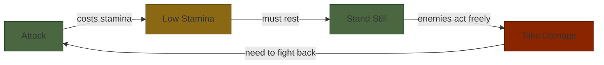
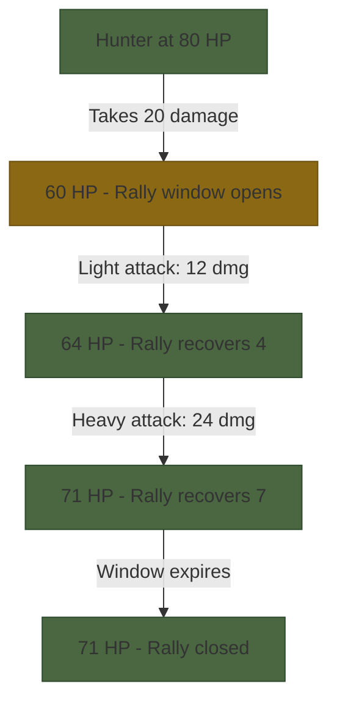
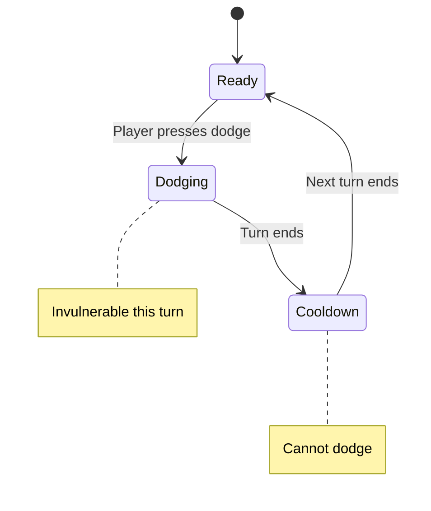
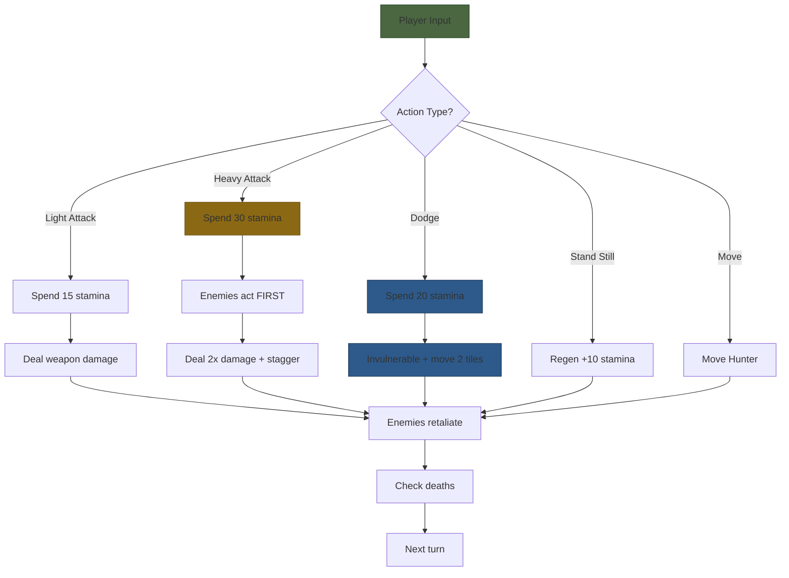

# Act 2 — The Dream

> *"You awaken in the Hunter's Dream, a refuge from the nightmare. A workshop of old weapons, a doll that speaks in riddles, and a headstone that leads back into the labyrinth. But now you are not merely an observer — you are the Hunter."*

In Act 1 you built the dungeon itself — rooms, corridors, doors, fog. A world of stone and silence. Now we breathe life into it. By the end of Act 2 you will have a Hunter who moves through the labyrinth, swings a weapon, dodges attacks, drinks blood vials, and fights enemies to the death.

This is where the game becomes a *game*.

**What you'll build in Act 2:**

- A Hunter struct with HP, stamina, blood vials, weapon, and position
- WASD movement with wall collision and fog-of-war reveal
- A stamina system that creates real tactical pressure
- Light and heavy attacks against enemies
- Dodge rolling with invulnerability and cooldown
- Blood vials, loot pickup, and inventory management

**Crate versions used:** `ratatui 0.30`, `crossterm 0.29`, `rand 0.9`, `rand_chacha 0.9`

---

## Stage 11 — The Hunter Struct

**Difficulty:** Easy | **Concept:** Structs, enums, rendering a player character

> *"A hunter is a hunter, even in a dream."*

Every roguelike needs a protagonist. Ours is the Hunter — a lone figure descending into procedurally generated chalice dungeons. In code, the Hunter is a struct that holds every piece of state the player cares about: health, stamina, items, position, and the weapon they wield.

### 11.1 — The Weapon Enum

Before we define the Hunter, we need to define what they carry. Each weapon in The Chalice has different base damage, speed, and a special property. We model this as an enum:

```rust
/// Every weapon the Hunter can wield.
/// Each variant carries its own stats — no need for a separate data table.
#[derive(Debug, Clone, PartialEq)]
pub enum Weapon {
    SawCleaver,
    HunterAxe,
    ThreadedCane,
    Kirkhammer,
    BladeOfMercy,
    LudwigsHolyBlade,
}
```

In Python you might use a string or a dictionary lookup. In TypeScript, a union type. Rust's enums are more powerful — each variant is a distinct type that the compiler tracks. You literally *cannot* pass an invalid weapon name.

Now we add methods to the enum. This is one of Rust's superpowers — you can attach behavior directly to data:

```rust
impl Weapon {
    /// Base damage before modifiers.
    pub fn base_damage(&self) -> i16 {
        match self {
            Weapon::SawCleaver => 12,
            Weapon::HunterAxe => 18,
            Weapon::ThreadedCane => 10,
            Weapon::Kirkhammer => 22,
            Weapon::BladeOfMercy => 7,  // attacks twice per turn
            Weapon::LudwigsHolyBlade => 20,
        }
    }

    /// Display name for the HUD.
    pub fn name(&self) -> &str {
        match self {
            Weapon::SawCleaver => "Saw Cleaver",
            Weapon::HunterAxe => "Hunter Axe",
            Weapon::ThreadedCane => "Threaded Cane",
            Weapon::Kirkhammer => "Kirkhammer",
            Weapon::BladeOfMercy => "Blade of Mercy",
            Weapon::LudwigsHolyBlade => "Ludwig's Holy Blade",
        }
    }

    /// Stamina cost for a heavy attack. Most weapons cost 30,
    /// but Ludwig's Holy Blade is more efficient at 25.
    pub fn heavy_stamina_cost(&self) -> u8 {
        match self {
            Weapon::LudwigsHolyBlade => 25,
            _ => 30, // underscore matches "everything else"
        }
    }

    /// The symbol shown on the map for weapon-specific effects.
    pub fn glyph(&self) -> char {
        '@' // the Hunter is always @, regardless of weapon
    }
}
```

**Why `match` instead of `if/else`?** The Rust compiler *forces* you to handle every variant. If you add a new weapon later and forget to update `base_damage()`, the code won't compile. Python and TypeScript will happily let you ship a bug. Rust won't.

> **Python comparison:**
> ```python
> # Python — nothing stops you from passing "BFG9000"
> WEAPON_DAMAGE = {"Saw Cleaver": 12, "Hunter Axe": 18}
> damage = WEAPON_DAMAGE[weapon_name]  # KeyError at runtime!
> ```
> In Rust, the enum + match makes invalid states unrepresentable at compile time.

### 11.2 — The Hunter Struct

Now the Hunter itself. We follow the design spec's stat block exactly:

```rust
/// The player character. All game state for the player lives here.
#[derive(Debug, Clone)]
pub struct Hunter {
    pub name: String,
    pub hp: i16,
    pub max_hp: i16,
    pub stamina: u8,
    pub max_stamina: u8,
    pub rally_window: u8,   // turns remaining to rally HP back
    pub rally_hp: i16,      // max HP recoverable via rally
    pub blood_vials: u8,
    pub insight: u8,
    pub weapon: Weapon,
    pub items: Vec<Item>,   // inventory, max 8 slots
    pub position: (usize, usize), // (x, y) on the dungeon grid
    pub floor: u8,
    pub echoes: u32,        // currency — lost on death
    pub exhausted: bool,    // true when stamina action fails
    pub dodge_cooldown: u8, // turns until dodge is available again
}
```

Let's unpack the types:

| Field | Type | Why |
|-------|------|-----|
| `hp` | `i16` | Signed because damage calculations can temporarily go negative before clamping |
| `stamina` | `u8` | 0-100 fits in an unsigned byte. Never negative |
| `blood_vials` | `u8` | Max 10 — a byte is plenty |
| `insight` | `u8` | 0-100 range, same as stamina |
| `position` | `(usize, usize)` | Grid coordinates are always positive. `usize` matches array indexing |
| `items` | `Vec<Item>` | Growable list, capped at 8 in game logic |
| `echoes` | `u32` | Currency can get large. Unsigned — you can't have negative echoes |

We need a placeholder `Item` enum for now (we'll flesh it out in Stage 16):

```rust
#[derive(Debug, Clone, PartialEq)]
pub enum Item {
    BloodVial,
    MolotovCocktail,
    Antidote,
    BoldHuntersMark,
    FirePaper,
    ShamanBoneBlade,
    ChaliceKey,
    Sedative,
}
```

### 11.3 — The Constructor

Every Hunter starts with the same base stats. We use an associated function (Rust's version of a constructor):

```rust
impl Hunter {
    /// Create a new Hunter with default starting stats.
    /// The weapon is chosen based on the dungeon seed.
    pub fn new(name: String, weapon: Weapon) -> Self {
        Hunter {
            name,
            hp: 100,
            max_hp: 100,
            stamina: 100,
            max_stamina: 100,
            rally_window: 0,
            rally_hp: 0,
            blood_vials: 5,
            insight: 0,
            weapon,
            items: Vec::new(),
            position: (0, 0), // will be set to spawn point
            floor: 1,
            echoes: 0,
            exhausted: false,
            dodge_cooldown: 0,
        }
    }

    /// Is the Hunter dead?
    pub fn is_dead(&self) -> bool {
        self.hp <= 0
    }

    /// Is the Hunter able to dodge this turn?
    pub fn can_dodge(&self) -> bool {
        self.dodge_cooldown == 0 && self.stamina >= 20
    }
}
```

**Why `Self` instead of `Hunter`?** They mean the same thing inside an `impl Hunter` block. `Self` is conventional and saves you from updating the name if you ever rename the struct.

### 11.4 — Rendering the Hunter

The Hunter appears on the dungeon map as `@` — the universal roguelike symbol for "you are here." We already have a dungeon grid from Act 1. Now we overlay the Hunter on top of it.

Here's how rendering works with ratatui. The key insight: ratatui uses *immediate mode* rendering. Every frame, you redraw everything from scratch. There's no "move the player sprite" — you just draw the whole map with `@` at the Hunter's current position.

```rust
use ratatui::style::{Color, Style, Stylize};
use ratatui::text::{Line, Span};

/// Build a vector of Lines representing the dungeon map,
/// with the Hunter rendered at their position.
pub fn render_map(dungeon: &Dungeon, hunter: &Hunter) -> Vec<Line<'static>> {
    let mut lines = Vec::new();

    for y in 0..dungeon.height {
        let mut spans = Vec::new();

        for x in 0..dungeon.width {
            // Hunter's position takes priority over everything
            if (x, y) == hunter.position {
                spans.push(
                    Span::styled("@", Style::new().fg(Color::Yellow).bold())
                );
            } else {
                // Render the tile (from Act 1)
                let tile = &dungeon.tiles[y][x];
                spans.push(tile_to_span(tile));
            }
        }

        lines.push(Line::from(spans));
    }

    lines
}
```

The `Span::styled("@", Style::new().fg(Color::Yellow).bold())` call:
- `Span::styled` creates a styled text segment — verified from ratatui 0.30 docs
- `Style::new()` creates a blank style
- `.fg(Color::Yellow)` sets foreground color
- `.bold()` comes from the `Stylize` trait — a shorthand for adding bold modifier

Then in your main draw function:

```rust
use ratatui::widgets::Paragraph;
use ratatui::Frame;

fn draw(frame: &mut Frame, dungeon: &Dungeon, hunter: &Hunter) {
    let map_lines = render_map(dungeon, hunter);
    let map_widget = Paragraph::new(map_lines);
    frame.render_widget(map_widget, frame.area());
}
```

### 11.5 — Common Mistake: Owned vs Borrowed Strings

You'll hit this error early:

```
error[E0515]: cannot return value referencing local variable
```

This happens when you try to return `Span` values that borrow from a local `String`. The fix: use `'static` lifetimes for your span content by using string literals (`"@"`) or by converting with `.to_string()` and storing the owned data.

In our `render_map` function, we use string literals like `"@"`, `"#"`, `"."` — these are `&'static str` and live for the entire program. No borrowing issues.

If you need dynamic text (like showing enemy HP), you'll need to own the string:

```rust
// This WON'T compile — format! creates a temporary String
// let span = Span::raw(&format!("HP: {}", hp));

// This WILL compile — we pass an owned String
let span = Span::raw(format!("HP: {}", hp));
```

`Span::raw()` accepts anything that implements `Into<Cow<'a, str>>`, which includes both `&str` and `String`. When you pass an owned `String`, the `Span` takes ownership and there's no lifetime issue.

### Stage 11 Checkpoint

Your project should now have:

```
src/
  main.rs          // game loop (from Act 1)
  dungeon.rs       // BSP generation (from Act 1)
  hunter.rs        // NEW — Hunter struct, Weapon enum
  render.rs        // rendering functions
```

The Hunter exists, has stats, and renders as `@` on the map. But they can't move yet — that's next.

---

## Stage 12 — Movement & Collision

**Difficulty:** Medium | **Concepts:** Input handling, enum-based actions, collision detection, fog of war

> *"The labyrinth shifts around you. Or perhaps it is you who shifts within it."*

A dungeon you can't explore is just a painting. In this stage we wire up WASD movement, make the Hunter collide with walls, open doors by walking into them, and reveal fog as rooms are entered.

### 12.1 — Modeling Player Actions

Before we handle keyboard input, let's define what the player *can do*. This is a perfect use for an enum:

```rust
/// Every action the player can take on their turn.
#[derive(Debug, Clone, PartialEq)]
pub enum PlayerAction {
    Move(Direction),
    LightAttack(Direction),
    HeavyAttack(Direction),
    Dodge(Direction),
    UseVial,
    UseItem(usize),    // index into inventory
    StandStill,        // regen stamina
    OpenMap,
    Quit,
}

/// Cardinal directions for movement and attacks.
#[derive(Debug, Clone, Copy, PartialEq)]
pub enum Direction {
    North,
    South,
    East,
    West,
}

impl Direction {
    /// Convert a direction into a grid delta.
    /// North is -y because row 0 is the top of the screen.
    pub fn delta(&self) -> (isize, isize) {
        match self {
            Direction::North => (0, -1),
            Direction::South => (0, 1),
            Direction::East  => (1, 0),
            Direction::West  => (-1, 0),
        }
    }
}
```

**Why `isize` for the delta?** Because movement can be negative (going north or west). We'll add this to `usize` coordinates carefully — more on that in a moment.

### 12.2 — Reading Keyboard Input

We use crossterm's event system. The pattern from the crossterm 0.29 docs:

```rust
use crossterm::event::{self, Event, KeyCode, KeyEventKind};

/// Block until the player presses a key, then convert it to a PlayerAction.
pub fn read_player_action() -> std::io::Result<PlayerAction> {
    loop {
        // read() blocks until an event is available
        match event::read()? {
            // Only respond to key PRESS events, not release or repeat
            Event::Key(key) if key.kind == KeyEventKind::Press => {
                match key.code {
                    // Movement — WASD
                    KeyCode::Char('w') => return Ok(PlayerAction::Move(Direction::North)),
                    KeyCode::Char('s') => return Ok(PlayerAction::Move(Direction::South)),
                    KeyCode::Char('d') => return Ok(PlayerAction::Move(Direction::East)),
                    KeyCode::Char('a') => return Ok(PlayerAction::Move(Direction::West)),

                    // Stand still — space bar
                    KeyCode::Char(' ') => return Ok(PlayerAction::StandStill),

                    // Blood vial
                    KeyCode::Char('v') => return Ok(PlayerAction::UseVial),

                    // Map
                    KeyCode::Char('m') => return Ok(PlayerAction::OpenMap),

                    // Quit
                    KeyCode::Char('q') | KeyCode::Esc => return Ok(PlayerAction::Quit),

                    // Ignore unbound keys — loop back and wait for another
                    _ => {}
                }
            }
            // Ignore mouse events, resize events, etc.
            _ => {}
        }
    }
}
```

**Critical detail:** `key.kind == KeyEventKind::Press`. Without this check, you'll process the same key twice — once on press, once on release. This is a common crossterm gotcha.

> **TypeScript comparison:**
> ```typescript
> // In a browser, you'd use addEventListener
> document.addEventListener('keydown', (e) => {
>     if (e.key === 'w') moveNorth();
> });
> ```
> The crossterm approach is similar but synchronous — `event::read()` blocks the thread until input arrives. This is fine for a turn-based game where nothing happens until the player acts.

### 12.3 — Applying Movement

Now we make the Hunter actually move. The tricky part: we need to check what's at the destination *before* moving there.

```rust
impl Hunter {
    /// Attempt to move in a direction. Returns true if the move succeeded.
    pub fn try_move(&mut self, dir: Direction, dungeon: &mut Dungeon) -> bool {
        let (dx, dy) = dir.delta();
        let new_x = self.position.0 as isize + dx;
        let new_y = self.position.1 as isize + dy;

        // Bounds check — don't walk off the map
        if new_x < 0 || new_y < 0 {
            return false;
        }

        let new_x = new_x as usize;
        let new_y = new_y as usize;

        if new_x >= dungeon.width || new_y >= dungeon.height {
            return false;
        }

        // Check what's at the destination
        match &dungeon.tiles[new_y][new_x] {
            Tile::Wall => false, // bonk

            Tile::Floor | Tile::StairsUp | Tile::StairsDown => {
                self.position = (new_x, new_y);
                true
            }

            Tile::Door { locked: false } => {
                // Walk through open doors
                self.position = (new_x, new_y);
                true
            }

            Tile::Door { locked: true } => {
                // Unlock and open the door, but don't move through yet.
                // The player moves through on their next step.
                dungeon.tiles[new_y][new_x] = Tile::Door { locked: false };
                false // turn spent opening, not moving
            }

            Tile::Fog => false, // can't walk into unexplored areas directly

            _ => false, // traps, loot, etc. handled in later stages
        }
    }
}
```

**The `usize`/`isize` dance:** Grid coordinates are `usize` (unsigned), but movement deltas are `isize` (signed). We cast to `isize` for the addition, bounds-check, then cast back. This is a common Rust pattern for grid-based games.

> **Common mistake:** Using `usize` arithmetic directly:
> ```rust
> // PANIC! If position.0 is 0 and dx is -1, this underflows
> let new_x = self.position.0 + dx as usize;
> ```
> `usize` subtraction panics on underflow in debug mode and wraps in release mode. Always cast to `isize` first.

### 12.4 — Fog of War Reveal

When the Hunter enters a room, all tiles in that room should be revealed. We need a way to know which room a tile belongs to. The simplest approach: flood-fill from the Hunter's position, revealing all connected floor tiles until we hit walls.

```rust
use std::collections::VecDeque;

impl Dungeon {
    /// Reveal all tiles in the room containing the given position.
    /// Uses BFS flood-fill from the position outward.
    pub fn reveal_room(&mut self, start: (usize, usize)) {
        let mut queue = VecDeque::new();
        let mut visited = vec![vec![false; self.width]; self.height];

        queue.push_back(start);
        visited[start.1][start.0] = true;

        while let Some((x, y)) = queue.pop_front() {
            // Reveal this tile (replace Fog with the actual tile)
            // In practice, we use a separate "revealed" grid
            self.revealed[y][x] = true;

            // Check all 4 neighbors
            for (dx, dy) in [(0isize, -1), (0, 1), (-1, 0), (1, 0)] {
                let nx = x as isize + dx;
                let ny = y as isize + dy;

                if nx < 0 || ny < 0 {
                    continue;
                }

                let nx = nx as usize;
                let ny = ny as usize;

                if nx >= self.width || ny >= self.height {
                    continue;
                }

                if visited[ny][nx] {
                    continue;
                }

                visited[ny][nx] = true;

                // Flood through floors, doors, and other walkable tiles.
                // Stop at walls (they get revealed but we don't flood past them).
                match &self.tiles[ny][nx] {
                    Tile::Wall => {
                        // Reveal the wall itself (so the room boundary is visible)
                        self.revealed[ny][nx] = true;
                        // But don't add to queue — don't flood past walls
                    }
                    _ => {
                        queue.push_back((nx, ny));
                    }
                }
            }
        }
    }
}
```

This means your `Dungeon` struct needs a `revealed` grid:

```rust
pub struct Dungeon {
    pub width: usize,
    pub height: usize,
    pub tiles: Vec<Vec<Tile>>,
    pub revealed: Vec<Vec<bool>>, // NEW — fog of war tracking
}
```

Update `render_map` to respect fog:

```rust
pub fn render_map(dungeon: &Dungeon, hunter: &Hunter) -> Vec<Line<'static>> {
    let mut lines = Vec::new();

    for y in 0..dungeon.height {
        let mut spans = Vec::new();

        for x in 0..dungeon.width {
            if (x, y) == hunter.position {
                spans.push(Span::styled("@", Style::new().fg(Color::Yellow).bold()));
            } else if !dungeon.revealed[y][x] {
                // Unrevealed — show fog
                spans.push(Span::styled(" ", Style::new().bg(Color::DarkGray)));
            } else {
                spans.push(tile_to_span(&dungeon.tiles[y][x]));
            }
        }

        lines.push(Line::from(spans));
    }

    lines
}
```

### 12.5 — Corridor Reveal

Corridors don't flood-fill like rooms — they reveal 3 tiles ahead in the direction of travel:

```rust
impl Dungeon {
    /// Reveal tiles along a corridor in the given direction, up to 3 tiles.
    pub fn reveal_corridor(&mut self, start: (usize, usize), dir: Direction) {
        let (dx, dy) = dir.delta();
        let mut x = start.0 as isize;
        let mut y = start.1 as isize;

        for _ in 0..3 {
            x += dx;
            y += dy;

            if x < 0 || y < 0 {
                break;
            }

            let ux = x as usize;
            let uy = y as usize;

            if ux >= self.width || uy >= self.height {
                break;
            }

            self.revealed[uy][ux] = true;

            // Stop revealing past walls
            if matches!(self.tiles[uy][ux], Tile::Wall) {
                break;
            }
        }
    }
}
```

### 12.6 — Wiring It Into the Game Loop

Now we connect input → movement → reveal → render:

```rust
fn game_loop(
    terminal: &mut ratatui::DefaultTerminal,
    dungeon: &mut Dungeon,
    hunter: &mut Hunter,
) -> std::io::Result<()> {
    // Reveal the starting room
    dungeon.reveal_room(hunter.position);

    loop {
        // 1. Draw the current state
        terminal.draw(|frame| draw(frame, dungeon, hunter))?;

        // 2. Wait for player input
        let action = read_player_action()?;

        // 3. Process the action
        match action {
            PlayerAction::Move(dir) => {
                if hunter.try_move(dir, dungeon) {
                    // Reveal fog around new position
                    dungeon.reveal_room(hunter.position);
                    dungeon.reveal_corridor(hunter.position, dir);
                }
            }
            PlayerAction::StandStill => {
                // Stamina regen — implemented in Stage 13
            }
            PlayerAction::Quit => break,
            _ => {} // other actions handled in later stages
        }

        // 4. Check win/lose conditions
        if hunter.is_dead() {
            break;
        }
    }

    Ok(())
}
```

And the `main` function ties it all together:

```rust
fn main() -> std::io::Result<()> {
    let mut terminal = ratatui::init();
    let result = run(&mut terminal);
    ratatui::restore();
    result
}

fn run(terminal: &mut ratatui::DefaultTerminal) -> std::io::Result<()> {
    let seed = "old-yharnam";
    let mut dungeon = Dungeon::generate(seed, 1); // floor 1
    let spawn = dungeon.find_spawn_point();

    let mut hunter = Hunter::new("Hunter".to_string(), Weapon::SawCleaver);
    hunter.position = spawn;

    game_loop(terminal, &mut dungeon, &mut hunter)
}
```

### 12.7 — The Mutable Borrow Problem

You will almost certainly hit this error:

```
error[E0502]: cannot borrow `*dungeon` as immutable because it is also
              borrowed as mutable
```

This happens when you try to read from the dungeon while also modifying it. For example:

```rust
// WON'T COMPILE — try_move borrows dungeon mutably,
// but we're inside a closure that already borrows hunter
if hunter.try_move(dir, &mut dungeon) {
    dungeon.reveal_room(hunter.position); // second mutable borrow!
}
```

The fix: `try_move` returns a `bool`, and the mutable borrow ends when the function returns. So the code above actually *does* compile — the borrows don't overlap. But if you tried to do both in a single expression, you'd get the error.

**Rule of thumb:** Break complex operations into sequential steps. Let each mutable borrow finish before starting the next one. Rust's borrow checker is strict but predictable — if you structure your code as "do A, then do B," you'll rarely fight it.

### Stage 12 Checkpoint

You now have a playable (if empty) dungeon:

- WASD moves the Hunter through corridors and rooms
- Walls block movement
- Doors open when you walk into them
- Fog reveals as you explore
- The game loop runs: draw → input → update → repeat

```
  ████████████
  █··········█
  █··@·······+····
  █··········█
  ████████████
```

The `@` moves. The fog parts. The dungeon awaits.

---

## Stage 13 — Stamina

**Difficulty:** Easy | **Concepts:** Resource management, game balance, conditional logic

> *"Every swing, every dodge, every desperate lunge — it all costs something. The blood remembers."*

Stamina is the invisible hand that shapes every decision in The Chalice. Without it, the player could attack endlessly, dodge forever, never face consequences. Stamina creates *tension* — the feeling of "I have enough for one more swing, but if I miss, I'm vulnerable."

### 13.1 — The Stamina Table

From the design spec, every action has a stamina cost:

| Action | Cost | Notes |
|--------|------|-------|
| Move | 0 | Free, but enemies may attack |
| Light attack | 15 | Base weapon damage |
| Heavy attack | 30 | 2x damage, staggers target |
| Dodge roll | 20 | Invulnerable, 1-turn cooldown |
| Use item | 5 | |
| Stand still | Regen +10 | Only way to recover stamina |

The critical design choice: **stamina only regenerates when you stand still.** Moving, attacking, dodging — none of these recover stamina. You must actively choose to rest, which means enemies get a free turn to act. This creates a risk/reward loop:



### 13.2 — Implementing Stamina Checks

We add stamina methods to the Hunter:

```rust
impl Hunter {
    /// Check if the Hunter has enough stamina for an action.
    /// Returns true if the action can proceed.
    pub fn has_stamina(&self, cost: u8) -> bool {
        self.stamina >= cost
    }

    /// Spend stamina on an action. Returns false if not enough stamina,
    /// and sets the exhausted flag.
    pub fn spend_stamina(&mut self, cost: u8) -> bool {
        if self.stamina >= cost {
            self.stamina -= cost;
            false // not exhausted
        } else {
            // Not enough stamina — action fails, Hunter is exhausted
            self.exhausted = true;
            true // exhausted
        }
    }

    /// Regenerate stamina (called when standing still).
    pub fn regen_stamina(&mut self) {
        // Add 10, but don't exceed max
        self.stamina = self.stamina.saturating_add(10).min(self.max_stamina);
    }

    /// Called at the start of each turn to clear temporary states.
    pub fn start_turn(&mut self) {
        self.exhausted = false;

        // Tick down dodge cooldown
        if self.dodge_cooldown > 0 {
            self.dodge_cooldown -= 1;
        }

        // Tick down rally window
        if self.rally_window > 0 {
            self.rally_window -= 1;
            if self.rally_window == 0 {
                self.rally_hp = 0; // rally expired
            }
        }
    }
}
```

**`saturating_add`** is a Rust standard library method that adds without panicking on overflow. Instead of wrapping around (100 + 10 = 110... wait, `u8` max is 255, so it's fine here), `saturating_add` clamps at the maximum value. We then use `.min(self.max_stamina)` to enforce our game's 100-stamina cap.

> **Python comparison:**
> ```python
> # Python — you'd manually clamp
> self.stamina = min(self.stamina + 10, self.max_stamina)
> ```
> Rust's `saturating_add` handles the overflow case that Python doesn't have (Python integers are arbitrary precision). In Rust, `u8` maxes at 255, so `saturating_add` prevents wrapping.

### 13.3 — Exhaustion

When the Hunter tries an action they can't afford, they become *exhausted* — vulnerable for 1 turn. Enemies deal bonus damage to exhausted Hunters (we'll implement that in Act 3).

The exhaustion state is simple: a boolean flag that gets set when `spend_stamina` fails and cleared at the start of the next turn.

```rust
// In the game loop, before processing actions:
hunter.start_turn();

match action {
    PlayerAction::Move(dir) => {
        // Movement is free — no stamina cost
        hunter.try_move(dir, &mut dungeon);
    }

    PlayerAction::StandStill => {
        hunter.regen_stamina();
    }

    PlayerAction::LightAttack(dir) => {
        if hunter.spend_stamina(15) {
            // exhausted! action failed
            log_message("You're too exhausted to attack!");
        } else {
            // attack logic (Stage 14)
        }
    }

    PlayerAction::Dodge(dir) => {
        if !hunter.can_dodge() {
            log_message("Dodge is on cooldown!");
        } else if hunter.spend_stamina(20) {
            log_message("Too exhausted to dodge!");
        } else {
            // dodge logic (Stage 15)
        }
    }

    _ => {}
}
```

### 13.4 — Rendering the Stamina Bar

We show stamina as a bar in the HUD, similar to HP. Using ratatui's `Gauge` widget:

```rust
use ratatui::widgets::{Block, Gauge};
use ratatui::layout::{Constraint, Layout, Rect};

fn render_hud(frame: &mut Frame, hunter: &Hunter, area: Rect) {
    let chunks = Layout::horizontal([
        Constraint::Percentage(33), // HP bar
        Constraint::Percentage(33), // Stamina bar
        Constraint::Percentage(34), // Info
    ])
    .split(area);

    // HP bar
    let hp_ratio = hunter.hp as f64 / hunter.max_hp as f64;
    let hp_gauge = Gauge::default()
        .block(Block::bordered().title("HP"))
        .gauge_style(Style::new().fg(Color::Red))
        .ratio(hp_ratio.clamp(0.0, 1.0))
        .label(format!("{}/{}", hunter.hp, hunter.max_hp));
    frame.render_widget(hp_gauge, chunks[0]);

    // Stamina bar
    let stam_ratio = hunter.stamina as f64 / hunter.max_stamina as f64;
    let stam_color = if hunter.exhausted {
        Color::DarkGray // visual feedback: you're exhausted
    } else if hunter.stamina < 20 {
        Color::Yellow    // warning: low stamina
    } else {
        Color::Green
    };
    let stam_gauge = Gauge::default()
        .block(Block::bordered().title("Stamina"))
        .gauge_style(Style::new().fg(stam_color))
        .ratio(stam_ratio.clamp(0.0, 1.0))
        .label(format!("{}/{}", hunter.stamina, hunter.max_stamina));
    frame.render_widget(stam_gauge, chunks[1]);

    // Info panel
    let info = Paragraph::new(format!(
        "Weapon: {} ({})  Insight: {}  Echoes: {}  Vials: {}  Dodge: {}",
        hunter.weapon.name(),
        hunter.weapon.base_damage(),
        hunter.insight,
        hunter.echoes,
        hunter.blood_vials,
        if hunter.can_dodge() { "READY" } else { "COOLDOWN" },
    ));
    frame.render_widget(info, chunks[2]);
}
```

**`Layout::horizontal`** splits a rectangle into columns. We use `Constraint::Percentage` to divide the HUD into thirds. The `split` method returns a `Vec<Rect>` — one rectangle per constraint.

**`Gauge::default()`** creates a progress bar widget. `.ratio()` takes a `f64` between 0.0 and 1.0. We clamp to prevent panics if HP somehow goes negative.

### 13.5 — Updating the Draw Function

Now we split the screen into map area and HUD:

```rust
fn draw(frame: &mut Frame, dungeon: &Dungeon, hunter: &Hunter) {
    let layout = Layout::vertical([
        Constraint::Min(1),      // map takes remaining space
        Constraint::Length(3),   // HUD is 3 rows tall
    ])
    .split(frame.area());

    // Map
    let map_lines = render_map(dungeon, hunter);
    let map_widget = Paragraph::new(map_lines)
        .block(Block::bordered().title(format!(
            " The Chalice — Floor {} — Seed: {} ",
            hunter.floor, "old-yharnam"
        )));
    frame.render_widget(map_widget, layout[0]);

    // HUD
    render_hud(frame, hunter, layout[1]);
}
```

### Stage 13 Checkpoint

The Hunter now has a stamina economy:

- Actions cost stamina (15 for light attack, 30 for heavy, 20 for dodge, 5 for items)
- Standing still regenerates +10 stamina
- Running out of stamina causes exhaustion (1 turn vulnerability)
- The HUD shows HP and stamina bars with color-coded warnings
- Dodge cooldown is tracked and displayed

The pressure is real. Every action matters.

---

## Stage 14 — Light Attack

**Difficulty:** Medium | **Concepts:** Entity interaction, damage calculation, the rally mechanic, death checks

> *"Steel meets flesh. The beast staggers. You press forward — there is no mercy in the hunt."*

We've been building toward this moment. The Hunter can move, has stamina to spend, and now they need something to spend it *on*. In this stage we introduce the simplest form of combat: walk up to an enemy, hit it, take a hit back, and see who dies first.

### 14.1 — A Minimal Enemy (Placeholder)

We'll build the full enemy system in Act 3. For now, we need just enough to test combat:

```rust
/// Minimal enemy for testing combat. Full version in Stage 17.
#[derive(Debug, Clone)]
pub struct Enemy {
    pub name: String,
    pub hp: i16,
    pub max_hp: i16,
    pub damage: i16,
    pub position: (usize, usize),
    pub alive: bool,
}

impl Enemy {
    pub fn husk(position: (usize, usize)) -> Self {
        Enemy {
            name: "Husk".to_string(),
            hp: 20,
            max_hp: 20,
            damage: 8,
            position,
            alive: true,
        }
    }

    pub fn take_damage(&mut self, amount: i16) {
        self.hp -= amount;
        if self.hp <= 0 {
            self.hp = 0;
            self.alive = false;
        }
    }

    pub fn glyph(&self) -> char {
        if self.alive { 'H' } else { '.' }
    }
}
```

And we need a list of enemies in our game state:

```rust
/// All mutable game state in one place.
pub struct GameState {
    pub dungeon: Dungeon,
    pub hunter: Hunter,
    pub enemies: Vec<Enemy>,
    pub messages: Vec<String>, // combat log
}
```

**Why a separate `GameState` struct?** As the game grows, passing `dungeon`, `hunter`, and `enemies` as separate parameters creates borrow checker nightmares. Grouping them into one struct lets us pass `&mut GameState` and access each field independently — Rust allows borrowing *different fields* of a struct simultaneously.

```rust
// This WORKS — borrowing different fields of the same struct
let hunter = &mut state.hunter;
let enemies = &mut state.enemies;
// Both are valid because they're disjoint borrows

// This WOULD NOT work if hunter and enemies were separate parameters
// both borrowed from the same parent
```

### 14.2 — Finding an Adjacent Enemy

Before attacking, we need to find an enemy in the direction the Hunter is facing:

```rust
impl GameState {
    /// Find a living enemy at the given position.
    pub fn enemy_at(&self, pos: (usize, usize)) -> Option<usize> {
        self.enemies
            .iter()
            .position(|e| e.alive && e.position == pos)
    }

    /// Find a living enemy adjacent to the Hunter in the given direction.
    pub fn enemy_in_direction(&self, dir: Direction) -> Option<usize> {
        let (dx, dy) = dir.delta();
        let target_x = self.hunter.position.0 as isize + dx;
        let target_y = self.hunter.position.1 as isize + dy;

        if target_x < 0 || target_y < 0 {
            return None;
        }

        self.enemy_at((target_x as usize, target_y as usize))
    }
}
```

**`iter().position()`** returns the *index* of the first matching element, wrapped in `Option<usize>`. We use the index rather than a reference because we'll need to mutate the enemy later, and holding a reference would conflict with other borrows.

> **Python comparison:**
> ```python
> # Python — find index with next()
> idx = next((i for i, e in enumerate(enemies) if e.alive and e.pos == target), None)
> ```
> Rust's `.position()` is the equivalent, but returns `Option<usize>` instead of raising `StopIteration`.

### 14.3 — The Light Attack

A light attack costs 15 stamina and deals the weapon's base damage. If the Hunter is behind the enemy, damage gets a +50% backstab bonus.

```rust
impl GameState {
    /// Execute a light attack in the given direction.
    /// Returns a message describing what happened.
    pub fn light_attack(&mut self, dir: Direction) -> String {
        // Check stamina
        if self.hunter.spend_stamina(15) {
            return "You're too exhausted to attack!".to_string();
        }

        // Find target
        let target_idx = match self.enemy_in_direction(dir) {
            Some(idx) => idx,
            None => return "You swing at empty air.".to_string(),
        };

        // Calculate damage
        let mut damage = self.hunter.weapon.base_damage();

        // Backstab check: is the Hunter behind the enemy?
        // "Behind" means the Hunter is on the opposite side from
        // the direction the enemy is facing (simplified: opposite
        // of the direction from enemy to Hunter)
        // For now, we skip facing — backstab is a future refinement

        // Blade of Mercy attacks twice
        let hits = if self.hunter.weapon == Weapon::BladeOfMercy { 2 } else { 1 };

        let mut total_damage: i16 = 0;
        for _ in 0..hits {
            self.enemies[target_idx].take_damage(damage);
            total_damage += damage;
        }

        // Rally mechanic: if rally window is active, recover HP
        let rally_recovered = self.apply_rally(total_damage);

        // Build result message
        let enemy = &self.enemies[target_idx];
        let mut msg = format!(
            "You strike the {} for {} damage!",
            enemy.name, total_damage
        );

        if rally_recovered > 0 {
            msg.push_str(&format!(" Rally: +{} HP!", rally_recovered));
        }

        if !enemy.alive {
            msg.push_str(&format!(" The {} is slain!", enemy.name));
            self.hunter.echoes += 50; // base echo reward
        }

        msg
    }
}
```

### 14.4 — The Rally Mechanic

This is Bloodborne's signature system. When the Hunter takes damage, a *rally window* opens for 2 turns. During this window, 30% of damage the Hunter deals is recovered as HP, up to the amount lost.

Rally rewards aggression: instead of retreating after being hit, the optimal play is to attack back immediately.

```rust
impl Hunter {
    /// Called when the Hunter takes damage. Opens or resets the rally window.
    pub fn take_damage(&mut self, amount: i16) {
        self.hp -= amount;

        // Open rally window — 2 turns to recover HP by attacking
        self.rally_window = 2;
        self.rally_hp = amount; // max recoverable = damage taken

        if self.hp <= 0 {
            self.hp = 0;
        }
    }
}

impl GameState {
    /// Apply rally recovery based on damage dealt.
    /// Returns the amount of HP recovered.
    fn apply_rally(&mut self, damage_dealt: i16) -> i16 {
        if self.hunter.rally_window == 0 || self.hunter.rally_hp <= 0 {
            return 0;
        }

        // Recover 30% of damage dealt, rounded up
        let recovery = ((damage_dealt as f64) * 0.3).ceil() as i16;

        // Cap at remaining rally HP
        let actual = recovery.min(self.hunter.rally_hp);

        // Cap at max HP
        let actual = actual.min(self.hunter.max_hp - self.hunter.hp);

        self.hunter.hp += actual;
        self.hunter.rally_hp -= actual;

        actual
    }
}
```

**Rally example from the spec:** Hunter has 80 HP, takes 20 damage (now 60 HP, rally_hp = 20). Next turn, light attack deals 12 → recovers ceil(12 * 0.3) = 4 HP. Turn after, heavy attack deals 24 → recovers ceil(24 * 0.3) = 8 HP, but only 7 remains in rally_hp. Hunter ends at 71 HP.



### 14.5 — Enemy Retaliation

After the Hunter attacks, the enemy (if still alive) hits back. This is the simplest form of enemy AI — we'll make it smarter in Act 3:

```rust
impl GameState {
    /// All living enemies adjacent to the Hunter attack.
    pub fn enemies_retaliate(&mut self) -> Vec<String> {
        let mut messages = Vec::new();
        let hunter_pos = self.hunter.position;

        for enemy in &self.enemies {
            if !enemy.alive {
                continue;
            }

            // Check if enemy is adjacent (Manhattan distance = 1)
            let dx = (enemy.position.0 as isize - hunter_pos.0 as isize).abs();
            let dy = (enemy.position.1 as isize - hunter_pos.1 as isize).abs();

            if dx + dy == 1 {
                let damage = enemy.damage;
                messages.push(format!(
                    "The {} strikes you for {} damage!",
                    enemy.name, damage
                ));
                // We collect damage first, apply after the loop
                // to avoid borrow issues with self.hunter
            }
        }

        // Now apply damage (no borrow conflict — enemies loop is done)
        let total_damage: i16 = self.enemies
            .iter()
            .filter(|e| {
                if !e.alive { return false; }
                let dx = (e.position.0 as isize - hunter_pos.0 as isize).abs();
                let dy = (e.position.1 as isize - hunter_pos.1 as isize).abs();
                dx + dy == 1
            })
            .map(|e| e.damage)
            .sum();

        if total_damage > 0 {
            self.hunter.take_damage(total_damage);
        }

        messages
    }
}
```

> **Common mistake: Borrowing `self` in a loop that also needs `self.hunter`**
>
> You might try:
> ```rust
> for enemy in &self.enemies {
>     self.hunter.take_damage(enemy.damage); // ERROR!
> }
> ```
> This fails because `&self.enemies` borrows `self` immutably, but `self.hunter.take_damage()` borrows `self` mutably. The fix: collect the data you need first (damage amounts), then apply it after the loop ends.

### 14.6 — Updating the Game Loop

```rust
match action {
    PlayerAction::LightAttack(dir) => {
        let msg = state.light_attack(dir);
        state.messages.push(msg);

        // Enemies retaliate
        let retaliation = state.enemies_retaliate();
        state.messages.extend(retaliation);
    }
    // ... other actions
}
```

### 14.7 — Rendering Enemies on the Map

Update `render_map` to show enemies:

```rust
// Inside the x/y loop, after checking hunter position:
if (x, y) == hunter.position {
    spans.push(Span::styled("@", Style::new().fg(Color::Yellow).bold()));
} else if let Some(enemy) = state.enemies.iter().find(|e| e.alive && e.position == (x, y)) {
    let glyph = enemy.glyph().to_string();
    spans.push(Span::styled(glyph, Style::new().fg(Color::Red)));
} else if !dungeon.revealed[y][x] {
    spans.push(Span::styled(" ", Style::new().bg(Color::DarkGray)));
} else {
    spans.push(tile_to_span(&dungeon.tiles[y][x]));
}
```

### Stage 14 Checkpoint

Combat works at its most basic level:

- Light attack costs 15 stamina, deals weapon base damage
- Blade of Mercy hits twice per attack
- Rally mechanic recovers HP when attacking after taking damage
- Enemies adjacent to the Hunter retaliate after the player's turn
- Dead enemies are removed from the map
- Combat messages appear in a log

The Hunt has begun.

---

## Stage 15 — Heavy Attack & Dodge

**Difficulty:** Medium | **Concepts:** State transitions, cooldown systems, invulnerability frames, stagger mechanics

> *"The heavy blow lands with the weight of purpose. The beast stumbles. For one precious moment, the world holds its breath."*

Light attacks are reliable but predictable. Heavy attacks and dodge rolls add *decision depth* — moments where the right choice turns a losing fight into a victory.

### 15.1 — Heavy Attack: Stagger and Risk

A heavy attack costs 30 stamina (double a light attack) but deals 2x weapon damage and **staggers** the target — the enemy skips its next turn. The tradeoff: heavy attacks are *slow*. Enemies act first on a heavy attack turn.

This creates a tactical decision:

| Situation | Best Choice |
|-----------|-------------|
| Enemy about to attack | Dodge (avoid damage) |
| Enemy just attacked (recovering) | Heavy attack (free stagger) |
| Low stamina | Light attack (cheaper) |
| Bell Maiden summoning | Heavy attack (interrupt!) |

We need a `staggered` field on enemies:

```rust
// Add to Enemy struct:
pub struct Enemy {
    // ... existing fields ...
    pub staggered: u8, // turns remaining in stagger state
}
```

Now the heavy attack implementation:

```rust
impl GameState {
    /// Execute a heavy attack. Costs more stamina, deals 2x damage,
    /// and staggers the target (skips their next turn).
    /// IMPORTANT: enemies act BEFORE the heavy attack lands.
    pub fn heavy_attack(&mut self, dir: Direction) -> Vec<String> {
        let mut messages = Vec::new();

        // Check stamina — weapon-specific cost
        let cost = self.hunter.weapon.heavy_stamina_cost();
        if self.hunter.spend_stamina(cost) {
            messages.push("You're too exhausted for a heavy attack!".to_string());
            return messages;
        }

        // ENEMIES ACT FIRST on heavy attack turns (it's slow)
        let retaliation = self.enemies_retaliate();
        messages.extend(retaliation);

        // Check if Hunter died from retaliation
        if self.hunter.is_dead() {
            messages.push("You fall before the blow lands...".to_string());
            return messages;
        }

        // Find target
        let target_idx = match self.enemy_in_direction(dir) {
            Some(idx) => idx,
            None => {
                messages.push("Your heavy swing hits nothing but air.".to_string());
                return messages;
            }
        };

        // Calculate damage: 2x base
        let damage = self.hunter.weapon.base_damage() * 2;

        // Apply damage
        self.enemies[target_idx].take_damage(damage);

        // Stagger the target (skip next turn)
        if self.enemies[target_idx].alive {
            self.enemies[target_idx].staggered = 1;
        }

        // Rally
        let rally_recovered = self.apply_rally(damage);

        // Messages
        let enemy = &self.enemies[target_idx];
        let mut msg = format!(
            "Heavy blow! {} takes {} damage!",
            enemy.name, damage
        );

        if enemy.alive {
            msg.push_str(" STAGGERED!");
        } else {
            msg.push_str(&format!(" The {} is destroyed!", enemy.name));
            self.hunter.echoes += 50;
        }

        if rally_recovered > 0 {
            msg.push_str(&format!(" Rally: +{} HP!", rally_recovered));
        }

        messages.push(msg);
        messages
    }
}
```

**The "enemies act first" rule** is what makes heavy attacks risky. You commit to a slow, powerful swing, and the enemy gets a free hit. This is why you want to use heavy attacks when the enemy is recovering or staggered — they can't punish you.

### 15.2 — Stagger Resolution

Staggered enemies skip their turn. We handle this in the enemy action phase:

```rust
impl GameState {
    /// Process enemy turns. Staggered enemies skip their action.
    pub fn process_enemy_turns(&mut self) -> Vec<String> {
        let mut messages = Vec::new();
        let hunter_pos = self.hunter.position;

        // Collect actions first to avoid borrow issues
        let mut damage_to_apply: i16 = 0;

        for enemy in &mut self.enemies {
            if !enemy.alive {
                continue;
            }

            // Staggered enemies recover instead of acting
            if enemy.staggered > 0 {
                enemy.staggered -= 1;
                messages.push(format!("The {} is staggered!", enemy.name));
                continue;
            }

            // Check adjacency
            let dx = (enemy.position.0 as isize - hunter_pos.0 as isize).abs();
            let dy = (enemy.position.1 as isize - hunter_pos.1 as isize).abs();

            if dx + dy == 1 {
                damage_to_apply += enemy.damage;
                messages.push(format!(
                    "The {} strikes you for {} damage!",
                    enemy.name, enemy.damage
                ));
            }
        }

        if damage_to_apply > 0 {
            self.hunter.take_damage(damage_to_apply);
        }

        messages
    }
}
```

### 15.3 — Dodge Roll: Invulnerability and Cooldown

The dodge roll is the Hunter's defensive option. It costs 20 stamina, grants invulnerability for the current turn, and moves the Hunter 2 tiles in a direction. But there's a catch: **1-turn cooldown**. After dodging, you cannot dodge again next turn.

This prevents the "dodge spam" problem where a player becomes permanently invulnerable by dodging every turn.



```rust
impl GameState {
    /// Execute a dodge roll. Invulnerable this turn, move 2 tiles,
    /// then enter 1-turn cooldown.
    pub fn dodge_roll(&mut self, dir: Direction) -> String {
        // Check cooldown
        if self.hunter.dodge_cooldown > 0 {
            return "Dodge is on cooldown! You must wait a turn.".to_string();
        }

        // Check stamina
        if self.hunter.spend_stamina(20) {
            return "Too exhausted to dodge!".to_string();
        }

        // Move 2 tiles in the direction (stop at walls)
        let (dx, dy) = dir.delta();
        let mut final_pos = self.hunter.position;

        for _ in 0..2 {
            let new_x = final_pos.0 as isize + dx;
            let new_y = final_pos.1 as isize + dy;

            if new_x < 0 || new_y < 0 {
                break;
            }

            let new_x = new_x as usize;
            let new_y = new_y as usize;

            if new_x >= self.dungeon.width || new_y >= self.dungeon.height {
                break;
            }

            // Stop at walls and closed doors
            match &self.dungeon.tiles[new_y][new_x] {
                Tile::Wall | Tile::Door { locked: true } => break,
                _ => {
                    final_pos = (new_x, new_y);
                }
            }
        }

        self.hunter.position = final_pos;

        // Set cooldown — cannot dodge next turn
        self.hunter.dodge_cooldown = 1;

        // Reveal fog at new position
        self.dungeon.reveal_room(final_pos);

        format!(
            "You dodge roll! (Cooldown: 1 turn) Now at ({}, {})",
            final_pos.0, final_pos.1
        )
    }
}
```

### 15.4 — Invulnerability During Dodge

The dodge grants invulnerability *for the current turn*. We track this with a flag:

```rust
// Add to Hunter:
pub struct Hunter {
    // ... existing fields ...
    pub invulnerable: bool, // true during dodge turn
}
```

Set it during dodge, clear it at start of next turn:

```rust
// In dodge_roll():
self.hunter.invulnerable = true;

// In Hunter::start_turn():
self.hunter.invulnerable = false;
```

And check it when enemies attack:

```rust
// In process_enemy_turns(), before applying damage:
if self.hunter.invulnerable {
    messages.push("You're invulnerable! The attack passes through you.".to_string());
    // damage_to_apply stays 0
} else {
    // ... normal damage application
}
```

### 15.5 — Updating Input Handling

We need new key bindings for heavy attack and dodge. The design spec uses directional attacks, so we'll use Shift+WASD for attacks and arrow keys for dodge:

```rust
// Add to read_player_action():
// Light attack — J + direction (or just 'j' for the direction you're facing)
// For simplicity, we use number keys for attack directions:
KeyCode::Char('j') => {
    // Attack in the last movement direction, or prompt for direction
    // Simplified: attack north by default, use shift for other dirs
    return Ok(PlayerAction::LightAttack(Direction::North));
}

// Heavy attack — K
KeyCode::Char('k') => {
    return Ok(PlayerAction::HeavyAttack(Direction::North));
}

// Dodge — arrow keys
KeyCode::Up    => return Ok(PlayerAction::Dodge(Direction::North)),
KeyCode::Down  => return Ok(PlayerAction::Dodge(Direction::South)),
KeyCode::Right => return Ok(PlayerAction::Dodge(Direction::East)),
KeyCode::Left  => return Ok(PlayerAction::Dodge(Direction::West)),
```

A better approach is a two-step input: press the action key, then the direction key. But for now, this keeps things simple.

### 15.6 — The Complete Turn Flow

With light attacks, heavy attacks, and dodge, the turn structure is:



### Stage 15 Checkpoint

The combat system now has real depth:

- **Light attack:** 15 stamina, weapon damage, safe and reliable
- **Heavy attack:** 30 stamina, 2x damage + stagger, but enemies act first
- **Dodge roll:** 20 stamina, invulnerable + move 2 tiles, 1-turn cooldown
- **Rally:** attacking after taking damage recovers HP (30% of damage dealt)
- **Stagger:** heavy attacks make enemies skip their next turn

The Hunter has options. Every turn is a decision.

---

## Stage 16 — Blood Vials & Items

**Difficulty:** Medium | **Concepts:** Inventory management, item effects, loot pickup, Vec operations

> *"The blood heals. The blood sustains. The blood is everything in this wretched place."*

Blood vials are the Hunter's lifeline — 30 HP per vial, 5 to start, 10 max. But vials are finite. Every vial used is one you won't have for the boss fight. Items add tactical options beyond "hit it harder": molotovs for area damage, antidotes for poison, fire paper for a damage boost.

### 16.1 — Fleshing Out the Item System

We expand the `Item` enum with data the game needs:

```rust
#[derive(Debug, Clone, PartialEq)]
pub enum Item {
    BloodVial,
    MolotovCocktail,
    Antidote,
    BoldHuntersMark,
    FirePaper,
    ShamanBoneBlade,
    ChaliceKey,
    Sedative,
}

impl Item {
    /// Display name for the inventory screen.
    pub fn name(&self) -> &str {
        match self {
            Item::BloodVial => "Blood Vial",
            Item::MolotovCocktail => "Molotov Cocktail",
            Item::Antidote => "Antidote",
            Item::BoldHuntersMark => "Bold Hunter's Mark",
            Item::FirePaper => "Fire Paper",
            Item::ShamanBoneBlade => "Shaman Bone Blade",
            Item::ChaliceKey => "Chalice Key",
            Item::Sedative => "Sedative",
        }
    }

    /// Rarity affects drop rates and loot table weighting.
    pub fn rarity(&self) -> Rarity {
        match self {
            Item::BloodVial | Item::Antidote => Rarity::Common,
            Item::MolotovCocktail | Item::FirePaper
            | Item::ChaliceKey | Item::Sedative => Rarity::Uncommon,
            Item::BoldHuntersMark | Item::ShamanBoneBlade => Rarity::Rare,
        }
    }

    /// The glyph shown on the dungeon floor for loot drops.
    pub fn glyph(&self) -> char {
        '!'
    }
}

#[derive(Debug, Clone, PartialEq)]
pub enum Rarity {
    Common,
    Uncommon,
    Rare,
    VeryRare,
}
```

### 16.2 — Using Blood Vials

Blood vials are special — they're tracked separately from the inventory (the `blood_vials` counter) because they're used so frequently. Using a vial costs 1 turn and 5 stamina:

```rust
impl GameState {
    /// Use a blood vial. Heals 30 HP, costs 5 stamina and 1 turn.
    pub fn use_blood_vial(&mut self) -> String {
        if self.hunter.blood_vials == 0 {
            return "No blood vials remaining!".to_string();
        }

        if self.hunter.spend_stamina(5) {
            return "Too exhausted to use a vial!".to_string();
        }

        if self.hunter.hp >= self.hunter.max_hp {
            // Refund stamina — don't waste a vial at full HP
            self.hunter.stamina = self.hunter.stamina.saturating_add(5)
                .min(self.hunter.max_stamina);
            return "You're already at full health.".to_string();
        }

        self.hunter.blood_vials -= 1;

        let heal_amount = 30.min(self.hunter.max_hp - self.hunter.hp);
        self.hunter.hp += heal_amount;

        format!(
            "You crush a blood vial. +{} HP ({}/{}). Vials remaining: {}",
            heal_amount, self.hunter.hp, self.hunter.max_hp, self.hunter.blood_vials
        )
    }
}
```

**`30.min(self.hunter.max_hp - self.hunter.hp)`** — this prevents overhealing. If the Hunter has 90/100 HP, the vial heals 10, not 30. The `.min()` method on integers is a clean way to express "the smaller of these two values."

### 16.3 — Using Inventory Items

Items in the inventory are used by index. Each item has a different effect:

```rust
impl GameState {
    /// Use an item from the inventory by index.
    pub fn use_item(&mut self, index: usize) -> String {
        if index >= self.hunter.items.len() {
            return "Invalid item slot.".to_string();
        }

        if self.hunter.spend_stamina(5) {
            return "Too exhausted to use an item!".to_string();
        }

        // Remove the item from inventory (consumed on use)
        let item = self.hunter.items.remove(index);

        match item {
            Item::BloodVial => {
                // Shouldn't be in inventory (tracked separately), but handle it
                self.hunter.blood_vials = (self.hunter.blood_vials + 1).min(10);
                "Added a blood vial to your supply.".to_string()
            }

            Item::MolotovCocktail => {
                // Deal 25 fire damage to all enemies in the room
                let mut killed = 0;
                for enemy in &mut self.enemies {
                    if !enemy.alive {
                        continue;
                    }
                    // Check if enemy is in the same room (simplified: within 5 tiles)
                    let dist = manhattan_distance(self.hunter.position, enemy.position);
                    if dist <= 5 {
                        let damage = 25; // beasts take +50%, handled in Act 3
                        enemy.take_damage(damage);
                        if !enemy.alive {
                            killed += 1;
                        }
                    }
                }
                format!("The molotov explodes! 25 fire damage to nearby enemies. {} killed.", killed)
            }

            Item::Antidote => {
                // Cure poison (implemented in Act 3 with status effects)
                "You take the antidote. Poison cured.".to_string()
            }

            Item::BoldHuntersMark => {
                // Teleport to floor entrance
                if let Some(spawn) = self.dungeon.find_stairs_up() {
                    self.hunter.position = spawn;
                    self.dungeon.reveal_room(spawn);
                    "The mark activates! You're teleported to the floor entrance.".to_string()
                } else {
                    "The mark fizzles... no entrance found.".to_string()
                }
            }

            Item::FirePaper => {
                // +10 damage for 5 turns (tracked as a buff — simplified for now)
                "You apply fire paper to your weapon. +10 damage for 5 turns!".to_string()
            }

            Item::ShamanBoneBlade => {
                // Turn one enemy against others for 3 turns (Act 3)
                "You throw the bone blade! An enemy turns on its allies.".to_string()
            }

            Item::ChaliceKey => {
                // Don't consume — keys are used at Challenge Doors
                self.hunter.items.push(Item::ChaliceKey); // put it back
                "Chalice Keys are used at Challenge Doors.".to_string()
            }

            Item::Sedative => {
                // Reduce insight by 10
                self.hunter.insight = self.hunter.insight.saturating_sub(10);
                format!(
                    "You take the sedative. Insight reduced to {}.",
                    self.hunter.insight
                )
            }
        }
    }
}

/// Manhattan distance between two grid positions.
fn manhattan_distance(a: (usize, usize), b: (usize, usize)) -> usize {
    let dx = (a.0 as isize - b.0 as isize).unsigned_abs();
    let dy = (a.1 as isize - b.1 as isize).unsigned_abs();
    dx + dy
}
```

**`Vec::remove(index)`** removes the element at `index` and shifts all subsequent elements left. This is O(n) but our inventory is max 8 items, so it's fine. For larger collections you'd use `swap_remove` (O(1) but doesn't preserve order).

> **Python comparison:**
> ```python
> # Python — pop by index, same behavior
> item = self.items.pop(index)
> ```
> Rust's `Vec::remove` is the equivalent. Both shift elements and return the removed item.

### 16.4 — Picking Up Loot

When the Hunter walks over a `Tile::Loot`, they pick up the item:

```rust
impl GameState {
    /// Check if the Hunter is standing on loot and pick it up.
    pub fn check_loot_pickup(&mut self) -> Option<String> {
        let (x, y) = self.hunter.position;

        // Check if the tile is loot
        let tile = &self.dungeon.tiles[y][x];
        if let Tile::Loot { item, looted: false } = tile {
            let item = item.clone();

            // Blood vials go to the vial counter, not inventory
            if item == Item::BloodVial {
                if self.hunter.blood_vials >= 10 {
                    return Some("Blood vial found, but you're full (10/10).".to_string());
                }
                self.hunter.blood_vials += 1;
                self.dungeon.tiles[y][x] = Tile::Loot {
                    item: Item::BloodVial,
                    looted: true,
                };
                return Some(format!(
                    "Picked up a Blood Vial. ({}/10)",
                    self.hunter.blood_vials
                ));
            }

            // Check inventory capacity
            if self.hunter.items.len() >= 8 {
                return Some(format!(
                    "Found {} but inventory is full! (8/8)",
                    item.name()
                ));
            }

            // Pick it up
            let name = item.name().to_string();
            self.hunter.items.push(item);
            self.dungeon.tiles[y][x] = Tile::Loot {
                item: Item::BloodVial, // placeholder — tile is looted
                looted: true,
            };

            Some(format!("Picked up: {}", name))
        } else {
            None
        }
    }
}
```

Call this after every move in the game loop:

```rust
PlayerAction::Move(dir) => {
    if hunter_moved {
        // Check for loot at new position
        if let Some(msg) = state.check_loot_pickup() {
            state.messages.push(msg);
        }
    }
}
```

### 16.5 — The Inventory Screen

When the player presses `[i]`, show the inventory as a list:

```rust
fn render_inventory(frame: &mut Frame, hunter: &Hunter) {
    let items: Vec<Line> = hunter.items
        .iter()
        .enumerate()
        .map(|(i, item)| {
            Line::from(vec![
                Span::styled(
                    format!("[{}] ", i + 1),
                    Style::new().fg(Color::DarkGray),
                ),
                Span::styled(
                    item.name(),
                    Style::new().fg(match item.rarity() {
                        Rarity::Common => Color::White,
                        Rarity::Uncommon => Color::Cyan,
                        Rarity::Rare => Color::Yellow,
                        Rarity::VeryRare => Color::Magenta,
                    }),
                ),
            ])
        })
        .collect();

    let empty_slots = 8 - hunter.items.len();
    let mut all_lines = items;
    for _ in 0..empty_slots {
        all_lines.push(Line::from(
            Span::styled("[ ] —", Style::new().fg(Color::DarkGray))
        ));
    }

    // Add vial count at the top
    all_lines.insert(0, Line::from(format!(
        "Blood Vials: {}/10",
        hunter.blood_vials
    )));

    let inventory = Paragraph::new(all_lines)
        .block(Block::bordered().title(" Inventory "));

    // Render centered on screen
    let area = centered_rect(40, 14, frame.area());
    frame.render_widget(ratatui::widgets::Clear, area); // clear background
    frame.render_widget(inventory, area);
}

/// Create a centered rectangle within the given area.
fn centered_rect(width: u16, height: u16, area: Rect) -> Rect {
    let x = area.x + (area.width.saturating_sub(width)) / 2;
    let y = area.y + (area.height.saturating_sub(height)) / 2;
    Rect::new(x, y, width.min(area.width), height.min(area.height))
}
```

### 16.6 — Rendering Loot on the Map

Loot tiles show as `!` in a color based on rarity:

```rust
fn tile_to_span(tile: &Tile) -> Span<'static> {
    match tile {
        Tile::Wall => Span::styled("█", Style::new().fg(Color::DarkGray)),
        Tile::Floor => Span::styled("·", Style::new().fg(Color::Rgb(60, 60, 60))),
        Tile::Door { locked: false } => Span::styled("+", Style::new().fg(Color::Yellow)),
        Tile::Door { locked: true } => Span::styled("+", Style::new().fg(Color::Red)),
        Tile::StairsDown => Span::styled(">", Style::new().fg(Color::Cyan).bold()),
        Tile::StairsUp => Span::styled("<", Style::new().fg(Color::Cyan)),
        Tile::Loot { looted: true, .. } => Span::styled("·", Style::new().fg(Color::Rgb(60, 60, 60))),
        Tile::Loot { item, looted: false } => {
            let color = match item.rarity() {
                Rarity::Common => Color::White,
                Rarity::Uncommon => Color::Cyan,
                Rarity::Rare => Color::Yellow,
                Rarity::VeryRare => Color::Magenta,
            };
            Span::styled("!", Style::new().fg(color).bold())
        }
        Tile::Fog => Span::styled(" ", Style::new().bg(Color::DarkGray)),
        Tile::Trap { .. } => Span::styled("·", Style::new().fg(Color::Rgb(60, 60, 60))), // hidden!
        Tile::BossDoor { .. } => Span::styled("☠", Style::new().fg(Color::Red).bold()),
        Tile::Altar => Span::styled("△", Style::new().fg(Color::Magenta)),
        _ => Span::styled("?", Style::new().fg(Color::Red)),
    }
}
```

### Stage 16 Checkpoint

The item system is complete:

- Blood vials heal 30 HP, tracked separately, max 10
- 8-slot inventory for other items
- Loot pickup when walking over `!` tiles
- Items consumed on use with unique effects per type
- Inventory screen with rarity-colored item names
- Molotovs deal area fire damage
- Sedatives reduce insight
- Bold Hunter's Mark teleports to entrance

---

## Act 2 — Full Checkpoint

At the end of Act 2, your project structure should look like:

```
src/
  main.rs           // entry point, terminal init, game loop
  dungeon.rs        // BSP generation, tiles, fog reveal (Act 1)
  hunter.rs         // Hunter struct, Weapon enum, stamina, rally
  enemy.rs          // Enemy struct (placeholder, expanded in Act 3)
  combat.rs         // light attack, heavy attack, dodge roll
  items.rs          // Item enum, inventory, loot pickup
  render.rs         // map rendering, HUD, inventory screen
  input.rs          // keyboard input → PlayerAction
  game_state.rs     // GameState struct tying it all together
```

**What works:**

- Hunter moves through a fog-of-war dungeon with WASD
- Stamina system creates tactical pressure (rest vs act)
- Light attacks (15 stamina, base damage, rally-eligible)
- Heavy attacks (30 stamina, 2x damage, stagger, enemies act first)
- Dodge roll (20 stamina, invulnerable, 2-tile move, 1-turn cooldown)
- Rally mechanic (30% of damage dealt recovered as HP after taking a hit)
- Blood vials (heal 30 HP, max 10)
- Item inventory (8 slots, rarity system, unique effects)
- Loot pickup from dungeon floor
- HUD with HP bar, stamina bar, weapon info, dodge status

**What's next in Act 3:**

The enemies are static placeholders. In Act 3, we give them brains — state machines that make Husks shamble, Beasts charge, Watchers patrol, and Bell Maidens summon. The dungeon becomes dangerous.

> *"The dream fades. The hunt begins."*
