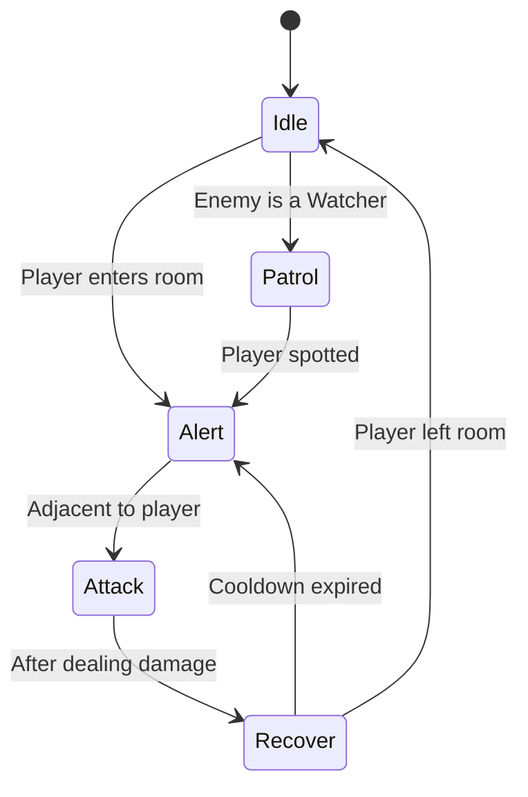
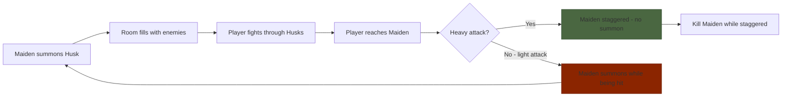
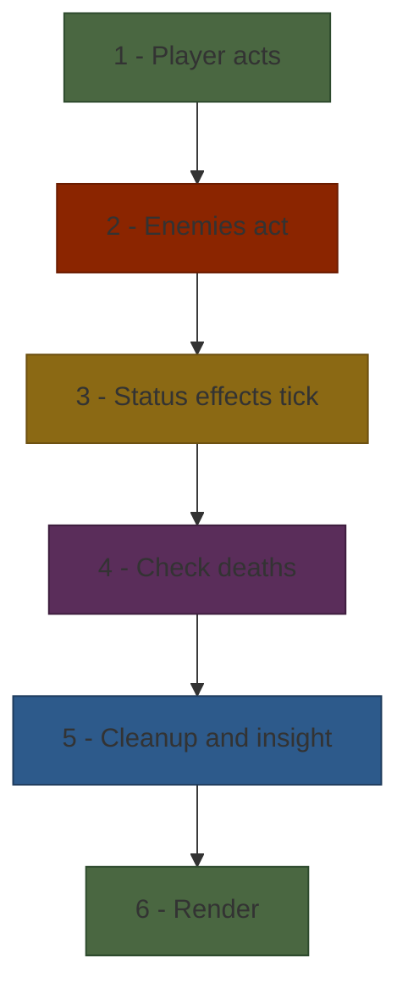
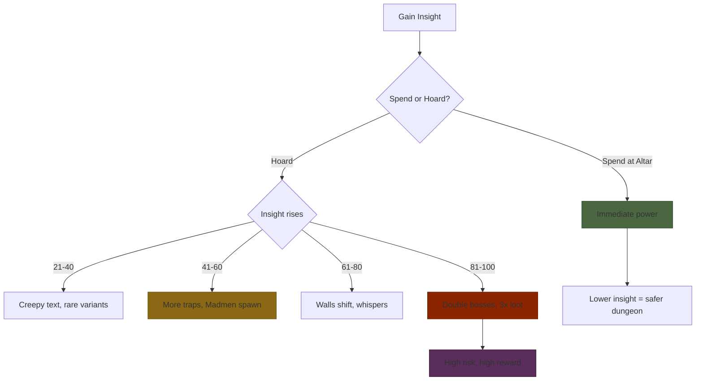

# Act 3 — The Hunt

> *"Beasts all over the shop... you'll be one of them, sooner or later."*

In Act 2 you built a Hunter who can move, fight, and heal. But the enemies were mannequins — standing still, waiting to be hit. In Act 3, we give them *minds*. Simple minds, but minds nonetheless.

By the end of this act, your dungeon will be alive with enemies that patrol corridors, chase the Hunter through rooms, summon reinforcements, and set traps. The combat system will resolve full turns with proper ordering, status effects, and death checks. And the insight mechanic will warp the dungeon itself as the Hunter sees too much.

**What you'll build in Act 3:**

- A full enemy type system with HP, damage, behavior, and AI state
- Pathfinding AI: BFS for Husks, line charges for Beasts, patrol routes for Watchers
- The Bell Maiden — a summoner that spawns enemies until killed
- Complete turn resolution: player → enemies → status effects → death checks
- Traps: spike pits, poison clouds, bell traps, mimics
- The insight mechanic: dungeon mutations at insight thresholds

---

## Stage 17 — The Enemy

**Difficulty:** Easy | **Concepts:** Enums as state machines, struct composition, the `match` expression

> *"Know your enemy. Each beast has a rhythm, a pattern. Learn it, or die to it."*

The placeholder enemies from Act 2 were mannequins — identical, stateless, interchangeable. A real roguelike needs enemies with *identity*: different types with different stats, different behaviors, different weaknesses. We define the full enemy type system now because the AI in Stage 18 needs to know *what* an enemy is before it can decide *how* it acts. The type determines the behavior, and the behavior determines the challenge.

Every enemy in The Chalice is defined by two things: what it *is* (type, stats, weaknesses) and what it's *doing* (AI state). We model both with enums — Rust's most powerful feature for game logic.

### 17.1 — Enemy Types

Right now every enemy is a generic `Enemy` struct with hardcoded stats. We can't distinguish a shambling Husk from a charging Beast — they're all the same. We need an `EnemyType` enum that captures the identity of each enemy species, with methods that return type-specific stats. This way, creating a new enemy type means adding one enum variant and filling in its `match` arms — the compiler ensures nothing is forgotten.

The design spec defines 9 enemy types. Each has unique stats and behavior:

```rust
/// The species of enemy. Determines base stats and AI behavior.
#[derive(Debug, Clone, PartialEq)]
pub enum EnemyType {
    Husk,
    Beast,
    Snatcher,
    BellMaiden,
    Madman,
    Watcher,
    CrossbowHollow,
    ShieldedBrute,
    Mimic,
}
```

Now we attach stats to each type. Instead of a lookup table, we use methods on the enum:

```rust
impl EnemyType {
    pub fn base_hp(&self) -> i16 {
        match self {
            EnemyType::Husk => 20,
            EnemyType::Beast => 35,
            EnemyType::Snatcher => 25,
            EnemyType::BellMaiden => 15,
            EnemyType::Madman => 30,
            EnemyType::Watcher => 40,
            EnemyType::CrossbowHollow => 20,
            EnemyType::ShieldedBrute => 50,
            EnemyType::Mimic => 35,
        }
    }

    pub fn base_damage(&self) -> i16 {
        match self {
            EnemyType::Husk => 8,
            EnemyType::Beast => 15,
            EnemyType::Snatcher => 10,
            EnemyType::BellMaiden => 5,
            EnemyType::Madman => 20,
            EnemyType::Watcher => 12,
            EnemyType::CrossbowHollow => 12,
            EnemyType::ShieldedBrute => 18,
            EnemyType::Mimic => 20,
        }
    }

    /// The character shown on the dungeon map.
    pub fn glyph(&self) -> char {
        match self {
            EnemyType::Husk => 'H',
            EnemyType::Beast => 'B',
            EnemyType::Snatcher => 'S',
            EnemyType::BellMaiden => 'M',
            EnemyType::Madman => '!',
            EnemyType::Watcher => 'W',
            EnemyType::CrossbowHollow => 'X',
            EnemyType::ShieldedBrute => 'T',
            EnemyType::Mimic => '?',
        }
    }

    /// Display name for combat messages.
    pub fn name(&self) -> &str {
        match self {
            EnemyType::Husk => "Husk",
            EnemyType::Beast => "Beast",
            EnemyType::Snatcher => "Snatcher",
            EnemyType::BellMaiden => "Bell Maiden",
            EnemyType::Madman => "Madman",
            EnemyType::Watcher => "Watcher",
            EnemyType::CrossbowHollow => "Crossbow Hollow",
            EnemyType::ShieldedBrute => "Shielded Brute",
            EnemyType::Mimic => "Mimic",
        }
    }

    /// What element this enemy is weak to. Returns the damage multiplier.
    pub fn weakness(&self) -> Option<(DamageType, f64)> {
        match self {
            EnemyType::Husk => Some((DamageType::Fire, 1.5)),
            EnemyType::Beast => Some((DamageType::Fire, 1.5)),
            EnemyType::Mimic => Some((DamageType::Fire, 1.5)),
            EnemyType::Watcher => Some((DamageType::Backstab, 2.0)),
            EnemyType::ShieldedBrute => Some((DamageType::Backstab, 2.0)),
            EnemyType::BellMaiden => Some((DamageType::Physical, 1.0)),
            _ => None,
        }
    }

    /// Number of attacks per turn. Most enemies attack once.
    pub fn attacks_per_turn(&self) -> u8 {
        match self {
            EnemyType::Madman => 2,
            EnemyType::Mimic => 2, // on reveal turn only, but we simplify
            _ => 1,
        }
    }
}

#[derive(Debug, Clone, PartialEq)]
pub enum DamageType {
    Physical,
    Fire,
    Backstab,
}
```

> **Why not a struct with fields?** You *could* model enemies as:
> ```rust
> struct EnemyStats { hp: i16, damage: i16, glyph: char }
> ```
> But then you lose the ability to `match` on enemy type for behavior. The enum approach lets us write `match enemy.enemy_type { Beast => charge(), Husk => shamble() }` — the compiler ensures we handle every type.

### 17.2 — AI State Machine

Every enemy has an AI state that determines what it does each turn. This is a classic state machine — and Rust enums are *perfect* for modeling state machines.

```rust
/// The current AI state of an enemy.
/// Transitions happen based on game events (player proximity, damage, etc.)
#[derive(Debug, Clone, PartialEq)]
pub enum AiState {
    /// Standing still. Hasn't noticed the player.
    Idle,

    /// Moving between waypoints. Only Watchers use this.
    Patrol {
        waypoints: Vec<(usize, usize)>,
        current_waypoint: usize,
    },

    /// Player detected! Moving toward the player.
    Alert,

    /// Adjacent to the player. Dealing damage.
    Attack,

    /// Just attacked. 1-turn cooldown before next action.
    /// This is the player's dodge window.
    Recover,
}
```

Notice how `Patrol` carries data — the waypoint list and current index. This is an *enum with associated data*, something Python and TypeScript can't do natively. In Python you'd need a separate class or a dictionary. In Rust, the data lives right inside the enum variant.

> **TypeScript comparison:**
> ```typescript
> // TypeScript — discriminated union (closest equivalent)
> type AiState =
>   | { kind: 'idle' }
>   | { kind: 'patrol'; waypoints: [number, number][]; current: number }
>   | { kind: 'alert' }
>   | { kind: 'attack' }
>   | { kind: 'recover' };
> ```
> Rust's version is more concise and the compiler enforces exhaustive matching.

The state transitions:



### 17.3 — The Full Enemy Struct

Combining type, state, and runtime data:

```rust
#[derive(Debug, Clone)]
pub struct Enemy {
    pub enemy_type: EnemyType,
    pub hp: i16,
    pub max_hp: i16,
    pub position: (usize, usize),
    pub ai_state: AiState,
    pub staggered: u8,     // turns remaining in stagger
    pub alive: bool,
    pub facing: Direction,  // which way the enemy is looking (for backstab calc)
}

impl Enemy {
    /// Create a new enemy of the given type at the given position.
    pub fn new(enemy_type: EnemyType, position: (usize, usize)) -> Self {
        let hp = enemy_type.base_hp();
        Enemy {
            enemy_type,
            hp,
            max_hp: hp,
            position,
            ai_state: AiState::Idle,
            staggered: 0,
            alive: true,
            facing: Direction::South, // default facing
        }
    }

    /// Shorthand constructors for common enemy types.
    pub fn husk(pos: (usize, usize)) -> Self {
        Self::new(EnemyType::Husk, pos)
    }

    pub fn beast(pos: (usize, usize)) -> Self {
        Self::new(EnemyType::Beast, pos)
    }

    pub fn watcher(pos: (usize, usize), waypoints: Vec<(usize, usize)>) -> Self {
        let mut enemy = Self::new(EnemyType::Watcher, pos);
        enemy.ai_state = AiState::Patrol {
            waypoints,
            current_waypoint: 0,
        };
        enemy
    }

    pub fn bell_maiden(pos: (usize, usize)) -> Self {
        Self::new(EnemyType::BellMaiden, pos)
    }

    /// Apply damage to this enemy. Returns true if the enemy died.
    pub fn take_damage(&mut self, amount: i16) -> bool {
        self.hp -= amount;
        if self.hp <= 0 {
            self.hp = 0;
            self.alive = false;
            true
        } else {
            false
        }
    }

    /// The damage this enemy deals per hit.
    pub fn damage(&self) -> i16 {
        self.enemy_type.base_damage()
    }

    /// The glyph for rendering. Dead enemies show as floor.
    pub fn glyph(&self) -> char {
        if self.alive {
            self.enemy_type.glyph()
        } else {
            '·'
        }
    }

    /// Is the Hunter behind this enemy? (for backstab bonus)
    pub fn is_backstab(&self, hunter_pos: (usize, usize)) -> bool {
        let (dx, dy) = self.facing.delta();
        // "Behind" = Hunter is on the opposite side of the enemy's facing
        let behind_x = self.position.0 as isize - dx;
        let behind_y = self.position.1 as isize - dy;

        hunter_pos.0 as isize == behind_x && hunter_pos.1 as isize == behind_y
    }
}
```

### 17.4 — Why Enums + Match is Perfect for Game AI

Consider how you'd write enemy behavior without enums:

```rust
// BAD: string-based state (Python-style)
if enemy.state == "idle" {
    // ...
} else if enemy.state == "alert" {
    // ...
} else if enemy.state == "patrol" {
    // where are the waypoints? In a separate field? What if state isn't "patrol"?
}
```

Problems: typos compile fine, associated data (waypoints) exists even when irrelevant, no compiler help.

With enums:

```rust
// GOOD: enum-based state
match &enemy.ai_state {
    AiState::Idle => { /* do nothing */ }
    AiState::Patrol { waypoints, current_waypoint } => {
        // waypoints are ONLY accessible when in Patrol state
        let target = waypoints[*current_waypoint];
        // ...
    }
    AiState::Alert => { /* pathfind toward player */ }
    AiState::Attack => { /* deal damage */ }
    AiState::Recover => { /* wait */ }
}
// If you add a new state, the compiler forces you to handle it here.
```

The compiler guarantees:
1. Every state is handled (exhaustive matching)
2. State-specific data is only accessible in the right state
3. No invalid state strings
4. Adding a new state produces compile errors everywhere it needs handling

This is why Rust enums are the single best feature for game development.

### Stage 17 Checkpoint

The enemy system is defined:

- 9 enemy types with unique stats, glyphs, weaknesses, and attack counts
- AI state machine: Idle → Patrol → Alert → Attack → Recover
- Backstab detection based on enemy facing direction
- Shorthand constructors for common enemy types
- State-specific data (patrol waypoints) lives inside the enum variant

The enemies exist. They have bodies and brains — but the brains are empty. Next, we teach them to think, to hunt, to close the distance between themselves and the `@` that dares walk their halls.

---

## Stage 18 — Enemy AI

**Difficulty:** Medium | **Concepts:** BFS pathfinding, line-of-sight, state transitions, different behaviors per type

> *"The Husk shambles. The Beast charges. The Watcher waits. Each has a pattern — learn it, or be consumed."*

Enemies with stats but no behavior are furniture. This stage is where the dungeon becomes dangerous — each enemy type gets a distinct movement algorithm that creates a unique tactical challenge. Husks use BFS to relentlessly track you through corridors. Beasts charge in straight lines at double speed. Watchers patrol routes and alert the room when they spot you. We implement AI now because combat without intelligent opposition is just clicking — and because each AI behavior teaches a different algorithm (BFS, line movement, patrol routes, line-of-sight).

This is where the dungeon comes alive. Each enemy type has a distinct behavior that creates different tactical challenges. Husks are slow but relentless. Beasts are fast and deadly in straight lines. Watchers patrol and alert the room. The AI is simple — but simple AI in a roguelike creates emergent complexity.

### 18.1 — BFS Pathfinding for Husks

Husks shamble toward the player using BFS (Breadth-First Search). BFS finds the shortest path on an unweighted grid — perfect for a slow, mindless enemy.

```rust
use std::collections::VecDeque;

/// Find the next step on the shortest path from `start` to `goal`
/// using BFS. Returns None if no path exists.
pub fn bfs_next_step(
    start: (usize, usize),
    goal: (usize, usize),
    dungeon: &Dungeon,
    enemies: &[Enemy],
) -> Option<(usize, usize)> {
    if start == goal {
        return None;
    }

    let mut queue = VecDeque::new();
    let mut came_from: Vec<Vec<Option<(usize, usize)>>> =
        vec![vec![None; dungeon.width]; dungeon.height];
    let mut visited = vec![vec![false; dungeon.width]; dungeon.height];

    queue.push_back(start);
    visited[start.1][start.0] = true;

    while let Some((x, y)) = queue.pop_front() {
        if (x, y) == goal {
            // Trace back to find the first step
            let mut current = goal;
            while let Some(prev) = came_from[current.1][current.0] {
                if prev == start {
                    return Some(current);
                }
                current = prev;
            }
            return Some(current);
        }

        // Explore 4 neighbors
        for (dx, dy) in [(0isize, -1), (0, 1), (-1, 0), (1, 0)] {
            let nx = x as isize + dx;
            let ny = y as isize + dy;

            if nx < 0 || ny < 0 {
                continue;
            }

            let nx = nx as usize;
            let ny = ny as usize;

            if nx >= dungeon.width || ny >= dungeon.height || visited[ny][nx] {
                continue;
            }

            // Can only walk through floors, open doors, and stairs
            let walkable = matches!(
                dungeon.tiles[ny][nx],
                Tile::Floor
                    | Tile::Door { locked: false }
                    | Tile::StairsUp
                    | Tile::StairsDown
            );

            // Don't walk through other living enemies
            let blocked_by_enemy = enemies.iter().any(|e| e.alive && e.position == (nx, ny));

            if walkable && !blocked_by_enemy {
                visited[ny][nx] = true;
                came_from[ny][nx] = Some((x, y));
                queue.push_back((nx, ny));
            }
        }
    }

    None // no path found
}
```

**How BFS works:** Starting from the enemy's position, we explore all tiles at distance 1, then distance 2, then distance 3, etc. The first time we reach the player's position, we've found the shortest path. We trace backward through `came_from` to find the very first step.

> **Python comparison:**
> ```python
> from collections import deque
> def bfs(start, goal, grid):
>     queue = deque([start])
>     came_from = {start: None}
>     while queue:
>         current = queue.popleft()
>         if current == goal:
>             # trace back...
> ```
> The algorithm is identical. Rust's version uses a 2D `Vec` instead of a `dict` for `came_from` because grid coordinates are bounded integers — array lookup is O(1) vs dictionary's amortized O(1) with higher constant factor.

### 18.2 — Beast Charge (Line Movement)

Beasts don't pathfind — they charge in a straight line toward the player. If the player isn't in a cardinal direction, the Beast moves toward the axis that's most aligned:

```rust
/// Find the next position for a Beast charging toward the player.
/// Beasts move in straight lines — they pick the cardinal direction
/// that most reduces distance to the player.
pub fn beast_charge_step(
    beast_pos: (usize, usize),
    player_pos: (usize, usize),
    dungeon: &Dungeon,
    enemies: &[Enemy],
) -> Option<(usize, usize)> {
    let dx = player_pos.0 as isize - beast_pos.0 as isize;
    let dy = player_pos.1 as isize - beast_pos.1 as isize;

    // Pick the axis with the greater distance
    let step = if dx.abs() >= dy.abs() {
        if dx > 0 { (1isize, 0isize) } else { (-1, 0) }
    } else {
        if dy > 0 { (0, 1) } else { (0, -1) }
    };

    let new_x = beast_pos.0 as isize + step.0;
    let new_y = beast_pos.1 as isize + step.1;

    if new_x < 0 || new_y < 0 {
        return None;
    }

    let new_x = new_x as usize;
    let new_y = new_y as usize;

    if new_x >= dungeon.width || new_y >= dungeon.height {
        return None;
    }

    // Check walkability
    let walkable = matches!(
        dungeon.tiles[new_y][new_x],
        Tile::Floor | Tile::Door { locked: false } | Tile::StairsUp | Tile::StairsDown
    );

    let blocked = enemies.iter().any(|e| e.alive && e.position == (new_x, new_y));

    if walkable && !blocked {
        Some((new_x, new_y))
    } else {
        None // Beast stops when hitting a wall — it doesn't pathfind around
    }
}
```

**Beasts are fast** — they move 2 tiles per turn when charging. We call `beast_charge_step` twice:

```rust
fn beast_move(
    beast_pos: (usize, usize),
    player_pos: (usize, usize),
    dungeon: &Dungeon,
    enemies: &[Enemy],
) -> (usize, usize) {
    let mut pos = beast_pos;
    for _ in 0..2 {
        if let Some(next) = beast_charge_step(pos, player_pos, dungeon, enemies) {
            pos = next;
            // Stop if we reached the player
            if pos == player_pos {
                break;
            }
        } else {
            break; // blocked
        }
    }
    pos
}
```

### 18.3 — Watcher Patrol

Watchers move between predefined waypoints. When they spot the player (within line of sight), they switch to Alert and notify all other enemies in the room.

```rust
/// Move a Watcher along its patrol route.
/// Returns the new position and whether the Watcher spotted the player.
pub fn watcher_patrol_step(
    enemy: &mut Enemy,
    player_pos: (usize, usize),
    dungeon: &Dungeon,
) -> (usize, usize, bool) {
    // Check line of sight to player first
    if has_line_of_sight(enemy.position, player_pos, dungeon) {
        // Spotted! Switch to Alert
        return (enemy.position.0, enemy.position.1, true);
    }

    // Continue patrol
    if let AiState::Patrol { waypoints, current_waypoint } = &mut enemy.ai_state {
        if waypoints.is_empty() {
            return (enemy.position.0, enemy.position.1, false);
        }

        let target = waypoints[*current_waypoint];

        // Move one step toward the current waypoint
        let dx = (target.0 as isize - enemy.position.0 as isize).signum();
        let dy = (target.1 as isize - enemy.position.1 as isize).signum();

        let new_x = (enemy.position.0 as isize + dx) as usize;
        let new_y = (enemy.position.1 as isize + dy) as usize;

        // Check if we reached the waypoint
        if (new_x, new_y) == target {
            *current_waypoint = (*current_waypoint + 1) % waypoints.len();
        }

        (new_x, new_y, false)
    } else {
        (enemy.position.0, enemy.position.1, false)
    }
}

/// Simple line-of-sight check using Bresenham-style ray casting.
/// Returns true if there are no walls between `from` and `to`.
pub fn has_line_of_sight(
    from: (usize, usize),
    to: (usize, usize),
    dungeon: &Dungeon,
) -> bool {
    let dx = to.0 as isize - from.0 as isize;
    let dy = to.1 as isize - from.1 as isize;
    let steps = dx.abs().max(dy.abs());

    if steps == 0 {
        return true;
    }

    for i in 1..steps {
        let t = i as f64 / steps as f64;
        let x = (from.0 as f64 + dx as f64 * t).round() as usize;
        let y = (from.1 as f64 + dy as f64 * t).round() as usize;

        if x >= dungeon.width || y >= dungeon.height {
            return false;
        }

        if matches!(dungeon.tiles[y][x], Tile::Wall) {
            return false;
        }
    }

    true
}
```

### 18.4 — The AI Update Function

Each turn, every enemy updates its AI state and takes an action. This is the core AI loop:

```rust
impl GameState {
    /// Update all enemy AI states and execute their actions.
    /// Returns combat messages.
    pub fn update_enemies(&mut self) -> Vec<String> {
        let mut messages = Vec::new();
        let player_pos = self.hunter.position;

        // We need indices because we'll modify enemies in place
        let enemy_count = self.enemies.len();

        for i in 0..enemy_count {
            if !self.enemies[i].alive || self.enemies[i].staggered > 0 {
                // Dead or staggered — tick down stagger and skip
                if self.enemies[i].staggered > 0 {
                    self.enemies[i].staggered -= 1;
                    messages.push(format!(
                        "The {} is staggered!",
                        self.enemies[i].enemy_type.name()
                    ));
                }
                continue;
            }

            // State transitions
            let new_state = self.compute_ai_transition(i, player_pos);
            self.enemies[i].ai_state = new_state;

            // Execute action based on current state
            let action_msg = self.execute_enemy_action(i, player_pos);
            if let Some(msg) = action_msg {
                messages.push(msg);
            }
        }

        messages
    }

    /// Determine the next AI state for an enemy.
    fn compute_ai_transition(
        &self,
        enemy_idx: usize,
        player_pos: (usize, usize),
    ) -> AiState {
        let enemy = &self.enemies[enemy_idx];
        let dist = manhattan_distance(enemy.position, player_pos);

        match &enemy.ai_state {
            AiState::Idle => {
                // Wake up if player is nearby (within 6 tiles)
                if dist <= 6 && has_line_of_sight(
                    enemy.position, player_pos, &self.dungeon
                ) {
                    AiState::Alert
                } else {
                    AiState::Idle
                }
            }

            AiState::Patrol { waypoints, current_waypoint } => {
                // Watchers switch to Alert if they spot the player
                if has_line_of_sight(enemy.position, player_pos, &self.dungeon) {
                    AiState::Alert
                } else {
                    AiState::Patrol {
                        waypoints: waypoints.clone(),
                        current_waypoint: *current_waypoint,
                    }
                }
            }

            AiState::Alert => {
                if dist <= 1 {
                    AiState::Attack
                } else {
                    AiState::Alert // keep chasing
                }
            }

            AiState::Attack => {
                AiState::Recover // always recover after attacking
            }

            AiState::Recover => {
                if dist <= 6 {
                    AiState::Alert // player still nearby, re-engage
                } else {
                    AiState::Idle // player left, go back to idle
                }
            }
        }
    }

    /// Execute the action for an enemy based on its AI state.
    fn execute_enemy_action(
        &mut self,
        enemy_idx: usize,
        player_pos: (usize, usize),
    ) -> Option<String> {
        let enemy_type = self.enemies[enemy_idx].enemy_type.clone();
        let enemy_pos = self.enemies[enemy_idx].position;

        match &self.enemies[enemy_idx].ai_state {
            AiState::Idle => None, // do nothing

            AiState::Patrol { .. } => {
                // Watcher moves along patrol route
                let (nx, ny, spotted) = watcher_patrol_step(
                    &mut self.enemies[enemy_idx],
                    player_pos,
                    &self.dungeon,
                );
                self.enemies[enemy_idx].position = (nx, ny);

                if spotted {
                    self.enemies[enemy_idx].ai_state = AiState::Alert;
                    // Alert all enemies in the room
                    self.alert_room_enemies(enemy_pos);
                    Some(format!("The Watcher spots you! All enemies alerted!"))
                } else {
                    None
                }
            }

            AiState::Alert => {
                // Move toward player — behavior depends on type
                let new_pos = match enemy_type {
                    EnemyType::Husk | EnemyType::Snatcher | EnemyType::Madman => {
                        bfs_next_step(
                            enemy_pos,
                            player_pos,
                            &self.dungeon,
                            &self.enemies,
                        ).unwrap_or(enemy_pos)
                    }
                    EnemyType::Beast => {
                        beast_move(
                            enemy_pos,
                            player_pos,
                            &self.dungeon,
                            &self.enemies,
                        )
                    }
                    EnemyType::CrossbowHollow => {
                        // Ranged — stays put if within 4 tiles, flees if adjacent
                        let dist = manhattan_distance(enemy_pos, player_pos);
                        if dist <= 1 {
                            // Flee! Move away from player
                            flee_from(enemy_pos, player_pos, &self.dungeon)
                        } else {
                            enemy_pos // stay and shoot
                        }
                    }
                    EnemyType::BellMaiden => {
                        enemy_pos // stationary — summons instead
                    }
                    _ => {
                        bfs_next_step(
                            enemy_pos,
                            player_pos,
                            &self.dungeon,
                            &self.enemies,
                        ).unwrap_or(enemy_pos)
                    }
                };

                // Update facing direction
                let dx = new_pos.0 as isize - enemy_pos.0 as isize;
                let dy = new_pos.1 as isize - enemy_pos.1 as isize;
                if dx > 0 { self.enemies[enemy_idx].facing = Direction::East; }
                else if dx < 0 { self.enemies[enemy_idx].facing = Direction::West; }
                else if dy > 0 { self.enemies[enemy_idx].facing = Direction::South; }
                else if dy < 0 { self.enemies[enemy_idx].facing = Direction::North; }

                self.enemies[enemy_idx].position = new_pos;
                None
            }

            AiState::Attack => {
                // Deal damage to the Hunter
                if self.hunter.invulnerable {
                    return Some(format!(
                        "The {} attacks, but you're invulnerable!",
                        enemy_type.name()
                    ));
                }

                let hits = enemy_type.attacks_per_turn();
                let damage_per_hit = enemy_type.base_damage();
                let total = damage_per_hit * hits as i16;

                // Shielded Brute: 50% frontal damage reduction
                // (simplified — always applies unless backstabbed)

                self.hunter.take_damage(total);

                Some(format!(
                    "The {} strikes for {} damage!{}",
                    enemy_type.name(),
                    total,
                    if hits > 1 { format!(" ({} hits)", hits) } else { String::new() }
                ))
            }

            AiState::Recover => {
                // Resting — this is the player's window to attack
                Some(format!("The {} is recovering...", enemy_type.name()))
            }
        }
    }

    /// Alert all enemies in the same room as the given position.
    fn alert_room_enemies(&mut self, alert_pos: (usize, usize)) {
        for enemy in &mut self.enemies {
            if !enemy.alive {
                continue;
            }
            // Simple proximity check — within 8 tiles
            if manhattan_distance(enemy.position, alert_pos) <= 8 {
                if matches!(enemy.ai_state, AiState::Idle | AiState::Patrol { .. }) {
                    enemy.ai_state = AiState::Alert;
                }
            }
        }
    }
}

/// Move one step away from the target (for fleeing enemies).
fn flee_from(
    pos: (usize, usize),
    target: (usize, usize),
    dungeon: &Dungeon,
) -> (usize, usize) {
    let dx = pos.0 as isize - target.0 as isize;
    let dy = pos.1 as isize - target.1 as isize;

    // Move in the direction away from the target
    let step_x = dx.signum();
    let step_y = dy.signum();

    // Try horizontal first, then vertical
    for (sx, sy) in [(step_x, 0), (0, step_y), (step_x, step_y)] {
        let nx = pos.0 as isize + sx;
        let ny = pos.1 as isize + sy;

        if nx >= 0 && ny >= 0 {
            let nx = nx as usize;
            let ny = ny as usize;
            if nx < dungeon.width && ny < dungeon.height {
                if matches!(dungeon.tiles[ny][nx], Tile::Floor | Tile::Door { locked: false }) {
                    return (nx, ny);
                }
            }
        }
    }

    pos // can't flee — stay put
}
```

### 18.5 — Common Mistake: Modifying a Vec While Iterating

You'll be tempted to write:

```rust
for enemy in &mut self.enemies {
    let next = bfs_next_step(enemy.position, player_pos, &self.dungeon, &self.enemies);
    //                                                                    ^^^^^^^^^^^
    // ERROR: can't borrow self.enemies immutably while iterating mutably
}
```

The fix: use index-based iteration (`for i in 0..len`) and access `self.enemies[i]` directly. This avoids holding a mutable reference to the entire Vec while also needing an immutable reference for pathfinding.

Alternatively, collect the movement decisions first, then apply them:

```rust
// Collect decisions
let moves: Vec<(usize, (usize, usize))> = (0..self.enemies.len())
    .filter(|&i| self.enemies[i].alive)
    .filter_map(|i| {
        let next = bfs_next_step(
            self.enemies[i].position,
            player_pos,
            &self.dungeon,
            &self.enemies, // immutable borrow is fine here
        )?;
        Some((i, next))
    })
    .collect();

// Apply decisions
for (i, new_pos) in moves {
    self.enemies[i].position = new_pos;
}
```

This "collect then apply" pattern is fundamental to Rust game development. You'll use it constantly.

### Stage 18 Checkpoint

Enemies now have brains:

- **Husks** shamble toward the player using BFS pathfinding
- **Beasts** charge in straight lines, 2 tiles per turn
- **Watchers** patrol waypoints and alert the room when they spot the player
- **Crossbow Hollows** stay at range and flee when the player gets close
- **Bell Maidens** stay stationary (summoning comes next)
- AI state machine transitions: Idle → Alert → Attack → Recover
- Line-of-sight detection for Watcher spotting
- Room-wide alert when a Watcher spots the player

The enemies move with purpose. But one enemy type is conspicuously passive — the Bell Maiden stands still, doing nothing. That changes next, when she begins to ring her bell and fill the room with the dead.

---

## Stage 19 — The Bell Maiden

**Difficulty:** Medium | **Concepts:** Spawning entities, priority targeting, interruptible actions

> *"The bell tolls. From the shadows, more Husks emerge. Silence the bell, or drown in the dead."*

Most enemies are threats you can ignore temporarily — walk past a Husk, dodge a Beast. The Bell Maiden is different: she's a *strategic* threat that gets worse every turn she's alive. She forces the player to prioritize, to push through other enemies to reach her, to use heavy attacks to interrupt her summoning. We introduce her now because she's the first enemy that tests the player's decision-making rather than their reflexes, and because her summoning mechanic teaches an important Rust pattern: modifying a `Vec` while processing it.

The Bell Maiden is the most tactically interesting enemy in the early game. She doesn't move. She doesn't deal much damage. But every turn she's alive, she summons a new Husk. Left unchecked, the room fills with enemies. She forces the player to make a choice: fight through the Husks to reach her, or get overwhelmed.

### 19.1 — The Summoning Mechanic

The Bell Maiden's action during the Attack/Alert state is to summon a Husk at a random adjacent floor tile:

```rust
use rand::Rng;
use rand_chacha::ChaCha8Rng;

impl GameState {
    /// Bell Maiden summons a Husk at a random adjacent floor tile.
    /// Returns the summoned enemy (if successful) and a message.
    pub fn bell_maiden_summon(
        &mut self,
        maiden_idx: usize,
        rng: &mut ChaCha8Rng,
    ) -> Option<String> {
        let maiden_pos = self.enemies[maiden_idx].position;

        // Find all adjacent floor tiles that aren't occupied
        let mut spawn_candidates: Vec<(usize, usize)> = Vec::new();

        for (dx, dy) in [(0isize, -1), (0, 1), (-1, 0), (1, 0)] {
            let nx = maiden_pos.0 as isize + dx;
            let ny = maiden_pos.1 as isize + dy;

            if nx < 0 || ny < 0 {
                continue;
            }

            let nx = nx as usize;
            let ny = ny as usize;

            if nx >= self.dungeon.width || ny >= self.dungeon.height {
                continue;
            }

            // Must be a floor tile
            if !matches!(self.dungeon.tiles[ny][nx], Tile::Floor) {
                continue;
            }

            // Must not be occupied by another enemy or the player
            let occupied = self.enemies.iter().any(|e| e.alive && e.position == (nx, ny))
                || self.hunter.position == (nx, ny);

            if !occupied {
                spawn_candidates.push((nx, ny));
            }
        }

        if spawn_candidates.is_empty() {
            return Some("The Bell Maiden rings, but there's no room to summon!".to_string());
        }

        // Pick a random spawn point
        let spawn_pos = spawn_candidates[rng.random_range(0..spawn_candidates.len())];

        // Create and add the new Husk
        let mut husk = Enemy::husk(spawn_pos);
        husk.ai_state = AiState::Alert; // spawned Husks are immediately aggressive
        self.enemies.push(husk);

        Some(format!(
            "The Bell Maiden rings her bell! A Husk emerges at ({}, {})!",
            spawn_pos.0, spawn_pos.1
        ))
    }
}
```

**`rng.random_range(0..spawn_candidates.len())`** — we use the seeded RNG from `rand_chacha` so that the same seed produces the same summon pattern. This is important for the "share your seed" feature.

> **Note on `rand` 0.9:** The API changed from `rng.gen_range()` to `rng.random_range()` in rand 0.9. If you're using an older version, use `gen_range` instead.

### 19.2 — Integrating Summoning into the AI Loop

We modify `execute_enemy_action` to handle Bell Maiden summoning:

```rust
// Inside execute_enemy_action, in the Alert state match arm:
EnemyType::BellMaiden => {
    // Bell Maidens don't move — they summon
    // (We need to pass rng through, so this is called separately)
    return None; // handled in a dedicated pass
}
```

Then add a separate summoning pass after the main AI loop:

```rust
impl GameState {
    pub fn update_enemies(&mut self, rng: &mut ChaCha8Rng) -> Vec<String> {
        let mut messages = Vec::new();

        // ... existing AI loop ...

        // Separate pass for Bell Maiden summoning
        // (because summoning adds to self.enemies, which we can't do
        //  while iterating over self.enemies)
        let maiden_indices: Vec<usize> = self.enemies
            .iter()
            .enumerate()
            .filter(|(_, e)| {
                e.alive
                    && e.enemy_type == EnemyType::BellMaiden
                    && e.staggered == 0
                    && matches!(e.ai_state, AiState::Alert | AiState::Attack)
            })
            .map(|(i, _)| i)
            .collect();

        for idx in maiden_indices {
            if let Some(msg) = self.bell_maiden_summon(idx, rng) {
                messages.push(msg);
            }
        }

        messages
    }
}
```

**Why a separate pass?** Because `bell_maiden_summon` calls `self.enemies.push()`, which mutates the Vec. We can't do that while iterating over the Vec in the main AI loop. The "collect indices, then process" pattern avoids this.

### 19.3 — Interrupting the Bell Maiden

The design spec says Bell Maidens are **interruptible by heavy attacks**. A heavy attack staggers the Maiden, preventing her from summoning for 1 turn. This creates a tactical loop:



The stagger mechanic from Stage 15 already handles this — heavy attacks set `staggered = 1`, and staggered enemies skip their turn (including summoning). No new code needed! This is the beauty of building systems that compose.

### 19.4 — Priority Targeting

When a Bell Maiden is in the room, the player should prioritize killing her. We can add a hint to the HUD:

```rust
impl GameState {
    /// Check if there's a Bell Maiden alive in the current room.
    /// Returns her position if found.
    pub fn active_bell_maiden(&self) -> Option<(usize, usize)> {
        self.enemies
            .iter()
            .find(|e| e.alive && e.enemy_type == EnemyType::BellMaiden)
            .map(|e| e.position)
    }
}
```

In the HUD rendering:

```rust
if let Some(maiden_pos) = state.active_bell_maiden() {
    let warning = Paragraph::new("⚠ Bell Maiden active! Kill her to stop summons.")
        .style(Style::new().fg(Color::Red).bold());
    frame.render_widget(warning, warning_area);
}
```

### Stage 19 Checkpoint

The Bell Maiden creates emergent tactical pressure:

- Summons 1 Husk per turn at a random adjacent tile
- Summoned Husks are immediately aggressive (Alert state)
- Interruptible by heavy attacks (stagger prevents summoning)
- Stationary — the player must close distance to kill her
- Priority target indicator in the HUD
- Summoning stops when all adjacent tiles are occupied

The room fills with the dead. The bell tolls. Act fast. With enemies that move, fight, and summon, we now have a combat system complex enough to need formal structure — a turn resolver that processes everything in the right order and prevents the chaos of ad-hoc resolution.

---

## Stage 20 — Combat Flow

**Difficulty:** Hard | **Concepts:** Turn resolution order, status effects, death processing, system composition

> *"The hunt is not a duel. It is a storm of steel and blood, where every action ripples outward."*

As the game grows — multiple enemy types, summoning, stagger, rally, items — ad-hoc combat resolution becomes a minefield of ordering bugs. Does the Bell Maiden summon before or after the player attacks? Does poison tick before or after death checks? A formal turn resolver answers these questions once and for all. We build it now because every system we've created (stamina, rally, stagger, status effects) needs to compose correctly, and composition requires a defined execution order.

Until now, combat has been ad-hoc — the player acts, enemies retaliate, we check for deaths. But as the game grows more complex (status effects, multiple enemies, summoning, traps), we need a *formal turn resolution system*. This stage builds the complete combat flow that will carry us through the rest of the game.

### 20.1 — Turn Resolution Order

Every turn follows this exact sequence:



**Why this order matters:**

- Player acts first (except heavy attacks, where enemies act first)
- Enemies act after the player, so the player can see the result of their action before enemies respond
- Status effects (poison, fire paper buff) tick after all actions resolve
- Death checks happen once, after everything else — this prevents "zombie" enemies that act after dying
- Cleanup removes dead enemies and awards echoes

### 20.2 — The Turn Resolver

We build a single function that orchestrates the entire turn:

```rust
/// The result of resolving a complete turn.
pub struct TurnResult {
    pub messages: Vec<String>,
    pub player_died: bool,
    pub enemies_killed: Vec<usize>, // indices of enemies that died this turn
}

impl GameState {
    /// Resolve a complete game turn.
    /// This is the single entry point for all turn processing.
    pub fn resolve_turn(
        &mut self,
        action: PlayerAction,
        rng: &mut ChaCha8Rng,
    ) -> TurnResult {
        let mut messages = Vec::new();

        // === Phase 0: Start of turn ===
        self.hunter.start_turn();

        // === Phase 1: Player action ===
        let player_msgs = self.resolve_player_action(action, rng);
        messages.extend(player_msgs);

        // Early exit if player quit
        if matches!(action, PlayerAction::Quit) {
            return TurnResult {
                messages,
                player_died: false,
                enemies_killed: vec![],
            };
        }

        // === Phase 2: Enemy actions ===
        // (skipped if player used heavy attack — enemies already acted in Phase 1)
        if !matches!(action, PlayerAction::HeavyAttack(_)) {
            let enemy_msgs = self.update_enemies(rng);
            messages.extend(enemy_msgs);
        }

        // === Phase 3: Status effects ===
        let status_msgs = self.tick_status_effects();
        messages.extend(status_msgs);

        // === Phase 4: Check deaths ===
        let mut enemies_killed = Vec::new();

        // Check enemy deaths
        for (i, enemy) in self.enemies.iter().enumerate() {
            if !enemy.alive {
                enemies_killed.push(i);
            }
        }

        // Award echoes for newly killed enemies
        for &idx in &enemies_killed {
            let echo_reward = match self.enemies[idx].enemy_type {
                EnemyType::Husk => 30,
                EnemyType::Beast => 60,
                EnemyType::Snatcher => 50,
                EnemyType::BellMaiden => 80,
                EnemyType::Madman => 70,
                EnemyType::Watcher => 55,
                EnemyType::CrossbowHollow => 40,
                EnemyType::ShieldedBrute => 90,
                EnemyType::Mimic => 75,
            };
            self.hunter.echoes += echo_reward;
        }

        // Check player death
        let player_died = self.hunter.is_dead();
        if player_died {
            messages.push("You have died.".to_string());
            messages.push(format!(
                "Lost {} echoes in the depths...",
                self.hunter.echoes
            ));
        }

        // === Phase 5: Cleanup ===
        // Remove dead enemies from the list
        // (We keep them for one frame so the death message can reference them)
        self.enemies.retain(|e| e.alive);

        // Check for loot pickup
        if let Some(msg) = self.check_loot_pickup() {
            messages.push(msg);
        }

        TurnResult {
            messages,
            player_died,
            enemies_killed,
        }
    }
}
```

### 20.3 — Resolving Player Actions

We centralize all player action handling:

```rust
impl GameState {
    fn resolve_player_action(
        &mut self,
        action: PlayerAction,
        rng: &mut ChaCha8Rng,
    ) -> Vec<String> {
        let mut messages = Vec::new();

        match action {
            PlayerAction::Move(dir) => {
                if self.hunter.try_move(dir, &mut self.dungeon) {
                    self.dungeon.reveal_room(self.hunter.position);
                    self.dungeon.reveal_corridor(self.hunter.position, dir);

                    // Gain insight for discovering new rooms
                    // (simplified: +1 if we revealed new tiles)
                }
            }

            PlayerAction::StandStill => {
                self.hunter.regen_stamina();
                messages.push(format!(
                    "You rest. Stamina: {}/{}",
                    self.hunter.stamina, self.hunter.max_stamina
                ));
            }

            PlayerAction::LightAttack(dir) => {
                let msg = self.light_attack(dir);
                messages.push(msg);
            }

            PlayerAction::HeavyAttack(dir) => {
                // Heavy attacks: enemies act FIRST (built into heavy_attack)
                let msgs = self.heavy_attack(dir);
                messages.extend(msgs);

                // Then run enemy AI (they already attacked, but need to
                // update states and handle summoning)
                let enemy_msgs = self.update_enemies(rng);
                messages.extend(enemy_msgs);
            }

            PlayerAction::Dodge(dir) => {
                let msg = self.dodge_roll(dir);
                messages.push(msg);
            }

            PlayerAction::UseVial => {
                let msg = self.use_blood_vial();
                messages.push(msg);
            }

            PlayerAction::UseItem(idx) => {
                let msg = self.use_item(idx);
                messages.push(msg);
            }

            PlayerAction::OpenMap | PlayerAction::Quit => {
                // Handled by the game loop, not the turn resolver
            }
        }

        messages
    }
}
```

### 20.4 — Status Effects

Status effects are temporary modifiers that tick each turn. We model them as a list on the Hunter:

```rust
#[derive(Debug, Clone)]
pub enum StatusEffect {
    Poison { damage_per_turn: i16, turns_remaining: u8 },
    FirePaper { bonus_damage: i16, turns_remaining: u8 },
    Cursed { turns_remaining: u8 }, // double damage taken
}

// Add to Hunter:
pub struct Hunter {
    // ... existing fields ...
    pub status_effects: Vec<StatusEffect>,
}
```

Ticking status effects:

```rust
impl GameState {
    /// Tick all active status effects. Returns messages.
    fn tick_status_effects(&mut self) -> Vec<String> {
        let mut messages = Vec::new();
        let mut damage_total: i16 = 0;

        // Tick each effect
        self.hunter.status_effects.retain_mut(|effect| {
            match effect {
                StatusEffect::Poison { damage_per_turn, turns_remaining } => {
                    damage_total += *damage_per_turn;
                    messages.push(format!(
                        "Poison deals {} damage! ({} turns remaining)",
                        damage_per_turn, turns_remaining - 1
                    ));
                    *turns_remaining -= 1;
                    *turns_remaining > 0 // keep if turns remain
                }

                StatusEffect::FirePaper { turns_remaining, .. } => {
                    *turns_remaining -= 1;
                    if *turns_remaining == 0 {
                        messages.push("Fire paper burns out.".to_string());
                    }
                    *turns_remaining > 0
                }

                StatusEffect::Cursed { turns_remaining } => {
                    *turns_remaining -= 1;
                    if *turns_remaining == 0 {
                        messages.push("The curse lifts.".to_string());
                    }
                    *turns_remaining > 0
                }
            }
        });

        // Apply poison damage
        if damage_total > 0 {
            self.hunter.hp -= damage_total;
            if self.hunter.hp <= 0 {
                self.hunter.hp = 0;
            }
        }

        messages
    }
}
```

**`retain_mut`** is a `Vec` method that keeps elements where the closure returns `true`, and removes elements where it returns `false`. The `_mut` variant lets us modify elements in place (decrementing `turns_remaining`). This is perfect for status effects — tick them down and remove expired ones in a single pass.

> **Python comparison:**
> ```python
> # Python — filter + modify in a list comprehension (awkward)
> self.effects = [e for e in self.effects if e.tick() > 0]
> ```
> Rust's `retain_mut` is cleaner because it combines filtering and mutation in one operation.

### 20.5 — The Updated Game Loop

The game loop is now much simpler — all complexity lives in `resolve_turn`:

```rust
fn game_loop(
    terminal: &mut ratatui::DefaultTerminal,
    state: &mut GameState,
    rng: &mut ChaCha8Rng,
) -> std::io::Result<()> {
    state.dungeon.reveal_room(state.hunter.position);

    loop {
        // Draw
        terminal.draw(|frame| draw(frame, state))?;

        // Input
        let action = read_player_action()?;

        if matches!(action, PlayerAction::Quit) {
            break;
        }

        if matches!(action, PlayerAction::OpenMap) {
            // Show map overlay (not a turn)
            terminal.draw(|frame| draw_map_overlay(frame, state))?;
            event::read()?; // wait for any key to dismiss
            continue;
        }

        // Resolve the turn
        let result = state.resolve_turn(action, rng);

        // Update message log
        state.messages.extend(result.messages);

        // Trim message log to last 10 messages
        if state.messages.len() > 10 {
            let drain_count = state.messages.len() - 10;
            state.messages.drain(0..drain_count);
        }

        // Check game over
        if result.player_died {
            terminal.draw(|frame| draw_death_screen(frame, state))?;
            event::read()?;
            break;
        }
    }

    Ok(())
}
```

### 20.6 — Rendering the Combat Log

The combat log shows the last few messages at the bottom of the screen:

```rust
fn render_combat_log(frame: &mut Frame, messages: &[String], area: Rect) {
    let lines: Vec<Line> = messages
        .iter()
        .rev()
        .take(area.height as usize)
        .rev()
        .map(|msg| {
            let color = if msg.contains("damage") {
                Color::Red
            } else if msg.contains("Rally") {
                Color::Yellow
            } else if msg.contains("Picked up") {
                Color::Cyan
            } else {
                Color::DarkGray
            };
            Line::styled(msg.as_str(), Style::new().fg(color))
        })
        .collect();

    let log = Paragraph::new(lines)
        .block(Block::bordered().title(" Combat Log "));
    frame.render_widget(log, area);
}
```

### Stage 20 Checkpoint

The combat system is now formally structured:

- **Turn resolution order:** Player → Enemies → Status Effects → Deaths → Cleanup
- **Heavy attack exception:** Enemies act first on heavy attack turns
- **Status effects:** Poison (damage over time), Fire Paper (bonus damage), Cursed (double damage taken)
- **Death processing:** Echoes awarded, dead enemies removed, player death screen
- **Combat log:** Color-coded messages for damage, rally, loot, and status effects
- **Clean game loop:** All complexity in `resolve_turn`, loop is just draw → input → resolve

The system composes. Each piece (stamina, rally, stagger, status effects) works independently but creates emergent depth together. Now that combat is formally resolved, we can add environmental hazards that interact with the same system — traps that deal damage, inflict status effects, and punish the careless.

---

## Stage 21 — Traps

**Difficulty:** Medium | **Concepts:** Tile interaction, triggered events, insight-based visibility, the Mimic pattern

> *"The floor gives way. The air turns green. A chest grins with teeth. Trust nothing in the labyrinth."*

Enemies are threats you can see and fight. Traps are threats you can't see — until it's too late. They add a layer of environmental danger that rewards careful play and punishes recklessness. More importantly, traps are the first system that interacts with insight: high-insight hunters can *see* traps before triggering them, creating a tangible reward for the insight mechanic we'll build in Stage 22. We introduce traps now because they complete the dungeon's threat model (enemies + environment) and set up the insight payoff.

Traps add a layer of environmental danger that interacts with the insight system. High-insight Hunters can see traps before triggering them. Low-insight Hunters walk into them blind. This creates a natural reward for exploration (which raises insight).

### 21.1 — Trap Types

From the design spec:

```rust
#[derive(Debug, Clone, PartialEq)]
pub enum TrapType {
    SpikePit,       // 15 damage, instant
    PoisonCloud,    // 5 damage/turn for 3 turns
    BellTrap,       // alerts all enemies on the floor
    CollapsingFloor, // fall to next floor, 25 damage
    MimicChest,     // spawns a Mimic enemy
}

impl TrapType {
    /// The insight threshold needed to see this trap before triggering it.
    pub fn visibility_threshold(&self) -> u8 {
        match self {
            TrapType::SpikePit => 10,
            TrapType::PoisonCloud => 5,   // faint green tint is easier to spot
            TrapType::BellTrap => 15,
            TrapType::CollapsingFloor => 20,
            TrapType::MimicChest => 25,   // hardest to spot
        }
    }

    /// Description shown when the trap is visible (high insight).
    pub fn visible_hint(&self) -> &str {
        match self {
            TrapType::SpikePit => "The floor looks unstable here...",
            TrapType::PoisonCloud => "A faint green mist clings to the ground.",
            TrapType::BellTrap => "A thin wire stretches across the corridor.",
            TrapType::CollapsingFloor => "Cracks spider across the tiles.",
            TrapType::MimicChest => "Something about this chest seems... wrong.",
        }
    }
}
```

### 21.2 — Triggering Traps

Traps trigger when the Hunter steps on them. The `Tile::Trap` variant tracks whether it's been triggered:

```rust
// Recall from the Tile enum:
// Tile::Trap { trap_type: TrapType, triggered: bool }
```

We add trap checking to the movement logic:

```rust
impl GameState {
    /// Check if the Hunter stepped on a trap. Process it if so.
    pub fn check_trap(&mut self, rng: &mut ChaCha8Rng) -> Vec<String> {
        let (x, y) = self.hunter.position;
        let mut messages = Vec::new();

        // Clone the tile to avoid borrow issues
        let tile = self.dungeon.tiles[y][x].clone();

        if let Tile::Trap { trap_type, triggered: false } = tile {
            // Can the Hunter see the trap?
            if self.hunter.insight >= trap_type.visibility_threshold() {
                // Trap is visible — Hunter avoids it
                messages.push(format!(
                    "Your insight reveals a trap: {}",
                    trap_type.visible_hint()
                ));
                // Gain insight for finding a trap without triggering it
                self.hunter.insight = self.hunter.insight.saturating_add(2);
                messages.push("+2 Insight (trap detected)".to_string());
                // Mark as triggered so it doesn't fire again
                self.dungeon.tiles[y][x] = Tile::Trap {
                    trap_type,
                    triggered: true,
                };
                return messages;
            }

            // Trap triggers!
            match &trap_type {
                TrapType::SpikePit => {
                    let damage = 15;
                    self.hunter.take_damage(damage);
                    messages.push(format!(
                        "Spikes erupt from the floor! {} damage!",
                        damage
                    ));
                }

                TrapType::PoisonCloud => {
                    messages.push(
                        "A cloud of poison engulfs you! 5 damage/turn for 3 turns."
                            .to_string()
                    );
                    self.hunter.status_effects.push(StatusEffect::Poison {
                        damage_per_turn: 5,
                        turns_remaining: 3,
                    });
                }

                TrapType::BellTrap => {
                    messages.push(
                        "You trip a wire! A bell rings — all enemies on the floor are alerted!"
                            .to_string()
                    );
                    // Alert ALL enemies, not just the current room
                    for enemy in &mut self.enemies {
                        if enemy.alive && matches!(enemy.ai_state, AiState::Idle | AiState::Patrol { .. }) {
                            enemy.ai_state = AiState::Alert;
                        }
                    }
                }

                TrapType::CollapsingFloor => {
                    let damage = 25;
                    self.hunter.take_damage(damage);
                    messages.push(format!(
                        "The floor collapses! You fall to the next floor! {} damage!",
                        damage
                    ));
                    // Floor transition would be handled by the game loop
                    // For now, just deal the damage
                    self.hunter.floor += 1;
                }

                TrapType::MimicChest => {
                    messages.push(
                        "The chest springs to life! It's a Mimic!".to_string()
                    );
                    // Spawn a Mimic at the trap position
                    let mut mimic = Enemy::new(EnemyType::Mimic, (x, y));
                    mimic.ai_state = AiState::Attack; // immediate attack
                    self.enemies.push(mimic);

                    // Mimic attacks twice on reveal (per spec)
                    let mimic_damage = EnemyType::Mimic.base_damage() * 2;
                    if !self.hunter.invulnerable {
                        self.hunter.take_damage(mimic_damage);
                        messages.push(format!(
                            "The Mimic lunges! {} damage! (surprise attack)",
                            mimic_damage
                        ));
                    }
                }
            }

            // Mark trap as triggered
            self.dungeon.tiles[y][x] = Tile::Trap {
                trap_type,
                triggered: true,
            };
        }

        messages
    }
}
```

### 21.3 — Rendering Traps

Traps are invisible by default. They only show on the map if:
1. The Hunter's insight is high enough, OR
2. The trap has already been triggered

```rust
// In tile_to_span, update the Trap case:
Tile::Trap { trap_type, triggered } => {
    if *triggered {
        // Triggered traps show as a different floor tile
        Span::styled("×", Style::new().fg(Color::DarkGray))
    } else if hunter_insight >= trap_type.visibility_threshold() {
        // High insight reveals the trap
        let color = match trap_type {
            TrapType::SpikePit => Color::Red,
            TrapType::PoisonCloud => Color::Green,
            TrapType::BellTrap => Color::Yellow,
            TrapType::CollapsingFloor => Color::Red,
            TrapType::MimicChest => Color::Magenta,
        };
        Span::styled("T", Style::new().fg(color))
    } else {
        // Hidden — looks like a normal floor
        Span::styled("·", Style::new().fg(Color::Rgb(60, 60, 60)))
    }
}
```

This means `render_map` now needs the Hunter's insight level:

```rust
pub fn render_map(
    dungeon: &Dungeon,
    hunter: &Hunter,
    enemies: &[Enemy],
) -> Vec<Line<'static>> {
    // ... same as before, but pass hunter.insight to tile_to_span
}
```

### 21.4 — Trap Placement During Generation

Traps are placed during dungeon generation (Act 1's populate phase). Here's how to add them:

```rust
impl Dungeon {
    /// Place traps on the floor. Count scales with floor number.
    pub fn place_traps(&mut self, count: usize, rng: &mut ChaCha8Rng) {
        let floor_tiles: Vec<(usize, usize)> = self.all_floor_tiles();
        let mut placed = 0;

        while placed < count && !floor_tiles.is_empty() {
            let idx = rng.random_range(0..floor_tiles.len());
            let (x, y) = floor_tiles[idx];

            // Don't place traps at spawn or in corridors (width 1)
            if self.is_corridor_tile(x, y) {
                continue;
            }

            let trap_type = match rng.random_range(0..5u8) {
                0 => TrapType::SpikePit,
                1 => TrapType::PoisonCloud,
                2 => TrapType::BellTrap,
                3 => TrapType::CollapsingFloor,
                _ => TrapType::MimicChest,
            };

            self.tiles[y][x] = Tile::Trap {
                trap_type,
                triggered: false,
            };
            placed += 1;
        }
    }
}
```

### 21.5 — Integrating Traps into the Turn

Add trap checking to `resolve_turn`, after the player moves:

```rust
// In resolve_player_action, after successful movement:
PlayerAction::Move(dir) => {
    if self.hunter.try_move(dir, &mut self.dungeon) {
        self.dungeon.reveal_room(self.hunter.position);
        self.dungeon.reveal_corridor(self.hunter.position, dir);

        // Check for traps at new position
        let trap_msgs = self.check_trap(rng);
        messages.extend(trap_msgs);

        // Check for loot
        if let Some(msg) = self.check_loot_pickup() {
            messages.push(msg);
        }
    }
}
```

### Stage 21 Checkpoint

The dungeon is now dangerous even without enemies:

- **Spike pits:** 15 instant damage
- **Poison clouds:** 5 damage/turn for 3 turns (status effect)
- **Bell traps:** alert all enemies on the floor
- **Collapsing floors:** 25 damage + fall to next floor
- **Mimics:** spawn a Mimic enemy that attacks twice on reveal
- **Insight visibility:** high insight reveals traps before triggering
- **Trap detection reward:** +2 insight for spotting a trap
- Traps are invisible at low insight, visible at high insight

Traps reward insight, and insight rewards exploration — but what *is* insight, exactly? How does it grow, what does it cost, and what happens when you have too much of it? That's the final piece of Act 3's puzzle.

---

## Stage 22 — The Insight Mechanic

**Difficulty:** Medium | **Concepts:** Threshold-based game mutations, dynamic difficulty, resource spending, enum-driven world state

> *"Eyes on the inside... grant us eyes, grant us eyes. Plant eyes on our brains, to cleanse our beastly idiocy."*

Insight is the mechanic that ties everything together. It's earned through exploration and boss kills, spent at altars for powerful effects, and — crucially — it changes the dungeon itself as it rises. High insight reveals traps but also spawns Madmen, shifts corridors, and doubles bosses. This creates the game's deepest decision: do you hoard insight for power, or spend it to stay safe? We build insight last in Act 3 because it touches every system we've created — traps, enemies, dungeon generation, combat — and transforms them based on a single number.

Insight is The Chalice's most unique mechanic. It's simultaneously a score, a difficulty slider, a currency, and a narrative device. As insight rises, the dungeon changes — subtly at first, then dramatically. The player must decide: hoard insight for its powerful altar effects, or spend it to stay sane?

### 22.1 — Insight Sources

From the design spec, insight changes from these events:

| Event | Change |
|-------|--------|
| Discover a new room | +1 |
| Find a trap without triggering | +2 |
| Defeat a boss | +5 |
| Die | -10 (min 0) |
| Descend a floor | -1 |

We've already implemented the trap detection bonus in Stage 21. Now we add the rest:

```rust
impl GameState {
    /// Award insight for discovering a new room.
    /// Called when reveal_room reveals previously unseen tiles.
    pub fn award_room_discovery(&mut self) -> Option<String> {
        // Track which rooms have been discovered
        // (simplified: check if we revealed any new tiles)
        self.hunter.insight = self.hunter.insight.saturating_add(1).min(100);
        Some(format!("Insight: {} (+1 new room)", self.hunter.insight))
    }

    /// Award insight for defeating a boss.
    pub fn award_boss_kill(&mut self) -> String {
        self.hunter.insight = self.hunter.insight.saturating_add(5).min(100);
        format!("Insight surges! {} (+5 boss defeated)", self.hunter.insight)
    }

    /// Reduce insight on death.
    pub fn apply_death_insight_loss(&mut self) {
        self.hunter.insight = self.hunter.insight.saturating_sub(10);
    }

    /// Reduce insight when descending a floor.
    pub fn apply_floor_descent(&mut self) -> String {
        self.hunter.insight = self.hunter.insight.saturating_sub(1);
        format!("The depths dull your senses. Insight: {} (-1)", self.hunter.insight)
    }
}
```

### 22.2 — Insight Thresholds

Right now insight is just a number that goes up and down. We need it to *mean* something — to change the world in concrete, observable ways. The tier system transforms a raw counter into a progression of dungeon mutations, each more dramatic than the last. By modeling tiers as an enum, we get exhaustive matching: every rendering function, every spawn check, every ambient text generator must explicitly handle every tier.

The design spec defines five insight tiers that progressively mutate the dungeon:

```rust
/// The current insight tier, determined by the Hunter's insight level.
/// Each tier changes the dungeon in specific ways.
#[derive(Debug, Clone, PartialEq, PartialOrd)]
pub enum InsightTier {
    Normal,     // 0-20: standard dungeon
    Unsettling, // 21-40: creepy text, rare enemy variants
    Frenzied,   // 41-60: +50% traps, Madmen appear
    Eldritch,   // 61-80: walls shift, whisper text
    Ascended,   // 81-100: double bosses, 3x loot quality
}

impl InsightTier {
    pub fn from_insight(insight: u8) -> Self {
        match insight {
            0..=20 => InsightTier::Normal,
            21..=40 => InsightTier::Unsettling,
            41..=60 => InsightTier::Frenzied,
            61..=80 => InsightTier::Eldritch,
            81..=100 => InsightTier::Ascended,
            _ => InsightTier::Ascended, // cap at 100
        }
    }

    /// Description for the HUD.
    pub fn description(&self) -> &str {
        match self {
            InsightTier::Normal => "The dungeon is quiet.",
            InsightTier::Unsettling => "Something watches from the shadows...",
            InsightTier::Frenzied => "The walls breathe. Madness creeps in.",
            InsightTier::Eldritch => "Reality bends. The labyrinth shifts.",
            InsightTier::Ascended => "You see everything. Everything sees you.",
        }
    }
}
```

**Range patterns in `match`:** Rust lets you match on ranges like `0..=20`. The `..=` syntax means "inclusive on both ends." This is much cleaner than a chain of `if/else if` statements.

> **Python comparison:**
> ```python
> # Python — no range matching, must use if/elif
> if insight <= 20: tier = "Normal"
> elif insight <= 40: tier = "Unsettling"
> # ...
> ```
> Rust's range patterns are exhaustive — the compiler verifies that all values of `u8` (0-255) are covered.

### 22.3 — Applying Dungeon Mutations

Each insight tier modifies the dungeon in specific ways. We apply these mutations when insight crosses a threshold:

```rust
impl GameState {
    /// Check if insight crossed a threshold and apply mutations.
    /// Called after any insight change.
    pub fn apply_insight_mutations(&mut self, rng: &mut ChaCha8Rng) -> Vec<String> {
        let tier = InsightTier::from_insight(self.hunter.insight);
        let mut messages = Vec::new();

        match tier {
            InsightTier::Normal => {
                // No mutations
            }

            InsightTier::Unsettling => {
                // Ambient text changes — handled in rendering
                // Rare enemy variants — 10% chance to upgrade a Husk to a Beast
                // (applied once when entering this tier)
            }

            InsightTier::Frenzied => {
                // +50% trap density — add extra traps
                // Madmen can now spawn
                self.maybe_spawn_madman(rng, &mut messages);
            }

            InsightTier::Eldritch => {
                // Walls occasionally shift
                self.maybe_shift_corridors(rng, &mut messages);
            }

            InsightTier::Ascended => {
                // Loot quality 3x — handled in loot generation
                // Boss rooms have two bosses — handled in boss spawning
                messages.push(
                    "The dungeon watches you with a thousand eyes.".to_string()
                );
            }
        }

        messages
    }

    /// At Frenzied insight (41+), Madmen can appear in rooms.
    fn maybe_spawn_madman(
        &mut self,
        rng: &mut ChaCha8Rng,
        messages: &mut Vec<String>,
    ) {
        // 15% chance per turn at Frenzied insight
        if rng.random_range(0..100u8) < 15 {
            // Find a random floor tile in a revealed room
            let candidates: Vec<(usize, usize)> = (0..self.dungeon.height)
                .flat_map(|y| (0..self.dungeon.width).map(move |x| (x, y)))
                .filter(|&(x, y)| {
                    self.dungeon.revealed[y][x]
                        && matches!(self.dungeon.tiles[y][x], Tile::Floor)
                        && manhattan_distance((x, y), self.hunter.position) > 3
                        && manhattan_distance((x, y), self.hunter.position) < 10
                        && !self.enemies.iter().any(|e| e.alive && e.position == (x, y))
                })
                .collect();

            if let Some(&pos) = candidates.first() {
                let mut madman = Enemy::new(EnemyType::Madman, pos);
                madman.ai_state = AiState::Alert;
                self.enemies.push(madman);
                messages.push(
                    "A Madman emerges from the shadows, cackling!".to_string()
                );
            }
        }
    }

    /// At Eldritch insight (61+), corridors may shift between visits.
    fn maybe_shift_corridors(
        &mut self,
        rng: &mut ChaCha8Rng,
        messages: &mut Vec<String>,
    ) {
        // 5% chance per turn — swap a corridor segment
        if rng.random_range(0..100u8) < 5 {
            // Find a corridor tile (floor tile with exactly 2 floor neighbors)
            let corridor_tiles: Vec<(usize, usize)> = (1..self.dungeon.height - 1)
                .flat_map(|y| (1..self.dungeon.width - 1).map(move |x| (x, y)))
                .filter(|&(x, y)| {
                    if !matches!(self.dungeon.tiles[y][x], Tile::Floor) {
                        return false;
                    }
                    // Count floor neighbors
                    let neighbors = [(0isize, -1), (0, 1), (-1, 0), (1, 0)]
                        .iter()
                        .filter(|&&(dx, dy)| {
                            let nx = (x as isize + dx) as usize;
                            let ny = (y as isize + dy) as usize;
                            matches!(self.dungeon.tiles[ny][nx], Tile::Floor | Tile::Door { .. })
                        })
                        .count();
                    neighbors == 2 // corridor = exactly 2 walkable neighbors
                })
                .filter(|&pos| {
                    // Don't shift tiles near the player
                    manhattan_distance(pos, self.hunter.position) > 5
                })
                .collect();

            if let Some(&(x, y)) = corridor_tiles.last() {
                // Block this corridor tile
                self.dungeon.tiles[y][x] = Tile::Wall;
                messages.push(
                    "The walls shift... a corridor has changed.".to_string()
                );
            }
        }
    }
}
```

### 22.4 — Insight as a Spendable Resource: Altars

Insight would be a one-dimensional difficulty slider if you could only gain it. Altars transform it into a *currency* — a resource you actively choose to spend for immediate power. This creates the core tension: every point of insight spent at an altar is a point that won't push you toward the Ascended tier's 3x loot quality. The altar system gives the player agency over their own difficulty curve.

Altars are special tiles (placed in Cathedral prefab rooms) where the Hunter can spend insight for powerful effects:

```rust
/// Effects available at an Altar, with their insight costs.
#[derive(Debug, Clone)]
pub enum AltarEffect {
    RevealTraps,       // 5 insight — reveal all traps on current floor
    RevealMap,         // 10 insight — reveal full floor map
    OpenChallengeDoor, // 10 insight — open a Challenge Door without a key
    UpgradeWeapon,     // 15 insight — +3 weapon damage for this floor
    GainVials,         // 20 insight — gain 2 blood vials
    SkipFloor,         // 25 insight — descend without fighting boss
}

impl AltarEffect {
    pub fn cost(&self) -> u8 {
        match self {
            AltarEffect::RevealTraps => 5,
            AltarEffect::RevealMap => 10,
            AltarEffect::OpenChallengeDoor => 10,
            AltarEffect::UpgradeWeapon => 15,
            AltarEffect::GainVials => 20,
            AltarEffect::SkipFloor => 25,
        }
    }

    pub fn description(&self) -> &str {
        match self {
            AltarEffect::RevealTraps => "Reveal all traps on this floor",
            AltarEffect::RevealMap => "Reveal the entire floor map",
            AltarEffect::OpenChallengeDoor => "Open a Challenge Door (no key needed)",
            AltarEffect::UpgradeWeapon => "+3 weapon damage for this floor",
            AltarEffect::GainVials => "Gain 2 blood vials",
            AltarEffect::SkipFloor => "Descend without fighting the boss",
        }
    }
}

impl GameState {
    /// Apply an altar effect. Returns a message.
    pub fn use_altar(&mut self, effect: AltarEffect) -> String {
        let cost = effect.cost();

        if self.hunter.insight < cost {
            return format!(
                "Not enough insight. Need {} but have {}.",
                cost, self.hunter.insight
            );
        }

        self.hunter.insight -= cost;

        match effect {
            AltarEffect::RevealTraps => {
                // Reveal all trap tiles on the current floor
                for y in 0..self.dungeon.height {
                    for x in 0..self.dungeon.width {
                        if matches!(self.dungeon.tiles[y][x], Tile::Trap { .. }) {
                            self.dungeon.revealed[y][x] = true;
                        }
                    }
                }
                "Your eyes open. All traps revealed.".to_string()
            }

            AltarEffect::RevealMap => {
                // Reveal the entire floor
                for y in 0..self.dungeon.height {
                    for x in 0..self.dungeon.width {
                        self.dungeon.revealed[y][x] = true;
                    }
                }
                "The labyrinth unfolds before your mind's eye.".to_string()
            }

            AltarEffect::OpenChallengeDoor => {
                // Find and open the nearest Challenge Door
                // (simplified: open all challenge doors)
                for y in 0..self.dungeon.height {
                    for x in 0..self.dungeon.width {
                        if matches!(self.dungeon.tiles[y][x], Tile::ChallengeDoor { locked: true }) {
                            self.dungeon.tiles[y][x] = Tile::ChallengeDoor { locked: false };
                        }
                    }
                }
                "The sealed doors yield to your insight.".to_string()
            }

            AltarEffect::UpgradeWeapon => {
                // +3 damage for this floor (tracked as a status effect)
                // Simplified: we'd add a weapon_bonus field to Hunter
                "Your weapon hums with eldritch power. +3 damage.".to_string()
            }

            AltarEffect::GainVials => {
                let added = 2.min(10 - self.hunter.blood_vials);
                self.hunter.blood_vials += added;
                format!("The altar bleeds. +{} blood vials.", added)
            }

            AltarEffect::SkipFloor => {
                self.hunter.floor += 1;
                "Reality folds. You descend without facing the guardian.".to_string()
            }
        }
    }
}
```

### 22.5 — Rendering Insight in the HUD

The insight tier affects the visual presentation:

```rust
fn render_insight_indicator(hunter: &Hunter) -> Line<'static> {
    let tier = InsightTier::from_insight(hunter.insight);

    let (color, symbol) = match tier {
        InsightTier::Normal => (Color::White, "○"),
        InsightTier::Unsettling => (Color::Cyan, "◐"),
        InsightTier::Frenzied => (Color::Yellow, "◑"),
        InsightTier::Eldritch => (Color::Magenta, "◕"),
        InsightTier::Ascended => (Color::Red, "●"),
    };

    Line::from(vec![
        Span::styled(
            format!("Insight: {} ", hunter.insight),
            Style::new().fg(color),
        ),
        Span::styled(symbol, Style::new().fg(color).bold()),
        Span::styled(
            format!(" {}", tier.description()),
            Style::new().fg(Color::DarkGray),
        ),
    ])
}
```

### 22.6 — Ambient Text at High Insight

At Unsettling insight (21+), the combat log occasionally shows creepy ambient messages:

```rust
impl GameState {
    /// Generate ambient text based on insight tier.
    /// Called once per turn, low probability.
    pub fn maybe_ambient_text(&self, rng: &mut ChaCha8Rng) -> Option<String> {
        let tier = InsightTier::from_insight(self.hunter.insight);

        let messages: &[&str] = match tier {
            InsightTier::Normal => return None,

            InsightTier::Unsettling => &[
                "You hear scratching behind the walls.",
                "A shadow moves at the edge of your vision.",
                "The air tastes of copper.",
                "Something breathes in the dark.",
            ],

            InsightTier::Frenzied => &[
                "The walls pulse like a heartbeat.",
                "Laughter echoes from nowhere.",
                "Your reflection in a puddle has too many eyes.",
                "The floor is warm. It shouldn't be warm.",
            ],

            InsightTier::Eldritch => &[
                "The geometry of the room is wrong.",
                "You can hear the dungeon thinking.",
                "A door opens that wasn't there before.",
                "The walls whisper your name.",
            ],

            InsightTier::Ascended => &[
                "You see the strings that hold reality together.",
                "The dungeon is alive. It always was.",
                "Every eye in the labyrinth turns to watch you.",
                "You understand now. You wish you didn't.",
            ],
        };

        // 20% chance per turn
        if rng.random_range(0..100u8) < 20 {
            let idx = rng.random_range(0..messages.len());
            Some(messages[idx].to_string())
        } else {
            None
        }
    }
}
```

### 22.7 — The Insight Decision Space

Insight creates a fascinating decision tree:



The player controls their own difficulty curve. A cautious player spends insight at altars to stay in the Normal tier. An aggressive player hoards insight for the 3x loot quality at Ascended tier — but faces Madmen, shifting walls, and double bosses.

The Sedative item (reduces insight by 10) is an emergency brake. If the dungeon gets too dangerous, the player can voluntarily reduce their insight. But they lose the loot bonus.

### Stage 22 Checkpoint

The insight system is complete:

- **Insight sources:** room discovery (+1), trap detection (+2), boss kills (+5), death (-10), floor descent (-1)
- **Five tiers:** Normal → Unsettling → Frenzied → Eldritch → Ascended
- **Dungeon mutations:** ambient text, Madman spawns, corridor shifts, double bosses
- **Altar spending:** 6 effects from 5 to 25 insight cost
- **Trap visibility:** insight determines which traps you can see
- **Sedative:** voluntary insight reduction (emergency difficulty decrease)
- **HUD indicator:** color-coded insight tier with description

---

## Act 3 — Full Checkpoint

At the end of Act 3, your project structure should look like:

```
src/
  main.rs              // entry point, terminal init
  game_state.rs        // GameState struct, turn resolver
  dungeon.rs           // BSP generation, tiles, fog, traps
  hunter.rs            // Hunter, Weapon, stamina, rally, status effects
  enemy.rs             // Enemy, EnemyType, AiState, AI behaviors
  combat.rs            // light/heavy attack, dodge, damage calculation
  items.rs             // Item, Rarity, inventory, loot pickup
  pathfinding.rs       // BFS, beast charge, line of sight, flee
  insight.rs           // InsightTier, altar effects, mutations
  render.rs            // map, HUD, combat log, inventory, insight
  input.rs             // keyboard input → PlayerAction
```

**What works:**

- 9 enemy types with unique stats, glyphs, and weaknesses
- AI state machine: Idle → Patrol → Alert → Attack → Recover
- BFS pathfinding (Husks), line charges (Beasts), patrol routes (Watchers)
- Bell Maiden summoning with heavy attack interrupt
- Complete turn resolution: Player → Enemies → Status Effects → Deaths → Cleanup
- 5 trap types with insight-based visibility
- Insight system with 5 tiers of dungeon mutation
- Altar spending for 6 powerful effects
- Ambient text that gets creepier with insight
- Madman spawns at Frenzied insight
- Corridor shifts at Eldritch insight

**What's next in Act 4:**

Boss fights. Multi-phase encounters with telegraphed attacks, pattern recognition, and the full weight of every system you've built. The Undead Giant awaits at the bottom of Floor 1.

> *"The night, and the dream, were long..."*
