# Act 4 — The Nightmare

> *"You thought the dungeon was the enemy. You were wrong. The enemy has a name, a title, and three phases of increasingly creative ways to kill you."*

Welcome to Act 4. Everything you've built — the dungeon generator, the combat system, the stamina economy — has been leading here. Boss fights are the climax of every floor, the gate between you and the stairs down. They test whether the player has truly learned the dungeon's rhythms.

In this act, you'll build:

- A `Boss` struct with HP, phases, and cycling attack patterns
- A phase-transition state machine driven by HP thresholds
- An enrage mechanic that punishes passive play
- A seeded boss pool that assembles unique bosses from an attack library
- Victory rewards: echoes, insight, and dramatic narrative text

Bosses are where Rust's enum + match pattern truly shines. You'll model a state machine that would be a mess of `if/elif` chains in Python — but in Rust, the compiler *guarantees* you handle every state.

---

## Stage 23 — The Boss Struct (Easy)

> *"It emerges from the fog at the far end of the arena. The door seals behind you. There is no retreat."*

Bosses are the gatekeepers — the reason every system you've built matters. Without bosses, the dungeon is a sandbox with no climax. We define the `Boss` struct first because it's the skeleton that all boss behavior hangs on: HP, phases, and a cycling list of attack patterns. Getting this data model right means phases, transitions, and the entire boss pool system in later stages will compose cleanly. This is the foundation of Act 4's state machine.

Every boss in The Chalice follows the same structure: a name, a title, hit points, a current phase, and a list of attack patterns it cycles through. This is the skeleton that all boss behavior hangs on.

### The Design

From the design spec (section 6.1):

```
Boss {
  name: String
  title: String       // "Vicar of the Depths"
  hp: i16
  max_hp: i16
  phase: BossPhase    // Phase1, Phase2, Enraged
  patterns: Vec<AttackPattern>
  current_pattern: usize
}
```

Before we write the struct, we need the types it depends on.

### Attack Patterns

Right now we have enemies with simple "deal X damage when adjacent" behavior. Bosses need something richer — attacks with names, telegraphs, different hit zones, cooldowns, and dodgeability flags. We model each attack as a data-driven `AttackPattern` struct rather than hardcoded behavior, so the boss pool system in Stage 27 can assemble unique bosses from a shared attack library.

Each boss attack is a data-driven pattern. The boss doesn't have custom code per attack — it cycles through a list of `AttackPattern` values, each describing what the attack does:

```rust
/// The shape of an attack's hit zone.
#[derive(Debug, Clone, PartialEq)]
pub enum AttackArea {
    Single,           // hits one tile (the player's position)
    Line { length: u8 },  // hits tiles in a line from the boss
    Cone { width: u8 },   // fan-shaped area
    Aoe { radius: u8 },   // circular area around a point
}

/// A single attack in a boss's pattern rotation.
#[derive(Debug, Clone)]
pub struct AttackPattern {
    pub name: String,
    pub telegraph: String,   // flavor text shown before the attack lands
    pub damage: u8,
    pub range: u8,           // max distance in tiles
    pub area: AttackArea,
    pub cooldown: u8,        // turns before this pattern can repeat
    pub dodgeable: bool,     // can the player dodge-roll through it?
}
```

Notice `dodgeable: bool`. In Phase 1, all attacks are dodgeable — the player learns the rhythm. In Phase 2, the boss gains at least one undodgeable AoE that forces repositioning instead of dodge-rolling. This is a critical design lever.

### Boss Phases

The phase enum is the heart of the state machine:

```rust
#[derive(Debug, Clone, Copy, PartialEq)]
pub enum BossPhase {
    Phase1,
    Phase2,    // HP < 60% — new attacks, faster
    Enraged,   // HP < 30% — all attacks boosted, desperation moves
}
```

Three variants. No data attached (yet). The phase determines which patterns are active and how damage is modified.

**Why an enum and not a string or integer?**

In Python, you might write:

```python
class Boss:
    def __init__(self):
        self.phase = "phase1"  # hope you never typo this

    def update(self):
        if self.phase == "phase1":
            ...
        elif self.phase == "phase2":
            ...
        # forgot "enraged"? Python won't tell you.
```

In Rust, if you `match` on `BossPhase` and forget a variant, the compiler refuses to build. This is not a style preference — it's a correctness guarantee. When you add Phase 2 attacks in Stage 25, the compiler will point to every `match` that needs updating.

### The Boss Struct

```rust
pub struct Boss {
    pub name: String,
    pub title: String,
    pub hp: i16,
    pub max_hp: i16,
    pub phase: BossPhase,
    pub patterns: Vec<AttackPattern>,
    pub current_pattern: usize,
    cooldowns: Vec<u8>,  // per-pattern cooldown counters
}

impl Boss {
    pub fn new(name: &str, title: &str, max_hp: i16, patterns: Vec<AttackPattern>) -> Self {
        let cooldowns = vec![0; patterns.len()];
        Self {
            name: name.to_string(),
            title: title.to_string(),
            hp: max_hp,
            max_hp,
            phase: BossPhase::Phase1,
            patterns,
            current_pattern: 0,
            cooldowns,
        }
    }

    /// Returns the boss's current HP as a percentage (0.0 to 1.0).
    pub fn hp_percent(&self) -> f32 {
        self.hp as f32 / self.max_hp as f32
    }

    /// Advance to the next available attack pattern, skipping those on cooldown.
    pub fn next_pattern(&mut self) -> Option<&AttackPattern> {
        let len = self.patterns.len();
        for offset in 0..len {
            let idx = (self.current_pattern + offset) % len;
            if self.cooldowns[idx] == 0 {
                self.current_pattern = (idx + 1) % len;
                self.cooldowns[idx] = self.patterns[idx].cooldown;
                return Some(&self.patterns[idx]);
            }
        }
        None // all patterns on cooldown — boss recovers this turn
    }

    /// Tick all cooldowns down by 1 at the end of each turn.
    pub fn tick_cooldowns(&mut self) {
        for cd in &mut self.cooldowns {
            *cd = cd.saturating_sub(1);
        }
    }
}
```

### Key Decisions

**`cooldowns: Vec<u8>` is private.** The boss's internal cooldown tracking is an implementation detail. External code asks for `next_pattern()` and gets either an attack or `None`. This is encapsulation — not OOP ceremony, just keeping the API surface small.

**`next_pattern` returns `Option<&AttackPattern>`.** If every pattern is on cooldown, the boss does nothing — a recovery turn. This creates natural breathing room in the fight rhythm.

**`saturating_sub(1)`** prevents underflow. `0u8 - 1` would panic in debug or wrap in release. `saturating_sub` clamps to 0. Get in the habit of using it for any counter decrement.

> [!warning] Common Mistake: Returning References to Vec Elements
> You might be tempted to store `current_attack: &AttackPattern` on the struct. Don't:
>
> ```rust
> // THIS WON'T COMPILE
> pub struct Boss {
>     patterns: Vec<AttackPattern>,
>     current_attack: &AttackPattern,  // ← borrows from patterns
> }
> ```
>
> This creates a self-referential struct — `current_attack` borrows from `patterns`, but both live in the same struct. Rust's borrow checker cannot prove this is safe because `Vec` can reallocate. The solution is what we did: store an index (`current_pattern: usize`) and look up the pattern when needed.

### Test It

```rust
#[cfg(test)]
mod tests {
    use super::*;

    fn test_boss() -> Boss {
        let patterns = vec![
            AttackPattern {
                name: "Sweeping Claw".into(),
                telegraph: "The beast raises its massive arm...".into(),
                damage: 20,
                range: 2,
                area: AttackArea::Cone { width: 3 },
                cooldown: 1,
                dodgeable: true,
            },
            AttackPattern {
                name: "Ground Slam".into(),
                telegraph: "It rears up on hind legs...".into(),
                damage: 30,
                range: 1,
                area: AttackArea::Aoe { radius: 2 },
                cooldown: 2,
                dodgeable: true,
            },
        ];
        Boss::new("Undead Giant", "Guardian of the First Chalice", 200, patterns)
    }

    #[test]
    fn boss_starts_at_full_hp() {
        let boss = test_boss();
        assert_eq!(boss.hp, 200);
        assert_eq!(boss.hp_percent(), 1.0);
        assert_eq!(boss.phase, BossPhase::Phase1);
    }

    #[test]
    fn pattern_cycling_respects_cooldowns() {
        let mut boss = test_boss();

        // First call: gets pattern 0 (Sweeping Claw), puts it on cooldown 1
        let p = boss.next_pattern().unwrap();
        assert_eq!(p.name, "Sweeping Claw");

        // Second call: pattern 0 is on cooldown, gets pattern 1 (Ground Slam)
        let p = boss.next_pattern().unwrap();
        assert_eq!(p.name, "Ground Slam");

        // Both on cooldown now — boss recovers
        assert!(boss.next_pattern().is_none());

        // Tick cooldowns: Sweeping Claw (cd 1) becomes 0, Ground Slam (cd 2) becomes 1
        boss.tick_cooldowns();
        let p = boss.next_pattern().unwrap();
        assert_eq!(p.name, "Sweeping Claw");
    }
}
```

> [!check] Checkpoint: What You Have
> After Stage 23, your boss module contains:
>
> - `AttackArea` enum — four hit zone shapes
> - `AttackPattern` struct — data-driven attack definition
> - `BossPhase` enum — three-state phase machine
> - `Boss` struct — HP, patterns, cooldown-aware cycling
> - Tests proving the pattern rotation works
>
> The boss exists, but it doesn't fight yet. It has a body and a repertoire of attacks, but no way to use them against the player. That's next — we wire the boss into the combat loop and teach the player to read telegraphs.

---

## Stage 24 — Phase 1: The Dance Begins (Medium)

> *"Every beast has a tell. The arm draws back before the claw. The ground trembles before the slam. Learn the rhythm, or die to it."*

The boss struct is inert data until we wire it into the combat loop. Phase 1 is the *teaching phase* — the boss uses predictable, dodgeable attacks that train the player to read telegraphs and respond correctly. We build this first because it establishes the telegraph → response → punish rhythm that Phase 2 and Enraged will subvert. If Phase 1 doesn't feel fair and learnable, the later phases will feel cheap rather than challenging.

A boss fight is a conversation. The boss telegraphs an attack, the player reads the telegraph and responds — dodge, reposition, or tank the hit and rally. In Phase 1, the boss cycles through 2-3 predictable attacks. This is the teaching phase: the player learns the patterns before the boss escalates.

### The Boss Turn

Each boss turn follows a fixed sequence:

```mermaid
flowchart LR
    A["Tick cooldowns"] --> B["Select next pattern"]
    B --> C{"Pattern available?"}
    C -- Yes --> D["Show telegraph"]
    D --> E["Execute attack"]
    C -- No --> F["Boss recovers"]
    style A fill:#2d1b4e,stroke:#8b5cf6
    style D fill:#4a1942,stroke:#c084fc
    style F fill:#1e3a2f,stroke:#34d399
```



The telegraph is the critical moment. It appears one turn before the attack lands, giving the player exactly one action to respond. This is the Bloodborne rhythm: read, react, punish.

### Implementing the Boss Turn

Add a method to `Boss` that executes one turn and returns what happened:

```rust
/// The result of a boss's turn — what the player needs to react to.
#[derive(Debug)]
pub enum BossTurnResult {
    /// Boss is winding up — telegraph text shown, attack lands next turn.
    Telegraph {
        pattern_name: String,
        telegraph: String,
        damage: u8,
        area: AttackArea,
        range: u8,
        dodgeable: bool,
    },
    /// Boss is recovering — all patterns on cooldown. Free turn for the player.
    Recovering,
}

impl Boss {
    /// Execute one boss turn. Returns what the player must react to.
    pub fn take_turn(&mut self) -> BossTurnResult {
        self.tick_cooldowns();

        match self.next_pattern() {
            Some(pattern) => BossTurnResult::Telegraph {
                pattern_name: pattern.name.clone(),
                telegraph: pattern.telegraph.clone(),
                damage: pattern.damage,
                area: pattern.area.clone(),
                range: pattern.range,
                dodgeable: pattern.dodgeable,
            },
            None => BossTurnResult::Recovering,
        }
    }
}
```

**Why clone the pattern data into the result?** Because `next_pattern` borrows `self`, and we need the caller to own the result independently. The alternative — returning a reference — would lock the borrow for the caller's entire scope, preventing any mutation of the boss. Cloning a few small strings per turn is negligible.

### The Player's Response

The player sees the telegraph and chooses:

| Response | When to use | Risk |
|----------|-------------|------|
| **Dodge roll** | Attack is dodgeable, you have 20+ stamina | Burns stamina, 1-turn cooldown after |
| **Reposition** | Attack is an AoE — move out of range | Costs no stamina but the boss may close distance |
| **Tank + Rally** | You have HP to spare and want to counter-attack | Take damage but recover some via rally |
| **Heavy attack** | Boss is telegraphing a slow attack | Interrupt the attack (if interruptible), stagger boss |

Here's how the combat loop integrates with the boss turn:

```rust
/// Resolve the player's response to a boss telegraph.
pub fn resolve_boss_attack(
    hunter: &mut Hunter,
    result: &BossTurnResult,
    player_action: PlayerAction,
) -> Vec<String> {
    let mut log: Vec<String> = Vec::new();

    let BossTurnResult::Telegraph {
        ref pattern_name,
        damage,
        dodgeable,
        ..
    } = *result
    else {
        log.push("The beast pauses, chest heaving. An opening!".into());
        return log;
    };

    match player_action {
        PlayerAction::Dodge(direction) if dodgeable => {
            if hunter.stamina >= 20 {
                hunter.stamina -= 20;
                hunter.dodge_cooldown = 1;
                log.push(format!(
                    "You roll {:?} as {} tears through where you stood.",
                    direction, pattern_name
                ));
            } else {
                // Not enough stamina — dodge fails, take full damage
                let actual = apply_damage(hunter, damage);
                log.push(format!(
                    "You stumble — not enough stamina to dodge! {} hits for {} damage.",
                    pattern_name, actual
                ));
            }
        }
        PlayerAction::Dodge(_) => {
            // Undodgeable attack — dodge doesn't help
            let actual = apply_damage(hunter, damage);
            log.push(format!(
                "You roll but {} cannot be dodged! {} damage.",
                pattern_name, actual
            ));
            log.push("You must reposition to avoid this attack.".into());
        }
        PlayerAction::Move(direction) => {
            // Repositioning — check if player moved out of range
            // (simplified: assume successful reposition avoids AoE)
            log.push(format!(
                "You sprint {:?} as {} erupts behind you.",
                direction, pattern_name
            ));
        }
        _ => {
            // Player chose to attack, use item, or stand still — takes the hit
            let actual = apply_damage(hunter, damage);
            log.push(format!("{} connects for {} damage!", pattern_name, actual));
        }
    }

    log
}

fn apply_damage(hunter: &mut Hunter, damage: u8) -> i16 {
    let actual = damage as i16;
    hunter.hp -= actual;
    // Open rally window
    hunter.rally_window = 2;
    hunter.rally_hp = actual;
    actual
}
```

### Rendering the Telegraph

The telegraph text is the player's lifeline. Make it unmissable. Using ratatui (0.30.0), render it as a styled `Paragraph`:

```rust
use ratatui::style::{Color, Style, Stylize};
use ratatui::text::{Line, Span};
use ratatui::widgets::Paragraph;

fn render_telegraph(telegraph: &str, pattern_name: &str) -> Paragraph<'_> {
    let lines = vec![
        Line::from(Span::styled(
            pattern_name,
            Style::new().fg(Color::Red).bold(),
        )),
        Line::from(Span::styled(
            telegraph,
            Style::new().fg(Color::Yellow).italic(),
        )),
    ];
    Paragraph::new(lines)
}
```

The `Stylize` trait (from ratatui's prelude) provides the `.bold()`, `.italic()` shorthand methods on `Style::new()`. `Span::styled` takes any `Into<Cow<str>>` for content and any `Into<Style>` for style.

### A Full Phase 1 Boss

Let's build the Undead Giant — a Tier 1 boss with three predictable attacks:

```rust
fn create_undead_giant() -> Boss {
    let patterns = vec![
        AttackPattern {
            name: "Sweeping Claw".into(),
            telegraph: "The giant drags its arm along the ground...".into(),
            damage: 18,
            range: 2,
            area: AttackArea::Cone { width: 3 },
            cooldown: 1,
            dodgeable: true,
        },
        AttackPattern {
            name: "Overhead Slam".into(),
            telegraph: "It raises both fists above its head...".into(),
            damage: 30,
            range: 1,
            area: AttackArea::Single,
            cooldown: 2,
            dodgeable: true,
        },
        AttackPattern {
            name: "Charge".into(),
            telegraph: "The giant lowers its shoulder and bellows...".into(),
            damage: 22,
            range: 4,
            area: AttackArea::Line { length: 4 },
            cooldown: 3,
            dodgeable: true,
        },
    ];
    Boss::new("Undead Giant", "Guardian of the First Chalice", 200, patterns)
}
```

Notice: all three attacks are `dodgeable: true`. Phase 1 is fair. The player can dodge everything if they read the telegraphs and manage stamina. The rhythm is:

1. Boss telegraphs → player dodges
2. Boss is on cooldown → player attacks
3. Repeat until HP < 60%

Then everything changes.

> [!warning] Common Mistake: Matching on References
> When you destructure `BossTurnResult` in a match, you're matching on a reference. This trips up newcomers:
>
> ```rust
> // This works — result is &BossTurnResult, ref binds to references
> let BossTurnResult::Telegraph { ref pattern_name, damage, .. } = *result else {
>     // ...
> };
>
> // This also works — match ergonomics handle the reference
> match result {
>     BossTurnResult::Telegraph { pattern_name, damage, .. } => { /* ... */ }
>     BossTurnResult::Recovering => { /* ... */ }
> }
> ```
>
> Rust's match ergonomics automatically insert `ref` when matching on a reference. But if you try to move a `String` out of a reference, you'll get a "cannot move out of borrowed content" error. Use `ref` explicitly or `.clone()` when you need ownership.

> [!check] Checkpoint
> After Stage 24:
>
> - Boss executes turns: telegraph → attack → cooldown cycle
> - Player responds: dodge, reposition, tank, or counter-attack
> - Telegraph rendering with ratatui styled text
> - A complete Tier 1 boss (Undead Giant) with 3 Phase 1 patterns
>
> The fight works, but it's static. The boss never changes behavior — it cycles the same three attacks from full HP to death. Time to shatter that predictability with phase transitions.

---

## Stage 25 — Phase Transition: Something Is Changing (Medium)

> *"The Vicar shrieks. Its skin splits along the spine. What emerges is no longer what you were fighting."*

A boss that behaves the same from 100% HP to 0% is a damage sponge, not a fight. Phase transitions are the dramatic pivot that rewards the player for dealing damage while simultaneously raising the stakes. The boss gains new attacks — including at least one undodgeable AoE that forces repositioning instead of dodge-spam. We build transitions now because they're the mechanism that makes boss fights *escalate*, and because Rust's exhaustive matching ensures that adding a new phase forces you to handle it everywhere.

Phase transitions are the dramatic pivot of every boss fight. The boss's HP drops below a threshold, the music changes (in our case, the text changes), and new rules apply. This is where Rust's exhaustive matching pays for itself — when you add a new phase, the compiler finds every place that needs updating.

### The State Machine

Boss phases are driven by HP thresholds:

| Phase | Trigger | Effect |
|-------|---------|--------|
| Phase 1 | Fight start | Base patterns, all dodgeable |
| Phase 2 | HP < 60% | New attack added (at least 1 undodgeable AoE), speed increases |
| Enraged | HP < 30% | +50% damage, dodge costs 25 stamina, stamina-drain AoE |

The transition is one-directional: Phase1 → Phase2 → Enraged. A boss never goes back.


### Implementing Phase Checks

Add a method that checks HP and transitions the phase. It returns transition text if a change occurred:

```rust
impl Boss {
    /// Check HP thresholds and transition phase if needed.
    /// Returns dramatic transition text if the phase changed.
    pub fn check_phase_transition(&mut self) -> Option<PhaseTransition> {
        let pct = self.hp_percent();
        let new_phase = if pct < 0.30 {
            BossPhase::Enraged
        } else if pct < 0.60 {
            BossPhase::Phase2
        } else {
            return None;
        };

        if new_phase == self.phase {
            return None;
        }

        // Phase can only advance, never regress
        let advanced = match (&self.phase, &new_phase) {
            (BossPhase::Phase1, BossPhase::Phase2 | BossPhase::Enraged) => true,
            (BossPhase::Phase2, BossPhase::Enraged) => true,
            _ => false,
        };

        if !advanced {
            return None;
        }

        let old_phase = self.phase;
        self.phase = new_phase;
        Some(PhaseTransition {
            from: old_phase,
            to: new_phase,
            boss_name: self.name.clone(),
            boss_title: self.title.clone(),
        })
    }
}

#[derive(Debug)]
pub struct PhaseTransition {
    pub from: BossPhase,
    pub to: BossPhase,
    pub boss_name: String,
    pub boss_title: String,
}
```

**Why the `advanced` check?** If a single massive hit drops the boss from 80% to 25%, we'd compute `Enraged` directly. Without the guard, a boss could skip Phase 2 entirely. The current code allows that — a huge hit *should* skip phases. But it never goes backward.

**Pattern matching on tuples of enums** is idiomatic Rust. The `(BossPhase::Phase1, BossPhase::Phase2 | BossPhase::Enraged)` syntax uses or-patterns (stable since Rust 1.53) to match multiple variants in one arm.

### Adding Phase 2 Attacks

When the boss enters Phase 2, new patterns unlock. The design spec requires at least one undodgeable AoE — an attack the player *cannot* dodge-roll through and must physically move away from.

Rather than mutating the patterns list at runtime, store all patterns upfront and gate them by phase:

```rust
#[derive(Debug, Clone)]
pub struct AttackPattern {
    pub name: String,
    pub telegraph: String,
    pub damage: u8,
    pub range: u8,
    pub area: AttackArea,
    pub cooldown: u8,
    pub dodgeable: bool,
    pub min_phase: BossPhase,  // NEW: pattern only available from this phase onward
}
```

Now update `next_pattern` to filter by phase:

```rust
impl Boss {
    pub fn next_pattern(&mut self) -> Option<&AttackPattern> {
        let len = self.patterns.len();
        for offset in 0..len {
            let idx = (self.current_pattern + offset) % len;
            let pattern = &self.patterns[idx];

            // Skip patterns not yet unlocked for current phase
            if !self.phase_includes(pattern.min_phase) {
                continue;
            }
            if self.cooldowns[idx] == 0 {
                self.current_pattern = (idx + 1) % len;
                self.cooldowns[idx] = pattern.cooldown;
                return Some(pattern);
            }
        }
        None
    }

    /// Returns true if `required` phase is active or has been passed.
    fn phase_includes(&self, required: BossPhase) -> bool {
        match (required, self.phase) {
            (BossPhase::Phase1, _) => true,
            (BossPhase::Phase2, BossPhase::Phase2 | BossPhase::Enraged) => true,
            (BossPhase::Enraged, BossPhase::Enraged) => true,
            _ => false,
        }
    }
}
```

This is cleaner than pushing new patterns into the Vec at transition time. All patterns are defined at construction; the phase just controls which ones are eligible.

### Transition Text

The dramatic pause is essential. When a phase transition fires, the game should:

1. Clear the action log
2. Display dramatic text for 2-3 seconds (or until keypress)
3. Resume combat with the new phase active

```rust
impl PhaseTransition {
    pub fn dramatic_text(&self) -> Vec<String> {
        match self.to {
            BossPhase::Phase2 => vec![
                format!("{} staggers... but does not fall.", self.boss_name),
                format!(
                    "The {}'s form twists. Something new awakens.",
                    self.boss_title
                ),
                "Its attacks grow wild. Some cannot be dodged.".into(),
                "Reposition or be consumed.".into(),
            ],
            BossPhase::Enraged => vec![
                format!("A terrible shriek echoes through the arena."),
                format!(
                    "{}, {}, enters a frenzy!",
                    self.boss_name, self.boss_title
                ),
                "All attacks deal devastating damage.".into(),
                "Dodging drains 25 stamina. Your endurance is tested.".into(),
            ],
            BossPhase::Phase1 => vec![], // never transitions TO Phase1
        }
    }
}
```

### Rendering the Transition

This is a full-screen dramatic moment. Use ratatui's `Paragraph` centered in the terminal:

```rust
use ratatui::layout::Alignment;
use ratatui::style::{Color, Style, Stylize};
use ratatui::text::{Line, Span};
use ratatui::widgets::{Block, Paragraph, Wrap};

fn render_phase_transition(transition: &PhaseTransition) -> Paragraph<'_> {
    let lines: Vec<Line> = transition
        .dramatic_text()
        .into_iter()
        .map(|text| {
            Line::from(Span::styled(
                text,
                Style::new().fg(Color::LightMagenta).bold(),
            ))
        })
        .collect();

    Paragraph::new(lines)
        .block(Block::bordered().title(Span::styled(
            " Phase Transition ",
            Style::new().fg(Color::Red).bold(),
        )))
        .alignment(Alignment::Center)
        .wrap(Wrap { trim: true })
}
```

### Integrating Into the Combat Loop

The phase check happens after every time the boss takes damage:

```rust
fn boss_combat_tick(boss: &mut Boss, hunter: &mut Hunter) -> Vec<String> {
    let mut log: Vec<String> = Vec::new();

    // ... player attacks boss, boss.hp decreases ...

    // Check for phase transition AFTER damage is applied
    if let Some(transition) = boss.check_phase_transition() {
        log.extend(transition.dramatic_text());
        // The next boss turn will use the new phase's patterns
    }

    // Boss takes its turn
    let boss_action = boss.take_turn();
    // ... resolve boss attack against player ...

    log
}
```

### Try It Yourself: The Undead Giant Phase 2

Add a Phase 2 attack to the Undead Giant. This one is an undodgeable AoE — the giant slams the ground and shockwaves radiate outward:

```rust
AttackPattern {
    name: "Shockwave Slam".into(),
    telegraph: "The giant raises both fists and the ground begins to crack...".into(),
    damage: 25,
    range: 0,  // centered on boss
    area: AttackArea::Aoe { radius: 3 },
    cooldown: 3,
    dodgeable: false,  // MUST reposition
    min_phase: BossPhase::Phase2,
}
```

**Hint:** Add this to the patterns Vec in `create_undead_giant()`. It won't appear until the boss enters Phase 2 because `min_phase: BossPhase::Phase2` gates it.

> [!warning] Common Mistake: Forgetting Exhaustive Matches
> When you add `min_phase` to `AttackPattern`, every place you construct an `AttackPattern` needs updating. The compiler catches this immediately:
>
> ```
> error[E0063]: missing field `min_phase` in initializer of `AttackPattern`
>   --> src/boss.rs:142:9
>    |
> 142 |         AttackPattern {
>    |         ^^^^^^^^^^^^^ missing `min_phase`
> ```
>
> This is the enum + struct synergy. The compiler is your co-pilot. In Python, you'd discover the missing field at runtime — probably during a demo.

> [!check] Checkpoint
> After Stage 25:
>
> - Phase transitions trigger at 60% and 30% HP thresholds
> - `min_phase` gates patterns — Phase 2 unlocks undodgeable AoE attacks
> - `phase_includes` provides clean phase ordering logic
> - Dramatic transition text renders as centered styled paragraphs
> - The combat loop checks for transitions after every damage event
>
> The boss now evolves mid-fight. But Phase 2 is a warning shot — the real test comes when the boss drops below 30% and enters a desperate, devastating Enraged state.

---

## Stage 26 — Enraged: The Final 30% (Medium)

> *"Its eyes burn white. Every movement is faster, harder, desperate. It knows it's dying — and it intends to take you with it."*

Phase 2 introduced undodgeable attacks; Enraged introduces *systemic pressure*. The 1.5x damage multiplier, the increased dodge cost, and the stamina-drain AoE combine to create a death spiral for passive players. This is the skill check — the moment that validates whether the player truly learned the patterns in Phase 1 or was just getting lucky. We build it as a separate stage because the enrage modifiers are *multipliers on existing systems* (damage, stamina, dodge cost), not new systems, and understanding how modifiers compose is a key Rust design pattern.

The Enraged phase is the skill check. The boss deals 50% more damage, dodging costs 25 stamina instead of 20, and a new stamina-drain AoE attack punishes passive play. If the player hasn't learned the patterns by now, they won't survive.

### Enrage Modifiers

The Enraged phase doesn't just unlock new patterns — it modifies *all* attacks. This is a multiplier applied at resolution time, not baked into the pattern data:

```rust
impl Boss {
    /// Returns the damage multiplier for the current phase.
    pub fn damage_multiplier(&self) -> f32 {
        match self.phase {
            BossPhase::Phase1 => 1.0,
            BossPhase::Phase2 => 1.0,
            BossPhase::Enraged => 1.5,
        }
    }

    /// Returns the stamina cost to dodge attacks in the current phase.
    pub fn dodge_stamina_cost(&self) -> u8 {
        match self.phase {
            BossPhase::Phase1 | BossPhase::Phase2 => 20,
            BossPhase::Enraged => 25,
        }
    }
}
```

**Why methods instead of constants on the enum?** Because the boss owns the phase, and the multiplier is a property of the boss-in-a-phase, not the phase alone. If you later add boss-specific modifiers (a rune that reduces enrage damage), the method is the right place.

### The Stamina-Drain AoE

The design spec calls for a stamina-drain AoE in the Enraged phase. This is a new attack *type* — it doesn't deal HP damage, it drains stamina. A player with 0 stamina can't dodge, can't attack, can't do anything but stand still and take hits.

Extend `AttackPattern` with an optional stamina drain:

```rust
#[derive(Debug, Clone)]
pub struct AttackPattern {
    pub name: String,
    pub telegraph: String,
    pub damage: u8,
    pub range: u8,
    pub area: AttackArea,
    pub cooldown: u8,
    pub dodgeable: bool,
    pub min_phase: BossPhase,
    pub stamina_drain: u8,  // NEW: stamina removed from player on hit (0 = none)
}
```

The Enraged-only stamina drain attack:

```rust
AttackPattern {
    name: "Maddening Howl".into(),
    telegraph: "The beast throws back its head and the air itself vibrates...".into(),
    damage: 10,
    range: 0,
    area: AttackArea::Aoe { radius: 4 },
    cooldown: 2,
    dodgeable: false,  // AoE — must reposition
    min_phase: BossPhase::Enraged,
    stamina_drain: 30,  // devastating stamina hit
}
```

10 HP damage is modest, but 30 stamina drain is brutal. The player can't dodge (it's undodgeable), and if they don't reposition, they lose nearly a third of their stamina bar. Follow-up attacks become impossible to dodge. This is the desperation move — it creates a death spiral if the player plays passively.

### Updated Damage Resolution

Now `resolve_boss_attack` must account for the enrage multiplier and stamina drain:

```rust
pub fn resolve_boss_attack(
    hunter: &mut Hunter,
    result: &BossTurnResult,
    player_action: PlayerAction,
    boss_phase: BossPhase,
    damage_multiplier: f32,
    dodge_cost: u8,
) -> Vec<String> {
    let mut log: Vec<String> = Vec::new();

    let BossTurnResult::Telegraph {
        ref pattern_name,
        damage,
        dodgeable,
        stamina_drain,
        ..
    } = *result
    else {
        log.push("The beast pauses, chest heaving. An opening!".into());
        return log;
    };

    // Apply enrage damage multiplier
    let actual_damage = (damage as f32 * damage_multiplier) as u8;

    match player_action {
        PlayerAction::Dodge(direction) if dodgeable => {
            if hunter.stamina >= dodge_cost {
                hunter.stamina -= dodge_cost;
                hunter.dodge_cooldown = 1;
                log.push(format!(
                    "You roll {:?} — {} misses!",
                    direction, pattern_name
                ));
                if boss_phase == BossPhase::Enraged {
                    log.push(format!(
                        "Enraged dodge cost: {} stamina (remaining: {})",
                        dodge_cost, hunter.stamina
                    ));
                }
            } else {
                apply_hit(&mut log, hunter, pattern_name, actual_damage, stamina_drain);
                log.push("Exhausted — not enough stamina to dodge!".into());
            }
        }
        PlayerAction::Dodge(_) => {
            apply_hit(&mut log, hunter, pattern_name, actual_damage, stamina_drain);
            log.push("This attack cannot be dodged — reposition!".into());
        }
        PlayerAction::Move(_) => {
            // Successful reposition avoids the attack
            log.push(format!("You evade {} by repositioning.", pattern_name));
        }
        _ => {
            apply_hit(&mut log, hunter, pattern_name, actual_damage, stamina_drain);
        }
    }

    log
}

fn apply_hit(
    log: &mut Vec<String>,
    hunter: &mut Hunter,
    pattern_name: &str,
    damage: u8,
    stamina_drain: u8,
) {
    let dmg = damage as i16;
    hunter.hp -= dmg;
    hunter.rally_window = 2;
    hunter.rally_hp = dmg;
    log.push(format!("{} hits for {} damage!", pattern_name, dmg));

    if stamina_drain > 0 {
        hunter.stamina = hunter.stamina.saturating_sub(stamina_drain);
        log.push(format!(
            "Your stamina drains by {}! (remaining: {})",
            stamina_drain, hunter.stamina
        ));
    }
}
```

### The Enrage Pressure Loop

Here's why the Enraged phase is dangerous. Consider the stamina economy:

| Turn | Boss action | Player stamina |
|------|-------------|---------------|
| 1 | Maddening Howl (stamina drain 30) | 100 → 70 |
| 2 | Sweeping Claw (dodgeable) | Player dodges: 70 → 45 |
| 3 | Overhead Slam (dodgeable) | Player dodges: 45 → 20 |
| 4 | Charge (dodgeable) | 20 < 25 — can't dodge! Takes 33 damage |
| 5 | Maddening Howl again | Stamina 20 → 0. Player is helpless |

The only escape is aggressive play: attack during recovery turns to end the fight fast, or stand still to regen stamina (but the boss doesn't wait). Rally becomes essential — tank a hit, attack back, recover HP. The Enraged phase rewards the player who learned the patterns in Phase 1 and punishes the player who relied on dodge-spam.

### Rendering the Enrage HUD

The player needs to see the enrage state clearly. Add a visual indicator to the boss HP bar:

```rust
use ratatui::style::{Color, Modifier, Style, Stylize};
use ratatui::text::{Line, Span};

fn render_boss_hp(boss: &Boss) -> Line<'_> {
    let hp_color = match boss.phase {
        BossPhase::Phase1 => Color::Red,
        BossPhase::Phase2 => Color::Magenta,
        BossPhase::Enraged => Color::LightRed,
    };

    let phase_label = match boss.phase {
        BossPhase::Phase1 => "",
        BossPhase::Phase2 => " [PHASE 2]",
        BossPhase::Enraged => " [ENRAGED]",
    };

    let filled = (20.0 * boss.hp_percent()) as usize;
    let empty = 20 - filled;

    Line::from(vec![
        Span::styled(
            format!("{}, {} ", boss.name, boss.title),
            Style::new().fg(Color::White).bold(),
        ),
        Span::styled(
            "█".repeat(filled),
            Style::new().fg(hp_color),
        ),
        Span::styled(
            "░".repeat(empty),
            Style::new().fg(Color::DarkGray),
        ),
        Span::styled(
            format!(" {}/{}", boss.hp, boss.max_hp),
            Style::new().fg(hp_color),
        ),
        Span::styled(
            phase_label.to_string(),
            Style::new()
                .fg(Color::LightRed)
                .add_modifier(Modifier::BOLD | Modifier::SLOW_BLINK),
        ),
    ])
}
```

The `SLOW_BLINK` modifier on the `[ENRAGED]` label is a deliberate choice — it draws the eye without being as aggressive as `RAPID_BLINK`. Not all terminals support it, but those that do will show a pulsing warning.

### Try It Yourself: Enrage Test

Write a test that verifies the enrage transition and damage multiplier. Here's the skeleton:

```rust
#[test]
fn enrage_increases_damage_and_dodge_cost() {
    let mut boss = create_undead_giant();

    // Drop HP to 25% — should trigger Phase2 then Enraged
    boss.hp = 50; // 25% of 200

    let transition = boss.check_phase_transition();
    assert!(transition.is_some());
    // Hint: what phase should the boss be in now?
    // Hint: what should damage_multiplier() return?
    // Hint: what should dodge_stamina_cost() return?
}
```

**Fill in the assertions.** The answers are in the methods you wrote above — the compiler will confirm you're right.

> [!check] Checkpoint
> After Stage 26:
>
> - Enraged phase applies 1.5x damage multiplier to all attacks
> - Dodge cost increases to 25 stamina during Enraged
> - Stamina-drain AoE (`Maddening Howl`) creates stamina pressure
> - `apply_hit` handles both HP damage and stamina drain
> - Boss HP bar renders with phase-colored indicators and `[ENRAGED]` blink
> - The stamina economy creates a genuine death spiral for passive players
>
> Two phases down. The boss fights work. But every boss is hand-crafted — we define each one individually with hardcoded patterns. Time to build a system that *generates* bosses from a shared library, so the same seed always produces the same nightmare.

---

## Stage 27 — The Boss Pool: Procedural Nightmares (Hard)

> *"The Chalice does not repeat itself. Each descent brings a new horror, assembled from the bones of those who came before."*

Hand-crafting every boss doesn't scale — and it undermines the roguelike promise of variety. The boss pool system transforms our data-driven `AttackPattern` design into a procedural boss generator: given a seed and a floor tier, it selects an archetype, pulls attacks from a shared library, and assembles a unique boss. This is where the data-driven design from Stage 23 pays off — because attacks are structs, not hardcoded behavior, they can be mixed and matched across archetypes. We build this now because the game needs 5 tiers of bosses, and building them by hand would be both tedious and fragile.

Hand-crafting every boss doesn't scale. The Chalice has 5 floors, each with a tier-appropriate boss selected from a pool. The same seed must always produce the same boss. This stage builds the boss pool system: a library of attack patterns organized by archetype, assembled into unique bosses via seeded RNG.

### The Architecture

```mermaid
flowchart TD
    S["Seed + Floor Tier"] --> BP["Boss Pool"]
    BP --> BA["Select Boss Archetype"]
    BA --> AL["Attack Library"]
    AL --> P1["Phase 1 Patterns"]
    AL --> P2["Phase 2 Patterns"]
    AL --> P3["Enraged Patterns"]
    P1 --> B["Assembled Boss"]
    P2 --> B
    P3 --> B
    style S fill:#1e3a5f,stroke:#60a5fa
    style BP fill:#2d1b4e,stroke:#8b5cf6
    style B fill:#5c1a1a,stroke:#f87171
```



### Boss Archetypes

Each boss has an archetype that determines its stat profile and which attack categories it draws from:

```rust
#[derive(Debug, Clone, Copy)]
pub enum BossArchetype {
    Brute,      // high HP, slow, heavy hits
    Beast,      // medium HP, fast, charge attacks
    Eldritch,   // low HP, AoE-heavy, stamina drain
    Guardian,   // high HP, defensive, counter-attacks
}
```

### The Attack Library

Instead of defining attacks per-boss, define them per-archetype and per-phase. The library is a collection of patterns tagged by archetype and minimum phase:

```rust
pub struct AttackLibrary {
    attacks: Vec<LibraryAttack>,
}

struct LibraryAttack {
    pattern: AttackPattern,
    archetype: BossArchetype,
}

impl AttackLibrary {
    pub fn new() -> Self {
        Self {
            attacks: Self::build_library(),
        }
    }

    /// Get all attacks for a given archetype, filtered by phase.
    pub fn attacks_for(
        &self,
        archetype: BossArchetype,
        phase: BossPhase,
    ) -> Vec<&AttackPattern> {
        self.attacks
            .iter()
            .filter(|a| std::mem::discriminant(&a.archetype)
                == std::mem::discriminant(&archetype))
            .filter(|a| phase_gte(a.pattern.min_phase, phase))
            .map(|a| &a.pattern)
            .collect()
    }
}

/// Returns true if `available` phase is <= `current` phase (i.e., unlocked).
fn phase_gte(available: BossPhase, current: BossPhase) -> bool {
    match (available, current) {
        (BossPhase::Phase1, _) => true,
        (BossPhase::Phase2, BossPhase::Phase2 | BossPhase::Enraged) => true,
        (BossPhase::Enraged, BossPhase::Enraged) => true,
        _ => false,
    }
}
```

**`std::mem::discriminant`** compares enum variants without requiring `PartialEq` on the data. Since `BossArchetype` is `Copy` and has no data, you could also derive `PartialEq` — but `discriminant` is the general-purpose tool for "same variant?" checks.

### Building the Library

This is the data-heavy part. Each archetype gets attacks for each phase. Here's a subset — you'll expand this as you add bosses:

```rust
impl AttackLibrary {
    fn build_library() -> Vec<LibraryAttack> {
        vec![
            // === BRUTE ===
            LibraryAttack {
                archetype: BossArchetype::Brute,
                pattern: AttackPattern {
                    name: "Crushing Blow".into(),
                    telegraph: "It raises a massive fist...".into(),
                    damage: 28, range: 1,
                    area: AttackArea::Single,
                    cooldown: 1, dodgeable: true,
                    min_phase: BossPhase::Phase1, stamina_drain: 0,
                },
            },
            LibraryAttack {
                archetype: BossArchetype::Brute,
                pattern: AttackPattern {
                    name: "Sweeping Backhand".into(),
                    telegraph: "It winds up with terrible slowness...".into(),
                    damage: 22, range: 2,
                    area: AttackArea::Cone { width: 3 },
                    cooldown: 2, dodgeable: true,
                    min_phase: BossPhase::Phase1, stamina_drain: 0,
                },
            },
            LibraryAttack {
                archetype: BossArchetype::Brute,
                pattern: AttackPattern {
                    name: "Earthshatter".into(),
                    telegraph: "The ground cracks beneath its weight...".into(),
                    damage: 20, range: 0,
                    area: AttackArea::Aoe { radius: 3 },
                    cooldown: 3, dodgeable: false,
                    min_phase: BossPhase::Phase2, stamina_drain: 0,
                },
            },
            LibraryAttack {
                archetype: BossArchetype::Brute,
                pattern: AttackPattern {
                    name: "Berserk Flurry".into(),
                    telegraph: "Its eyes go white and it charges blindly...".into(),
                    damage: 35, range: 1,
                    area: AttackArea::Cone { width: 5 },
                    cooldown: 2, dodgeable: true,
                    min_phase: BossPhase::Enraged, stamina_drain: 0,
                },
            },
            // === BEAST ===
            LibraryAttack {
                archetype: BossArchetype::Beast,
                pattern: AttackPattern {
                    name: "Lunging Bite".into(),
                    telegraph: "It crouches low, muscles coiling...".into(),
                    damage: 20, range: 3,
                    area: AttackArea::Line { length: 3 },
                    cooldown: 1, dodgeable: true,
                    min_phase: BossPhase::Phase1, stamina_drain: 0,
                },
            },
            LibraryAttack {
                archetype: BossArchetype::Beast,
                pattern: AttackPattern {
                    name: "Frenzy Swipe".into(),
                    telegraph: "Claws flash in a blur...".into(),
                    damage: 15, range: 1,
                    area: AttackArea::Single,
                    cooldown: 0, dodgeable: true,
                    min_phase: BossPhase::Phase1, stamina_drain: 0,
                },
            },
            LibraryAttack {
                archetype: BossArchetype::Beast,
                pattern: AttackPattern {
                    name: "Toxic Cloud".into(),
                    telegraph: "It retches and a green mist billows forth...".into(),
                    damage: 12, range: 0,
                    area: AttackArea::Aoe { radius: 2 },
                    cooldown: 3, dodgeable: false,
                    min_phase: BossPhase::Phase2, stamina_drain: 0,
                },
            },
            LibraryAttack {
                archetype: BossArchetype::Beast,
                pattern: AttackPattern {
                    name: "Death Throes".into(),
                    telegraph: "It screams — the sound tears at your mind...".into(),
                    damage: 15, range: 0,
                    area: AttackArea::Aoe { radius: 4 },
                    cooldown: 2, dodgeable: false,
                    min_phase: BossPhase::Enraged, stamina_drain: 25,
                },
            },
            // === ELDRITCH ===
            LibraryAttack {
                archetype: BossArchetype::Eldritch,
                pattern: AttackPattern {
                    name: "Void Tendril".into(),
                    telegraph: "Dark tendrils snake across the floor...".into(),
                    damage: 15, range: 4,
                    area: AttackArea::Line { length: 4 },
                    cooldown: 1, dodgeable: true,
                    min_phase: BossPhase::Phase1, stamina_drain: 0,
                },
            },
            LibraryAttack {
                archetype: BossArchetype::Eldritch,
                pattern: AttackPattern {
                    name: "Arcane Burst".into(),
                    telegraph: "Reality bends around its outstretched hand...".into(),
                    damage: 18, range: 0,
                    area: AttackArea::Aoe { radius: 3 },
                    cooldown: 2, dodgeable: false,
                    min_phase: BossPhase::Phase2, stamina_drain: 10,
                },
            },
            LibraryAttack {
                archetype: BossArchetype::Eldritch,
                pattern: AttackPattern {
                    name: "Maddening Howl".into(),
                    telegraph: "The air vibrates with impossible frequencies...".into(),
                    damage: 10, range: 0,
                    area: AttackArea::Aoe { radius: 5 },
                    cooldown: 2, dodgeable: false,
                    min_phase: BossPhase::Enraged, stamina_drain: 30,
                },
            },
            // === GUARDIAN ===
            LibraryAttack {
                archetype: BossArchetype::Guardian,
                pattern: AttackPattern {
                    name: "Shield Bash".into(),
                    telegraph: "It braces behind its shield and charges...".into(),
                    damage: 18, range: 2,
                    area: AttackArea::Line { length: 2 },
                    cooldown: 1, dodgeable: true,
                    min_phase: BossPhase::Phase1, stamina_drain: 0,
                },
            },
            LibraryAttack {
                archetype: BossArchetype::Guardian,
                pattern: AttackPattern {
                    name: "Consecrated Ground".into(),
                    telegraph: "It slams its weapon into the floor — light erupts...".into(),
                    damage: 15, range: 0,
                    area: AttackArea::Aoe { radius: 3 },
                    cooldown: 3, dodgeable: false,
                    min_phase: BossPhase::Phase2, stamina_drain: 0,
                },
            },
            LibraryAttack {
                archetype: BossArchetype::Guardian,
                pattern: AttackPattern {
                    name: "Final Judgment".into(),
                    telegraph: "It raises its weapon to the heavens...".into(),
                    damage: 40, range: 0,
                    area: AttackArea::Aoe { radius: 2 },
                    cooldown: 4, dodgeable: false,
                    min_phase: BossPhase::Enraged, stamina_drain: 20,
                },
            },
        ]
    }
}
```

### The Boss Pool

The pool maps floor tiers to boss definitions. Each definition is a name, title, archetype, and HP value. The seed selects which boss from the tier appears:

```rust
use rand::seq::IndexedRandom;
use rand_chacha::ChaCha8Rng;

pub struct BossDefinition {
    pub name: &'static str,
    pub title: &'static str,
    pub archetype: BossArchetype,
    pub base_hp: i16,
}

/// All possible bosses, organized by tier.
pub fn boss_pool() -> Vec<(u8, Vec<BossDefinition>)> {
    vec![
        (1, vec![
            BossDefinition {
                name: "Undead Giant",
                title: "Guardian of the First Chalice",
                archetype: BossArchetype::Brute,
                base_hp: 200,
            },
            BossDefinition {
                name: "Watchdog of the Depths",
                title: "Flame-Touched Sentinel",
                archetype: BossArchetype::Beast,
                base_hp: 180,
            },
        ]),
        (2, vec![
            BossDefinition {
                name: "Blood-Starved Abomination",
                title: "The Flayed One",
                archetype: BossArchetype::Beast,
                base_hp: 250,
            },
            BossDefinition {
                name: "Keeper of the Chalice",
                title: "Warden of Forgotten Rites",
                archetype: BossArchetype::Guardian,
                base_hp: 280,
            },
        ]),
        (3, vec![
            BossDefinition {
                name: "Pthumerian Elder",
                title: "Last of the Old Blood",
                archetype: BossArchetype::Eldritch,
                base_hp: 300,
            },
            BossDefinition {
                name: "Forgotten Vicar",
                title: "She Who Prayed Too Long",
                archetype: BossArchetype::Guardian,
                base_hp: 320,
            },
        ]),
        (4, vec![
            BossDefinition {
                name: "Amygdalan Horror",
                title: "The Many-Armed",
                archetype: BossArchetype::Eldritch,
                base_hp: 380,
            },
            BossDefinition {
                name: "Loran Darkbeast",
                title: "Storm of the Forgotten City",
                archetype: BossArchetype::Beast,
                base_hp: 350,
            },
        ]),
        (5, vec![
            BossDefinition {
                name: "Yharnam",
                title: "Blood Queen of the Chalice",
                archetype: BossArchetype::Eldritch,
                base_hp: 500,
            },
        ]),
    ]
}
```

### Assembling a Boss From the Pool

This is where seed + tier + library come together:

```rust
pub fn spawn_boss(tier: u8, rng: &mut ChaCha8Rng, library: &AttackLibrary) -> Boss {
    let pool = boss_pool();

    // Find the tier's boss list
    let tier_bosses = pool
        .iter()
        .find(|(t, _)| *t == tier)
        .map(|(_, bosses)| bosses)
        .expect("invalid tier");

    // Seed-deterministic selection
    let def = tier_bosses.choose(rng).expect("empty tier pool");

    // Gather all attacks for this archetype (all phases)
    let patterns: Vec<AttackPattern> = library
        .attacks
        .iter()
        .filter(|a| {
            std::mem::discriminant(&a.archetype)
                == std::mem::discriminant(&def.archetype)
        })
        .map(|a| a.pattern.clone())
        .collect();

    Boss::new(def.name, def.title, def.base_hp, patterns)
}
```

**`choose(rng)`** is from `rand::seq::IndexedRandom` (rand 0.9). It picks a random element using the provided RNG. Since we use `ChaCha8Rng` seeded from the dungeon seed, the same seed always picks the same boss.

### Seeded Determinism: Why It Matters

Two players with seed `"old-yharnam"` on floor 3 will face the same boss with the same attack patterns. This enables:

- Sharing seeds: "Try seed `blood-moon` — the floor 4 boss is brutal"
- Speedrunning: practice a specific seed's boss sequence
- Fair daily challenges: everyone faces the same dungeon

The key is that *all* randomness flows through the seeded `ChaCha8Rng`. Never use `rand::rng()` for gameplay decisions.

### Try It Yourself: Verify Seed Determinism

Write a test that spawns the same boss twice with the same seed and asserts they're identical:

```rust
use rand::SeedableRng;
use rand_chacha::ChaCha8Rng;

#[test]
fn same_seed_same_boss() {
    let library = AttackLibrary::new();

    let mut rng1 = ChaCha8Rng::seed_from_u64(42);
    let boss1 = spawn_boss(2, &mut rng1, &library);

    let mut rng2 = ChaCha8Rng::seed_from_u64(42);
    let boss2 = spawn_boss(2, &mut rng2, &library);

    assert_eq!(boss1.name, boss2.name);
    assert_eq!(boss1.max_hp, boss2.max_hp);
    assert_eq!(boss1.patterns.len(), boss2.patterns.len());
    // Hint: to compare patterns by name, iterate and zip
}
```

> [!warning] Common Mistake: Cloning vs Borrowing the Library
> You might try to move patterns out of the library:
>
> ```rust
> // WON'T COMPILE — can't move out of a shared reference
> let patterns: Vec<AttackPattern> = library.attacks
>     .iter()
>     .filter(...)
>     .map(|a| a.pattern)  // ← tries to move
>     .collect();
> ```
>
> The fix is `.map(|a| a.pattern.clone())`. The library is shared (multiple bosses reference it), so you clone the patterns into each boss. This is fine — patterns are small data, and cloning happens once per boss spawn.

> [!check] Checkpoint
> After Stage 27:
>
> - `BossArchetype` enum categorizes boss behavior styles
> - `AttackLibrary` stores all attacks tagged by archetype and phase
> - `boss_pool()` maps tiers to boss definitions
> - `spawn_boss` assembles a complete boss from seed + tier + library
> - Seeded RNG guarantees deterministic boss selection
> - The system scales: add a new boss by adding a `BossDefinition` and archetype attacks
>
> One stage left. The boss is dead — the arena falls silent, echoes drift upward from the corpse, and the stairs beckon. What happens in that moment of victory?

---

## Stage 28 — Victory: The Nightmare Ends (Easy)

> *"The beast collapses. Silence fills the arena — the first silence you've heard since the door sealed behind you. Echoes of blood drift upward from the corpse. The stairs beckon."*

A boss fight without a payoff is an anticlimax. Victory rewards — echoes, insight, stair unlocks — are what make the fight *worth* fighting. They're also the bridge between floors: the boss dies, the stairs open, and the player descends into deeper darkness. We build this as a separate stage because the victory event touches multiple systems (hunter stats, dungeon state, narrative text) and deserves its own clean implementation rather than being bolted onto the combat resolver.

The boss is dead. Now the game must reward the player, advance the state, and deliver a moment of catharsis. This stage is mechanically simple but narratively essential — the payoff for everything the player endured.

### Victory Rewards

From the design spec:

| Reward | Amount |
|--------|--------|
| Echoes | Tier-based (see below) |
| Insight | +5 |
| Stairs | Down stairs in boss room unlock |

Echo rewards scale by tier:

```rust
pub fn boss_echo_reward(tier: u8) -> u32 {
    match tier {
        1 => 500,
        2 => 1200,
        3 => 2500,
        4 => 5000,
        5 => 10000,
        _ => 0,
    }
}
```

### The Victory Event

When the boss's HP hits 0, the combat loop produces a victory event:

```rust
#[derive(Debug)]
pub struct BossVictory {
    pub boss_name: String,
    pub boss_title: String,
    pub echoes_gained: u32,
    pub insight_gained: u8,
    pub floor: u8,
    pub is_final_boss: bool,
}

impl Boss {
    /// Check if the boss is defeated. Returns victory data if HP <= 0.
    pub fn check_defeat(&self, floor: u8) -> Option<BossVictory> {
        if self.hp > 0 {
            return None;
        }
        Some(BossVictory {
            boss_name: self.name.clone(),
            boss_title: self.title.clone(),
            echoes_gained: boss_echo_reward(floor),
            insight_gained: 5,
            floor,
            is_final_boss: floor == 5,
        })
    }
}
```

### Applying Rewards

```rust
pub fn apply_victory(hunter: &mut Hunter, victory: &BossVictory) {
    hunter.echoes += victory.echoes_gained;
    hunter.insight = hunter.insight.saturating_add(victory.insight_gained).min(100);
}
```

`saturating_add` prevents overflow — insight caps at 100 (it's a `u8`). The `.min(100)` enforces the game's insight ceiling.

### Unlocking the Stairs

The boss room's `StairsDown` tile changes from locked to unlocked:

```rust
/// Unlock the stairs in the boss room after victory.
pub fn unlock_stairs(dungeon: &mut Dungeon, boss_room_id: usize) {
    for tile in dungeon.room_tiles_mut(boss_room_id) {
        if matches!(tile, Tile::BossDoor { defeated: false }) {
            *tile = Tile::BossDoor { defeated: true };
        }
    }
}
```

`matches!` is a macro that returns `true` if the value matches the pattern. It's cleaner than a full `match` when you only care about one variant.

### The Victory Screen

This is the dramatic payoff. Render it as a full-screen moment with the boss's name, title, and rewards:

```rust
use ratatui::layout::Alignment;
use ratatui::style::{Color, Style, Stylize};
use ratatui::text::{Line, Span};
use ratatui::widgets::{Block, Paragraph, Wrap};

fn render_victory(victory: &BossVictory) -> Paragraph<'static> {
    let title_style = Style::new().fg(Color::Yellow).bold();
    let reward_style = Style::new().fg(Color::Green);
    let flavor_style = Style::new().fg(Color::DarkGray).italic();

    let mut lines = vec![
        Line::from(""),
        Line::from(Span::styled("PREY SLAUGHTERED", title_style)),
        Line::from(""),
        Line::from(Span::styled(
            format!("{}, {}", victory.boss_name, victory.boss_title),
            Style::new().fg(Color::LightMagenta).bold(),
        )),
        Line::from(""),
        Line::from(Span::styled(
            format!("Echoes gained: {}", victory.echoes_gained),
            reward_style,
        )),
        Line::from(Span::styled(
            format!("Insight gained: +{}", victory.insight_gained),
            reward_style,
        )),
        Line::from(""),
    ];

    if victory.is_final_boss {
        lines.push(Line::from(Span::styled(
            "The Chalice is yours. The nightmare ends.",
            title_style,
        )));
        lines.push(Line::from(Span::styled(
            "...or does it?",
            flavor_style,
        )));
    } else {
        lines.push(Line::from(Span::styled(
            "The stairs descend into deeper darkness.",
            flavor_style,
        )));
        lines.push(Line::from(Span::styled(
            format!("Floor {} awaits.", victory.floor + 1),
            Style::new().fg(Color::Cyan),
        )));
    }

    Paragraph::new(lines)
        .block(Block::bordered().title(Span::styled(
            " Victory ",
            title_style,
        )))
        .alignment(Alignment::Center)
        .wrap(Wrap { trim: true })
}
```

### The Full Boss Fight Flow

Here's the complete lifecycle, from entering the boss room to descending the stairs:

```mermaid
flowchart TD
    E["Enter boss room"] --> I["Boss intro text"]
    I --> P1["Phase 1 - Learn patterns"]
    P1 --> D1{"HP below 60%?"}
    D1 -- No --> P1
    D1 -- Yes --> T1["Phase transition text"]
    T1 --> P2["Phase 2 - Undodgeable AoE"]
    P2 --> D2{"HP below 30%?"}
    D2 -- No --> P2
    D2 -- Yes --> T2["Enrage transition text"]
    T2 --> P3["Enraged - Desperation"]
    P3 --> D3{"HP at 0?"}
    D3 -- No --> P3
    D3 -- Yes --> V["PREY SLAUGHTERED"]
    V --> R["Apply rewards"]
    R --> S["Unlock stairs"]
    S --> N["Descend to next floor"]
    style E fill:#1e3a5f,stroke:#60a5fa
    style V fill:#2d4a1e,stroke:#84cc16
    style P3 fill:#5c1a1a,stroke:#f87171
    style T1 fill:#4a1942,stroke:#c084fc
    style T2 fill:#4a1942,stroke:#c084fc
```



### The Boss Intro

One detail we haven't covered: the moment the player enters the boss room. This deserves its own dramatic text:

```rust
pub fn boss_intro_text(boss: &Boss) -> Vec<String> {
    vec![
        format!("The fog thickens. A shape moves within."),
        format!(""),
        format!("{}", boss.name),
        format!("{}", boss.title),
        format!(""),
        format!("The door seals behind you."),
    ]
}
```

Simple, effective. The empty strings create visual breathing room. In Bloodborne, the boss name appears in the center of the screen with the title below — our text-mode equivalent.

> [!check] Checkpoint: The Complete Boss System
> After Stage 28, you have a complete boss fight system:
>
> | Component | Stage | What it does |
> |-----------|-------|-------------|
> | `Boss` struct | 23 | HP, phases, cooldown-aware pattern cycling |
> | `AttackPattern` | 23 | Data-driven attacks with area, range, dodgeability |
> | Phase 1 combat | 24 | Telegraph → respond → punish loop |
> | Phase transitions | 25 | HP-threshold state machine with dramatic text |
> | Enraged phase | 26 | Damage multiplier, stamina pressure, drain AoE |
> | Boss pool | 27 | Seeded selection from tiered archetype library |
> | Victory | 28 | Rewards, stair unlock, narrative payoff |

---

## Act 4 Recap: What You Learned

This act was about **state machines**. Every boss fight is a state machine — phases transition based on HP, attacks cycle through patterns, the player responds to telegraphs. Rust's enums make these state machines explicit, exhaustive, and compiler-verified.

### Key Rust Concepts

- **Enums as state machines** — `BossPhase` with exhaustive `match` guarantees every state is handled
- **Data-driven design** — `AttackPattern` structs instead of hardcoded behavior per boss
- **The index pattern** — store `usize` indices instead of references to avoid self-referential structs
- **`saturating_sub` / `saturating_add`** — safe arithmetic for game counters
- **`std::mem::discriminant`** — compare enum variants without comparing data
- **`matches!` macro** — concise single-variant pattern checks
- **Seeded RNG** — `ChaCha8Rng` for deterministic procedural generation
- **`IndexedRandom::choose`** — seed-deterministic random selection from collections

### The Python Comparison

| Concept | Python | Rust |
|---------|--------|------|
| Phase state | String or int | Enum (exhaustive match) |
| Attack data | Dict | Struct (compile-time fields) |
| Phase check | `if/elif` chain | `match` (exhaustive) |
| Self-referential data | Works (GC) | Forbidden (use indices) |
| Overflow protection | Automatic (bigint) | Explicit (`saturating_*`) |

The Rust approach is more work upfront — you define every type, handle every case, think about ownership. But the result is a boss system where adding a new phase, a new attack, or a new archetype is guided by compiler errors instead of runtime crashes.

### What's Next

Act 5 takes you to the **Hunter's Dream** — meta-progression, persistence, and the roguelike loop. Your echoes mean something now. Death has consequences. And the dungeon remembers.

> *"You descend. The stairs spiral into darkness. Somewhere below, something stirs — something worse than what you just killed. But you are stronger now. You have seen the patterns. You know the dance. The Chalice awaits."*
