# Act 5: Paleblood — *'The Night, and the Dream, Were Long'*

> *"Seek Paleblood to transcend the hunt."*
>
> The dungeon breathes. Beasts stalk the corridors, bosses guard the depths, and the Chalice yields its secrets to those bold enough to descend. But a hunter's work is never truly done — not until the dream is made real.
>
> In this final act, we give the Chalice its face: a polished terminal UI with health gauges and combat animations, a death loop that punishes and rewards, persistent stats that survive between runs, a full arsenal of weapons and runes, and a Daily Chalice that connects every hunter to the same nightmare. By the end, you'll have a complete roguelike — built from nothing but Rust and determination.

---

## Stage 29: The Hunter's Eye — *ratatui Layout*

**Difficulty:** Medium · **New concepts:** `Layout::vertical`, `Layout::horizontal`, `Constraint`, nested splits, `Paragraph`, `Block`

### The Idea

Until now, our dungeon has been raw `println!` output — functional but ugly. A roguelike's UI is its interface with the player's instincts: HP bars that flash red, stamina gauges that drain visibly, combat logs that scroll with the rhythm of battle. We build the layout system now because every subsequent stage (gauges, animations, boss UI, death screens) needs a structured screen to render into. The layout is the canvas; everything else is paint.

Until now, our dungeon has been raw `println!` output — functional but ugly. Time to build a proper terminal UI. The design spec (section 10) defines our target layout:

```
╔═══════════════ The Chalice ═══ Floor 2 ═══ Seed: old-yharnam ═══╗
║                                                                   ║
║  ████████████████          ████████████                           ║
║  █··············█    ███████··········█                           ║
║  █··@···········+····+·····█····H·····█                           ║
║  █··············█    ███████··········█                           ║
║  █······T·······█          █····☠·····█                           ║
║  ████████+███████          ████+███████                           ║
║                                                                   ║
║  @ You  H Husk  B Beast  ☠ Boss  T Trap  + Door                 ║
╠═══════════════════════════════════════════════════════════════════╣
║  HP: ████████░░ 74/100  Rally: ██░░ 8   Stam: ██████████ 100    ║
║  Weapon: Saw Cleaver (12)  Insight: 23  Echoes: 1,450  Vials: 4 ║
║  Runes: Clawmark, Lake, Heir                    Dodge: READY     ║
║  [a]ttack [h]eavy [d]odge [v]ial [i]nventory [m]ap [q]uit      ║
╚═══════════════════════════════════════════════════════════════════╝
```

We need four zones stacked vertically: **dungeon viewport** (the map), **status bar** (HP/stamina/vials), **info line** (weapon/insight/echoes), and **action bar** (keybindings). Plus a **message log** on the right side of the viewport for combat text.

### How ratatui Layouts Work

ratatui uses a constraint-based layout system. You split a `Rect` (rectangular area) into smaller rects using `Layout::vertical` or `Layout::horizontal` with an array of `Constraint` values.

```mermaid
graph TD
    A["frame.area - full terminal"] --> B["Layout::vertical"]
    B --> C["title_bar - Length 3"]
    B --> D["body - Fill 1"]
    B --> E["status - Length 4"]
    D --> F["Layout::horizontal"]
    F --> G["dungeon_viewport - Fill 1"]
    F --> H["message_log - Length 30"]
    style A fill:#2d1b4e,stroke:#8b5cf6
    style D fill:#1e3a2f,stroke:#4ade80
```



**Python/TS comparison:** Think of this like CSS flexbox. `Constraint::Length(3)` is `flex: 0 0 3`, `Constraint::Fill(1)` is `flex: 1`, and `Constraint::Min(10)` is `min-height: 10`. The layout solver distributes space automatically.

### Step 1: Add ratatui and crossterm

In your `Cargo.toml`:

```toml
[dependencies]
ratatui = "0.30"
crossterm = "0.29"
```

### Step 2: Terminal Init and Restore

ratatui 0.30 provides convenience functions. The simplest approach:

```rust
use std::io;
use crossterm::event::{self, Event, KeyCode, KeyEventKind};

fn main() -> io::Result<()> {
    let mut terminal = ratatui::init();
    let result = run(&mut terminal);
    ratatui::restore();
    result
}

fn run(terminal: &mut ratatui::DefaultTerminal) -> io::Result<()> {
    loop {
        terminal.draw(|frame| render(frame, &game))?;
        if let Event::Key(key) = event::read()? {
            if key.kind == KeyEventKind::Press && key.code == KeyCode::Char('q') {
                break;
            }
            // handle other keys...
        }
    }
    Ok(())
}
```

> **Common mistake:** Forgetting `ratatui::restore()`. If your program panics without restoring, your terminal will be stuck in raw mode. Use a separate function for the main loop so `restore()` always runs, even on early `?` returns.

### Step 3: Build the Layout Skeleton

Here's where the real work happens. We split the terminal into nested regions:

```rust
use ratatui::Frame;
use ratatui::layout::{Constraint, Layout};
use ratatui::widgets::{Block, Paragraph};
use ratatui::style::Stylize;

fn render(frame: &mut Frame, game: &Game) {
    let [title_area, body_area, status_area] = Layout::vertical([
        Constraint::Length(1),   // title bar
        Constraint::Fill(1),     // dungeon + message log
        Constraint::Length(4),   // status + action bar
    ]).areas(frame.area());

    // Split body horizontally: dungeon viewport | message log
    let [viewport_area, log_area] = Layout::horizontal([
        Constraint::Fill(1),     // dungeon takes remaining space
        Constraint::Length(30),  // message log fixed width
    ]).areas(body_area);

    // Split status vertically: stats line | info line | runes | action bar
    let [stats_area, info_area, rune_area, action_area] = Layout::vertical([
        Constraint::Length(1),
        Constraint::Length(1),
        Constraint::Length(1),
        Constraint::Length(1),
    ]).areas(status_area);

    // Render each zone (we'll fill these in over the next stages)
    render_title(frame, title_area, game);
    render_viewport(frame, viewport_area, game);
    render_message_log(frame, log_area, game);
    render_stats(frame, stats_area, game);
    render_info(frame, info_area, game);
    render_runes(frame, rune_area, game);
    render_actions(frame, action_area);
}
```

**Key insight:** `Layout::vertical([...]).areas(rect)` returns a fixed-size array. The number of constraints must match the destructuring pattern. This is checked at compile time — if you add a constraint but forget to update the destructuring, the compiler catches it.

### Step 4: Render the Title Bar

```rust
use ratatui::text::{Line, Span};
use ratatui::style::{Color, Style};

fn render_title(frame: &mut Frame, area: ratatui::layout::Rect, game: &Game) {
    let title = Line::from(vec![
        Span::styled(" The Chalice ", Style::new().bold().fg(Color::Yellow)),
        Span::raw(format!("═══ Floor {} ", game.hunter.floor)),
        Span::styled(
            format!("═══ Seed: {} ", game.seed),
            Style::new().fg(Color::DarkGray),
        ),
    ]);
    frame.render_widget(title, area);
}
```

### Step 5: Render the Dungeon Viewport

This is the heart of the UI. We iterate over visible tiles and render them as colored characters:

```rust
use ratatui::text::Text;

fn render_viewport(frame: &mut Frame, area: ratatui::layout::Rect, game: &Game) {
    let floor = &game.dungeon.floors[game.hunter.floor as usize];
    let mut lines: Vec<Line> = Vec::new();

    // Calculate viewport offset (center on player)
    let vp_h = area.height as usize;
    let vp_w = area.width as usize;
    let (px, py) = game.hunter.position;
    let start_y = py.saturating_sub(vp_h / 2);
    let start_x = px.saturating_sub(vp_w / 2);

    for y in start_y..start_y + vp_h {
        let mut spans: Vec<Span> = Vec::new();
        for x in start_x..start_x + vp_w {
            if x >= floor.width || y >= floor.height {
                spans.push(Span::raw(" "));
                continue;
            }
            // Player position
            if (x, y) == game.hunter.position {
                spans.push(Span::styled("@", Style::new().fg(Color::Cyan).bold()));
                continue;
            }
            // Check for enemies at this position
            if let Some(enemy) = floor.enemies.iter().find(|e| e.position == (x, y)) {
                spans.push(enemy_span(enemy));
                continue;
            }
            // Tile rendering (respects fog of war)
            spans.push(tile_span(&floor.grid[y][x], game.hunter.insight));
        }
        lines.push(Line::from(spans));
    }

    let viewport = Paragraph::new(Text::from(lines))
        .block(Block::bordered().title("Dungeon"));
    frame.render_widget(viewport, area);
}
```

### Step 6: Tile and Enemy Rendering Helpers

```rust
fn tile_span(tile: &Tile, insight: u8) -> Span<'static> {
    match tile {
        Tile::Fog => Span::styled("░", Style::new().fg(Color::DarkGray)),
        Tile::Wall => Span::styled("█", Style::new().fg(Color::Gray)),
        Tile::Floor => Span::raw("·"),
        Tile::Door { locked: false } => Span::styled("+", Style::new().fg(Color::Yellow)),
        Tile::Door { locked: true } => Span::styled("+", Style::new().fg(Color::Red)),
        Tile::StairsDown => Span::styled("▼", Style::new().fg(Color::Green)),
        Tile::StairsUp => Span::styled("▲", Style::new().fg(Color::Blue)),
        Tile::Trap { triggered: false, .. } => {
            // High insight reveals traps
            if insight > 20 {
                Span::styled("^", Style::new().fg(Color::Red))
            } else {
                Span::raw("·") // hidden — looks like floor
            }
        }
        Tile::Trap { triggered: true, .. } => Span::styled("^", Style::new().fg(Color::DarkGray)),
        Tile::Loot { looted: false, .. } => Span::styled("*", Style::new().fg(Color::Yellow)),
        Tile::Loot { looted: true, .. } => Span::raw("·"),
        Tile::BossDoor { defeated: false } => Span::styled("☠", Style::new().fg(Color::Red).bold()),
        Tile::BossDoor { defeated: true } => Span::styled("☠", Style::new().fg(Color::DarkGray)),
        Tile::Altar => Span::styled("♰", Style::new().fg(Color::Magenta)),
        _ => Span::raw(" "),
    }
}

fn enemy_span(enemy: &Enemy) -> Span<'static> {
    let (ch, color) = match enemy.kind {
        EnemyKind::Husk => ("H", Color::Red),
        EnemyKind::Beast => ("B", Color::LightRed),
        EnemyKind::Snatcher => ("S", Color::Magenta),
        EnemyKind::BellMaiden => ("M", Color::Yellow),
        EnemyKind::Madman => ("!", Color::LightMagenta),
        EnemyKind::Watcher => ("W", Color::Cyan),
        EnemyKind::CrossbowHollow => ("X", Color::LightYellow),
        EnemyKind::ShieldedBrute => ("G", Color::White),
        EnemyKind::Mimic => ("*", Color::Yellow), // disguised as loot
    };
    Span::styled(ch, Style::new().fg(color).bold())
}
```

### Step 7: The Message Log

A scrolling list of combat messages on the right side:

```rust
use ratatui::widgets::List;

fn render_message_log(frame: &mut Frame, area: ratatui::layout::Rect, game: &Game) {
    let messages: Vec<Line> = game
        .message_log
        .iter()
        .rev()
        .take(area.height as usize)
        .rev()
        .map(|msg| Line::raw(msg.as_str()))
        .collect();

    let log = Paragraph::new(Text::from(messages))
        .block(Block::bordered().title("Blood Echoes"));
    frame.render_widget(log, area);
}
```

### Step 8: Action Bar

```rust
fn render_actions(frame: &mut Frame, area: ratatui::layout::Rect) {
    let actions = Line::from(vec![
        Span::styled("[a]", Style::new().fg(Color::Yellow)),
        Span::raw("ttack "),
        Span::styled("[h]", Style::new().fg(Color::Yellow)),
        Span::raw("eavy "),
        Span::styled("[d]", Style::new().fg(Color::Yellow)),
        Span::raw("odge "),
        Span::styled("[v]", Style::new().fg(Color::Yellow)),
        Span::raw("ial "),
        Span::styled("[i]", Style::new().fg(Color::Yellow)),
        Span::raw("nventory "),
        Span::styled("[m]", Style::new().fg(Color::Yellow)),
        Span::raw("ap "),
        Span::styled("[q]", Style::new().fg(Color::Red)),
        Span::raw("uit"),
    ]);
    frame.render_widget(actions, area);
}
```

### Common Mistakes

1. **Layout constraint count mismatch:** `Layout::vertical([...]).areas(rect)` returns a fixed-size array. If you have 3 constraints but destructure into 4 variables, the compiler errors with a cryptic array size mismatch. Count your constraints.

2. **Forgetting `Block::bordered()`:** Without a block, widgets render edge-to-edge with no visual separation. Always wrap viewport and log in bordered blocks.

3. **Viewport overflow:** If your dungeon is larger than the viewport, you need the camera offset logic from Step 5. Without it, you'll try to render tiles outside the grid and panic on out-of-bounds access.

### Checkpoint: What You Should Have

Run `cargo run` and you should see a bordered dungeon viewport on the left, a message log on the right, and a status/action bar at the bottom. The dungeon renders with colored tiles, the player is a cyan `@`, and enemies are colored letters. It's not pretty yet — we'll add gauges and animations next. The skeleton is in place; now we give it flesh with HP bars, stamina gauges, and the visual feedback that makes combat feel visceral.

---

## Stage 30: Blood Gauges — *HP & Stamina Bars*

**Difficulty:** Easy · **New concepts:** `Gauge` widget, `Span` composition, conditional styling, `Color::Rgb`

### The Idea

Numbers are for spreadsheets. Hunters need *gauges* — colored bars that communicate danger at a glance. A red bar draining toward zero creates urgency that "HP: 23/100" never will. The rally indicator (an orange segment showing recoverable HP) is especially important: it makes the rally mechanic *visible*, teaching the player to attack after taking damage without reading a manual. We build gauges now because the layout from Stage 29 has empty status areas waiting to be filled, and because every subsequent stage (combat animations, boss UI) assumes the HUD exists.

Numbers are for spreadsheets. Hunters need *gauges* — colored bars that you can read at a glance. We'll build three: an HP bar (red, flashes on damage), a stamina bar (green), and a rally indicator (orange, decaying). The design spec (section 4.2a) defines the rally window as a 2-turn orange segment on the HP bar.

### ratatui's Gauge Widget

The `Gauge` widget renders a filled progress bar. Key methods (verified from docs.rs/ratatui 0.30):

- `Gauge::default()` — create a new gauge
- `.ratio(f64)` — set fill from 0.0 to 1.0 (panics outside this range!)
- `.percent(u16)` — set fill from 0 to 100
- `.label(impl Into<Span>)` — centered text overlay
- `.gauge_style(impl Into<Style>)` — color of the filled portion
- `.style(impl Into<Style>)` — color of the background/unfilled portion
- `.block(Block)` — optional surrounding block
- `.use_unicode(bool)` — higher precision with unicode block characters

### Step 1: HP Bar with Rally Overlay

We can't use a single `Gauge` for HP + rally — we need to compose it manually with `Span`s. The trick: build a line of block characters where filled = HP, orange segment = rally recoverable, empty = missing HP.

```rust
fn render_stats(frame: &mut Frame, area: ratatui::layout::Rect, game: &Game) {
    let hunter = &game.hunter;
    let bar_width = 20usize;

    // HP bar with rally segment
    let hp_ratio = hunter.hp as f64 / hunter.max_hp as f64;
    let hp_filled = (hp_ratio * bar_width as f64) as usize;

    let rally_ratio = if hunter.rally_window > 0 {
        hunter.rally_hp as f64 / hunter.max_hp as f64
    } else {
        0.0
    };
    let rally_filled = (rally_ratio * bar_width as f64).ceil() as usize;

    let hp_color = if hunter.hp < hunter.max_hp / 4 {
        // Pulse effect: alternate red shades on low HP
        if game.tick % 2 == 0 { Color::Red } else { Color::LightRed }
    } else if game.damage_flash > 0 {
        Color::LightRed // flash on recent damage
    } else {
        Color::Red
    };

    let mut hp_spans: Vec<Span> = Vec::new();
    hp_spans.push(Span::styled("HP: ", Style::new().fg(Color::White)));

    for i in 0..bar_width {
        if i < hp_filled {
            hp_spans.push(Span::styled("█", Style::new().fg(hp_color)));
        } else if i < hp_filled + rally_filled {
            // Rally recoverable segment — orange
            hp_spans.push(Span::styled("█", Style::new().fg(Color::Rgb(255, 165, 0))));
        } else {
            hp_spans.push(Span::styled("░", Style::new().fg(Color::DarkGray)));
        }
    }
    hp_spans.push(Span::raw(format!(" {}/{}", hunter.hp, hunter.max_hp)));

    // Stamina bar — simpler, just use Gauge-style spans
    let stam_ratio = hunter.stamina as f64 / hunter.max_stamina as f64;
    let stam_filled = (stam_ratio * 10.0) as usize;

    hp_spans.push(Span::raw("  "));
    hp_spans.push(Span::styled("Stam: ", Style::new().fg(Color::White)));
    for i in 0..10 {
        if i < stam_filled {
            hp_spans.push(Span::styled("█", Style::new().fg(Color::Green)));
        } else {
            hp_spans.push(Span::styled("░", Style::new().fg(Color::DarkGray)));
        }
    }
    hp_spans.push(Span::raw(format!(" {}", hunter.stamina)));

    // Blood vials
    hp_spans.push(Span::raw("  "));
    hp_spans.push(Span::styled(
        format!("Vials: {}", hunter.blood_vials),
        Style::new().fg(Color::Cyan),
    ));

    frame.render_widget(Line::from(hp_spans), area);
}
```

### Step 2: Info Line (Weapon, Insight, Echoes)

```rust
fn render_info(frame: &mut Frame, area: ratatui::layout::Rect, game: &Game) {
    let hunter = &game.hunter;
    let info = Line::from(vec![
        Span::styled(
            format!("Weapon: {} ({})", hunter.weapon.name, hunter.weapon.base_damage),
            Style::new().fg(Color::White),
        ),
        Span::raw("  "),
        Span::styled(
            format!("Insight: {}", hunter.insight),
            Style::new().fg(if hunter.insight > 60 {
                Color::Magenta
            } else {
                Color::Blue
            }),
        ),
        Span::raw("  "),
        Span::styled(
            format!("Echoes: {}", hunter.echoes),
            Style::new().fg(Color::Yellow),
        ),
        Span::raw("  "),
        Span::styled(
            if game.dodge_cooldown > 0 { "Dodge: COOLDOWN" } else { "Dodge: READY" },
            Style::new().fg(if game.dodge_cooldown > 0 {
                Color::Red
            } else {
                Color::Green
            }),
        ),
    ]);
    frame.render_widget(info, area);
}
```

### Step 3: Rune Display

```rust
fn render_runes(frame: &mut Frame, area: ratatui::layout::Rect, game: &Game) {
    let rune_names: Vec<String> = game
        .hunter
        .runes
        .iter()
        .map(|r| r.name.clone())
        .collect();

    let display = if rune_names.is_empty() {
        "Runes: (none)".to_string()
    } else {
        format!("Runes: {}", rune_names.join(", "))
    };

    let line = Line::from(Span::styled(display, Style::new().fg(Color::Magenta)));
    frame.render_widget(line, area);
}
```

### Step 4: Damage Flash and Low-HP Pulse

The `damage_flash` counter and `tick` counter drive visual effects:

```rust
// In your game state:
pub struct Game {
    // ... existing fields
    pub tick: u64,          // incremented every frame
    pub damage_flash: u8,   // set to 3 on damage, decremented each tick
}

// In your game loop, after processing input:
game.tick += 1;
if game.damage_flash > 0 {
    game.damage_flash -= 1;
}
```

**Python/TS comparison:** In a web app, you'd use CSS animations or `setTimeout` for flash effects. In a terminal, we use a frame counter. Each `terminal.draw()` call is one frame — we check `tick % 2` for alternating colors and count down `damage_flash` for temporary effects.

### Using Gauge for Simpler Cases

If you don't need the rally overlay, ratatui's built-in `Gauge` is simpler:

```rust
use ratatui::widgets::Gauge;

let stamina_gauge = Gauge::default()
    .ratio(hunter.stamina as f64 / hunter.max_stamina as f64)
    .label(format!("{}/{}", hunter.stamina, hunter.max_stamina))
    .gauge_style(Style::new().fg(Color::Green).bg(Color::DarkGray))
    .use_unicode(true);

frame.render_widget(stamina_gauge, stamina_area);
```

> **Common mistake:** `Gauge::ratio()` panics if the value is outside 0.0..=1.0. Always clamp: `.ratio((hp as f64 / max_hp as f64).clamp(0.0, 1.0))`. Division by zero when `max_hp` is 0 will also panic — guard against it.

### Checkpoint

Your status bar now shows colored HP (with orange rally segment), green stamina, vial count, weapon info, insight, echoes, dodge status, and equipped runes. HP flashes red when you take damage and pulses when low. The dungeon is starting to feel alive. But combat still resolves instantly — one frame you're at full HP, the next you're at 60. Next, we add the temporal dimension: animations that let the player *see* the blow land, the damage number flash, and the enemy stagger.

---

## Stage 31: The Art of the Hunt — *Combat Animations*

**Difficulty:** Medium · **New concepts:** Frame-based animation state machine, `std::time::Instant`, interleaved rendering, `Span` styling for emphasis

### The Idea

Combat in a roguelike is turn-based, but it shouldn't *feel* instant. A swing that resolves in a single frame robs the player of the satisfaction of landing a hit. Animations — even simple text-based ones — create rhythm: the attack text appears, a brief pause, the damage number flashes, the enemy reacts. This stage builds an animation queue that plays out over multiple frames, transforming instantaneous state changes into a sequence the player can *feel*. We build this now because the gauges from Stage 30 need something to react to, and because boss fights in Stage 32 will be incomprehensible without telegraphs that linger on screen.

Combat in a roguelike is turn-based, but it shouldn't *feel* instant. When you swing the Saw Cleaver, you want to see: the attack text appear, a brief pause, the damage number flash, and the enemy's reaction. When an enemy dies, you want a death message that lingers. We'll build a simple animation queue that plays out over multiple frames.

### Design: Animation State Machine

```mermaid
graph LR
    A["Idle"] -->|player acts| B["PlayerAttack"]
    B -->|200ms| C["DamageNumber"]
    C -->|200ms| D["EnemyReaction"]
    D -->|200ms| E["EnemyTurn"]
    E -->|200ms| A
    D -->|enemy dies| F["DeathMessage"]
    F -->|500ms| A
    style A fill:#1a1a2e,stroke:#8b5cf6
    style F fill:#4a0e0e,stroke:#ef4444
```



### Step 1: Animation Queue

```rust
use std::time::{Duration, Instant};

#[derive(Clone, Debug)]
pub enum AnimEvent {
    PlayerAttack { text: String },
    DamageNumber { amount: i16, position: (usize, usize) },
    EnemyReaction { text: String },
    EnemyAttack { text: String },
    EnemyDamage { amount: i16 },
    Death { name: String, echoes: u32 },
    RallyHeal { amount: i16 },
    PhaseChange { text: String },
}

pub struct AnimationQueue {
    events: Vec<(AnimEvent, Duration)>,
    current: usize,
    started_at: Option<Instant>,
}

impl AnimationQueue {
    pub fn new() -> Self {
        Self { events: Vec::new(), current: 0, started_at: None }
    }

    pub fn push(&mut self, event: AnimEvent, duration: Duration) {
        self.events.push((event, duration));
    }

    pub fn is_playing(&self) -> bool {
        self.current < self.events.len()
    }

    pub fn current_event(&self) -> Option<&AnimEvent> {
        if self.current < self.events.len() {
            Some(&self.events[self.current].0)
        } else {
            None
        }
    }

    pub fn tick(&mut self) {
        if !self.is_playing() {
            return;
        }
        let now = Instant::now();
        let started = *self.started_at.get_or_insert(now);
        if now.duration_since(started) >= self.events[self.current].1 {
            self.current += 1;
            self.started_at = Some(now);
        }
    }

    pub fn clear(&mut self) {
        self.events.clear();
        self.current = 0;
        self.started_at = None;
    }
}
```

### Step 2: Queue Combat Animations

When the player attacks, instead of immediately resolving combat, push animation events:

```rust
fn queue_light_attack(queue: &mut AnimationQueue, hunter: &Hunter, target: &Enemy, damage: i16) {
    let ms = |n| Duration::from_millis(n);

    queue.push(
        AnimEvent::PlayerAttack {
            text: format!("You swing the {}!", hunter.weapon.name),
        },
        ms(200),
    );
    queue.push(
        AnimEvent::DamageNumber { amount: damage, position: target.position },
        ms(300),
    );

    if target.hp - damage <= 0 {
        let echoes = target.echo_value;
        queue.push(
            AnimEvent::Death {
                name: target.name.clone(),
                echoes,
            },
            ms(500),
        );
    } else {
        queue.push(
            AnimEvent::EnemyReaction {
                text: format!("The {} staggers!", target.name),
            },
            ms(200),
        );
    }
}
```

### Step 3: Render the Current Animation

In your message log renderer, check if an animation is playing and show the current event prominently:

```rust
fn render_combat_text(frame: &mut Frame, area: ratatui::layout::Rect, anim: &AnimationQueue) {
    let line = match anim.current_event() {
        Some(AnimEvent::PlayerAttack { text }) => {
            Line::from(Span::styled(text.as_str(), Style::new().fg(Color::White).bold()))
        }
        Some(AnimEvent::DamageNumber { amount, .. }) => {
            Line::from(Span::styled(
                format!("-{} damage!", amount),
                Style::new().fg(Color::Red).bold(),
            ))
        }
        Some(AnimEvent::Death { name, echoes }) => {
            Line::from(vec![
                Span::styled(format!("{} slain!", name), Style::new().fg(Color::Yellow).bold()),
                Span::raw(format!(" +{} echoes", echoes)),
            ])
        }
        Some(AnimEvent::RallyHeal { amount }) => {
            Line::from(Span::styled(
                format!("+{} HP (rally!)", amount),
                Style::new().fg(Color::Rgb(255, 165, 0)).bold(),
            ))
        }
        Some(AnimEvent::PhaseChange { text }) => {
            Line::from(Span::styled(text.as_str(), Style::new().fg(Color::Magenta).bold()))
        }
        Some(AnimEvent::EnemyAttack { text }) => {
            Line::from(Span::styled(text.as_str(), Style::new().fg(Color::LightRed)))
        }
        Some(AnimEvent::EnemyDamage { amount }) => {
            Line::from(Span::styled(
                format!("You take {} damage!", amount),
                Style::new().fg(Color::Red),
            ))
        }
        Some(AnimEvent::EnemyReaction { text }) => {
            Line::from(Span::styled(text.as_str(), Style::new().fg(Color::DarkGray).italic()))
        }
        None => Line::raw(""),
    };

    frame.render_widget(line, area);
}
```

### Step 4: Integrate with the Game Loop

The key change: while an animation is playing, we still render frames but don't accept player input. This creates the illusion of real-time combat in a turn-based system.

```rust
fn run(terminal: &mut ratatui::DefaultTerminal) -> io::Result<()> {
    let mut game = Game::new("old-yharnam");
    let tick_rate = Duration::from_millis(50); // 20 FPS

    loop {
        terminal.draw(|frame| render(frame, &game))?;

        // Advance animations regardless of input
        game.animation_queue.tick();

        // Only accept input when no animation is playing
        if !game.animation_queue.is_playing() {
            if event::poll(tick_rate)? {
                if let Event::Key(key) = event::read()? {
                    if key.kind == KeyEventKind::Press {
                        handle_input(&mut game, key.code);
                    }
                }
            }
        } else {
            // Still need to poll to keep the event loop alive
            std::thread::sleep(tick_rate);
        }

        game.tick += 1;
    }
}
```

> **Common mistake:** Using `event::read()` (blocking) during animations freezes the display. Use `event::poll(duration)` to check for input with a timeout, then `event::read()` only if an event is available.

### Adding Messages to the Persistent Log

After each animation sequence completes, append a summary to the message log:

```rust
// After animation_queue finishes (is_playing() returns false):
if !game.animation_queue.is_playing() && !game.animation_queue.events.is_empty() {
    // Summarize the combat round into the message log
    for (event, _) in &game.animation_queue.events {
        match event {
            AnimEvent::Death { name, echoes } => {
                game.message_log.push(format!("{} slain! +{} echoes", name, echoes));
            }
            AnimEvent::EnemyDamage { amount } => {
                game.message_log.push(format!("Took {} damage", amount));
            }
            _ => {}
        }
    }
    game.animation_queue.clear();
}
```

### Checkpoint

Combat now has visual rhythm. Attacks display sequentially with pauses between each step. Death messages linger. Rally heals flash orange. The message log accumulates a history of the fight. The dungeon feels dangerous. With animations in place, we can now build the most dramatic UI moment in the game: the boss fight screen, where a massive HP gauge dominates the viewport and telegraphs flash in red.

---

## Stage 32: Nightmare Made Flesh — *Boss Fight UI*

**Difficulty:** Medium · **New concepts:** Conditional layout regions, `LineGauge`, phase-driven styling, telegraph rendering

### The Idea

Boss fights are the climax of each floor — they deserve a UI that communicates their gravity. A regular enemy is a red letter on the map; a boss needs a named HP gauge that dominates the screen, phase indicators that shift color as the fight escalates, and telegraph warnings that give the player exactly one turn to react. We build the boss UI as a separate stage because it requires conditional layout changes (the boss bar appears and disappears), phase-driven styling (colors change with the boss's state), and telegraph rendering that integrates with the animation system from Stage 31.

Boss fights are the climax of each floor. The UI needs to communicate three things at a glance: the boss's remaining HP, its current phase, and what it's about to do (the telegraph). We'll add a boss bar at the top of the viewport that only appears during boss encounters, with phase-colored styling and red telegraph warnings.

The design spec (section 6.2) defines three phases:
- **Phase 1** (HP > 60%): Normal patterns, white bar
- **Phase 2** (HP 30-60%): New attacks, yellow bar, undodgeable AoE
- **Phase 3 / Enraged** (HP < 30%): +50% damage, red pulsing bar, stamina-drain attacks

### Step 1: Conditional Boss Bar Layout

Modify your `render` function to insert a boss bar when in a boss room:

```rust
fn render(frame: &mut Frame, game: &Game) {
    let [title_area, body_area, status_area] = Layout::vertical([
        Constraint::Length(1),
        Constraint::Fill(1),
        Constraint::Length(4),
    ]).areas(frame.area());

    // If fighting a boss, split the body to include a boss bar
    let (boss_area, viewport_body) = if game.active_boss.is_some() {
        let [boss, rest] = Layout::vertical([
            Constraint::Length(3), // boss HP bar
            Constraint::Fill(1),   // remaining viewport
        ]).areas(body_area);
        (Some(boss), rest)
    } else {
        (None, body_area)
    };

    let [viewport_area, log_area] = Layout::horizontal([
        Constraint::Fill(1),
        Constraint::Length(30),
    ]).areas(viewport_body);

    // Render boss bar if present
    if let (Some(area), Some(boss)) = (boss_area, &game.active_boss) {
        render_boss_bar(frame, area, boss, game.tick);
    }

    // ... rest of rendering unchanged
}
```

### Step 2: The Boss HP Bar

```rust
fn render_boss_bar(
    frame: &mut Frame,
    area: ratatui::layout::Rect,
    boss: &Boss,
    tick: u64,
) {
    let hp_ratio = (boss.hp as f64 / boss.max_hp as f64).clamp(0.0, 1.0);

    let (phase_text, bar_color) = match boss.phase {
        BossPhase::Phase1 => ("Phase I", Color::White),
        BossPhase::Phase2 => ("Phase II", Color::Yellow),
        BossPhase::Enraged => {
            // Pulsing red in enraged phase
            let color = if tick % 4 < 2 { Color::Red } else { Color::LightRed };
            ("ENRAGED", color)
        }
    };

    let title = format!("{} — {} [{}]", boss.name, boss.title, phase_text);

    let gauge = Gauge::default()
        .block(Block::bordered().title(title).style(Style::new().fg(bar_color)))
        .gauge_style(Style::new().fg(bar_color).bg(Color::DarkGray))
        .ratio(hp_ratio)
        .label(format!("{}/{}", boss.hp, boss.max_hp))
        .use_unicode(true);

    frame.render_widget(gauge, area);
}
```

### Step 3: Telegraph Warnings

Bosses telegraph their attacks one turn before they land (section 6.3). We render these as red text in the message log:

```rust
fn render_telegraph(game: &Game) -> Option<Line<'static>> {
    let boss = game.active_boss.as_ref()?;
    let pattern = boss.patterns.get(boss.current_pattern)?;

    // Only show telegraph on the turn before the attack
    if !boss.is_telegraphing {
        return None;
    }

    let style = if pattern.dodgeable {
        Style::new().fg(Color::Yellow).bold()
    } else {
        // Undodgeable attacks get a more urgent warning
        Style::new().fg(Color::Red).bold()
    };

    let dodge_hint = if pattern.dodgeable {
        " [dodge or reposition!]"
    } else {
        " [CANNOT DODGE — move away!]"
    };

    Some(Line::from(vec![
        Span::styled(format!(">>> {} ", pattern.telegraph), style),
        Span::styled(dodge_hint, Style::new().fg(Color::Red)),
    ]))
}
```

Integrate this into your message log renderer — if a telegraph is active, render it at the top of the log area in a highlighted style.

### Step 4: Phase Transition Animation

When a boss crosses a phase threshold, queue a dramatic animation:

```rust
fn check_boss_phase_transition(boss: &mut Boss, queue: &mut AnimationQueue) {
    let new_phase = if boss.hp <= (boss.max_hp as f64 * 0.3) as i16 {
        BossPhase::Enraged
    } else if boss.hp <= (boss.max_hp as f64 * 0.6) as i16 {
        BossPhase::Phase2
    } else {
        BossPhase::Phase1
    };

    if new_phase != boss.phase {
        let text = match new_phase {
            BossPhase::Phase2 => format!("{} shrieks. Something is changing...", boss.name),
            BossPhase::Enraged => format!(
                "{} howls with fury! The air itself trembles!",
                boss.name
            ),
            _ => return,
        };
        queue.push(AnimEvent::PhaseChange { text }, Duration::from_millis(800));
        boss.phase = new_phase;
    }
}
```

### Step 5: Boss-Specific Message Log Styling

During boss fights, the message log should feel more intense. Add a red border and different title:

```rust
fn render_message_log(frame: &mut Frame, area: ratatui::layout::Rect, game: &Game) {
    let (border_style, title) = if game.active_boss.is_some() {
        (Style::new().fg(Color::Red), "The Hunt")
    } else {
        (Style::new().fg(Color::DarkGray), "Blood Echoes")
    };

    // ... build message lines as before ...

    let log = Paragraph::new(Text::from(messages))
        .block(Block::bordered().title(title).border_style(border_style));
    frame.render_widget(log, area);
}
```

### Common Mistakes

1. **Gauge ratio panic:** `Gauge::ratio()` panics if the value is outside 0.0..=1.0. Boss HP can go negative from overkill damage. Always `.clamp(0.0, 1.0)`.

2. **Phase transition firing repeatedly:** Without the `new_phase != boss.phase` guard, the phase change animation queues every frame while HP is in the threshold range.

3. **Conditional layout nesting:** When the boss bar appears/disappears, the viewport area changes size. Make sure your viewport camera offset recalculates based on the actual `viewport_area` dimensions, not hardcoded values.

### Checkpoint

Enter a boss room and the UI transforms: a large HP gauge appears at the top with the boss's name and title, phase indicators color-shift as the boss weakens, telegraph warnings flash in red before attacks, and the message log border turns crimson. The boss fight *feels* different from regular combat. The UI is complete — but the game has no consequences yet. Die, and you just... stop. Next, we build the roguelike death loop that gives death meaning: lost echoes, bloodstains, and the desperate run to recover what you dropped.

---

## Stage 33: A Hunter Is Never Alone — *Death & Echoes*

**Difficulty:** Medium · **New concepts:** Roguelike death loop, state reset vs. persistence, `Option<(u8, usize, usize)>` for echo recovery, seed reuse

### The Idea

Without consequences, death is just a loading screen. The bloodstain system transforms death into a *mechanic* — you lose your echoes at the spot where you fell, restart on floor 1, and must reach that spot again to recover them. Die before you get there, and they're gone forever. This creates the tension that defines roguelikes: every step deeper is a gamble, every retreat is a calculation, and every death is a story. We build this now because it's the core loop that gives the game replayability — without it, there's no reason to play again after your first run.

Death is not the end — it's the *loop*. The design spec (section 12) defines the core roguelike cycle:

1. **Die** — lose all echoes at the spot where you fell
2. **Restart** — floor 1, fresh dungeon (same seed = same layout)
3. **Recover** — reach your death spot next run to reclaim lost echoes
4. **Die again** — lost echoes are gone forever

This is Bloodborne's bloodstain system. It creates tension: do you play safe to recover your echoes, or push deeper and risk losing them?

```mermaid
graph TD
    A["Hunter dies"] --> B["Echoes dropped at death position"]
    B --> C["Restart floor 1 - same seed"]
    C --> D{"Reach death spot?"}
    D -->|yes| E["Recover echoes"]
    D -->|no - die again| F["Echoes lost forever"]
    E --> G["Continue run"]
    F --> C
    style A fill:#4a0e0e,stroke:#ef4444
    style E fill:#1e3a2f,stroke:#4ade80
    style F fill:#4a0e0e,stroke:#ef4444
```



### Step 1: Track the Bloodstain

Add a field to your game state for the dropped echoes:

```rust
pub struct Game {
    // ... existing fields
    pub bloodstain: Option<Bloodstain>,
}

pub struct Bloodstain {
    pub floor: u8,
    pub position: (usize, usize),
    pub echoes: u32,
}
```

### Step 2: The Death Handler

When the hunter's HP hits zero:

```rust
fn handle_death(game: &mut Game) {
    // Drop echoes at death spot
    if game.hunter.echoes > 0 {
        game.bloodstain = Some(Bloodstain {
            floor: game.hunter.floor,
            position: game.hunter.position,
            echoes: game.hunter.echoes,
        });
    }

    // Insight penalty (section 4.4)
    let insight_loss = 10u8.min(game.hunter.insight);

    // Push death message
    game.message_log.push(format!(
        "YOU DIED — {} echoes lost at floor {}, ({}, {})",
        game.hunter.echoes,
        game.hunter.floor,
        game.hunter.position.0,
        game.hunter.position.1,
    ));

    // Record death for stats (we'll persist this in Stage 34)
    game.run_history.push(RunRecord {
        seed: game.seed.clone(),
        floors_reached: game.hunter.floor,
        echoes_at_death: game.hunter.echoes,
        cause_of_death: game.last_damage_source.clone(),
        bosses_killed: game.bosses_killed_this_run,
    });

    // Reset hunter — keep the seed, regenerate the dungeon
    game.hunter = Hunter::new_with_upgrades(&game.dream_upgrades);
    game.hunter.insight = game.hunter.insight.saturating_sub(insight_loss);
    game.dungeon = generate_dungeon(&game.seed, &game.loot_pool);
    game.active_boss = None;
    game.animation_queue.clear();

    // Queue death screen animation
    game.animation_queue.push(
        AnimEvent::PhaseChange {
            text: "YOU DIED".to_string(),
        },
        Duration::from_millis(2000),
    );
}
```

**Key design decision:** We regenerate the dungeon from the same seed. This means the layout is identical — the player can use knowledge from previous runs to navigate faster. But enemies and loot are re-rolled (the seed determines *placement rules*, not exact positions for consumables).

### Step 3: Render the Bloodstain

In your viewport renderer, check for a bloodstain on the current floor:

```rust
// Inside render_viewport, after checking for enemies:
if let Some(stain) = &game.bloodstain {
    if stain.floor == game.hunter.floor as u8 && (x, y) == stain.position {
        spans.push(Span::styled("$", Style::new().fg(Color::Yellow).bold()));
        continue;
    }
}
```

### Step 4: Recover Echoes on Contact

In your movement handler, check if the player steps on their bloodstain:

```rust
// After moving the player to a new position:
if let Some(stain) = &game.bloodstain {
    if stain.floor == game.hunter.floor as u8
        && stain.position == game.hunter.position
    {
        let recovered = stain.echoes;
        game.hunter.echoes += recovered;
        game.message_log.push(format!("Recovered {} echoes!", recovered));
        game.bloodstain = None;
    }
}
```

### Step 5: The Death Screen

A full-screen "YOU DIED" overlay before restarting:

```rust
fn render_death_screen(frame: &mut Frame) {
    let area = frame.area();

    // Center the text
    let [_, center_row, _] = Layout::vertical([
        Constraint::Fill(1),
        Constraint::Length(3),
        Constraint::Fill(1),
    ]).areas(area);

    let [_, center_col, _] = Layout::horizontal([
        Constraint::Fill(1),
        Constraint::Length(20),
        Constraint::Fill(1),
    ]).areas(center_row);

    let death_text = Paragraph::new("Y O U   D I E D")
        .style(Style::new().fg(Color::Red).bold())
        .alignment(ratatui::layout::Alignment::Center)
        .block(Block::default());

    // Clear the screen first
    frame.render_widget(ratatui::widgets::Clear, area);
    frame.render_widget(death_text, center_col);
}
```

### The Tension Loop

This system creates a beautiful risk/reward dynamic:

- **Small echo stash:** Not worth risking a careful run to recover. Push deeper instead.
- **Large echo stash:** Heart-pounding run back to your death spot. Do you fight enemies on the way, or dodge past them?
- **Bloodstain on a boss floor:** You have to beat the boss *again* just to reach your echoes. Or skip it and lose them.

The bloodstain is always visible on the minimap (if you've discovered that room), so you know exactly where to go.

### Common Mistakes

1. **Forgetting to clear the bloodstain on recovery:** Without `game.bloodstain = None`, the player picks up echoes every time they step on the spot.

2. **Bloodstain persisting across seeds:** If the player changes seeds, the bloodstain from the old dungeon makes no sense. Clear it on seed change.

3. **Double death before recovery:** If the player dies again before recovering, the *old* bloodstain is replaced by the new one (with 0 echoes, since they had none). The old echoes are gone forever. This is intentional — it's the Souls design.

### Checkpoint

Die in the dungeon and watch: "YOU DIED" fills the screen in red, your echoes drop as a golden `$` at your death spot, you restart on floor 1 with a fresh hunter (but the same dungeon layout), and a yellow marker on the minimap shows where your echoes wait. Reach the spot and they're yours again. Die first and they vanish. The hunt continues. But right now, death resets everything — there's no sense of progress between runs. Next, we add persistence: saved stats, permanent upgrades, and the Hunter's Dream that makes each death a step forward rather than a step back.

---

## Stage 34: The Hunter's Dream — *Save & Stats*

**Difficulty:** Medium · **New concepts:** `serde::Serialize`/`Deserialize` derive, `serde_json::to_writer_pretty`/`from_reader`, `#[serde(default)]`, file I/O with `std::fs`, meta-progression

### The Idea

A roguelike without persistence is a roguelike without hope. The Hunter's Dream is the meta-progression layer that makes death feel like progress rather than punishment: spend lifetime echoes on permanent stat upgrades, unlock new weapons, expand the loot table. All of this must survive between runs — which means serializing game state to disk. We build persistence now because it's the bridge between individual runs and the larger game: without it, every death truly is the end, and the player has no reason to keep descending.

Between runs, the Hunter's Dream awaits. This is the meta-progression layer (section 12.1): spend lifetime echoes on permanent stat upgrades, unlock new weapons for the starting pool, and expand the loot table. All of this must persist to disk as JSON.

The design spec (section 13) defines what we save:
- **Run history:** seed, floors reached, echoes, cause of death
- **Lifetime stats:** total runs, total bosses killed, deepest floor, best echoes
- **Hunter's Dream:** stat upgrade tiers, weapon unlocks, loot pool unlocks
- **Hunter's Journal:** discovered enemy patterns, boss telegraphs
- **High scores per seed**

### serde Crash Course

serde (serialize/deserialize) is Rust's standard serialization framework. You derive `Serialize` and `Deserialize` on your structs, and serde_json handles the JSON conversion.

```toml
# Cargo.toml
[dependencies]
serde = { version = "1", features = ["derive"] }
serde_json = "1"
```

**Python/TS comparison:**

| Concept | Python | TypeScript | Rust (serde) |
|---------|--------|------------|--------------|
| Serialize | `json.dumps(obj.__dict__)` | `JSON.stringify(obj)` | `serde_json::to_string(&obj)?` |
| Deserialize | `MyClass(**json.loads(s))` | `JSON.parse(s) as MyType` | `serde_json::from_str::<MyType>(s)?` |
| Schema | None (runtime) | None (compile-erased) | Derived at compile time |
| Missing field | `KeyError` at runtime | `undefined` silently | Compile error (or `#[serde(default)]`) |

The key difference: serde catches schema mismatches at compile time. If your JSON doesn't match your struct, you get a clear error — not a silent `undefined`.

### Step 1: Define the Save Data

```rust
use serde::{Serialize, Deserialize};

#[derive(Serialize, Deserialize, Default)]
pub struct SaveData {
    pub lifetime_stats: LifetimeStats,
    pub dream: HuntersDream,
    pub journal: HuntersJournal,
    pub run_history: Vec<RunRecord>,
    pub high_scores: Vec<HighScore>,
    #[serde(default)]
    pub bloodstain: Option<BloodstainSave>,
}

#[derive(Serialize, Deserialize, Default)]
pub struct LifetimeStats {
    pub total_runs: u32,
    pub total_bosses_killed: u32,
    pub deepest_floor: u8,
    pub best_echoes: u32,
    pub total_deaths: u32,
}

#[derive(Serialize, Deserialize, Default)]
pub struct HuntersDream {
    pub vitality_tier: u8,    // 0-3, each tier = +5 max HP
    pub endurance_tier: u8,   // 0-3, each tier = +5 max stamina
    pub rally_tier: u8,       // 0-3, each tier = +5% rally recovery
    pub vial_capacity_tier: u8, // 0-3, each tier = +1 starting vials
    pub unlocked_weapons: Vec<String>,
    pub unlocked_loot: Vec<String>,
    #[serde(default)]
    pub lifetime_echoes_spent: u32,
}

#[derive(Serialize, Deserialize, Default)]
pub struct HuntersJournal {
    pub discovered_enemies: Vec<String>,
    pub discovered_telegraphs: Vec<String>,
    pub discovered_traps: Vec<String>,
}

#[derive(Serialize, Deserialize, Clone)]
pub struct RunRecord {
    pub seed: String,
    pub floors_reached: u8,
    pub echoes_at_death: u32,
    pub cause_of_death: String,
    pub bosses_killed: u8,
}

#[derive(Serialize, Deserialize, Clone)]
pub struct HighScore {
    pub seed: String,
    pub echoes: u32,
    pub floors: u8,
}

#[derive(Serialize, Deserialize, Clone)]
pub struct BloodstainSave {
    pub seed: String,
    pub floor: u8,
    pub position: (usize, usize),
    pub echoes: u32,
}
```

> **`#[serde(default)]` is your best friend.** When you add a new field to `SaveData` later, old save files won't have it. Without `#[serde(default)]`, deserialization fails. With it, the field gets its `Default` value. Always add `#[serde(default)]` to fields you might add in the future.

### Step 2: Save and Load Functions

```rust
use std::fs;
use std::path::PathBuf;

fn save_path() -> PathBuf {
    let mut path = dirs::data_local_dir().unwrap_or_else(|| PathBuf::from("."));
    path.push("chalice");
    fs::create_dir_all(&path).ok();
    path.push("save.json");
    path
}

pub fn save_game(data: &SaveData) -> Result<(), String> {
    let path = save_path();
    let file = fs::File::create(&path)
        .map_err(|e| format!("Failed to create save file: {}", e))?;
    serde_json::to_writer_pretty(file, data)
        .map_err(|e| format!("Failed to write save data: {}", e))?;
    Ok(())
}

pub fn load_game() -> SaveData {
    let path = save_path();
    match fs::File::open(&path) {
        Ok(file) => {
            serde_json::from_reader(file).unwrap_or_default()
        }
        Err(_) => SaveData::default(),
    }
}
```

**Key API calls** (verified from docs.rs):
- `serde_json::to_writer_pretty(writer, &value)` — serialize to any `io::Write` with indentation
- `serde_json::from_reader(reader)` — deserialize from any `io::Read`
- Both return `serde_json::Result<T>`

> **Common mistake:** Using `serde_json::to_string` and then `fs::write`. This works but loads the entire JSON into memory as a `String` first. `to_writer_pretty` streams directly to the file — more efficient for large save files.

### Step 3: Update Stats on Death

```rust
fn handle_death(game: &mut Game, save: &mut SaveData) {
    // Update lifetime stats
    save.lifetime_stats.total_runs += 1;
    save.lifetime_stats.total_deaths += 1;
    save.lifetime_stats.deepest_floor =
        save.lifetime_stats.deepest_floor.max(game.hunter.floor);
    save.lifetime_stats.best_echoes =
        save.lifetime_stats.best_echoes.max(game.hunter.echoes);
    save.lifetime_stats.total_bosses_killed += game.bosses_killed_this_run as u32;

    // Save bloodstain for next run
    if game.hunter.echoes > 0 {
        save.bloodstain = Some(BloodstainSave {
            seed: game.seed.clone(),
            floor: game.hunter.floor,
            position: game.hunter.position,
            echoes: game.hunter.echoes,
        });
    }

    // Record run
    save.run_history.push(RunRecord {
        seed: game.seed.clone(),
        floors_reached: game.hunter.floor,
        echoes_at_death: game.hunter.echoes,
        cause_of_death: game.last_damage_source.clone(),
        bosses_killed: game.bosses_killed_this_run,
    });

    // Update high score for this seed
    update_high_score(save, &game.seed, game.hunter.echoes, game.hunter.floor);

    // Persist to disk
    if let Err(e) = save_game(save) {
        game.message_log.push(format!("Save failed: {}", e));
    }
}
```

### Step 4: The Hunter's Dream Screen

Between runs, show the upgrade shop. This is a separate UI mode:

```rust
#[derive(Clone)]
pub struct DreamUpgrade {
    pub name: &'static str,
    pub description: &'static str,
    pub costs: [u32; 3],  // cost per tier
    pub current_tier: u8,
}

fn dream_upgrades(dream: &HuntersDream) -> Vec<DreamUpgrade> {
    vec![
        DreamUpgrade {
            name: "Vitality",
            description: "+5 max HP per tier",
            costs: [500, 1500, 4000],
            current_tier: dream.vitality_tier,
        },
        DreamUpgrade {
            name: "Endurance",
            description: "+5 max stamina per tier",
            costs: [500, 1500, 4000],
            current_tier: dream.endurance_tier,
        },
        DreamUpgrade {
            name: "Rally",
            description: "+5% rally recovery per tier",
            costs: [800, 2000, 5000],
            current_tier: dream.rally_tier,
        },
        DreamUpgrade {
            name: "Vial Capacity",
            description: "+1 starting blood vials per tier",
            costs: [600, 1800, 4500],
            current_tier: dream.vial_capacity_tier,
        },
    ]
}

fn render_dream(frame: &mut Frame, save: &SaveData, selected: usize) {
    let area = frame.area();
    frame.render_widget(ratatui::widgets::Clear, area);

    let [title_area, content_area, footer_area] = Layout::vertical([
        Constraint::Length(3),
        Constraint::Fill(1),
        Constraint::Length(2),
    ]).areas(area);

    // Title
    let title = Paragraph::new("The Hunter's Dream")
        .style(Style::new().fg(Color::Cyan).bold())
        .alignment(ratatui::layout::Alignment::Center)
        .block(Block::bordered());
    frame.render_widget(title, title_area);

    // Upgrades list
    let upgrades = dream_upgrades(&save.dream);
    let items: Vec<Line> = upgrades.iter().enumerate().map(|(i, u)| {
        let tier_display = format!("[{}/3]", u.current_tier);
        let cost_display = if u.current_tier < 3 {
            format!("Cost: {} echoes", u.costs[u.current_tier as usize])
        } else {
            "MAX".to_string()
        };
        let prefix = if i == selected { "> " } else { "  " };
        let style = if i == selected {
            Style::new().fg(Color::Yellow).bold()
        } else {
            Style::new().fg(Color::White)
        };
        Line::from(Span::styled(
            format!("{}{} {} — {} — {}", prefix, u.name, tier_display, u.description, cost_display),
            style,
        ))
    }).collect();

    let list = Paragraph::new(Text::from(items))
        .block(Block::bordered().title(format!(
            "Echoes: {}",
            save.lifetime_stats.best_echoes // or a separate "spendable echoes" field
        )));
    frame.render_widget(list, content_area);

    // Footer
    let footer = Line::from(vec![
        Span::styled("[Enter]", Style::new().fg(Color::Yellow)),
        Span::raw(" Purchase  "),
        Span::styled("[Esc]", Style::new().fg(Color::Yellow)),
        Span::raw(" Begin Hunt"),
    ]);
    frame.render_widget(footer, footer_area);
}
```

### Step 5: Apply Upgrades to New Hunters

```rust
impl Hunter {
    pub fn new_with_upgrades(dream: &HuntersDream) -> Self {
        Self {
            max_hp: 100 + (dream.vitality_tier as i16 * 5),
            hp: 100 + (dream.vitality_tier as i16 * 5),
            max_stamina: 100 + (dream.endurance_tier as u8 * 5),
            stamina: 100 + (dream.endurance_tier as u8 * 5),
            blood_vials: 5 + dream.vial_capacity_tier,
            // rally_bonus: dream.rally_tier as f64 * 0.05,
            ..Self::default()
        }
    }
}
```

### Common serde Gotchas

1. **Forgetting `features = ["derive"]`:** Without it, `#[derive(Serialize, Deserialize)]` silently fails with a confusing "cannot find derive macro" error. Always use `serde = { version = "1", features = ["derive"] }`.

2. **Enum serialization format:** By default, serde serializes enums as `{"VariantName": {...}}`. If you want `"variant_name"` strings, add `#[serde(rename_all = "snake_case")]` to the enum.

3. **Adding fields to saved structs:** Old save files won't have new fields. Use `#[serde(default)]` on every field that might be added later. Better yet, put it on the struct: `#[derive(Serialize, Deserialize, Default)] #[serde(default)]` makes *all* fields default on missing.

4. **`Option<T>` fields:** serde handles `Option` gracefully — missing JSON fields become `None`. But if the field is *present* with a wrong type, deserialization fails entirely. Use `.unwrap_or_default()` on the `from_reader` call as a safety net.

### Checkpoint

Die and your stats persist. Start a new run and your upgrades apply. Open the Hunter's Dream between runs to spend echoes on permanent power. The save file at `~/.local/share/chalice/save.json` is human-readable JSON — you can inspect (or edit) it directly. The game now has a reason to keep playing — but every run uses the same weapon. Next, we give the Hunter an arsenal: six trick weapons with unique playstyles, blood gems that modify them, and runes that define a build.

---

## Stage 35: Trick Weapons — *Weapon Variety, Blood Gems & Runes*

**Difficulty:** Medium · **New concepts:** Enum-driven polymorphism, trait-like behavior via match, modifier stacking, `Vec` with capacity limits

### The Idea

A hunter with one weapon has one playstyle. Six weapons with blood gems and runes create dozens of viable builds — each run can feel fundamentally different based on what you find and equip. The Saw Cleaver rewards beast-hunting aggression; the Kirkhammer rewards patient, heavy-hitting boss interrupts; the Blade of Mercy rewards frantic double-hit rally builds. We build the full weapon system now because it's the final layer of player expression: the dungeon is generated, the enemies are smart, the UI is polished, persistence works — all that's missing is the *identity* of each run.

A hunter is defined by their weapon. The design spec (section 9) defines six weapons, each encouraging a different playstyle. Section 8.1 adds Blood Gems (permanent weapon modifiers with tradeoffs), and section 9a adds Runes (passive modifiers, max 3 equipped). Together, these create *build identity* within a run.

### The Weapon Table

| Weapon | Damage | Speed | Special |
|--------|--------|-------|---------|
| Saw Cleaver | 12 | Fast | +20% vs beasts |
| Hunter Axe | 18 | Slow | Heavy knockback 2 tiles |
| Threaded Cane | 10 | Fast | 2-tile range, no adjacency trigger |
| Kirkhammer | 22 | Very Slow | Heavy stuns 2 turns, interrupts boss patterns |
| Blade of Mercy | 7 | Very Fast | Attacks twice per turn |
| Ludwig's Holy Blade | 20 | Medium | Heavy costs only 25 stamina |

### Step 1: Weapon Data Model

```rust
#[derive(Clone, Debug, Serialize, Deserialize)]
pub struct Weapon {
    pub kind: WeaponKind,
    pub name: String,
    pub base_damage: i16,
    pub speed: AttackSpeed,
    pub gems: Vec<BloodGem>,  // max 2
}

#[derive(Clone, Debug, Serialize, Deserialize, PartialEq)]
pub enum WeaponKind {
    SawCleaver,
    HunterAxe,
    ThreadedCane,
    Kirkhammer,
    BladeOfMercy,
    LudwigsHolyBlade,
}

#[derive(Clone, Debug, Serialize, Deserialize, PartialEq)]
pub enum AttackSpeed { VeryFast, Fast, Medium, Slow, VerySlow }

impl WeaponKind {
    pub fn create(&self) -> Weapon {
        let (name, damage, speed) = match self {
            Self::SawCleaver => ("Saw Cleaver", 12, AttackSpeed::Fast),
            Self::HunterAxe => ("Hunter Axe", 18, AttackSpeed::Slow),
            Self::ThreadedCane => ("Threaded Cane", 10, AttackSpeed::Fast),
            Self::Kirkhammer => ("Kirkhammer", 22, AttackSpeed::VerySlow),
            Self::BladeOfMercy => ("Blade of Mercy", 7, AttackSpeed::VeryFast),
            Self::LudwigsHolyBlade => ("Ludwig's Holy Blade", 20, AttackSpeed::Medium),
        };
        Weapon {
            kind: self.clone(),
            name: name.to_string(),
            base_damage: damage,
            speed,
            gems: Vec::new(),
        }
    }
}
```

### Step 2: Weapon-Specific Combat Logic

Instead of a trait (overkill for 6 variants), use match on the weapon kind during combat resolution:

```rust
pub fn calculate_light_attack(hunter: &Hunter, target: &Enemy, from_behind: bool) -> AttackResult {
    let weapon = &hunter.weapon;
    let mut damage = weapon.effective_damage();
    let mut hits = 1u8;

    // Weapon-specific modifiers
    match weapon.kind {
        WeaponKind::SawCleaver => {
            if target.is_beast() {
                damage = (damage as f64 * 1.2) as i16; // +20% vs beasts
            }
        }
        WeaponKind::BladeOfMercy => {
            hits = 2; // attacks twice
        }
        _ => {}
    }

    // Backstab bonus (section 5.2)
    if from_behind {
        damage = (damage as f64 * 1.5) as i16;
    }

    AttackResult { damage, hits, stamina_cost: 15 }
}

pub fn calculate_heavy_attack(hunter: &Hunter, target: &Enemy) -> HeavyResult {
    let weapon = &hunter.weapon;
    let mut damage = weapon.effective_damage() * 2;
    let mut stamina_cost = 30u8;
    let mut stagger_turns = 1u8;
    let mut knockback = 0u8;
    let mut can_interrupt = false;

    match weapon.kind {
        WeaponKind::HunterAxe => {
            knockback = 2; // push target 2 tiles
        }
        WeaponKind::Kirkhammer => {
            stagger_turns = 2; // stun for 2 turns
            can_interrupt = true; // can interrupt boss patterns
        }
        WeaponKind::LudwigsHolyBlade => {
            stamina_cost = 25; // cheaper heavy
        }
        _ => {}
    }

    HeavyResult { damage, stamina_cost, stagger_turns, knockback, can_interrupt }
}
```

**Why not traits?** With only 6 weapons and behavior that varies in small ways, a `match` is clearer than 6 trait implementations. Traits shine when you have an open set of types (plugins, user-defined content). For a closed set known at compile time, enums + match are idiomatic Rust.

### Step 3: Blood Gems

Blood Gems are permanent weapon modifiers with tradeoffs (section 8.1). Max 2 per weapon.

```rust
#[derive(Clone, Debug, Serialize, Deserialize)]
pub struct BloodGem {
    pub kind: GemKind,
}

#[derive(Clone, Debug, Serialize, Deserialize, PartialEq)]
pub enum GemKind {
    Tempering,       // +5 physical damage
    Fire,            // attacks deal fire damage
    Bloodtinge,      // +15% damage below 30% HP
    CursedNourishing,// +20% all damage, -15 max HP
    Stamina,         // -5 stamina cost, -3 base damage
    Rally,           // 50% rally recovery, 1-turn window
}

impl Weapon {
    pub fn apply_gem(&mut self, gem: BloodGem) -> Result<(), &'static str> {
        if self.gems.len() >= 2 {
            return Err("Weapon already has 2 blood gems");
        }
        // Apply permanent effects
        match &gem.kind {
            GemKind::CursedNourishing => {
                // Max HP reduction is tracked on the hunter, not the weapon
            }
            GemKind::Stamina => {
                self.base_damage -= 3;
            }
            _ => {}
        }
        self.gems.push(gem);
        Ok(())
    }

    pub fn effective_damage(&self) -> i16 {
        let mut damage = self.base_damage;
        for gem in &self.gems {
            match gem.kind {
                GemKind::Tempering => damage += 5,
                _ => {} // other gems apply conditionally during combat
            }
        }
        damage
    }

    pub fn has_gem(&self, kind: &GemKind) -> bool {
        self.gems.iter().any(|g| &g.kind == kind)
    }
}
```

Apply conditional gem effects during damage calculation:

```rust
fn apply_gem_modifiers(hunter: &Hunter, base_damage: i16) -> i16 {
    let mut damage = base_damage;
    let weapon = &hunter.weapon;

    for gem in &weapon.gems {
        match gem.kind {
            GemKind::Bloodtinge => {
                if hunter.hp < (hunter.max_hp as f64 * 0.3) as i16 {
                    damage = (damage as f64 * 1.15) as i16;
                }
            }
            GemKind::CursedNourishing => {
                damage = (damage as f64 * 1.2) as i16;
            }
            GemKind::Fire => {
                // Fire damage flag — checked against enemy weakness
            }
            _ => {}
        }
    }
    damage
}
```

### Step 4: Runes

Runes are passive modifiers (section 9a). Max 3 equipped, locked per floor.

```rust
#[derive(Clone, Debug, Serialize, Deserialize, PartialEq)]
pub enum RuneKind {
    Clawmark,       // +20% rally recovery
    Communion,      // +3 max blood vials
    Eye,            // +15% item discovery
    Lake,           // -15% physical damage taken
    OedonWrithe,    // +5 stamina on backstab kills
    Heir,           // +50% echoes from bosses
    FormlessOedon,  // +15 max stamina
    Beast,          // +20% damage, +20% damage taken
    Corruption,     // 10% chance enemies drop vials
}

#[derive(Clone, Debug, Serialize, Deserialize)]
pub struct Rune {
    pub name: String,
    pub kind: RuneKind,
}

impl RuneKind {
    pub fn create(&self) -> Rune {
        let name = match self {
            Self::Clawmark => "Clawmark",
            Self::Communion => "Communion",
            Self::Eye => "Eye",
            Self::Lake => "Lake",
            Self::OedonWrithe => "Oedon Writhe",
            Self::Heir => "Heir",
            Self::FormlessOedon => "Formless Oedon",
            Self::Beast => "Beast",
            Self::Corruption => "Corruption",
        };
        Rune { name: name.to_string(), kind: self.clone() }
    }
}
```

Apply rune effects at the relevant points:

```rust
fn has_rune(hunter: &Hunter, kind: &RuneKind) -> bool {
    hunter.runes.iter().any(|r| &r.kind == kind)
}

// In damage calculation:
fn apply_rune_damage_modifier(hunter: &Hunter, damage: i16) -> i16 {
    let mut d = damage;
    if has_rune(hunter, &RuneKind::Beast) {
        d = (d as f64 * 1.2) as i16;
    }
    d
}

// In damage taken:
fn apply_rune_defense(hunter: &Hunter, incoming: i16) -> i16 {
    let mut d = incoming;
    if has_rune(hunter, &RuneKind::Lake) {
        d = (d as f64 * 0.85) as i16;
    }
    if has_rune(hunter, &RuneKind::Beast) {
        d = (d as f64 * 1.2) as i16; // double-edged
    }
    d
}

// In rally calculation:
fn rally_recovery_percent(hunter: &Hunter) -> f64 {
    let mut pct = 0.30; // base 30%
    if has_rune(hunter, &RuneKind::Clawmark) {
        pct += 0.20;
    }
    if hunter.weapon.has_gem(&GemKind::Rally) {
        pct = 0.50; // overrides to 50%
    }
    pct
}
```

### Step 5: Weapon and Rune Loot

Weapons and runes appear as loot in the dungeon. The loot pool is gated by Hunter's Dream unlocks:

```rust
fn generate_loot(rng: &mut ChaCha8Rng, loot_pool: &[String], floor: u8) -> Option<Item> {
    let roll: f64 = rng.gen();

    if roll < 0.4 {
        Some(Item::BloodVial)
    } else if roll < 0.6 {
        Some(Item::Molotov)
    } else if roll < 0.75 && floor >= 2 {
        // Rare: weapon (if unlocked)
        let weapons: Vec<&str> = loot_pool.iter()
            .filter(|s| s.starts_with("weapon:"))
            .map(|s| s.trim_start_matches("weapon:"))
            .collect();
        if weapons.is_empty() { return Some(Item::FirePaper); }
        let idx = rng.gen_range(0..weapons.len());
        // Convert string to WeaponKind...
        None // simplified — you'd parse the weapon name
    } else if roll < 0.85 {
        Some(Item::FirePaper)
    } else if roll < 0.95 {
        Some(Item::ChaliceKey)
    } else {
        // Very rare: blood gem
        Some(Item::BloodGem(random_gem(rng)))
    }
}
```

### Build Synergies

The beauty of this system is emergent builds:

- **Glass Cannon:** Blade of Mercy + Bloodtinge gem + Beast rune + Clawmark rune. Attacks twice, massive rally at low HP, but takes +20% damage. High risk, high reward.
- **Tank:** Hunter Axe + Tempering gem + Lake rune + Communion rune. High damage, reduced incoming, extra vials. Slow but safe.
- **Poke Master:** Threaded Cane + Stamina gem + Formless Oedon rune. 2-tile range, cheap attacks, huge stamina pool. Never gets hit.
- **Boss Killer:** Kirkhammer + Cursed Nourishing gem + Heir rune. Interrupts boss patterns, +20% damage, +50% boss echoes. Built for the big fights.

### Checkpoint

Your dungeon now drops weapons, blood gems, and runes as loot. Each weapon plays differently — the Blade of Mercy's double-hit feels frantic, the Kirkhammer's stun feels powerful. Blood gems create permanent tradeoffs. Runes stack with weapons and gems for emergent builds. The Chalice has depth. One final feature remains: the Daily Chalice, where every hunter in the world faces the same dungeon on the same day.

---

## Stage 36: The Daily Chalice — *One Seed to Rule Them All*

**Difficulty:** Easy · **New concepts:** Date-based seed generation, `chrono::Local`, display formatting, leaderboard persistence

### The Idea

The seeded dungeon generator we built in Act 1 was always leading here. The Daily Chalice is the social layer — the feature that transforms a solo experience into a shared one. Every player faces the same dungeon on the same day, and the best run is recorded. It's surprisingly easy to implement because all the hard work (seeded generation, persistence, the full game loop) is already done. We build it last because it's the capstone: the feature that ties together every system in The Chalice and gives players a reason to come back tomorrow.

Every day, every hunter faces the same dungeon. The Daily Chalice generates a seed from today's date — same seed means same dungeon layout, same enemy placement, same boss. You get one shot. Your best run is recorded. Compare with friends: "Did you beat today's Chalice? I got to floor 4 with 3,200 echoes."

This is the design spec's stretch goal (section 14), and it's surprisingly easy to implement because we already have seeded generation.

### Step 1: Generate Today's Seed

```toml
# Cargo.toml — add chrono
[dependencies]
chrono = "0.4"
```

```rust
use chrono::Local;

fn daily_seed() -> String {
    let today = Local::now().format("%Y-%m-%d");
    format!("daily-chalice-{}", today)
}
```

That's it. `daily-chalice-2026-04-18` is today's seed. Tomorrow it changes. The `ChaCha8Rng` seeded from this string produces the same dungeon for everyone.

**Python/TS comparison:**

```python
# Python
from datetime import date
seed = f"daily-chalice-{date.today()}"
```

```typescript
// TypeScript
const seed = `daily-chalice-${new Date().toISOString().slice(0, 10)}`;
```

Same idea in every language — the date string *is* the seed.

### Step 2: Seed String to RNG

You likely already have this from your dungeon generation, but here's the pattern:

```rust
use rand::SeedableRng;
use rand_chacha::ChaCha8Rng;
use std::hash::{Hash, Hasher};
use std::collections::hash_map::DefaultHasher;

fn seed_to_rng(seed: &str) -> ChaCha8Rng {
    let mut hasher = DefaultHasher::new();
    seed.hash(&mut hasher);
    let hash = hasher.finish();
    ChaCha8Rng::seed_from_u64(hash)
}
```

### Step 3: Daily Chalice Mode

Add a menu option and track it in the game state:

```rust
pub enum GameMode {
    Normal { seed: String },
    DailyChalice,
}

impl Game {
    pub fn new_daily() -> Self {
        let seed = daily_seed();
        let mut game = Self::new(&seed);
        game.mode = GameMode::DailyChalice;
        game
    }
}
```

### Step 4: Display the Daily Chalice Banner

In your title bar, show a special indicator for daily runs:

```rust
fn render_title(frame: &mut Frame, area: ratatui::layout::Rect, game: &Game) {
    let mode_span = match &game.mode {
        GameMode::DailyChalice => Span::styled(
            " DAILY CHALICE ",
            Style::new().fg(Color::Black).bg(Color::Yellow).bold(),
        ),
        GameMode::Normal { .. } => Span::raw(""),
    };

    let title = Line::from(vec![
        Span::styled(" The Chalice ", Style::new().bold().fg(Color::Yellow)),
        mode_span,
        Span::raw(format!(" Floor {} ", game.hunter.floor)),
        Span::styled(
            format!("Seed: {} ", game.seed),
            Style::new().fg(Color::DarkGray),
        ),
    ]);
    frame.render_widget(title, area);
}
```

### Step 5: Track Daily Best

Add daily scores to your save data:

```rust
#[derive(Serialize, Deserialize, Clone)]
pub struct DailyScore {
    pub date: String,       // "2026-04-18"
    pub echoes: u32,
    pub floors_reached: u8,
    pub bosses_killed: u8,
}

// In SaveData:
#[derive(Serialize, Deserialize, Default)]
pub struct SaveData {
    // ... existing fields
    #[serde(default)]
    pub daily_scores: Vec<DailyScore>,
}
```

Record the daily score on death or completion:

```rust
fn record_daily_score(save: &mut SaveData, game: &Game) {
    if !matches!(game.mode, GameMode::DailyChalice) {
        return;
    }

    let today = Local::now().format("%Y-%m-%d").to_string();

    // Only keep the best run for each day
    let existing = save.daily_scores.iter_mut().find(|s| s.date == today);
    let score = DailyScore {
        date: today,
        echoes: game.hunter.echoes,
        floors_reached: game.hunter.floor,
        bosses_killed: game.bosses_killed_this_run,
    };

    match existing {
        Some(prev) if game.hunter.echoes > prev.echoes => *prev = score,
        None => save.daily_scores.push(score),
        _ => {} // current run wasn't better
    }
}
```

### Step 6: Daily Leaderboard Display

Show recent daily scores in the Hunter's Dream:

```rust
fn render_daily_scores(frame: &mut Frame, area: ratatui::layout::Rect, save: &SaveData) {
    let recent: Vec<Line> = save
        .daily_scores
        .iter()
        .rev()
        .take(7) // last 7 days
        .map(|s| {
            Line::from(vec![
                Span::styled(&s.date, Style::new().fg(Color::DarkGray)),
                Span::raw("  "),
                Span::styled(format!("Floor {}", s.floors_reached), Style::new().fg(Color::White)),
                Span::raw("  "),
                Span::styled(format!("{} echoes", s.echoes), Style::new().fg(Color::Yellow)),
                Span::raw("  "),
                Span::styled(
                    format!("{} bosses", s.bosses_killed),
                    Style::new().fg(Color::Red),
                ),
            ])
        })
        .collect();

    let widget = Paragraph::new(Text::from(recent))
        .block(Block::bordered().title("Daily Chalice — Recent Runs"));
    frame.render_widget(widget, area);
}
```

### The Complete Main Menu

With all modes available, your main menu looks like:

```rust
fn render_main_menu(frame: &mut Frame, selected: usize) {
    let area = frame.area();
    frame.render_widget(ratatui::widgets::Clear, area);

    let options = [
        "New Hunt (random seed)",
        "New Hunt (enter seed)",
        "Daily Chalice",
        "Hunter's Dream (upgrades)",
        "Hunter's Journal",
        "Quit",
    ];

    let [_, content, _] = Layout::vertical([
        Constraint::Fill(1),
        Constraint::Length(options.len() as u16 + 4),
        Constraint::Fill(1),
    ]).areas(area);

    let [_, center, _] = Layout::horizontal([
        Constraint::Fill(1),
        Constraint::Length(40),
        Constraint::Fill(1),
    ]).areas(content);

    let items: Vec<Line> = options.iter().enumerate().map(|(i, opt)| {
        let prefix = if i == selected { "> " } else { "  " };
        let style = if i == selected {
            Style::new().fg(Color::Yellow).bold()
        } else {
            Style::new().fg(Color::White)
        };
        Line::from(Span::styled(format!("{}{}", prefix, opt), style))
    }).collect();

    let menu = Paragraph::new(Text::from(items))
        .block(Block::bordered().title("The Chalice").border_style(Style::new().fg(Color::Yellow)));
    frame.render_widget(menu, center);
}
```

### Checkpoint

Select "Daily Chalice" from the menu and a golden banner marks the run. The seed is today's date — every player gets the same dungeon. Your best daily run is saved and displayed in a 7-day history. Share your seed with friends: *"Today's Chalice is brutal — floor 3 boss is a Loran Darkbeast."*

---

## Act 5 Complete: The Night Is Over

You've built a complete roguelike from scratch in Rust:

```mermaid
graph TD
    A["Act 1 - Foundations"] --> B["Act 2 - The Dungeon"]
    B --> C["Act 3 - Combat"]
    C --> D["Act 4 - Bosses & Insight"]
    D --> E["Act 5 - Paleblood"]
    E --> F["The Chalice - Complete"]
    style A fill:#1a1a2e,stroke:#8b5cf6
    style B fill:#1e3a2f,stroke:#4ade80
    style C fill:#4a0e0e,stroke:#ef4444
    style D fill:#2d1b4e,stroke:#c084fc
    style E fill:#3b1a0e,stroke:#f59e0b
    style F fill:#1a1a2e,stroke:#fbbf24
```



### What You Built in Act 5

| Stage | Feature | Key Rust Concepts |
|-------|---------|-------------------|
| 29 | ratatui layout system | `Layout::vertical`, `Constraint`, `Frame`, `Paragraph` |
| 30 | HP/stamina gauges | `Gauge`, `Span` composition, conditional styling |
| 31 | Combat animations | State machine, `Instant`, frame-based timing |
| 32 | Boss fight UI | Conditional layouts, `LineGauge`, phase-driven rendering |
| 33 | Death & echo recovery | Roguelike loop, state reset, `Option` for bloodstains |
| 34 | JSON persistence | `serde` derive, `serde_json`, `#[serde(default)]`, file I/O |
| 35 | Weapons, gems, runes | Enum polymorphism, modifier stacking, build identity |
| 36 | Daily Chalice | Date-based seeds, `chrono`, leaderboard persistence |

### What You've Learned Across the Course

- **Ownership & borrowing** — the foundation of every data structure
- **Enums with data** — tiles, enemies, weapons, items, all modeled as rich enums
- **Pattern matching** — the primary control flow for game logic
- **Traits** — `Widget`, `Serialize`, `Deserialize`, `Default`
- **Error handling** — `Result`, `Option`, `?` operator, graceful degradation
- **Generics** — seeded RNG, serialization, layout constraints
- **Modules & project structure** — clean separation of concerns
- **Testing** — unit tests for combat math, integration tests for dungeon generation
- **Terminal UI** — ratatui layouts, widgets, styling, animations
- **Persistence** — serde + serde_json for save data
- **Procedural generation** — BSP, seeded RNG, prefab rooms

### Where to Go Next

- **Multiplayer co-op:** Two players in the same dungeon via TCP sockets (tokio)
- **Weapon transformations:** Trick weapons with two modes (fast/slow)
- **Procedural bosses:** Assemble bosses from body parts + attack libraries
- **Global daily leaderboard:** Share scores via a simple HTTP API
- **Modding support:** Load custom prefabs, enemies, and weapons from JSON files

*The night, and the dream, were long. But you've transcended the hunt. The Chalice is yours.*

> *"Farewell, good hunter. May you find your worth in the waking world."*
