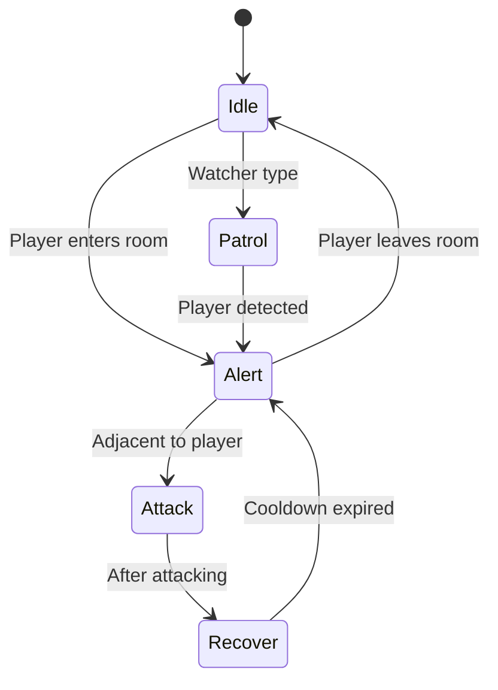
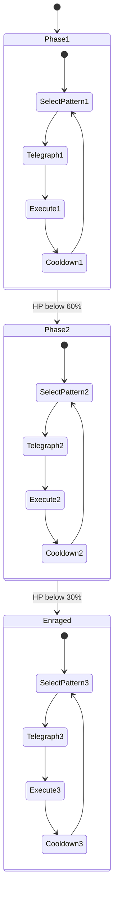
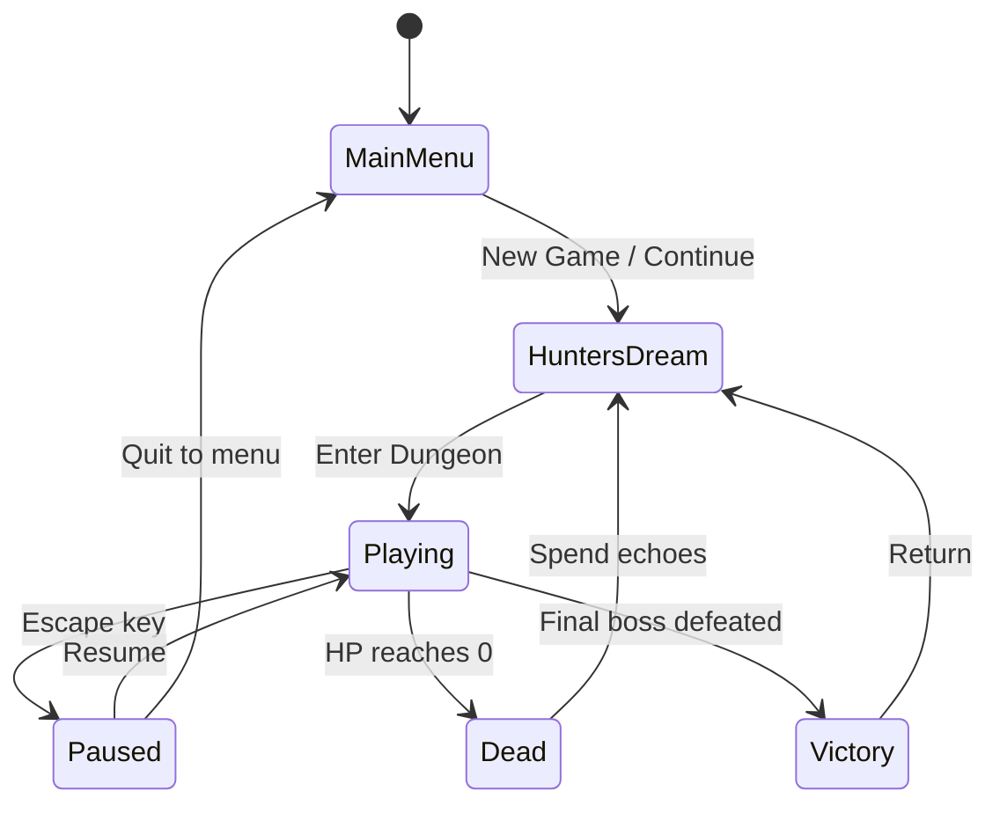

# The Chalice — Reference Guide

> Companion reference for the progressive Rust roguelike course. Keep this open while you build.

---

## 1 - Rust Cheat Sheet

### Ownership, Borrowing, and Lifetimes

Rust's ownership system prevents data races and use-after-free at compile time. Every value has exactly one owner; when the owner goes out of scope, the value is dropped.

**Ownership transfer (move)**

```rust
let weapon = String::from("Saw Cleaver");
let equipped = weapon; // weapon is MOVED — can't use `weapon` anymore
```

**Borrowing — immutable (`&T`)**

Multiple readers, no writers. Use this to read the dungeon grid without taking ownership:

```rust
fn count_enemies(grid: &Vec<Vec<Tile>>) -> usize {
    grid.iter().flatten().filter(|t| t.has_enemy()).count()
}
```

**Borrowing — mutable (`&mut T`)**

One writer, no other readers. Use this to place a tile:

```rust
fn place_tile(grid: &mut Vec<Vec<Tile>>, x: usize, y: usize, tile: Tile) {
    grid[y][x] = tile;
}
```

**The borrow checker rule**: you can have *either* one `&mut` *or* any number of `&` — never both at the same time.

**Lifetimes**

Lifetimes tell the compiler how long a reference is valid. Most of the time, Rust infers them. You need explicit lifetimes when returning references:

```rust
// The returned reference lives as long as `enemies`
fn strongest_enemy<'a>(enemies: &'a [Enemy]) -> &'a Enemy {
    enemies.iter().max_by_key(|e| e.hp).unwrap()
}
```

In The Chalice, you'll rarely need explicit lifetimes — most data is owned by structs. When you do hit lifetime issues, it usually means you should clone or restructure ownership.

### Enums and Pattern Matching

Enums are the backbone of The Chalice. Tiles, AI states, boss phases, items — all enums.

**Defining enums with data**

```rust
enum Tile {
    Wall,
    Floor,
    Door { locked: bool },
    Trap { trap_type: TrapType, triggered: bool },
    Loot { item: Item, looted: bool },
    StairsDown,
    StairsUp,
    BossDoor { defeated: bool },
    ChallengeDoor { locked: bool },
    Altar,
    Fog,
}
```

**Pattern matching with `match`**

```rust
fn tile_char(tile: &Tile) -> char {
    match tile {
        Tile::Wall => '█',
        Tile::Floor => '·',
        Tile::Door { locked: true } => '▪',
        Tile::Door { locked: false } => '+',
        Tile::StairsDown => '>',
        Tile::StairsUp => '<',
        Tile::Trap { triggered: true, .. } => '^',
        Tile::Trap { .. } => '·', // hidden trap looks like floor
        Tile::Loot { looted: false, .. } => '?',
        Tile::Loot { looted: true, .. } => '·',
        Tile::BossDoor { .. } => '☠',
        Tile::ChallengeDoor { .. } => '◆',
        Tile::Altar => '†',
        Tile::Fog => ' ',
    }
}
```

**`if let` for single-variant checks**

```rust
if let Tile::Trap { triggered: false, trap_type } = &grid[y][x] {
    trigger_trap(trap_type, hunter);
}
```

### Structs, impl Blocks, and Traits

**Structs** hold your game data:

```rust
struct Hunter {
    name: String,
    hp: i16,
    max_hp: i16,
    stamina: u8,
    weapon: Weapon,
    position: (usize, usize),
}
```

**impl blocks** attach behavior:

```rust
impl Hunter {
    fn new(name: String) -> Self {
        Self { name, hp: 100, max_hp: 100, stamina: 100, weapon: Weapon::SawCleaver, position: (0, 0) }
    }

    fn is_alive(&self) -> bool {
        self.hp > 0
    }

    fn take_damage(&mut self, amount: i16) {
        self.hp = (self.hp - amount).max(0);
    }
}
```

**Traits** define shared behavior:

```rust
trait Renderable {
    fn glyph(&self) -> char;
    fn style(&self) -> Style;
}

impl Renderable for Hunter {
    fn glyph(&self) -> char { '@' }
    fn style(&self) -> Style { Style::new().fg(Color::Cyan).add_modifier(Modifier::BOLD) }
}
```

### Error Handling

| Approach | When to use |
|----------|-------------|
| `unwrap()` | Prototyping only — panics on `None`/`Err` |
| `expect("msg")` | When failure is a bug — panics with context |
| `?` operator | Propagate errors up the call stack |
| `match` | When you need to handle each case differently |

**`Option<T>`** — a value that might not exist:

```rust
fn find_enemy_at(enemies: &[Enemy], x: usize, y: usize) -> Option<&Enemy> {
    enemies.iter().find(|e| e.position == (x, y))
}

// Using it:
if let Some(enemy) = find_enemy_at(&enemies, 5, 3) {
    attack(hunter, enemy);
}
```

**`Result<T, E>`** — an operation that might fail:

```rust
fn load_save(path: &str) -> Result<SaveData, std::io::Error> {
    let data = std::fs::read_to_string(path)?;
    let save: SaveData = serde_json::from_str(&data)?;
    Ok(save)
}
```

### Collections

**`Vec<T>`** — ordered, growable array. Your default collection.

```rust
let mut enemies: Vec<Enemy> = Vec::new();
enemies.push(Enemy::new(EnemyType::Husk, 10, 5));
enemies.retain(|e| e.hp > 0); // remove dead enemies
```

**`HashMap<K, V>`** — key-value lookup. Use for fast position-based queries:

```rust
use std::collections::HashMap;

let mut enemy_positions: HashMap<(usize, usize), usize> = HashMap::new();
for (i, enemy) in enemies.iter().enumerate() {
    enemy_positions.insert(enemy.position, i);
}

// O(1) lookup: is there an enemy at (5, 3)?
if let Some(&idx) = enemy_positions.get(&(5, 3)) {
    attack(hunter, &mut enemies[idx]);
}
```

**When to use which:**

| Need | Use |
|------|-----|
| Ordered list of things | `Vec<T>` |
| Fast lookup by key | `HashMap<K, V>` |
| Unique set of values | `HashSet<T>` |
| FIFO queue (BFS) | `VecDeque<T>` |
| Sorted data with fast insert | `BTreeMap<K, V>` |

### Iterators and Closures

Iterators are how you process collections in Rust. They're lazy (nothing happens until consumed) and often compile to the same code as hand-written loops.

```rust
// Filter living enemies in the current room
let threats: Vec<&Enemy> = enemies.iter()
    .filter(|e| e.hp > 0 && e.room_id == current_room)
    .collect();

// Map tiles to display characters
let row_chars: String = grid[y].iter()
    .map(|tile| tile_char(tile))
    .collect();

// Sum total enemy HP
let total_hp: i16 = enemies.iter().map(|e| e.hp).sum();

// Find first unlocked door
let door = grid.iter().flatten().find(|t| matches!(t, Tile::Door { locked: false }));
```

**Common iterator methods:**

| Method | Purpose |
|--------|---------|
| `.filter(predicate)` | Keep items matching condition |
| `.map(transform)` | Transform each item |
| `.find(predicate)` | First item matching condition |
| `.any(predicate)` | True if any item matches |
| `.all(predicate)` | True if all items match |
| `.enumerate()` | Yields `(index, item)` pairs |
| `.flatten()` | Flatten nested iterators (2D grid to 1D) |
| `.collect()` | Consume into a collection |
| `.sum()` | Sum numeric items |
| `.min_by_key()` / `.max_by_key()` | Find extremes |
| `.for_each(action)` | Side effects on each item |

### Common Borrow Checker Fights

**Problem: mutating a collection while iterating**

```rust
// WON'T COMPILE — can't borrow `enemies` as mutable while iterating
for enemy in &enemies {
    if enemy.hp <= 0 {
        enemies.remove(enemy.id); // ERROR
    }
}

// SOLUTION: collect indices first, then mutate
let dead: Vec<usize> = enemies.iter()
    .enumerate()
    .filter(|(_, e)| e.hp <= 0)
    .map(|(i, _)| i)
    .collect();
for i in dead.into_iter().rev() {
    enemies.swap_remove(i);
}

// OR: use retain
enemies.retain(|e| e.hp > 0);
```

**Problem: splitting borrows on a struct**

```rust
// WON'T COMPILE — two mutable borrows of `game`
fn update(game: &mut Game) {
    let hunter = &mut game.hunter;  // borrows game
    let grid = &mut game.grid;      // borrows game AGAIN — error
    move_hunter(hunter, grid);
}

// SOLUTION: destructure to split the borrow
fn update(game: &mut Game) {
    let Game { hunter, grid, .. } = game;
    move_hunter(hunter, grid); // separate borrows — OK
}
```

**Problem: returning a reference to local data**

```rust
// WON'T COMPILE — `result` is dropped at end of function
fn make_greeting() -> &str {
    let result = format!("Hello, Hunter");
    &result // ERROR: dangling reference
}

// SOLUTION: return owned data
fn make_greeting() -> String {
    format!("Hello, Hunter")
}
```

**Interior mutability** — when you need shared mutable access:

```rust
use std::cell::RefCell;

// Multiple parts of the game can read/write the log
let game_log: RefCell<Vec<String>> = RefCell::new(Vec::new());
game_log.borrow_mut().push("You entered the crypt.".into());
let last = game_log.borrow().last().cloned();
```

Use `RefCell` sparingly — it moves borrow checks to runtime (panics on violation). Prefer restructuring ownership first.

---

## 2 - Procedural Generation Glossary

### Binary Space Partitioning (BSP)

BSP is the core dungeon generation algorithm in The Chalice. It recursively subdivides a rectangle into smaller regions, then places rooms inside each leaf node.

**Algorithm steps:**

1. Start with the full floor rectangle (e.g. 60x40 for floor 3)
2. Pick a split direction (horizontal or vertical, alternating or random)
3. Pick a split position (random, but ensuring both halves are at least `MIN_ROOM_SIZE`)
4. Recurse on both halves until max depth (5) or minimum size reached
5. Each leaf node gets a room (from the prefab library or a plain rectangle)
6. Connect sibling rooms with L-shaped corridors walking up the tree
7. Add 1-2 loop corridors between distant non-sibling leaves
8. Place the boss room at the leaf with maximum BFS distance from spawn

```mermaid
graph TD
    A["Full Floor 60x40"] --> B["Left Half 30x40"]
    A --> C["Right Half 30x40"]
    B --> D["Top-Left 30x20"]
    B --> E["Bottom-Left 30x20"]
    C --> F["Top-Right 30x20"]
    C --> G["Bottom-Right 30x20"]
    D --> H["Room: Hall"]
    E --> I["Room: Crypt"]
    F --> J["Room: Pillared Hall"]
    G --> K["Room: Arena - Boss"]

    style A fill:#4a4a6a,stroke:#8888aa
    style H fill:#2a5a2a,stroke:#4a8a4a
    style I fill:#2a5a2a,stroke:#4a8a4a
    style J fill:#2a5a2a,stroke:#4a8a4a
    style K fill:#6a2a2a,stroke:#aa4a4a
```



**Why BSP works for roguelikes:**
- Guarantees no overlapping rooms
- Natural tree structure makes corridor connectivity easy
- Controllable room count via split depth
- Deterministic with a seeded RNG — same seed, same dungeon

**Pseudocode:**

```
fn bsp_split(rect, depth, rng) -> BSPNode:
    if depth == 0 or rect too small:
        return Leaf(place_room(rect, rng))

    if rect.width > rect.height:
        split_x = rng.gen_range(min..max)
        left = Rect(rect.x, rect.y, split_x, rect.h)
        right = Rect(rect.x + split_x, rect.y, rect.w - split_x, rect.h)
    else:
        split_y = rng.gen_range(min..max)
        top = Rect(rect.x, rect.y, rect.w, split_y)
        bottom = Rect(rect.x, rect.y + split_y, rect.w, rect.h - split_y)

    return Node(bsp_split(left, depth-1), bsp_split(right, depth-1))
```

### Cellular Automata (Stretch Goal)

Used for organic cave generation. Start with random noise, then apply rules iteratively:

1. Fill grid randomly — each cell has ~45% chance of being a wall
2. For each cell, count wall neighbors in a 3x3 area
3. If wall neighbors >= 5, cell becomes wall; otherwise floor
4. Repeat 4-5 iterations

The result is smooth, organic cave shapes. Useful for natural-looking areas between structured BSP rooms.

### Perlin/Simplex Noise

Coherent noise functions that produce smooth, natural-looking random values. Unlike pure random noise, adjacent points have similar values, creating gradients.

**Uses in roguelikes:**
- Terrain height variation (floor tile tinting)
- Enemy density maps (cluster enemies in "hot" zones)
- Loot quality distribution across the floor
- Ambient atmosphere variation (creepier areas at high insight)

Not used directly in The Chalice's core generation, but valuable for stretch goals and polish.

### Seeded RNG

All randomness in The Chalice flows through a single seeded RNG: `ChaCha8Rng` from the `rand_chacha` crate.

**Why it matters:**
- **Reproducibility** — same seed = same dungeon, every time
- **Shareability** — "Try seed `old-yharnam`" becomes meaningful
- **Debugging** — reproduce exact bug conditions
- **Fairness** — daily challenge seeds ensure everyone plays the same dungeon

**How it works in code:**

```rust
use rand::SeedableRng;
use rand_chacha::ChaCha8Rng;
use std::hash::{Hash, Hasher};
use std::collections::hash_map::DefaultHasher;

fn rng_from_seed(seed_str: &str) -> ChaCha8Rng {
    let mut hasher = DefaultHasher::new();
    seed_str.hash(&mut hasher);
    let hash = hasher.finish();
    // Expand u64 hash into [u8; 32] seed
    let mut seed = [0u8; 32];
    seed[..8].copy_from_slice(&hash.to_le_bytes());
    ChaCha8Rng::from_seed(seed)
}
```

**Critical rule:** never mix in non-deterministic sources (system time, thread IDs) once the seeded RNG is created. Every random decision must flow through the same `ChaCha8Rng` instance in the same order.

### Room Prefabs

Instead of always generating plain rectangles, The Chalice stamps rooms from a prefab library. Each prefab defines shape, obstacles, and valid spawn points.

| Prefab | Shape | Feature | Best For |
|--------|-------|---------|----------|
| Hall | Rectangle | None | Generic rooms |
| Pillared Hall | Rectangle | 2-4 pillars (block LoS) | Ranged encounters |
| L-Shape | L-bend | Blind corner | Ambush rooms |
| Arena | Circular | Open center | Boss rooms |
| Crypt | Narrow rectangle | Wall alcoves | Trap-heavy rooms |
| Cathedral | Large rectangle | Central altar, platform | Insight altars, loot |

**Selection rules:**
- Boss rooms always use Arena or Cathedral
- Prefab chosen by seeded RNG from those that fit the partition dimensions
- Falls back to plain rectangle if no prefab fits

**Implementation approach:** prefabs are 2D `char` arrays or tile templates that get stamped into the grid, then rotated/mirrored based on the RNG.

### Wave Function Collapse (Advanced Context)

WFC is a constraint-based generation technique inspired by quantum mechanics. Each cell starts in a superposition of all possible tiles. Observing (collapsing) one cell propagates constraints to neighbors, reducing their possibilities.

**How it differs from BSP:**
- BSP is top-down (divide space, then fill)
- WFC is bottom-up (fill cells one at a time based on neighbor constraints)
- WFC produces more organic, interconnected layouts
- WFC is significantly more complex to implement

Not used in The Chalice's core curriculum, but mentioned as a stretch goal for advanced learners.

---

## 3 - State Machine Patterns

### Enemy AI State Machine

Every enemy in The Chalice runs a simple state machine each turn:



**States and behavior:**

| State | Behavior | Transition |
|-------|----------|------------|
| Idle | Standing still | Player enters room → Alert |
| Patrol | Move between waypoints (Watchers only) | Player detected → Alert |
| Alert | Move toward player (BFS or A*) | Adjacent → Attack |
| Attack | Deal damage to player | Always → Recover |
| Recover | 1-turn cooldown (player's dodge window) | Cooldown done → Alert |

**Rust implementation:**

```rust
enum AiState {
    Idle,
    Patrol { waypoints: Vec<(usize, usize)>, current: usize },
    Alert { target: (usize, usize) },
    Attack,
    Recover { turns_left: u8 },
}

impl Enemy {
    fn update_ai(&mut self, player_pos: (usize, usize), room_visible: bool) {
        self.ai_state = match &self.ai_state {
            AiState::Idle if room_visible => AiState::Alert { target: player_pos },
            AiState::Patrol { waypoints, current } if room_visible => {
                AiState::Alert { target: player_pos }
            }
            AiState::Patrol { waypoints, current } => {
                let next = (*current + 1) % waypoints.len();
                self.position = waypoints[next];
                AiState::Patrol { waypoints: waypoints.clone(), current: next }
            }
            AiState::Alert { .. } if self.adjacent_to(player_pos) => AiState::Attack,
            AiState::Alert { .. } => {
                self.move_toward(player_pos);
                AiState::Alert { target: player_pos }
            }
            AiState::Attack => AiState::Recover { turns_left: 1 },
            AiState::Recover { turns_left } if *turns_left == 0 => {
                AiState::Alert { target: player_pos }
            }
            AiState::Recover { turns_left } => {
                AiState::Recover { turns_left: turns_left - 1 }
            }
            other => other.clone(),
        };
    }
}
```

### Boss Phase State Machine

Bosses have three phases with escalating difficulty:



**Phase transitions:**

| Phase | Trigger | Changes |
|-------|---------|---------|
| Phase 1 | Fight start | Normal patterns, predictable |
| Phase 2 | HP < 60% | New attack, faster, undodgeable AoE added |
| Phase 3 (Enraged) | HP < 30% | +50% damage, dodge costs 25 stamina, stamina-drain AoE |

```rust
enum BossPhase {
    Phase1,
    Phase2,
    Enraged,
}

impl Boss {
    fn check_phase_transition(&mut self) -> Option<String> {
        let hp_pct = (self.hp as f32 / self.max_hp as f32) * 100.0;
        let new_phase = match (&self.phase, hp_pct) {
            (BossPhase::Phase1, pct) if pct < 60.0 => Some(BossPhase::Phase2),
            (BossPhase::Phase2, pct) if pct < 30.0 => Some(BossPhase::Enraged),
            _ => None,
        };
        if let Some(phase) = new_phase {
            self.phase = phase;
            Some(format!("{} shrieks. Something is changing...", self.name))
        } else {
            None
        }
    }
}
```

### Game State Machine

The top-level game flow:



```rust
enum GameState {
    MainMenu,
    HuntersDream,
    Playing {
        floor: u8,
        dungeon: Dungeon,
        hunter: Hunter,
    },
    Paused {
        floor: u8,
        dungeon: Dungeon,
        hunter: Hunter,
    },
    Dead {
        cause: String,
        echoes_lost: u32,
    },
    Victory {
        final_echoes: u32,
        floors_cleared: u8,
    },
}
```

### Why Rust Enums Beat OOP Inheritance for State Machines

In OOP languages, state machines often use the State pattern — an interface with a class per state. This has problems:

- **Scattered logic** — each state is a separate file/class
- **Forgotten states** — adding a new state doesn't force you to handle it everywhere
- **Runtime errors** — invalid state transitions are caught at runtime, not compile time

Rust enums solve all three:

- **Exhaustive matching** — `match` forces you to handle every variant. Add a new `AiState`? The compiler tells you every place that needs updating.
- **Data per variant** — each state carries exactly the data it needs. `Patrol` has waypoints; `Alert` has a target; `Idle` has nothing.
- **Zero-cost** — enums are stack-allocated tagged unions. No heap allocation, no vtable dispatch.
- **Single location** — the `match` block is the complete state transition table, readable in one place.

```rust
// Adding a new state forces handling everywhere it's matched:
enum AiState {
    Idle,
    Patrol { waypoints: Vec<(usize, usize)>, current: usize },
    Alert { target: (usize, usize) },
    Attack,
    Recover { turns_left: u8 },
    Fleeing { exit: (usize, usize) }, // NEW — compiler errors until handled
}
```

---

## 4 - Roguelike Design Principles

### Procedural Generation Philosophy

Procedural generation isn't random — it's *authored randomness*. The designer creates the rules, constraints, and building blocks; the algorithm assembles them into unique configurations.

**Good procedural generation:**
- Creates variety within a consistent design language
- Ensures structural validity (all rooms reachable, boss always accessible)
- Rewards system mastery over memorization
- Makes each run feel fresh while maintaining fairness

**The Chalice's approach:**
- BSP guarantees connected, non-overlapping rooms
- Prefabs inject hand-designed quality into random layouts
- Seeded RNG makes runs reproducible and shareable
- Floor scaling tables ensure difficulty progression is controlled

### Permadeath and Meaningful Death

Permadeath is the defining feature of roguelikes. It makes every decision consequential.

**Why permadeath works:**
- Raises stakes — you can't save-scum through a boss
- Creates stories — "I almost beat floor 4 but got greedy with a cursed chest"
- Rewards learning — knowledge persists even when characters don't
- Keeps runs short — 30-60 minutes, not 40 hours

**Making death meaningful in The Chalice:**
- **Echoes recovery** — your currency is left where you died. Reach it next run to recover. Die again and it's gone forever. This creates a risk/reward loop within the meta-game.
- **Hunter's Journal** — records enemy patterns and boss telegraphs across runs. Death teaches you something concrete.
- **Hunter's Dream upgrades** — lifetime echoes buy permanent stat upgrades. Every run contributes to long-term progression.
- **Insight as knowledge** — literally. Higher insight reveals more about the dungeon. Death costs 10 insight — you lose awareness.

### Risk/Reward Loops

The Chalice layers multiple risk/reward decisions:

**Insight spending:**
- Hoard insight for harder-but-weirder dungeons with better loot (81-100 insight = 3x Blood Gem drops)
- Or spend it at altars for immediate power (reveal map, upgrade weapon, skip floor)
- Sedatives let you voluntarily reduce insight if the dungeon gets too dangerous

**Cursed chests:**
- See the item before opening
- Opening inflicts double damage taken for 3 rooms
- Is that Blood Gem worth the curse on a boss floor?

**Challenge rooms:**
- Spend a Chalice Key or 10 insight to enter
- Enemies are 1 tier above current floor
- Guaranteed rare or very rare item drop
- Worth the resource cost and harder fight?

**Rally mechanic:**
- After taking damage, attack back within 2 turns to recover HP
- Rewards aggression over defensive play
- Creates moment-to-moment risk: do I dodge away or attack back?

**Stamina economy:**
- Standing still is the only way to regen stamina
- Every action (attack, dodge, item) costs stamina
- Running out means exhaustion (1 turn vulnerable)
- When do you rest vs. press the attack?

### Build Variety

A great roguelike makes each run feel different through build identity. The Chalice achieves this through three interlocking systems:

**Weapons** define your base playstyle:
- Saw Cleaver: reliable all-rounder, anti-beast
- Blade of Mercy: double-hit rally machine, glass cannon
- Threaded Cane: safe poke weapon, avoids adjacency attacks
- Kirkhammer: boss-pattern interrupter, high stagger
- Hunter Axe: knockback control, best stagger
- Ludwig's Holy Blade: balanced, stamina-efficient

**Blood Gems** modify your weapon permanently (max 2):
- Tempering + Fire = anti-beast specialist
- Bloodtinge + Rally gem = low-HP berserker
- Stamina + Tempering = sustained DPS machine
- Cursed Nourishing = high risk, high reward

**Runes** add passive modifiers (equip 3):
- Clawmark + Beast + Blade of Mercy = glass cannon rally build
- Lake + Communion + Threaded Cane = safe sustain build
- Oedon Writhe + Heir + any weapon = echo farming build

The combinatorial space means no two runs play the same way, even on the same seed.

### Information Asymmetry

Roguelikes thrive on incomplete information. The player must make decisions without full knowledge.

**Fog of war:**
- Rooms start as `Fog` tiles — you don't know the layout until you explore
- Corridors reveal only 3 tiles ahead
- Minimap shows discovered rooms as rectangles, unexplored as `?`

**Trap visibility:**
- Traps look like floor tiles unless you have enough insight
- Spike pits have a subtle visual tell (different floor character)
- Finding a trap without triggering it grants +2 insight

**Insight-gated knowledge:**
- 0-20 insight: normal dungeon, no special awareness
- 21-40: creepier text, rare enemy variants appear
- 41-60: trap density +50%, Madmen enemies appear
- 61-80: walls shift between visits, whisper text
- 81-100: two bosses per room, 3x loot quality, the dungeon "watches you"

**Mimics:**
- Disguised as loot tiles
- Reveal when player is adjacent
- Attack twice on reveal, then fight normally
- Subtle animation tell if you watch carefully

The player is always making decisions with partial information, and gaining more information (insight) comes with its own risks.

---

## 5 - ratatui Widget Reference

> Based on ratatui 0.30.0 and crossterm 0.29.0 — verified from docs.rs.

### Terminal Setup

```rust
use ratatui;
use crossterm::event::{self, Event, KeyCode, KeyEvent, KeyEventKind};

fn main() -> std::io::Result<()> {
    // ratatui::run handles init, restore, and panic hooks automatically
    ratatui::run(|mut terminal| {
        loop {
            terminal.draw(|frame| render(frame))?;
            if let Event::Key(key) = event::read()? {
                if key.kind == KeyEventKind::Press && key.code == KeyCode::Char('q') {
                    break Ok(());
                }
            }
        }
    })
}

// For more control, use init/restore:
fn main_manual() -> std::io::Result<()> {
    let mut terminal = ratatui::init();
    let result = run_app(&mut terminal);
    ratatui::restore();
    result
}
```

### Layout System

The layout engine divides screen space using constraints. Coordinate system: origin `(0, 0)` at top-left, x increases right, y increases down.

**`Layout`** — the primary layout engine:

```rust
use ratatui::layout::{Constraint, Layout, Rect};

// Vertical split: header, game viewport, HUD
let [header, viewport, hud] = Layout::vertical([
    Constraint::Length(1),    // 1 row for title
    Constraint::Fill(1),      // remaining space for game
    Constraint::Length(4),    // 4 rows for HUD
]).areas(frame.area());

// Horizontal split within viewport: sidebar + game
let [sidebar, game_area] = Layout::horizontal([
    Constraint::Length(20),   // fixed sidebar
    Constraint::Fill(1),      // remaining for game grid
]).areas(viewport);
```

**`Constraint` variants** (priority order, highest first):

| Variant | Meaning |
|---------|---------|
| `Constraint::Min(n)` | At least `n` cells (highest priority) |
| `Constraint::Max(n)` | At most `n` cells |
| `Constraint::Length(n)` | Exactly `n` cells |
| `Constraint::Percentage(p)` | `p`% of available space |
| `Constraint::Ratio(num, den)` | Fraction of available space |
| `Constraint::Fill(weight)` | Fill remaining space proportionally (lowest priority) |

**`Rect`** — a rectangular area:

```rust
let area = Rect::new(x, y, width, height);
// Fields: area.x, area.y, area.width, area.height
// Methods: area.inner(Margin::new(h, v)), area.rows(), area.columns()
```

**`Flex`** — controls extra space distribution:

| Variant | Behavior |
|---------|----------|
| `Flex::Start` | Content at start, excess at end |
| `Flex::End` | Content at end, excess at start |
| `Flex::Center` | Content centered, excess split |
| `Flex::SpaceBetween` | Excess distributed between elements |
| `Flex::SpaceAround` | Excess distributed around elements |
| `Flex::SpaceEvenly` | Equal spacing everywhere |
| `Flex::Legacy` | Excess goes to last element |

### Styling

```rust
use ratatui::style::{Color, Modifier, Style, Stylize};

// Struct-based styling
let style = Style::new()
    .fg(Color::Red)
    .bg(Color::Black)
    .add_modifier(Modifier::BOLD | Modifier::ITALIC);

// Shorthand styling (via Stylize trait)
let span = "Critical Hit!".red().on_black().bold();
let paragraph = Paragraph::new("Game Over").white().on_red();
```

**`Color` variants:**

| Color | Usage in The Chalice |
|-------|---------------------|
| `Color::Red` | Enemy damage, low HP, danger |
| `Color::Green` | Healing, poison clouds |
| `Color::Yellow` | Loot, gold, echoes |
| `Color::Cyan` | Player character `@` |
| `Color::Magenta` | Boss encounters, insight effects |
| `Color::White` | Default text, walls |
| `Color::DarkGray` | Fog, unexplored areas |
| `Color::Rgb(r, g, b)` | Custom colors (256-color terminals) |
| `Color::Indexed(n)` | 256-color palette index |

**`Modifier` flags** (combine with `|`):

| Modifier | Use |
|----------|-----|
| `Modifier::BOLD` | Player character, boss names, headings |
| `Modifier::DIM` | Fog of war, disabled options |
| `Modifier::ITALIC` | Flavor text, boss phase transitions |
| `Modifier::UNDERLINED` | Selected menu items |
| `Modifier::REVERSED` | Highlighted/selected items |
| `Modifier::CROSSED_OUT` | Dead enemies in log |

### Core Widgets

**`Block`** — borders and titles around content:

```rust
use ratatui::widgets::{Block, Borders, BorderType, Padding};

let block = Block::bordered()
    .title(" The Chalice ")
    .title_bottom(" Floor 2 ")
    .border_type(BorderType::Double)
    .padding(Padding::new(1, 1, 0, 0));

// Render a widget inside a block:
let inner_area = block.inner(area); // get area inside borders
frame.render_widget(block, area);
frame.render_widget(my_widget, inner_area);
```

**`Paragraph`** — text display with wrapping:

```rust
use ratatui::widgets::{Paragraph, Wrap};
use ratatui::text::{Line, Span};

// Simple text
let p = Paragraph::new("You enter the crypt. The air is thick with dread.");

// Styled multi-line text
let lines = vec![
    Line::from(vec![
        Span::raw("HP: "),
        Span::styled("74/100", Style::new().fg(Color::Green).bold()),
    ]),
    Line::from(vec![
        Span::raw("Weapon: "),
        Span::styled("Saw Cleaver", Style::new().fg(Color::Yellow)),
    ]),
];
let p = Paragraph::new(lines).wrap(Wrap { trim: true });
```

**`Gauge`** — progress bars (HP, stamina, rally):

```rust
use ratatui::widgets::Gauge;

let hp_pct = (hunter.hp as f64 / hunter.max_hp as f64) * 100.0;
let hp_color = match hp_pct as u16 {
    0..=25 => Color::Red,
    26..=50 => Color::Yellow,
    _ => Color::Green,
};

let hp_bar = Gauge::default()
    .gauge_style(Style::new().fg(hp_color).bg(Color::DarkGray))
    .percent(hp_pct as u16)
    .label(format!("{}/{}", hunter.hp, hunter.max_hp));
```

**`List`** — scrollable item lists (inventory, journal):

```rust
use ratatui::widgets::{List, ListItem, ListState};

let items: Vec<ListItem> = hunter.items.iter()
    .map(|item| ListItem::new(format!("{} ({})", item.name, item.rarity)))
    .collect();

let list = List::new(items)
    .block(Block::bordered().title(" Inventory "))
    .highlight_style(Style::new().reversed())
    .highlight_symbol(">> ");

let mut state = ListState::default();
state.select(Some(selected_index));
frame.render_stateful_widget(list, area, &mut state);
```

**`Table`** — data grids (enemy stats, leaderboards):

```rust
use ratatui::widgets::{Table, Row, Cell};

let header = Row::new(vec!["Enemy", "HP", "Damage", "Weakness"])
    .style(Style::new().bold())
    .bottom_margin(1);

let rows = enemies.iter().map(|e| {
    Row::new(vec![
        Cell::from(e.name.clone()),
        Cell::from(format!("{}", e.hp)),
        Cell::from(format!("{}", e.damage)),
        Cell::from(e.weakness.clone()),
    ])
});

let table = Table::new(rows, [
    Constraint::Length(20),
    Constraint::Length(6),
    Constraint::Length(8),
    Constraint::Fill(1),
])
.header(header)
.block(Block::bordered().title(" Bestiary "));
```

### Custom Game Viewport Widget

For the dungeon grid, implement `Widget` directly:

```rust
use ratatui::buffer::Buffer;
use ratatui::layout::Rect;
use ratatui::widgets::Widget;

struct GameViewport<'a> {
    grid: &'a Vec<Vec<Tile>>,
    enemies: &'a [Enemy],
    hunter_pos: (usize, usize),
    camera_offset: (usize, usize),
}

impl Widget for &GameViewport<'_> {
    fn render(self, area: Rect, buf: &mut Buffer) {
        let (cam_x, cam_y) = self.camera_offset;

        for dy in 0..area.height as usize {
            for dx in 0..area.width as usize {
                let (gx, gy) = (cam_x + dx, cam_y + dy);

                // Bounds check
                if gy >= self.grid.len() || gx >= self.grid[0].len() {
                    continue;
                }

                let (ch, style) = if (gx, gy) == self.hunter_pos {
                    ('@', Style::new().fg(Color::Cyan).bold())
                } else if let Some(enemy) = self.enemies.iter()
                    .find(|e| e.position == (gx, gy) && e.hp > 0)
                {
                    (enemy.glyph(), Style::new().fg(Color::Red))
                } else {
                    let tile = &self.grid[gy][gx];
                    (tile_char(tile), tile_style(tile))
                };

                let x = area.x + dx as u16;
                let y = area.y + dy as u16;
                buf[(x, y)].set_char(ch).set_style(style);
            }
        }
    }
}
```

### Event Handling (crossterm 0.29.0)

```rust
use crossterm::event::{self, Event, KeyCode, KeyEvent, KeyEventKind};

fn handle_input() -> std::io::Result<Option<PlayerAction>> {
    if event::poll(std::time::Duration::from_millis(100))? {
        if let Event::Key(KeyEvent { code, kind: KeyEventKind::Press, .. }) = event::read()? {
            return Ok(match code {
                // Movement
                KeyCode::Up | KeyCode::Char('k') => Some(PlayerAction::Move(Direction::Up)),
                KeyCode::Down | KeyCode::Char('j') => Some(PlayerAction::Move(Direction::Down)),
                KeyCode::Left | KeyCode::Char('h') => Some(PlayerAction::Move(Direction::Left)),
                KeyCode::Right | KeyCode::Char('l') => Some(PlayerAction::Move(Direction::Right)),
                // Actions
                KeyCode::Char('a') => Some(PlayerAction::LightAttack),
                KeyCode::Char('H') => Some(PlayerAction::HeavyAttack),
                KeyCode::Char('d') => Some(PlayerAction::Dodge),
                KeyCode::Char('v') => Some(PlayerAction::UseVial),
                KeyCode::Char('i') => Some(PlayerAction::OpenInventory),
                KeyCode::Char('m') => Some(PlayerAction::OpenMap),
                KeyCode::Char('q') => Some(PlayerAction::Quit),
                KeyCode::Esc => Some(PlayerAction::Pause),
                _ => None,
            });
        }
    }
    Ok(None)
}
```

---

## 6 - Combat Math Breakdown

### Damage Formulas

**Light attack:**

```
damage = weapon_base_damage + gem_bonus
if attacking_from_behind: damage *= 1.5  (backstab)
if target_weakness == weapon_element: damage *= 1.5
```

**Heavy attack:**

```
damage = (weapon_base_damage * 2) + gem_bonus
if attacking_from_behind: damage *= 1.5  (backstab)
if target_weakness == weapon_element: damage *= 1.5
effect: target is STAGGERED (skips next turn)
```

**Backstab bonus:** +50% damage when attacking from behind the target. Applies to both light and heavy attacks. Moving behind an enemy sets up the backstab position.

**Elemental bonus:** +50% damage when the weapon's element matches the target's weakness. Fire Paper adds fire element for 5 turns.

**Blade of Mercy special:** attacks twice per turn. Each hit applies the full formula independently. Both hits can trigger rally.

**Example calculations:**

| Scenario | Weapon | Base | Gems | Position | Weakness | Total |
|----------|--------|------|------|----------|----------|-------|
| Light vs Husk | Saw Cleaver | 12 | +5 Tempering | Front | Beast (+50%) | (12+5) * 1.5 = 25 |
| Heavy vs Husk | Saw Cleaver | 12 | +5 Tempering | Behind | Beast (+50%) | (12*2+5) * 1.5 * 1.5 = 65 |
| Light vs Brute (front) | Hunter Axe | 18 | None | Front | Backstab | 18 * 0.5 (shield) = 9 |
| Light vs Brute (behind) | Hunter Axe | 18 | None | Behind | Backstab (+100%) | 18 * 2.0 = 36 |
| Double hit vs Beast | Blade of Mercy | 7 | +5 Tempering | Front | Fire (no match) | (7+5) * 2 hits = 24 |

### Rally Recovery Calculation

When the hunter takes damage, a rally window opens for 2 turns. During this window, 30% of damage dealt is recovered as HP, up to the amount lost.

```
rally_recovery = min(damage_dealt * 0.30, rally_hp_remaining)
rally_hp_remaining -= rally_recovery
hunter.hp += rally_recovery  (rounded up)
```

**With Clawmark rune (+20% rally):** recovery rate becomes 36% instead of 30%.

**With Rally Blood Gem (+50% recovery, 1-turn window):** recovery rate becomes 50%, but window is only 1 turn.

**Worked example:**

> Hunter has 80 HP, takes 20 damage (now 60 HP).
> `rally_hp = 20`, window = 2 turns.
>
> Turn 1: Light attack deals 12 damage.
> Recovery = ceil(12 * 0.30) = ceil(3.6) = 4 HP. Hunter now 64 HP. rally_hp remaining = 16.
>
> Turn 2: Heavy attack deals 24 damage.
> Recovery = ceil(24 * 0.30) = ceil(7.2) = 8 HP. But rally_hp remaining is 16, so full 8 applies.
> Hunter now 72 HP. rally_hp remaining = 8.
>
> Window expires. Total recovered: 12 of 20 lost.

**Blade of Mercy rally example (best rally weapon):**

> Same scenario. Blade of Mercy hits twice per turn.
> Turn 1: Hit 1 deals 7, hit 2 deals 7. Total dealt = 14.
> Recovery = ceil(14 * 0.30) = ceil(4.2) = 5 HP.
>
> Turn 2: Hit 1 deals 7, hit 2 deals 7. Total dealt = 14.
> Recovery = ceil(14 * 0.30) = ceil(4.2) = 5 HP.
>
> Total recovered: 10 of 20. Two chances per turn to trigger rally makes Blade of Mercy the most consistent rally weapon.

### Stamina Economy Analysis

**Stamina budget per "cycle":**

| Action sequence | Stamina cost | Turns | Notes |
|----------------|-------------|-------|-------|
| Light, Light, Rest | 30 + 0 = 30 net (regen 10) | 3 | Safe DPS pattern |
| Heavy, Rest, Rest | 30 + 0 = 30 net (regen 20) | 3 | Stagger + recover |
| Dodge, Light, Light, Rest | 20+15+15 = 50, regen 10 | 4 | Defensive opener |
| Light, Light, Light, Light, Rest | 60, regen 10 | 5 | Aggressive, risky |
| Dodge, Dodge | IMPOSSIBLE | - | 1-turn cooldown after dodge |

**Stamina breakpoints:**

| Stamina | Can do |
|---------|--------|
| 100 (full) | 6 light attacks or 3 heavy attacks before exhaustion |
| 50 | 3 light attacks or 1 heavy + 1 dodge |
| 30 | 1 heavy attack or 2 light attacks |
| 20 | 1 dodge only |
| 15 | 1 light attack only |
| < 15 | EXHAUSTED — vulnerable for 1 turn |

**Rune effects on stamina:**

| Rune | Effect |
|------|--------|
| Formless Oedon | +15 max stamina (115 total) |
| Oedon Writhe | +5 stamina on backstab kills |
| Stamina Blood Gem | All attacks cost -5 stamina |

**Ludwig's Holy Blade advantage:** heavy attack costs 25 stamina instead of 30. Over a long fight, this saves 1 extra heavy attack per full stamina bar.

### Boss DPS Checks

Each boss phase has an implicit DPS requirement. If you can't deal enough damage, the fight becomes unsustainable.

**Tier 1 boss (Undead Giant, ~150 HP estimated):**

| Phase | HP range | Behavior | Required DPS |
|-------|----------|----------|-------------|
| Phase 1 | 150-90 | Predictable, 1 attack/2 turns | ~10/turn comfortable |
| Phase 2 | 90-45 | Faster, AoE added | ~12/turn to keep pace |
| Enraged | 45-0 | +50% damage, stamina drain | ~15/turn or you run out of vials |

**Tier 5 boss (Yharnam, Blood Queen, ~400 HP estimated):**

| Phase | HP range | Behavior | Required DPS |
|-------|----------|----------|-------------|
| Phase 1 | 400-240 | Complex patterns, telegraphed | ~15/turn |
| Phase 2 | 240-120 | Undodgeable AoE, faster | ~20/turn |
| Enraged | 120-0 | Dodge costs 25, stamina drain | ~25/turn, vial management critical |

### Blood Gem Effect Stacking

Max 2 gems per weapon. Effects stack additively unless noted.

| Gem 1 | Gem 2 | Combined effect |
|-------|-------|----------------|
| Tempering (+5 phys) | Tempering (+5 phys) | +10 physical damage |
| Tempering (+5 phys) | Fire (fire element) | +5 phys AND fire element (beast bonus) |
| Bloodtinge (+15% < 30% HP) | Cursed Nourishing (+20% all, -15 max HP) | +35% damage below 30% HP, +20% above, -15 max HP |
| Stamina (-5 cost) | Stamina (-5 cost) | -10 stamina per attack (light = 5, heavy = 20) |
| Rally (+50%, 1-turn window) | Tempering (+5 phys) | 50% rally rate, 1-turn window, +5 damage |
| Cursed Nourishing (+20%, -15 HP) | Bloodtinge (+15% < 30% HP) | Glass cannon: huge damage at low HP, reduced max HP |

### Weapon Comparison Table

| Weapon | Base | Speed | Stamina (L/H) | Special | Effective DPS (per 3 turns) | Best With |
|--------|------|-------|---------------|---------|---------------------------|-----------|
| Saw Cleaver | 12 | Fast | 15/30 | +20% vs beasts | 24 (2 lights + rest) | Tempering + Fire |
| Hunter Axe | 18 | Slow | 15/30 | Heavy knockback 2 tiles | 18 (1 heavy + 2 rests) | Tempering + Tempering |
| Threaded Cane | 10 | Fast | 15/30 | 2-tile range, no adjacency | 20 (2 lights + rest) | Stamina + Tempering |
| Kirkhammer | 22 | V. Slow | 15/30 | Heavy stuns 2 turns, interrupts | 22 (1 heavy + 2 rests) | Cursed Nourishing |
| Blade of Mercy | 7x2 | V. Fast | 15/30 | Hits twice, best rally | 28 (2 double-lights + rest) | Rally + Clawmark rune |
| Ludwig's Holy Blade | 20 | Medium | 15/25 | Heavy costs 25 stamina | 20 (1 heavy + 1 light + rest) | Tempering + Stamina |

*Effective DPS assumes a 3-turn cycle with 1 rest turn for stamina regen. Actual DPS varies with positioning, gems, and runes.*

---

## 7 - The Chalice Quick Reference

### Tile Types

| Tile | Display | Description |
|------|---------|-------------|
| Wall | `█` | Impassable, blocks line of sight |
| Floor | `·` | Walkable |
| Door (locked) | `▪` | Requires key or interaction |
| Door (unlocked) | `+` | Walkable passage between rooms |
| Stairs Down | `>` | Descend to next floor (unlocked on boss defeat) |
| Stairs Up | `<` | Return to previous floor / entrance |
| Trap (hidden) | `·` | Looks like floor until triggered or detected |
| Trap (triggered) | `^` | Visible after triggering |
| Loot (available) | `?` | Contains an item |
| Loot (looted) | `·` | Already collected |
| Boss Door | `☠` | Entrance to boss room |
| Challenge Door | `◆` | Requires Chalice Key or 10 insight |
| Altar | `†` | Insight spending station |
| Fog | ` ` | Unexplored area |

### Enemy Types

| Enemy | Glyph | HP | Damage | Speed | Behavior | Weakness |
|-------|-------|-----|--------|-------|----------|----------|
| Husk | `H` | 20 | 8 | Slow | Shambles toward player | Fire (+50%) |
| Beast | `B` | 35 | 15 | Fast | Charges in a line, 2-tile range | Fire (+50%) |
| Snatcher | `S` | 25 | 10 | Medium | Teleports behind player | None |
| Bell Maiden | `M` | 15 | 5 | Stationary | Summons 1 Husk/turn, interruptible by heavy | Physical |
| Madman | `!` | 30 | 20 | Fast | Erratic movement, attacks twice | None |
| Watcher | `W` | 40 | 12 | Medium | Patrols, alerts all enemies if spots you | Backstab (+100%) |
| Crossbow Hollow | `X` | 20 | 12 | Stationary | Ranged 4-tile, flees if adjacent | Physical |
| Shielded Brute | `T` | 50 | 18 | Slow | Blocks frontal (50% reduction), must stagger or backstab | Backstab (+100%) |
| Mimic | `?`/`m` | 35 | 20 | Medium | Disguised as loot, attacks twice on reveal | Fire (+50%) |

**Insight-gated enemies:**
- Madman: appears at insight 41+
- Rare enemy variants: appear at insight 21+

### Boss Tiers

| Tier | Floor | Example Bosses | Estimated HP |
|------|-------|---------------|-------------|
| 1 | 1 | Undead Giant, Watchdog of the Depths | ~100-150 |
| 2 | 2 | Blood-Starved Abomination, Keeper of the Chalice | ~150-200 |
| 3 | 3 | Pthumerian Elder, Forgotten Vicar | ~200-275 |
| 4 | 4 | Amygdalan Horror, Loran Darkbeast | ~275-350 |
| 5 (Final) | 5 | Yharnam, Blood Queen of the Chalice | ~350-400 |

**Boss phase triggers:**
- Phase 1: fight start (normal patterns)
- Phase 2: HP < 60% (new attack, faster, undodgeable AoE)
- Phase 3 (Enraged): HP < 30% (+50% damage, dodge costs 25 stamina, stamina-drain AoE)

**At insight 81-100:** boss rooms contain TWO bosses.

### Items and Rarities

| Item | Effect | Rarity |
|------|--------|--------|
| Blood Vial | Heal 30 HP | Common |
| Antidote | Cure poison | Common |
| Molotov Cocktail | 25 fire damage (area), +50% vs beasts/mimics | Uncommon |
| Fire Paper | +10 damage for 5 turns | Uncommon |
| Chalice Key | Opens one Challenge Door | Uncommon |
| Sedative | Reduce insight by 10 | Uncommon |
| Bold Hunter's Mark | Teleport to floor entrance | Rare |
| Shaman Bone Blade | Turn one enemy against others for 3 turns | Rare |
| Blood Gem | Permanent weapon modifier (see below) | Very Rare |

### Weapons

| Weapon | Base Damage | Speed | Special | Unlock Cost |
|--------|------------|-------|---------|-------------|
| Saw Cleaver | 12 | Fast | +20% vs beasts | Default (free) |
| Hunter Axe | 18 | Slow | Heavy knockback 2 tiles | 1000 echoes |
| Threaded Cane | 10 | Fast | 2-tile range, avoids adjacency attacks | 1000 echoes |
| Kirkhammer | 22 | Very Slow | Heavy stuns 2 turns, interrupts boss patterns | 2500 echoes |
| Blade of Mercy | 7 | Very Fast | Attacks twice per turn, best rally weapon | 2500 echoes |
| Ludwig's Holy Blade | 20 | Medium | Heavy costs only 25 stamina | 4000 echoes |

### Runes

| Rune | Effect | Unlock Cost |
|------|--------|-------------|
| Clawmark | +20% rally recovery | 3000 echoes |
| Communion | +3 max blood vials | 3000 echoes |
| Eye | +15% item discovery | 3000 echoes |
| Lake | -15% physical damage taken | 3000 echoes |
| Oedon Writhe | +5 stamina on backstab kills | 3000 echoes |
| Heir | +50% echoes from bosses | 3000 echoes |
| Formless Oedon | +15 max stamina | 3000 echoes |
| Beast | +20% damage, +20% damage taken | 3000 echoes |
| Corruption | 10% chance enemies drop blood vial on kill | 3000 echoes |

**Equip rules:** max 3 runes, cannot swap mid-floor (commit at floor start).

### Blood Gem Types

| Gem | Effect | Tradeoff | Unlock Cost |
|-----|--------|----------|-------------|
| Tempering | +5 physical damage | None | 2000 echoes |
| Fire | Attacks deal fire damage | Lose physical bonus vs shielded | 2000 echoes |
| Bloodtinge | +15% damage when below 30% HP | None (high risk) | 2000 echoes |
| Cursed Nourishing | +20% all damage | Max HP -15 | 2000 echoes |
| Stamina | All attacks cost -5 stamina | -3 base damage | 2000 echoes |
| Rally | Rally recovery increased to 50% | Rally window reduced to 1 turn | 2000 echoes |

**Rules:** max 2 gems per weapon, consumed on use, permanent modification.

### Insight Threshold Effects

| Insight Range | Dungeon Effect | Loot Effect |
|---------------|---------------|-------------|
| 0-20 | Normal dungeon | Normal drops |
| 21-40 | Creepier ambient text, rare enemy variants | Slightly better |
| 41-60 | Trap density +50%, Madmen enemies appear | Better |
| 61-80 | Walls shift between visits, whisper text | Good |
| 81-100 | Boss rooms have TWO bosses | 3x Blood Gem drop rate, guaranteed rare per floor, exclusive insight-only items |

**Insight sources:**

| Event | Change |
|-------|--------|
| Discover a new room | +1 |
| Find trap without triggering | +2 |
| Defeat a boss | +5 |
| Die | -10 (min 0) |
| Descend a floor | -1 |

**Altar spending (1 per floor, in Cathedral rooms):**

| Cost | Effect |
|------|--------|
| 5 | Reveal all traps on current floor |
| 10 | Reveal full floor map |
| 10 | Open a Challenge Door without a key |
| 15 | Upgrade weapon damage +3 for this floor |
| 20 | Gain 2 blood vials |
| 25 | Skip current floor (descend without fighting boss) |

### Floor Scaling Table

| Floor | Grid Size | Rooms | Enemies | Traps | Boss Tier |
|-------|-----------|-------|---------|-------|-----------|
| 1 | 40x30 | 4-6 | 3-5 | 1-2 | Tier 1 |
| 2 | 50x35 | 5-8 | 5-8 | 2-4 | Tier 2 |
| 3 | 60x40 | 6-10 | 8-12 | 3-5 | Tier 3 |
| 4 | 70x45 | 8-12 | 10-15 | 4-6 | Tier 4 |
| 5 | 80x50 | 10-14 | 12-18 | 5-8 | Tier 5 (Final) |

### Hunter's Dream Upgrade Costs

**Stat Upgrades** (permanent, cumulative):

| Upgrade | Effect per Tier | Tier 1 | Tier 2 | Tier 3 | Total Cost |
|---------|----------------|--------|--------|--------|------------|
| Vitality | +5 max HP | 500 | 1500 | 4000 | 6000 |
| Endurance | +5 max stamina | 500 | 1500 | 4000 | 6000 |
| Rally | +5% rally recovery | 800 | 2000 | 5000 | 7800 |
| Vial Capacity | +1 starting blood vials | 600 | 1800 | 4500 | 6900 |

**Max stats with all upgrades:**
- HP: 100 + 15 = 115
- Stamina: 100 + 15 = 115
- Rally: 30% + 15% = 45% base recovery
- Starting vials: 5 + 3 = 8

**Weapon Unlocks** (one-time):

| Weapon | Cost |
|--------|------|
| Hunter Axe | 1000 |
| Threaded Cane | 1000 |
| Kirkhammer | 2500 |
| Blade of Mercy | 2500 |
| Ludwig's Holy Blade | 4000 |

**Loot Pool Unlocks** (one-time, item enters dungeon loot table):

| Item | Cost |
|------|------|
| Shaman Bone Blade | 1500 |
| Each Blood Gem type | 2000 |
| Each Rune | 3000 |

**Total cost to unlock everything:**
- Stats: 6000 + 6000 + 7800 + 6900 = 26,700
- Weapons: 1000 + 1000 + 2500 + 2500 + 4000 = 11,000
- Loot: 1500 + (2000 * 6) + (3000 * 9) = 40,500
- **Grand total: 78,200 lifetime echoes**

### Trap Reference

| Trap | Damage | Effect | Visual Tell |
|------|--------|--------|-------------|
| Spike Pit | 15 | Instant damage | Slightly different floor tile |
| Poison Cloud | 5/turn for 3 turns | Damage over time | Faint green tint |
| Bell Trap | 0 | Alerts ALL enemies on floor | Thin wire across corridor |
| Collapsing Floor | 25 | Fall to next floor (skip boss!) | Cracked tiles |
| Mimic Chest | Spawns Mimic | Enemy encounter | Subtle animation |

### Stamina Action Costs

| Action | Cost | Effect |
|--------|------|--------|
| Move | 0 | Reposition (enemies may attack if leaving adjacency) |
| Light Attack | 15 | Base weapon damage |
| Heavy Attack | 30 (25 for Ludwig's) | 2x damage, staggers target |
| Dodge Roll | 20 (25 in Enraged boss phase) | Invulnerable, move 2 tiles, 1-turn cooldown |
| Use Item | 5 | Consume item from inventory |
| Stand Still | Regen +10 | Only way to recover stamina |
| Use Blood Vial | 1 turn | Heal 30 HP |

### Cursed Chest Rules

- 1 per floor, 50% spawn chance
- Player can see the item before deciding to open
- Opening inflicts **Cursed** status: double damage taken for 3 rooms
- Curse displayed prominently in HUD
- Curse does not stack (opening a second chest resets the 3-room counter)

### Challenge Room Rules

- 1-2 per floor behind locked `ChallengeDoor` tiles
- Entry requires: Chalice Key (consumed) OR 10 insight (spent at door)
- Enemies inside are 1 tier above current floor
- Guaranteed rare or very rare item drop on completion
- Room uses Arena or Crypt prefab

---

*Reference Guide for The Chalice — a progressive Rust roguelike course.*
*Game design spec version 0.2. Crate versions: ratatui 0.30.0, crossterm 0.29.0, rand 0.10.1, rand_chacha 0.10.0, serde 1.0.228, tokio 1.52.1.*
