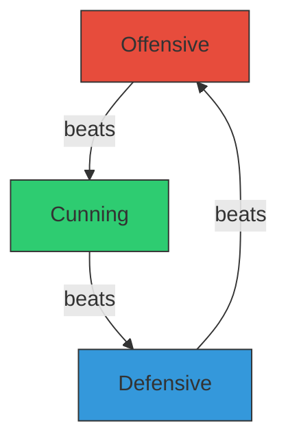
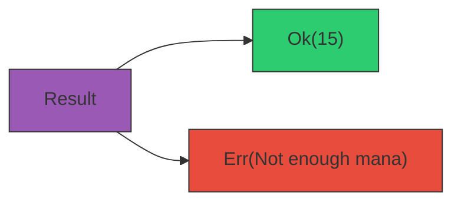
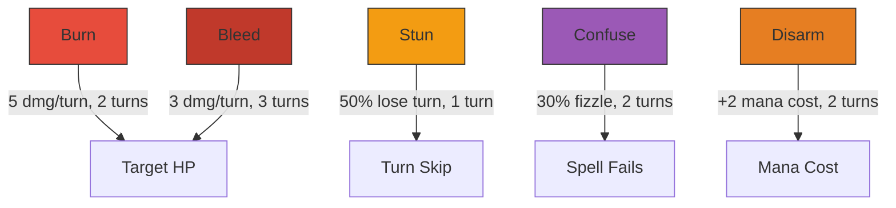

# Act 1 — The Spells (Ollivanders)

> *"The wand chooses the wizard, Mr. Potter."*
> — Garrick Ollivander

Welcome to Act 1. By the end of these 8 stages you will have a fully working **Wizard Duel Engine** running in your terminal — two wizards, eighteen spells, status effects, type advantages, and a turn-based combat loop. No GUI, no frameworks — just pure Rust, `cargo test`, and `cargo run`.

Every line of code is explained. If you have written Python or TypeScript before, you will feel at home — I will point out the differences as we go.


---

## Stage 1 — Hello Wizard

**Difficulty: Very Easy** | **Concepts: Cargo, project structure, main.rs, println!**

Before you can duel, you need a wand — and before you can write Rust, you need a project. This stage exists because every spell you cast later depends on a properly structured workspace. Think of it as your first visit to Ollivanders: nothing flashy, but without it, nothing else works.

Every Rust project starts with `cargo` — Rust's build tool and package manager. Think of it as `npm` + `webpack` + `jest` rolled into one (or `pip` + `setuptools` + `pytest` if you come from Python).

### 1.1 — Create the project

Open your terminal and run:

```bash
cargo new wizard_duel
cd wizard_duel
```

This creates a directory with two files:

```
wizard_duel/
├── Cargo.toml    ← project manifest (like package.json or pyproject.toml)
└── src/
    └── main.rs   ← your code starts here
```

### 1.2 — Understand Cargo.toml

Open `Cargo.toml`:

```toml
[package]
name = "wizard_duel"
version = "0.1.0"
edition = "2021"

[dependencies]
```

| Field | What it does | Equivalent |
|-------|-------------|------------|
| `name` | Project name | `"name"` in package.json |
| `version` | Semantic version | Same everywhere |
| `edition` | Rust language edition (2021 is current) | No direct equivalent — Rust evolves in editions |
| `[dependencies]` | External crates (libraries) | `"dependencies"` in package.json |

We will add our first dependency (`rand`) in Stage 6. For now this is all we need.

### 1.3 — Your first spell

Replace the contents of `src/main.rs` with:

```rust
// src/main.rs

// `fn` declares a function. `main` is the entry point — every Rust program starts here.
// In Python you'd write `if __name__ == "__main__":`. In Rust, `fn main()` IS that.
fn main() {
    // `println!` is a macro (note the `!`). It prints to stdout with a newline.
    // The `{}` is a placeholder, like f-string `{}` in Python or `${}` in JS template literals.
    let wizard_name = "Harry Potter";  // `let` declares a variable. Immutable by default!
    let house = "Gryffindor";

    println!("⚡ Welcome, {} of {}!", wizard_name, house);
    println!("Your wand is ready. The duel awaits.");
    println!();
    println!("  ╔══════════════════════════════╗");
    println!("  ║   W I Z A R D   D U E L      ║");
    println!("  ║        Engine v0.1            ║");
    println!("  ╚══════════════════════════════╝");
}
```

**Key Rust concepts introduced:**

- **`let`** — declares a variable. Immutable by default. In Python everything is mutable; in Rust you must opt in with `let mut`.
- **`&str`** — the type of `"Hello"`. It is a *string slice* — a reference to text stored somewhere. Think of it as a read-only view. (We will meet `String`, the owned version, in Stage 4.)
- **`;`** — every statement ends with a semicolon. Unlike JavaScript, this is not optional.
- **`println!`** — the `!` means it is a macro, not a function. Macros can do things functions cannot (like accept variable numbers of arguments). For now, just remember: `println!` prints, `!` means macro.

### 1.4 — Run it

```bash
cargo run
```

You should see:

```
   Compiling wizard_duel v0.1.0 (/path/to/wizard_duel)
    Finished dev [unoptimized + debuginfo] target(s)
     Running `target/debug/wizard_duel`
⚡ Welcome, Harry Potter of Gryffindor!
Your wand is ready. The duel awaits.

  ╔══════════════════════════════╗
  ║   W I Z A R D   D U E L      ║
  ║        Engine v0.1            ║
  ╚══════════════════════════════╝
```

Also run the test suite (it is empty, but get in the habit):

```bash
cargo test
```

```
running 0 tests

test result: ok. 0 passed; 0 filtered out; finished in 0.00s
```

> **Common mistake:** Forgetting the semicolon. Rust will give you a helpful error — read it! Rust's compiler errors are famously good.

### Checkpoint 1

You have a working wand — now you need spells to cast with it. Stage 2 introduces the data structures that define every spell in the game.

You have a Rust project that compiles and runs. You understand `Cargo.toml`, `fn main()`, `let`, `println!`, and `cargo run`. Time to define some spells.

---

## Stage 2 — The Spell

**Difficulty: Easy** | **Concepts: enums, structs, derive macros, Vec, Option**

A duel engine without spells is just two wizards staring at each other. This stage builds the data backbone of the entire game — every combat calculation, every AI decision, and every UI display will read from the types you define here. Getting the data model right now saves you from painful refactors later.

In Python you might model a spell as a dictionary or a dataclass. In TypeScript, an interface. In Rust, we use **structs** (data) and **enums** (variants).

### 2.1 — Spell types: your first enum

Right now we have a project that prints text, but we can't represent any game concepts in code. We need a way to categorize spells so the combat engine can compare them — and Rust's enums are the perfect tool for a fixed set of variants.

Every spell in our game belongs to one of three schools. Replace `src/main.rs` entirely:

```rust
// src/main.rs

// ---------- Spell Types ----------

// `enum` defines a type that can be one of several variants.
// In Python you'd use `enum.Enum`. In TS, a union type like `"Offensive" | "Defensive" | "Cunning"`.
// `derive` auto-generates trait implementations — think of traits as interfaces.
//   - Debug: lets us print with `{:?}` (like Python's __repr__)
//   - Clone: lets us copy the value
//   - PartialEq: lets us compare with `==`
#[derive(Debug, Clone, PartialEq)]
enum SpellType {
    Offensive,  // Red — raw damage
    Defensive,  // Blue — shields and healing
    Cunning,    // Green — tricks and control
}

fn main() {
    // Create a value of our enum. Note the `::` — it's the path separator.
    // Like `SpellType.Offensive` in Python or `SpellType.Offensive` in TS.
    let spell_type = SpellType::Offensive;

    // `{:?}` uses the Debug trait to print. Without `derive(Debug)` this won't compile.
    println!("Spell school: {:?}", spell_type);
}
```

Run it:

```bash
cargo run
```

```
Spell school: Offensive
```

### 2.2 — Status effects (preview)

Right now we have spell types, but spells can't *do* anything beyond raw damage. Real duels need lingering effects — burns, stuns, shields — that change the flow of combat across multiple turns. We define the enum now so spells can reference their effects from the start.

We will flesh these out in Stage 7, but we need the enum now so spells can reference their effects:

```rust
// Add this below SpellType

// Each status effect has a per-turn impact during the duel.
#[derive(Debug, Clone, PartialEq)]
enum StatusEffect {
    Burn,       // 5 damage per turn
    Bleed,      // 3 damage per turn
    Stun,       // 50% chance to lose your turn
    Confuse,    // 30% chance your spell fizzles
    Disarm,     // Spells cost +2 mana
    Slow,       // Placeholder for Impedimenta
    Shield(u8), // Absorbs N damage before breaking
    Immune,     // Immune for 1 turn (Fianto Duri)
}
```

**New concept — enum variants with data:**

`Shield(u8)` is a variant that *carries* a value. In Python you would need a separate class; in Rust, enums can hold data directly. `u8` is an unsigned 8-bit integer (0–255) — perfect for shield points.

### 2.3 — The Spell struct

Right now we have categories (`SpellType`) and effects (`StatusEffect`), but no way to bundle a spell's name, cost, damage, and effect into a single value. A struct gives us that — one `Spell` value carries everything the combat engine needs to resolve a cast.

Now the main event — the `Spell` itself:

```rust
// Add this below StatusEffect

// A struct is like a Python dataclass or a TS interface — a named collection of fields.
// Every field has a name and a type. No methods yet (those come in Stage 5).
#[derive(Debug, Clone)]
struct Spell {
    name: String,                    // Owned string — the spell owns its name
    spell_type: SpellType,           // Which school it belongs to
    mana_cost: u8,                   // Mana required to cast (0-255 is plenty)
    damage: u8,                      // Base damage dealt
    effect: Option<StatusEffect>,    // Some spells have effects, some don't
    heal: u8,                        // HP healed (0 for non-healing spells)
    shield: u8,                      // Shield points granted (0 for non-shield spells)
    description: String,             // Flavor text
    unlock_level: u8,                // Minimum wizard level to learn this spell
}
```

**Key concepts:**

| Rust | Python | TypeScript | Notes |
|------|--------|-----------|-------|
| `String` | `str` | `string` | Owned, heap-allocated, growable |
| `&str` | — | — | Borrowed string slice (read-only view) |
| `u8` | `int` | `number` | Unsigned 8-bit integer (0–255) |
| `Option<T>` | `Optional[T]` | `T \| null` | Either `Some(value)` or `None` |
| `Vec<T>` | `list[T]` | `T[]` | Growable array |

**`Option<StatusEffect>`** is Rust's way of saying "this might or might not have a value." There is no `null` in Rust. Instead, you explicitly wrap values in `Some(...)` or use `None`. The compiler forces you to handle both cases — no more `NullPointerException` or `undefined is not a function`.

### 2.4 — Create the spell book

Let's build a function that returns all 18 spells. Add this below the struct:

```rust
// A function that returns a Vec (growable array) of Spells.
// `Vec<Spell>` is like `list[Spell]` in Python or `Spell[]` in TS.
fn create_spell_book() -> Vec<Spell> {
    vec![
        // --- Offensive (Red) ---
        Spell {
            name: "Stupefy".to_string(),       // .to_string() converts &str → String
            spell_type: SpellType::Offensive,
            mana_cost: 2,
            damage: 15,
            effect: None,                       // No status effect
            heal: 0,
            shield: 0,
            description: "A stunning blast of red light.".to_string(),
            unlock_level: 1,
        },
        Spell {
            name: "Expelliarmus".to_string(),
            spell_type: SpellType::Offensive,
            mana_cost: 3,
            damage: 10,
            effect: Some(StatusEffect::Disarm), // Some(...) wraps the value
            heal: 0,
            shield: 0,
            description: "The Disarming Charm — Harry's signature.".to_string(),
            unlock_level: 1,
        },
        Spell {
            name: "Reducto".to_string(),
            spell_type: SpellType::Offensive,
            mana_cost: 4,
            damage: 25,
            effect: None,
            heal: 0,
            shield: 0,
            description: "Blasts solid objects to pieces.".to_string(),
            unlock_level: 2,
        },
        Spell {
            name: "Confringo".to_string(),
            spell_type: SpellType::Offensive,
            mana_cost: 5,
            damage: 20,
            effect: Some(StatusEffect::Burn),
            heal: 0,
            shield: 0,
            description: "The Blasting Curse — sets the target ablaze.".to_string(),
            unlock_level: 3,
        },
        Spell {
            name: "Sectumsempra".to_string(),
            spell_type: SpellType::Offensive,
            mana_cost: 7,
            damage: 35,
            effect: Some(StatusEffect::Bleed),
            heal: 0,
            shield: 0,
            description: "Snape's dark invention. Cuts deep.".to_string(),
            unlock_level: 5,
        },
        Spell {
            name: "Avada Kedavra".to_string(),
            spell_type: SpellType::Offensive,
            mana_cost: 10,
            damage: 50,
            effect: None, // Instakill logic handled in resolution, not as a status
            heal: 0,
            shield: 0,
            description: "The Killing Curse. Instant death if the target is weakened.".to_string(),
            unlock_level: 8,
        },

        // --- Defensive (Blue) ---
        Spell {
            name: "Protego".to_string(),
            spell_type: SpellType::Defensive,
            mana_cost: 2,
            damage: 0,
            effect: Some(StatusEffect::Shield(15)),
            heal: 0,
            shield: 15,
            description: "A basic Shield Charm.".to_string(),
            unlock_level: 1,
        },
        Spell {
            name: "Episkey".to_string(),
            spell_type: SpellType::Defensive,
            mana_cost: 3,
            damage: 0,
            effect: None,
            heal: 20,
            shield: 0,
            description: "Mends minor injuries.".to_string(),
            unlock_level: 1,
        },
        Spell {
            name: "Impedimenta".to_string(),
            spell_type: SpellType::Defensive,
            mana_cost: 3,
            damage: 10,
            effect: Some(StatusEffect::Slow),
            heal: 0,
            shield: 0,
            description: "The Impediment Jinx — slows the target.".to_string(),
            unlock_level: 2,
        },
        Spell {
            name: "Protego Maxima".to_string(),
            spell_type: SpellType::Defensive,
            mana_cost: 5,
            damage: 10, // reflect damage
            effect: Some(StatusEffect::Shield(30)),
            heal: 0,
            shield: 30,
            description: "A powerful shield that reflects some damage.".to_string(),
            unlock_level: 4,
        },
        Spell {
            name: "Vulnera Sanentur".to_string(),
            spell_type: SpellType::Defensive,
            mana_cost: 6,
            damage: 0,
            effect: None, // Cure logic handled in resolution
            heal: 35,
            shield: 0,
            description: "Snape's counter-curse. Heals and cures.".to_string(),
            unlock_level: 5,
        },
        Spell {
            name: "Fianto Duri".to_string(),
            spell_type: SpellType::Defensive,
            mana_cost: 8,
            damage: 0,
            effect: Some(StatusEffect::Immune),
            heal: 0,
            shield: 0,
            description: "Total magical immunity for one turn.".to_string(),
            unlock_level: 7,
        },

        // --- Cunning (Green) ---
        Spell {
            name: "Petrificus Totalus".to_string(),
            spell_type: SpellType::Cunning,
            mana_cost: 2,
            damage: 10,
            effect: Some(StatusEffect::Stun),
            heal: 0,
            shield: 0,
            description: "The Full Body-Bind. May stun the target.".to_string(),
            unlock_level: 1,
        },
        Spell {
            name: "Confundo".to_string(),
            spell_type: SpellType::Cunning,
            mana_cost: 3,
            damage: 5,
            effect: Some(StatusEffect::Confuse),
            heal: 0,
            shield: 0,
            description: "The Confundus Charm — muddles the mind.".to_string(),
            unlock_level: 2,
        },
        Spell {
            name: "Obliviate".to_string(),
            spell_type: SpellType::Cunning,
            mana_cost: 4,
            damage: 0,
            effect: None, // Mana steal handled in resolution
            heal: 0,
            shield: 0,
            description: "Memory Charm — steals 3 mana from the target.".to_string(),
            unlock_level: 3,
        },
        Spell {
            name: "Serpensortia".to_string(),
            spell_type: SpellType::Cunning,
            mana_cost: 4,
            damage: 15,
            effect: None, // Delayed damage handled in resolution
            heal: 0,
            shield: 0,
            description: "Conjures a serpent that strikes again next turn.".to_string(),
            unlock_level: 3,
        },
        Spell {
            name: "Imperio".to_string(),
            spell_type: SpellType::Cunning,
            mana_cost: 6,
            damage: 0,
            effect: Some(StatusEffect::Confuse), // Simplified: forces confusion
            heal: 0,
            shield: 0,
            description: "The Imperius Curse — bends the will.".to_string(),
            unlock_level: 6,
        },
        Spell {
            name: "Fiendfyre".to_string(),
            spell_type: SpellType::Cunning,
            mana_cost: 9,
            damage: 30,
            effect: Some(StatusEffect::Burn), // Burns both — handled in resolution
            heal: 0,
            shield: 0,
            description: "Cursed fire. Burns everything — including the caster.".to_string(),
            unlock_level: 8,
        },
    ]
}
```

**Why `.to_string()`?** The struct owns its `String` fields. A literal like `"Stupefy"` is an `&str` (borrowed). `.to_string()` creates an owned `String` from it. Think of it like copying a library book so you can take it home — the struct needs to *own* the data, not just borrow it.

### 2.5 — Update main and test

```rust
fn main() {
    let spells = create_spell_book();

    println!("⚡ Wizard Duel — Spell Book ({} spells)\n", spells.len());

    // `for spell in &spells` borrows each spell. Without `&`, the loop would
    // consume (move) the vector and you couldn't use it again.
    for spell in &spells {
        // `if let` destructures an Option — runs the block only if it's Some.
        let effect_str = if let Some(ref eff) = spell.effect {
            format!(" [{:?}]", eff)  // `format!` is like println! but returns a String
        } else {
            String::new()  // Empty string — like "" but owned
        };

        println!(
            "  {:20} {:10?}  {}mp  {}dmg{}  — {}",
            spell.name, spell.spell_type, spell.mana_cost, spell.damage,
            effect_str, spell.description
        );
    }
}

// ---------- Tests ----------

// `#[cfg(test)]` means this module only compiles during `cargo test`.
// It's like putting tests in a `tests/` folder in Python — but inline.
#[cfg(test)]
mod tests {
    use super::*;  // Import everything from the parent module

    #[test]
    fn spell_book_has_18_spells() {
        let spells = create_spell_book();
        assert_eq!(spells.len(), 18);
    }

    #[test]
    fn spell_types_are_balanced() {
        let spells = create_spell_book();
        let offensive = spells.iter().filter(|s| s.spell_type == SpellType::Offensive).count();
        let defensive = spells.iter().filter(|s| s.spell_type == SpellType::Defensive).count();
        let cunning = spells.iter().filter(|s| s.spell_type == SpellType::Cunning).count();

        assert_eq!(offensive, 6, "Should have 6 Offensive spells");
        assert_eq!(defensive, 6, "Should have 6 Defensive spells");
        assert_eq!(cunning, 6, "Should have 6 Cunning spells");
    }

    #[test]
    fn stupefy_is_cheap() {
        let spells = create_spell_book();
        // `.find()` returns Option<&Spell> — the first match or None.
        let stupefy = spells.iter().find(|s| s.name == "Stupefy").unwrap();
        assert_eq!(stupefy.mana_cost, 2);
        assert_eq!(stupefy.damage, 15);
        assert!(stupefy.effect.is_none());
    }

    #[test]
    fn avada_kedavra_is_expensive() {
        let spells = create_spell_book();
        let ak = spells.iter().find(|s| s.name == "Avada Kedavra").unwrap();
        assert_eq!(ak.mana_cost, 10);
        assert_eq!(ak.damage, 50);
    }
}
```

### 2.6 — Verify

```bash
cargo test
```

```
running 4 tests
test tests::spell_book_has_18_spells ... ok
test tests::spell_types_are_balanced ... ok
test tests::stupefy_is_cheap ... ok
test tests::avada_kedavra_is_expensive ... ok

test result: ok. 4 passed; 0 filtered out
```

```bash
cargo run
```

You should see all 18 spells printed with their stats.

> **Common mistake:** Forgetting `#[derive(PartialEq)]` on `SpellType` and then trying to use `==`. The compiler will tell you: *"binary operation `==` cannot be applied to type `SpellType`"*. The fix is always in the error message — Rust's compiler is your best teacher.

### Checkpoint 2

We have a full arsenal of spells, but no rules for how they interact. Stage 3 introduces the type triangle — the rock-paper-scissors mechanic that makes spell choice strategic instead of random.

You have 18 spells organized into three schools. You understand enums, structs, `Option`, `Vec`, `String` vs `&str`, and `derive` macros. Your tests pass. Time to make these types fight.

---

## Stage 3 — The Type Triangle

**Difficulty: Easy** | **Concepts: match expressions, impl blocks, methods, unit tests**

Without type advantages, every duel devolves into "cast your highest-damage spell repeatedly." The type triangle forces players to *think* — to read their opponent and counter-pick. It's also your first encounter with `match`, Rust's most powerful control flow tool, and `impl` blocks, which let you attach behavior to your types.

Every spell has a type, and types have advantages — like rock-paper-scissors:



- **Offensive beats Cunning** — brute force overwhelms trickery
- **Cunning beats Defensive** — cleverness bypasses shields
- **Defensive beats Offensive** — shields absorb raw power
- **Same type = Clash** — neither side has advantage

### 3.1 — The Advantage enum

Right now we have `SpellType` variants, but no way to express what happens when two types collide. We need a result type that the damage engine can use to scale damage up or down — and that result needs to be testable.

We need a way to express the *result* of a type matchup. Add this below `SpellType`:

```rust
// The result of comparing two spell types.
#[derive(Debug, Clone, PartialEq)]
enum Advantage {
    Win,   // Your type beats theirs
    Lose,  // Their type beats yours
    Clash, // Same type — no advantage
}
```

### 3.2 — Implement the matchup logic

Now we add a *method* to `SpellType`. In Python you would put methods inside the class. In Rust, methods go in an `impl` block — separate from the struct/enum definition:

```rust
// `impl` adds methods to a type. Like adding methods to a class in Python.
impl SpellType {
    // `&self` means this method borrows the value (read-only).
    // In Python, `self` is always the first parameter too — but in Rust
    // the `&` means "I'm borrowing, not consuming."
    fn advantage_against(&self, other: &SpellType) -> Advantage {
        // `match` is Rust's pattern matching — like a switch statement on steroids.
        // It MUST cover every possible combination. The compiler enforces this.
        // If you forget a case, it won't compile. This is called "exhaustiveness checking."
        match (self, other) {
            // Offensive beats Cunning
            (SpellType::Offensive, SpellType::Cunning) => Advantage::Win,
            // Defensive beats Offensive
            (SpellType::Defensive, SpellType::Offensive) => Advantage::Win,
            // Cunning beats Defensive
            (SpellType::Cunning, SpellType::Defensive) => Advantage::Win,

            // Reverse matchups — you lose
            (SpellType::Cunning, SpellType::Offensive) => Advantage::Lose,
            (SpellType::Offensive, SpellType::Defensive) => Advantage::Lose,
            (SpellType::Defensive, SpellType::Cunning) => Advantage::Lose,

            // Same type — clash
            _ => Advantage::Clash,  // `_` is the wildcard — matches everything else
        }
    }
}
```

**Why `match` instead of `if/else`?**

In Python or TS you might write:
```python
if self == "Offensive" and other == "Cunning":
    return "Win"
elif ...
```

But `match` is better because:
1. The compiler checks you covered every case — no forgotten branches
2. It reads like a truth table — easy to verify visually
3. It can destructure complex types (we will use this a lot later)

### 3.3 — Test all 9 matchups

This is the most important test in the game — if the triangle is wrong, everything breaks. Add these to your `mod tests`:

```rust
    // ---------- Type Triangle Tests ----------

    #[test]
    fn offensive_beats_cunning() {
        assert_eq!(
            SpellType::Offensive.advantage_against(&SpellType::Cunning),
            Advantage::Win
        );
    }

    #[test]
    fn defensive_beats_offensive() {
        assert_eq!(
            SpellType::Defensive.advantage_against(&SpellType::Offensive),
            Advantage::Win
        );
    }

    #[test]
    fn cunning_beats_defensive() {
        assert_eq!(
            SpellType::Cunning.advantage_against(&SpellType::Defensive),
            Advantage::Win
        );
    }

    #[test]
    fn cunning_loses_to_offensive() {
        assert_eq!(
            SpellType::Cunning.advantage_against(&SpellType::Offensive),
            Advantage::Lose
        );
    }

    #[test]
    fn offensive_loses_to_defensive() {
        assert_eq!(
            SpellType::Offensive.advantage_against(&SpellType::Defensive),
            Advantage::Lose
        );
    }

    #[test]
    fn defensive_loses_to_cunning() {
        assert_eq!(
            SpellType::Defensive.advantage_against(&SpellType::Cunning),
            Advantage::Lose
        );
    }

    #[test]
    fn same_type_is_clash() {
        assert_eq!(
            SpellType::Offensive.advantage_against(&SpellType::Offensive),
            Advantage::Clash
        );
        assert_eq!(
            SpellType::Defensive.advantage_against(&SpellType::Defensive),
            Advantage::Clash
        );
        assert_eq!(
            SpellType::Cunning.advantage_against(&SpellType::Cunning),
            Advantage::Clash
        );
    }
```

### 3.4 — Update main to show matchups

```rust
fn main() {
    let types = [SpellType::Offensive, SpellType::Defensive, SpellType::Cunning];

    println!("⚡ Type Triangle\n");
    for attacker in &types {
        for defender in &types {
            let result = attacker.advantage_against(defender);
            let symbol = match result {
                Advantage::Win => "✓ WIN ",
                Advantage::Lose => "✗ LOSE",
                Advantage::Clash => "~ DRAW",
            };
            println!("  {:10?} vs {:10?} → {}", attacker, defender, symbol);
        }
        println!();
    }
}
```

### 3.5 — Verify

```bash
cargo test
```

```
running 11 tests
test tests::spell_book_has_18_spells ... ok
test tests::spell_types_are_balanced ... ok
test tests::stupefy_is_cheap ... ok
test tests::avada_kedavra_is_expensive ... ok
test tests::offensive_beats_cunning ... ok
test tests::defensive_beats_offensive ... ok
test tests::cunning_beats_defensive ... ok
test tests::cunning_loses_to_offensive ... ok
test tests::offensive_loses_to_defensive ... ok
test tests::defensive_loses_to_cunning ... ok
test tests::same_type_is_clash ... ok

test result: ok. 11 passed; 0 filtered out
```

```bash
cargo run
```

```
⚡ Type Triangle

  Offensive  vs Offensive  → ~ DRAW
  Offensive  vs Defensive  → ✗ LOSE
  Offensive  vs Cunning    → ✓ WIN

  Defensive  vs Offensive  → ✓ WIN
  Defensive  vs Defensive  → ~ DRAW
  Defensive  vs Cunning    → ✗ LOSE

  Cunning    vs Offensive  → ✗ LOSE
  Cunning    vs Defensive  → ✓ WIN
  Cunning    vs Cunning    → ~ DRAW
```

> **Common mistake:** Using `_` too early in a match. If you write `_ => Advantage::Clash` before the specific cases, it will match everything and the specific arms become unreachable. Rust warns you about this — always put the wildcard last.

### Checkpoint 3

Spells now have strategic weight — but there's nobody to wield them. Stage 4 creates the Wizard struct, complete with HP, mana, house bonuses, and a spell loadout.

The type triangle works and is fully tested. You understand `match`, `impl` blocks, methods with `&self`, and exhaustive pattern matching. Now let's create the wizards who will wield these spells.

---

## Stage 4 — The Wizard

**Difficulty: Easy** | **Concepts: structs with methods, Display trait, String formatting, House bonuses**

Spells are just data until someone casts them. A wizard bundles together everything the duel engine needs to track a combatant: health, mana, equipped spells, active effects, and win/loss history. This is also where you learn how Rust attaches behavior to data through `impl` blocks and traits — the foundation for every method you'll write from here on.

Time to create the duellists. A wizard has stats, a house, and a spell loadout.

### 4.1 — The House enum

Right now every wizard would be identical — same stats, same abilities. Houses give each combatant a distinct identity and force different playstyles, which makes the game worth replaying. We model houses as an enum because the set is fixed and each variant maps to specific bonuses.

```rust
// Each house grants different combat bonuses.
#[derive(Debug, Clone, PartialEq)]
enum House {
    Gryffindor, // +5 HP, +10% damage when HP < 30%
    Slytherin,  // +3 max mana, Cunning spells cost -1 mana
    Ravenclaw,  // 7 spell slots (others get 6), +5% spell effect
    Hufflepuff, // +2 mana regen per turn, +20% healing
}
```

### 4.2 — The Wizard struct

Right now we have spells and houses, but no way to represent a combatant's full state — their health, mana, equipped spells, and active effects all in one place. The `Wizard` struct is the central data type that the entire duel engine revolves around.

```rust
#[derive(Debug, Clone)]
struct Wizard {
    name: String,
    house: House,
    level: u8,
    xp: u32,
    hp: i16,          // i16 (signed) so we can go negative for overkill display
    max_hp: i16,
    mana: i16,        // Signed so subtraction doesn't underflow
    max_mana: i16,
    spells: Vec<Spell>,
    wins: u32,
    losses: u32,
    streak: i32,       // Positive = win streak, negative = loss streak
    active_effects: Vec<(StatusEffect, u8)>,  // (effect, turns remaining)
    shield_hp: u8,     // Current shield points
    mana_regen: i16,   // Mana restored per turn
}
```

**Why `i16` instead of `u8` for HP and mana?**

If HP is `u8` (unsigned, 0–255) and you subtract more than the current value, Rust panics in debug mode (integer underflow). Using `i16` (signed, -32768 to 32767) lets us safely subtract without worrying about underflow. We will clamp to 0 when displaying.

**`Vec<(StatusEffect, u8)>`** — a vector of *tuples*. Each tuple pairs an effect with its remaining duration. In Python this would be `list[tuple[StatusEffect, int]]`. In TS: `[StatusEffect, number][]`.

### 4.3 — Constructor with house bonuses

```rust
impl Wizard {
    // `new` is a convention for constructors. It's not special syntax — just a function
    // that returns Self (the type being implemented).
    fn new(name: &str, house: House, level: u8) -> Self {
        // Base stats
        let base_hp: i16 = 100;
        let base_mana: i16 = 20;
        let base_regen: i16 = 3;
        let base_slots: usize = 6;

        // Apply house bonuses
        let (max_hp, max_mana, mana_regen, spell_slots) = match &house {
            House::Gryffindor => (base_hp + 5, base_mana, base_regen, base_slots),
            House::Slytherin  => (base_hp, base_mana + 3, base_regen, base_slots),
            House::Ravenclaw  => (base_hp, base_mana, base_regen, base_slots + 1),
            House::Hufflepuff => (base_hp, base_mana, base_regen + 2, base_slots),
        };

        // Pick spells the wizard can learn (at or below their level)
        let spell_book = create_spell_book();
        let available: Vec<Spell> = spell_book
            .into_iter()                              // Consume the vector
            .filter(|s| s.unlock_level <= level)      // Keep spells at or below level
            .take(spell_slots)                        // Limit to spell slot count
            .collect();                               // Collect into a new Vec

        Wizard {
            name: name.to_string(),
            house,
            level,
            xp: 0,
            hp: max_hp,
            max_hp,          // Shorthand: field name matches variable name
            mana: max_mana,
            max_mana,
            spells: available,
            wins: 0,
            losses: 0,
            streak: 0,
            active_effects: Vec::new(),
            shield_hp: 0,
            mana_regen,
        }
    }

    // Check if the wizard is knocked out
    fn is_ko(&self) -> bool {
        self.hp <= 0
    }

    // Regenerate mana at the start of each turn
    fn regen_mana(&mut self) {
        // `mut` in `&mut self` means we can modify the wizard's fields.
        // Without `mut`, the compiler won't let us change anything.
        self.mana = (self.mana + self.mana_regen).min(self.max_mana);
    }
}
```

**Iterator chain explained:**

```rust
spell_book.into_iter().filter(...).take(...).collect()
```

This is like a Python generator pipeline:
```python
list(itertools.islice(filter(lambda s: s.unlock_level <= level, spell_book), spell_slots))
```

Or in TS:
```typescript
spellBook.filter(s => s.unlockLevel <= level).slice(0, spellSlots)
```

Rust iterators are *lazy* — nothing happens until `.collect()` consumes them. This is efficient: no intermediate arrays are created.

### 4.4 — Implement Display

The `Display` trait lets you print a wizard with `{}` (like Python's `__str__`):

```rust
// `use` brings a trait into scope. `fmt` is the formatting module.
use std::fmt;

impl fmt::Display for Wizard {
    fn fmt(&self, f: &mut fmt::Formatter<'_>) -> fmt::Result {
        // `write!` is like `println!` but writes to a formatter instead of stdout.
        write!(
            f,
            "{} ({:?}) — HP: {}/{} | Mana: {}/{} | Lv.{} | W/L: {}/{}",
            self.name, self.house,
            self.hp.max(0), self.max_hp,  // .max(0) clamps negative HP to 0 for display
            self.mana.max(0), self.max_mana,
            self.level,
            self.wins, self.losses
        )
    }
}
```

**`fmt::Formatter<'_>`** — that `'_` is a *lifetime*. Don't worry about it yet. It means "the compiler will figure out how long this reference lives." Lifetimes are Rust's way of ensuring references never outlive the data they point to. We will explore them properly in Act 2.

### 4.5 — Update main

```rust
fn main() {
    let harry = Wizard::new("Harry Potter", House::Gryffindor, 5);
    let draco = Wizard::new("Draco Malfoy", House::Slytherin, 5);

    println!("⚡ Wizard Duel — The Combatants\n");
    println!("  {}", harry);
    println!("  {}", draco);

    println!("\n  Harry's spells:");
    for (i, spell) in harry.spells.iter().enumerate() {
        println!("    {}. {:20} {:10?}  {}mp  {}dmg",
            i + 1, spell.name, spell.spell_type, spell.mana_cost, spell.damage);
    }

    println!("\n  Draco's spells:");
    for (i, spell) in draco.spells.iter().enumerate() {
        println!("    {}. {:20} {:10?}  {}mp  {}dmg",
            i + 1, spell.name, spell.spell_type, spell.mana_cost, spell.damage);
    }
}
```

### 4.6 — Tests

```rust
    // ---------- Wizard Tests ----------

    #[test]
    fn gryffindor_gets_bonus_hp() {
        let w = Wizard::new("Harry", House::Gryffindor, 1);
        assert_eq!(w.max_hp, 105); // 100 base + 5 Gryffindor bonus
    }

    #[test]
    fn slytherin_gets_bonus_mana() {
        let w = Wizard::new("Draco", House::Slytherin, 1);
        assert_eq!(w.max_mana, 23); // 20 base + 3 Slytherin bonus
    }

    #[test]
    fn ravenclaw_gets_extra_spell_slot() {
        let w = Wizard::new("Luna", House::Ravenclaw, 10);
        // Ravenclaw gets 7 slots, others get 6
        assert!(w.spells.len() <= 7);
        // At level 10, all spells are available, so should fill all 7 slots
        assert_eq!(w.spells.len(), 7);
    }

    #[test]
    fn hufflepuff_gets_bonus_regen() {
        let w = Wizard::new("Cedric", House::Hufflepuff, 1);
        assert_eq!(w.mana_regen, 5); // 3 base + 2 Hufflepuff bonus
    }

    #[test]
    fn wizard_display_works() {
        let w = Wizard::new("Test", House::Gryffindor, 1);
        let display = format!("{}", w);
        assert!(display.contains("Test"));
        assert!(display.contains("Gryffindor"));
        assert!(display.contains("HP:"));
    }

    #[test]
    fn mana_regen_caps_at_max() {
        let mut w = Wizard::new("Test", House::Gryffindor, 1);
        w.mana = w.max_mana; // Already full
        w.regen_mana();
        assert_eq!(w.mana, w.max_mana); // Should not exceed max
    }
```

### 4.7 — Verify

```bash
cargo test
```

All 17 tests should pass. `cargo run` should show both wizards with their stats and spell loadouts.

> **Common mistake:** Trying to modify a wizard without `let mut`. If you write `let harry = Wizard::new(...)` and then try `harry.hp -= 10`, the compiler says *"cannot assign to `harry.hp`, as `harry` is not declared as mutable."* Fix: `let mut harry = ...`.

### Checkpoint 4

Your wizards are ready for battle — but they can't actually cast anything yet. Stage 5 introduces the `cast` method and your first real encounter with Rust's borrow checker.

You have wizards with house bonuses, spell loadouts, and a Display trait. You understand structs, `impl` blocks, constructors, iterator chains, and the `Display` trait. Time to cast some spells.

---

## Stage 5 — Cast a Spell

**Difficulty: Medium** | **Concepts: Result type, error handling, &self vs &mut self, borrowing**

Casting a spell is the first action that *changes* game state — it deducts mana and can fail if you're tapped out. This is where Rust's ownership model stops being theoretical and starts being practical. You'll learn how Rust replaces exceptions with `Result`, and you'll meet the borrow checker for real when you try to read a spell and mutate a wizard at the same time.

In Python, if something goes wrong you raise an exception. In JavaScript, you throw an Error. Rust does not have exceptions. Instead, it uses the `Result` type — a value that is either `Ok(success)` or `Err(failure)`. The compiler forces you to handle both cases.

### 5.1 — The cast method

Add this to `impl Wizard`:

```rust
impl Wizard {
    // ... (keep new, is_ko, regen_mana from Stage 4)

    // Cast a spell. Returns Ok(damage) or Err(reason).
    //
    // `&mut self` — we need to modify mana.
    // `&Spell` — we borrow the spell (read-only). We don't consume it.
    //
    // `Result<u8, String>` — either Ok with a u8 damage value, or Err with a message.
    // In Python: `def cast(self, spell) -> int` that might raise ValueError.
    // In TS: `cast(spell: Spell): number` that might throw.
    fn cast(&mut self, spell: &Spell) -> Result<u8, String> {
        // Calculate effective mana cost (Slytherin discount for Cunning spells)
        let cost = if self.house == House::Slytherin
            && spell.spell_type == SpellType::Cunning
        {
            (spell.mana_cost as i16 - 1).max(1) // At least 1 mana
        } else {
            spell.mana_cost as i16
        };

        // Check for Disarm effect — increases cost by 2
        let disarm_penalty: i16 = if self.active_effects.iter().any(|(e, _)| *e == StatusEffect::Disarm) {
            2
        } else {
            0
        };

        let total_cost = cost + disarm_penalty;

        // Check if we have enough mana
        if self.mana < total_cost {
            return Err(format!(
                "{} doesn't have enough mana! Need {} but only has {}.",
                self.name, total_cost, self.mana
            ));
        }

        // Deduct mana
        self.mana -= total_cost;

        // Return base damage
        Ok(spell.damage)
    }
}
```

**`Result<u8, String>` explained:**



- `Ok(15)` — success! The spell dealt 15 damage.
- `Err("Not enough mana!".to_string())` — failure with a reason.

The caller *must* handle both cases. You cannot accidentally ignore an error in Rust — the compiler won't let you.

### 5.2 — Using Result

Here is how you handle a `Result`:

```rust
// In main or a test:
let result = wizard.cast(&spell);

// Option 1: match (most explicit)
match result {
    Ok(damage) => println!("Hit for {} damage!", damage),
    Err(reason) => println!("Failed: {}", reason),
}

// Option 2: if let (when you only care about one case)
if let Ok(damage) = wizard.cast(&spell) {
    println!("Hit for {} damage!", damage);
}

// Option 3: unwrap (panics on Err — only use in tests!)
let damage = wizard.cast(&spell).unwrap();
```

**Never use `.unwrap()` in production code.** It panics (crashes) if the Result is Err. In tests it is fine because a panic = test failure, which is what you want.

### 5.3 — Tests

```rust
    // ---------- Cast Tests ----------

    #[test]
    fn cast_deducts_mana() {
        let mut wizard = Wizard::new("Harry", House::Gryffindor, 5);
        let spell = &wizard.spells[0].clone(); // Clone to avoid borrow conflict
        let initial_mana = wizard.mana;

        let result = wizard.cast(spell);
        assert!(result.is_ok());
        assert_eq!(wizard.mana, initial_mana - spell.mana_cost as i16);
    }

    #[test]
    fn cast_returns_damage() {
        let mut wizard = Wizard::new("Harry", House::Gryffindor, 5);
        let spell = &wizard.spells[0].clone();

        let damage = wizard.cast(spell).unwrap();
        assert_eq!(damage, spell.damage);
    }

    #[test]
    fn cast_fails_without_mana() {
        let mut wizard = Wizard::new("Harry", House::Gryffindor, 5);
        wizard.mana = 0; // Drain all mana

        let spell = &wizard.spells[0].clone();
        let result = wizard.cast(spell);
        assert!(result.is_err());
        assert!(result.unwrap_err().contains("enough mana"));
    }

    #[test]
    fn slytherin_cunning_discount() {
        let mut draco = Wizard::new("Draco", House::Slytherin, 5);
        // Find a Cunning spell
        let cunning_spell = create_spell_book()
            .into_iter()
            .find(|s| s.spell_type == SpellType::Cunning && s.unlock_level <= 5)
            .unwrap();

        let initial_mana = draco.mana;
        draco.cast(&cunning_spell).unwrap();

        // Should cost 1 less than normal
        let expected_cost = (cunning_spell.mana_cost as i16 - 1).max(1);
        assert_eq!(draco.mana, initial_mana - expected_cost);
    }
```

**The borrow checker moment:**

Notice `let spell = &wizard.spells[0].clone()`. Why `.clone()`?

Without it, `spell` borrows from `wizard.spells`. But `wizard.cast()` needs `&mut self` — a mutable borrow of the *entire* wizard. Rust's rule: **you cannot have a shared borrow (`&`) and a mutable borrow (`&mut`) of the same data at the same time.**

```
// This WON'T compile:
let spell = &wizard.spells[0];     // shared borrow of wizard
wizard.cast(spell);                 // mutable borrow of wizard — CONFLICT!
```

The fix: `.clone()` creates an independent copy, so `spell` no longer borrows from `wizard`. This is your first real encounter with the **borrow checker** — Rust's signature feature that prevents data races and use-after-free bugs at compile time.

> **Python/TS comparison:** In Python, you can freely read and write the same object from multiple references. This is convenient but leads to subtle bugs (modifying a list while iterating over it, for example). Rust prevents this entire class of bugs at compile time.

### 5.4 — Verify

```bash
cargo test
```

All 21 tests should pass.

> **Common mistake:** Trying to borrow `wizard.spells[0]` and then call `wizard.cast()`. The compiler error will say something like *"cannot borrow `wizard` as mutable because it is also borrowed as immutable."* The fix is always to `.clone()` the spell first, or restructure so the borrows don't overlap.

### Checkpoint 5

Spells can be cast and mana is tracked — but what happens when the spell actually *hits*? Stage 6 builds the damage resolution engine that turns a cast into concrete HP changes, shield absorption, and status effects.

Wizards can cast spells, mana is deducted, and errors are handled with `Result`. You have met the borrow checker and survived. Now let's resolve what happens when a spell hits.

---

## Stage 6 — Damage Resolution

**Difficulty: Medium** | **Concepts: external crates, Cargo.toml dependencies, rand, f32 math, complex game logic**

This is the heart of the combat engine — the function that turns "wizard casts spell" into actual game consequences. Without resolution, casting a spell is just subtracting mana. Here you wire together type advantages, damage variance, shields, healing, and status effects into a single coherent pipeline. You'll also pull in your first external crate (`rand`), learning how Rust's ecosystem works.

When a spell hits, we need to resolve: type advantage → damage modifier → apply damage → healing → shields → status effects. This is the combat engine.

### 6.1 — Add the `rand` crate

We need randomness for damage variance. Edit `Cargo.toml`:

```toml
[package]
name = "wizard_duel"
version = "0.1.0"
edition = "2021"

[dependencies]
rand = "0.8"
```

This is like `npm install rand` or `pip install rand`. Cargo downloads it automatically on the next build.

Add the import at the top of `main.rs`:

```rust
use rand::Rng;  // Rng is a trait that gives us .gen_range()
use std::fmt;
```

### 6.2 — The DuelResult struct

Right now `cast()` returns a bare `u8` damage value, but resolution involves much more — healing, shields, mana theft, status effects, and type advantage. We need a struct that captures *everything* that happened so the UI and game loop can report it clearly.

We need to communicate what happened during a spell resolution:

```rust
// What happened when a spell was resolved.
#[derive(Debug)]
struct CastResult {
    damage_dealt: u8,
    damage_healed: u8,
    shield_gained: u8,
    mana_stolen: i16,
    effect_applied: Option<StatusEffect>,
    advantage: Advantage,
    message: String,
}
```

### 6.3 — The resolve function

This is the heart of the combat engine. Add it as a standalone function (not a method — it operates on two wizards):

```rust
// Resolve a spell cast by `caster` against `target`.
// Takes mutable references to both wizards because both may be modified.
fn resolve_spell(
    caster: &mut Wizard,
    target: &mut Wizard,
    spell: &Spell,
    target_spell_type: &SpellType, // What the target cast (for type comparison)
) -> CastResult {
    let mut rng = rand::thread_rng();

    // --- Step 1: Type advantage ---
    let advantage = spell.spell_type.advantage_against(target_spell_type);

    // Damage modifier based on advantage
    let type_modifier: f32 = match advantage {
        Advantage::Win => 1.0,    // Full damage
        Advantage::Lose => 0.5,   // Half damage
        Advantage::Clash => 0.75, // Reduced damage
    };

    // --- Step 2: Calculate damage with variance ---
    // Base damage * type modifier * random variance (90%-110%)
    let variance: f32 = rng.gen_range(0.9..=1.1);
    let mut raw_damage = (spell.damage as f32 * type_modifier * variance) as u8;

    // Gryffindor bonus: +10% damage when HP < 30%
    if caster.house == House::Gryffindor
        && caster.hp < (caster.max_hp * 30 / 100)
    {
        raw_damage = (raw_damage as f32 * 1.1) as u8;
    }

    // Ravenclaw bonus: +5% to all spell effects
    if caster.house == House::Ravenclaw {
        raw_damage = (raw_damage as f32 * 1.05) as u8;
    }

    // --- Step 3: Apply shield absorption ---
    let damage_after_shield = if target.shield_hp > 0 {
        if raw_damage <= target.shield_hp {
            target.shield_hp -= raw_damage;
            0 // Shield absorbed all damage
        } else {
            let overflow = raw_damage - target.shield_hp;
            target.shield_hp = 0;
            overflow
        }
    } else {
        raw_damage
    };

    // --- Step 4: Check for Immune status ---
    let is_immune = target.active_effects.iter().any(|(e, _)| *e == StatusEffect::Immune);
    let final_damage = if is_immune { 0 } else { damage_after_shield };

    // --- Step 5: Apply damage to target ---
    target.hp -= final_damage as i16;

    // Avada Kedavra instakill: if target HP < 20 before this spell, instant KO
    if spell.name == "Avada Kedavra" && target.hp <= 20 && target.hp > 0 {
        target.hp = 0;
    }

    // --- Step 6: Healing ---
    let mut heal_amount = spell.heal;
    if caster.house == House::Hufflepuff {
        heal_amount = (heal_amount as f32 * 1.2) as u8; // +20% healing
    }
    if caster.house == House::Ravenclaw {
        heal_amount = (heal_amount as f32 * 1.05) as u8;
    }
    caster.hp = (caster.hp + heal_amount as i16).min(caster.max_hp);

    // --- Step 7: Shield ---
    let shield_amount = spell.shield;
    caster.shield_hp = caster.shield_hp.saturating_add(shield_amount);

    // --- Step 8: Mana steal (Obliviate) ---
    let mana_stolen: i16 = if spell.name == "Obliviate" { 3 } else { 0 };
    if mana_stolen > 0 {
        target.mana = (target.mana - mana_stolen).max(0);
        caster.mana = (caster.mana + mana_stolen).min(caster.max_mana);
    }

    // --- Step 9: Apply status effect to target ---
    let effect_applied = if !is_immune {
        if let Some(ref effect) = spell.effect {
            match effect {
                StatusEffect::Shield(_) | StatusEffect::Immune => {
                    // These apply to the caster, not the target — handled above
                    None
                }
                _ => {
                    let duration: u8 = match effect {
                        StatusEffect::Burn => 2,
                        StatusEffect::Bleed => 3,
                        StatusEffect::Stun => 1,
                        StatusEffect::Confuse => 2,
                        StatusEffect::Disarm => 2,
                        StatusEffect::Slow => 1,
                        _ => 1,
                    };
                    target.active_effects.push((effect.clone(), duration));
                    Some(effect.clone())
                }
            }
        } else {
            None
        }
    } else {
        None
    };

    // --- Step 10: Fiendfyre self-damage ---
    if spell.name == "Fiendfyre" {
        caster.active_effects.push((StatusEffect::Burn, 2));
    }

    // --- Step 11: Vulnera Sanentur cures all effects ---
    if spell.name == "Vulnera Sanentur" {
        caster.active_effects.clear();
    }

    // Build result message
    let adv_str = match advantage {
        Advantage::Win => "Super effective!",
        Advantage::Lose => "Not very effective...",
        Advantage::Clash => "Normal hit.",
    };

    let mut msg = format!(
        "{} casts {}! {} {} takes {} damage.",
        caster.name, spell.name, adv_str, target.name, final_damage
    );
    if heal_amount > 0 {
        msg.push_str(&format!(" {} heals {} HP.", caster.name, heal_amount));
    }
    if shield_amount > 0 {
        msg.push_str(&format!(" {} gains {} shield.", caster.name, shield_amount));
    }
    if mana_stolen > 0 {
        msg.push_str(&format!(" Stole {} mana!", mana_stolen));
    }
    if let Some(ref eff) = effect_applied {
        msg.push_str(&format!(" Applied {:?}!", eff));
    }

    CastResult {
        damage_dealt: final_damage,
        damage_healed: heal_amount,
        shield_gained: shield_amount,
        mana_stolen,
        effect_applied,
        advantage,
        message: msg,
    }
}
```

**That is a lot of code.** Let's break down the key Rust concepts:

- **`rand::thread_rng()`** — creates a random number generator. `.gen_range(0.9..=1.1)` generates a float between 0.9 and 1.1 inclusive.
- **`as f32` / `as u8`** — type casting. Rust never implicitly converts between numeric types. You must be explicit. In Python, `int * float` just works. In Rust, you must cast.
- **`.saturating_add()`** — adds without overflowing. If the result would exceed `u8::MAX` (255), it clamps to 255 instead of panicking.
- **`if let Some(ref effect) = spell.effect`** — destructures the Option. `ref` borrows the inner value instead of moving it.
- **`.push_str()`** — appends a `&str` to a `String`. Like `+=` for strings in Python.

### 6.4 — Tests

```rust
    // ---------- Resolution Tests ----------

    #[test]
    fn winning_type_does_full_damage() {
        // Offensive vs Cunning = Win
        let mut caster = Wizard::new("Caster", House::Gryffindor, 5);
        let mut target = Wizard::new("Target", House::Slytherin, 5);
        let spell = Spell {
            name: "TestBlast".to_string(),
            spell_type: SpellType::Offensive,
            mana_cost: 2,
            damage: 20,
            effect: None,
            heal: 0,
            shield: 0,
            description: "Test".to_string(),
            unlock_level: 1,
        };

        let result = resolve_spell(
            &mut caster, &mut target, &spell, &SpellType::Cunning,
        );

        assert_eq!(result.advantage, Advantage::Win);
        // Damage should be around 20 (full, with variance 90-110%)
        assert!(result.damage_dealt >= 16 && result.damage_dealt <= 24,
            "Expected ~20 damage, got {}", result.damage_dealt);
    }

    #[test]
    fn losing_type_does_half_damage() {
        let mut caster = Wizard::new("Caster", House::Gryffindor, 5);
        let mut target = Wizard::new("Target", House::Slytherin, 5);
        let spell = Spell {
            name: "TestBlast".to_string(),
            spell_type: SpellType::Offensive,
            mana_cost: 2,
            damage: 20,
            effect: None,
            heal: 0,
            shield: 0,
            description: "Test".to_string(),
            unlock_level: 1,
        };

        let result = resolve_spell(
            &mut caster, &mut target, &spell, &SpellType::Defensive,
        );

        assert_eq!(result.advantage, Advantage::Lose);
        // Damage should be around 10 (half of 20, with variance)
        assert!(result.damage_dealt >= 7 && result.damage_dealt <= 13,
            "Expected ~10 damage, got {}", result.damage_dealt);
    }

    #[test]
    fn shield_absorbs_damage() {
        let mut caster = Wizard::new("Caster", House::Gryffindor, 5);
        let mut target = Wizard::new("Target", House::Slytherin, 5);
        target.shield_hp = 50; // Big shield

        let spell = Spell {
            name: "TestBlast".to_string(),
            spell_type: SpellType::Offensive,
            mana_cost: 2,
            damage: 10,
            effect: None,
            heal: 0,
            shield: 0,
            description: "Test".to_string(),
            unlock_level: 1,
        };

        let initial_hp = target.hp;
        resolve_spell(&mut caster, &mut target, &spell, &SpellType::Cunning);

        assert_eq!(target.hp, initial_hp); // Shield absorbed everything
        assert!(target.shield_hp < 50);    // Shield took damage
    }

    #[test]
    fn healing_restores_hp() {
        let mut caster = Wizard::new("Caster", House::Gryffindor, 5);
        let mut target = Wizard::new("Target", House::Slytherin, 5);
        caster.hp = 50; // Wounded

        let spell = Spell {
            name: "Episkey".to_string(),
            spell_type: SpellType::Defensive,
            mana_cost: 3,
            damage: 0,
            effect: None,
            heal: 20,
            shield: 0,
            description: "Heal".to_string(),
            unlock_level: 1,
        };

        resolve_spell(&mut caster, &mut target, &spell, &SpellType::Defensive);
        assert_eq!(caster.hp, 70); // 50 + 20
    }

    #[test]
    fn obliviate_steals_mana() {
        let mut caster = Wizard::new("Caster", House::Slytherin, 5);
        let mut target = Wizard::new("Target", House::Gryffindor, 5);
        let initial_target_mana = target.mana;
        let initial_caster_mana = caster.mana;

        let spell = Spell {
            name: "Obliviate".to_string(),
            spell_type: SpellType::Cunning,
            mana_cost: 4,
            damage: 0,
            effect: None,
            heal: 0,
            shield: 0,
            description: "Steal mana".to_string(),
            unlock_level: 3,
        };

        resolve_spell(&mut caster, &mut target, &spell, &SpellType::Defensive);
        assert_eq!(target.mana, initial_target_mana - 3);
        // Caster gains 3 mana (capped at max)
        assert!(caster.mana <= caster.max_mana);
    }
```

### 6.5 — Verify

```bash
cargo test
```

All 26 tests should pass. The `rand` crate will be downloaded and compiled on the first run.

> **Common mistake:** Forgetting `use rand::Rng;` at the top. Without it, `.gen_range()` is not available and the compiler says *"no method named `gen_range` found."* Traits must be in scope to use their methods — this is different from Python where methods are always available.

### Checkpoint 6

Spells now deal real damage with all the modifiers applied — but status effects are fire-and-forget. Stage 7 makes them *tick* each turn, adding the persistent pressure that separates a good duelist from a great one.

The combat engine resolves spells with type advantages, damage variance, shields, healing, and mana steal. You understand external crates, `Cargo.toml` dependencies, type casting, and complex game logic. Now let's make status effects tick.

---

## Stage 7 — Status Effects

**Difficulty: Medium** | **Concepts: iterating with mutation, retain(), enum matching with data, turn-based tick logic**

Status effects are what make duels feel like chess instead of coin flips. A well-timed Burn forces your opponent to heal instead of attack; a Stun can swing an entire match. This stage teaches you how Rust handles the tricky problem of modifying a collection while processing it — a pattern that causes bugs in most languages but is made safe by Rust's ownership rules.

Status effects are the spice of combat. They persist across turns, dealing damage, disrupting spells, or increasing costs. Each turn, we "tick" all active effects — apply their per-turn impact and decrement their duration.

### 7.1 — The tick function

We already defined `StatusEffect` in Stage 2 and stored active effects as `Vec<(StatusEffect, u8)>` on the wizard. Now we need a function that processes them each turn.

Add this to `impl Wizard`:

```rust
impl Wizard {
    // ... (keep all previous methods)

    // Process all active status effects at the start of a turn.
    // Returns a Vec of messages describing what happened.
    fn tick_effects(&mut self) -> Vec<String> {
        let mut messages: Vec<String> = Vec::new();
        let mut rng = rand::thread_rng();

        // Process each effect
        for (effect, _turns) in &self.active_effects {
            match effect {
                StatusEffect::Burn => {
                    self.hp -= 5;
                    messages.push(format!("  {} burns for 5 damage!", self.name));
                }
                StatusEffect::Bleed => {
                    self.hp -= 3;
                    messages.push(format!("  {} bleeds for 3 damage!", self.name));
                }
                StatusEffect::Stun => {
                    // 50% chance — the actual skip logic is in the duel loop
                    let stunned = rng.gen_range(0..100) < 50;
                    if stunned {
                        messages.push(format!(
                            "  {} is stunned and cannot act!", self.name
                        ));
                    } else {
                        messages.push(format!(
                            "  {} shakes off the stun!", self.name
                        ));
                    }
                }
                StatusEffect::Confuse => {
                    let confused = rng.gen_range(0..100) < 30;
                    if confused {
                        messages.push(format!(
                            "  {} is confused — spell may fizzle!", self.name
                        ));
                    }
                }
                StatusEffect::Disarm => {
                    messages.push(format!(
                        "  {} is disarmed — spells cost +2 mana!", self.name
                    ));
                }
                StatusEffect::Slow => {
                    messages.push(format!(
                        "  {} is slowed!", self.name
                    ));
                }
                StatusEffect::Shield(hp) => {
                    messages.push(format!(
                        "  {} has a shield with {} HP remaining.", self.name, hp
                    ));
                }
                StatusEffect::Immune => {
                    messages.push(format!(
                        "  {} is immune to damage this turn!", self.name
                    ));
                }
            }
        }

        // Decrement durations and remove expired effects.
        // `retain` keeps elements where the closure returns true — like filter() in place.
        // In Python: `self.effects = [(e, t-1) for e, t in self.effects if t-1 > 0]`
        self.active_effects = self
            .active_effects
            .iter()
            .map(|(e, t)| (e.clone(), t - 1))  // Decrement turns
            .filter(|(_, t)| *t > 0)             // Keep only active effects
            .collect();

        messages
    }

    // Check if the wizard is stunned this turn (for the duel loop).
    fn is_stunned(&self) -> bool {
        self.active_effects.iter().any(|(e, _)| *e == StatusEffect::Stun)
    }

    // Check if a spell fizzles due to Confuse.
    fn spell_fizzles(&self) -> bool {
        if self.active_effects.iter().any(|(e, _)| *e == StatusEffect::Confuse) {
            let mut rng = rand::thread_rng();
            rng.gen_range(0..100) < 30
        } else {
            false
        }
    }

    // Check if the wizard is immune this turn.
    fn is_immune(&self) -> bool {
        self.active_effects.iter().any(|(e, _)| *e == StatusEffect::Immune)
    }
}
```

**Key concept — iterating and mutating:**

In Python you might write:
```python
for effect in self.effects:
    effect.turns -= 1
self.effects = [e for e in self.effects if e.turns > 0]
```

In Rust, you cannot modify a collection while iterating over it (the borrow checker prevents it). Instead, we use a functional approach: `.iter().map().filter().collect()` creates a new vector. This is idiomatic Rust — transform and collect rather than mutate in place.

### 7.2 — Status effect summary



### 7.3 — Tests

```rust
    // ---------- Status Effect Tests ----------

    #[test]
    fn burn_deals_5_damage_per_tick() {
        let mut wizard = Wizard::new("Victim", House::Gryffindor, 1);
        wizard.active_effects.push((StatusEffect::Burn, 2));
        let initial_hp = wizard.hp;

        wizard.tick_effects();

        assert_eq!(wizard.hp, initial_hp - 5);
        // Effect should still be active (1 turn remaining)
        assert_eq!(wizard.active_effects.len(), 1);
    }

    #[test]
    fn bleed_deals_3_damage_per_tick() {
        let mut wizard = Wizard::new("Victim", House::Gryffindor, 1);
        wizard.active_effects.push((StatusEffect::Bleed, 3));
        let initial_hp = wizard.hp;

        wizard.tick_effects();

        assert_eq!(wizard.hp, initial_hp - 3);
        assert_eq!(wizard.active_effects.len(), 1); // 2 turns remaining
    }

    #[test]
    fn effects_expire_after_duration() {
        let mut wizard = Wizard::new("Victim", House::Gryffindor, 1);
        wizard.active_effects.push((StatusEffect::Burn, 1)); // Last turn

        wizard.tick_effects();

        // Effect should be gone now (decremented to 0, then filtered out)
        assert!(wizard.active_effects.is_empty());
    }

    #[test]
    fn multiple_effects_stack() {
        let mut wizard = Wizard::new("Victim", House::Gryffindor, 1);
        wizard.active_effects.push((StatusEffect::Burn, 2));
        wizard.active_effects.push((StatusEffect::Bleed, 2));
        let initial_hp = wizard.hp;

        wizard.tick_effects();

        // Both should tick: 5 (burn) + 3 (bleed) = 8 total
        assert_eq!(wizard.hp, initial_hp - 8);
        assert_eq!(wizard.active_effects.len(), 2);
    }

    #[test]
    fn immune_status_is_detected() {
        let mut wizard = Wizard::new("Protected", House::Gryffindor, 1);
        assert!(!wizard.is_immune());

        wizard.active_effects.push((StatusEffect::Immune, 1));
        assert!(wizard.is_immune());
    }
```

### 7.4 — Verify

```bash
cargo test
```

All 31 tests should pass.

> **Common mistake:** Off-by-one in duration tracking. If Burn has duration 2, it should tick twice (dealing 5 damage each time = 10 total). Our logic: tick the effect, then decrement. When duration reaches 0, remove it. So duration 2 means: tick at 2 → becomes 1, tick at 1 → becomes 0 → removed. Two ticks total. Correct!

### Checkpoint 7

Every combat system is in place — spells, types, damage, effects. All that's left is the loop that ties them together. Stage 8 builds the interactive duel: stdin input, turn alternation, and a winner.

Status effects tick each turn, expire after their duration, and stack. You understand functional iteration patterns, `retain`/`filter`, and how Rust handles mutation during iteration. One stage left — the duel itself.

---

## Stage 8 — The Duel Loop

**Difficulty: Medium** | **Concepts: stdin, loop, game loop pattern, String parsing, putting it all together**

Every system you've built — spells, types, wizards, casting, resolution, effects — has been tested in isolation. This stage wires them into a playable game. The duel loop is the classic game programming pattern: read input → update state → check win condition → repeat. It's also where you learn Rust's approach to user input, which is more explicit than Python's `input()` but gives you full control.

This is it — the final stage of Act 1. We wire everything together into a playable terminal game. Two wizards, alternating turns, spell selection via stdin, and a winner.

### 8.1 — Reading user input

Rust's stdin is more verbose than Python's `input()`. Let's make a helper:

```rust
use std::io::{self, Write};

// Read a line from stdin. Returns the trimmed input.
// In Python: `input(prompt)`. In Rust, we build it ourselves.
fn read_input(prompt: &str) -> String {
    print!("{}", prompt);
    // `flush()` ensures the prompt appears before we wait for input.
    // Without it, the prompt might not display (stdout is line-buffered).
    io::stdout().flush().unwrap();

    let mut input = String::new();
    io::stdin().read_line(&mut input).unwrap();
    input.trim().to_string()
}
```

**Why `flush()`?** In Python, `input("prompt: ")` automatically flushes. In Rust, `print!` (without newline) may buffer the output. `flush()` forces it to display immediately.

**`&mut input`** — we pass a mutable reference to the String so `read_line` can write into it. This is Rust's way of saying "here's a buffer you can fill."

### 8.2 — Display spell menu

```rust
fn print_spell_menu(wizard: &Wizard) {
    println!("\n  {} — Choose your spell:", wizard.name);
    println!("  {:-<50}", ""); // Divider line
    for (i, spell) in wizard.spells.iter().enumerate() {
        let effect_str = if let Some(ref eff) = spell.effect {
            format!(" [{:?}]", eff)
        } else {
            String::new()
        };
        let castable = if (spell.mana_cost as i16) <= wizard.mana {
            " "
        } else {
            "✗" // Can't afford
        };
        println!(
            "  {} {}. {:20} {:10?}  {}mp  {}dmg{}",
            castable,
            i + 1,
            spell.name,
            spell.spell_type,
            spell.mana_cost,
            spell.damage,
            effect_str
        );
    }
    println!("  {:-<50}", "");
}
```

### 8.3 — The duel function

This is the game loop. It alternates turns between two wizards until one is knocked out:

```rust
fn duel(wizard1: &mut Wizard, wizard2: &mut Wizard) {
    println!("\n⚡⚡⚡ WIZARD DUEL ⚡⚡⚡\n");
    println!("  {} vs {}\n", wizard1.name, wizard2.name);
    println!("  {}", wizard1);
    println!("  {}", wizard2);

    let mut turn: u32 = 1;

    loop {
        println!("\n{'=':.>60}");
        println!("  TURN {}", turn);
        println!("{'=':.>60}");

        // --- Wizard 1's turn ---
        if !process_turn(wizard1, wizard2) {
            break;
        }

        // Check if wizard 2 is KO'd
        if wizard2.is_ko() {
            println!("\n  {} is knocked out!", wizard2.name);
            println!("  {} WINS!", wizard1.name);
            wizard1.wins += 1;
            wizard2.losses += 1;
            break;
        }

        // --- Wizard 2's turn ---
        if !process_turn(wizard2, wizard1) {
            break;
        }

        // Check if wizard 1 is KO'd
        if wizard1.is_ko() {
            println!("\n  {} is knocked out!", wizard1.name);
            println!("  {} WINS!", wizard2.name);
            wizard2.wins += 1;
            wizard1.losses += 1;
            break;
        }

        turn += 1;

        // Safety valve — prevent infinite games
        if turn > 50 {
            println!("\n  The duel has gone on too long! It's a draw.");
            break;
        }
    }

    println!("\n  Final standings:");
    println!("  {}", wizard1);
    println!("  {}", wizard2);
}
```

### 8.4 — Process a single turn

```rust
fn process_turn(attacker: &mut Wizard, defender: &mut Wizard) -> bool {
    println!("\n  --- {}'s turn ---", attacker.name);
    println!("  {}", attacker);
    println!("  {}", defender);

    // Step 1: Mana regen
    attacker.regen_mana();
    println!("  {} regenerates mana → {}/{}", attacker.name, attacker.mana, attacker.max_mana);

    // Step 2: Tick status effects
    let effect_msgs = attacker.tick_effects();
    for msg in &effect_msgs {
        println!("{}", msg);
    }

    // Check if killed by DoT (damage over time)
    if attacker.is_ko() {
        println!("\n  {} succumbs to their wounds!", attacker.name);
        return false; // Signal that the game is over
    }

    // Step 3: Check for stun
    if attacker.is_stunned() {
        let mut rng = rand::thread_rng();
        if rng.gen_range(0..100) < 50 {
            println!("  {} is stunned and loses their turn!", attacker.name);
            return true; // Turn skipped but game continues
        }
        println!("  {} fights through the stun!", attacker.name);
    }

    // Step 4: Choose a spell
    print_spell_menu(attacker);
    let spell = loop {
        let input = read_input("  Cast spell #: ");
        match input.parse::<usize>() {
            Ok(n) if n >= 1 && n <= attacker.spells.len() => {
                break attacker.spells[n - 1].clone();
            }
            _ => {
                println!("  Invalid choice. Enter a number 1-{}.", attacker.spells.len());
            }
        }
    };

    // Step 5: Check for Confuse fizzle
    if attacker.spell_fizzles() {
        println!("  {} is confused — {} fizzles!", attacker.name, spell.name);
        return true;
    }

    // Step 6: Cast the spell
    match attacker.cast(&spell) {
        Ok(_damage) => {
            // Step 7: Resolve against defender
            // We use the defender's last spell type for advantage calc.
            // For simplicity, default to the same type (Clash) if unknown.
            let defender_type = if !defender.spells.is_empty() {
                defender.spells[0].spell_type.clone()
            } else {
                SpellType::Offensive
            };

            let result = resolve_spell(attacker, defender, &spell, &defender_type);
            println!("\n  {}", result.message);
        }
        Err(reason) => {
            println!("  {}", reason);
        }
    }

    true // Game continues
}
```

**`loop` with `break` returning a value:**

```rust
let spell = loop {
    let input = read_input("  Cast spell #: ");
    match input.parse::<usize>() {
        Ok(n) if n >= 1 && n <= attacker.spells.len() => {
            break attacker.spells[n - 1].clone();  // break WITH a value
        }
        _ => println!("  Invalid choice."),
    }
};
```

This is a pattern you will use constantly in Rust. `loop` runs forever. `break value` exits the loop *and* returns that value. It is like a `while True` loop in Python that assigns on break:

```python
while True:
    n = int(input("Cast spell #: "))
    if 1 <= n <= len(spells):
        spell = spells[n - 1]
        break
```

But in Rust, the `break` is an expression — the loop itself evaluates to the spell. Clean.

**`input.parse::<usize>()`** — parses a string into a number. The `::<usize>` is a *turbofish* — it tells the compiler what type to parse into. `parse` returns a `Result`, so we match on `Ok`/`Err`.

### 8.5 — Wire up main

Replace `fn main()` with:

```rust
fn main() {
    println!("⚡ WIZARD DUEL ENGINE v0.1 ⚡\n");

    println!("  Choose your house:");
    println!("  1. Gryffindor (+5 HP, +10% dmg when low)");
    println!("  2. Slytherin  (+3 mana, Cunning -1 cost)");
    println!("  3. Ravenclaw  (7 spell slots, +5% effects)");
    println!("  4. Hufflepuff (+2 mana regen, +20% healing)");

    let house1 = loop {
        let input = read_input("\n  Player 1 house #: ");
        match input.as_str() {
            "1" => break House::Gryffindor,
            "2" => break House::Slytherin,
            "3" => break House::Ravenclaw,
            "4" => break House::Hufflepuff,
            _ => println!("  Choose 1-4."),
        }
    };

    let name1 = read_input("  Player 1 name: ");

    let house2 = loop {
        let input = read_input("\n  Player 2 house #: ");
        match input.as_str() {
            "1" => break House::Gryffindor,
            "2" => break House::Slytherin,
            "3" => break House::Ravenclaw,
            "4" => break House::Hufflepuff,
            _ => println!("  Choose 1-4."),
        }
    };

    let name2 = read_input("  Player 2 name: ");

    let mut wizard1 = Wizard::new(&name1, house1, 5);
    let mut wizard2 = Wizard::new(&name2, house2, 5);

    duel(&mut wizard1, &mut wizard2);
}
```

### 8.6 — Full file checkpoint

At this point your `src/main.rs` should have these sections in order:

```
1.  use rand::Rng;
2.  use std::fmt;
3.  use std::io::{self, Write};
4.  enum SpellType { ... }
5.  enum Advantage { ... }
6.  enum StatusEffect { ... }
7.  struct Spell { ... }
8.  struct CastResult { ... }
9.  struct Wizard { ... }
10. impl SpellType { advantage_against() }
11. impl fmt::Display for Wizard { ... }
12. impl Wizard { new(), is_ko(), regen_mana(), cast(), tick_effects(),
                  is_stunned(), spell_fizzles(), is_immune() }
13. fn create_spell_book() -> Vec<Spell>
14. fn resolve_spell(...) -> CastResult
15. fn read_input(prompt) -> String
16. fn print_spell_menu(wizard)
17. fn process_turn(attacker, defender) -> bool
18. fn duel(wizard1, wizard2)
19. fn main()
20. #[cfg(test)] mod tests { ... }
```

### 8.7 — Play it!

```bash
cargo run
```

```
⚡ WIZARD DUEL ENGINE v0.1 ⚡

  Choose your house:
  1. Gryffindor (+5 HP, +10% dmg when low)
  2. Slytherin  (+3 mana, Cunning -1 cost)
  3. Ravenclaw  (7 spell slots, +5% effects)
  4. Hufflepuff (+2 mana regen, +20% healing)

  Player 1 house #: 1
  Player 1 name: Harry

  Player 2 house #: 2
  Player 2 name: Draco

⚡⚡⚡ WIZARD DUEL ⚡⚡⚡

  Harry vs Draco

  Harry (Gryffindor) — HP: 105/105 | Mana: 20/20 | Lv.5 | W/L: 0/0
  Draco (Slytherin) — HP: 100/100 | Mana: 23/23 | Lv.5 | W/L: 0/0

  --- Harry's turn ---
  ...
```

### 8.8 — Final tests

```rust
    // ---------- Duel Integration Tests ----------
    // (These test the components, not stdin interaction)

    #[test]
    fn full_combat_round() {
        let mut harry = Wizard::new("Harry", House::Gryffindor, 5);
        let mut draco = Wizard::new("Draco", House::Slytherin, 5);

        let spell = harry.spells[0].clone();
        let draco_type = draco.spells[0].spell_type.clone();

        let initial_draco_hp = draco.hp;
        harry.cast(&spell).unwrap();
        let result = resolve_spell(&mut harry, &mut draco, &spell, &draco_type);

        // Something should have happened
        assert!(result.damage_dealt > 0 || result.damage_healed > 0 || result.shield_gained > 0,
            "Spell should have some effect");

        // If damage was dealt, HP should have changed
        if result.damage_dealt > 0 {
            assert!(draco.hp < initial_draco_hp);
        }
    }

    #[test]
    fn wizard_can_be_knocked_out() {
        let mut wizard = Wizard::new("Victim", House::Gryffindor, 1);
        wizard.hp = 1;
        wizard.hp -= 10;
        assert!(wizard.is_ko());
    }

    #[test]
    fn mana_regen_works_in_combat() {
        let mut wizard = Wizard::new("Test", House::Hufflepuff, 1);
        wizard.mana = 10; // Below max

        wizard.regen_mana();
        assert_eq!(wizard.mana, 15); // 10 + 5 (Hufflepuff regen)
    }

    #[test]
    fn dot_can_kill() {
        let mut wizard = Wizard::new("Victim", House::Gryffindor, 1);
        wizard.hp = 4; // Below burn damage
        wizard.active_effects.push((StatusEffect::Burn, 2));

        wizard.tick_effects();
        assert!(wizard.hp <= 0); // Burn should have killed
        assert!(wizard.is_ko());
    }
```

### 8.9 — Verify

```bash
cargo test
```

All 35 tests should pass.

```bash
cargo run
```

Play a full duel! Try different house combinations. Notice how Slytherin's Cunning discount and Hufflepuff's regen change the feel of combat.

> **Common mistake:** The `duel` function takes `&mut Wizard` for both parameters. You might try `duel(&mut wizard1, &mut wizard1)` to duel yourself — the compiler will refuse: *"cannot borrow `wizard1` as mutable more than once at a time."* This is the borrow checker protecting you from aliased mutation. Each mutable reference must be unique.

### Checkpoint 8

Act 1 is complete — you've built a working game from scratch. In Act 2, you'll give your wizard a worthy opponent by building AI strategies of increasing intelligence, culminating in Rust's most powerful abstraction: trait objects.

You have a fully playable Wizard Duel Engine in the terminal. Two players, 18 spells, type advantages, status effects, house bonuses, and a turn-based combat loop.

---

## Act 1 — Complete

### What you built

A terminal-based Wizard Duel Engine with:
- 18 spells across 3 schools (Offensive, Defensive, Cunning)
- Rock-paper-scissors type advantage system
- 4 Hogwarts houses with unique combat bonuses
- 5 status effects with duration tracking
- Damage resolution with variance, shields, healing, and mana steal
- Turn-based combat loop with stdin input
- 35+ unit tests covering every system

### Rust concepts mastered

| Concept | Stage | Python/TS equivalent |
|---------|-------|---------------------|
| `cargo new`, `Cargo.toml` | 1 | `npm init`, `package.json` |
| `enum` | 2 | `enum.Enum`, union types |
| `struct` | 2 | `dataclass`, `interface` |
| `derive` macros | 2 | Decorators |
| `Option<T>` | 2 | `Optional[T]`, `T \| null` |
| `Vec<T>` | 2 | `list[T]`, `T[]` |
| `String` vs `&str` | 2 | Owned vs borrowed strings |
| `match` (exhaustive) | 3 | `match`/`switch` (non-exhaustive) |
| `impl` blocks | 3 | Class methods |
| `Display` trait | 4 | `__str__`, `toString()` |
| Iterator chains | 4 | List comprehensions, `.map().filter()` |
| `Result<T, E>` | 5 | Exceptions, `throw` |
| Borrow checker (`&` vs `&mut`) | 5 | No equivalent — Rust-only |
| External crates (`rand`) | 6 | `pip install`, `npm install` |
| Type casting (`as`) | 6 | Implicit coercion |
| `loop` with `break value` | 8 | `while True` + assignment |
| `stdin` / `io::Write` | 8 | `input()`, `readline` |

### What's next — Act 2: The Arena

Act 2 adds the visual layer:
- **Stage 9** — TUI with `ratatui` (terminal UI framework)
- **Stage 10** — Animated spell effects (ASCII art)
- **Stage 11** — HP/mana bars with color
- **Stage 12** — Battle log with scrollback
- **Stage 13** — AI opponent (minimax or heuristic)
- **Stage 14** — Save/load with `serde` (serialization)
- **Stage 15** — Sound effects with `rodio`
- **Stage 16** — Polish and packaging

> *"It does not do to dwell on dreams and forget to live."*
> — Albus Dumbledore
>
> But first, go play a few duels. You earned it.
