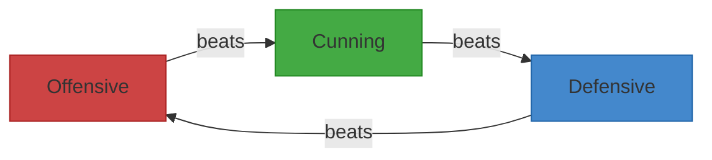
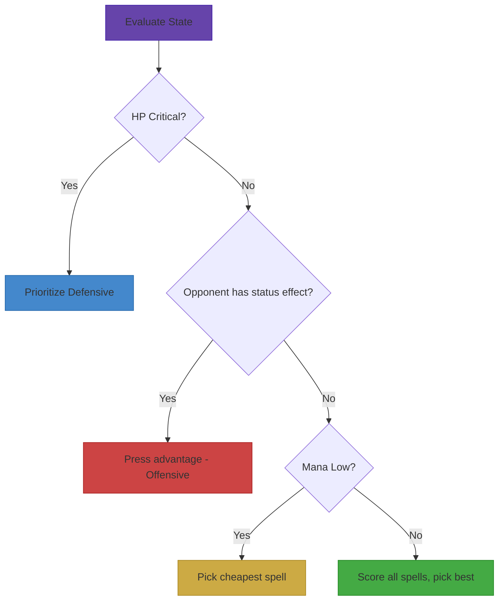
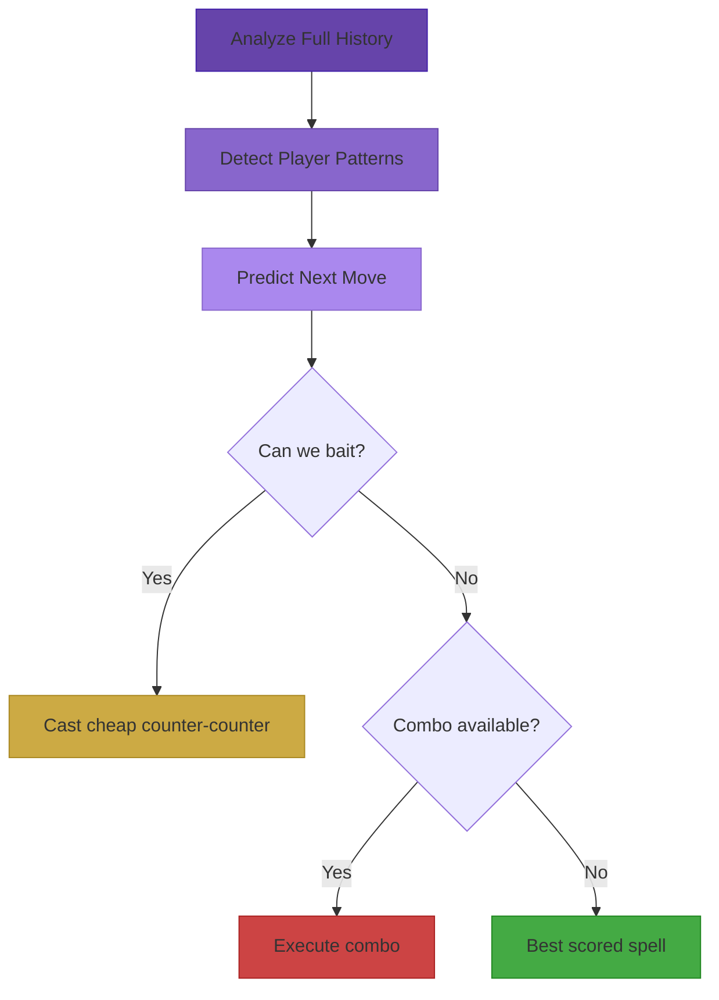
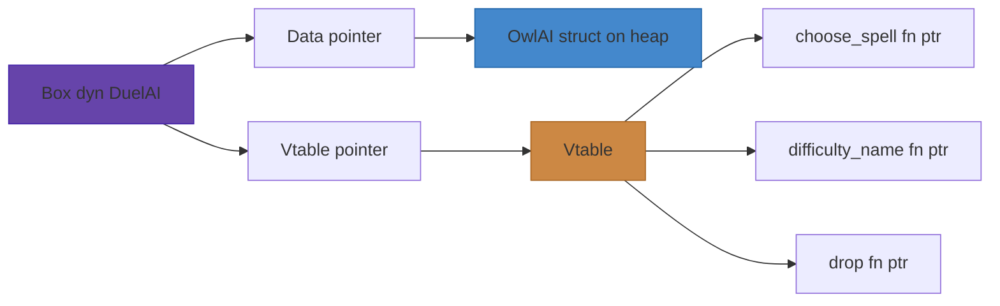
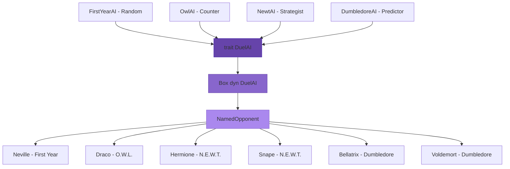

# Act 2 — The Dark Arts

> *"The Dark Arts are many, varied, ever-changing, and eternal. Fighting them is like fighting a many-headed monster, which, each time a neck is severed, sprouts a head even fiercer and cleverer than before."* — Severus Snape

> [!note] Type Widening from Act 1
> In Act 1, we used `u8` for spell stats like `mana_cost` and `damage` — fine for values under 255. As spells get more powerful in Act 2, we widen to `u32` to accommodate larger values. Update your Spell struct fields from `u8` to `u32` before proceeding. The field `damage` is also renamed to `base_damage` for clarity now that AI scoring needs to distinguish base from modified damage.

In Act 1 you built a duel engine: spells, wizards, type advantages, status effects, and a working combat loop. Your wizard can fight — but only against yourself. Every great duelist needs a worthy opponent.

In this act, we build **four AI opponents** of increasing intelligence, then unify them behind Rust's most powerful abstraction: **trait objects**. By the end, you'll face Voldemort himself.

## What You'll Learn

| Stage | Topic | Rust Concept | Difficulty |
|-------|-------|-------------|------------|
| 9 | Random AI | `rand` crate, filtering iterators | Easy |
| 10 | Counter AI | Sliding window, weighted random | Medium |
| 11 | Strategist AI | State evaluation, scoring | Medium |
| 12 | Predictor AI | Pattern detection, combo planning | Hard |
| 13 | Trait Objects | `dyn Trait`, vtables, object safety | Medium |
| 14 | Named Opponents | Composition, personality wrappers | Easy |

## Prerequisites from Act 1

Make sure your codebase has these types. If anything looks unfamiliar, revisit Act 1.

```rust
#[derive(Debug, Clone, Copy, PartialEq)]
pub enum SpellType {
    Offensive,
    Defensive,
    Cunning,
}

#[derive(Debug, Clone)]
pub struct Spell {
    pub name: String,
    pub spell_type: SpellType,
    pub mana_cost: u32,
    pub base_damage: u32,
    pub status_effect: Option<StatusEffect>,
}

#[derive(Debug, Clone, Copy, PartialEq)]
pub enum StatusEffect {
    Burn,
    Bleed,
    Stun,
    Confuse,
    Disarm,
}

#[derive(Debug, Clone)]
pub struct Wizard {
    pub name: String,
    pub hp: i32,
    pub max_hp: i32,
    pub mana: u32,
    pub max_mana: u32,
    pub spells: Vec<Spell>,
    pub active_effects: Vec<StatusEffect>,
}
```

We'll also need a `Turn` record for AI history tracking. Add this if you don't have it:

```rust
/// A record of one turn in the duel — who cast what.
#[derive(Debug, Clone)]
pub struct Turn {
    pub caster: String,
    pub spell: Spell,
    pub damage_dealt: u32,
}
```

And a type for what the AI returns:

```rust
/// The AI's decision: cast a spell by index, or pass (do nothing).
#[derive(Debug, Clone)]
pub enum SpellChoice {
    Cast(usize),  // index into the wizard's spell list
    Pass,         // skip turn, recover 5 mana
}
```

---

## Stage 9 — The Random Opponent

> *"Troll... in the dungeons... thought you ought to know."* — Professor Quirrell

Your duel engine works, but playing against yourself gets old fast. Every game needs an opponent, and the simplest AI is one that picks randomly — like a panicked first-year flinging whatever spell comes to mind. This stage is deliberately simple because the *real* lesson isn't the AI logic; it's learning how to add external crates and filter iterators, patterns you'll use in every stage that follows.

Our first AI is as sophisticated as a mountain troll: it picks a random spell it can actually afford. Simple — but it teaches you how to add external crates and filter with iterators.

### Adding the `rand` Crate

Rust's standard library doesn't include random number generation. We need the `rand` crate.

```toml
# In Cargo.toml, under [dependencies]:
rand = "0.9"
```

If you're coming from Python, this is like `pip install` — except Cargo handles it automatically when you build.

### The First Year AI

A First Year student panics and casts whatever comes to mind — as long as they have enough mana.

```rust
use rand::seq::IndexedRandom; // gives us .choose() on slices
use rand::rng;              // gives us a random number generator

/// First Year AI: picks a random spell it can afford.
/// If no spell is affordable, passes.
pub fn first_year_choose(wizard: &Wizard) -> SpellChoice {
    // rand::rng() creates a random number generator seeded by the OS.
    // In Python you'd just call random.choice(). In Rust, you need an
    // explicit RNG because Rust doesn't hide global mutable state.
    let mut rng = rand::rng();

    // Collect indices of all spells we can afford into a Vec.
    // enumerate() gives us (index, spell) pairs — like Python's enumerate().
    let affordable: Vec<usize> = wizard
        .spells
        .iter()
        .enumerate()
        .filter(|(_, spell)| spell.mana_cost <= wizard.mana)
        .map(|(i, _)| i)  // we only need the index
        .collect();

    // .choose() picks a random element from a slice.
    // It returns Option<&usize> — None if the slice is empty.
    match affordable.choose(&mut rng) {
        Some(&index) => SpellChoice::Cast(index),
        None => SpellChoice::Pass,
    }
}
```

Let's walk through the key lines:

- **`let mut rng = rand::rng()`** — The `mut` is required because generating a random number *mutates* the generator's internal state. Python hides this behind `random.choice()`, but Rust makes mutation explicit.
- **`.filter(|(_, spell)| ...)`** — The `(_, spell)` destructures the tuple. The `_` ignores the index inside the filter since we only care about mana cost here.
- **`.map(|(i, _)| i)`** — Now we throw away the spell and keep just the index. We need indices because `SpellChoice::Cast` takes a `usize`.
- **`.collect()`** — Transforms the iterator into a `Vec<usize>`. Rust infers the type from our annotation.
- **`Some(&index)`** — The `&` in the pattern *dereferences* the reference. `choose()` returns `Option<&usize>`, but we want a `usize`, not a reference to one.

### Testing the First Year

How do you test randomness? You don't test *which* spell it picks — you test that it *always picks a valid one*.

```rust
#[cfg(test)]
mod tests {
    use super::*;

    /// Helper: create a wizard with specific mana and spells.
    fn make_wizard(mana: u32, spells: Vec<Spell>) -> Wizard {
        Wizard {
            name: "Test Wizard".to_string(),
            hp: 100,
            max_hp: 100,
            mana,
            max_mana: 100,
            spells,
            active_effects: vec![],
        }
    }

    fn cheap_spell() -> Spell {
        Spell {
            name: "Lumos".to_string(),
            spell_type: SpellType::Cunning,
            mana_cost: 5,
            base_damage: 10,
            status_effect: None,
        }
    }

    fn expensive_spell() -> Spell {
        Spell {
            name: "Avada Kedavra".to_string(),
            spell_type: SpellType::Offensive,
            mana_cost: 80,
            base_damage: 100,
            status_effect: None,
        }
    }

    #[test]
    fn first_year_always_picks_affordable_spell() {
        // Wizard has 10 mana: can afford Lumos (5) but not Avada Kedavra (80)
        let wizard = make_wizard(10, vec![cheap_spell(), expensive_spell()]);

        // Run 100 times — randomness means we test the distribution
        for _ in 0..100 {
            match first_year_choose(&wizard) {
                SpellChoice::Cast(index) => {
                    // The chosen spell must be affordable
                    assert!(wizard.spells[index].mana_cost <= wizard.mana);
                }
                SpellChoice::Pass => {
                    panic!("Should not pass when an affordable spell exists");
                }
            }
        }
    }

    #[test]
    fn first_year_passes_when_broke() {
        // Wizard has 0 mana — can't cast anything
        let wizard = make_wizard(0, vec![cheap_spell(), expensive_spell()]);

        // Should always pass
        for _ in 0..100 {
            assert!(matches!(first_year_choose(&wizard), SpellChoice::Pass));
        }
    }
}
```

Run the tests:

```bash
cargo test first_year
```

**Key testing insight**: We run the random function 100 times. If there's a bug where it occasionally picks an unaffordable spell, 100 iterations makes it very likely we'll catch it. This is called **property-based testing** in spirit — we test a *property* ("always affordable") rather than a specific outcome.

> [!warning] Common Mistakes
> **Forgetting `mut` on the RNG:**
> ```rust
> // WRONG — won't compile
> let rng = rand::rng();
> affordable.choose(&rng); // error: cannot borrow as mutable
>
> // RIGHT — RNG needs mutation to generate numbers
> let mut rng = rand::rng();
> affordable.choose(&mut rng);
> ```
>
> **Indexing into an empty Vec:**
> ```rust
> // WRONG — panics if no affordable spells
> let index = affordable[rng.gen_range(0..affordable.len())];
>
> // RIGHT — .choose() returns Option, forcing you to handle empty
> match affordable.choose(&mut rng) { ... }
> ```
>
> This is Rust's philosophy: the type system *forces* you to handle edge cases that would be runtime crashes in Python.
>
> The First Year AI works, but it's trivially beatable — just cast your strongest spell every turn. Stage 10 builds an AI that actually *watches* what you do and counters it.

---

## Stage 10 — The Counter

> *"Honestly, am I the only person who's ever bothered to read Hogwarts, A History?"* — Hermione Granger

A random AI is a punching bag. The Counter AI is the first opponent that makes you *think* — it tracks your recent spells and picks the type that beats your favorite. This teaches you sliding-window analysis over history data and weighted randomness, both of which are building blocks for the smarter AIs ahead.

A First Year flails randomly. An O.W.L.-level student *watches* you. They track your last three spells and pick the type that counters your favorite. Remember the type triangle from Act 1:



If you keep throwing Offensive spells, the O.W.L. AI picks Defensive to counter you.

### Tracking History

We need a helper to figure out which type counters another:

```rust
/// Returns the SpellType that beats the given type.
/// This is the type triangle: Off > Cun > Def > Off.
fn counter_type(spell_type: SpellType) -> SpellType {
    match spell_type {
        SpellType::Offensive => SpellType::Defensive, // shield beats sword
        SpellType::Defensive => SpellType::Cunning,   // cunning bypasses shields
        SpellType::Cunning => SpellType::Offensive,   // raw power beats tricks
    }
}
```

### The O.W.L. AI

```rust
use rand::distributions::WeightedIndex;
use rand::prelude::*;

/// O.W.L. AI: tracks the player's last 3 spells and favors the counter-type.
///
/// Strategy:
/// - Look at the opponent's recent spell types
/// - Find the most common type in their last 3 turns
/// - Pick spells of the counter-type 60% of the time
/// - Pick randomly the other 40%
pub fn owl_choose(
    wizard: &Wizard,
    history: &[Turn],
    opponent_name: &str,
) -> SpellChoice {
    let mut rng = rand::rng();

    // Collect affordable spell indices — same as First Year
    let affordable: Vec<usize> = wizard
        .spells
        .iter()
        .enumerate()
        .filter(|(_, s)| s.mana_cost <= wizard.mana)
        .map(|(i, _)| i)
        .collect();

    if affordable.is_empty() {
        return SpellChoice::Pass;
    }

    // Look at the opponent's last 3 turns.
    // .iter().rev() walks backward through history.
    // .filter() keeps only the opponent's turns.
    // .take(3) grabs at most 3.
    let recent_opponent_types: Vec<SpellType> = history
        .iter()
        .rev()
        .filter(|turn| turn.caster == opponent_name)
        .take(3)
        .map(|turn| turn.spell.spell_type)
        .collect();

    // If no history yet, fall back to random (like a First Year)
    if recent_opponent_types.is_empty() {
        let &index = affordable.choose(&mut rng).unwrap();
        return SpellChoice::Cast(index);
    }

    // Count how often each type appears in recent history.
    // In Python you'd use collections.Counter. In Rust, we count manually.
    let mut off_count = 0u32;
    let mut def_count = 0u32;
    let mut cun_count = 0u32;

    for spell_type in &recent_opponent_types {
        match spell_type {
            SpellType::Offensive => off_count += 1,
            SpellType::Defensive => def_count += 1,
            SpellType::Cunning => cun_count += 1,
        }
    }

    // Find the most common type. If tied, pick the first one
    // (doesn't matter much — ties mean the opponent is balanced).
    let dominant = if off_count >= def_count && off_count >= cun_count {
        SpellType::Offensive
    } else if def_count >= cun_count {
        SpellType::Defensive
    } else {
        SpellType::Cunning
    };

    // The type we WANT to cast: the counter to their dominant type
    let desired = counter_type(dominant);

    // Split affordable spells into "counter" and "other"
    let counter_spells: Vec<usize> = affordable
        .iter()
        .filter(|&&i| wizard.spells[i].spell_type == desired)
        .copied()  // converts &&usize to usize
        .collect();

    let other_spells: Vec<usize> = affordable
        .iter()
        .filter(|&&i| wizard.spells[i].spell_type != desired)
        .copied()
        .collect();

    // Weighted random: 60% chance to pick from counter_spells,
    // 40% chance to pick from other_spells.
    // If one group is empty, pick from the other.
    if counter_spells.is_empty() {
        let &index = other_spells.choose(&mut rng).unwrap();
        return SpellChoice::Cast(index);
    }
    if other_spells.is_empty() {
        let &index = counter_spells.choose(&mut rng).unwrap();
        return SpellChoice::Cast(index);
    }

    // WeightedIndex lets us pick between two options with custom probabilities.
    // weights [60, 40] means: 60% chance of index 0, 40% chance of index 1.
    let weights = [60u32, 40];
    let dist = WeightedIndex::new(&weights).unwrap();

    if dist.sample(&mut rng) == 0 {
        // 60% — pick a counter spell
        let &index = counter_spells.choose(&mut rng).unwrap();
        SpellChoice::Cast(index)
    } else {
        // 40% — pick something else
        let &index = other_spells.choose(&mut rng).unwrap();
        SpellChoice::Cast(index)
    }
}
```

### Key Concepts

**`.copied()`** — When you filter `&&usize` references, `.copied()` dereferences them to plain `usize`. It's like doing `[*x for x in refs]` in Python. Only works on `Copy` types (numbers, bools, etc.).

**`WeightedIndex`** — This is how you do weighted random in Rust. In Python you'd use `random.choices(population, weights=[60, 40])`. The Rust version is more explicit: you create a distribution, then sample from it.

### Testing the Counter

```rust
#[test]
fn owl_counters_offensive_with_defensive() {
    // Give the AI both Defensive and Offensive spells
    let wizard = make_wizard(100, vec![
        Spell {
            name: "Protego".to_string(),
            spell_type: SpellType::Defensive,
            mana_cost: 10,
            base_damage: 5,
            status_effect: None,
        },
        Spell {
            name: "Stupefy".to_string(),
            spell_type: SpellType::Offensive,
            mana_cost: 10,
            base_damage: 20,
            status_effect: None,
        },
    ]);

    // Fake history: opponent cast 3 Offensive spells in a row
    let history = vec![
        Turn {
            caster: "Harry".to_string(),
            spell: Spell {
                name: "Expelliarmus".to_string(),
                spell_type: SpellType::Offensive,
                mana_cost: 15,
                base_damage: 25,
                status_effect: None,
            },
            damage_dealt: 25,
        },
        Turn {
            caster: "Harry".to_string(),
            spell: Spell {
                name: "Stupefy".to_string(),
                spell_type: SpellType::Offensive,
                mana_cost: 10,
                base_damage: 20,
                status_effect: None,
            },
            damage_dealt: 20,
        },
        Turn {
            caster: "Harry".to_string(),
            spell: Spell {
                name: "Reducto".to_string(),
                spell_type: SpellType::Offensive,
                mana_cost: 20,
                base_damage: 30,
                status_effect: None,
            },
            damage_dealt: 30,
        },
    ];

    // Run 200 times and count how often it picks Defensive
    let mut defensive_count = 0;
    for _ in 0..200 {
        if let SpellChoice::Cast(index) = owl_choose(&wizard, &history, "Harry") {
            if wizard.spells[index].spell_type == SpellType::Defensive {
                defensive_count += 1;
            }
        }
    }

    // Should pick Defensive roughly 60% of the time (120/200).
    // We use a wide margin because randomness is noisy.
    assert!(
        defensive_count > 80,
        "Expected mostly Defensive picks, got {}/200",
        defensive_count
    );
}

#[test]
fn owl_falls_back_to_random_with_no_history() {
    let wizard = make_wizard(100, vec![cheap_spell()]);
    let history: Vec<Turn> = vec![];

    // With no history, should still pick a valid spell (not panic)
    for _ in 0..50 {
        match owl_choose(&wizard, &history, "Harry") {
            SpellChoice::Cast(index) => {
                assert!(index < wizard.spells.len());
            }
            SpellChoice::Pass => panic!("Should cast when mana is available"),
        }
    }
}
```

```bash
cargo test owl
```

> [!warning] Common Mistakes
> **Forgetting to filter by opponent name:**
> ```rust
> // WRONG — counts YOUR spells too, not just the opponent's
> let recent: Vec<_> = history.iter().rev().take(3).collect();
>
> // RIGHT — only look at the opponent's turns
> let recent: Vec<_> = history
>     .iter()
>     .rev()
>     .filter(|t| t.caster == opponent_name)
>     .take(3)
>     .collect();
> ```
>
> **Using `unwrap()` on `choose()` without checking empty:**
> ```rust
> // WRONG — panics if affordable is empty
> let &index = affordable.choose(&mut rng).unwrap();
>
> // RIGHT — check first
> if affordable.is_empty() {
>     return SpellChoice::Pass;
> }
> ```
>
> The Counter AI reacts to what you *did*, but it doesn't think about what it *should* do. Stage 11 builds a Strategist that evaluates the current game state — HP, mana, status effects — and makes proactive decisions.

---

## Stage 11 — The Strategist

> *"It does not do to dwell on dreams and forget to live."* — Albus Dumbledore

The Counter AI is reactive — it looks backward at what you did. The Strategist looks *inward* at the current game state and makes decisions based on priorities: survive when low, press advantage when the opponent is suffering, conserve mana when running dry. This is where AI starts feeling intelligent, and where you learn to score and rank options using floating-point math and iterator adapters like `min_by_key` and `max_by`.

The O.W.L. AI reacts to what you *did*. The N.E.W.T. AI thinks about what it *should* do. It evaluates the current game state — HP, mana, status effects — and makes strategic decisions.

This is where we move from reactive to proactive AI.

### Decision Framework

The Strategist scores each affordable spell based on the current situation:



### The N.E.W.T. AI

```rust
/// N.E.W.T. AI: evaluates game state and makes strategic decisions.
///
/// Priority order:
/// 1. If HP < 30% → favor Defensive spells (survival)
/// 2. If opponent has a status effect → favor Offensive (press advantage)
/// 3. If mana < 20% → pick the cheapest affordable spell
/// 4. Otherwise → score each spell and pick the best
pub fn newt_choose(
    wizard: &Wizard,
    opponent: &Wizard,
    history: &[Turn],
    opponent_name: &str,
) -> SpellChoice {
    let mut rng = rand::rng();

    let affordable: Vec<usize> = wizard
        .spells
        .iter()
        .enumerate()
        .filter(|(_, s)| s.mana_cost <= wizard.mana)
        .map(|(i, _)| i)
        .collect();

    if affordable.is_empty() {
        return SpellChoice::Pass;
    }

    // Calculate health and mana percentages.
    // We cast to f32 for division — integer division would truncate.
    let hp_pct = wizard.hp as f32 / wizard.max_hp as f32;
    let mana_pct = wizard.mana as f32 / wizard.max_mana as f32;

    // PRIORITY 1: Survival mode — HP is critical
    if hp_pct < 0.3 {
        // Look for Defensive spells (shields, heals)
        let defensive: Vec<usize> = affordable
            .iter()
            .filter(|&&i| wizard.spells[i].spell_type == SpellType::Defensive)
            .copied()
            .collect();

        if !defensive.is_empty() {
            let &index = defensive.choose(&mut rng).unwrap();
            return SpellChoice::Cast(index);
        }
        // No Defensive spells available — fall through to scoring
    }

    // PRIORITY 2: Press advantage — opponent is suffering
    if !opponent.active_effects.is_empty() {
        let offensive: Vec<usize> = affordable
            .iter()
            .filter(|&&i| wizard.spells[i].spell_type == SpellType::Offensive)
            .copied()
            .collect();

        if !offensive.is_empty() {
            let &index = offensive.choose(&mut rng).unwrap();
            return SpellChoice::Cast(index);
        }
    }

    // PRIORITY 3: Conserve mana — pick the cheapest spell
    if mana_pct < 0.2 {
        // min_by_key finds the element with the smallest value of the closure.
        // In Python: min(affordable, key=lambda i: wizard.spells[i].mana_cost)
        let &cheapest = affordable
            .iter()
            .min_by_key(|&&i| wizard.spells[i].mana_cost)
            .unwrap(); // safe: affordable is non-empty (checked above)
        return SpellChoice::Cast(cheapest);
    }

    // PRIORITY 4: Score each spell and pick the best
    let scored: Vec<(usize, f32)> = affordable
        .iter()
        .map(|&i| {
            let spell = &wizard.spells[i];
            let score = score_spell(spell, wizard, opponent, history, opponent_name);
            (i, score)
        })
        .collect();

    // Pick the spell with the highest score.
    // f32 doesn't implement Ord (because NaN), so we use partial_cmp.
    // .unwrap_or(std::cmp::Ordering::Equal) handles the NaN case safely.
    let &(best_index, _) = scored
        .iter()
        .max_by(|(_, a), (_, b)| {
            a.partial_cmp(b).unwrap_or(std::cmp::Ordering::Equal)
        })
        .unwrap();

    SpellChoice::Cast(best_index)
}

/// Score a spell based on the current game state.
/// Higher score = better choice right now.
fn score_spell(
    spell: &Spell,
    wizard: &Wizard,
    opponent: &Wizard,
    history: &[Turn],
    opponent_name: &str,
) -> f32 {
    let mut score: f32 = 0.0;

    // Base score: damage per mana (efficiency).
    // A spell that does 30 damage for 10 mana scores 3.0.
    // A spell that does 30 damage for 30 mana scores 1.0.
    if spell.mana_cost > 0 {
        score += spell.base_damage as f32 / spell.mana_cost as f32;
    }

    // Bonus for type advantage.
    // Look at what the opponent cast last — if we counter it, bonus points.
    let last_opponent_type = history
        .iter()
        .rev()
        .find(|t| t.caster == opponent_name)
        .map(|t| t.spell.spell_type);

    if let Some(opp_type) = last_opponent_type {
        if spell.spell_type == counter_type(opp_type) {
            score += 2.0; // type advantage bonus
        }
    }

    // Bonus for status effects — they compound over time
    if spell.status_effect.is_some() {
        score += 1.5;
    }

    // Bonus for finishing potential — if this spell could KO the opponent
    if spell.base_damage as i32 >= opponent.hp {
        score += 5.0; // go for the kill
    }

    // Penalty for overkill mana spending when opponent is almost dead
    if opponent.hp < 20 && spell.mana_cost > 30 {
        score -= 2.0; // don't waste mana on a dying opponent
    }

    score
}
```

### Key Concepts

**`as f32` casting** — Rust doesn't implicitly convert between number types. `wizard.hp as f32` explicitly converts `i32` to `f32`. In Python, division always produces floats. In Rust, `10 / 3` is `3` (integer division), but `10.0 / 3.0` is `3.333...`.

**`min_by_key` and `max_by`** — These are iterator adapters for finding extremes. `min_by_key` takes a closure that extracts a comparable value. `max_by` takes a closure that compares two elements directly — needed here because `f32` doesn't implement `Ord`.

**Why `f32` doesn't implement `Ord`** — IEEE 754 floats have `NaN`, which isn't equal to anything (not even itself). This breaks the total ordering requirement. Rust's type system catches this at compile time. In Python, `float('nan') < 1.0` silently returns `False` — a subtle bug source.

### Testing the Strategist

```rust
#[test]
fn newt_prioritizes_defense_when_low_hp() {
    let wizard = Wizard {
        name: "AI".to_string(),
        hp: 15,       // 15% HP — critical!
        max_hp: 100,
        mana: 50,
        max_mana: 100,
        spells: vec![
            Spell {
                name: "Stupefy".to_string(),
                spell_type: SpellType::Offensive,
                mana_cost: 10,
                base_damage: 20,
                status_effect: None,
            },
            Spell {
                name: "Protego".to_string(),
                spell_type: SpellType::Defensive,
                mana_cost: 10,
                base_damage: 5,
                status_effect: None,
            },
        ],
        active_effects: vec![],
    };

    let opponent = make_wizard(100, vec![]);
    let history: Vec<Turn> = vec![];

    // At 15% HP, should always pick Defensive
    for _ in 0..50 {
        if let SpellChoice::Cast(index) = newt_choose(&wizard, &opponent, &history, "Harry") {
            assert_eq!(
                wizard.spells[index].spell_type,
                SpellType::Defensive,
                "At critical HP, should pick Defensive, got {:?}",
                wizard.spells[index].name
            );
        }
    }
}

#[test]
fn newt_presses_advantage_against_status_effects() {
    let wizard = make_wizard(100, vec![
        Spell {
            name: "Stupefy".to_string(),
            spell_type: SpellType::Offensive,
            mana_cost: 10,
            base_damage: 20,
            status_effect: None,
        },
        Spell {
            name: "Protego".to_string(),
            spell_type: SpellType::Defensive,
            mana_cost: 10,
            base_damage: 5,
            status_effect: None,
        },
    ]);

    // Opponent is burning — press the advantage!
    let mut opponent = make_wizard(80, vec![]);
    opponent.active_effects.push(StatusEffect::Burn);

    let history: Vec<Turn> = vec![];

    for _ in 0..50 {
        if let SpellChoice::Cast(index) = newt_choose(&wizard, &opponent, &history, "Harry") {
            assert_eq!(
                wizard.spells[index].spell_type,
                SpellType::Offensive,
                "Should press advantage with Offensive when opponent has status effect"
            );
        }
    }
}

#[test]
fn newt_picks_cheapest_when_mana_low() {
    let wizard = Wizard {
        name: "AI".to_string(),
        hp: 100,
        max_hp: 100,
        mana: 15,      // 15% mana — conserve!
        max_mana: 100,
        spells: vec![
            Spell {
                name: "Stupefy".to_string(),
                spell_type: SpellType::Offensive,
                mana_cost: 15,
                base_damage: 20,
                status_effect: None,
            },
            Spell {
                name: "Lumos".to_string(),
                spell_type: SpellType::Cunning,
                mana_cost: 5,
                base_damage: 8,
                status_effect: None,
            },
        ],
        active_effects: vec![],
    };

    let opponent = make_wizard(100, vec![]);
    let history: Vec<Turn> = vec![];

    // At 15% mana, should pick the cheapest spell (Lumos at 5 mana)
    if let SpellChoice::Cast(index) = newt_choose(&wizard, &opponent, &history, "Harry") {
        assert_eq!(wizard.spells[index].name, "Lumos");
    }
}
```

```bash
cargo test newt
```

The Strategist evaluates the present, but it can't anticipate the future. Stage 12 builds the Predictor — an AI that detects your patterns, predicts your next move, and even baits you into wasting counters.

---

## Stage 12 — The Predictor

> *"It is our choices, Harry, that show what we truly are, far more than our abilities."* — Albus Dumbledore

The Dumbledore AI is the culmination of everything you've built — it combines counter-analysis, state evaluation, *and* pattern prediction into one opponent. It detects your habits, baits you into wasting counters, and plans multi-turn combos. This is the hardest AI to implement and the most satisfying to beat. It also teaches you sliding windows (`.windows(2)`), opponent profiling, and how to balance determinism with controlled randomness.

The Dumbledore AI doesn't just react to what you did or evaluate the current state — it *predicts what you'll do next* and plans multiple moves ahead. This is the hardest AI to implement and the most satisfying to beat.

### Strategy Overview

The Predictor combines everything from the previous AIs and adds:

- **Pattern detection**: Does the player favor a type? Do they alternate? Do they panic with Defensive when low?
- **Baiting**: Cast cheap spells to waste the opponent's counters, then strike with expensive ones
- **Mana management**: Save mana for devastating combos
- **Prediction**: Use HP, mana, and status to guess what the opponent will do



### Pattern Detection

Right now our AIs look at raw history — individual turns. But to predict behavior, we need to distill that history into a *profile*: how often does the opponent favor each type? Do they repeat themselves? Do they panic when low on HP? This struct captures those tendencies so the Dumbledore AI can reason about them.

```rust
/// Analyze the opponent's full history to detect patterns.
/// Returns a "profile" of the opponent's tendencies.
#[derive(Debug)]
struct OpponentProfile {
    /// How often each type is used (0.0 to 1.0)
    type_frequency: [f32; 3], // [Offensive, Defensive, Cunning]
    /// Does the opponent tend to repeat the same type?
    repeat_tendency: f32,
    /// Does the opponent switch to Defensive when HP is low?
    panic_defensive: bool,
}

fn analyze_opponent(history: &[Turn], opponent_name: &str) -> OpponentProfile {
    // Collect all opponent turns
    let opponent_turns: Vec<&Turn> = history
        .iter()
        .filter(|t| t.caster == opponent_name)
        .collect();

    let total = opponent_turns.len() as f32;

    if total == 0.0 {
        return OpponentProfile {
            type_frequency: [0.33, 0.33, 0.34],
            repeat_tendency: 0.0,
            panic_defensive: false,
        };
    }

    // Count type frequencies
    let mut counts = [0u32; 3];
    for turn in &opponent_turns {
        match turn.spell.spell_type {
            SpellType::Offensive => counts[0] += 1,
            SpellType::Defensive => counts[1] += 1,
            SpellType::Cunning => counts[2] += 1,
        }
    }
    let type_frequency = [
        counts[0] as f32 / total,
        counts[1] as f32 / total,
        counts[2] as f32 / total,
    ];

    // Detect repeat tendency: how often does the opponent cast the same
    // type twice in a row?
    let mut repeats = 0u32;
    let mut transitions = 0u32;
    // .windows(2) gives us overlapping pairs: [a,b], [b,c], [c,d]...
    // Like Python's zip(list, list[1:])
    for pair in opponent_turns.windows(2) {
        transitions += 1;
        if pair[0].spell.spell_type == pair[1].spell.spell_type {
            repeats += 1;
        }
    }
    let repeat_tendency = if transitions > 0 {
        repeats as f32 / transitions as f32
    } else {
        0.0
    };

    // Detect panic behavior: in the last 5 turns, did they switch to
    // Defensive after taking heavy damage?
    let panic_defensive = opponent_turns
        .iter()
        .rev()
        .take(5)
        .any(|t| t.spell.spell_type == SpellType::Defensive && t.damage_dealt > 20);

    OpponentProfile {
        type_frequency,
        repeat_tendency,
        panic_defensive,
    }
}
```

### The Dumbledore AI

```rust
/// Dumbledore AI: predicts opponent behavior and plans ahead.
pub fn dumbledore_choose(
    wizard: &Wizard,
    opponent: &Wizard,
    history: &[Turn],
    opponent_name: &str,
) -> SpellChoice {
    let mut rng = rand::rng();

    let affordable: Vec<usize> = wizard
        .spells
        .iter()
        .enumerate()
        .filter(|(_, s)| s.mana_cost <= wizard.mana)
        .map(|(i, _)| i)
        .collect();

    if affordable.is_empty() {
        return SpellChoice::Pass;
    }

    let profile = analyze_opponent(history, opponent_name);

    // PHASE 1: Predict what the opponent will cast next
    let predicted_type = predict_next_type(&profile, opponent);

    // PHASE 2: Check for bait opportunity
    // If we have lots of mana and the opponent is predictable,
    // cast a cheap spell of the type they'll counter — wasting their turn.
    // Then next turn, hit them with the real attack.
    if let Some(bait_index) = find_bait_spell(wizard, &affordable, predicted_type) {
        let mana_pct = wizard.mana as f32 / wizard.max_mana as f32;
        // Only bait if we have mana to spare (>60%) and a coin flip agrees.
        // The coin flip adds unpredictability — even Dumbledore isn't robotic.
        if mana_pct > 0.6 && rng.gen_bool(0.4) {
            return SpellChoice::Cast(bait_index);
        }
    }

    // PHASE 3: Check for combo opportunity
    // If opponent has a status effect AND we have a high-damage spell, go for it
    if !opponent.active_effects.is_empty() {
        if let Some(finisher) = find_finisher(wizard, &affordable) {
            return SpellChoice::Cast(finisher);
        }
    }

    // PHASE 4: Score spells with prediction bonus
    let counter = counter_type(predicted_type);

    let scored: Vec<(usize, f32)> = affordable
        .iter()
        .map(|&i| {
            let spell = &wizard.spells[i];
            let mut score = score_spell(spell, wizard, opponent, history, opponent_name);

            // Bonus for countering the predicted type
            if spell.spell_type == counter {
                score += 3.0;
            }

            // Bonus for status effects against a healthy opponent
            // (status effects compound — apply them early)
            if spell.status_effect.is_some() && opponent.hp > 50 {
                score += 2.0;
            }

            // Penalty for predictability — if we've cast this type a lot,
            // a smart opponent will counter us. Mix it up.
            let our_turns: Vec<&Turn> = history
                .iter()
                .rev()
                .filter(|t| t.caster != opponent_name)
                .take(5)
                .collect();
            let same_type_count = our_turns
                .iter()
                .filter(|t| t.spell.spell_type == spell.spell_type)
                .count();
            if same_type_count >= 3 {
                score -= 1.5; // we're being predictable, mix it up
            }

            (i, score)
        })
        .collect();

    let &(best_index, _) = scored
        .iter()
        .max_by(|(_, a), (_, b)| {
            a.partial_cmp(b).unwrap_or(std::cmp::Ordering::Equal)
        })
        .unwrap();

    SpellChoice::Cast(best_index)
}

/// Predict what type the opponent will cast next based on their profile.
fn predict_next_type(profile: &OpponentProfile, opponent: &Wizard) -> SpellType {
    // If opponent HP is low and they tend to panic, predict Defensive
    let hp_pct = opponent.hp as f32 / opponent.max_hp as f32;
    if hp_pct < 0.3 && profile.panic_defensive {
        return SpellType::Defensive;
    }

    // If opponent repeats a lot, predict they'll repeat their most common type
    if profile.repeat_tendency > 0.5 {
        return most_frequent_type(&profile.type_frequency);
    }

    // Otherwise, predict their most common type
    most_frequent_type(&profile.type_frequency)
}

/// Return the SpellType with the highest frequency.
fn most_frequent_type(freq: &[f32; 3]) -> SpellType {
    if freq[0] >= freq[1] && freq[0] >= freq[2] {
        SpellType::Offensive
    } else if freq[1] >= freq[2] {
        SpellType::Defensive
    } else {
        SpellType::Cunning
    }
}

/// Find a cheap spell to use as bait.
/// Bait = a spell of the type the opponent will try to counter.
/// We WANT them to counter it, because it's cheap and we lose little.
fn find_bait_spell(
    wizard: &Wizard,
    affordable: &[usize],
    predicted_opponent_type: SpellType,
) -> Option<usize> {
    // The opponent will try to counter our predicted type.
    // So we cast a cheap spell of the type they EXPECT us to use.
    // They waste their counter, and next turn we hit with something else.
    let bait_type = counter_type(predicted_opponent_type);

    affordable
        .iter()
        .filter(|&&i| {
            let spell = &wizard.spells[i];
            spell.spell_type == bait_type && spell.mana_cost <= 15
        })
        .min_by_key(|&&i| wizard.spells[i].mana_cost)
        .copied()
}

/// Find the highest-damage affordable spell for a finishing blow.
fn find_finisher(wizard: &Wizard, affordable: &[usize]) -> Option<usize> {
    affordable
        .iter()
        .max_by_key(|&&i| wizard.spells[i].base_damage)
        .copied()
}
```

### Key Concepts

**`.windows(2)`** — Creates a sliding window over a slice. `[1,2,3,4].windows(2)` yields `[1,2]`, `[2,3]`, `[3,4]`. In Python you'd do `zip(lst, lst[1:])`. This is how we detect consecutive same-type casts.

**`rng.gen_bool(0.4)`** — Returns `true` 40% of the time. Adds controlled randomness to prevent the AI from being perfectly predictable (which would itself be exploitable).

**Struct without `pub`** — `OpponentProfile` has no `pub` keyword. It's private to this module — only the AI functions use it. In Python, you'd prefix with `_`. In Rust, privacy is the default.

### Testing the Predictor

```rust
#[test]
fn dumbledore_detects_offensive_pattern() {
    let wizard = make_wizard(100, vec![
        Spell {
            name: "Protego".to_string(),
            spell_type: SpellType::Defensive,
            mana_cost: 10,
            base_damage: 5,
            status_effect: None,
        },
        Spell {
            name: "Stupefy".to_string(),
            spell_type: SpellType::Offensive,
            mana_cost: 15,
            base_damage: 25,
            status_effect: None,
        },
        Spell {
            name: "Confundo".to_string(),
            spell_type: SpellType::Cunning,
            mana_cost: 10,
            base_damage: 15,
            status_effect: Some(StatusEffect::Confuse),
        },
    ]);

    let opponent = make_wizard(100, vec![]);

    // Opponent has cast 8 Offensive spells — very predictable
    let history: Vec<Turn> = (0..8)
        .map(|_| Turn {
            caster: "Harry".to_string(),
            spell: Spell {
                name: "Stupefy".to_string(),
                spell_type: SpellType::Offensive,
                mana_cost: 15,
                base_damage: 25,
                status_effect: None,
            },
            damage_dealt: 25,
        })
        .collect();

    // Dumbledore should mostly pick Defensive (counters Offensive)
    let mut defensive_count = 0;
    for _ in 0..100 {
        if let SpellChoice::Cast(index) = dumbledore_choose(&wizard, &opponent, &history, "Harry")
        {
            if wizard.spells[index].spell_type == SpellType::Defensive {
                defensive_count += 1;
            }
        }
    }

    // Should favor Defensive, but not 100% (Dumbledore mixes it up)
    assert!(
        defensive_count > 40,
        "Expected Dumbledore to favor Defensive against Offensive pattern, got {}/100",
        defensive_count
    );
}

#[test]
fn analyze_opponent_handles_empty_history() {
    let profile = analyze_opponent(&[], "Harry");
    // Should return balanced frequencies, not panic
    assert!((profile.type_frequency[0] - 0.33).abs() < 0.02);
    assert_eq!(profile.repeat_tendency, 0.0);
    assert!(!profile.panic_defensive);
}
```

```bash
cargo test dumbledore
cargo test analyze_opponent
```

> [!warning] Common Mistakes
> **Borrowing `history` in a closure that also borrows `wizard`:**
> ```rust
> // This works fine because both are immutable borrows (&).
> // Rust allows multiple immutable borrows simultaneously.
> // You'd only hit trouble if one of them was &mut.
> let scored: Vec<_> = affordable.iter().map(|&i| {
>     let spell = &wizard.spells[i];  // borrows wizard
>     // ... also uses history ...      // borrows history
>     (i, score)
> }).collect();
> ```
>
> **Floating point comparison in tests:**
> ```rust
> // WRONG — floating point isn't exact
> assert_eq!(profile.type_frequency[0], 0.33);
>
> // RIGHT — use approximate comparison
> assert!((profile.type_frequency[0] - 0.33).abs() < 0.02);
> ```
>
> You now have four AI strategies of increasing sophistication — but they're all standalone functions with different signatures. Stage 13 unifies them behind a single trait, unlocking Rust's most powerful abstraction: trait objects and dynamic dispatch.

---

## Stage 13 — Trait Objects

> *"Differences of habit and language are nothing at all if our aims are identical and our hearts are open."* — Albus Dumbledore

You have four AI functions that all do the same thing — pick a spell — but with different signatures and strategies. Without a shared interface, every place that calls an AI needs an ugly `match` on the difficulty level, and adding a fifth AI means updating every call site. Traits solve this by defining a contract that all AIs must follow, and trait objects let you store and swap different AI types at runtime. This is the stage where Rust's type system goes from "helpful guardrails" to "powerful abstraction tool."

We have four AI functions: `first_year_choose`, `owl_choose`, `newt_choose`, `dumbledore_choose`. They all do the same thing — pick a spell — but with different signatures and strategies. Right now, if you want to switch between them, you need ugly `match` statements everywhere:

```rust
// UGLY: every place that calls the AI needs to know about all variants
let choice = match difficulty {
    "first_year" => first_year_choose(&ai_wizard),
    "owl" => owl_choose(&ai_wizard, &history, &player.name),
    "newt" => newt_choose(&ai_wizard, &player, &history, &player.name),
    "dumbledore" => dumbledore_choose(&ai_wizard, &player, &history, &player.name),
    _ => SpellChoice::Pass,
};
```

This is fragile. Add a fifth AI and you have to update every `match`. The signatures don't even match — `first_year_choose` doesn't take `history`.

The solution: **traits**.

### What Is a Trait?

A trait defines a *contract* — a set of methods that a type must implement. If you're coming from other languages:

| Language | Equivalent | Key Difference |
|----------|-----------|----------------|
| Python | ABC (Abstract Base Class) | Rust traits have no inheritance hierarchy |
| Java | Interface | Rust traits can't have state (fields) |
| Go | Interface | Rust traits are explicit (`impl Trait for Type`), not structural |

In Python, you'd write:

```python
from abc import ABC, abstractmethod

class DuelAI(ABC):
    @abstractmethod
    def choose_spell(self, own_state, opponent_state, history):
        pass

class FirstYearAI(DuelAI):
    def choose_spell(self, own_state, opponent_state, history):
        # random choice...
```

In Rust:

```rust
/// The trait that all AI opponents must implement.
/// This is the contract: "if you want to be a duel AI,
/// you must be able to choose a spell given the game state."
pub trait DuelAI {
    /// Choose a spell to cast this turn.
    ///
    /// - `own_state`: the AI wizard's current HP, mana, spells, effects
    /// - `opponent_state`: the player's current state
    /// - `history`: all turns so far in this duel
    ///
    /// Returns SpellChoice::Cast(index) or SpellChoice::Pass.
    fn choose_spell(
        &self,
        own_state: &Wizard,
        opponent_state: &Wizard,
        history: &[Turn],
    ) -> SpellChoice;

    /// Human-readable name for this AI difficulty.
    /// This has a default implementation — types CAN override it but don't have to.
    fn difficulty_name(&self) -> &str {
        "Unknown"
    }
}
```

Key things to notice:

- **`&self`** — Every trait method takes `&self` (or `&mut self`, or `self`). This is like Python's `self`. It's the instance the method is called on.
- **`&[Turn]`** — A *slice* reference. This is Rust's way of saying "a borrowed view into a sequence of Turns." It works with `Vec<Turn>`, arrays, or any contiguous sequence. In Python terms, it's like accepting any sequence without copying it.
- **Default implementation** — `difficulty_name()` has a body. Types that implement `DuelAI` get this for free unless they override it. Python ABCs can do this too, but it's less common.

### Implementing the Trait

Now we wrap each AI in a struct and implement the trait. The struct can hold configuration — the trait method uses `&self` to access it.

```rust
/// First Year AI: random spell selection.
/// The struct is empty because this AI has no configuration.
pub struct FirstYearAI;

impl DuelAI for FirstYearAI {
    fn choose_spell(
        &self,
        own_state: &Wizard,
        _opponent_state: &Wizard,  // underscore = we don't use this parameter
        _history: &[Turn],
    ) -> SpellChoice {
        // Same logic as before, now inside the trait impl
        let mut rng = rand::rng();

        let affordable: Vec<usize> = own_state
            .spells
            .iter()
            .enumerate()
            .filter(|(_, s)| s.mana_cost <= own_state.mana)
            .map(|(i, _)| i)
            .collect();

        match affordable.choose(&mut rng) {
            Some(&index) => SpellChoice::Cast(index),
            None => SpellChoice::Pass,
        }
    }

    fn difficulty_name(&self) -> &str {
        "First Year"
    }
}
```

```rust
/// O.W.L. AI: counter-based strategy.
/// Stores the opponent's name so we can filter history.
pub struct OwlAI {
    pub opponent_name: String,
}

impl DuelAI for OwlAI {
    fn choose_spell(
        &self,
        own_state: &Wizard,
        _opponent_state: &Wizard,
        history: &[Turn],
    ) -> SpellChoice {
        // Delegate to our existing function, passing self.opponent_name
        owl_choose(own_state, history, &self.opponent_name)
    }

    fn difficulty_name(&self) -> &str {
        "O.W.L."
    }
}
```

```rust
/// N.E.W.T. AI: state-evaluation strategy.
pub struct NewtAI {
    pub opponent_name: String,
}

impl DuelAI for NewtAI {
    fn choose_spell(
        &self,
        own_state: &Wizard,
        opponent_state: &Wizard,
        history: &[Turn],
    ) -> SpellChoice {
        newt_choose(own_state, opponent_state, history, &self.opponent_name)
    }

    fn difficulty_name(&self) -> &str {
        "N.E.W.T."
    }
}
```

```rust
/// Dumbledore AI: prediction and pattern detection.
pub struct DumbledoreAI {
    pub opponent_name: String,
}

impl DuelAI for DumbledoreAI {
    fn choose_spell(
        &self,
        own_state: &Wizard,
        opponent_state: &Wizard,
        history: &[Turn],
    ) -> SpellChoice {
        dumbledore_choose(own_state, opponent_state, history, &self.opponent_name)
    }

    fn difficulty_name(&self) -> &str {
        "Dumbledore"
    }
}
```

### Generics vs Trait Objects

Now, how do we *use* the trait? Rust gives you two options:

#### Option A: Generics (Static Dispatch)

```rust
/// The compiler generates a separate version of this function
/// for each concrete type: one for FirstYearAI, one for OwlAI, etc.
/// This is called "monomorphization" — the generic is erased at compile time.
fn run_ai_turn<A: DuelAI>(
    ai: &A,
    ai_wizard: &Wizard,
    player: &Wizard,
    history: &[Turn],
) -> SpellChoice {
    ai.choose_spell(ai_wizard, player, history)
}
```

The compiler knows the exact type at compile time, so it can inline the method call. **Fast, but inflexible** — you can't store different AI types in the same variable or collection.

```rust
// This WON'T work with generics:
let ais: Vec<???> = vec![FirstYearAI, OwlAI { ... }];
// What type goes in the Vec? FirstYearAI and OwlAI are different types!
```

#### Option B: Trait Objects (Dynamic Dispatch)

```rust
/// Box<dyn DuelAI> means "a heap-allocated value of ANY type that
/// implements DuelAI." The `dyn` keyword means "dynamic dispatch" —
/// the method to call is looked up at runtime via a vtable.
fn run_ai_turn(
    ai: &dyn DuelAI,
    ai_wizard: &Wizard,
    player: &Wizard,
    history: &[Turn],
) -> SpellChoice {
    ai.choose_spell(ai_wizard, player, history)
}
```

Now you CAN store different types together:

```rust
// This WORKS with trait objects:
let ais: Vec<Box<dyn DuelAI>> = vec![
    Box::new(FirstYearAI),
    Box::new(OwlAI { opponent_name: "Harry".to_string() }),
    Box::new(NewtAI { opponent_name: "Harry".to_string() }),
    Box::new(DumbledoreAI { opponent_name: "Harry".to_string() }),
];

// Pick a random AI from the list
let ai = &ais[2];
let choice = ai.choose_spell(&ai_wizard, &player, &history);
```

### How Trait Objects Work: The Vtable

When you write `Box<dyn DuelAI>`, Rust creates a **fat pointer** — two pointers packed together:



- **Data pointer**: points to the actual struct (`OwlAI`, `NewtAI`, etc.) on the heap
- **Vtable pointer**: points to a table of function pointers for that specific type

When you call `ai.choose_spell(...)`, Rust:
1. Follows the vtable pointer to find the function pointer for `choose_spell`
2. Calls that function, passing the data pointer as `&self`

This is exactly how virtual methods work in C++ and Python. The difference is that Rust makes it explicit with `dyn` — you always know when you're paying for dynamic dispatch.

**Performance**: Dynamic dispatch adds one pointer indirection per method call. For an AI that runs once per turn, this is negligible. For a tight inner loop processing millions of items, you'd prefer generics.

### The `Sized` Constraint

You might wonder: why can't we just write `let ai: dyn DuelAI = ...`?

```rust
// WRONG — won't compile
let ai: dyn DuelAI = FirstYearAI;
// error: the size of `dyn DuelAI` cannot be statically determined
```

`dyn DuelAI` is an **unsized type**. The compiler doesn't know how big it is — a `FirstYearAI` is 0 bytes, an `OwlAI` has a `String` field. Rust needs to know sizes at compile time for stack allocation.

The fix: put it behind a pointer. `Box<dyn DuelAI>` is always the same size (two pointers = 16 bytes on 64-bit). `&dyn DuelAI` also works for borrowed references.

```rust
// All of these work — they're all pointer-sized:
let ai: Box<dyn DuelAI> = Box::new(FirstYearAI);       // owned, heap-allocated
let ai_ref: &dyn DuelAI = &FirstYearAI;                 // borrowed reference
```

This is related to the `Sized` trait. By default, all generic parameters require `Sized`:

```rust
fn foo<T>(x: T) { }          // T: Sized is implicit
fn bar<T: ?Sized>(x: &T) { } // ?Sized opts out — T can be unsized
```

`dyn DuelAI` is `?Sized`, which is why it must always be behind a reference or `Box`.

### Object Safety

Not every trait can be used as a trait object. A trait is **object-safe** if:

1. All methods take `&self`, `&mut self`, or `self` (not no `self` at all)
2. No methods return `Self` (the compiler wouldn't know the concrete type)
3. No methods have generic type parameters (can't put generics in a vtable)

```rust
// OBJECT-SAFE — can use as dyn DuelAI
trait DuelAI {
    fn choose_spell(&self, ...) -> SpellChoice;  // takes &self, returns concrete type
}

// NOT OBJECT-SAFE — can't use as dyn Cloneable
trait Cloneable {
    fn clone(&self) -> Self;  // returns Self — what concrete type at runtime?
}

// NOT OBJECT-SAFE — can't use as dyn Converter
trait Converter {
    fn convert<T>(&self, input: T) -> T;  // generic parameter T — can't vtable this
}
```

Our `DuelAI` trait is object-safe because:
- `choose_spell` takes `&self` and returns `SpellChoice` (a concrete type)
- `difficulty_name` takes `&self` and returns `&str` (a concrete type)
- No methods return `Self` or have generic parameters

### Refactoring the Duel Loop

Now the duel loop becomes clean:

```rust
/// Run a duel between a player and an AI opponent.
pub fn run_duel(
    player: &mut Wizard,
    ai_wizard: &mut Wizard,
    ai: &dyn DuelAI,  // accepts ANY AI — First Year, O.W.L., whatever
) {
    let mut history: Vec<Turn> = Vec::new();

    println!(
        "⚔ {} vs {} ({} difficulty)",
        player.name,
        ai_wizard.name,
        ai.difficulty_name()
    );

    loop {
        // Player's turn (from Act 1 — get input, resolve spell)
        // ... player_choice = get_player_input(player) ...

        // AI's turn — one line, works for ANY difficulty
        let ai_choice = ai.choose_spell(ai_wizard, player, &history);

        match ai_choice {
            SpellChoice::Cast(index) => {
                let spell = &ai_wizard.spells[index];
                println!("{} casts {}!", ai_wizard.name, spell.name);
                // ... resolve damage, status effects ...
            }
            SpellChoice::Pass => {
                println!("{} passes and recovers mana.", ai_wizard.name);
                ai_wizard.mana = (ai_wizard.mana + 5).min(ai_wizard.max_mana);
            }
        }

        // ... check win conditions, record turn in history ...

        if player.hp <= 0 || ai_wizard.hp <= 0 {
            break;
        }
    }
}
```

The beauty: `run_duel` doesn't know or care which AI it's fighting. You can add a fifth, sixth, tenth AI difficulty and this function never changes.

### Testing with Trait Objects

```rust
#[cfg(test)]
mod trait_tests {
    use super::*;

    #[test]
    fn all_ais_implement_duel_ai() {
        // This test verifies that all AI types can be stored as trait objects.
        // If any type breaks object safety, this won't compile.
        let ais: Vec<Box<dyn DuelAI>> = vec![
            Box::new(FirstYearAI),
            Box::new(OwlAI {
                opponent_name: "Harry".to_string(),
            }),
            Box::new(NewtAI {
                opponent_name: "Harry".to_string(),
            }),
            Box::new(DumbledoreAI {
                opponent_name: "Harry".to_string(),
            }),
        ];

        let wizard = make_wizard(100, vec![cheap_spell()]);
        let opponent = make_wizard(100, vec![]);
        let history: Vec<Turn> = vec![];

        // Every AI should return a valid choice
        for ai in &ais {
            let choice = ai.choose_spell(&wizard, &opponent, &history);
            match choice {
                SpellChoice::Cast(index) => assert!(index < wizard.spells.len()),
                SpellChoice::Pass => {} // also valid
            }
        }
    }

    #[test]
    fn difficulty_names_are_correct() {
        assert_eq!(FirstYearAI.difficulty_name(), "First Year");
        assert_eq!(
            OwlAI {
                opponent_name: "x".into()
            }
            .difficulty_name(),
            "O.W.L."
        );
        assert_eq!(
            NewtAI {
                opponent_name: "x".into()
            }
            .difficulty_name(),
            "N.E.W.T."
        );
        assert_eq!(
            DumbledoreAI {
                opponent_name: "x".into()
            }
            .difficulty_name(),
            "Dumbledore"
        );
    }

    #[test]
    fn trait_object_ref_works() {
        // You can also use &dyn DuelAI (borrowed) instead of Box<dyn DuelAI> (owned)
        let ai = FirstYearAI;
        let ai_ref: &dyn DuelAI = &ai;

        let wizard = make_wizard(100, vec![cheap_spell()]);
        let opponent = make_wizard(100, vec![]);

        let choice = ai_ref.choose_spell(&wizard, &opponent, &[]);
        assert!(matches!(choice, SpellChoice::Cast(0)));
    }
}
```

```bash
cargo test trait
```

> [!warning] Common Mistakes
> **Forgetting `&self` in trait methods:**
> ```rust
> // WRONG — not object-safe, and doesn't make sense as a method
> trait DuelAI {
>     fn choose_spell(wizard: &Wizard) -> SpellChoice;  // no &self!
> }
>
> // RIGHT
> trait DuelAI {
>     fn choose_spell(&self, wizard: &Wizard) -> SpellChoice;
> }
> ```
>
> **Trying to use `dyn Trait` without a pointer:**
> ```rust
> // WRONG — dyn DuelAI is unsized
> let ai: dyn DuelAI = FirstYearAI;
>
> // RIGHT — put it behind Box or &
> let ai: Box<dyn DuelAI> = Box::new(FirstYearAI);
> let ai_ref: &dyn DuelAI = &FirstYearAI;
> ```
>
> **Returning `Self` in a trait you want to use as a trait object:**
> ```rust
> // WRONG — breaks object safety
> trait DuelAI {
>     fn clone_ai(&self) -> Self;  // can't know the concrete type at runtime
> }
>
> // RIGHT — return Box<dyn DuelAI> instead
> trait DuelAI {
>     fn clone_ai(&self) -> Box<dyn DuelAI>;
> }
> ```

### Summary: Generics vs Trait Objects

| | Generics (`<T: DuelAI>`) | Trait Objects (`dyn DuelAI`) |
|---|---|---|
| Dispatch | Static (compile-time) | Dynamic (runtime vtable) |
| Performance | Faster (inlined) | Slight overhead (pointer indirection) |
| Binary size | Larger (one copy per type) | Smaller (one copy shared) |
| Flexibility | One type per variable | Mix types in collections |
| Use when | Performance-critical, single type | Need heterogeneous collections |

For our duel engine, trait objects are the right choice — we want to store different AI types and swap them at runtime.

With a unified AI interface in hand, Stage 14 wraps each strategy in a named character — complete with personality, custom spell loadouts, and taunts — using composition instead of inheritance.

---

## Stage 14 — Named Opponents

> *"After all this time?" "Always."* — Severus Snape

AI difficulties are abstract — "First Year" and "Dumbledore" are labels, not characters. This stage gives each opponent a face, a voice, and a fighting style. More importantly, it teaches **composition over inheritance**: instead of creating a class hierarchy, you wrap an AI strategy inside a character struct. This is idiomatic Rust and produces code that's easier to extend — add a new character without touching any existing code.

We have four AI difficulties. Now let's give them *personality*. Each named opponent wraps a difficulty level with character-specific behavior: spell preferences, taunts, and quirks.

This stage teaches **composition over inheritance** — a core Rust pattern. Instead of creating a class hierarchy (`NamedOpponent extends DuelAI`), we *compose* a named character from an AI strategy plus personality data.

### The Opponent Struct

Right now we have `Box<dyn DuelAI>` for strategy and `Wizard` for stats, but no way to bundle a character's personality — their name, quotes, preferred spell type — alongside their AI. We need a wrapper that composes all of these into a single "opponent" value the game loop can work with.

```rust
/// A named opponent with personality and an AI strategy.
pub struct NamedOpponent {
    /// The character's name
    pub name: String,
    /// The AI strategy (any difficulty)
    pub ai: Box<dyn DuelAI>,
    /// The wizard's stats and spells
    pub wizard: Wizard,
    /// Flavor text said at the start of a duel
    pub intro_quote: String,
    /// Flavor text said when the opponent wins
    pub win_quote: String,
    /// Flavor text said when the opponent loses
    pub lose_quote: String,
    /// Optional: preferred spell type (personality bias).
    /// If set, the opponent's spell list is weighted toward this type.
    pub preferred_type: Option<SpellType>,
}
```

Notice: `NamedOpponent` doesn't implement `DuelAI` itself. It *contains* a `Box<dyn DuelAI>`. This is composition — the named opponent delegates AI decisions to its inner strategy.

In Python, you might use inheritance:
```python
class Draco(OwlAI):  # inheritance
    pass
```

In Rust, we use composition:
```rust
struct Draco {
    ai: Box<dyn DuelAI>,  // composition — Draco HAS an AI, not IS an AI
}
```

Why? Because Rust doesn't have inheritance. And composition is more flexible — Draco could switch strategies mid-duel if we wanted.

### Creating the Characters

Let's build a helper for creating spell lists, then define each character:

```rust
/// Standard spell book — a balanced set of spells for opponents.
fn standard_spells() -> Vec<Spell> {
    vec![
        Spell {
            name: "Stupefy".to_string(),
            spell_type: SpellType::Offensive,
            mana_cost: 15,
            base_damage: 25,
            status_effect: None,
        },
        Spell {
            name: "Expelliarmus".to_string(),
            spell_type: SpellType::Offensive,
            mana_cost: 10,
            base_damage: 15,
            status_effect: Some(StatusEffect::Disarm),
        },
        Spell {
            name: "Protego".to_string(),
            spell_type: SpellType::Defensive,
            mana_cost: 10,
            base_damage: 5,
            status_effect: None,
        },
        Spell {
            name: "Confundo".to_string(),
            spell_type: SpellType::Cunning,
            mana_cost: 12,
            base_damage: 10,
            status_effect: Some(StatusEffect::Confuse),
        },
        Spell {
            name: "Incendio".to_string(),
            spell_type: SpellType::Offensive,
            mana_cost: 20,
            base_damage: 35,
            status_effect: Some(StatusEffect::Burn),
        },
        Spell {
            name: "Impedimenta".to_string(),
            spell_type: SpellType::Cunning,
            mana_cost: 8,
            base_damage: 12,
            status_effect: Some(StatusEffect::Stun),
        },
    ]
}
```

Now, each character:

### Neville Longbottom — First Year

> Nervous, apologetic, surprisingly brave when it counts.

```rust
pub fn neville_longbottom(player_name: &str) -> NamedOpponent {
    // Neville is a First Year — random, no strategy.
    // But he's earnest and tries his best.
    let _ = player_name; // Neville doesn't track opponents (First Year AI)

    NamedOpponent {
        name: "Neville Longbottom".to_string(),
        ai: Box::new(FirstYearAI),
        wizard: Wizard {
            name: "Neville Longbottom".to_string(),
            hp: 80,       // slightly less HP — he's timid
            max_hp: 80,
            mana: 60,
            max_mana: 60,
            spells: vec![
                Spell {
                    name: "Expelliarmus".to_string(),
                    spell_type: SpellType::Offensive,
                    mana_cost: 10,
                    base_damage: 12, // weaker — he's still learning
                    status_effect: Some(StatusEffect::Disarm),
                },
                Spell {
                    name: "Protego".to_string(),
                    spell_type: SpellType::Defensive,
                    mana_cost: 8,
                    base_damage: 3,
                    status_effect: None,
                },
                Spell {
                    name: "Lumos".to_string(),
                    spell_type: SpellType::Cunning,
                    mana_cost: 5,
                    base_damage: 8,
                    status_effect: None,
                },
            ],
            active_effects: vec![],
        },
        intro_quote: "I-I'm not very good at this, but I'll try...".to_string(),
        win_quote: "Oh! I'm so sorry! Are you alright? I didn't mean to—".to_string(),
        lose_quote: "I knew it... Gran's going to be so disappointed.".to_string(),
        preferred_type: None,
    }
}
```

### Draco Malfoy — O.W.L.

> Arrogant, favors Cunning spells, taunts constantly.

```rust
pub fn draco_malfoy(player_name: &str) -> NamedOpponent {
    // Draco is O.W.L. level — he watches and counters.
    // But his personality favors Cunning (Slytherin through and through).
    NamedOpponent {
        name: "Draco Malfoy".to_string(),
        ai: Box::new(OwlAI {
            opponent_name: player_name.to_string(),
        }),
        wizard: Wizard {
            name: "Draco Malfoy".to_string(),
            hp: 100,
            max_hp: 100,
            mana: 90,
            max_mana: 90,
            spells: vec![
                Spell {
                    name: "Serpensortia".to_string(),
                    spell_type: SpellType::Cunning,
                    mana_cost: 15,
                    base_damage: 20,
                    status_effect: Some(StatusEffect::Confuse),
                },
                Spell {
                    name: "Densaugeo".to_string(),
                    spell_type: SpellType::Cunning,
                    mana_cost: 10,
                    base_damage: 15,
                    status_effect: None,
                },
                Spell {
                    name: "Stupefy".to_string(),
                    spell_type: SpellType::Offensive,
                    mana_cost: 15,
                    base_damage: 22,
                    status_effect: None,
                },
                Spell {
                    name: "Protego".to_string(),
                    spell_type: SpellType::Defensive,
                    mana_cost: 10,
                    base_damage: 5,
                    status_effect: None,
                },
            ],
            active_effects: vec![],
        },
        intro_quote: "My father will hear about this. Prepare to lose, Potter.".to_string(),
        win_quote: "As expected. The Malfoy name always prevails.".to_string(),
        lose_quote: "This isn't over! Wait until my father—".to_string(),
        preferred_type: Some(SpellType::Cunning),
    }
}
```

### Hermione Granger — N.E.W.T.

> Efficient, textbook-perfect, wastes nothing.

```rust
pub fn hermione_granger(player_name: &str) -> NamedOpponent {
    // Hermione is N.E.W.T. level — strategic, efficient, by the book.
    // She has the best mana efficiency of any opponent.
    NamedOpponent {
        name: "Hermione Granger".to_string(),
        ai: Box::new(NewtAI {
            opponent_name: player_name.to_string(),
        }),
        wizard: Wizard {
            name: "Hermione Granger".to_string(),
            hp: 100,
            max_hp: 100,
            mana: 120,    // Hermione has extra mana — she studied more
            max_mana: 120,
            spells: vec![
                Spell {
                    name: "Stupefy".to_string(),
                    spell_type: SpellType::Offensive,
                    mana_cost: 12, // efficient — she's practiced
                    base_damage: 25,
                    status_effect: None,
                },
                Spell {
                    name: "Protego".to_string(),
                    spell_type: SpellType::Defensive,
                    mana_cost: 8,
                    base_damage: 5,
                    status_effect: None,
                },
                Spell {
                    name: "Petrificus Totalus".to_string(),
                    spell_type: SpellType::Cunning,
                    mana_cost: 18,
                    base_damage: 20,
                    status_effect: Some(StatusEffect::Stun),
                },
                Spell {
                    name: "Incendio".to_string(),
                    spell_type: SpellType::Offensive,
                    mana_cost: 15,
                    base_damage: 30,
                    status_effect: Some(StatusEffect::Burn),
                },
                Spell {
                    name: "Obliviate".to_string(),
                    spell_type: SpellType::Cunning,
                    mana_cost: 10,
                    base_damage: 12,
                    status_effect: Some(StatusEffect::Confuse),
                },
            ],
            active_effects: vec![],
        },
        intro_quote: "I've read about every counter-spell in the library. Shall we begin?"
            .to_string(),
        win_quote: "Honestly, you should have studied more.".to_string(),
        lose_quote: "Well fought! I'll need to revise my strategy.".to_string(),
        preferred_type: None, // Hermione is balanced — no bias
    }
}
```

### Severus Snape — N.E.W.T.

> Heavy Defensive, waits for you to make a mistake, then punishes.

```rust
pub fn severus_snape(player_name: &str) -> NamedOpponent {
    // Snape is N.E.W.T. level but plays Defensive-heavy.
    // He shields, waits, and strikes when you're vulnerable.
    NamedOpponent {
        name: "Severus Snape".to_string(),
        ai: Box::new(NewtAI {
            opponent_name: player_name.to_string(),
        }),
        wizard: Wizard {
            name: "Severus Snape".to_string(),
            hp: 110,
            max_hp: 110,
            mana: 100,
            max_mana: 100,
            spells: vec![
                Spell {
                    name: "Sectumsempra".to_string(),
                    spell_type: SpellType::Offensive,
                    mana_cost: 25,
                    base_damage: 45, // devastating when he strikes
                    status_effect: Some(StatusEffect::Bleed),
                },
                Spell {
                    name: "Protego Maxima".to_string(),
                    spell_type: SpellType::Defensive,
                    mana_cost: 12,
                    base_damage: 8,
                    status_effect: None,
                },
                Spell {
                    name: "Muffliato".to_string(),
                    spell_type: SpellType::Defensive,
                    mana_cost: 8,
                    base_damage: 3,
                    status_effect: Some(StatusEffect::Confuse),
                },
                Spell {
                    name: "Levicorpus".to_string(),
                    spell_type: SpellType::Cunning,
                    mana_cost: 10,
                    base_damage: 15,
                    status_effect: Some(StatusEffect::Stun),
                },
            ],
            active_effects: vec![],
        },
        intro_quote: "Turn to page three hundred and ninety-four. ...Or don't. It won't help you."
            .to_string(),
        win_quote: "Clearly, fame isn't everything. Is it, Potter?".to_string(),
        lose_quote: "...Impressive. Don't let it go to your head.".to_string(),
        preferred_type: Some(SpellType::Defensive),
    }
}
```

### Bellatrix Lestrange — Dumbledore

> Aggressive, chaotic, loves status effects, unpredictable.

```rust
pub fn bellatrix_lestrange(player_name: &str) -> NamedOpponent {
    // Bellatrix is Dumbledore-level AI — pattern detection, prediction.
    // Her personality is aggressive and status-effect heavy.
    NamedOpponent {
        name: "Bellatrix Lestrange".to_string(),
        ai: Box::new(DumbledoreAI {
            opponent_name: player_name.to_string(),
        }),
        wizard: Wizard {
            name: "Bellatrix Lestrange".to_string(),
            hp: 105,
            max_hp: 105,
            mana: 110,
            max_mana: 110,
            spells: vec![
                Spell {
                    name: "Crucio".to_string(),
                    spell_type: SpellType::Offensive,
                    mana_cost: 30,
                    base_damage: 40,
                    status_effect: Some(StatusEffect::Stun),
                },
                Spell {
                    name: "Confringo".to_string(),
                    spell_type: SpellType::Offensive,
                    mana_cost: 20,
                    base_damage: 35,
                    status_effect: Some(StatusEffect::Burn),
                },
                Spell {
                    name: "Diffindo".to_string(),
                    spell_type: SpellType::Cunning,
                    mana_cost: 12,
                    base_damage: 18,
                    status_effect: Some(StatusEffect::Bleed),
                },
                Spell {
                    name: "Protego Diabolica".to_string(),
                    spell_type: SpellType::Defensive,
                    mana_cost: 15,
                    base_damage: 10,
                    status_effect: Some(StatusEffect::Burn),
                },
                Spell {
                    name: "Bombarda".to_string(),
                    spell_type: SpellType::Offensive,
                    mana_cost: 8,
                    base_damage: 15,
                    status_effect: None,
                },
            ],
            active_effects: vec![],
        },
        intro_quote: "I killed Sirius Black! I killed Sirius Black! Are you going to avenge him?"
            .to_string(),
        win_quote: "Ahahaha! The little baby couldn't handle it!".to_string(),
        lose_quote: "No... the Dark Lord will... this isn't...".to_string(),
        preferred_type: Some(SpellType::Offensive),
    }
}
```

### Lord Voldemort — Dumbledore

> Optimal play, opens with Avada Kedavra if you're weak, no mercy.

```rust
pub fn voldemort(player_name: &str) -> NamedOpponent {
    // Voldemort is Dumbledore-level AI with the strongest spell list.
    // He opens with Avada Kedavra if the opponent is weak enough.
    NamedOpponent {
        name: "Lord Voldemort".to_string(),
        ai: Box::new(DumbledoreAI {
            opponent_name: player_name.to_string(),
        }),
        wizard: Wizard {
            name: "Lord Voldemort".to_string(),
            hp: 130,      // more HP than anyone
            max_hp: 130,
            mana: 130,    // more mana than anyone
            max_mana: 130,
            spells: vec![
                Spell {
                    name: "Avada Kedavra".to_string(),
                    spell_type: SpellType::Offensive,
                    mana_cost: 50,
                    base_damage: 100, // instant kill if it lands
                    status_effect: None,
                },
                Spell {
                    name: "Crucio".to_string(),
                    spell_type: SpellType::Offensive,
                    mana_cost: 30,
                    base_damage: 40,
                    status_effect: Some(StatusEffect::Stun),
                },
                Spell {
                    name: "Imperio".to_string(),
                    spell_type: SpellType::Cunning,
                    mana_cost: 25,
                    base_damage: 20,
                    status_effect: Some(StatusEffect::Confuse),
                },
                Spell {
                    name: "Fiendfyre".to_string(),
                    spell_type: SpellType::Offensive,
                    mana_cost: 35,
                    base_damage: 50,
                    status_effect: Some(StatusEffect::Burn),
                },
                Spell {
                    name: "Protego Horribilis".to_string(),
                    spell_type: SpellType::Defensive,
                    mana_cost: 15,
                    base_damage: 10,
                    status_effect: None,
                },
                Spell {
                    name: "Nagini's Venom".to_string(),
                    spell_type: SpellType::Cunning,
                    mana_cost: 18,
                    base_damage: 15,
                    status_effect: Some(StatusEffect::Bleed),
                },
            ],
            active_effects: vec![],
        },
        intro_quote: "There is no good and evil. There is only power, and those too weak to seek it."
            .to_string(),
        win_quote: "Bow to death, Harry. It might even be painless. I would not know."
            .to_string(),
        lose_quote: "Impossible... I am Lord Voldemort...".to_string(),
        preferred_type: Some(SpellType::Offensive),
    }
}
```

### Using Named Opponents

```rust
fn main() {
    let player_name = "Harry Potter";

    // Create the roster — all stored as NamedOpponent
    let opponents = vec![
        neville_longbottom(player_name),
        draco_malfoy(player_name),
        hermione_granger(player_name),
        severus_snape(player_name),
        bellatrix_lestrange(player_name),
        voldemort(player_name),
    ];

    // Let the player choose an opponent
    println!("Choose your opponent:");
    for (i, opp) in opponents.iter().enumerate() {
        // .difficulty_name() is called on the Box<dyn DuelAI> inside.
        // Rust auto-dereferences: opp.ai.difficulty_name() works because
        // Box<dyn DuelAI> implements Deref<Target = dyn DuelAI>.
        println!(
            "  {} - {} ({})",
            i + 1,
            opp.name,
            opp.ai.difficulty_name()
        );
    }

    // After selection:
    let chosen = &opponents[0]; // e.g., Neville
    println!("\n{}: \"{}\"", chosen.name, chosen.intro_quote);

    // Start the duel — the AI is accessed through the NamedOpponent
    let mut player = Wizard {
        name: player_name.to_string(),
        hp: 100,
        max_hp: 100,
        mana: 100,
        max_mana: 100,
        spells: standard_spells(),
        active_effects: vec![],
    };

    let mut ai_wizard = chosen.wizard.clone();
    // run_duel(&mut player, &mut ai_wizard, chosen.ai.as_ref());
    // Note: .as_ref() converts &Box<dyn DuelAI> to &dyn DuelAI

    // After the duel:
    if player.hp <= 0 {
        println!("\n{}: \"{}\"", chosen.name, chosen.win_quote);
    } else {
        println!("\n{}: \"{}\"", chosen.name, chosen.lose_quote);
    }
}
```

**`.as_ref()`** — `Box<dyn DuelAI>` owns the AI. `run_duel` takes `&dyn DuelAI` (a borrow). `.as_ref()` converts the owned `Box` into a borrowed reference. In Python, this distinction doesn't exist — everything is a reference. In Rust, ownership matters.

### Testing Named Opponents

```rust
#[cfg(test)]
mod opponent_tests {
    use super::*;

    #[test]
    fn all_opponents_have_valid_spells() {
        let opponents = vec![
            neville_longbottom("Harry"),
            draco_malfoy("Harry"),
            hermione_granger("Harry"),
            severus_snape("Harry"),
            bellatrix_lestrange("Harry"),
            voldemort("Harry"),
        ];

        for opp in &opponents {
            // Every opponent must have at least one spell
            assert!(
                !opp.wizard.spells.is_empty(),
                "{} has no spells!",
                opp.name
            );

            // Every spell must have a positive mana cost
            for spell in &opp.wizard.spells {
                assert!(
                    spell.mana_cost > 0,
                    "{}'s spell {} has 0 mana cost",
                    opp.name,
                    spell.name
                );
            }

            // Must be able to afford at least one spell at full mana
            let can_cast = opp
                .wizard
                .spells
                .iter()
                .any(|s| s.mana_cost <= opp.wizard.mana);
            assert!(
                can_cast,
                "{} can't afford any spells at full mana!",
                opp.name
            );
        }
    }

    #[test]
    fn all_opponents_can_choose_a_spell() {
        let opponents = vec![
            neville_longbottom("Harry"),
            draco_malfoy("Harry"),
            hermione_granger("Harry"),
            severus_snape("Harry"),
            bellatrix_lestrange("Harry"),
            voldemort("Harry"),
        ];

        let player = make_wizard(100, vec![cheap_spell()]);
        let history: Vec<Turn> = vec![];

        for opp in &opponents {
            let choice = opp.ai.choose_spell(&opp.wizard, &player, &history);
            match choice {
                SpellChoice::Cast(index) => {
                    assert!(
                        index < opp.wizard.spells.len(),
                        "{} chose invalid spell index {}",
                        opp.name,
                        index
                    );
                }
                SpellChoice::Pass => {
                    panic!("{} passed at full mana — should cast something", opp.name);
                }
            }
        }
    }

    #[test]
    fn voldemort_has_avada_kedavra() {
        let v = voldemort("Harry");
        let has_ak = v.wizard.spells.iter().any(|s| s.name == "Avada Kedavra");
        assert!(has_ak, "Voldemort must have Avada Kedavra");

        let ak = v
            .wizard
            .spells
            .iter()
            .find(|s| s.name == "Avada Kedavra")
            .unwrap();
        assert_eq!(ak.base_damage, 100, "Avada Kedavra should be devastating");
    }

    #[test]
    fn neville_quotes_are_apologetic() {
        let n = neville_longbottom("Harry");
        assert!(
            n.win_quote.contains("sorry") || n.win_quote.contains("Sorry"),
            "Neville should apologize when he wins"
        );
    }
}
```

```bash
cargo test opponent
```

---

## Act 2 Recap

You've built a complete AI system from scratch:



### Rust Concepts Mastered

| Concept | Where You Used It |
|---------|-------------------|
| External crates (`rand`) | Stage 9 — random spell selection |
| Iterator adapters (`.filter()`, `.map()`, `.collect()`) | Every stage |
| `WeightedIndex` for weighted random | Stage 10 — 60/40 counter bias |
| `f32` scoring and `partial_cmp` | Stage 11 — spell scoring |
| Sliding windows (`.windows(2)`) | Stage 12 — pattern detection |
| Traits and `impl Trait for Type` | Stage 13 — `DuelAI` trait |
| Trait objects (`Box<dyn Trait>`) | Stage 13 — heterogeneous AI storage |
| Vtables and dynamic dispatch | Stage 13 — runtime method resolution |
| Object safety rules | Stage 13 — why some traits can't be `dyn` |
| `Sized` and `?Sized` | Stage 13 — why `dyn Trait` needs a pointer |
| Composition over inheritance | Stage 14 — `NamedOpponent` wraps `Box<dyn DuelAI>` |
| `.as_ref()` for Box-to-reference conversion | Stage 14 — passing AI to `run_duel` |

### The Refactoring Journey

This act demonstrated a common Rust pattern:

1. **Start concrete** — Write standalone functions (`first_year_choose`, `owl_choose`)
2. **Find the pattern** — All functions do the same thing with different strategies
3. **Define a trait** — `DuelAI` captures the common interface
4. **Implement for each type** — Wrap each strategy in a struct + `impl`
5. **Use trait objects** — `Box<dyn DuelAI>` lets you mix types at runtime
6. **Compose** — `NamedOpponent` wraps the trait object with personality data

This journey — concrete → trait → trait object → composition — is how experienced Rust developers think about abstraction.

### Running All Tests

```bash
cargo test
```

You should see tests passing for all stages:
- `first_year_*` — random AI always picks affordable spells
- `owl_*` — counter AI favors the right type
- `newt_*` — strategist prioritizes correctly by state
- `dumbledore_*` — predictor detects patterns
- `trait_*` — all AIs work as trait objects
- `opponent_*` — named characters have valid spells and quotes

### What's Next: Act 3

In Act 3, we'll add:
- **Spell combos** — chain spells for bonus effects (Stun → Offensive = double damage)
- **Mana regeneration** — strategic passing becomes important
- **Tournament mode** — fight all six opponents in sequence
- **Error handling with `Result`** — what happens when things go wrong?
- **File I/O** — save/load wizard builds and duel records
- **Lifetimes** — when references get complicated

The Dark Arts await. Choose your opponent wisely.

> *"It matters not what someone is born, but what they grow to be."* — Albus Dumbledore
