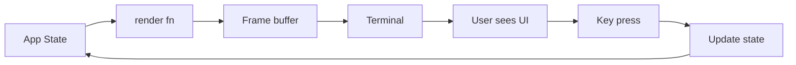
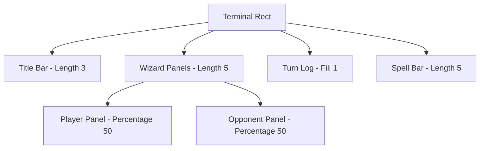

# Act 3 — The Great Hall

> *"The Great Hall fell silent as the two wizards took their positions. Wands raised, the crowd held its breath..."*

You've built a complete duel engine with AI opponents. Now it's time to give it a face. In this act, you'll build a terminal user interface using **ratatui** — Rust's premier TUI framework.

By the end of Act 3, your duels will look like this:

```
╔══════════════════════════════════════════════════════════╗
║              ⚡ WIZARD DUEL ⚡  Turn 4                   ║
╠══════════════════════════════════════════════════════════╣
║  You (Harry)              vs        Draco Malfoy         ║
║  HP: ████████░░ 78/100              HP: ██████░░░░ 55/100║
║  MP: ██████░░░░ 28/50              MP: ████████░░ 38/50  ║
╠══════════════════════════════════════════════════════════╣
║  Turn log...                                             ║
╠══════════════════════════════════════════════════════════╣
║  [1] Stupefy (Off) 2 MP  │  [4] Protego (Def) 2 MP      ║
║  [P] Pass   [I] Info   [Q] Forfeit                       ║
╚══════════════════════════════════════════════════════════╝
```

## What is ratatui?

If you've used **blessed** or **ink** in Node.js, or **curses** in Python — ratatui is that, but with Rust's type safety and zero-cost abstractions. It's an *immediate-mode* rendering library: every frame, you describe the entire UI from scratch. No retained widget tree, no diffing — just "here's what the screen looks like right now."



The core loop is: **state → render → input → update → repeat**.

## Prerequisites

You need everything from Acts 1-2:
- `Wizard`, `Spell`, `SpellType`, `StatusEffect` structs
- `DuelEngine` with turn resolution
- `AiOpponent` trait with `AggressiveAi`, `DefensiveAi`, `CunningAi`
- Working `cargo run` that plays a text-based duel

## Crate Versions

This act uses **ratatui 0.29+** APIs (verified against 0.29/0.30 docs). The API changed significantly from earlier versions — if you see old tutorials using `Terminal::new()` or `CrosstermBackend::new()` directly, ignore them.

```toml
# These go in your Cargo.toml [dependencies]
ratatui = "0.29"
crossterm = "0.28"
color-eyre = "0.6"
```

> ratatui 0.29 defaults to the crossterm backend. The `color-eyre` crate gives us nice error handling and automatic panic hooks.

---

## Stage 15 — ratatui Setup ⚡

**Difficulty: Medium** | **New concepts: raw mode, alternate screen, event loop, Frame**

### The Terminal Takeover

When a TUI app starts, it needs to *take over* the terminal:

1. **Raw mode** — disables line buffering and echo. Keypresses arrive instantly instead of waiting for Enter
2. **Alternate screen** — switches to a secondary screen buffer (like vim does). When you quit, the original terminal content is restored
3. **Event loop** — continuously: render a frame, poll for input, update state

ratatui 0.28+ provides convenience functions that handle all of this. No more manual `enable_raw_mode` / `EnterAlternateScreen` boilerplate.

### Step 1 — Add dependencies

```toml
[dependencies]
ratatui = "0.29"
crossterm = "0.28"
color-eyre = "0.6"
```

### Step 2 — The simplest TUI app

Create `src/tui.rs` (we'll keep the TUI code separate from game logic):

```rust
use color_eyre::Result;
use crossterm::event::{self, KeyCode};
use ratatui::style::Stylize;
use ratatui::widgets::{Block, Borders, Paragraph};
use ratatui::Frame;

/// Entry point for the TUI application.
pub fn run_tui() -> Result<()> {
    color_eyre::install()?;

    // ratatui::run() handles ALL setup and teardown:
    // - enables raw mode
    // - switches to alternate screen
    // - installs panic hook (restores terminal even on crash!)
    // - calls restore() when the closure returns
    ratatui::run(|terminal| loop {
        // Draw the UI
        terminal.draw(|frame| render(frame))?;

        // Handle input — event::read() blocks until an event arrives
        if let Some(key) = event::read()?.as_key_press_event() {
            if key.code == KeyCode::Char('q') {
                break Ok(());
            }
        }
    })
}

/// Render a single frame.
fn render(frame: &mut Frame) {
    let block = Block::default()
        .title(" Wizard Duel Engine ")
        .borders(Borders::ALL)
        .border_style(ratatui::style::Style::new().cyan());

    let greeting = Paragraph::new("The Great Hall awaits... (press 'q' to quit)")
        .block(block);

    frame.render_widget(greeting, frame.area());
}
```

### Step 3 — Wire it into main

```rust
// src/main.rs
mod tui;

fn main() -> color_eyre::Result<()> {
    tui::run_tui()
}
```

### What just happened?

| Concept | What it does |
|---------|-------------|
| `ratatui::run()` | Init terminal + run closure + restore on exit/panic |
| `terminal.draw(\|frame\| ...)` | Gives you a `Frame` to render widgets into |
| `frame.render_widget(w, area)` | Draws widget `w` into rectangular `area` |
| `frame.area()` | Returns the full terminal size as a `Rect` |
| `event::read()` | Blocks until a crossterm event (key, mouse, resize) |
| `.as_key_press_event()` | Filters to only key-press events (ignores releases) |

### Common Mistake: Forgetting Terminal Restore

In older ratatui code, you'd manually call `enable_raw_mode()` and `EnterAlternateScreen`, then restore in a `Drop` impl or panic hook. If you forgot, your terminal would be left in raw mode after a crash — no echo, no line editing, chaos.

`ratatui::run()` handles this automatically. It installs a panic hook that restores the terminal *before* the panic message prints. Always prefer `ratatui::run()` over manual init/restore unless you need custom viewport options.

### Checkpoint

```bash
cargo run
```

You should see a bordered box with "The Great Hall awaits..." filling your terminal. Press `q` to quit cleanly. Your terminal should return to normal — if it doesn't, something went wrong with the restore.

---

## Stage 16 — The Duel Screen

**Difficulty: Medium** | **New concepts: Layout, Constraint, Direction, nested splits**

### Thinking in Rectangles

Every ratatui UI is a tree of rectangles. You start with one big `Rect` (the terminal) and split it into smaller ones using `Layout`. Each split is defined by **constraints** — rules about how big each piece should be.



### The App Struct

Before we build the layout, let's create a proper `App` struct that holds both game state and UI state. This is the standard ratatui pattern — one struct owns everything:

```rust
use ratatui::widgets::ListState;

/// Holds all game + UI state for the duel TUI.
pub struct App {
    // Game state (from Acts 1-2)
    pub player: Wizard,
    pub opponent: Wizard,
    pub turn: u32,
    pub log: Vec<LogEntry>,

    // UI state
    pub spell_list_state: ListState,
    pub log_scroll_state: ListState,
    pub phase: DuelPhase,
}

pub enum DuelPhase {
    SelectSpell,
    Animating,
    GameOver { victory: bool },
}

pub struct LogEntry {
    pub text: String,
    pub kind: LogKind,
}

pub enum LogKind {
    PlayerAdvantage,
    OpponentAdvantage,
    Clash,
    Neutral,
}

impl App {
    pub fn new(player: Wizard, opponent: Wizard) -> Self {
        Self {
            player,
            opponent,
            turn: 1,
            log: vec![LogEntry {
                text: "The duel begins!".into(),
                kind: LogKind::Neutral,
            }],
            spell_list_state: ListState::default().with_selected(Some(0)),
            log_scroll_state: ListState::default(),
            phase: DuelPhase::SelectSpell,
        }
    }
}
```

### Building the Layout

Now the main render function splits the terminal into zones:

```rust
use ratatui::layout::{Constraint, Direction, Layout};
use ratatui::style::{Color, Style, Stylize};
use ratatui::text::{Line, Span};
use ratatui::widgets::{Block, Borders, Paragraph};
use ratatui::Frame;

fn render(frame: &mut Frame, app: &mut App) {
    let area = frame.area();

    // Main vertical split: title | wizards | log | spells
    let main_layout = Layout::default()
        .direction(Direction::Vertical)
        .constraints([
            Constraint::Length(3),   // Title bar
            Constraint::Length(5),   // Wizard status panels
            Constraint::Fill(1),    // Turn log (takes remaining space)
            Constraint::Length(5),   // Spell selection
        ])
        .split(area);

    let [title_area, wizard_area, log_area, spell_area] = [
        main_layout[0],
        main_layout[1],
        main_layout[2],
        main_layout[3],
    ];

    // Split wizard area horizontally: player | opponent
    let wizard_panels = Layout::default()
        .direction(Direction::Horizontal)
        .constraints([
            Constraint::Percentage(50),
            Constraint::Percentage(50),
        ])
        .split(wizard_area);

    // Render each section
    render_title(frame, title_area, app.turn);
    render_wizard_panel(frame, wizard_panels[0], &app.player, true);
    render_wizard_panel(frame, wizard_panels[1], &app.opponent, false);
    render_log(frame, log_area);
    render_spell_bar(frame, spell_area);
}

fn render_title(frame: &mut Frame, area: ratatui::layout::Rect, turn: u32) {
    let title = Line::from(vec![
        Span::styled(" ⚡ WIZARD DUEL ⚡ ", Style::new().bold().yellow()),
        Span::raw(format!(" Turn {} ", turn)),
    ]);
    let block = Block::default()
        .borders(Borders::ALL)
        .border_style(Style::new().yellow());
    let paragraph = Paragraph::new(title).centered().block(block);
    frame.render_widget(paragraph, area);
}

fn render_wizard_panel(
    frame: &mut Frame,
    area: ratatui::layout::Rect,
    wizard: &Wizard,
    is_player: bool,
) {
    let label = if is_player { "You" } else { "Enemy" };
    let block = Block::default()
        .title(format!(" {} ({}) ", label, wizard.name))
        .borders(Borders::ALL);
    let text = format!(
        "HP: {}/{}  MP: {}/{}",
        wizard.hp, wizard.max_hp, wizard.mana, wizard.max_mana
    );
    let paragraph = Paragraph::new(text).block(block);
    frame.render_widget(paragraph, area);
}

fn render_log(frame: &mut Frame, area: ratatui::layout::Rect) {
    let block = Block::default()
        .title(" Battle Log ")
        .borders(Borders::ALL);
    let paragraph = Paragraph::new("The duel begins!").block(block);
    frame.render_widget(paragraph, area);
}

fn render_spell_bar(frame: &mut Frame, area: ratatui::layout::Rect) {
    let block = Block::default()
        .title(" Choose Your Spell ")
        .borders(Borders::ALL);
    let paragraph = Paragraph::new("[1] Stupefy  [2] Protego  [P] Pass  [Q] Forfeit")
        .block(block);
    frame.render_widget(paragraph, area);
}
```

### Layout Constraint Cheat Sheet

| Constraint | Behavior |
|-----------|----------|
| `Length(n)` | Exactly `n` rows/cols. Fixed size, ignores terminal resize |
| `Percentage(n)` | `n%` of the *parent* area. Responsive to resize |
| `Min(n)` | At least `n`, can grow. Good for flexible sections |
| `Max(n)` | At most `n`, can shrink. Good for capping headers |
| `Ratio(a, b)` | `a/b` of parent. Finer control than Percentage |
| `Fill(n)` | Takes remaining space, weighted by `n` relative to other Fills |

> `Fill(1)` is the most useful — it means "take whatever space is left after fixed-size sections are placed." Like `flex: 1` in CSS.

### Update the main loop

```rust
pub fn run_tui() -> Result<()> {
    color_eyre::install()?;

    let player = Wizard::new("Harry", 100, 50);
    let opponent = Wizard::new("Draco", 100, 50);
    let mut app = App::new(player, opponent);

    ratatui::run(|terminal| loop {
        terminal.draw(|frame| render(frame, &mut app))?;

        if let Some(key) = event::read()?.as_key_press_event() {
            match key.code {
                KeyCode::Char('q') => break Ok(()),
                _ => {}
            }
        }
    })
}
```

### Checkpoint

```bash
cargo run
```

You should see four distinct zones: a yellow-bordered title bar, two wizard panels side by side, a battle log area, and a spell bar at the bottom. Resize your terminal — the log area should grow and shrink while the other sections stay fixed.

---

## Stage 17 — HP and Mana Bars

**Difficulty: Easy** | **New concepts: Gauge widget, dynamic styling, color thresholds**

### The Gauge Widget

ratatui's `Gauge` renders a progress bar with a label. It's perfect for HP and mana. The API uses the builder-lite pattern — chain methods to configure it:

```rust
use ratatui::widgets::Gauge;
use ratatui::style::{Color, Modifier, Style};

Gauge::default()
    .gauge_style(Style::new().green().on_black())  // bar color on background
    .label("HP: 78/100")                            // centered text
    .percent(78)                                     // fill percentage (0-100)
```

### Color-Coded HP

A wizard's HP bar should tell a story at a glance:

| HP Range | Color | Meaning |
|----------|-------|---------|
| > 60% | Green | Healthy — dueling confidently |
| 30-60% | Yellow | Wounded — getting desperate |
| < 30% | Red | Critical — one hit from defeat |

```rust
/// Choose HP bar color based on health percentage.
fn hp_color(hp: u32, max_hp: u32) -> Color {
    let pct = (hp as f64 / max_hp as f64) * 100.0;
    if pct > 60.0 {
        Color::Green
    } else if pct > 30.0 {
        Color::Yellow
    } else {
        Color::Red
    }
}
```

### Upgraded Wizard Panel

Replace the plain text wizard panel with proper gauge bars:

```rust
fn render_wizard_panel(
    frame: &mut Frame,
    area: ratatui::layout::Rect,
    wizard: &Wizard,
    is_player: bool,
) {
    let label = if is_player { "You" } else { "Enemy" };
    let block = Block::default()
        .title(format!(" {} ({}) ", label, wizard.name))
        .borders(Borders::ALL)
        .border_style(if is_player {
            Style::new().cyan()
        } else {
            Style::new().red()
        });

    // Render the outer block first, then get the inner area
    let inner = block.inner(area);
    frame.render_widget(block, area);

    // Split inner area: HP bar | Mana bar
    let bars = Layout::default()
        .direction(Direction::Vertical)
        .constraints([
            Constraint::Length(1),  // HP gauge
            Constraint::Length(1),  // Mana gauge
            Constraint::Fill(1),   // remaining space
        ])
        .split(inner);

    // HP bar — color changes with health
    let hp_pct = ((wizard.hp as f64 / wizard.max_hp as f64) * 100.0) as u16;
    let hp_gauge = Gauge::default()
        .gauge_style(Style::new().fg(hp_color(wizard.hp, wizard.max_hp)).on_black())
        .label(format!("HP: {}/{}", wizard.hp, wizard.max_hp))
        .percent(hp_pct);
    frame.render_widget(hp_gauge, bars[0]);

    // Mana bar — always blue (magic is magic)
    let mp_pct = ((wizard.mana as f64 / wizard.max_mana as f64) * 100.0) as u16;
    let mp_gauge = Gauge::default()
        .gauge_style(Style::new().blue().on_black())
        .label(format!("MP: {}/{}", wizard.mana, wizard.max_mana))
        .percent(mp_pct);
    frame.render_widget(mp_gauge, bars[1]);
}
```

### Key Technique: `block.inner(area)`

Notice the pattern: render the `Block` first, then use `block.inner(area)` to get the rectangle *inside* the borders. This is how you nest content within bordered containers:

```rust
let block = Block::default().borders(Borders::ALL);
let inner = block.inner(area);   // area minus the border pixels
frame.render_widget(block, area); // draw the border
// now render content into `inner`
```

Without this, your gauges would render *on top of* the border characters.

### Checkpoint

```bash
cargo run
```

Both wizard panels now show colored HP and blue mana bars. Try changing the starting HP values in your `App::new()` to see the color thresholds in action — set HP to 25 and watch it go red.

---

## Stage 18 — Spell Selection

**Difficulty: Medium** | **New concepts: List, ListState, StatefulWidget, keyboard navigation**

### Stateful vs Stateless Widgets

Most ratatui widgets are *stateless* — you create them fresh each frame and they render the same way every time. But `List` is a **StatefulWidget**: it needs to remember which item is selected between frames.

The pattern:
- **Widget** (`List`) — describes *what* to render
- **State** (`ListState`) — tracks *which item* is selected, scroll offset, etc.
- **`render_stateful_widget()`** — renders the widget using the state

```rust
// Stateless — no memory between frames
frame.render_widget(paragraph, area);

// Stateful — state persists in your App struct
frame.render_stateful_widget(list, area, &mut app.spell_list_state);
```

### Building the Spell List

Each spell shows its number, name, type (color-coded), and mana cost. Spells you can't afford are grayed out:

```rust
use ratatui::widgets::{List, ListState};
use ratatui::text::{Line, Span};
use ratatui::style::{Color, Modifier, Style, Stylize};

fn spell_type_color(spell_type: &SpellType) -> Color {
    match spell_type {
        SpellType::Offensive => Color::Red,
        SpellType::Defensive => Color::Blue,
        SpellType::Cunning => Color::Green,
    }
}

fn spell_type_label(spell_type: &SpellType) -> &'static str {
    match spell_type {
        SpellType::Offensive => "Off",
        SpellType::Defensive => "Def",
        SpellType::Cunning => "Cun",
    }
}

fn render_spell_bar(
    frame: &mut Frame,
    area: ratatui::layout::Rect,
    app: &mut App,
) {
    let block = Block::default()
        .title(" Choose Your Spell ")
        .borders(Borders::ALL)
        .border_style(Style::new().magenta());

    let items: Vec<Line> = app
        .player
        .spells
        .iter()
        .enumerate()
        .map(|(i, spell)| {
            let can_afford = app.player.mana >= spell.mana_cost;
            let type_color = if can_afford {
                spell_type_color(&spell.spell_type)
            } else {
                Color::DarkGray
            };

            let text_style = if can_afford {
                Style::default()
            } else {
                Style::new().dark_gray()
            };

            Line::from(vec![
                Span::styled(format!("[{}] ", i + 1), text_style.bold()),
                Span::styled(&spell.name, text_style),
                Span::styled(
                    format!(" ({}) ", spell_type_label(&spell.spell_type)),
                    Style::new().fg(type_color),
                ),
                Span::styled(format!("{} MP", spell.mana_cost), text_style),
            ])
        })
        .collect();

    let list = List::new(items)
        .block(block)
        .highlight_style(Style::new().bold().reversed())
        .highlight_symbol("▶ ");

    frame.render_stateful_widget(list, area, &mut app.spell_list_state);
}
```

### Keyboard Navigation

Add arrow key handling to the main event loop:

```rust
if let Some(key) = event::read()?.as_key_press_event() {
    match key.code {
        KeyCode::Char('q') => break Ok(()),

        // Navigate spell list
        KeyCode::Up | KeyCode::Char('k') => {
            app.spell_list_state.select_previous();
        }
        KeyCode::Down | KeyCode::Char('j') => {
            app.spell_list_state.select_next();
        }

        // Cast selected spell
        KeyCode::Enter => {
            if let Some(selected) = app.spell_list_state.selected() {
                // We'll wire this to the duel engine in Stage 19
                let spell = &app.player.spells[selected];
                if app.player.mana >= spell.mana_cost {
                    // TODO: execute turn
                }
            }
        }

        // Quick-cast by number
        KeyCode::Char(c @ '1'..='9') => {
            let idx = (c as usize) - ('1' as usize);
            if idx < app.player.spells.len() {
                app.spell_list_state.select(Some(idx));
                // TODO: execute turn
            }
        }

        _ => {}
    }
}
```

### How ListState Works

`ListState` tracks two things internally:
- **selected** — which item index is highlighted (`Option<usize>`)
- **offset** — scroll position when the list is longer than the visible area

The methods `select_next()` and `select_previous()` handle wrapping and scroll automatically. You don't need to bounds-check manually.

### Checkpoint

```bash
cargo run
```

The spell bar now shows your equipped spells with color-coded types. Arrow keys move the highlight. Spells that cost more mana than you have appear grayed out. Number keys jump directly to a spell.

---

## Stage 19 — Turn Animation

**Difficulty: Medium** | **New concepts: animation phases, timed rendering, non-blocking sleep**

### The Problem with Blocking

Your event loop currently blocks on `event::read()` — it waits forever for a keypress. But during a turn animation, you need to show a sequence of messages with pauses *without* waiting for input.

The solution: an **animation state machine**. Instead of sleeping in the render function (which would freeze the UI), we track *what phase* of the animation we're in and *when* it started.

```rust
use std::time::{Duration, Instant};

pub enum AnimationPhase {
    PlayerCast { started: Instant },
    OpponentCast { started: Instant },
    Resolution { started: Instant },
    Done,
}

// Add to App struct:
pub struct App {
    // ... existing fields ...
    pub animation: Option<AnimationPhase>,
    pub pending_turn_result: Option<TurnResult>,
}
```

### The Animation Loop

When the player casts a spell, instead of resolving instantly, we enter animation mode:

```rust
// In your event handler, when Enter is pressed:
fn start_turn(app: &mut App, spell_index: usize) {
    let player_spell = app.player.spells[spell_index].clone();
    let opponent_spell = app.opponent.choose_spell(&app.player);

    // Store the result but don't apply it yet
    let result = app.engine.resolve_turn(&player_spell, &opponent_spell);
    app.pending_turn_result = Some(result);

    // Start the animation sequence
    app.animation = Some(AnimationPhase::PlayerCast {
        started: Instant::now(),
    });

    // Add the "You cast X!" message immediately
    app.log.push(LogEntry {
        text: format!("You cast {}!", player_spell.name),
        kind: LogKind::Neutral,
    });
}
```

### Advancing the Animation

In the main loop, check animation state *before* blocking on input:

```rust
use crossterm::event::{self, KeyCode};
use std::time::Duration;

// Inside the main loop:
loop {
    terminal.draw(|frame| render(frame, &mut app))?;

    // If animating, advance phases on a timer
    if let Some(ref phase) = app.animation {
        let elapsed = match phase {
            AnimationPhase::PlayerCast { started }
            | AnimationPhase::OpponentCast { started }
            | AnimationPhase::Resolution { started } => started.elapsed(),
            AnimationPhase::Done => Duration::ZERO,
        };

        if elapsed >= Duration::from_millis(500) {
            advance_animation(&mut app);
        }

        // Non-blocking poll — check for 'q' to quit but don't wait
        if event::poll(Duration::from_millis(50))? {
            if let Some(key) = event::read()?.as_key_press_event() {
                if key.code == KeyCode::Char('q') {
                    break Ok(());
                }
            }
        }
        continue; // skip the normal input handler
    }

    // Normal input handling (only when not animating)
    if let Some(key) = event::read()?.as_key_press_event() {
        // ... spell selection handling from Stage 18 ...
    }
}
```

### The State Machine

```rust
fn advance_animation(app: &mut App) {
    app.animation = match &app.animation {
        Some(AnimationPhase::PlayerCast { .. }) => {
            // Show opponent's spell
            if let Some(ref result) = app.pending_turn_result {
                app.log.push(LogEntry {
                    text: format!("{} cast {}!",
                        app.opponent.name, result.opponent_spell_name),
                    kind: LogKind::Neutral,
                });
            }
            Some(AnimationPhase::OpponentCast {
                started: Instant::now(),
            })
        }
        Some(AnimationPhase::OpponentCast { .. }) => {
            // Show resolution — apply damage, effects, etc.
            if let Some(result) = app.pending_turn_result.take() {
                apply_turn_result(app, &result);
            }
            Some(AnimationPhase::Resolution {
                started: Instant::now(),
            })
        }
        Some(AnimationPhase::Resolution { .. }) => {
            app.turn += 1;
            // Check for game over
            if app.player.hp == 0 {
                app.phase = DuelPhase::GameOver { victory: false };
            } else if app.opponent.hp == 0 {
                app.phase = DuelPhase::GameOver { victory: true };
            } else {
                app.phase = DuelPhase::SelectSpell;
            }
            None // animation complete
        }
        _ => None,
    };
}
```

### Common Mistake: Sleeping in Render

Never do this:

```rust
// BAD — freezes the entire UI for 500ms
fn render(frame: &mut Frame) {
    frame.render_widget(text1, area);
    std::thread::sleep(Duration::from_millis(500)); // UI is frozen!
    frame.render_widget(text2, area);
}
```

The render function should be *instant*. All timing logic belongs in the event loop, using `event::poll()` with a timeout instead of `event::read()` (which blocks indefinitely).

### `event::poll()` vs `event::read()`

| Function | Behavior | Use when |
|----------|----------|----------|
| `event::read()` | Blocks until an event arrives | Waiting for user input |
| `event::poll(duration)` | Returns `true` if event available within timeout | Animating, need to check input without blocking |

### Checkpoint

```bash
cargo run
```

Select a spell and press Enter. You should see a three-beat sequence: "You cast Stupefy!" → pause → "Draco cast Protego!" → pause → damage resolution. The UI stays responsive during animation — you can still press 'q' to quit.

---

## Stage 20 — Status Effect Icons

**Difficulty: Easy** | **New concepts: Unicode rendering, Span composition, conditional display**

### Status Effects as Visual Language

Your duel engine already tracks status effects from Act 2. Now we give them a visual identity in the TUI. Each effect gets a symbol that communicates its nature at a glance:

| Effect | Symbol | Why |
|--------|--------|-----|
| Burn | `[fire]` | Ongoing fire damage |
| Bleed | `[drop]` | Damage over time |
| Stun | `[zap]` | Can't act |
| Confuse | `[swirl]` | Random spell targeting |
| Disarm | `[lock]` | Can't cast offensive spells |

> **Terminal Unicode support**: Most modern terminals (iTerm2, Windows Terminal, Kitty, Alacritty) render these emoji fine. If yours doesn't, fall back to ASCII: `B` for burn, `X` for bleed, etc.

### Rendering Effects Next to the Wizard Name

Update the wizard panel to show active effects in the title:

```rust
fn format_status_effects(effects: &[ActiveEffect]) -> Vec<Span<'static>> {
    effects
        .iter()
        .map(|effect| {
            let (symbol, color) = match effect.kind {
                StatusEffect::Burn => ("\u{1F525}", Color::Red),       // fire emoji
                StatusEffect::Bleed => ("\u{1FA78}", Color::Red),      // drop of blood
                StatusEffect::Stun => ("\u{26A1}", Color::Yellow),     // lightning
                StatusEffect::Confuse => ("\u{1F300}", Color::Magenta),// cyclone
                StatusEffect::Disarm => ("\u{1F512}", Color::Gray),    // lock
            };
            Span::styled(
                format!("{}{} ", symbol, effect.remaining_turns),
                Style::new().fg(color),
            )
        })
        .collect()
}
```

### Integrating into the Wizard Panel

Modify `render_wizard_panel` to include effects. The key change is building the title as a `Line` with multiple styled `Span`s:

```rust
fn render_wizard_panel(
    frame: &mut Frame,
    area: ratatui::layout::Rect,
    wizard: &Wizard,
    is_player: bool,
) {
    let label = if is_player { "You" } else { "Enemy" };

    // Build title with name + status effect icons
    let mut title_spans = vec![
        Span::raw(format!(" {} ({}) ", label, wizard.name)),
    ];
    title_spans.extend(format_status_effects(&wizard.active_effects));

    let block = Block::default()
        .title(Line::from(title_spans))
        .borders(Borders::ALL)
        .border_style(if is_player {
            Style::new().cyan()
        } else {
            Style::new().red()
        });

    // ... rest of gauge rendering from Stage 17 ...
}
```

### Hint: Effect Duration Display

The number after each symbol shows remaining turns. When an effect has 1 turn left, you might want to make it blink or dim to signal it's about to expire:

```rust
let urgency_style = if effect.remaining_turns <= 1 {
    Style::new().fg(color).add_modifier(Modifier::DIM)
} else {
    Style::new().fg(color)
};
```

### Checkpoint

```bash
cargo run
```

Apply some status effects to a wizard in your test setup (e.g., `wizard.active_effects.push(...)`) and verify the icons appear next to their name in the panel title. The symbols should be colored and show turn counts.

---

## Stage 21 — Turn History Log

**Difficulty: Medium** | **New concepts: scrollable List, color-coded entries, auto-scroll**

### From Static Text to Scrollable History

The battle log is the narrative heart of the duel. Every spell cast, every hit landed, every effect triggered — it all goes here. As the duel progresses, the log grows beyond what fits on screen, so we need scrolling.

We already have `LogEntry` with a `LogKind` from Stage 16. Now we render it as a color-coded, scrollable `List`:

```rust
fn log_kind_style(kind: &LogKind) -> Style {
    match kind {
        LogKind::PlayerAdvantage => Style::new().green(),
        LogKind::OpponentAdvantage => Style::new().red(),
        LogKind::Clash => Style::new().yellow(),
        LogKind::Neutral => Style::new().white(),
    }
}

fn render_log(
    frame: &mut Frame,
    area: ratatui::layout::Rect,
    app: &mut App,
) {
    let block = Block::default()
        .title(" Battle Log ")
        .borders(Borders::ALL)
        .border_style(Style::new().white());

    let items: Vec<Line> = app
        .log
        .iter()
        .enumerate()
        .map(|(i, entry)| {
            let turn_marker = Span::styled(
                format!("[T{}] ", i / 3 + 1), // rough turn grouping
                Style::new().dark_gray(),
            );
            let text = Span::styled(&entry.text, log_kind_style(&entry.kind));
            Line::from(vec![turn_marker, text])
        })
        .collect();

    let list = List::new(items)
        .block(block)
        .highlight_style(Style::new().bold());

    frame.render_stateful_widget(list, area, &mut app.log_scroll_state);
}
```

### Auto-Scroll to Latest

After each new log entry, scroll to the bottom so the player always sees the latest action:

```rust
/// Call this after pushing a new LogEntry to app.log
fn auto_scroll_log(app: &mut App) {
    if !app.log.is_empty() {
        app.log_scroll_state.select(Some(app.log.len() - 1));
    }
}
```

Wire this into your `advance_animation` function — every time you push a `LogEntry`, call `auto_scroll_log(&mut app)` afterward.

### Manual Scroll with Page Up/Down

Let the player scroll back through history during the spell selection phase:

```rust
// Add to your event handler (inside the SelectSpell phase):
KeyCode::PageUp => {
    app.log_scroll_state.select_previous();
}
KeyCode::PageDown => {
    app.log_scroll_state.select_next();
}
// Scroll to bottom
KeyCode::End => {
    if !app.log.is_empty() {
        app.log_scroll_state.select(Some(app.log.len() - 1));
    }
}
```

### Enriching Log Messages

Now that the log is visual, make your `apply_turn_result` function generate rich entries. Here's the pattern — adapt it to your `TurnResult` struct from Act 2:

```rust
fn apply_turn_result(app: &mut App, result: &TurnResult) {
    // Type advantage message
    let kind = match result.advantage {
        Advantage::Player => LogKind::PlayerAdvantage,
        Advantage::Opponent => LogKind::OpponentAdvantage,
        Advantage::Clash => LogKind::Clash,
        Advantage::None => LogKind::Neutral,
    };

    app.log.push(LogEntry {
        text: result.summary.clone(),
        kind,
    });

    // Damage numbers
    if result.player_damage > 0 {
        app.log.push(LogEntry {
            text: format!("You take {} damage!", result.player_damage),
            kind: LogKind::OpponentAdvantage,
        });
    }
    if result.opponent_damage > 0 {
        app.log.push(LogEntry {
            text: format!("{} takes {} damage!", app.opponent.name, result.opponent_damage),
            kind: LogKind::PlayerAdvantage,
        });
    }

    // Apply HP/mana changes
    app.player.hp = app.player.hp.saturating_sub(result.player_damage);
    app.opponent.hp = app.opponent.hp.saturating_sub(result.opponent_damage);

    auto_scroll_log(app);
}
```

### Why List Instead of Paragraph?

You might wonder why we use `List` instead of `Paragraph` for the log. Both can display text, but:

| Feature | Paragraph | List |
|---------|-----------|------|
| Scroll tracking | Manual (you track offset) | Built-in via `ListState` |
| Per-line styling | Possible but awkward | Natural — each item is a `Line` |
| Selection highlight | No | Yes |
| Wrap long lines | Yes (`Wrap::Word`) | No (truncates) |

For a log where each entry is a discrete event with its own color, `List` is the better fit.

### Checkpoint

```bash
cargo run
```

Play several turns. The battle log should fill with color-coded entries — green for your hits, red for opponent hits, yellow for clashes. The log auto-scrolls to the latest entry. Use PageUp/PageDown to scroll back through history.

---

## Stage 22 — Victory/Defeat Screen

**Difficulty: Easy** | **New concepts: overlay rendering, centered layout, end-game stats**

### The Overlay Pattern

When the duel ends, we don't navigate to a new screen — we render an overlay *on top of* the existing duel UI. This is a common TUI pattern: render the background normally, then render a centered box over it.

The trick is rendering into a sub-rect that's smaller than the terminal and centered:

```rust
use ratatui::layout::Rect;

/// Create a centered rect of given percentage size within `area`.
fn centered_rect(percent_x: u16, percent_y: u16, area: Rect) -> Rect {
    let popup_width = area.width * percent_x / 100;
    let popup_height = area.height * percent_y / 100;
    let x = (area.width.saturating_sub(popup_width)) / 2;
    let y = (area.height.saturating_sub(popup_height)) / 2;
    Rect::new(
        area.x + x,
        area.y + y,
        popup_width,
        popup_height,
    )
}
```

### Tracking Duel Stats

Add stats tracking to your `App` struct:

```rust
pub struct DuelStats {
    pub damage_dealt: u32,
    pub damage_taken: u32,
    pub spells_cast: u32,
    pub turns_survived: u32,
    pub xp_earned: u32,
}

impl DuelStats {
    pub fn new() -> Self {
        Self {
            damage_dealt: 0,
            damage_taken: 0,
            spells_cast: 0,
            turns_survived: 0,
            xp_earned: 0,
        }
    }
}
```

Update `apply_turn_result` to accumulate stats:

```rust
app.stats.damage_dealt += result.opponent_damage;
app.stats.damage_taken += result.player_damage;
app.stats.spells_cast += 1;
app.stats.turns_survived = app.turn;
```

### Rendering the End Screen

```rust
use ratatui::widgets::Clear;

fn render_game_over(frame: &mut Frame, app: &App, victory: bool) {
    // First, render the normal duel screen (dimmed background)
    // ... call your normal render functions here ...

    // Then overlay the result popup
    let popup_area = centered_rect(60, 50, frame.area());

    // Clear the area behind the popup
    frame.render_widget(Clear, popup_area);

    let (title, border_color) = if victory {
        (" VICTORY! ", Color::Green)
    } else {
        (" DEFEAT! ", Color::Red)
    };

    let block = Block::default()
        .title(title)
        .borders(Borders::ALL)
        .border_style(Style::new().fg(border_color).bold());

    let inner = block.inner(popup_area);
    frame.render_widget(block, popup_area);

    // Stats layout inside the popup
    let stats_layout = Layout::default()
        .direction(Direction::Vertical)
        .constraints([
            Constraint::Length(2), // Flavor text
            Constraint::Length(1), // Spacer
            Constraint::Length(5), // Stats
            Constraint::Length(1), // Spacer
            Constraint::Length(1), // Controls
        ])
        .split(inner);

    // Flavor text
    let flavor = if victory {
        "The crowd erupts! Your opponent crumbles to the ground."
    } else {
        "Your wand clatters to the floor. The Great Hall falls silent."
    };
    let flavor_text = Paragraph::new(flavor)
        .style(Style::new().italic())
        .centered();
    frame.render_widget(flavor_text, stats_layout[0]);

    // Stats
    let xp = if victory {
        50 + app.stats.turns_survived * 5
    } else {
        app.stats.turns_survived * 3
    };

    let stats_text = vec![
        Line::from(vec![
            Span::raw("  Damage dealt:  "),
            Span::styled(
                format!("{}", app.stats.damage_dealt),
                Style::new().green().bold(),
            ),
        ]),
        Line::from(vec![
            Span::raw("  Damage taken:  "),
            Span::styled(
                format!("{}", app.stats.damage_taken),
                Style::new().red().bold(),
            ),
        ]),
        Line::from(vec![
            Span::raw("  Spells cast:   "),
            Span::styled(
                format!("{}", app.stats.spells_cast),
                Style::new().cyan().bold(),
            ),
        ]),
        Line::from(vec![
            Span::raw("  Turns:         "),
            Span::styled(
                format!("{}", app.stats.turns_survived),
                Style::new().white().bold(),
            ),
        ]),
        Line::from(vec![
            Span::raw("  XP earned:     "),
            Span::styled(
                format!("+{}", xp),
                Style::new().yellow().bold(),
            ),
        ]),
    ];
    let stats_paragraph = Paragraph::new(stats_text);
    frame.render_widget(stats_paragraph, stats_layout[2]);

    // Controls
    let controls = Line::from(vec![
        Span::styled("  [R] ", Style::new().bold()),
        Span::raw("Play Again   "),
        Span::styled("[Q] ", Style::new().bold()),
        Span::raw("Quit"),
    ]);
    frame.render_widget(Paragraph::new(controls).centered(), stats_layout[4]);
}
```

### Handling End-Game Input

Add a branch in your main event loop for the `GameOver` phase:

```rust
DuelPhase::GameOver { victory } => {
    if let Some(key) = event::read()?.as_key_press_event() {
        match key.code {
            KeyCode::Char('q') => break Ok(()),
            KeyCode::Char('r') => {
                // Reset for a new duel
                app = App::new(
                    Wizard::new("Harry", 100, 50),
                    Wizard::new("Draco", 100, 50),
                );
            }
            _ => {}
        }
    }
}
```

### Wiring It Into Render

Update your main `render` function to check the phase:

```rust
fn render(frame: &mut Frame, app: &mut App) {
    // Always render the base duel screen
    render_title(frame, title_area, app.turn);
    render_wizard_panel(frame, wizard_panels[0], &app.player, true);
    render_wizard_panel(frame, wizard_panels[1], &app.opponent, false);
    render_log(frame, log_area, app);
    render_spell_bar(frame, spell_area, app);

    // Overlay game-over screen if the duel is finished
    if let DuelPhase::GameOver { victory } = app.phase {
        render_game_over(frame, app, victory);
    }
}
```

### Checkpoint

```bash
cargo run
```

Play a full duel until one wizard's HP hits zero. A centered overlay should appear with either "VICTORY!" (green border) or "DEFEAT!" (red border), showing your duel stats. Press `R` to play again or `Q` to quit.

---

## Act 3 Complete — The Great Hall Stands

You've transformed a text-only duel engine into a full terminal UI:

```mermaid
graph TD
    S15["Stage 15 - Terminal Setup"] --> S16["Stage 16 - Layout System"]
    S16 --> S17["Stage 17 - HP/Mana Gauges"]
    S16 --> S18["Stage 18 - Spell Selection"]
    S17 --> S19["Stage 19 - Turn Animation"]
    S18 --> S19
    S19 --> S20["Stage 20 - Status Effects"]
    S19 --> S21["Stage 21 - Battle Log"]
    S20 --> S22["Stage 22 - Victory Screen"]
    S21 --> S22

    style S15 fill:#2d1b69,stroke:#7c3aed
    style S16 fill:#2d1b69,stroke:#7c3aed
    style S17 fill:#1e3a2f,stroke:#22c55e
    style S18 fill:#1e3a2f,stroke:#22c55e
    style S19 fill:#3b1c1c,stroke:#ef4444
    style S20 fill:#1e3a2f,stroke:#22c55e
    style S21 fill:#2d1b69,stroke:#7c3aed
    style S22 fill:#1e3a2f,stroke:#22c55e
```



### What You Learned

| Concept | Rust/ratatui | Equivalent in JS/Python |
|---------|-------------|------------------------|
| Terminal init/restore | `ratatui::run()` | `blessed.screen()` / `curses.wrapper()` |
| Layout system | `Layout::vertical().constraints()` | CSS Flexbox |
| Immediate-mode rendering | `frame.render_widget()` each frame | React re-render (but no virtual DOM) |
| Stateful widgets | `ListState` + `render_stateful_widget()` | `useState` in React |
| Event loop | `event::read()` / `event::poll()` | `process.stdin.on('keypress')` |
| Builder-lite pattern | `Gauge::default().label().percent()` | Method chaining in jQuery/D3 |

### Architecture Recap

```
src/
├── main.rs          # Entry point
├── tui.rs           # TUI app: App struct, render(), event loop
├── wizard.rs        # Wizard, Spell, StatusEffect (Act 1)
├── engine.rs        # DuelEngine, turn resolution (Act 1)
├── ai.rs            # AiOpponent trait + implementations (Act 2)
└── types.rs         # SpellType, LogKind, DuelPhase, etc.
```

The key architectural insight: **game logic and UI are separate**. The `DuelEngine` knows nothing about ratatui. The `App` struct bridges the two worlds — it holds game state *and* UI state, and the render functions read from it without mutating game logic.

### Common Mistakes Checklist

- [ ] **Forgetting terminal restore** — Use `ratatui::run()`, not manual init. It handles panics
- [ ] **Blocking during animation** — Use `event::poll(timeout)`, never `thread::sleep` in render
- [ ] **Widget sizing overflow** — If constraints add up to more than available space, ratatui's solver picks an approximate solution. Test with small terminals
- [ ] **Rendering outside bounds** — Never render to a `Rect` larger than `frame.area()`. Use `block.inner()` for nested content
- [ ] **Stale ListState** — If you remove items from a list, the selected index might be out of bounds. Reset it after mutations

### What's Next

In **Act 4**, we'll add:
- Persistent wizard profiles (serde + JSON)
- A tournament bracket system
- Sound effects via terminal bell sequences
- And the final boss: **Voldemort** (an AI that learns from your patterns)

*"The Great Hall erupted in applause. But in the shadows, a darker presence stirred..."*
