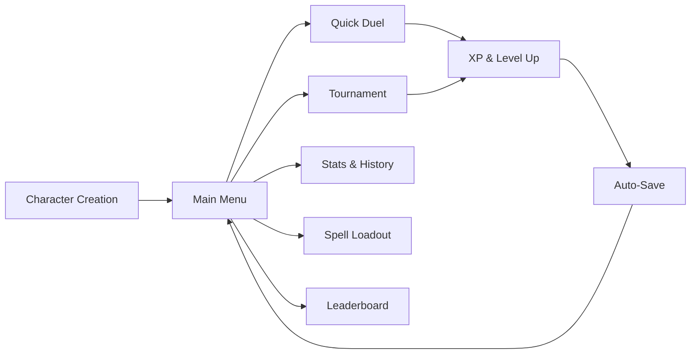
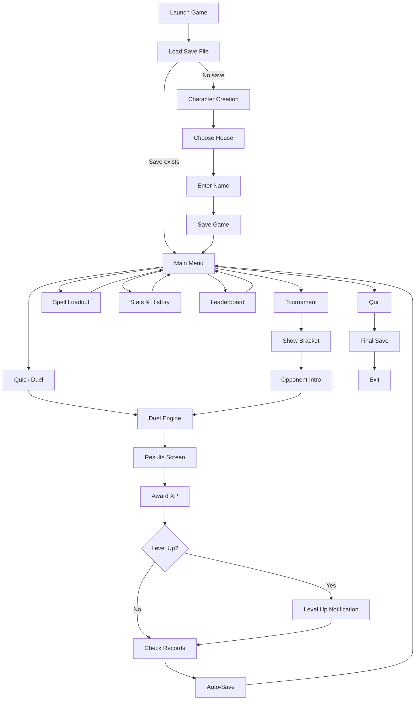

# Act 4 — The Triwizard Tournament

> *"Eternal glory — that is what awaits the student who wins the Triwizard Tournament."*
> — Albus Dumbledore

You've built a working duel engine with a TUI, AI opponents, and trait-based strategies. Your wizard can fight — but there's no *reason* to fight. No progression, no memory, no stakes.

Act 4 changes that. We add XP, levels, spell unlocks, house identity, persistence, tournament brackets, and polish. By the end, you'll have a complete game loop that feels like stepping into the Great Hall for the first time.



**What you'll build in Act 4:**

| Stage | Topic | Difficulty |
|-------|-------|------------|
| 23 | XP and Levels | Medium |
| 24 | Spell Unlocks | Medium |
| 25 | House Selection | Easy |
| 26 | Save & Load (serde) | Medium |
| 27 | Duel History | Easy |
| 28 | Tournament Mode | Hard |
| 29 | Sound & Polish | Easy |
| 30 | The Leaderboard | Medium |

**New dependencies for Act 4:**

```toml
# Add to your Cargo.toml [dependencies]
serde = { version = "1", features = ["derive"] }
serde_json = "1"
dirs = "5"          # Cross-platform home directory
chrono = { version = "0.4", features = ["serde"] }
```

---

## Stage 23 — XP and Levels

> *"It does not do to dwell on dreams and forget to level up."*

Right now every duel is a one-off — win or lose, nothing changes. XP and levels give players a reason to keep dueling: each victory brings them closer to new spells, higher stats, and tougher opponents. This stage builds the progression backbone that makes the game feel like a journey from nervous first-year to master duelist. It also teaches you how to design a reward curve that feels satisfying without being trivial.

### The Progression Table Right now your wizard is static — same HP, same mana, same spells forever. We'll fix that with an XP system that rewards skillful play.

### The Progression Table

Here's the XP curve. It's not linear — each level demands more, like O.W.L. exams getting harder each year:

| Level | XP Required | Cumulative Feel |
|-------|-------------|-----------------|
| 1 | 0 | First Year — you just got your wand |
| 2 | 50 | Getting the hang of it |
| 3 | 120 | Competent duelist |
| 4 | 200 | Defense Against the Dark Arts club |
| 5 | 300 | O.W.L. level |
| 6 | 420 | N.E.W.T. preparation |
| 7 | 560 | Auror candidate |
| 8 | 720 | Order of the Phoenix |
| 9 | 900 | Dumbledore's Army elite |
| 10 | 1100 | Master Duelist |

### XP Sources

Not all victories are equal:

- **Win**: `30 + (opponent_level * 5)` XP — beating Voldemort is worth more than beating Neville
- **Lose**: 10 XP — you still learn from defeat
- **Win streak bonus**: +5 XP per consecutive win — momentum matters
- **Perfect win** (no damage taken): +20 XP bonus

### Level-Up Rewards

- **Odd levels** (3, 5, 7, 9): +5 max HP
- **Even levels** (2, 4, 6, 8, 10): +5 max mana
- **All levels**: unlock new spell tiers (Stage 24)

### Building the Progression System

Right now our `Wizard` struct has no concept of growth — HP and mana are set at creation and never change. We need a separate `Progression` struct that tracks XP, level, and win streaks, then feeds level-up rewards back into the wizard's stats.

```rust
/// The XP thresholds for each level. Index 0 = Level 1.
const XP_TABLE: [u32; 10] = [0, 50, 120, 200, 300, 420, 560, 720, 900, 1100];

#[derive(Debug, Clone)]
pub struct Progression {
    pub xp: u32,
    pub level: u8,
    pub win_streak: u32,
    pub total_wins: u32,
    pub total_losses: u32,
}

impl Progression {
    pub fn new() -> Self {
        Self {
            xp: 0,
            level: 1,
            win_streak: 0,
            total_wins: 0,
            total_losses: 0,
        }
    }

    /// Calculate XP earned from a duel result.
    pub fn calculate_xp(&self, won: bool, opponent_level: u8, perfect: bool) -> u32 {
        if won {
            let base = 30 + (opponent_level as u32 * 5);
            let streak = self.win_streak * 5; // current streak BEFORE this win
            let perfect_bonus = if perfect { 20 } else { 0 };
            base + streak + perfect_bonus
        } else {
            10
        }
    }

    /// Award XP and return any level-ups that occurred.
    /// Returns a Vec of new levels reached (could be multiple!).
    pub fn award_xp(&mut self, won: bool, opponent_level: u8, perfect: bool) -> Vec<LevelUp> {
        let xp_earned = self.calculate_xp(won, opponent_level, perfect);
        self.xp += xp_earned;

        if won {
            self.win_streak += 1;
            self.total_wins += 1;
        } else {
            self.win_streak = 0;
            self.total_losses += 1;
        }

        // Check for level ups
        let mut level_ups = Vec::new();
        while self.level < 10 {
            let next_level = self.level as usize; // XP_TABLE index for next level
            if self.xp >= XP_TABLE[next_level] {
                self.level += 1;
                level_ups.push(LevelUp {
                    new_level: self.level,
                    hp_bonus: if self.level % 2 == 1 { 5 } else { 0 },
                    mana_bonus: if self.level % 2 == 0 { 5 } else { 0 },
                });
            } else {
                break;
            }
        }
        level_ups
    }

    /// XP needed to reach the next level. None if max level.
    pub fn xp_to_next_level(&self) -> Option<u32> {
        if self.level >= 10 {
            return None;
        }
        Some(XP_TABLE[self.level as usize] - self.xp)
    }
}

#[derive(Debug, Clone)]
pub struct LevelUp {
    pub new_level: u8,
    pub hp_bonus: i32,
    pub mana_bonus: i32,
}
```

### Applying Level-Ups to Your Wizard

When a level-up occurs, update the wizard's base stats:

```rust
impl Wizard {
    pub fn apply_level_up(&mut self, level_up: &LevelUp) {
        self.max_hp += level_up.hp_bonus;
        self.max_mana += level_up.mana_bonus;
        // Heal to new max on level up — a reward!
        self.hp = self.max_hp;
        self.mana = self.max_mana;
    }
}
```

### Showing Level-Up in the TUI

After a duel ends, check for level-ups and show a notification. Add this to your results screen:

```rust
fn render_level_up(frame: &mut Frame, area: Rect, level_up: &LevelUp) {
    let text = vec![
        Line::from(Span::styled(
            format!("⚡ LEVEL UP! You are now Level {} ⚡", level_up.new_level),
            Style::default().fg(Color::Yellow).add_modifier(Modifier::BOLD),
        )),
        Line::from(""),
        Line::from(if level_up.hp_bonus > 0 {
            format!("  Max HP increased by {}", level_up.hp_bonus)
        } else {
            format!("  Max Mana increased by {}", level_up.mana_bonus)
        }),
    ];

    let block = Block::default()
        .borders(Borders::ALL)
        .border_style(Style::default().fg(Color::Yellow))
        .title(" Level Up! ");

    let paragraph = Paragraph::new(text).block(block).alignment(Alignment::Center);
    frame.render_widget(paragraph, area);
}
```

### XP Progress Bar

Show the player how close they are to the next level. This goes in your HUD:

```rust
fn render_xp_bar(frame: &mut Frame, area: Rect, progression: &Progression) {
    let (current_threshold, next_threshold) = if progression.level >= 10 {
        (XP_TABLE[9], XP_TABLE[9]) // Max level
    } else {
        (
            XP_TABLE[progression.level as usize - 1],
            XP_TABLE[progression.level as usize],
        )
    };

    let xp_in_level = progression.xp - current_threshold;
    let xp_needed = next_threshold - current_threshold;
    let ratio = if xp_needed > 0 {
        xp_in_level as f64 / xp_needed as f64
    } else {
        1.0
    };

    let label = format!(
        "Level {} — {} / {} XP",
        progression.level, progression.xp, next_threshold
    );

    let gauge = Gauge::default()
        .block(Block::default().borders(Borders::ALL).title(" Experience "))
        .gauge_style(Style::default().fg(Color::Magenta))
        .ratio(ratio)
        .label(label);

    frame.render_widget(gauge, area);
}
```

With XP flowing and levels climbing, the next question is: what do those levels *unlock*? Stage 24 gates spells behind level requirements, giving players a tangible reward for every level-up.

### Your Turn — Exercise 23

> **Quest**: Integrate `Progression` into your game loop.
>
> 1. Add a `progression: Progression` field to your player `Wizard`
> 2. After each duel, call `award_xp()` with the result
> 3. Apply any `LevelUp` results to the wizard's stats
> 4. Show the XP bar in your duel HUD
> 5. Show the level-up notification on the results screen
>
> **Test it**: Win 3 duels in a row against a level-3 opponent. You should earn:
> - Duel 1: 30 + 15 + 0 (streak) = 45 XP
> - Duel 2: 30 + 15 + 5 = 50 XP → Level 2! (+5 mana)
> - Duel 3: 30 + 15 + 10 = 55 XP → 150 total → Level 3! (+5 HP)

```rust
#[cfg(test)]
mod tests {
    use super::*;

    #[test]
    fn test_xp_calculation() {
        let prog = Progression::new();
        assert_eq!(prog.calculate_xp(true, 3, false), 45); // 30 + 15
        assert_eq!(prog.calculate_xp(false, 10, false), 10); // always 10 on loss
        assert_eq!(prog.calculate_xp(true, 1, true), 55);  // 30 + 5 + 0 + 20
    }

    #[test]
    fn test_level_up_sequence() {
        let mut prog = Progression::new();

        // Award enough XP to reach level 2 (need 50)
        let ups = prog.award_xp(true, 3, false); // 45 XP
        assert!(ups.is_empty());
        assert_eq!(prog.level, 1);

        let ups = prog.award_xp(true, 3, false); // +50 XP = 95 total
        assert_eq!(ups.len(), 1);
        assert_eq!(ups[0].new_level, 2);
        assert_eq!(ups[0].mana_bonus, 5); // even level = mana
    }

    #[test]
    fn test_streak_bonus() {
        let mut prog = Progression::new();
        prog.award_xp(true, 1, false); // streak = 1
        prog.award_xp(true, 1, false); // streak = 2
        // Third win should include streak bonus of 2*5 = 10
        assert_eq!(prog.calculate_xp(true, 1, false), 45); // 30 + 5 + 10
    }

    #[test]
    fn test_loss_resets_streak() {
        let mut prog = Progression::new();
        prog.award_xp(true, 1, false);
        prog.award_xp(true, 1, false);
        prog.award_xp(false, 1, false); // loss resets streak
        assert_eq!(prog.win_streak, 0);
    }
}
```

---

## Stage 24 — Spell Unlocks

> *"The wand chooses the wizard... but the wizard chooses the spells."*

Levels without rewards feel hollow. Spell unlocks give each level-up a concrete payoff — a new tool in your arsenal that changes how you fight. Gating powerful spells behind level requirements also creates natural difficulty scaling: early opponents only face your basic spells, while late-game fights become strategic showdowns with deep loadouts. This stage also introduces the equip screen, teaching you how to build interactive selection UIs with ratatui.

### Adding Unlock Levels to Spells A first-year shouldn't be casting Avada Kedavra.

### Adding Unlock Levels to Spells

```rust
#[derive(Debug, Clone)]
pub struct Spell {
    pub name: String,
    pub damage: i32,
    pub mana_cost: i32,
    pub spell_type: SpellType,
    pub unlock_level: u8,  // NEW: minimum level to use this spell
}
```

### The Spell Catalog

Organize spells into tiers that unlock as you level:

```rust
pub fn all_spells() -> Vec<Spell> {
    vec![
        // Level 1 — First Year basics
        Spell::new("Expelliarmus", 12, 5, SpellType::Attack, 1),
        Spell::new("Protego", 0, 8, SpellType::Defense, 1),
        Spell::new("Lumos", 5, 3, SpellType::Utility, 1),
        Spell::new("Episkey", -10, 6, SpellType::Healing, 1),

        // Level 2 — Getting confident
        Spell::new("Stupefy", 18, 8, SpellType::Attack, 2),
        Spell::new("Impedimenta", 10, 6, SpellType::Defense, 2),

        // Level 3 — O.W.L. preparation
        Spell::new("Reducto", 25, 12, SpellType::Attack, 3),
        Spell::new("Aguamenti", -15, 10, SpellType::Healing, 3),

        // Level 5 — N.E.W.T. level
        Spell::new("Sectumsempra", 35, 18, SpellType::Attack, 5),
        Spell::new("Expecto Patronum", 0, 20, SpellType::Defense, 5),

        // Level 7 — Auror grade
        Spell::new("Fiendfyre", 50, 30, SpellType::Attack, 7),
        Spell::new("Vulnera Sanentur", -30, 22, SpellType::Healing, 7),

        // Level 9 — Unforgivable (if you dare)
        Spell::new("Crucio", 45, 25, SpellType::Attack, 9),
        Spell::new("Imperio", 0, 30, SpellType::Utility, 9),

        // Level 10 — The Killing Curse
        Spell::new("Avada Kedavra", 999, 50, SpellType::Attack, 10),
    ]
}

/// Get spells available at a given level.
pub fn spells_for_level(level: u8) -> Vec<Spell> {
    all_spells()
        .into_iter()
        .filter(|s| s.unlock_level <= level)
        .collect()
}
```

### The Spell Equip Screen

Right now a wizard automatically gets all spells at their level, but players can't *choose* which ones to bring into a duel. With 15+ spells unlocked at high levels and only 6 slots, loadout selection becomes a strategic decision — do you bring healing or go all-offense?

Players can't use every spell at once — they pick a loadout. This is where ratatui's `List` widget shines:

```rust
pub struct SpellEquipScreen {
    available: Vec<Spell>,       // All unlocked spells
    equipped: Vec<usize>,        // Indices into `available` that are equipped
    cursor: usize,               // Current selection in the list
    max_slots: usize,            // 6 normally, 7 for Ravenclaw
}

impl SpellEquipScreen {
    pub fn new(level: u8, max_slots: usize, currently_equipped: &[String]) -> Self {
        let available = spells_for_level(level);
        let equipped: Vec<usize> = available
            .iter()
            .enumerate()
            .filter(|(_, s)| currently_equipped.contains(&s.name))
            .map(|(i, _)| i)
            .collect();

        Self {
            available,
            equipped,
            cursor: 0,
            max_slots,
        }
    }

    pub fn toggle_equip(&mut self) {
        if self.equipped.contains(&self.cursor) {
            // Unequip
            self.equipped.retain(|&i| i != self.cursor);
        } else if self.equipped.len() < self.max_slots {
            // Equip
            self.equipped.push(self.cursor);
        }
        // If at max slots, do nothing — must unequip something first
    }

    pub fn get_equipped_spells(&self) -> Vec<Spell> {
        self.equipped
            .iter()
            .map(|&i| self.available[i].clone())
            .collect()
    }
}
```

### Rendering the Equip Screen

```rust
fn render_equip_screen(frame: &mut Frame, area: Rect, screen: &SpellEquipScreen) {
    let chunks = Layout::default()
        .direction(Direction::Horizontal)
        .constraints([Constraint::Percentage(60), Constraint::Percentage(40)])
        .split(area);

    // Left: all available spells
    let items: Vec<ListItem> = screen
        .available
        .iter()
        .enumerate()
        .map(|(i, spell)| {
            let equipped_marker = if screen.equipped.contains(&i) {
                "✦ "
            } else {
                "  "
            };
            let style = if screen.equipped.contains(&i) {
                Style::default().fg(Color::Green)
            } else {
                Style::default().fg(Color::White)
            };
            ListItem::new(format!(
                "{}{} (Dmg:{} Mana:{} Lv{})",
                equipped_marker, spell.name, spell.damage, spell.mana_cost, spell.unlock_level
            ))
            .style(style)
        })
        .collect();

    let list = List::new(items)
        .block(
            Block::default()
                .borders(Borders::ALL)
                .title(" Available Spells — Space to equip/unequip "),
        )
        .highlight_style(Style::default().bg(Color::DarkGray).add_modifier(Modifier::BOLD))
        .highlight_symbol("▸ ");

    let mut state = ListState::default();
    state.select(Some(screen.cursor));
    frame.render_stateful_widget(list, chunks[0], &mut state);

    // Right: currently equipped
    let equipped_items: Vec<ListItem> = screen
        .get_equipped_spells()
        .iter()
        .map(|s| ListItem::new(format!("  {} ({})", s.name, s.spell_type)))
        .collect();

    let slots_label = format!(
        " Loadout ({}/{}) ",
        screen.equipped.len(),
        screen.max_slots
    );

    let equipped_list = List::new(equipped_items)
        .block(Block::default().borders(Borders::ALL).title(slots_label));

    frame.render_widget(equipped_list, chunks[1]);
}
```

Spells unlock and loadouts are customizable — but every wizard still feels the same. Stage 25 adds house selection, giving each playthrough a distinct identity and mechanical flavor.

### Your Turn — Exercise 24

> **Quest**: Build the spell equip flow.
>
> 1. Add `unlock_level` to your `Spell` struct
> 2. Create the full spell catalog with level requirements
> 3. Build the equip screen with `List` + `ListState`
> 4. Wire it into the main menu: "Spell Loadout" option
> 5. Only allow equipped spells during duels
>
> **Hint**: Handle the edge case where a player has fewer unlocked spells than their max slots. If you only have 4 spells unlocked, all 4 should be auto-equipped.

```rust
#[cfg(test)]
mod tests {
    use super::*;

    #[test]
    fn test_spells_for_level() {
        let l1 = spells_for_level(1);
        assert!(l1.iter().all(|s| s.unlock_level <= 1));
        assert!(l1.len() >= 4); // At least the basics

        let l10 = spells_for_level(10);
        assert!(l10.len() > l1.len()); // More spells at higher levels
        assert!(l10.iter().any(|s| s.name == "Avada Kedavra"));
    }

    #[test]
    fn test_equip_max_slots() {
        let mut screen = SpellEquipScreen::new(10, 6, &[]);
        // Equip 6 spells
        for _ in 0..6 {
            screen.toggle_equip();
            screen.cursor += 1;
        }
        assert_eq!(screen.equipped.len(), 6);

        // Try to equip a 7th — should be denied
        screen.toggle_equip();
        assert_eq!(screen.equipped.len(), 6);
    }
}
```

---

## Stage 25 — House Selection

> *"It is our choices, Harry, that show what we truly are."*

This is the easiest stage in Act 4 — but it adds enormous personality to the game. A house choice at the start of the game creates identity and replayability: a Gryffindor run feels completely different from a Slytherin run because the passive bonuses push you toward different strategies. It's also a chance to build a visually striking selection screen that sets the tone for the entire experience.

### House Bonuses

| House | Passive Bonus | Gameplay Effect |
|-------|--------------|-----------------|
| Gryffindor | +5 max HP, +10% damage when HP < 30% | Comeback king — dangerous when cornered |
| Slytherin | +3 max mana, Cunning spells cost 1 less | Efficient and relentless |
| Ravenclaw | 7 spell slots (not 6), +5% spell effect | Versatile and precise |
| Hufflepuff | +2 HP regen/turn, +20% healing spells | Outlasts everyone |

### The House Enum

```rust
#[derive(Debug, Clone, Copy, PartialEq)]
pub enum House {
    Gryffindor,
    Slytherin,
    Ravenclaw,
    Hufflepuff,
}

impl House {
    pub fn description(&self) -> &str {
        match self {
            House::Gryffindor => "Brave and bold. +5 HP, +10% damage when HP is low.",
            House::Slytherin => "Cunning and ambitious. +3 mana, reduced spell costs.",
            House::Ravenclaw => "Wise and creative. 7 spell slots, +5% spell effects.",
            House::Hufflepuff => "Loyal and patient. +2 HP regen, +20% healing power.",
        }
    }

    pub fn color(&self) -> Color {
        match self {
            House::Gryffindor => Color::Red,
            House::Slytherin => Color::Green,
            House::Ravenclaw => Color::Blue,
            House::Hufflepuff => Color::Yellow,
        }
    }

    pub fn max_spell_slots(&self) -> usize {
        match self {
            House::Ravenclaw => 7,
            _ => 6,
        }
    }

    pub fn all() -> [House; 4] {
        [
            House::Gryffindor,
            House::Slytherin,
            House::Ravenclaw,
            House::Hufflepuff,
        ]
    }
}

impl std::fmt::Display for House {
    fn fmt(&self, f: &mut std::fmt::Formatter<'_>) -> std::fmt::Result {
        write!(f, "{:?}", self)
    }
}
```

### Applying House Bonuses

Scatter the bonuses through your existing code:

```rust
impl Wizard {
    /// Apply house bonuses to base stats (call once at creation).
    pub fn apply_house_bonus(&mut self) {
        match self.house {
            House::Gryffindor => self.max_hp += 5,
            House::Slytherin => self.max_mana += 3,
            _ => {} // Ravenclaw and Hufflepuff bonuses are applied elsewhere
        }
        self.hp = self.max_hp;
        self.mana = self.max_mana;
    }

    /// Calculate damage with house modifiers.
    pub fn modified_damage(&self, base_damage: i32) -> i32 {
        let mut damage = base_damage;

        // Gryffindor: +10% when HP below 30%
        if self.house == House::Gryffindor {
            let threshold = (self.max_hp as f64 * 0.3) as i32;
            if self.hp < threshold {
                damage = (damage as f64 * 1.1) as i32;
            }
        }

        // Ravenclaw: +5% to all spell effects
        if self.house == House::Ravenclaw {
            damage = (damage as f64 * 1.05) as i32;
        }

        damage
    }

    /// Calculate healing with house modifiers.
    pub fn modified_healing(&self, base_healing: i32) -> i32 {
        if self.house == House::Hufflepuff {
            (base_healing as f64 * 1.2) as i32
        } else {
            base_healing
        }
    }

    /// Per-turn regeneration.
    pub fn turn_regen(&self) -> i32 {
        match self.house {
            House::Hufflepuff => 2,
            _ => 0,
        }
    }

    /// Mana cost modifier for Slytherin.
    pub fn modified_mana_cost(&self, spell: &Spell) -> i32 {
        if self.house == House::Slytherin {
            (spell.mana_cost - 1).max(1) // Never free, minimum 1
        } else {
            spell.mana_cost
        }
    }
}
```

### The Sorting Hat Screen

```rust
fn render_house_selection(frame: &mut Frame, area: Rect, selected: usize) {
    let houses = House::all();

    let chunks = Layout::default()
        .direction(Direction::Vertical)
        .constraints([
            Constraint::Length(3),  // Title
            Constraint::Min(10),   // House options
            Constraint::Length(3), // Instructions
        ])
        .split(area);

    // Title
    let title = Paragraph::new("The Sorting Hat awaits your choice...")
        .style(Style::default().fg(Color::Yellow).add_modifier(Modifier::BOLD))
        .alignment(Alignment::Center);
    frame.render_widget(title, chunks[0]);

    // House cards
    let house_chunks = Layout::default()
        .direction(Direction::Horizontal)
        .constraints([Constraint::Ratio(1, 4); 4])
        .split(chunks[1]);

    for (i, house) in houses.iter().enumerate() {
        let style = if i == selected {
            Style::default()
                .fg(house.color())
                .add_modifier(Modifier::BOLD)
        } else {
            Style::default().fg(Color::DarkGray)
        };

        let border_style = if i == selected {
            Style::default().fg(house.color())
        } else {
            Style::default().fg(Color::DarkGray)
        };

        let text = vec![
            Line::from(Span::styled(house.to_string(), style)),
            Line::from(""),
            Line::from(house.description()),
        ];

        let block = Block::default()
            .borders(Borders::ALL)
            .border_style(border_style)
            .title(format!(" {} ", house));

        let paragraph = Paragraph::new(text).block(block).wrap(Wrap { trim: true });
        frame.render_widget(paragraph, house_chunks[i]);
    }

    // Instructions
    let help = Paragraph::new("← → to choose, Enter to confirm")
        .alignment(Alignment::Center)
        .style(Style::default().fg(Color::DarkGray));
    frame.render_widget(help, chunks[2]);
}
```

Your wizard now has a house, a level, and a custom spell loadout — but it all vanishes when you close the terminal. Stage 26 adds persistence with serde, so your progress survives between sessions.

### Your Turn — Exercise 25

> **Quest**: Add house selection to your game.
>
> 1. Add `house: House` to your `Wizard` struct
> 2. Show the Sorting Hat screen on first launch (no save file exists)
> 3. Apply stat bonuses at wizard creation
> 4. Wire `modified_damage`, `modified_healing`, `modified_mana_cost`, and `turn_regen` into your duel loop
> 5. Show the house crest (colored house name) in the HUD
>
> **Test**: Create a Hufflepuff wizard and verify they regenerate 2 HP per turn. Create a Slytherin and verify spells cost 1 less mana.

---

## Stage 26 — Save & Load

> *"The Ministry has fallen. Scrimgeour is dead. They are coming."*
> But your save file? That endures.

Without persistence, every game session starts from scratch — all that XP, all those level-ups, gone. Save/load is what transforms a toy into a game. This stage teaches you **serde**, Rust's serialization framework, which converts your structs to JSON and back with compile-time type safety. You'll also learn idiomatic file I/O, `PathBuf` vs `&Path`, and how to handle corrupt data gracefully instead of crashing.

### What is serde?

If you're coming from Python or TypeScript, think of it this way:

| Language | Serialize | Deserialize |
|----------|-----------|-------------|
| Python | `json.dumps(obj.__dict__)` | `json.loads(s)` then manually reconstruct |
| TypeScript | `JSON.stringify(obj)` | `JSON.parse(s) as MyType` (no runtime check!) |
| Rust (serde) | `serde_json::to_string(&obj)` | `serde_json::from_str::<MyType>(s)` (compile-time checked!) |

The key difference: **serde validates the structure at compile time**. If your JSON doesn't match your struct, you get a clear error — not a silent `undefined` field at runtime.

### The Derive Macros

serde works through derive macros. You add `#[derive(Serialize, Deserialize)]` and the compiler generates all the serialization code:

```rust
use serde::{Serialize, Deserialize};

#[derive(Debug, Clone, Serialize, Deserialize)]
pub struct Wizard {
    pub name: String,
    pub house: House,
    pub hp: i32,
    pub max_hp: i32,
    pub mana: i32,
    pub max_mana: i32,
    pub spells: Vec<Spell>,
    pub progression: Progression,
}

#[derive(Debug, Clone, Serialize, Deserialize)]
pub struct Progression {
    pub xp: u32,
    pub level: u8,
    pub win_streak: u32,
    pub total_wins: u32,
    pub total_losses: u32,
}

#[derive(Debug, Clone, Serialize, Deserialize)]
pub struct Spell {
    pub name: String,
    pub damage: i32,
    pub mana_cost: i32,
    pub spell_type: SpellType,
    pub unlock_level: u8,
}
```

### The Enum Problem

Here's where newcomers get tripped up. Enums in Rust aren't just integers — they can carry data. serde needs to know *how* to represent them in JSON.

```rust
// This enum is simple — serde handles it fine by default:
#[derive(Debug, Clone, Serialize, Deserialize)]
pub enum House {
    Gryffindor,
    Slytherin,
    Ravenclaw,
    Hufflepuff,
}
// JSON: "Gryffindor"

// But what about enums with data?
#[derive(Debug, Clone, Serialize, Deserialize)]
pub enum SpellType {
    Attack,
    Defense,
    Healing,
    Utility,
}
// JSON: "Attack" — still fine, no data variants
```

**Common mistake**: If you later add data to an enum variant, the default JSON format changes:

```rust
// If you had this:
enum SpellEffect {
    Damage(i32),
    Heal(i32),
    Shield { strength: i32, duration: u8 },
}
// Default JSON: {"Damage": 42} or {"Shield": {"strength": 10, "duration": 3}}

// Better — use tagged representation for clarity:
#[derive(Serialize, Deserialize)]
#[serde(tag = "type", content = "value")]
enum SpellEffect {
    Damage(i32),
    Heal(i32),
    Shield { strength: i32, duration: u8 },
}
// JSON: {"type": "Damage", "value": 42}
// Much clearer! And won't break if you reorder variants.
```

**Rule of thumb**: Use `#[serde(tag = "type", content = "value")]` for any enum that carries data. It makes the JSON human-readable and forward-compatible.

### The Save File

Right now all game state lives in memory and disappears when the process exits. We need a single `SaveData` struct that bundles everything worth persisting — the wizard, their duel history, and their records — into one serializable value that maps cleanly to a JSON file.

We'll save to `~/.wizard-duel/save.json`. The `dirs` crate gives us the home directory cross-platform:

```rust
use std::fs;
use std::path::PathBuf;

#[derive(Debug, Serialize, Deserialize)]
pub struct SaveData {
    pub wizard: Wizard,
    pub duel_history: Vec<DuelRecord>,  // Stage 27
    pub leaderboard: Leaderboard,       // Stage 30
}

/// Get the save directory, creating it if needed.
fn save_dir() -> Result<PathBuf, String> {
    let home = dirs::home_dir().ok_or("Could not find home directory")?;
    let dir = home.join(".wizard-duel");
    fs::create_dir_all(&dir).map_err(|e| format!("Failed to create save dir: {e}"))?;
    Ok(dir)
}

/// Save game state to disk.
pub fn save_game(data: &SaveData) -> Result<(), String> {
    let path = save_dir()?.join("save.json");
    let json = serde_json::to_string_pretty(data)
        .map_err(|e| format!("Serialization failed: {e}"))?;
    fs::write(&path, json).map_err(|e| format!("Failed to write save: {e}"))?;
    Ok(())
}

/// Load game state from disk. Returns None if no save exists.
pub fn load_game() -> Result<Option<SaveData>, String> {
    let path = save_dir()?.join("save.json");

    if !path.exists() {
        return Ok(None);
    }

    let contents =
        fs::read_to_string(&path).map_err(|e| format!("Failed to read save: {e}"))?;

    match serde_json::from_str::<SaveData>(&contents) {
        Ok(data) => Ok(Some(data)),
        Err(e) => {
            eprintln!("Warning: corrupt save file, starting fresh. Error: {e}");
            // Don't delete the corrupt file — rename it for debugging
            let backup = save_dir()?.join("save.json.corrupt");
            let _ = fs::rename(&path, &backup);
            Ok(None)
        }
    }
}
```

### Path vs PathBuf — A Common Confusion

This trips up every Rust newcomer:

| Type | Analogy | Owned? | Use when... |
|------|---------|--------|-------------|
| `&str` | `&Path` | Borrowed | Passing a path to a function |
| `String` | `PathBuf` | Owned | Storing a path in a struct, building paths |

```rust
// PathBuf is like String — you own it, you can modify it
let mut path = PathBuf::from("/home/wizard");
path.push(".wizard-duel");  // Now: /home/wizard/.wizard-duel
path.push("save.json");     // Now: /home/wizard/.wizard-duel/save.json

// &Path is like &str — a borrowed view
fn file_exists(path: &Path) -> bool {
    path.exists()
}

// .join() creates a new PathBuf (like String concatenation)
let save = home.join(".wizard-duel").join("save.json");
```

### Error Handling — Don't Panic

File I/O can fail in many ways. **Never use `.unwrap()` on file operations in production code.** Here's the pattern:

```rust
// BAD — panics if file doesn't exist
let data = fs::read_to_string("save.json").unwrap();

// BAD — silently returns empty string
let data = fs::read_to_string("save.json").unwrap_or_default();

// GOOD — propagate the error with context
let data = fs::read_to_string("save.json")
    .map_err(|e| format!("Failed to read save file: {e}"))?;

// GOOD — handle specific cases
match fs::read_to_string("save.json") {
    Ok(contents) => parse_save(&contents),
    Err(e) if e.kind() == std::io::ErrorKind::NotFound => {
        // First launch — no save file yet, totally fine
        Ok(None)
    }
    Err(e) => Err(format!("Unexpected I/O error: {e}")),
}
```

### Auto-Save After Each Duel

Wire saving into your game loop:

```rust
// In your post-duel logic:
fn finish_duel(save: &mut SaveData, won: bool, opponent_level: u8, perfect: bool) {
    let level_ups = save.wizard.progression.award_xp(won, opponent_level, perfect);

    for lu in &level_ups {
        save.wizard.apply_level_up(lu);
    }

    // Auto-save — fire and forget, don't crash the game on save failure
    if let Err(e) = save_game(save) {
        eprintln!("Warning: auto-save failed: {e}");
    }
}
```

### The Startup Flow

```rust
fn main() -> Result<(), Box<dyn std::error::Error>> {
    // Try to load existing save
    let mut save_data = match load_game()? {
        Some(data) => {
            println!("Welcome back, {}!", data.wizard.name);
            data
        }
        None => {
            // First launch — character creation
            let wizard = character_creation()?; // House selection + name
            SaveData {
                wizard,
                duel_history: Vec::new(),
                leaderboard: Leaderboard::new(),
            }
        }
    };

    // Enter main menu loop
    run_game(&mut save_data)?;

    // Final save on exit
    save_game(&save_data)?;
    Ok(())
}
```

Your wizard's progress now survives between sessions. But you can't look back at past duels — Stage 27 adds a history log and stats screen so you can track your journey from first-year to master duelist.

### Your Turn — Exercise 26

> **Quest**: Add persistence to your game.
>
> 1. Add `#[derive(Serialize, Deserialize)]` to all your game structs
> 2. Create the `SaveData` wrapper struct
> 3. Implement `save_game()` and `load_game()`
> 4. Auto-save after every duel
> 5. Load on startup, fall back to character creation
> 6. Handle corrupt saves gracefully (rename, don't delete)
>
> **Verify**: Run the game, win a duel, quit. Run again — your XP and level should persist. Then manually corrupt `~/.wizard-duel/save.json` (add random text) and verify the game starts fresh with a warning.

```rust
#[cfg(test)]
mod tests {
    use super::*;
    use std::fs;

    #[test]
    fn test_save_roundtrip(tmp_path: PathBuf) {
        // In real tests, use tmp_path fixture or tempfile crate
        let save = SaveData {
            wizard: Wizard::new("Test Wizard", House::Ravenclaw),
            duel_history: vec![],
            leaderboard: Leaderboard::new(),
        };

        let json = serde_json::to_string_pretty(&save).unwrap();
        let loaded: SaveData = serde_json::from_str(&json).unwrap();

        assert_eq!(loaded.wizard.name, "Test Wizard");
        assert_eq!(loaded.wizard.house, House::Ravenclaw);
    }

    #[test]
    fn test_corrupt_save_handled() {
        let bad_json = "{ this is not valid json }}}";
        let result = serde_json::from_str::<SaveData>(bad_json);
        assert!(result.is_err());
    }

    #[test]
    fn test_enum_serialization() {
        let house = House::Slytherin;
        let json = serde_json::to_string(&house).unwrap();
        assert_eq!(json, "\"Slytherin\"");

        let back: House = serde_json::from_str(&json).unwrap();
        assert_eq!(back, House::Slytherin);
    }
}
```

---

## Stage 27 — Duel History

> *"I solemnly swear that I am up to tracking my stats."*

Players love seeing their progress over time — win rates, damage totals, and the arc of their improvement. A duel history screen transforms isolated fights into a narrative of growth. This stage teaches you ratatui's `Table` widget for rendering structured data, and `chrono` for timestamping records. It's also a natural extension of the save system from Stage 26.

Every duel should leave a mark. We'll log results and display them in a stats screen using ratatui's `Table` widget.

### The Duel Record

Right now duels affect XP and level but leave no trace of *what happened* — who you fought, how long it took, how much damage you dealt. We need a record struct that captures the full story of each duel for the history screen and aggregate stats.

```rust
use chrono::{DateTime, Local};

#[derive(Debug, Clone, Serialize, Deserialize)]
pub struct DuelRecord {
    pub opponent_name: String,
    pub opponent_level: u8,
    pub result: DuelResult,
    pub turns: u32,
    pub damage_dealt: i32,
    pub damage_taken: i32,
    pub xp_earned: u32,
    pub timestamp: DateTime<Local>,
}

#[derive(Debug, Clone, Serialize, Deserialize, PartialEq)]
pub enum DuelResult {
    Win,
    Loss,
}

impl std::fmt::Display for DuelResult {
    fn fmt(&self, f: &mut std::fmt::Formatter<'_>) -> std::fmt::Result {
        match self {
            DuelResult::Win => write!(f, "W"),
            DuelResult::Loss => write!(f, "L"),
        }
    }
}
```

### Recording a Duel

Add this to your post-duel logic:

```rust
fn record_duel(
    save: &mut SaveData,
    opponent_name: &str,
    opponent_level: u8,
    won: bool,
    turns: u32,
    damage_dealt: i32,
    damage_taken: i32,
    xp_earned: u32,
) {
    let record = DuelRecord {
        opponent_name: opponent_name.to_string(),
        opponent_level,
        result: if won { DuelResult::Win } else { DuelResult::Loss },
        turns,
        damage_dealt,
        damage_taken,
        xp_earned,
        timestamp: Local::now(),
    };
    save.duel_history.push(record);
}
```

### The Stats Screen

ratatui's `Table` widget is perfect for tabular data:

```rust
fn render_duel_history(frame: &mut Frame, area: Rect, history: &[DuelRecord]) {
    let header = Row::new(vec!["Opponent", "Lv", "Result", "Turns", "Dmg Dealt", "XP", "Date"])
        .style(Style::default().fg(Color::Yellow).add_modifier(Modifier::BOLD))
        .bottom_margin(1);

    let rows: Vec<Row> = history
        .iter()
        .rev() // Most recent first
        .take(20) // Show last 20 duels
        .map(|record| {
            let result_style = match record.result {
                DuelResult::Win => Style::default().fg(Color::Green),
                DuelResult::Loss => Style::default().fg(Color::Red),
            };

            Row::new(vec![
                Cell::from(record.opponent_name.clone()),
                Cell::from(format!("{}", record.opponent_level)),
                Cell::from(record.result.to_string()).style(result_style),
                Cell::from(format!("{}", record.turns)),
                Cell::from(format!("{}", record.damage_dealt)),
                Cell::from(format!("+{}", record.xp_earned)),
                Cell::from(record.timestamp.format("%m/%d %H:%M").to_string()),
            ])
        })
        .collect();

    let widths = [
        Constraint::Length(15),
        Constraint::Length(4),
        Constraint::Length(7),
        Constraint::Length(6),
        Constraint::Length(10),
        Constraint::Length(6),
        Constraint::Length(12),
    ];

    let table = Table::new(rows, widths)
        .header(header)
        .block(
            Block::default()
                .borders(Borders::ALL)
                .title(" Duel History "),
        )
        .row_highlight_style(Style::default().bg(Color::DarkGray));

    frame.render_widget(table, area);
}
```

### Summary Stats

Show aggregate stats above the history table:

```rust
fn render_stats_summary(frame: &mut Frame, area: Rect, history: &[DuelRecord]) {
    let wins = history.iter().filter(|d| d.result == DuelResult::Win).count();
    let losses = history.iter().filter(|d| d.result == DuelResult::Loss).count();
    let total_damage: i32 = history.iter().map(|d| d.damage_dealt).sum();
    let avg_turns = if history.is_empty() {
        0.0
    } else {
        history.iter().map(|d| d.turns as f64).sum::<f64>() / history.len() as f64
    };

    let win_rate = if wins + losses > 0 {
        (wins as f64 / (wins + losses) as f64) * 100.0
    } else {
        0.0
    };

    let chunks = Layout::default()
        .direction(Direction::Horizontal)
        .constraints([Constraint::Ratio(1, 4); 4])
        .split(area);

    let stats = [
        ("Duels", format!("{}", history.len())),
        ("Win Rate", format!("{:.0}% ({wins}W/{losses}L)", win_rate)),
        ("Total Damage", format!("{total_damage}")),
        ("Avg Turns", format!("{avg_turns:.1}")),
    ];

    for (i, (label, value)) in stats.iter().enumerate() {
        let text = vec![
            Line::from(Span::styled(
                *label,
                Style::default().fg(Color::DarkGray),
            )),
            Line::from(Span::styled(
                value.as_str(),
                Style::default().fg(Color::White).add_modifier(Modifier::BOLD),
            )),
        ];
        let block = Block::default().borders(Borders::ALL);
        let paragraph = Paragraph::new(text).block(block).alignment(Alignment::Center);
        frame.render_widget(paragraph, chunks[i]);
    }
}
```

You can now track and review your entire dueling career. But quick duels against random opponents lack structure — Stage 28 builds a tournament bracket with eight opponents of increasing difficulty, culminating in a showdown with Voldemort himself.

### Your Turn — Exercise 27

> **Quest**: Add duel history tracking.
>
> 1. Add `DuelRecord` and `DuelResult` structs (with serde derives)
> 2. Record every duel result in `save.duel_history`
> 3. Add a "Stats" option to the main menu
> 4. Render the stats summary + history table
> 5. Verify it persists across sessions (it's part of `SaveData`)
>
> **Bonus**: Add a "best opponent defeated" stat that shows the highest-level opponent you've beaten.

---

## Stage 28 — Tournament Mode

> *"The Triwizard Tournament! Well... more like the Octo-wizard Tournament."*

Quick duels are fun, but a tournament gives the game *stakes*. Eight opponents of escalating difficulty, each with a personality and a quote, building toward a final boss — this is the structure that turns a combat engine into a complete game. It's also the hardest stage in Act 4 because you're orchestrating multiple systems: bracket tracking, opponent creation, the duel loop, XP awards, and save persistence, all working together.

This is the hardest stage in Act 4. You're building a structured bracket tournament with 8 opponents of increasing difficulty, bracket visualization, and a victory screen.

### The Tournament Bracket

```mermaid
graph TD
    R1["Round 1 - Neville Lv2"] --> R2["Round 2 - Draco Lv3"]
    R2 --> R3["Round 3 - Hermione Lv5"]
    R3 --> R4["Round 4 - Snape Lv6"]
    R4 --> R5["Round 5 - NEWT Examiner Lv7"]
    R5 --> R6["Round 6 - Bellatrix Lv8"]
    R6 --> R7["Round 7 - Dumbledore Lv9"]
    R7 --> R8["Final - Voldemort Lv10"]
    R8 --> T["Triwizard Champion!"]

    style R1 fill:#2d5016
    style R2 fill:#2d5016
    style R3 fill:#1a3a5c
    style R4 fill:#1a3a5c
    style R5 fill:#5c3a1a
    style R6 fill:#5c1a1a
    style R7 fill:#5c1a1a
    style R8 fill:#3a1a3a
    style T fill:#5c5c1a
```



### Tournament Data Model

Right now we can run individual duels, but there's no concept of a sequence — no bracket, no progression through opponents, no "you were eliminated in round 3." We need a `Tournament` struct that tracks which round you're on, what happened in each round, and whether you've claimed the cup.

```rust
#[derive(Debug, Clone, Serialize, Deserialize)]
pub struct Tournament {
    pub round: usize,           // 0-7, index into BRACKET
    pub completed: bool,
    pub results: Vec<DuelResult>, // One per completed round
}

pub struct BracketEntry {
    pub name: &'static str,
    pub level: u8,
    pub flavor_text: &'static str,
}

const BRACKET: [BracketEntry; 8] = [
    BracketEntry {
        name: "Neville Longbottom",
        level: 2,
        flavor_text: "\"I'll fight you! I — I won't let you down!\"",
    },
    BracketEntry {
        name: "Draco Malfoy",
        level: 3,
        flavor_text: "\"Scared, Potter? You wish.\"",
    },
    BracketEntry {
        name: "Hermione Granger",
        level: 5,
        flavor_text: "\"Just because you've got the emotional range of a teaspoon...\"",
    },
    BracketEntry {
        name: "Severus Snape",
        level: 6,
        flavor_text: "\"Turn to page three hundred and ninety-four.\"",
    },
    BracketEntry {
        name: "N.E.W.T. Examiner",
        level: 7,
        flavor_text: "\"Your practical examination begins... now.\"",
    },
    BracketEntry {
        name: "Bellatrix Lestrange",
        level: 8,
        flavor_text: "\"I killed Sirius Black! Are you coming to get me?\"",
    },
    BracketEntry {
        name: "Albus Dumbledore",
        level: 9,
        flavor_text: "\"It is not our abilities that show what we truly are. Show me yours.\"",
    },
    BracketEntry {
        name: "Lord Voldemort",
        level: 10,
        flavor_text: "\"There is no good and evil. There is only power.\"",
    },
];

impl Tournament {
    pub fn new() -> Self {
        Self {
            round: 0,
            completed: false,
            results: Vec::new(),
        }
    }

    pub fn current_opponent(&self) -> Option<&BracketEntry> {
        if self.completed {
            None
        } else {
            BRACKET.get(self.round)
        }
    }

    /// Record a round result. Returns true if tournament continues.
    pub fn record_result(&mut self, won: bool) -> bool {
        if won {
            self.results.push(DuelResult::Win);
            self.round += 1;
            if self.round >= BRACKET.len() {
                self.completed = true;
                false // Tournament over — you won!
            } else {
                true // Next round
            }
        } else {
            self.results.push(DuelResult::Loss);
            false // Eliminated
        }
    }

    pub fn is_champion(&self) -> bool {
        self.completed && self.results.iter().all(|r| *r == DuelResult::Win)
    }
}
```

### Creating Tournament Opponents

Each bracket opponent needs a `Wizard` with appropriate stats and AI:

```rust
fn create_tournament_opponent(entry: &BracketEntry) -> Wizard {
    let base_hp = 80 + (entry.level as i32 * 10);
    let base_mana = 40 + (entry.level as i32 * 8);
    let spells = spells_for_level(entry.level);

    // Pick the best spells for this level
    let equipped: Vec<Spell> = spells
        .into_iter()
        .take(6) // AI always gets 6 slots
        .collect();

    Wizard {
        name: entry.name.to_string(),
        house: match entry.name {
            "Neville Longbottom" => House::Gryffindor,
            "Draco Malfoy" => House::Slytherin,
            "Hermione Granger" => House::Ravenclaw,
            _ => House::Slytherin, // Villains default to Slytherin
        },
        hp: base_hp,
        max_hp: base_hp,
        mana: base_mana,
        max_mana: base_mana,
        spells: equipped,
        progression: Progression { level: entry.level, ..Progression::new() },
    }
}
```

### Rendering the Bracket

Show which rounds are complete, current, and upcoming:

```rust
fn render_bracket(frame: &mut Frame, area: Rect, tournament: &Tournament) {
    let rows: Vec<Row> = BRACKET
        .iter()
        .enumerate()
        .map(|(i, entry)| {
            let (status, style) = if i < tournament.round {
                // Completed round
                let result = &tournament.results[i];
                match result {
                    DuelResult::Win => (
                        "VICTORY",
                        Style::default().fg(Color::Green),
                    ),
                    DuelResult::Loss => (
                        "DEFEATED",
                        Style::default().fg(Color::Red),
                    ),
                }
            } else if i == tournament.round && !tournament.completed {
                ("NEXT >>>", Style::default().fg(Color::Yellow).add_modifier(Modifier::BOLD))
            } else {
                ("---", Style::default().fg(Color::DarkGray))
            };

            Row::new(vec![
                Cell::from(format!("Round {}", i + 1)),
                Cell::from(entry.name),
                Cell::from(format!("Lv{}", entry.level)),
                Cell::from(status).style(style),
            ])
        })
        .collect();

    let widths = [
        Constraint::Length(10),
        Constraint::Length(22),
        Constraint::Length(5),
        Constraint::Length(10),
    ];

    let table = Table::new(rows, widths)
        .block(
            Block::default()
                .borders(Borders::ALL)
                .title(" Triwizard Tournament Bracket ")
                .border_style(Style::default().fg(Color::Yellow)),
        )
        .row_highlight_style(Style::default().bg(Color::DarkGray));

    frame.render_widget(table, area);
}
```

### The Tournament Loop

```rust
fn run_tournament(save: &mut SaveData) -> Result<(), Box<dyn std::error::Error>> {
    let mut tournament = Tournament::new();

    loop {
        let entry = match tournament.current_opponent() {
            Some(e) => e,
            None => break, // Tournament complete
        };

        // Show pre-duel screen with flavor text
        show_opponent_intro(entry)?;

        // Create the opponent wizard
        let opponent = create_tournament_opponent(entry);

        // Run the duel (reuse your existing duel engine!)
        let result = run_duel(&mut save.wizard, &opponent)?;

        // Record in tournament
        let continues = tournament.record_result(result.won);

        // Record in duel history too
        record_duel(
            save,
            entry.name,
            entry.level,
            result.won,
            result.turns,
            result.damage_dealt,
            result.damage_taken,
            result.xp_earned,
        );

        // Award XP
        let perfect = result.damage_taken == 0;
        let level_ups = save.wizard.progression.award_xp(
            result.won,
            entry.level,
            perfect,
        );
        for lu in &level_ups {
            save.wizard.apply_level_up(lu);
        }

        // Auto-save after each round
        save_game(save).ok();

        if !continues {
            break;
        }
    }

    if tournament.is_champion() {
        show_victory_screen()?;
    } else {
        show_elimination_screen(&tournament)?;
    }

    Ok(())
}
```

### The Victory Screen

When the player defeats Voldemort:

```rust
fn show_victory_screen() -> Result<(), Box<dyn std::error::Error>> {
    // You'll render this in your TUI loop
    let lines = vec![
        Line::from(""),
        Line::from(Span::styled(
            "THE TRIWIZARD CUP IS YOURS!",
            Style::default()
                .fg(Color::Yellow)
                .add_modifier(Modifier::BOLD),
        )),
        Line::from(""),
        Line::from("You have defeated every challenger,"),
        Line::from("from the nervous Neville to the Dark Lord himself."),
        Line::from(""),
        Line::from(Span::styled(
            "You are the greatest duelist the wizarding world has ever seen.",
            Style::default().fg(Color::Magenta),
        )),
        Line::from(""),
        Line::from("Press any key to return to the Great Hall..."),
    ];
    // Render with a golden border Block
    Ok(())
}
```

The tournament gives your game structure and a climax. Stage 29 adds the sensory polish — sound cues, dramatic pauses, and screen shake — that makes every spell cast *feel* powerful.

### Your Turn — Exercise 28

> **Quest**: Build the full tournament mode.
>
> 1. Add `Tournament` struct with bracket tracking
> 2. Create the 8 bracket opponents with scaling stats
> 3. Wire the tournament loop: intro → duel → result → next/eliminate
> 4. Show the bracket visualization from the tournament menu
> 5. Show flavor text before each opponent
> 6. Victory screen when all 8 are defeated
> 7. Save tournament progress (add `tournament: Option<Tournament>` to `SaveData`)
>
> **The hard part**: Making each opponent feel different. Neville should be easy and hesitant (random AI). Hermione should be strategic (your best AI trait). Voldemort should be ruthless (always picks highest damage, uses Avada Kedavra).
>
> **Hint**: Use your trait-based AI system from Act 3! Assign different `DuelStrategy` implementations to each bracket opponent.

---

## Stage 29 — Sound & Polish

> *"Honestly, am I the only one who's ever bothered to read Hogwarts: A History of Terminal Effects?"*

A game can be mechanically complete and still feel flat. Polish is what separates "it works" from "it feels good" — a terminal beep on a critical hit, a dramatic pause before Avada Kedavra lands, colored spell names that pop off the screen. These small touches compound into an experience that feels crafted rather than coded. This stage is deliberately easy because the hard work is behind you; now you get to have fun.

This is a fun, easy stage. We're adding sensory feedback that makes the game *feel* alive — without any external audio libraries.

### Terminal Bell on Critical Hit

The simplest "sound" in any terminal — the ASCII bell character:

```rust
fn play_bell() {
    print!("\x07");
}

// Use it when a spell crits or does massive damage:
fn apply_spell_effect(spell: &Spell, damage: i32) {
    if damage > 40 {
        play_bell(); // Terminal beeps on big hits
    }
}
```

### Dramatic Pause on Avada Kedavra

When the killing curse is cast, the world should hold its breath:

```rust
use std::time::Duration;
use std::thread;

fn cast_spell_with_drama(spell: &Spell) {
    if spell.name == "Avada Kedavra" {
        // The green flash...
        thread::sleep(Duration::from_millis(1500));
    }
}
```

**Important**: This blocks the thread. In your TUI event loop, you'll want to handle this as a state transition instead:

```rust
#[derive(Debug)]
enum DuelAnimation {
    None,
    SpellCast { spell_name: String, remaining_ms: u64 },
}

impl DuelAnimation {
    fn for_spell(spell: &Spell) -> Self {
        let duration = match spell.name.as_str() {
            "Avada Kedavra" => 1500,
            "Fiendfyre" => 800,
            "Sectumsempra" => 600,
            _ => 200,
        };
        DuelAnimation::SpellCast {
            spell_name: spell.name.clone(),
            remaining_ms: duration,
        }
    }

    fn tick(&mut self, elapsed_ms: u64) -> bool {
        match self {
            DuelAnimation::SpellCast { remaining_ms, .. } => {
                if elapsed_ms >= *remaining_ms {
                    *self = DuelAnimation::None;
                    true // Animation complete
                } else {
                    *remaining_ms -= elapsed_ms;
                    false // Still animating
                }
            }
            DuelAnimation::None => true,
        }
    }
}
```

### Colored Spell Names

Match spell colors to their type for instant visual recognition:

```rust
impl SpellType {
    pub fn color(&self) -> Color {
        match self {
            SpellType::Attack => Color::Red,
            SpellType::Defense => Color::Cyan,
            SpellType::Healing => Color::Green,
            SpellType::Utility => Color::Yellow,
        }
    }
}

fn styled_spell_name(spell: &Spell) -> Span<'_> {
    Span::styled(
        &spell.name,
        Style::default()
            .fg(spell.spell_type.color())
            .add_modifier(Modifier::BOLD),
    )
}

// Special case for Unforgivables:
fn spell_name_style(spell: &Spell) -> Style {
    let base_color = match spell.name.as_str() {
        "Avada Kedavra" => Color::Green,   // The sickly green flash
        "Crucio" => Color::Red,
        "Imperio" => Color::Magenta,
        _ => spell.spell_type.color(),
    };
    Style::default().fg(base_color).add_modifier(Modifier::BOLD)
}
```

### Screen Shake Effect

This is a clever trick — offset the rendering area by a few cells rapidly:

```rust
struct ScreenShake {
    intensity: i16,    // Max offset in cells
    remaining_ms: u64,
}

impl ScreenShake {
    fn new(damage: i32) -> Option<Self> {
        if damage > 30 {
            Some(Self {
                intensity: (damage / 20).min(3) as i16,
                remaining_ms: 300,
            })
        } else {
            None
        }
    }

    /// Returns (x_offset, y_offset) for this frame.
    fn current_offset(&self) -> (i16, i16) {
        if self.remaining_ms == 0 {
            return (0, 0);
        }
        // Alternate between positive and negative offsets
        let phase = (self.remaining_ms / 50) % 2;
        if phase == 0 {
            (self.intensity, 0)
        } else {
            (-self.intensity, 0)
        }
    }

    fn tick(&mut self, elapsed_ms: u64) {
        self.remaining_ms = self.remaining_ms.saturating_sub(elapsed_ms);
    }

    fn is_done(&self) -> bool {
        self.remaining_ms == 0
    }
}
```

Apply the shake by adjusting the render area:

```rust
fn apply_shake(area: Rect, shake: &ScreenShake) -> Rect {
    let (dx, _dy) = shake.current_offset();
    Rect {
        x: (area.x as i16 + dx).max(0) as u16,
        y: area.y,
        width: area.width,
        height: area.height,
    }
}
```

### Flavor Text for Named Opponents

Show a quote before each tournament duel:

```rust
fn render_opponent_intro(frame: &mut Frame, area: Rect, entry: &BracketEntry) {
    let text = vec![
        Line::from(""),
        Line::from(Span::styled(
            format!("Your opponent: {}", entry.name),
            Style::default().fg(Color::Red).add_modifier(Modifier::BOLD),
        )),
        Line::from(format!("Level {}", entry.level)),
        Line::from(""),
        Line::from(Span::styled(
            entry.flavor_text,
            Style::default().fg(Color::DarkGray).add_modifier(Modifier::ITALIC),
        )),
        Line::from(""),
        Line::from("Press Enter to begin the duel..."),
    ];

    let block = Block::default()
        .borders(Borders::ALL)
        .title(" Challenger Approaches ")
        .border_style(Style::default().fg(Color::Red));

    let paragraph = Paragraph::new(text)
        .block(block)
        .alignment(Alignment::Center);

    frame.render_widget(paragraph, area);
}
```

Your game now *feels* alive. The final stage adds the cherry on top: a leaderboard that tracks your greatest achievements across all sessions, giving you records to chase long after you've beaten Voldemort.

### Your Turn — Exercise 29

> **Quest**: Add polish to your game.
>
> 1. Terminal bell on hits dealing 40+ damage
> 2. Dramatic pause (animation state) for Avada Kedavra and Fiendfyre
> 3. Color-code all spell names by type in the duel log
> 4. Screen shake on hits dealing 30+ damage
> 5. Flavor text intro screen for tournament opponents
>
> **Tip**: The screen shake and dramatic pause work best as state in your TUI event loop, not as `thread::sleep()` calls. Use a `tick` pattern where each frame checks if an animation is active and updates it.

---

## Stage 30 — The Leaderboard

> *"One can never have enough records."*

A leaderboard gives players goals beyond "beat the next opponent." Longest win streak, most damage in a single spell, fastest win — these are challenges that keep players coming back even after they've completed the tournament. Breaking a personal record triggers a dopamine hit that no amount of XP can match. This is also a clean capstone for the course: it ties together persistence, stats tracking, and TUI rendering into one final feature.

The final stage. A local leaderboard that tracks your greatest achievements across all play sessions.

### Leaderboard Categories

Right now we track duel history, but we don't surface the *highlights* — the player's best moments. A leaderboard struct distills hundreds of duels into a handful of records that are easy to display and satisfying to break.

```rust
#[derive(Debug, Clone, Serialize, Deserialize)]
pub struct Leaderboard {
    pub longest_win_streak: u32,
    pub most_damage_single_spell: DamageRecord,
    pub fastest_win: TurnsRecord,
    pub highest_level: u8,
}

#[derive(Debug, Clone, Serialize, Deserialize)]
pub struct DamageRecord {
    pub damage: i32,
    pub spell_name: String,
    pub opponent_name: String,
}

#[derive(Debug, Clone, Serialize, Deserialize)]
pub struct TurnsRecord {
    pub turns: u32,
    pub opponent_name: String,
    pub opponent_level: u8,
}

impl Leaderboard {
    pub fn new() -> Self {
        Self {
            longest_win_streak: 0,
            most_damage_single_spell: DamageRecord {
                damage: 0,
                spell_name: String::new(),
                opponent_name: String::new(),
            },
            fastest_win: TurnsRecord {
                turns: u32::MAX,
                opponent_name: String::new(),
                opponent_level: 0,
            },
            highest_level: 1,
        }
    }

    /// Check and update records after a duel. Returns descriptions of any new records.
    pub fn check_records(
        &mut self,
        progression: &Progression,
        duel: &DuelRecord,
        max_spell_damage: Option<(&str, i32)>,
    ) -> Vec<String> {
        let mut new_records = Vec::new();

        // Longest win streak
        if progression.win_streak > self.longest_win_streak {
            self.longest_win_streak = progression.win_streak;
            new_records.push(format!(
                "New win streak record: {} wins!",
                self.longest_win_streak
            ));
        }

        // Most damage in a single spell
        if let Some((spell_name, damage)) = max_spell_damage {
            if damage > self.most_damage_single_spell.damage {
                self.most_damage_single_spell = DamageRecord {
                    damage,
                    spell_name: spell_name.to_string(),
                    opponent_name: duel.opponent_name.clone(),
                };
                new_records.push(format!(
                    "New damage record: {} damage with {}!",
                    damage, spell_name
                ));
            }
        }

        // Fastest win
        if duel.result == DuelResult::Win && duel.turns < self.fastest_win.turns {
            self.fastest_win = TurnsRecord {
                turns: duel.turns,
                opponent_name: duel.opponent_name.clone(),
                opponent_level: duel.opponent_level,
            };
            new_records.push(format!(
                "New speed record: {} turns vs {}!",
                duel.turns, duel.opponent_name
            ));
        }

        // Highest level
        if progression.level > self.highest_level {
            self.highest_level = progression.level;
            new_records.push(format!(
                "New level record: Level {}!",
                self.highest_level
            ));
        }

        new_records
    }
}
```

### Tracking Max Spell Damage

You need to track the highest single-spell damage during a duel. Add this to your duel engine:

```rust
struct DuelTracker {
    max_spell_damage: i32,
    max_spell_name: String,
    total_damage_dealt: i32,
    total_damage_taken: i32,
    turns: u32,
}

impl DuelTracker {
    fn new() -> Self {
        Self {
            max_spell_damage: 0,
            max_spell_name: String::new(),
            total_damage_dealt: 0,
            total_damage_taken: 0,
            turns: 0,
        }
    }

    fn record_player_spell(&mut self, spell_name: &str, damage: i32) {
        self.total_damage_dealt += damage;
        if damage > self.max_spell_damage {
            self.max_spell_damage = damage;
            self.max_spell_name = spell_name.to_string();
        }
    }
}
```

### Rendering the Leaderboard

```rust
fn render_leaderboard(frame: &mut Frame, area: Rect, board: &Leaderboard) {
    let rows = vec![
        Row::new(vec![
            Cell::from("Longest Win Streak"),
            Cell::from(format!("{} wins", board.longest_win_streak))
                .style(Style::default().fg(Color::Yellow)),
            Cell::from(""),
        ]),
        Row::new(vec![
            Cell::from("Most Damage (Single Spell)"),
            Cell::from(format!("{} damage", board.most_damage_single_spell.damage))
                .style(Style::default().fg(Color::Red)),
            Cell::from(format!(
                "{} vs {}",
                board.most_damage_single_spell.spell_name,
                board.most_damage_single_spell.opponent_name
            )),
        ]),
        Row::new(vec![
            Cell::from("Fastest Win"),
            Cell::from(if board.fastest_win.turns < u32::MAX {
                format!("{} turns", board.fastest_win.turns)
            } else {
                "---".to_string()
            })
            .style(Style::default().fg(Color::Cyan)),
            Cell::from(if board.fastest_win.turns < u32::MAX {
                format!(
                    "vs {} (Lv{})",
                    board.fastest_win.opponent_name, board.fastest_win.opponent_level
                )
            } else {
                String::new()
            }),
        ]),
        Row::new(vec![
            Cell::from("Highest Level Reached"),
            Cell::from(format!("Level {}", board.highest_level))
                .style(Style::default().fg(Color::Magenta)),
            Cell::from(""),
        ]),
    ];

    let widths = [
        Constraint::Length(28),
        Constraint::Length(16),
        Constraint::Min(20),
    ];

    let header = Row::new(vec!["Category", "Record", "Details"])
        .style(
            Style::default()
                .fg(Color::Yellow)
                .add_modifier(Modifier::BOLD),
        )
        .bottom_margin(1);

    let table = Table::new(rows, widths)
        .header(header)
        .block(
            Block::default()
                .borders(Borders::ALL)
                .title(" Hall of Records ")
                .border_style(Style::default().fg(Color::Yellow)),
        );

    frame.render_widget(table, area);
}
```

### New Record Notification

When a record is broken, show it on the results screen:

```rust
fn render_new_records(frame: &mut Frame, area: Rect, records: &[String]) {
    if records.is_empty() {
        return;
    }

    let lines: Vec<Line> = records
        .iter()
        .map(|r| {
            Line::from(Span::styled(
                format!("  NEW RECORD: {r}"),
                Style::default()
                    .fg(Color::Yellow)
                    .add_modifier(Modifier::BOLD),
            ))
        })
        .collect();

    let block = Block::default()
        .borders(Borders::ALL)
        .title(" Hall of Records ")
        .border_style(Style::default().fg(Color::Yellow));

    let paragraph = Paragraph::new(lines).block(block);
    frame.render_widget(paragraph, area);
}
```

### Wiring It All Together

Update your post-duel flow to check for records:

```rust
fn post_duel(save: &mut SaveData, tracker: &DuelTracker, won: bool, opponent: &BracketEntry) {
    let perfect = tracker.total_damage_taken == 0;
    let level_ups = save.wizard.progression.award_xp(won, opponent.level, perfect);

    for lu in &level_ups {
        save.wizard.apply_level_up(lu);
    }

    let record = DuelRecord {
        opponent_name: opponent.name.to_string(),
        opponent_level: opponent.level,
        result: if won { DuelResult::Win } else { DuelResult::Loss },
        turns: tracker.turns,
        damage_dealt: tracker.total_damage_dealt,
        damage_taken: tracker.total_damage_taken,
        xp_earned: save.wizard.progression.calculate_xp(won, opponent.level, perfect),
        timestamp: Local::now(),
    };

    let max_spell = if tracker.max_spell_damage > 0 {
        Some((tracker.max_spell_name.as_str(), tracker.max_spell_damage))
    } else {
        None
    };

    let new_records = save.leaderboard.check_records(
        &save.wizard.progression,
        &record,
        max_spell,
    );

    save.duel_history.push(record);

    // Show new records in the results screen
    if !new_records.is_empty() {
        // render_new_records(...) in your TUI
    }

    save_game(save).ok();
}
```

This is the final exercise of the course. Once the leaderboard is in place, you'll have a complete game — from `cargo new` to a polished, persistent, tournament-ready Wizard Duel Engine.

### Your Turn — Exercise 30

> **Quest**: Build the leaderboard.
>
> 1. Add `Leaderboard` to `SaveData` (with serde derives)
> 2. Track max spell damage during duels with `DuelTracker`
> 3. Call `check_records()` after every duel
> 4. Show new record notifications on the results screen
> 5. Add "Leaderboard" to the main menu, render with `Table`
> 6. Verify records persist across sessions
>
> **Bonus**: Add a "Total XP Earned" category and a "Most Duels Won in a Row" that's separate from current streak (historical best).

```rust
#[cfg(test)]
mod tests {
    use super::*;

    #[test]
    fn test_new_records() {
        let mut board = Leaderboard::new();
        let prog = Progression {
            win_streak: 5,
            level: 3,
            ..Progression::new()
        };
        let duel = DuelRecord {
            opponent_name: "Draco".to_string(),
            opponent_level: 3,
            result: DuelResult::Win,
            turns: 4,
            damage_dealt: 120,
            damage_taken: 30,
            xp_earned: 45,
            timestamp: Local::now(),
        };

        let records = board.check_records(&prog, &duel, Some(("Reducto", 45)));
        assert!(!records.is_empty());
        assert_eq!(board.longest_win_streak, 5);
        assert_eq!(board.most_damage_single_spell.damage, 45);
        assert_eq!(board.fastest_win.turns, 4);
        assert_eq!(board.highest_level, 3);
    }

    #[test]
    fn test_no_record_on_loss() {
        let mut board = Leaderboard::new();
        board.fastest_win.turns = 3; // Existing record

        let prog = Progression::new();
        let duel = DuelRecord {
            opponent_name: "Snape".to_string(),
            opponent_level: 6,
            result: DuelResult::Loss,
            turns: 2,
            damage_dealt: 50,
            damage_taken: 100,
            xp_earned: 10,
            timestamp: Local::now(),
        };

        let records = board.check_records(&prog, &duel, None);
        // Fastest win should NOT update on a loss
        assert_eq!(board.fastest_win.turns, 3);
    }
}
```

---

## The Complete Game Loop

Here's how all the pieces fit together:



### The Main Menu

```rust
#[derive(Debug, Clone, Copy, PartialEq)]
enum MenuItem {
    QuickDuel,
    Tournament,
    SpellLoadout,
    Stats,
    Leaderboard,
    Quit,
}

impl MenuItem {
    fn all() -> &'static [MenuItem] {
        &[
            MenuItem::QuickDuel,
            MenuItem::Tournament,
            MenuItem::SpellLoadout,
            MenuItem::Stats,
            MenuItem::Leaderboard,
            MenuItem::Quit,
        ]
    }

    fn label(&self) -> &str {
        match self {
            MenuItem::QuickDuel => "Quick Duel",
            MenuItem::Tournament => "Triwizard Tournament",
            MenuItem::SpellLoadout => "Spell Loadout",
            MenuItem::Stats => "Stats & History",
            MenuItem::Leaderboard => "Hall of Records",
            MenuItem::Quit => "Leave the Great Hall",
        }
    }
}
```

### Putting It All Together — main.rs

```rust
fn main() -> Result<(), Box<dyn std::error::Error>> {
    // Initialize terminal
    let mut terminal = setup_terminal()?;

    // Load or create save
    let mut save = match load_game()? {
        Some(data) => data,
        None => {
            let wizard = run_character_creation(&mut terminal)?;
            SaveData {
                wizard,
                duel_history: Vec::new(),
                leaderboard: Leaderboard::new(),
            }
        }
    };

    // Main menu loop
    loop {
        let choice = run_main_menu(&mut terminal, &save)?;

        match choice {
            MenuItem::QuickDuel => {
                run_quick_duel(&mut terminal, &mut save)?;
            }
            MenuItem::Tournament => {
                run_tournament(&mut terminal, &mut save)?;
            }
            MenuItem::SpellLoadout => {
                run_spell_equip(&mut terminal, &mut save)?;
            }
            MenuItem::Stats => {
                show_stats_screen(&mut terminal, &save)?;
            }
            MenuItem::Leaderboard => {
                show_leaderboard_screen(&mut terminal, &save)?;
            }
            MenuItem::Quit => break,
        }
    }

    // Final save and cleanup
    save_game(&save)?;
    restore_terminal(terminal)?;
    println!("Mischief managed.");
    Ok(())
}
```

---

## Act 4 Checklist

Before moving on, verify everything works:

```bash
# Build and test everything
cargo build
cargo test

# Play through the full loop:
cargo run
```

- [ ] **Stage 23**: Win 3 duels, verify XP accumulates and level-ups grant stats
- [ ] **Stage 24**: Reach level 5, verify new spells unlock, equip screen works
- [ ] **Stage 25**: Start fresh, choose a house, verify passive bonuses apply
- [ ] **Stage 26**: Quit and restart — all progress persists. Corrupt the save file — game recovers gracefully
- [ ] **Stage 27**: Check stats screen shows duel history with correct W/L records
- [ ] **Stage 28**: Enter tournament, win 3 rounds, lose, verify bracket shows progress
- [ ] **Stage 29**: Cast a big spell — hear the bell, see colored names, feel the shake
- [ ] **Stage 30**: Break a record — see the notification, check the leaderboard

## What You've Learned in Act 4

| Concept | Rust Feature | Python/TS Equivalent |
|---------|-------------|---------------------|
| Serialization | `serde` derive macros | `json.dumps` / `JSON.stringify` |
| Deserialization | `serde_json::from_str` | `json.loads` / `JSON.parse` (but type-safe!) |
| File I/O | `std::fs::read_to_string`, `write` | `open().read()` / `fs.readFileSync` |
| Path handling | `PathBuf`, `.join()` | `os.path.join` / `path.join` |
| Error recovery | `match` on `Result`, graceful fallback | `try/except` / `try/catch` |
| Enum serialization | `#[serde(tag, content)]` | Manual `type` discriminator fields |
| State machines | Enum-based animation states | `setTimeout` / `requestAnimationFrame` |
| Table rendering | ratatui `Table`, `Row`, `Cell` | HTML `<table>` / terminal-kit |

## What's Next

Act 4 gave your game a soul — progression, memory, and stakes. The wizard remembers their victories, grows stronger, and has a goal worth fighting for.

**Act 5** will take you online: networking, async I/O with `tokio`, and multiplayer duels over TCP. Your wizard will face real opponents — not just AI.

But for now, fire up the tournament. The Triwizard Cup awaits.

> *"It matters not what someone is born, but what they grow to be."*
> — Albus Dumbledore
