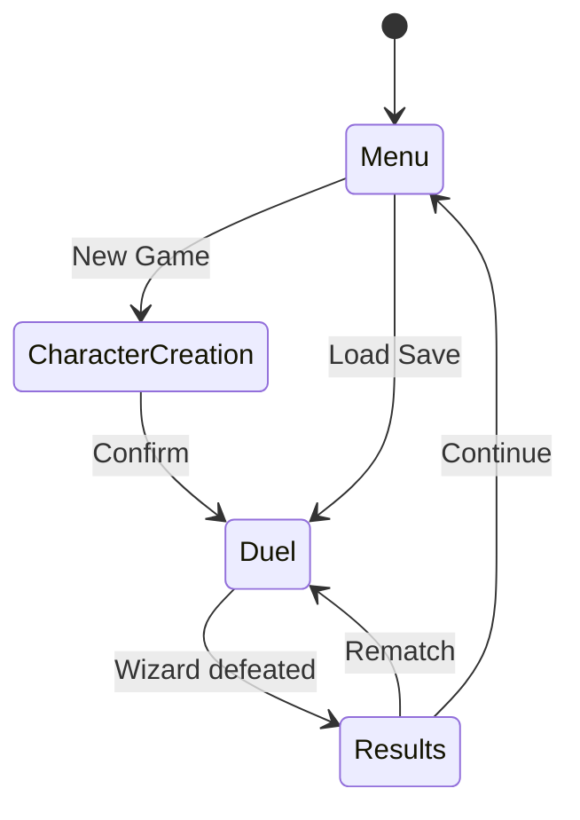

# Wizard Duel Engine — Reference Guide

> Comprehensive companion to the 4-act Rust course. Works as a standalone cheat sheet.

---

## 1. Rust Cheat Sheet

### Variables and Mutability

```rust
let hp = 100;           // immutable by default
let mut mana = 50;      // mutable — can reassign
mana -= 10;

// Shadowing — new binding, can change type
let name = "Gandalf";
let name = String::from(name); // now a String
```

```python
# Python — everything is mutable by default
hp = 100
mana = 50
mana -= 10
name = "Gandalf"
```

```typescript
// TypeScript
const hp = 100;        // immutable
let mana = 50;         // mutable
mana -= 10;
```

**In the project:** Wizard stats use `let mut` because HP/mana change each turn. Spell definitions use `let` because they're immutable after creation.

---

### Primitive Types

| Rust | Size | Range / Notes |
|------|------|---------------|
| `u8` | 1 byte | 0–255 (spell mana costs) |
| `i32` | 4 bytes | default integer (damage values) |
| `f64` | 8 bytes | default float (damage multipliers) |
| `bool` | 1 byte | `true` / `false` |
| `char` | 4 bytes | Unicode scalar (`'⚡'`) |
| `&str` | ptr+len | borrowed string slice (spell names in code) |
| `String` | heap | owned, growable (player-entered wizard name) |

```rust
let damage: i32 = 25;
let multiplier: f64 = 1.5;
let spell_name: &str = "Reducto";              // borrowed, static
let wizard_name: String = String::from("Harry"); // owned, heap
```

```python
# Python — no distinction, all dynamic
damage = 25
multiplier = 1.5
spell_name = "Reducto"
```

```typescript
// TypeScript — number covers int and float
const damage: number = 25;
const multiplier: number = 1.5;
const spellName: string = "Reducto";
```

**In the project:** `&str` for compile-time spell names, `String` for user input (wizard name, save file paths).

---

### Enums

```rust
// Simple enum — no data
enum SpellType {
    Offensive,
    Defensive,
    Cunning,
}

// Enum with data
enum StatusEffect {
    Burn { damage: i32, turns: i32 },
    Shield(i32),
    Stun,
    None,
}

// Matching
fn describe(effect: &StatusEffect) -> &str {
    match effect {
        StatusEffect::Burn { damage, .. } if *damage > 8 => "severe burn",
        StatusEffect::Burn { .. } => "burning",
        StatusEffect::Shield(hp) => "shielded",
        StatusEffect::Stun => "stunned",
        StatusEffect::None => "normal",
    }
}
```

```python
# Python — enum + dataclass combo
from enum import Enum
from dataclasses import dataclass

class SpellType(Enum):
    OFFENSIVE = "offensive"
    DEFENSIVE = "defensive"
    CUNNING = "cunning"

@dataclass
class Burn:
    damage: int
    turns: int
```

```typescript
// TypeScript — discriminated union
type StatusEffect =
  | { kind: "burn"; damage: number; turns: number }
  | { kind: "shield"; hp: number }
  | { kind: "stun" }
  | { kind: "none" };
```

**In the project:** `GameState` enum drives the state machine (Menu, CharacterCreation, Duel, Results). `SpellEffect` enum carries damage/heal/status data per variant.

---

### Structs

```rust
// Named fields
struct Wizard {
    name: String,
    hp: i32,
    max_hp: i32,
    mana: i32,
    level: u32,
}

// Tuple struct
struct Damage(i32);

// impl block — methods
impl Wizard {
    // Associated function (constructor)
    fn new(name: String) -> Self {
        Self { name, hp: 100, max_hp: 100, mana: 50, level: 1 }
    }

    // Method (borrows self)
    fn is_alive(&self) -> bool {
        self.hp > 0
    }

    // Mutable method
    fn take_damage(&mut self, amount: i32) {
        self.hp = (self.hp - amount).max(0);
    }
}
```

```python
@dataclass
class Wizard:
    name: str
    hp: int = 100
    max_hp: int = 100
    mana: int = 50
    level: int = 1

    def is_alive(self) -> bool:
        return self.hp > 0
```

```typescript
class Wizard {
  constructor(
    public name: string,
    public hp = 100,
    public maxHp = 100,
    public mana = 50,
    public level = 1,
  ) {}

  isAlive(): boolean {
    return this.hp > 0;
  }
}
```

**In the project:** `Wizard` struct holds all combatant state. `Spell` struct defines each spell's stats. `impl` blocks group behavior with data.

---

### Traits

```rust
// Define a trait
trait Combatant {
    fn name(&self) -> &str;
    fn hp(&self) -> i32;

    // Default method
    fn is_alive(&self) -> bool {
        self.hp() > 0
    }
}

// Implement for a type
impl Combatant for Wizard {
    fn name(&self) -> &str {
        &self.name
    }
    fn hp(&self) -> i32 {
        self.hp
    }
}

// Trait as parameter (static dispatch)
fn announce(c: &impl Combatant) {
    println!("{} has {} HP", c.name(), c.hp());
}

// Trait object (dynamic dispatch)
fn announce_dyn(c: &dyn Combatant) {
    println!("{} has {} HP", c.name(), c.hp());
}
```

```python
# Python — ABC
from abc import ABC, abstractmethod

class Combatant(ABC):
    @abstractmethod
    def name(self) -> str: ...

    @abstractmethod
    def hp(self) -> int: ...

    def is_alive(self) -> bool:  # default
        return self.hp() > 0
```

```typescript
// TypeScript — interface
interface Combatant {
  name(): string;
  hp(): number;
  isAlive(): boolean; // no default impl in interfaces
}
```

**In the project:** `AiStrategy` trait defines the AI interface. Different difficulty levels (RandomAi, TrackingAi, OptimalAi) implement it. The duel engine accepts `&dyn AiStrategy`.

---

### Pattern Matching

```rust
// match — exhaustive
match game_state {
    GameState::Menu => draw_menu(f),
    GameState::CharacterCreation => draw_creation(f),
    GameState::Duel { turn } => draw_duel(f, turn),
    GameState::Results { winner } => draw_results(f, &winner),
}

// if let — single pattern
if let Some(spell) = wizard.selected_spell() {
    cast(spell);
}

// while let — loop until pattern fails
while let Some(effect) = status_effects.pop() {
    apply(&mut wizard, effect);
}
```

```python
# Python 3.10+ match
match game_state:
    case "menu": draw_menu()
    case "duel": draw_duel()
```

```typescript
// TypeScript — switch on discriminant
switch (gameState.kind) {
  case "menu": drawMenu(); break;
  case "duel": drawDuel(); break;
}
```

**In the project:** `match` on `GameState` drives the main render loop. `if let` checks optional spell selection. `while let` drains status effect queues.

---

### Error Handling

```rust
use std::fs;

// Result<T, E> — recoverable errors
fn load_save(path: &str) -> Result<String, std::io::Error> {
    fs::read_to_string(path)  // returns Result
}

// ? operator — propagate errors
fn load_wizard(path: &str) -> Result<Wizard, Box<dyn std::error::Error>> {
    let data = fs::read_to_string(path)?;  // returns Err early if fails
    let wizard: Wizard = serde_json::from_str(&data)?;
    Ok(wizard)
}

// Option<T> — nullable values
fn find_spell(name: &str, spells: &[Spell]) -> Option<&Spell> {
    spells.iter().find(|s| s.name == name)
}

// unwrap vs expect
let spell = find_spell("Stupefy", &spells).unwrap();          // panics with generic msg
let spell = find_spell("Stupefy", &spells).expect("Stupefy missing"); // panics with context
```

```python
# Python — exceptions
def load_save(path: str) -> str:
    with open(path) as f:
        return f.read()  # raises IOError

def find_spell(name: str, spells: list) -> Spell | None:
    return next((s for s in spells if s.name == name), None)
```

```typescript
// TypeScript — try/catch or undefined
function loadSave(path: string): string { /* throws */ }
function findSpell(name: string, spells: Spell[]): Spell | undefined {
  return spells.find((s) => s.name === name);
}
```

**In the project:** Save/load uses `Result` with `?`. Spell lookup returns `Option`. Game logic uses `expect()` only for invariants that indicate bugs.

---

### Ownership and Borrowing

```rust
// Move — ownership transfers
let wizard = Wizard::new("Harry".into());
let winner = wizard;    // wizard is MOVED, can't use wizard anymore

// Borrow — shared reference
fn display(w: &Wizard) {       // borrows, doesn't own
    println!("{}", w.name);
}

// Mutable borrow — exclusive access
fn heal(w: &mut Wizard) {
    w.hp = (w.hp + 20).min(w.max_hp);
}

// The rules:
// 1. One &mut OR any number of & at a time — never both
// 2. References must always be valid (no dangling)

// Lifetime annotation (when compiler needs help)
fn longest_name<'a>(a: &'a Wizard, b: &'a Wizard) -> &'a str {
    if a.name.len() > b.name.len() { &a.name } else { &b.name }
}
```

```python
# Python — no ownership, everything is reference-counted
wizard = Wizard("Harry")
winner = wizard  # both point to same object
```

```typescript
// TypeScript — same as Python, GC handles it
const wizard = new Wizard("Harry");
const winner = wizard; // shared reference
```

**In the project:** The duel engine borrows both wizards mutably on alternating turns. Status effects are owned by each wizard's `Vec<StatusEffect>`. Spell references are borrowed from the spell registry.

---

### Collections

```rust
// Vec — growable array
let mut spells: Vec<Spell> = Vec::new();
spells.push(Spell::new("Stupefy", 2, 15));
let first = &spells[0];          // panics if empty
let first = spells.first();       // returns Option<&Spell>

// HashMap — key-value store
use std::collections::HashMap;
let mut xp_table: HashMap<u32, u32> = HashMap::new();
xp_table.insert(1, 0);
xp_table.insert(2, 100);
let xp = xp_table.get(&2);       // Option<&u32>

// Iterators — lazy, chainable
let high_damage: Vec<&Spell> = spells.iter()
    .filter(|s| s.damage > 20)
    .collect();

let total_mana: i32 = spells.iter()
    .map(|s| s.mana_cost)
    .sum();

let spell_names: Vec<&str> = spells.iter()
    .map(|s| s.name.as_str())
    .collect();
```

```python
spells = []
spells.append(Spell("Stupefy", 2, 15))
high_damage = [s for s in spells if s.damage > 20]
total_mana = sum(s.mana_cost for s in spells)
```

```typescript
const spells: Spell[] = [];
spells.push(new Spell("Stupefy", 2, 15));
const highDamage = spells.filter((s) => s.damage > 20);
const totalMana = spells.reduce((sum, s) => sum + s.manaCost, 0);
```

**In the project:** `Vec<Spell>` for each wizard's spell book. `Vec<StatusEffect>` for active effects. Iterators for damage calculation, AI spell evaluation, and rendering spell lists.

---

### Box and Trait Objects

```rust
// Box<T> — heap allocation
let wizard = Box::new(Wizard::new("Harry".into()));

// Box<dyn Trait> — dynamic dispatch (trait object)
trait AiStrategy {
    fn choose_spell(&self, state: &DuelState) -> &Spell;
}

struct RandomAi;
struct TrackingAi { history: Vec<String> }

impl AiStrategy for RandomAi { /* ... */ }
impl AiStrategy for TrackingAi { /* ... */ }

// Store different AI types in one variable
fn create_ai(difficulty: u8) -> Box<dyn AiStrategy> {
    match difficulty {
        1 => Box::new(RandomAi),
        2 => Box::new(TrackingAi { history: vec![] }),
        _ => Box::new(RandomAi),
    }
}
```

**How vtables work:**

```
Box<dyn AiStrategy> is a "fat pointer":
  [pointer to data on heap] + [pointer to vtable]

vtable for RandomAi:
  ┌──────────────────────────┐
  │ drop()                   │
  │ size / alignment         │
  │ choose_spell() ──→ RandomAi::choose_spell │
  └──────────────────────────┘
```

The compiler generates one vtable per (Type, Trait) pair. At runtime, calling `ai.choose_spell()` does one pointer indirection through the vtable — small cost, big flexibility.

```python
# Python — duck typing, no Box needed
def create_ai(difficulty: int) -> AiStrategy:
    return RandomAi() if difficulty == 1 else TrackingAi()
```

```typescript
// TypeScript — interfaces, no boxing
function createAi(difficulty: number): AiStrategy {
  return difficulty === 1 ? new RandomAi() : new TrackingAi();
}
```

**In the project:** `Box<dyn AiStrategy>` lets the duel engine work with any AI difficulty without knowing the concrete type. Chosen at character creation, used throughout the duel.

---

### Closures

```rust
// Fn — borrows captured variables (can call multiple times)
let threshold = 20;
let is_strong = |spell: &Spell| spell.damage > threshold;
let strong_spells: Vec<_> = spells.iter().filter(|s| is_strong(s)).collect();

// FnMut — mutably borrows captures
let mut count = 0;
let mut counter = || { count += 1; count };
counter(); // 1
counter(); // 2

// FnOnce — consumes captures (can only call once)
let name = String::from("Harry");
let greet = move || println!("Hello, {}!", name);
greet();
// name is moved into the closure, can't use it here
```

```python
# Python — closures capture by reference
threshold = 20
is_strong = lambda s: s.damage > threshold
```

```typescript
// TypeScript — closures capture by reference
const threshold = 20;
const isStrong = (s: Spell) => s.damage > threshold;
```

**In the project:** Closures used heavily with iterators for filtering spells, calculating damage, and sorting AI options. `Fn` closures for reusable predicates, `FnMut` for accumulating combat log entries.

---

### Modules and Visibility

```rust
// File: src/main.rs
mod wizard;       // loads src/wizard.rs or src/wizard/mod.rs
mod spells;
mod duel;
mod ui;

use wizard::Wizard;
use spells::{Spell, SpellType};

// File: src/wizard.rs
pub struct Wizard {       // pub = visible outside module
    pub name: String,     // pub field
    hp: i32,              // private field — only this module
}

impl Wizard {
    pub fn new(name: String) -> Self { /* ... */ }  // pub method
    fn calculate_defense(&self) -> i32 { /* ... */ } // private
}
```

```python
# Python — files are modules, _ prefix convention
# wizard.py
class Wizard:
    def __init__(self, name: str):
        self.name = name      # public
        self._hp = 100        # "private" by convention
```

```typescript
// TypeScript — export keyword
// wizard.ts
export class Wizard {
  constructor(public name: string, private hp = 100) {}
}
```

**In the project:** `mod wizard`, `mod spells`, `mod duel`, `mod ai`, `mod ui` — each game system in its own module. `pub` on structs/methods that cross module boundaries, private for internal logic.


---

## 2. Game Design Patterns

### State Machine

The game is driven by a state machine. Each state owns its data and defines valid transitions.

```rust
enum GameState {
    Menu,
    CharacterCreation { name_input: String },
    Duel {
        player: Wizard,
        opponent: Wizard,
        ai: Box<dyn AiStrategy>,
        turn: u32,
    },
    Results {
        winner: String,
        xp_earned: u32,
    },
}
```



**Transitions in code:**

```rust
fn handle_input(state: &mut GameState, key: KeyCode) {
    *state = match state {
        GameState::Menu => match key {
            KeyCode::Char('n') => GameState::CharacterCreation {
                name_input: String::new(),
            },
            _ => return,
        },
        GameState::Results { .. } => match key {
            KeyCode::Char('m') => GameState::Menu,
            _ => return,
        },
        _ => return,
    };
}
```

---

### Type Triangle (Rock-Paper-Scissors Balance)

```
    Offensive
     /      \
  strong   strong
  against  against
   /          \
Cunning ←———→ Defensive
       strong
       against
```

| Attacker | Strong Against | Weak Against |
|----------|---------------|--------------|
| Offensive | Cunning (1.5x) | Defensive (0.75x) |
| Defensive | Offensive (1.5x) | Cunning (0.75x) |
| Cunning | Defensive (1.5x) | Offensive (0.75x) |

```rust
fn type_modifier(attacker: SpellType, defender_last: SpellType) -> f64 {
    match (attacker, defender_last) {
        (SpellType::Offensive, SpellType::Cunning)   => 1.5,
        (SpellType::Defensive, SpellType::Offensive)  => 1.5,
        (SpellType::Cunning, SpellType::Defensive)    => 1.5,
        (SpellType::Offensive, SpellType::Defensive)  => 0.75,
        (SpellType::Defensive, SpellType::Cunning)    => 0.75,
        (SpellType::Cunning, SpellType::Offensive)    => 0.75,
        _ => 1.0,
    }
}
```

---

### AI Difficulty Scaling

| Level | Strategy | Description |
|-------|----------|-------------|
| Easy | `RandomAi` | Picks a random affordable spell |
| Medium | `TrackingAi` | Tracks player patterns, counters most-used type |
| Hard | `OptimalAi` | Evaluates all spells by expected value, picks best |

```rust
trait AiStrategy {
    fn choose_spell<'a>(
        &self,
        available: &'a [Spell],
        mana: i32,
        state: &DuelState,
    ) -> &'a Spell;
}

struct TrackingAi {
    player_history: Vec<SpellType>,
}

impl AiStrategy for TrackingAi {
    fn choose_spell<'a>(
        &self,
        available: &'a [Spell],
        mana: i32,
        state: &DuelState,
    ) -> &'a Spell {
        let most_used = self.most_common_type();
        let counter_type = counter_for(most_used);
        available.iter()
            .filter(|s| s.mana_cost <= mana && s.spell_type == counter_type)
            .max_by_key(|s| s.damage)
            .unwrap_or(&available[0])
    }
}
```

---

### Turn-Based Game Loop

```
┌─────────────────────────────────────────┐
│              GAME LOOP                  │
│                                         │
│  1 - Handle input (key events)          │
│  2 - Update game state                  │
│      a. Apply status effects (tick)     │
│      b. Resolve player spell            │
│      c. AI chooses + resolves spell     │
│      d. Check win/loss conditions       │
│      e. Regenerate mana (+3/turn)       │
│  3 - Render UI                          │
│  4 - Repeat until quit or game over     │
│                                         │
└─────────────────────────────────────────┘
```

```rust
fn game_loop(terminal: &mut Terminal<impl Backend>) -> Result<()> {
    let mut state = GameState::Menu;
    loop {
        terminal.draw(|f| render(&state, f))?;

        if event::poll(Duration::from_millis(100))? {
            if let Event::Key(key) = event::read()? {
                if key.code == KeyCode::Char('q') {
                    break;
                }
                handle_input(&mut state, key.code);
            }
        }

        if let GameState::Duel { .. } = &mut state {
            tick_status_effects(&mut state);
        }
    }
    Ok(())
}
```

---

### Entity-Component Pattern

Wizards are composed of independent data components:

```rust
struct Stats {
    hp: i32,
    max_hp: i32,
    mana: i32,
    max_mana: i32,
    level: u32,
    xp: u32,
}

struct SpellBook {
    known_spells: Vec<Spell>,
    selected: Option<usize>,
}

struct StatusEffects {
    active: Vec<ActiveEffect>,
}

struct ActiveEffect {
    effect: StatusEffect,
    remaining_turns: i32,
    source: String,
}

// Wizard composes all components
struct Wizard {
    name: String,
    stats: Stats,
    spell_book: SpellBook,
    status_effects: StatusEffects,
}
```

This keeps each concern (stats, spells, effects) independently testable and modifiable.

---

### Damage Formula

```
final_damage = base_damage × type_modifier × variance × (1 - shield_reduction)
```

| Component | Source | Range |
|-----------|--------|-------|
| `base_damage` | Spell definition | 5–50 |
| `type_modifier` | Attacker vs defender type | 0.75, 1.0, or 1.5 |
| `variance` | Random factor | 0.85–1.15 |
| `shield_reduction` | Active Protego | 0.0–1.0 |

```rust
fn calculate_damage(
    spell: &Spell,
    attacker_type: SpellType,
    defender_last_type: SpellType,
    shield: i32,
    rng: &mut impl Rng,
) -> i32 {
    let base = spell.damage as f64;
    let type_mod = type_modifier(attacker_type, defender_last_type);
    let variance = rng.gen_range(0.85..=1.15);
    let raw = (base * type_mod * variance) as i32;
    (raw - shield).max(0)
}
```


---

## 3. ratatui Widget Reference

> Based on ratatui 0.30 (crossterm 0.29 backend). The crate was split into `ratatui-core` and `ratatui-widgets` in 0.30, but the main `ratatui` crate re-exports everything.

### Terminal Setup / Teardown

```rust
use std::io;
use ratatui::{
    crossterm::{
        execute,
        terminal::{disable_raw_mode, enable_raw_mode,
                   EnterAlternateScreen, LeaveAlternateScreen},
    },
    prelude::*,
};

fn main() -> Result<(), Box<dyn std::error::Error>> {
    // Setup
    enable_raw_mode()?;
    let mut stdout = io::stdout();
    execute!(stdout, EnterAlternateScreen)?;
    let mut terminal = Terminal::new(CrosstermBackend::new(stdout))?;

    // Run app
    let result = run_app(&mut terminal);

    // Teardown (always runs, even on error)
    disable_raw_mode()?;
    execute!(terminal.backend_mut(), LeaveAlternateScreen)?;
    terminal.show_cursor()?;

    result
}
```

**Panic-safe teardown** — install a panic hook so the terminal restores even on crash:

```rust
use std::panic;

fn install_panic_hook() {
    let original_hook = panic::take_hook();
    panic::set_hook(Box::new(move |panic_info| {
        let _ = disable_raw_mode();
        let _ = execute!(io::stdout(), LeaveAlternateScreen);
        original_hook(panic_info);
    }));
}
```

---

### Layout System

ratatui uses a Cassowary constraint solver. Layouts divide a `Rect` into sub-areas.

```rust
use ratatui::prelude::*;

// Vertical split — header / content / footer
let [header, content, footer] = Layout::vertical([
    Constraint::Length(3),     // fixed 3 rows
    Constraint::Fill(1),       // takes remaining space
    Constraint::Length(1),     // fixed 1 row
])
.areas(frame.area());

// Horizontal split inside content
let [sidebar, main] = Layout::horizontal([
    Constraint::Length(20),    // fixed 20 columns
    Constraint::Fill(1),       // rest
])
.areas(content);
```

**Constraint types:**

| Constraint | Meaning |
|-----------|---------|
| `Length(n)` | Exactly n cells |
| `Min(n)` | At least n cells |
| `Max(n)` | At most n cells |
| `Percentage(n)` | n% of available space |
| `Ratio(a, b)` | a/b of available space |
| `Fill(weight)` | Fill remaining space (weighted) |

**Flex** controls how leftover space is distributed:

```rust
Layout::horizontal([Constraint::Length(10), Constraint::Length(10)])
    .flex(Flex::Center)    // center the two chunks
    .areas(area);
```

Flex options: `Start` (default), `Center`, `End`, `SpaceAround`, `SpaceBetween`.

---

### Common Widgets

#### Block — container with borders and title

```rust
use ratatui::widgets::{Block, Borders};

let block = Block::default()
    .title(" Wizard Stats ")
    .borders(Borders::ALL)
    .border_style(Style::default().fg(Color::Cyan));

frame.render_widget(block, area);
```

#### Paragraph — styled text

```rust
use ratatui::widgets::Paragraph;
use ratatui::text::{Line, Span};

let text = vec![
    Line::from(vec![
        Span::styled("HP: ", Style::default().fg(Color::Gray)),
        Span::styled("85/100", Style::default().fg(Color::Green).bold()),
    ]),
    Line::from(vec![
        Span::styled("Mana: ", Style::default().fg(Color::Gray)),
        Span::styled("30/50", Style::default().fg(Color::Blue).bold()),
    ]),
];

let paragraph = Paragraph::new(text)
    .block(Block::default().title(" Status ").borders(Borders::ALL))
    .wrap(ratatui::widgets::Wrap { trim: true });

frame.render_widget(paragraph, area);
```

#### List — selectable items

```rust
use ratatui::widgets::{List, ListItem, ListState};

let items: Vec<ListItem> = spells.iter().map(|s| {
    ListItem::new(format!("{} ({}mp)", s.name, s.mana_cost))
}).collect();

let list = List::new(items)
    .block(Block::default().title(" Spells ").borders(Borders::ALL))
    .highlight_style(Style::default().bg(Color::DarkGray).bold())
    .highlight_symbol("▶ ");

// StatefulWidget — needs ListState for selection tracking
let mut list_state = ListState::default().with_selected(Some(0));
frame.render_stateful_widget(list, area, &mut list_state);
```

#### Table — data grid

```rust
use ratatui::widgets::{Table, Row, Cell};

let header = Row::new(vec!["Spell", "Type", "Mana", "Damage"])
    .style(Style::default().fg(Color::Yellow).bold())
    .bottom_margin(1);

let rows: Vec<Row> = spells.iter().map(|s| {
    Row::new(vec![
        Cell::from(s.name.as_str()),
        Cell::from(format!("{:?}", s.spell_type)),
        Cell::from(s.mana_cost.to_string()),
        Cell::from(s.damage.to_string()),
    ])
}).collect();

let table = Table::new(rows, [
    Constraint::Length(20),
    Constraint::Length(12),
    Constraint::Length(6),
    Constraint::Length(8),
])
.header(header)
.block(Block::default().title(" Spell Book ").borders(Borders::ALL));

frame.render_widget(table, area);
```

#### Gauge — HP/mana bars

```rust
use ratatui::widgets::Gauge;

let hp_pct = (wizard.hp as f64 / wizard.max_hp as f64 * 100.0) as u16;
let hp_color = if hp_pct > 50 { Color::Green }
    else if hp_pct > 25 { Color::Yellow }
    else { Color::Red };

let gauge = Gauge::default()
    .block(Block::default().title(" HP "))
    .gauge_style(Style::default().fg(hp_color))
    .percent(hp_pct)
    .label(format!("{}/{}", wizard.hp, wizard.max_hp));

frame.render_widget(gauge, area);
```

#### Tabs — game state navigation

```rust
use ratatui::widgets::Tabs;

let titles = vec!["Menu", "Duel", "Spells", "Stats"];
let tabs = Tabs::new(titles)
    .block(Block::default().borders(Borders::BOTTOM))
    .select(current_tab)
    .style(Style::default().fg(Color::Gray))
    .highlight_style(Style::default().fg(Color::Cyan).bold());

frame.render_widget(tabs, area);
```

---

### Styling

```rust
use ratatui::style::{Style, Color, Modifier};

// Named colors
Style::default().fg(Color::Red).bg(Color::Black);

// RGB colors
Style::default().fg(Color::Rgb(255, 165, 0)); // orange

// Indexed (256-color)
Style::default().fg(Color::Indexed(208));

// Modifiers
Style::default()
    .add_modifier(Modifier::BOLD)
    .add_modifier(Modifier::ITALIC);

// Shorthand (ratatui 0.26+)
Style::default().fg(Color::Cyan).bold().italic();
```

---

### Event Handling with crossterm

```rust
use ratatui::crossterm::event::{self, Event, KeyCode, KeyEvent, KeyModifiers};
use std::time::Duration;

fn handle_events() -> Result<Option<KeyCode>, Box<dyn std::error::Error>> {
    if event::poll(Duration::from_millis(100))? {
        if let Event::Key(KeyEvent {
            code,
            modifiers,
            kind: event::KeyEventKind::Press,
            ..
        }) = event::read()?
        {
            // Ctrl+C to quit
            if modifiers.contains(KeyModifiers::CONTROL) && code == KeyCode::Char('c') {
                return Ok(Some(KeyCode::Char('q')));
            }
            return Ok(Some(code));
        }
    }
    Ok(None)
}
```

> **Important:** Filter on `KeyEventKind::Press` to avoid duplicate events on Windows (which sends Press + Release).

---

### App Architecture Pattern

```rust
struct App {
    state: GameState,
    spell_list_state: ListState,
    combat_log: Vec<String>,
    should_quit: bool,
}

impl App {
    fn new() -> Self {
        Self {
            state: GameState::Menu,
            spell_list_state: ListState::default(),
            combat_log: Vec::new(),
            should_quit: false,
        }
    }

    fn handle_key(&mut self, key: KeyCode) {
        match &mut self.state {
            GameState::Menu => self.handle_menu_key(key),
            GameState::Duel { .. } => self.handle_duel_key(key),
            // ...
            _ => {}
        }
    }

    fn render(&mut self, frame: &mut Frame) {
        match &self.state {
            GameState::Menu => self.render_menu(frame),
            GameState::Duel { .. } => self.render_duel(frame),
            // ...
            _ => {}
        }
    }
}

// Main loop
fn run_app(terminal: &mut Terminal<impl Backend>) -> Result<()> {
    let mut app = App::new();
    while !app.should_quit {
        terminal.draw(|f| app.render(f))?;
        if let Some(key) = handle_events()? {
            app.handle_key(key);
        }
    }
    Ok(())
}
```


---

## 4. Spell Balance Spreadsheet

### Offensive Spells

| Spell | Type | Mana | Damage | Effect | Unlock | DPM | Notes |
|-------|------|------|--------|--------|--------|-----|-------|
| Stupefy | Offensive | 2 | 15 | — | Lv 1 | 7.50 | Bread-and-butter opener. Best mana efficiency in the game |
| Expelliarmus | Offensive | 3 | 10 | Disarm 1t | Lv 1 | 3.33+ | Low raw DPM but Disarm skips opponent's next spell. Effective DPM much higher |
| Reducto | Offensive | 4 | 25 | — | Lv 3 | 6.25 | Pure damage workhorse. Solid mid-game pick |
| Confringo | Offensive | 5 | 20 | Burn 5/t × 2t | Lv 5 | 6.00 | Total: 20 + 10 = 30 effective damage. DPM with burn = 6.00 |
| Sectumsempra | Offensive | 7 | 35 | Bleed 3/t × 3t | Lv 8 | 6.29 | Total: 35 + 9 = 44 effective damage. Effective DPM = 6.29 |
| Avada Kedavra | Offensive | 10 | 50 | Instakill if target < 20 HP | Lv 10 | 5.00+ | Finisher. Raw DPM is low but instakill makes it lethal below threshold |

### Defensive Spells

| Spell | Type | Mana | Damage | Effect | Unlock | DPM | Notes |
|-------|------|------|--------|--------|--------|-----|-------|
| Protego | Defensive | 2 | 0 | Shield 15 | Lv 1 | — | Absorbs 15 damage. Efficient at 2 mana. Use preemptively |
| Episkey | Defensive | 3 | 0 | Heal 20 HP | Lv 2 | — | 6.67 HP/mana. Core sustain spell |
| Impedimenta | Defensive | 3 | 10 | Slow 1t | Lv 4 | 3.33+ | Hybrid: deals damage AND delays opponent. Slow halves next spell damage |
| Protego Maxima | Defensive | 5 | 0 | Shield 30 + Reflect 10 | Lv 6 | — | Absorbs 30 AND deals 10 back. Net value = 40 HP swing for 5 mana |
| Vulnera Sanentur | Defensive | 6 | 0 | Heal 35 + Cure all | Lv 7 | — | 5.83 HP/mana + removes burns/bleeds. Best heal when debuffed |
| Fianto Duri | Defensive | 8 | 0 | Immune 1 turn | Lv 9 | — | Complete immunity. Expensive but counters Avada Kedavra and burst combos |

### Cunning Spells

| Spell | Type | Mana | Damage | Effect | Unlock | DPM | Notes |
|-------|------|------|--------|--------|--------|-----|-------|
| Petrificus Totalus | Cunning | 2 | 10 | Stun 50% chance | Lv 1 | 5.00+ | Coin flip stun. High variance but amazing when it lands |
| Confundo | Cunning | 3 | 5 | Confuse 30% (random spell) | Lv 2 | 1.67+ | Forces opponent to cast random spell 30% of the time. Disrupts strategy |
| Obliviate | Cunning | 4 | 0 | Steal 3 mana | Lv 4 | — | Net 3 mana swing (you gain 3, they lose 3 = 6 mana delta). Starves opponent |
| Serpensortia | Cunning | 4 | 15 | +8 damage next turn | Lv 5 | 3.75+ | Setup spell. If followed by Reducto: 25+8 = 33 for 4+4 = 8 mana total |
| Imperio | Cunning | 6 | 0 | Control opponent 1t | Lv 8 | — | Force opponent to waste a turn or cast a weak spell. Devastating tempo play |
| Fiendfyre | Cunning | 9 | 30 | Burn BOTH 10/t × 2t | Lv 10 | 3.33* | Total: 30 + 20 to opponent, but YOU take 20 too. Use when ahead on HP |

### DPM Analysis Summary

| Tier | Spells | Strategy |
|------|--------|----------|
| Best raw DPM | Stupefy (7.50), Reducto (6.25) | Mana-efficient damage dealing |
| Best effective DPM | Sectumsempra (6.29), Confringo (6.00) | DoT adds up over turns |
| Best utility | Expelliarmus, Imperio, Obliviate | Tempo and disruption |
| Best sustain | Episkey (6.67 HP/mana), Vulnera Sanentur | Keep HP high |
| Best finisher | Avada Kedavra, Fiendfyre | Close out low-HP opponents |

**Key insight:** Stupefy has the best raw DPM in the game. New players should spam it. Advanced play involves setting up combos (Serpensortia → Reducto) and reading the opponent's type to exploit the triangle.


---

## 5. Progression Table

| Level | XP Required | Cumulative XP | HP | Mana | Reward |
|-------|-------------|---------------|-----|------|--------|
| 1 | 0 | 0 | 100 | 50 | Starting spells: Stupefy, Protego, Petrificus Totalus |
| 2 | 100 | 100 | 110 | 55 | Unlock: Episkey, Confundo |
| 3 | 150 | 250 | 120 | 60 | Unlock: Reducto |
| 4 | 200 | 450 | 130 | 65 | Unlock: Impedimenta, Obliviate |
| 5 | 300 | 750 | 140 | 70 | Unlock: Confringo, Serpensortia |
| 6 | 400 | 1150 | 150 | 75 | Unlock: Protego Maxima |
| 7 | 500 | 1650 | 160 | 80 | Unlock: Vulnera Sanentur |
| 8 | 650 | 2300 | 170 | 85 | Unlock: Sectumsempra, Imperio |
| 9 | 800 | 3100 | 180 | 90 | Unlock: Fianto Duri |
| 10 | 1000 | 4100 | 200 | 100 | Unlock: Avada Kedavra, Fiendfyre |

### XP Awards

| Outcome | Base XP | Bonus |
|---------|---------|-------|
| Win | 50 | +10 per opponent level above yours |
| Loss | 15 | — |
| No damage taken | — | +20 bonus |
| Used 6+ unique spells | — | +15 bonus |
| Win in under 10 turns | — | +10 bonus |

### Stat Growth

```
HP  per level: +10 (100 → 200 at level 10)
Mana per level: +5  (50 → 100 at level 10)
Mana regen:     +3/turn (constant, all levels)
```

---

## 6. Common Errors and Solutions

### Borrow Checker: simultaneous mutable and immutable borrow

**Error message:**

```
error[E0502]: cannot borrow `wizard` as mutable because it is also
              borrowed as immutable
  --> src/duel.rs:42:5
   |
40 |     let name = &wizard.name;
   |                ------- immutable borrow occurs here
41 |
42 |     wizard.take_damage(10);
   |     ^^^^^^^^^^^^^^^^^^^^^^ mutable borrow occurs here
43 |     println!("{}", name);
   |                    ---- immutable borrow later used here
```

**Why:** Rust prevents mutation while something else holds a read reference. If `take_damage` could reallocate `wizard`'s internals, `name` would be a dangling pointer.

**Fix:** Clone the data you need before mutating, or restructure to not hold the borrow across the mutation:

```rust
// Option A: clone first
let name = wizard.name.clone();
wizard.take_damage(10);
println!("{}", name);

// Option B: limit borrow scope
{
    let name = &wizard.name;
    println!("{}", name);
}
wizard.take_damage(10);
```

---

### Enum Matching: non-exhaustive patterns

**Error message:**

```
error[E0004]: non-exhaustive patterns: `GameState::Results { .. }` not covered
  --> src/main.rs:25:11
   |
25 |     match state {
   |           ^^^^^ pattern `GameState::Results { .. }` not covered
```

**Why:** `match` in Rust must handle every variant. If you add a new variant to an enum, every `match` on it breaks until updated.

**Fix:** Handle all variants, or add a wildcard:

```rust
// Handle all explicitly (preferred — compiler catches missing cases)
match state {
    GameState::Menu => { /* ... */ }
    GameState::CharacterCreation { .. } => { /* ... */ }
    GameState::Duel { .. } => { /* ... */ }
    GameState::Results { .. } => { /* ... */ }
}

// Or use wildcard (only when you truly don't care)
match state {
    GameState::Duel { .. } => handle_duel(),
    _ => {} // everything else: do nothing
}
```

---

### Trait Objects: cannot be made into an object

**Error message:**

```
error[E0038]: the trait `AiStrategy` cannot be made into an object
  --> src/ai.rs:10:20
   |
10 |     ai: Box<dyn AiStrategy>,
   |                 ^^^^^^^^^^ `AiStrategy` cannot be made into an object
   |
   = note: the trait cannot be made into an object because it requires `Self: Sized`
```

**Why:** Trait objects use dynamic dispatch via vtables. Some trait features are incompatible:
- Generic methods (compiler can't know which monomorphization to put in vtable)
- Methods returning `Self` (size unknown at compile time)
- `Self: Sized` bound

**Fix:** Remove the incompatible feature or use a workaround:

```rust
// BAD — generic method prevents object safety
trait AiStrategy {
    fn evaluate<T: Spell>(&self, spell: &T) -> i32;
}

// GOOD — use concrete types or trait objects instead
trait AiStrategy {
    fn evaluate(&self, spell: &dyn SpellLike) -> i32;
}

// BAD — returns Self
trait AiStrategy {
    fn clone_strategy(&self) -> Self;
}

// GOOD — return Box<dyn Trait>
trait AiStrategy {
    fn clone_strategy(&self) -> Box<dyn AiStrategy>;
}
```

---

### Serde: expected struct, found enum

**Error message:**

```
Error: expected struct SpellEffect, found enum
  --> save.json:15:20
   |
   = note: invalid type: string "Burn", expected struct SpellEffect
```

**Why:** Serde's default enum representation doesn't match what you saved. If you change the enum representation (e.g., add `#[serde(tag = "type")]`) after saving data, old saves break.

**Fix:** Use explicit serde representation and keep it consistent:

```rust
use serde::{Serialize, Deserialize};

// Externally tagged (default) — {"Burn": {"damage": 5, "turns": 2}}
#[derive(Serialize, Deserialize)]
enum StatusEffect {
    Burn { damage: i32, turns: i32 },
    Shield(i32),
    Stun,
}

// Internally tagged — {"type": "Burn", "damage": 5, "turns": 2}
#[derive(Serialize, Deserialize)]
#[serde(tag = "type")]
enum StatusEffect {
    Burn { damage: i32, turns: i32 },
    // Shield(i32) won't work with internal tagging — needs named fields
    Shield { amount: i32 },
    Stun,
}

// Adjacently tagged — {"t": "Burn", "c": {"damage": 5, "turns": 2}}
#[derive(Serialize, Deserialize)]
#[serde(tag = "t", content = "c")]
enum StatusEffect {
    Burn { damage: i32, turns: i32 },
    Shield(i32),  // tuple variants work here
    Stun,
}
```

**Tip:** Pick a representation in Act 2 and stick with it. Add `#[serde(rename_all = "snake_case")]` for clean JSON keys.

---

### ratatui: terminal not restored after panic

**Symptom:** Your program panics and the terminal is stuck in raw mode — no echo, no line editing, garbled output.

**Why:** `enable_raw_mode()` and `EnterAlternateScreen` change terminal state. If the program panics before the teardown code runs, the terminal stays in that state.

**Fix:** Install a panic hook that restores the terminal before printing the panic message:

```rust
use std::panic;
use std::io;
use ratatui::crossterm::{
    execute,
    terminal::{disable_raw_mode, LeaveAlternateScreen},
};

fn install_panic_hook() {
    let original_hook = panic::take_hook();
    panic::set_hook(Box::new(move |panic_info| {
        // Restore terminal FIRST
        let _ = disable_raw_mode();
        let _ = execute!(io::stdout(), LeaveAlternateScreen);
        // Then print the panic
        original_hook(panic_info);
    }));
}

fn main() -> Result<(), Box<dyn std::error::Error>> {
    install_panic_hook(); // call before anything else
    // ... rest of setup
    Ok(())
}
```

**Alternative:** Use `color_eyre` which provides this automatically:

```rust
use color_eyre::eyre::Result;

fn main() -> Result<()> {
    color_eyre::install()?; // installs panic + error hooks
    // ...
    Ok(())
}
```

**Quick recovery if you forgot:** Run `reset` in your terminal to restore it to a sane state.

---

### Bonus: Lifetime Errors in Trait Implementations

**Error message:**

```
error[E0621]: explicit lifetime required in the type of `spells`
  --> src/ai.rs:20:9
   |
18 |     fn choose_spell(&self, spells: &[Spell]) -> &Spell {
   |                                    -------- help: add explicit lifetime `'a`
```

**Why:** The compiler can't figure out which input lifetime the return reference is tied to. With `&self` and `&[Spell]`, it's ambiguous.

**Fix:** Add explicit lifetime annotations:

```rust
// Tell the compiler: the returned reference lives as long as `spells`
fn choose_spell<'a>(&self, spells: &'a [Spell]) -> &'a Spell {
    &spells[0]
}
```

**Rule of thumb:** If a method takes `&self` and another reference, and returns a reference, you usually need to annotate which input the output borrows from.

---

## Quick Reference Card

```
┌─────────────────────────────────────────────────────────┐
│  WIZARD DUEL ENGINE — QUICK REFERENCE                   │
├─────────────────────────────────────────────────────────┤
│                                                         │
│  OWNERSHIP          │  COLLECTIONS                      │
│  let x = val;  move │  Vec::new()    push, pop, iter    │
│  &x       borrow    │  HashMap::new() insert, get       │
│  &mut x   mut borrow│  .iter().filter().map().collect() │
│                      │                                   │
│  ENUMS              │  ERROR HANDLING                    │
│  enum E { A, B(T) } │  Result<T,E>   Ok(v) / Err(e)    │
│  match e { A => ..} │  Option<T>     Some(v) / None     │
│                      │  ?             propagate error    │
│  TRAITS             │                                    │
│  trait T { fn f(); } │  RATATUI                          │
│  impl T for S { .. } │  Layout::vertical([constraints])  │
│  Box<dyn T>  dynamic │  frame.render_widget(w, area)     │
│                      │  terminal.draw(|f| render(f))     │
│  TYPE TRIANGLE      │                                    │
│  Off > Cun > Def    │  DAMAGE FORMULA                   │
│  Def > Off > Cun    │  base * type_mod * variance       │
│  1.5x strong        │  - shield_reduction               │
│  0.75x weak         │  variance: 0.85 to 1.15           │
│                                                         │
└─────────────────────────────────────────────────────────┘
```
